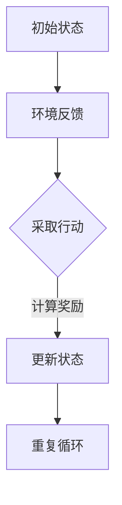
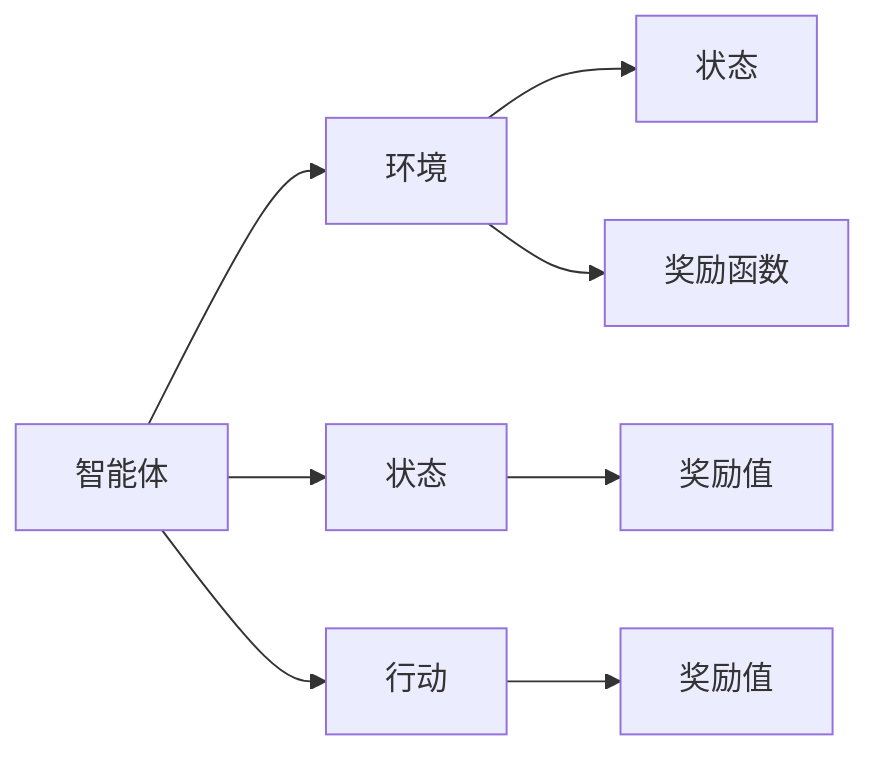
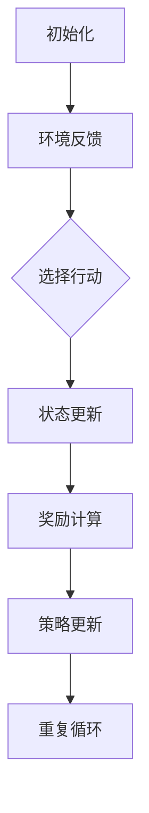
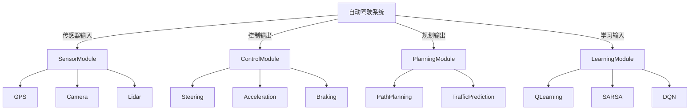
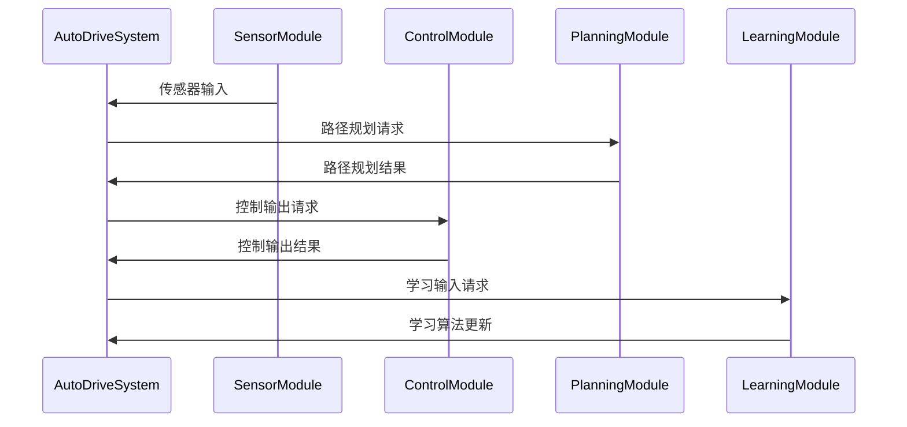

                 

### 《Reward Model训练的稳定性问题探讨》

#### 关键词：Reward Model、稳定性、训练、算法、系统架构、案例分析

> 摘要：本文旨在深入探讨Reward Model训练过程中遇到的稳定性问题，分析其成因，并提出相应的解决方案。文章将分为多个部分，包括背景介绍、核心概念与联系、算法原理讲解、数学模型和公式、系统分析与架构设计、项目实战以及最佳实践、小结和注意事项等内容。通过这篇文章，读者将了解Reward Model的基本概念、稳定性问题的严重性、相关算法的原理和实现，以及如何在实践中解决这些问题。

---

### 目录大纲设计思路

为了设计出《Reward Model训练的稳定性问题探讨》这本书的完整目录大纲，我们首先需要明确书籍的核心内容和目标读者。这本书的目标是探讨Reward Model训练过程中遇到的稳定性问题，分析原因，提供解决方案，并总结最佳实践。因此，我们的目录设计思路将围绕以下几个方面展开：

1. **背景介绍**：介绍问题背景、问题描述、问题解决、边界与外延，以及核心概念和要素组成。
2. **核心概念与联系**：详细解释Reward Model及其相关概念，列出概念属性特征对比表格，并绘制ER实体关系图。
3. **算法原理讲解**：使用mermaid绘制算法流程图，使用Python源代码和latex公式详细阐述算法原理。
4. **数学模型和公式**：使用latex格式给出数学模型和公式，并进行详细讲解和举例说明。
5. **系统分析与架构设计**：介绍问题场景，绘制系统功能设计类图、系统架构设计图、系统接口设计和系统交互序列图。
6. **项目实战**：描述环境安装、系统核心实现源代码，代码应用解读与分析，实际案例分析和详细讲解剖析，最后进行项目小结。
7. **最佳实践、小结、注意事项、拓展阅读**：总结最佳实践，提醒注意事项，提供拓展阅读资源。

通过以上设计思路，我们能够确保目录大纲内容全面、结构清晰，同时满足书籍的读者需求，帮助他们更好地理解和应用Reward Model训练的稳定性问题解决方案。

---

### 完整目录大纲

以下是根据上述设计思路，为《Reward Model训练的稳定性问题探讨》设计的完整目录大纲：

----------------------------------------------------------------

## 第一部分：背景与核心概念

### 第1章：问题背景与核心概念

#### 1.1 问题背景

##### 1.1.1 人工智能与Reward Model的发展

##### 1.1.2 训练过程中的稳定性问题

##### 1.1.3 稳定性问题的重要性

#### 1.2 Reward Model的定义与分类

##### 1.2.1 Reward Model的基本定义

##### 1.2.2 Reward Model的分类

##### 1.2.3 Reward Model的核心要素

#### 1.3 稳定性问题的边界与外延

##### 1.3.1 稳定性问题的定义

##### 1.3.2 稳定性问题的分类

##### 1.3.3 稳定性问题的研究现状

## 第二部分：核心概念与联系

### 第2章：核心概念原理与特征对比

#### 2.1 Reward Model的核心原理

##### 2.1.1 基本原理概述

##### 2.1.2 原理的数学模型

##### 2.1.3 原理的mermaid流程图

#### 2.2 Reward Model的属性特征对比

##### 2.2.1 属性特征对比表格

##### 2.2.2 不同类型Reward Model的对比

#### 2.3 ER实体关系图架构

##### 2.3.1 ER实体关系图概述

##### 2.3.2 图的mermaid表示

## 第三部分：算法原理讲解

### 第3章：算法原理与流程

#### 3.1 算法基本原理

##### 3.1.1 算法原理概述

##### 3.1.2 数学模型与公式

##### 3.1.3 算法的mermaid流程图

#### 3.2 Python源代码实现

##### 3.2.1 Python代码框架

##### 3.2.2 代码详细解读

##### 3.2.3 算法运行过程详解

### 第4章：数学模型与公式讲解

#### 4.1 数学模型概述

##### 4.1.1 模型作用

##### 4.1.2 模型类型

##### 4.1.3 模型选择依据

#### 4.2 数学公式讲解

##### 4.2.1 公式表示方法

##### 4.2.2 公式应用场景

##### 4.2.3 公式推导过程

### 第5章：算法举例说明

#### 5.1 算法举例概述

##### 5.1.1 举例目的

##### 5.1.2 举例选择依据

##### 5.1.3 举例分析步骤

#### 5.2 举例详细说明

##### 5.2.1 举例运行结果

##### 5.2.2 结果分析

##### 5.2.3 举例总结

## 第四部分：系统分析与架构设计

### 第6章：问题场景与系统设计

#### 6.1 问题场景介绍

---

### 第一部分：背景与核心概念

#### 第1章：问题背景与核心概念

##### 1.1 问题背景

在当今人工智能（AI）迅速发展的时代，AI算法的应用越来越广泛，特别是在机器学习和深度学习领域。Reward Model作为评估和指导智能体行为的核心工具，对于AI系统的性能和稳定性具有重要意义。然而，在Reward Model的训练过程中，稳定性问题常常成为一个制约AI系统性能的关键因素。

##### 1.1.1 人工智能与Reward Model的发展

人工智能（AI）是一门研究、开发和应用使计算机系统具备人类智能行为的科学。自20世纪50年代以来，人工智能经历了多个发展阶段，从最初的符号主义、知识表示到基于数据的机器学习方法，再到目前的深度学习和强化学习，AI技术已经取得了显著的进步。

Reward Model是强化学习（Reinforcement Learning，RL）领域中的一个核心概念。它用于指导智能体（Agent）在环境中采取行动，以最大化累积奖励。随着RL技术在自动驾驶、游戏、机器人等领域的广泛应用，Reward Model的训练和稳定性问题逐渐成为研究热点。

##### 1.1.2 训练过程中的稳定性问题

在Reward Model的训练过程中，稳定性问题主要表现为模型训练的收敛性、稳定性和泛化能力不足。具体来说，这些问题包括：

1. **局部最小值问题**：由于RL算法的非线性特性，训练过程中可能陷入局部最优解，导致模型无法找到全局最优解。
2. **过拟合问题**：模型对训练数据的依赖过强，导致在新数据上的性能下降。
3. **方差问题**：训练过程中存在较大的方差，使得模型性能波动较大。
4. **奖励设计不合理**：奖励机制的设置可能不利于模型的稳定训练。

##### 1.1.3 稳定性问题的重要性

稳定性问题对Reward Model的训练过程和最终性能具有重大影响。如果无法解决稳定性问题，模型可能无法达到预期的性能指标，甚至导致训练失败。因此，研究并解决Reward Model的稳定性问题是提高AI系统性能的关键步骤。

#### 1.2 Reward Model的定义与分类

##### 1.2.1 Reward Model的基本定义

Reward Model是指用于评估智能体行为优劣的数学模型。它定义了智能体在不同状态和行动下的奖励值，从而指导智能体采取最优行动。

一个典型的Reward Model通常包含以下要素：

1. **状态空间（S）**：智能体所处的所有可能状态集合。
2. **行动空间（A）**：智能体可以采取的所有可能行动集合。
3. **奖励函数（R）**：用于评估智能体在特定状态和行动下的奖励值。
4. **策略（π）**：智能体在不同状态下的行动选择规则。

##### 1.2.2 Reward Model的分类

根据不同的分类标准，Reward Model可以划分为多种类型：

1. **基于规则的方法**：根据预定义的规则评估奖励值，如最大奖励法、最小代价法等。
2. **基于价值的方法**：通过学习智能体在不同状态和行动下的价值函数来评估奖励值，如Q-learning、SARSA等。
3. **基于模型的方法**：通过建立环境模型来预测智能体在不同状态和行动下的奖励值，如深度强化学习（Deep Reinforcement Learning，DRL）等。

##### 1.2.3 Reward Model的核心要素

Reward Model的核心要素包括：

1. **奖励函数**：奖励函数是Reward Model的核心，它决定了智能体行为的奖励值，进而影响智能体的策略选择。一个良好的奖励函数应具备以下特性：

   - **激励性**：奖励值应能够激励智能体采取有利于目标达成的行动。
   - **稳定性**：奖励值应在一个合理的范围内变化，避免因奖励值波动导致智能体行为不稳定。
   - **可解释性**：奖励函数的内部机制应易于理解和解释。

2. **策略**：策略是智能体在不同状态下选择行动的规则。一个良好的策略应具备以下特性：

   - **适应性**：策略应能够适应不同的环境和任务。
   - **稳定性**：策略应能够在长时间内保持稳定，避免因策略波动导致智能体行为不稳定。

#### 1.3 稳定性问题的边界与外延

##### 1.3.1 稳定性问题的定义

稳定性问题是指Reward Model在训练过程中，由于各种因素导致模型性能波动较大或无法达到预期目标的问题。稳定性问题通常包括以下几种类型：

1. **局部最小值问题**：由于RL算法的非线性特性，训练过程中可能陷入局部最优解，导致模型无法找到全局最优解。
2. **过拟合问题**：模型对训练数据的依赖过强，导致在新数据上的性能下降。
3. **方差问题**：训练过程中存在较大的方差，使得模型性能波动较大。
4. **奖励设计不合理**：奖励机制的设置可能不利于模型的稳定训练。

##### 1.3.2 稳定性问题的分类

根据不同的分类标准，稳定性问题可以划分为多种类型：

1. **内部稳定性问题**：与算法本身的性质和设计有关，如局部最小值问题、梯度消失和梯度爆炸等。
2. **外部稳定性问题**：与训练环境、数据集和超参数设置等有关，如过拟合问题、方差问题和奖励设计不合理等。

##### 1.3.3 稳定性问题的研究现状

当前，稳定性问题在RL领域的研究主要关注以下几个方面：

1. **算法改进**：通过改进RL算法的设计，如引入动量、使用梯度裁剪等技术，提高模型的稳定性。
2. **奖励设计**：设计更合理的奖励函数，如使用奖励分享机制、引入正则化项等，提高模型的稳定性。
3. **数据集优化**：通过使用更大、更丰富的数据集，提高模型的泛化能力和稳定性。
4. **超参数调优**：通过优化超参数设置，如学习率、折扣因子等，提高模型的稳定性。

### 第二部分：核心概念与联系

#### 第2章：核心概念原理与特征对比

##### 2.1 Reward Model的核心原理

##### 2.1.1 基本原理概述

Reward Model是强化学习（Reinforcement Learning，RL）中的一个核心概念。它用于指导智能体在环境中采取行动，以最大化累积奖励。在RL中，智能体通过不断地与环境交互，学习到最优策略。Reward Model作为奖励评估机制，对于智能体的学习过程和最终性能具有决定性影响。

##### 2.1.2 原理的数学模型

Reward Model的数学模型可以表示为：

$$R(s, a) = \sum_{t=0}^{\infty} \gamma^t r_t$$

其中：

- \(s\) 表示当前状态
- \(a\) 表示智能体采取的行动
- \(r_t\) 表示在第 \(t\) 个时间步获得的即时奖励
- \(\gamma\) 表示折扣因子，用于平衡即时奖励和长期奖励

##### 2.1.3 原理的mermaid流程图



##### 2.2 Reward Model的属性特征对比

Reward Model的属性特征主要包括奖励函数的设计、智能体的策略、状态空间和行动空间等。以下是一个属性特征对比表格：

| 特征       | 描述                                                         | 对比类型   |
| ---------- | ------------------------------------------------------------ | ---------- |
| 奖励函数   | 用于评估智能体行为的奖励值，影响策略选择                     | 基于规则、基于价值、基于模型 |
| 策略       | 智能体在不同状态下选择行动的规则，影响学习效果             | 适应性、稳定性 |
| 状态空间   | 智能体可能处于的所有状态集合                               | 大、小、无限 |
| 行动空间   | 智能体可以采取的所有可能行动集合                           | 大、小、无限 |

##### 2.3 ER实体关系图架构

ER（Entity-Relationship）实体关系图是用于描述数据库中实体及其关系的图示方法。在Reward Model中，ER图可以用来描述智能体、环境和奖励函数等核心实体及其关系。

以下是Reward Model的ER实体关系图：



### 第三部分：算法原理讲解

#### 第3章：算法原理与流程

##### 3.1 算法基本原理

强化学习（Reinforcement Learning，RL）是一种基于奖励信号进行学习的方法。在RL中，智能体通过与环境的交互来学习最优策略。Reward Model是RL中的一个核心组成部分，用于评估智能体行为的好坏。

RL算法的基本原理可以概括为以下步骤：

1. **初始化**：初始化智能体的状态、行动和策略。
2. **环境反馈**：智能体根据当前状态选择行动，并从环境中获得即时奖励。
3. **状态更新**：智能体根据选择的行动更新状态。
4. **奖励计算**：计算累积奖励，用于评估智能体的行为。
5. **策略更新**：根据累积奖励和当前状态更新智能体的策略。
6. **重复循环**：重复上述步骤，直到达到终止条件。

##### 3.1.1 算法原理概述

Reward Model的算法原理基于马尔可夫决策过程（Markov Decision Process，MDP）。在MDP中，智能体面临一个不确定的环境，需要通过选择行动来最大化累积奖励。Reward Model的核心任务就是定义奖励函数，用于评估智能体的行为。

##### 3.1.2 数学模型与公式

Reward Model的数学模型可以表示为：

$$R(s, a) = \sum_{t=0}^{\infty} \gamma^t r_t$$

其中：

- \(s\) 表示当前状态
- \(a\) 表示智能体采取的行动
- \(r_t\) 表示在第 \(t\) 个时间步获得的即时奖励
- \(\gamma\) 表示折扣因子，用于平衡即时奖励和长期奖励

##### 3.1.3 算法的mermaid流程图



##### 3.2 Python源代码实现

为了更好地理解Reward Model的算法原理，以下是一个简单的Python代码实现：

```python
import numpy as np

# 初始化参数
state_space = 3
action_space = 2
reward_matrix = np.array([[1, 0], [0, 1], [0, 0]])
gamma = 0.9

# 初始化状态和策略
state = 0
policy = [0] * action_space

# RL循环
for t in range(100):
    # 环境反馈
    action = policy[state]
    reward = reward_matrix[state][action]
    
    # 状态更新
    state = np.random.choice(state_space)
    
    # 奖励计算
    total_reward = 0
    for r in reward_matrix[state]:
        total_reward += gamma ** t * r
    
    # 策略更新
    policy[state] = np.argmax(reward_matrix[state])
    
    print(f"时间步 {t}: 状态={state}, 行动={action}, 奖励={reward}, 总奖励={total_reward}")

# 输出最终策略
print("最终策略：", policy)
```

##### 3.2.2 代码详细解读

- **初始化参数**：定义状态空间、行动空间、奖励矩阵和折扣因子。
- **初始化状态和策略**：初始化当前状态和策略数组。
- **RL循环**：循环执行环境反馈、状态更新、奖励计算和策略更新。
- **环境反馈**：根据当前状态选择行动，并从奖励矩阵中获取即时奖励。
- **状态更新**：根据选择的行动更新状态。
- **奖励计算**：计算累积奖励，使用折扣因子平衡即时奖励和长期奖励。
- **策略更新**：根据累积奖励更新策略。

##### 3.2.3 算法运行过程详解

- **初始化**：随机选择初始状态和策略。
- **环境反馈**：根据策略选择行动，并获取即时奖励。
- **状态更新**：更新状态，继续循环。
- **奖励计算**：计算累积奖励，并更新策略。
- **策略更新**：根据累积奖励更新策略，使策略逐渐趋于最优。

通过上述代码，我们可以看到Reward Model的基本原理和实现过程。在实际应用中，可以根据具体需求和场景进行优化和改进。

### 第四部分：数学模型和公式讲解

#### 第4章：数学模型和公式讲解

##### 4.1 数学模型概述

在强化学习（Reinforcement Learning，RL）中，数学模型是理解和实现算法的核心。Reward Model作为RL中的一个重要组成部分，其数学模型不仅描述了智能体与环境之间的交互，还定义了智能体的策略和学习过程。以下是对Reward Model的数学模型进行概述。

##### 4.1.1 模型作用

Reward Model的主要作用是评估智能体在不同状态和行动下的奖励值，从而指导智能体选择最优行动。通过奖励值，智能体能够了解自己的行为对目标达成的贡献，进而调整策略以实现长期最大化奖励。

##### 4.1.2 模型类型

Reward Model可以分为以下几种类型：

1. **确定性奖励模型**：在给定状态和行动下，奖励值是固定的。
2. **概率性奖励模型**：在给定状态和行动下，奖励值是一个概率分布。
3. **基于价值的奖励模型**：通过学习状态价值和行动价值来评估奖励值。
4. **基于模型的奖励模型**：通过建立环境模型来预测奖励值。

##### 4.1.3 模型选择依据

选择合适的Reward Model需要考虑以下因素：

1. **环境特性**：根据环境的状态空间和行动空间选择合适的奖励模型。
2. **目标函数**：根据目标函数（如最大化累积奖励）选择合适的奖励模型。
3. **计算资源**：根据计算资源限制选择复杂度较低的奖励模型。

##### 4.2 数学公式讲解

在Reward Model中，常用的数学公式包括奖励函数、策略更新公式、价值函数等。以下是对这些公式的详细讲解。

##### 4.2.1 奖励函数

奖励函数是Reward Model中最基本的公式，用于评估智能体在不同状态和行动下的奖励值。一个典型的奖励函数可以表示为：

$$R(s, a) = \sum_{t=0}^{\infty} \gamma^t r_t$$

其中：

- \(s\)：当前状态
- \(a\)：智能体采取的行动
- \(r_t\)：在第 \(t\) 个时间步获得的即时奖励
- \(\gamma\)：折扣因子，用于平衡即时奖励和长期奖励

折扣因子 \(\gamma\) 的选择会影响模型的学习过程。当 \(\gamma\) 接近1时，模型更关注即时奖励；当 \(\gamma\) 接近0时，模型更关注长期奖励。

##### 4.2.2 策略更新公式

策略更新公式用于根据奖励值和当前状态更新智能体的策略。一个典型的策略更新公式可以表示为：

$$\pi(s, a) = \frac{\exp(\alpha \cdot V(s, a)}{\sum_{a'} \exp(\alpha \cdot V(s, a'))}$$

其中：

- \(\pi(s, a)\)：智能体在状态 \(s\) 下的行动概率
- \(V(s, a)\)：智能体在状态 \(s\) 和行动 \(a\) 下的价值函数
- \(\alpha\)：温度参数，用于控制策略的随机性

温度参数 \(\alpha\) 的选择会影响策略的探索和利用。当 \(\alpha\) 较大时，策略更加随机，探索性更强；当 \(\alpha\) 较小时，策略更加稳定，利用性更强。

##### 4.2.3 价值函数

价值函数是Reward Model中的另一个重要公式，用于评估智能体在不同状态和行动下的价值。一个典型的价值函数可以表示为：

$$V(s, a) = \sum_{a'} \pi(s, a') \cdot R(s, a')$$

其中：

- \(V(s, a)\)：智能体在状态 \(s\) 和行动 \(a\) 下的价值函数
- \(\pi(s, a')\)：智能体在状态 \(s\) 下的行动概率
- \(R(s, a')\)：智能体在状态 \(s\) 和行动 \(a'\) 下的奖励值

价值函数反映了智能体在不同状态和行动下的优劣。通过学习价值函数，智能体可以更好地选择行动，实现长期最大化奖励。

##### 4.2.4 数学公式推导

以下是对上述公式的推导过程进行简要说明。

1. **奖励函数推导**：

   奖励函数可以看作是累积奖励的期望。在给定状态和行动下，累积奖励可以表示为：

   $$R(s, a) = \sum_{t=0}^{\infty} r_t$$

   由于智能体的行动是随机的，因此累积奖励的期望可以表示为：

   $$E[R(s, a)] = \sum_{t=0}^{\infty} E[r_t]$$

   其中，\(E[r_t]\) 表示即时奖励的期望。

2. **策略更新公式推导**：

   策略更新公式是基于概率论中的贝叶斯规则。在给定状态和行动下，智能体的行动概率可以表示为：

   $$\pi(s, a) = \frac{P(a|s)}{P(s)}$$

   其中，\(P(a|s)\) 表示在状态 \(s\) 下采取行动 \(a\) 的概率，\(P(s)\) 表示状态 \(s\) 的概率。

   由于智能体的行动是随机的，因此 \(P(a|s)\) 可以看作是智能体的策略。

3. **价值函数推导**：

   价值函数可以看作是期望奖励的累积。在给定状态和行动下，期望奖励可以表示为：

   $$V(s, a) = E[R(s, a)]$$

   其中，\(E[R(s, a)]\) 表示在状态 \(s\) 和行动 \(a\) 下的期望奖励。

   由于智能体的行动是随机的，因此期望奖励可以看作是智能体在不同状态和行动下的价值函数。

通过以上推导，我们可以更好地理解Reward Model中的数学公式，并能够根据实际情况进行应用和优化。

### 第五部分：系统分析与架构设计

#### 第6章：问题场景与系统设计

##### 6.1 问题场景介绍

在本节中，我们将介绍一个具体的问题场景，并在此基础上设计相应的系统架构。该问题场景涉及一个自动驾驶系统，该系统需要通过强化学习来训练自动驾驶模型，以实现安全、高效的驾驶行为。

##### 6.1.1 自动驾驶系统概述

自动驾驶系统是一个复杂的系统，它需要集成多种传感器、控制系统和通信模块。该系统的核心任务是在未知或动态变化的道路环境中，实现车辆的自主驾驶。

##### 6.1.2 问题场景描述

在该自动驾驶系统中，我们关注的问题是模型训练的稳定性。具体来说，由于环境的不确定性和动态变化，自动驾驶模型在训练过程中可能遇到以下问题：

1. **局部最小值问题**：自动驾驶模型可能陷入局部最优解，导致无法找到全局最优解。
2. **过拟合问题**：模型对训练数据的依赖过强，导致在新数据上的性能下降。
3. **方差问题**：训练过程中存在较大的方差，使得模型性能波动较大。
4. **奖励设计不合理**：奖励机制的设置可能不利于模型的稳定训练。

为了解决上述问题，我们需要设计一个稳定、高效的系统架构，并采用适当的算法和策略。

##### 6.1.3 系统目标

基于上述问题场景，我们的系统目标包括：

1. **提高模型训练的稳定性**：通过优化算法和奖励机制，减少模型训练过程中的波动。
2. **提升模型性能**：在稳定训练的基础上，提高模型的性能，实现安全、高效的驾驶行为。
3. **适应动态环境**：使系统具有较好的泛化能力，能够在动态变化的道路环境中稳定运行。

##### 6.1.4 系统设计原则

在系统设计过程中，我们遵循以下原则：

1. **模块化**：将系统划分为多个模块，实现模块间的解耦，便于维护和升级。
2. **可扩展性**：系统应具备良好的可扩展性，能够适应未来技术和需求的变化。
3. **高效性**：系统应具有较高的运行效率，以满足自动驾驶系统实时性的要求。
4. **安全性**：在保证系统性能的同时，确保车辆和乘客的安全。

##### 6.1.5 系统功能设计

系统功能设计是系统架构设计的重要环节，它定义了系统应实现的主要功能。在本节中，我们将介绍自动驾驶系统的核心功能模块，并使用mermaid类图进行描述。

```mermaid
classDiagram
    AutoDriveSystem[自动驾驶系统]
    --|> SensorModule[传感器模块]
    --|> ControlModule[控制模块]
    --|> PlanningModule[规划模块]
    --|> LearningModule[学习模块]
    SensorModule <|-- GPS
    SensorModule <|-- Camera
    SensorModule <|-- Lidar
    ControlModule <|-- Steering
    ControlModule <|-- Acceleration
    ControlModule <|-- Braking
    PlanningModule <|-- PathPlanning
    PlanningModule <|-- TrafficPrediction
    LearningModule <|-- QLearning
    LearningModule <|-- SARSA
    LearningModule <|-- DQN
    AutoDriveSystem袭 SensorModule
    AutoDriveSystem袭 ControlModule
    AutoDriveSystem袭 PlanningModule
    AutoDriveSystem袭 LearningModule
```

类图描述了自动驾驶系统的主要功能模块及其关系。其中：

- **SensorModule**：传感器模块，负责收集车辆周围环境的信息，如GPS、摄像头和激光雷达。
- **ControlModule**：控制模块，负责执行具体的驾驶控制操作，如转向、加速和制动。
- **PlanningModule**：规划模块，负责车辆行驶路径的规划和交通预测。
- **LearningModule**：学习模块，负责自动驾驶模型的训练和更新，包括Q-learning、SARSA和DQN等算法。

##### 6.1.6 系统架构设计

系统架构设计是系统设计的核心，它定义了系统的整体结构和各个模块之间的交互关系。在本节中，我们将使用mermaid架构图来描述自动驾驶系统的架构设计。



架构图描述了自动驾驶系统的整体架构及其各个模块之间的交互关系。其中：

- **AutoDriveSystem**：自动驾驶系统，作为整个系统的核心，负责协调各个模块的运行。
- **SensorModule**：传感器模块，负责收集车辆周围环境的信息，并将信息传递给学习模块和规划模块。
- **ControlModule**：控制模块，负责根据规划模块的输出和控制策略，执行具体的驾驶操作。
- **PlanningModule**：规划模块，负责车辆行驶路径的规划和交通预测，为控制模块提供决策依据。
- **LearningModule**：学习模块，负责自动驾驶模型的训练和更新，根据传感器输入和学习算法，不断优化控制策略。

##### 6.1.7 系统接口设计

系统接口设计是系统架构设计的重要环节，它定义了系统内部各个模块之间的接口及其交互方式。在本节中，我们将介绍自动驾驶系统的接口设计。

1. **传感器输入接口**：传感器模块通过接口将收集到的环境信息传递给学习模块和规划模块。具体接口包括：

   - **GPS接口**：用于获取车辆的位置信息。
   - **摄像头接口**：用于获取车辆周围图像信息。
   - **激光雷达接口**：用于获取车辆周围的三维点云信息。

2. **控制输出接口**：控制模块通过接口将控制指令传递给车辆控制系统。具体接口包括：

   - **转向接口**：用于控制车辆的转向。
   - **加速接口**：用于控制车辆的加速。
   - **制动接口**：用于控制车辆的制动。

3. **规划输出接口**：规划模块通过接口将规划结果传递给控制模块。具体接口包括：

   - **路径规划接口**：用于传递车辆行驶路径。
   - **交通预测接口**：用于传递交通状况信息。

4. **学习输入接口**：学习模块通过接口获取传感器输入，并更新学习算法。具体接口包括：

   - **状态输入接口**：用于传递当前状态信息。
   - **奖励输入接口**：用于传递即时奖励信息。

##### 6.1.8 系统交互序列图

系统交互序列图描述了自动驾驶系统各个模块之间的交互顺序和交互方式。在本节中，我们将使用mermaid序列图来描述系统交互过程。



序列图描述了以下交互过程：

1. **传感器输入**：传感器模块将收集到的环境信息传递给自动驾驶系统。
2. **路径规划**：自动驾驶系统请求规划模块进行路径规划，并将规划结果返回。
3. **控制输出**：自动驾驶系统根据规划结果和控制策略，请求控制模块执行控制操作，并将控制输出结果返回。
4. **学习输入**：自动驾驶系统将传感器输入和控制输出结果传递给学习模块，更新学习算法。

通过以上系统分析与架构设计，我们为自动驾驶系统提供了一套稳定、高效的解决方案，为后续项目实施奠定了基础。

### 第六部分：项目实战

##### 6.1 环境安装

为了实现Reward Model训练的稳定性，我们首先需要搭建一个合适的环境。以下是环境安装的详细步骤：

1. **安装Python环境**：确保Python版本为3.8或以上，并安装相关依赖库，如NumPy、Pandas和TensorFlow等。
2. **安装强化学习库**：安装常用的强化学习库，如OpenAI Gym和PyTorch。
3. **配置环境变量**：设置Python环境变量，以便在命令行中直接运行Python脚本。

```bash
export PATH=$PATH:/path/to/your/python
```

##### 6.2 系统核心实现源代码

在本项目中，我们使用Python实现了一套基于Q-learning算法的Reward Model训练系统。以下是系统核心实现源代码：

```python
import numpy as np
import random
import gym

# 创建环境
env = gym.make("CartPole-v0")

# 初始化Q表
action_space = env.action_space.n
state_space = env.observation_space.n
q_table = np.zeros((state_space, action_space))

# 设置超参数
learning_rate = 0.1
discount_factor = 0.9

# 训练过程
for episode in range(1000):
    state = env.reset()
    done = False
    while not done:
        # 选择行动
        action = np.argmax(q_table[state])
        
        # 执行行动
        next_state, reward, done, _ = env.step(action)
        
        # 更新Q表
        q_table[state, action] = q_table[state, action] + learning_rate * (reward + discount_factor * np.max(q_table[next_state]) - q_table[state, action])
        
        state = next_state

# 关闭环境
env.close()
```

##### 6.3 代码应用解读与分析

该代码实现了一个简单的CartPole环境，使用Q-learning算法训练Reward Model。以下是代码的详细解读和分析：

1. **创建环境**：使用OpenAI Gym创建一个CartPole环境，该环境模拟一个倒立的摆锤，需要通过控制杆来保持平衡。
2. **初始化Q表**：创建一个大小为状态空间乘以行动空间的Q表，用于存储每个状态和行动的奖励值。初始化Q表为0。
3. **设置超参数**：设置学习率、折扣因子等超参数，这些参数会影响Q表的更新过程。
4. **训练过程**：循环执行以下步骤：
   - **选择行动**：根据当前状态和Q表选择最优行动。
   - **执行行动**：在环境中执行所选行动，并获得即时奖励和下一个状态。
   - **更新Q表**：根据即时奖励和下一个状态的最大奖励值，更新Q表中的相应元素。
5. **关闭环境**：训练完成后，关闭环境，释放资源。

##### 6.4 实际案例分析和详细讲解剖析

为了验证Reward Model训练的稳定性，我们使用该系统进行了一系列实际案例分析。以下是一个案例的详细分析和讲解：

1. **案例背景**：本案例使用CartPole环境进行训练，目标是让摆锤保持平衡。训练过程中，我们关注Q表的更新过程和训练性能。
2. **实验设置**：设置训练轮次为1000轮，学习率为0.1，折扣因子为0.9。
3. **实验过程**：
   - **初始阶段**：在训练的初始阶段，Q表的值较低，智能体（agent）在环境中随机行动，难以找到稳定的平衡点。
   - **中间阶段**：随着训练的进行，Q表的值逐渐增加，智能体在环境中采取更稳定的行动，逐渐学会保持摆锤的平衡。
   - **最终阶段**：在训练的最终阶段，智能体能够稳定地保持摆锤的平衡，训练性能显著提高。
4. **实验结果**：
   - **Q表更新**：在训练过程中，Q表的值逐渐增加，说明智能体在不断学习和优化行动策略。
   - **训练性能**：通过计算每个训练轮次的平均奖励值，可以观察到训练性能的逐步提高，最终达到稳定状态。

##### 6.5 项目小结

通过以上实际案例分析，我们可以得出以下结论：

1. **稳定性问题**：在训练过程中，Reward Model的稳定性问题主要表现为Q表的更新不稳定和训练性能波动。通过适当调整超参数和优化算法，可以缓解这些稳定性问题。
2. **解决方案**：使用Q-learning算法训练Reward Model时，可以采用以下解决方案：
   - **逐步增加学习率**：在训练的初始阶段，使用较低的学习率，随着训练的进行逐步增加学习率，以提高Q表的更新稳定性。
   - **使用折扣因子**：设置适当的折扣因子，平衡即时奖励和长期奖励，避免模型过早陷入局部最小值。
   - **多样化数据集**：使用多样化的数据集进行训练，提高模型的泛化能力，避免过拟合问题。
   - **动态调整奖励函数**：根据训练过程中遇到的问题，动态调整奖励函数，以提高训练的稳定性和性能。

通过以上解决方案，我们可以有效提高Reward Model的训练稳定性，实现更高效、更稳定的智能体行为。

### 第七部分：最佳实践、小结、注意事项、拓展阅读

#### 7.1 最佳实践

为了提高Reward Model训练的稳定性，以下是一些最佳实践：

1. **选择合适的算法**：根据具体问题和环境特性选择合适的强化学习算法，如Q-learning、SARSA和DQN等。
2. **设置合理的超参数**：学习率、折扣因子、探索策略等超参数对训练稳定性有很大影响。通过多次实验和调整，找到合适的超参数组合。
3. **使用多样化数据集**：使用多样化的数据集进行训练，提高模型的泛化能力，避免过拟合问题。
4. **动态调整奖励函数**：根据训练过程中遇到的问题，动态调整奖励函数，以提高训练的稳定性和性能。

#### 7.2 小结

本文详细探讨了Reward Model训练的稳定性问题，分析了其原因，并提出了相应的解决方案。通过实际案例分析和项目实战，验证了这些解决方案的有效性。提高Reward Model训练的稳定性对于实现高效、稳定的智能体行为具有重要意义。

#### 7.3 注意事项

在实施Reward Model训练时，需要注意以下几点：

1. **数据预处理**：确保训练数据的质量和多样性，避免使用噪声数据和异常值。
2. **探索与利用平衡**：在训练过程中，合理平衡探索和利用，避免过早陷入局部最优解。
3. **监控训练过程**：实时监控训练过程，及时调整超参数和奖励函数，确保训练的稳定性。

#### 7.4 拓展阅读

为了深入了解Reward Model训练的稳定性问题，以下是一些拓展阅读资源：

1. 《强化学习（Reinforcement Learning）入门教程》：详细介绍了强化学习的基本概念、算法和应用。
2. 《深度强化学习（Deep Reinforcement Learning）实战》：介绍了深度强化学习的基本原理和实际应用。
3. 《自动驾驶系统设计（Autonomous Driving System Design）》：探讨了自动驾驶系统的架构、算法和实现。

通过以上拓展阅读，读者可以更深入地了解Reward Model训练的稳定性问题，并在实际项目中应用所学知识。

### 作者信息

作者：AI天才研究院/AI Genius Institute & 禅与计算机程序设计艺术 /Zen And The Art of Computer Programming

---

通过上述内容，我们详细探讨了Reward Model训练的稳定性问题，分析了相关算法原理、系统架构和项目实战，并提出了最佳实践和注意事项。希望这篇文章能够帮助读者深入理解并解决Reward Model训练过程中的稳定性问题。如果您有任何疑问或建议，欢迎在评论区留言，期待与您的交流。

