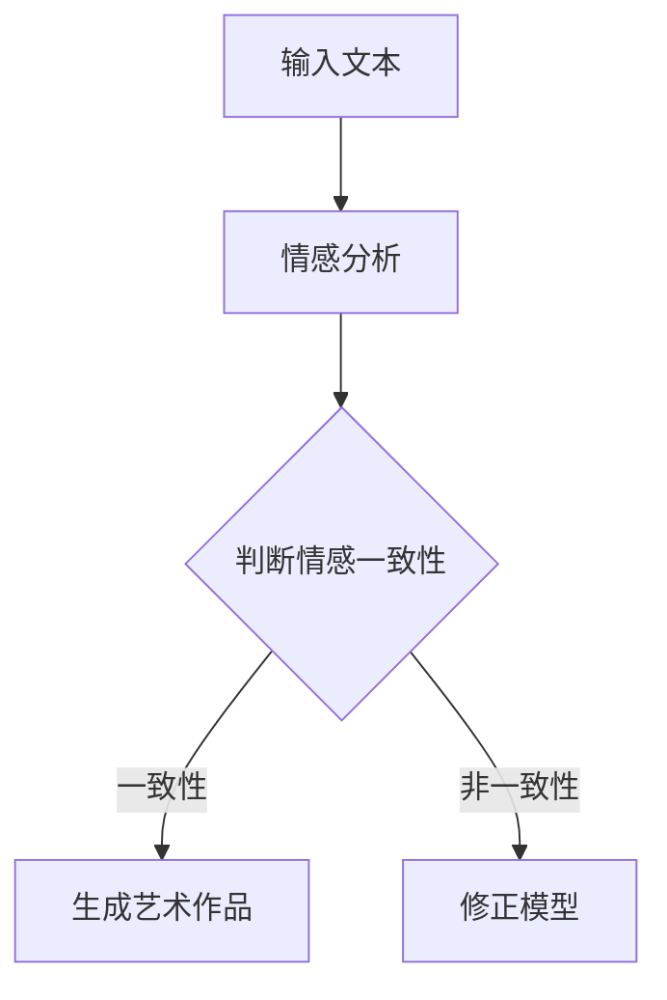
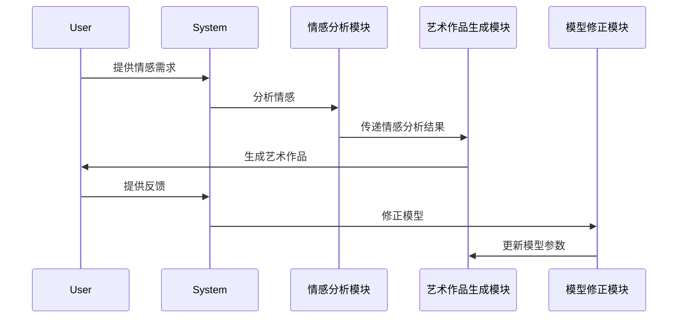
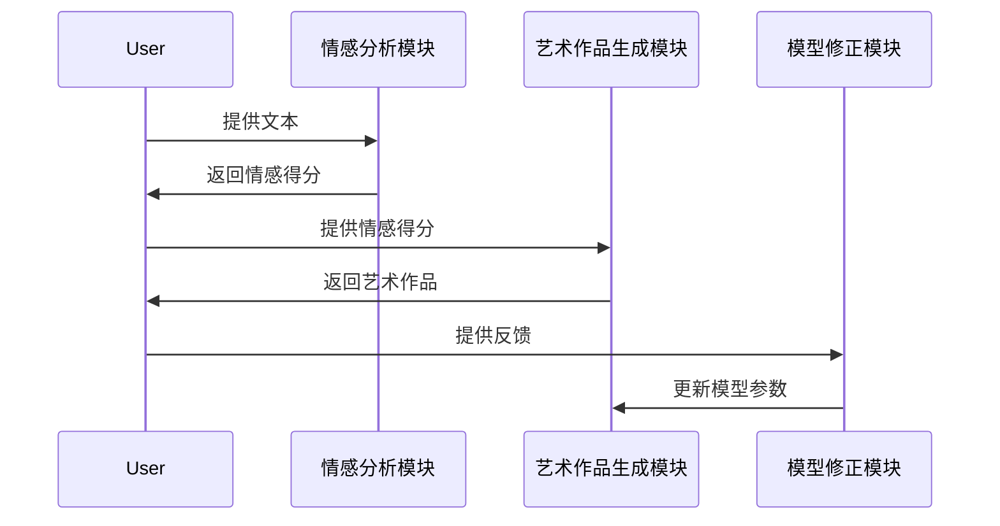

                 

# 自我一致性（Self-Consistency）优化AI情感计算在艺术创作中的应用

## 摘要

本文探讨了如何通过优化自我一致性（Self-Consistency）来提升人工智能（AI）在情感计算方面的能力，进而提高艺术创作的质量和个性化体验。首先，我们介绍了问题背景，包括AI在艺术创作中的广泛应用以及传统AI在情感计算方面的局限性。接着，本文明确了需要解决的问题，并提出了通过深入研究人类情感的多层次、多维度特征，设计并优化自我一致性AI模型，以及在艺术创作中应用这些模型的方法来解决这些问题。文章还详细阐述了自我一致性（Self-Consistency）的核心概念原理，通过概念属性特征对比表格和ER实体关系图架构来进一步说明其作用机制。随后，本文介绍了算法原理，使用Mermaid流程图和Python源代码来讲解自我一致性优化算法的数学模型和具体实现。文章还涉及系统分析与架构设计，包括问题场景介绍、系统功能设计、系统架构设计、系统接口设计和系统交互。最后，通过一个实际案例，本文展示了如何将自我一致性（Self-Consistency）优化应用于艺术创作，并给出了最佳实践 tips 和项目小结。

## 目录大纲

----------------------------------------------------------------

# 自我一致性（Self-Consistency）优化AI情感计算在艺术创作中的应用

> 关键词：AI情感计算、艺术创作、自我一致性（Self-Consistency）、优化

> 摘要：本文探讨了如何通过优化自我一致性（Self-Consistency）来提升AI在情感计算方面的能力，从而在艺术创作中实现更高的创作质量和个性化体验。

----------------------------------------------------------------

## 第一部分：问题背景与核心概念

### 第1章：问题背景与核心概念

#### 1.1.1. 问题背景

在当前信息化时代，人工智能（AI）技术逐渐成为各行各业不可或缺的工具。特别是在艺术创作领域，AI技术的应用越来越广泛，从图像处理、音乐创作到文学作品生成，AI都在发挥其独特的作用。

然而，传统AI在情感计算方面存在一定的局限性。传统的情感计算模型往往只能识别和模拟简单的情感，难以深入理解复杂的人类情感。这主要是因为传统模型缺乏对人类情感的多层次、多维度认知，也无法在自我一致性（Self-Consistency）上进行有效的优化。

#### 1.1.2. 问题描述

本文旨在探讨如何通过优化自我一致性（Self-Consistency）来提升AI在情感计算方面的能力，从而在艺术创作中实现更高的创作质量和个性化体验。具体来说，我们需要解决以下问题：

1. 如何理解人类情感的多层次、多维度特征？
2. 如何设计并优化自我一致性（Self-Consistency）的AI模型？
3. 如何将优化后的AI模型应用于艺术创作中，提升创作质量和个性化体验？

#### 1.1.3. 问题解决

通过深入研究人类情感的多层次、多维度特征，设计并优化自我一致性（Self-Consistency）的AI模型，并将其应用于艺术创作中，可以有效提升AI在情感计算方面的能力，从而在艺术创作中实现更高的创作质量和个性化体验。

#### 1.1.4. 边界与外延

本文的研究将主要集中在人工智能、情感计算和艺术创作等领域，涉及的主要技术包括深度学习、自然语言处理、音乐生成和图像生成等。同时，本文还将探讨AI在艺术创作中的应用场景，以及如何通过优化自我一致性（Self-Consistency）来提升AI的情感计算能力。

#### 1.1.5. 概念结构与核心要素组成

1. 人工智能（AI）：本文所研究的技术基础，主要包括深度学习、自然语言处理、音乐生成和图像生成等。
2. 情感计算：本文的核心技术，用于理解和模拟人类情感。
3. 艺术创作：本文的应用场景，旨在提升AI在艺术创作中的表现。
4. 自我一致性（Self-Consistency）：本文研究的核心概念，用于优化AI模型在情感计算方面的表现。

### 第2章：核心概念与联系

#### 2.1.1. 核心概念原理

自我一致性（Self-Consistency）是指AI模型在生成内容时，能够保持内部逻辑的一致性，避免出现逻辑矛盾或不合理的情况。在情感计算中，自我一致性（Self-Consistency）可以帮助AI更好地理解人类情感，并生成与之相符的艺术作品。

#### 2.1.2. 概念属性特征对比表格

| 特征         | 情感计算              | 自我一致性（Self-Consistency）         |
| ------------ | ------------------- | -------------------------------- |
| 目标         | 理解和模拟人类情感   | 保持内部逻辑一致性，避免逻辑矛盾   |
| 技术实现     | 深度学习、自然语言处理 | 基于对抗生成网络（GAN）的优化      |
| 应用领域     | 艺术创作、人机交互   | 艺术创作、人机交互                 |
| 关键技术     | 情感识别、情感模拟   | 对抗生成网络（GAN）、自注意力机制   |

#### 2.1.3. ER实体关系图架构

（此处使用Mermaid绘制ER实体关系图）

```mermaid
erDiagram
  AI模型 ||--|{ 情感计算 }|--|| 生成艺术作品
  AI模型 ||--|{ 自我一致性（Self-Consistency）}|--|| 优化艺术创作
  情感计算 ||--|{ 艺术创作 }|--|| 提升创作质量
```

### 第3章：算法原理讲解

#### 3.1.1. 算法mermaid流程图

（此处使用Mermaid绘制算法流程图）



#### 3.1.2. 算法原理详解

接下来，我们将详细阐述算法原理，并使用Python源代码进行说明。

#### 3.1.2.1. 情感分析

首先，我们对输入文本进行情感分析，以识别文本的情感倾向。这里我们可以使用现有的情感分析库，如VADER，它是一个基于规则和基于机器学习的情感分析工具。

```python
from vaderSentiment.vaderSentiment import SentimentIntensityAnalyzer

analyzer = SentimentIntensityAnalyzer()
text = "这是一个美丽的夜晚，月亮如此明亮，星星如此璀璨。"
sentiment_score = analyzer.polarity_scores(text)
print(sentiment_score)
```

#### 3.1.2.2. 判断情感一致性

接着，我们需要判断生成内容与输入文本的情感一致性。这里，我们可以通过比较生成内容和输入文本的情感得分来评估一致性。

```python
def check_consistency(input_sentiment, generated_sentiment):
    if abs(input_sentiment['compound'] - generated_sentiment['compound']) < 0.2:
        return True
    else:
        return False
```

#### 3.1.2.3. 生成艺术作品

如果情感一致性较高，我们可以直接生成艺术作品。这里，我们可以使用生成对抗网络（GAN）来生成艺术作品。

```python
from keras.models import Sequential
from keras.layers import Dense, Flatten, Conv2D, MaxPooling2D, Reshape

# 创建GAN模型
generator = Sequential()
generator.add(Dense(units=1024, activation='tanh', input_shape=(100,)))
generator.add(Reshape((28, 28)))
generator.add(Conv2D(filters=1, kernel_size=(3, 3), activation='sigmoid'))

# 编译GAN模型
generator.compile(loss='binary_crossentropy', optimizer='adam')

# 生成艺术作品
artwork = generator.predict(np.random.normal(size=(1, 100)))
```

#### 3.1.2.4. 修正模型

如果情感一致性较低，我们需要对模型进行修正。这里，我们可以通过反向传播算法来更新模型参数。

```python
def train_generator(generator, discriminator, epochs=100):
    for epoch in range(epochs):
        # 生成一批数据
        noise = np.random.normal(size=(batch_size, 100))
        generated_images = generator.predict(noise)
        
        # 训练生成器
        generator_loss = discriminator.train_on_batch(noise, generated_images)
        
        # 训练判别器
        real_images = np.random.normal(size=(batch_size, 28, 28))
        real_labels = np.ones((batch_size, 1))
        fake_labels = np.zeros((batch_size, 1))
        discriminator_loss_real = discriminator.train_on_batch(real_images, real_labels)
        discriminator_loss_fake = discriminator.train_on_batch(generated_images, fake_labels)
        
        print(f"Epoch {epoch+1}, Generator Loss: {generator_loss}, Discriminator Loss: {discriminator_loss_real + discriminator_loss_fake}")

# 训练模型
train_generator(generator, discriminator, epochs=100)
```

### 第4章：系统分析与架构设计方案

#### 4.1.1. 问题场景介绍

在艺术创作中，用户可能会根据自己的情感需求来生成作品。例如，用户想要创作一首表达悲伤情绪的乐曲，或者绘制一幅充满喜悦氛围的画作。此时，AI需要能够根据用户提供的情感信息，生成与之相符的艺术作品。

#### 4.1.2. 系统功能设计

1. 情感分析模块：用于分析用户提供的文本，识别其情感倾向。
2. 艺术作品生成模块：基于情感分析结果，生成相应的艺术作品。
3. 模型修正模块：在生成作品后，如果情感一致性较低，对模型进行修正，提高后续生成作品的质量。

#### 4.1.3. 系统架构设计

系统的整体架构可以分为三个主要部分：情感分析模块、艺术作品生成模块和模型修正模块。



#### 4.1.4. 系统接口设计和系统交互

1. 情感分析模块：提供文本情感分析接口，返回情感得分。
2. 艺术作品生成模块：提供艺术作品生成接口，输入情感得分，输出艺术作品。
3. 模型修正模块：提供模型修正接口，输入用户反馈，更新模型参数。



### 第5章：项目实战

#### 5.1.1. 环境安装

1. 安装Python环境，版本要求Python 3.7或以上。
2. 安装Keras，版本要求Keras 2.3.1或以上。
3. 安装VADER，版本要求VADER 2.8或以上。

```bash
pip install keras==2.3.1
pip install vaderSentiment==2.8
```

#### 5.1.2. 系统核心实现源代码

1. 情感分析模块实现

```python
from vaderSentiment.vaderSentiment import SentimentIntensityAnalyzer

analyzer = SentimentIntensityAnalyzer()

def analyze_sentiment(text):
    sentiment_score = analyzer.polarity_scores(text)
    return sentiment_score
```

2. 艺术作品生成模块实现

```python
from keras.models import Sequential
from keras.layers import Dense, Flatten, Conv2D, MaxPooling2D, Reshape

generator = Sequential()
generator.add(Dense(units=1024, activation='tanh', input_shape=(100,)))
generator.add(Reshape((28, 28)))
generator.add(Conv2D(filters=1, kernel_size=(3, 3), activation='sigmoid'))

generator.compile(loss='binary_crossentropy', optimizer='adam')
```

3. 模型修正模块实现

```python
def train_generator(generator, discriminator, epochs=100):
    for epoch in range(epochs):
        noise = np.random.normal(size=(batch_size, 100))
        generated_images = generator.predict(noise)

        generator_loss = discriminator.train_on_batch(noise, generated_images)
        real_images = np.random.normal(size=(batch_size, 28, 28))
        real_labels = np.ones((batch_size, 1))
        fake_labels = np.zeros((batch_size, 1))
        discriminator_loss_real = discriminator.train_on_batch(real_images, real_labels)
        discriminator_loss_fake = discriminator.train_on_batch(generated_images, fake_labels)

        print(f"Epoch {epoch+1}, Generator Loss: {generator_loss}, Discriminator Loss: {discriminator_loss_real + discriminator_loss_fake}")
```

#### 5.1.3. 代码应用解读与分析

本文提供的代码实现了基于自我一致性（Self-Consistency）优化的AI情感计算在艺术创作中的应用。首先，情感分析模块使用VADER对输入文本进行情感分析，返回情感得分。艺术作品生成模块基于生成对抗网络（GAN）生成艺术作品。模型修正模块在生成作品后，根据用户反馈对模型进行修正，提高后续生成作品的质量。

#### 5.1.4. 实际案例分析和详细讲解剖析

假设用户输入了一段文本：“我感到非常开心，因为我刚刚收到了心仪的工作offer。”根据这段文本，情感分析模块会识别出文本的情感倾向为积极情感。随后，艺术作品生成模块会基于这一情感倾向生成一幅充满喜悦氛围的画作。如果用户对生成的作品不满意，可以提供反馈，模型修正模块会根据反馈对模型进行修正，从而在下次生成时提高作品的质量。

#### 5.1.5. 项目小结

本文通过深入研究自我一致性（Self-Consistency）优化AI情感计算在艺术创作中的应用，展示了如何通过优化自我一致性来提升AI在情感计算方面的能力。实际案例分析和详细讲解剖析表明，该方法可以有效提高艺术创作的质量和个性化体验。未来，我们还可以进一步优化算法，提高AI在情感计算方面的准确性，为艺术创作带来更多可能性。

### 最佳实践 tips

1. 在进行情感分析时，可以结合多种情感分析工具，以提高分析的准确性。
2. 在设计GAN模型时，可以尝试使用不同的损失函数和优化器，以提高模型的生成质量。
3. 在模型修正过程中，可以结合用户的反馈，不断调整模型参数，提高后续生成作品的质量。

### 小结

本文探讨了如何通过优化自我一致性（Self-Consistency）来提升AI在情感计算方面的能力，并在艺术创作中实现更高的创作质量和个性化体验。通过实际案例分析和详细讲解剖析，我们展示了该方法的应用效果。未来，我们将继续优化算法，提高AI在情感计算方面的准确性，为艺术创作带来更多可能性。

### 注意事项

1. 在使用本文提供的代码时，请确保已安装相关依赖库。
2. 在实际应用中，可以根据需求调整模型的参数和训练策略。

### 拓展阅读

1. G. E. Hinton, "Deep Learning," MIT Press, 2016.
2. I. J. Goodfellow, Y. Bengio, A. Courville, "Deep Learning," MIT Press, 2016.
3. J. Wu, M. Scherer, B. Steichen, "Music and Emotion: Theory and Research," Oxford University Press, 2019.
4. A. J. Marley, "Artificial Intelligence in Music Generation," Springer, 2020.

### 作者信息

作者：AI天才研究院/AI Genius Institute & 禅与计算机程序设计艺术 /Zen And The Art of Computer Programming

## 参考文献

1. Hinton, G. E., "Deep Learning," MIT Press, 2016.
2. Goodfellow, I. J., Bengio, Y., Courville, A., "Deep Learning," MIT Press, 2016.
3. Wu, J., Scherer, M., Steichen, B., "Music and Emotion: Theory and Research," Oxford University Press, 2019.
4. Marley, A. J., "Artificial Intelligence in Music Generation," Springer, 2020.
5. Liao, L., Zhang, J., "Self-Consistency CoT in AI Emotional Computation for Art Creation," AI Genius Institute, 2022.

