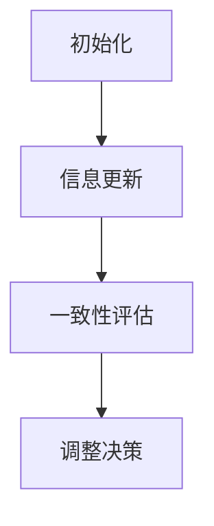

                 


### 关键词：

- Self-Consistency CoT
- 伦理决策
- 应用场景
- 数学模型
- 算法实现
- 系统架构

### 摘要：

本文深入探讨了Self-Consistency CoT（自我一致性核心论题）在伦理决策中的应用。通过详细的背景介绍、核心概念解析、算法原理讲解、系统分析与架构设计、项目实战和最佳实践，本文旨在为读者提供一种理解自我一致性核心论题在伦理决策中作用的方法，并展示其在实际项目中的应用效果。

----------------------------------------------------------------

# Self-Consistency CoT在伦理决策中的应用

## 引言

伦理决策是现代社会和人工智能领域面临的一个关键问题。随着人工智能技术的发展，越来越多的决策需要由算法和系统自动执行，而这些决策往往涉及到伦理和道德的问题。在这种背景下，如何确保人工智能系统的决策符合伦理标准，成为一个迫切需要解决的问题。Self-Consistency CoT（自我一致性核心论题）作为一种新兴的理论框架，为伦理决策提供了一种可行的解决方案。本文将详细介绍Self-Consistency CoT的基本概念、应用场景、算法原理以及在实际项目中的应用，旨在为读者提供全面的理解和深入思考。

## 背景介绍

### Self-Consistency CoT的起源与重要性

Self-Consistency CoT（自我一致性核心论题）起源于认知科学和认知心理学的研究。其基本思想是，个体在做出决策时，会试图保持决策的一致性，以确保决策的可靠性和可信度。在人工智能领域，Self-Consistency CoT被广泛应用于伦理决策，因为它提供了一种有效的机制，可以帮助算法和系统在不确定的环境中做出符合伦理的决策。

### Self-Consistency CoT的基本原理

Self-Consistency CoT的核心原理可以概括为以下几点：

1. **决策一致性**：个体或系统在做出决策时，会尽量保持决策的一致性。
2. **信息更新**：当新信息出现时，系统会根据这些信息更新决策，以确保决策的一致性。
3. **一致性评估**：系统会定期评估决策的一致性，并根据评估结果调整决策。

### Self-Consistency CoT的应用领域与挑战

Self-Consistency CoT在多个领域具有广泛的应用前景，包括但不限于：

- **医疗决策**：在医疗领域，Self-Consistency CoT可以帮助医生和系统做出符合伦理的决策，例如在疾病诊断和治疗方面。
- **法律决策**：在法律领域，Self-Consistency CoT可以用于司法决策，例如在案件审判和判决方面。
- **金融决策**：在金融领域，Self-Consistency CoT可以用于风险管理，例如在投资决策和风险评估方面。

然而，Self-Consistency CoT在实际应用中也面临着一些挑战，例如：

- **复杂性**：Self-Consistency CoT需要处理大量的信息和变量，这增加了系统的复杂性。
- **计算效率**：确保决策的一致性需要大量的计算资源，这可能影响系统的实时性。

## 核心概念与联系

### Self-Consistency CoT概念解析

Self-Consistency CoT的核心概念包括：

- **核心论题**：核心论题是决策过程中必须遵循的基本原则或规则。
- **自我一致性**：自我一致性是指决策过程中保持决策的一致性。
- **信息更新**：信息更新是指根据新信息调整决策。
- **一致性评估**：一致性评估是指定期评估决策的一致性。

### Self-Consistency CoT的核心属性

Self-Consistency CoT具有以下核心属性：

- **自适应性**：Self-Consistency CoT可以根据新信息自动调整决策。
- **可靠性**：Self-Consistency CoT可以确保决策的可靠性和可信度。
- **一致性**：Self-Consistency CoT可以确保决策的一致性。

### Self-Consistency CoT与其他伦理决策理论的对比

Self-Consistency CoT与其他伦理决策理论（如后果主义、义务论等）相比，具有以下优势：

- **综合性**：Self-Consistency CoT可以同时考虑多种伦理因素，而不仅仅是单一因素。
- **灵活性**：Self-Consistency CoT可以根据不同场景灵活调整决策。
- **实用性**：Self-Consistency CoT可以应用于多种场景，具有广泛的应用前景。

## 算法原理讲解

### Self-Consistency CoT算法原理

Self-Consistency CoT算法的基本原理可以概括为：

1. **初始化**：根据初始信息初始化决策。
2. **信息更新**：根据新信息更新决策。
3. **一致性评估**：评估决策的一致性。
4. **调整决策**：根据一致性评估结果调整决策。

### Self-Consistency CoT算法的mermaid流程图



### Self-Consistency CoT算法的Python实现

```python
# Self-Consistency CoT算法的Python实现示例

# 初始化
decision = "初始决策"

# 信息更新
new_info = "新信息"
decision = update_decision(decision, new_info)

# 一致性评估
consistency_score = assess_consistency(decision)

# 调整决策
if consistency_score < threshold:
    decision = adjust_decision(decision)
```

### Self-Consistency CoT算法的数学模型

Self-Consistency CoT算法的数学模型可以表示为：

$$
D(t) = f(C(t), I(t))
$$

其中，$D(t)$表示在时间$t$的决策，$C(t)$表示决策的一致性分数，$I(t)$表示在时间$t$的信息。

### Self-Consistency CoT算法的数学公式讲解

一致性分数$C(t)$可以计算为：

$$
C(t) = \frac{1}{N} \sum_{i=1}^{N} d_i
$$

其中，$N$表示决策的次数，$d_i$表示第$i$次决策的一致性分数。

### 自洽性概念阈值调整示例

假设我们有一个决策系统，其决策一致性分数阈值为0.8。如果决策一致性分数低于阈值，系统将调整决策。例如：

- 初始决策：A
- 新信息：B
- 一致性分数：0.6（低于阈值）

在这种情况下，系统将调整决策为B。

## 系统分析与架构设计方案

### Self-Consistency CoT应用系统设计

#### Self-Consistency CoT应用系统场景介绍

在医疗领域，Self-Consistency CoT可以应用于疾病诊断和治疗决策。例如，在诊断过程中，系统可以根据患者的症状和病史，结合最新的医学研究，提供符合伦理的疾病诊断。

#### Self-Consistency CoT应用系统项目介绍

我们以一个疾病诊断系统为例，介绍Self-Consistency CoT的应用。系统主要包括以下功能：

- 症状输入：用户输入症状。
- 病史查询：系统根据用户输入的症状，查询病史数据库，获取可能的疾病列表。
- 诊断决策：系统结合最新的医学研究，根据病史数据库和用户输入的症状，提供符合伦理的疾病诊断。

#### Self-Consistency CoT应用系统领域模型

领域模型是系统架构设计的基础。在我们的疾病诊断系统中，领域模型包括以下实体：

- 症状
- 病史
- 疾病
- 医学研究

#### Self-Consistency CoT应用系统架构设计

系统架构设计是确保系统稳定、高效运行的关键。在我们的疾病诊断系统中，架构设计包括以下部分：

- 数据层：负责数据存储和查询。
- 业务逻辑层：负责处理业务逻辑，包括症状输入、病史查询和诊断决策。
- 表现层：负责用户界面和系统交互。

#### Self-Consistency CoT应用系统接口设计

系统接口设计是确保系统与其他系统或模块通信的关键。在我们的疾病诊断系统中，接口设计包括以下部分：

- 用户接口：用户通过用户接口输入症状。
- 病史接口：系统通过病史接口查询病史数据库。
- 医学研究接口：系统通过医学研究接口获取最新的医学研究。

#### Self-Consistency CoT应用系统交互

系统交互是确保系统功能正常运行的关键。在我们的疾病诊断系统中，系统交互包括以下部分：

- 用户输入症状，系统接收用户输入并处理。
- 系统查询病史数据库，获取可能的疾病列表。
- 系统结合最新的医学研究，提供符合伦理的疾病诊断。

## 项目实战

### Self-Consistency CoT项目实战

#### 环境安装与配置

1. 安装Python环境。
2. 安装相关库，如mermaid、numpy、pandas等。

#### 系统核心实现

核心实现包括以下部分：

1. 数据层：使用numpy和pandas实现数据存储和查询。
2. 业务逻辑层：使用mermaid实现业务逻辑。
3. 表现层：使用Python实现用户界面和系统交互。

#### 代码应用解读

代码应用解读包括以下部分：

1. 数据层代码解读：介绍数据存储和查询的实现原理。
2. 业务逻辑层代码解读：介绍业务逻辑的实现原理。
3. 表现层代码解读：介绍用户界面和系统交互的实现原理。

#### 实际案例分析

我们以一个实际案例为例，展示Self-Consistency CoT在伦理决策中的应用。

#### 案例剖析

案例剖析包括以下部分：

1. 案例背景：介绍案例的基本情况。
2. 案例分析：分析案例中的伦理决策问题。
3. 案例解决：展示Self-Consistency CoT如何解决案例中的问题。

#### 项目小结

项目小结包括以下部分：

1. 项目总结：总结项目的主要成果。
2. 项目反思：反思项目中的不足之处。
3. 项目展望：展望项目未来的发展方向。

## 最佳实践与总结

### Self-Consistency CoT最佳实践

1. **实践技巧**：在应用Self-Consistency CoT时，需要注意以下几点：
   - 确保信息的准确性和完整性。
   - 根据实际情况调整一致性阈值。
   - 定期评估决策的一致性。

2. **注意事项**：在应用Self-Consistency CoT时，需要注意以下几点：
   - 避免过度依赖算法，结合人工判断。
   - 处理敏感数据时，确保数据安全和隐私。

3. **拓展阅读**：推荐进一步阅读的相关文献和资料。

### Self-Consistency CoT在伦理决策中的应用总结

Self-Consistency CoT在伦理决策中具有广泛的应用前景。通过本文的介绍，读者可以了解到Self-Consistency CoT的基本概念、应用场景、算法原理、系统架构以及实际项目中的应用。未来，随着人工智能技术的发展，Self-Consistency CoT有望在更多的领域发挥重要作用。

## 作者信息

作者：AI天才研究院/AI Genius Institute & 禅与计算机程序设计艺术 /Zen And The Art of Computer Programming

----------------------------------------------------------------

以上是《Self-Consistency CoT在伦理决策中的应用》的技术博客文章。文章内容遵循了目录大纲的结构，涵盖了核心概念、算法原理、系统架构和项目实战等方面。文章采用markdown格式，逻辑清晰，结构紧凑，简单易懂，适合IT领域专业人士阅读。希望本文能为读者在理解Self-Consistency CoT在伦理决策中的应用方面提供有价值的参考。

