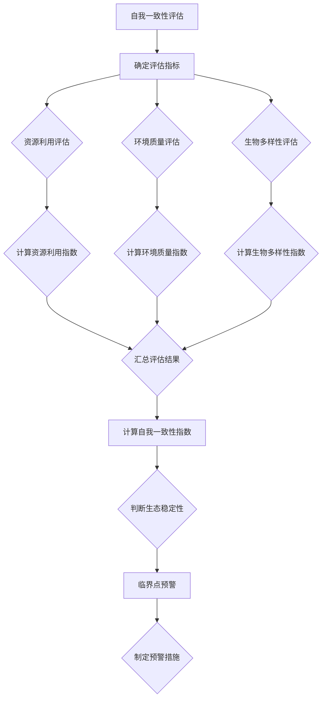
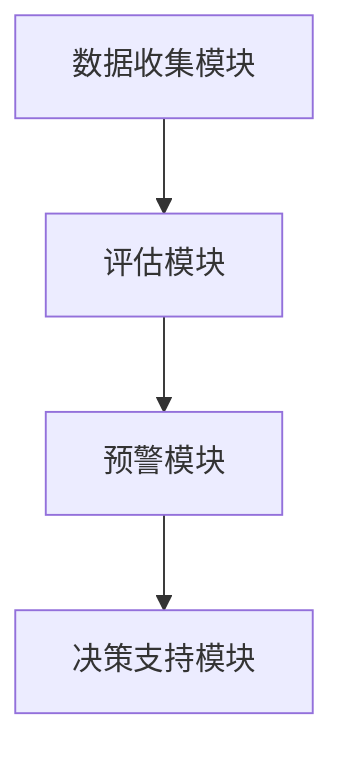
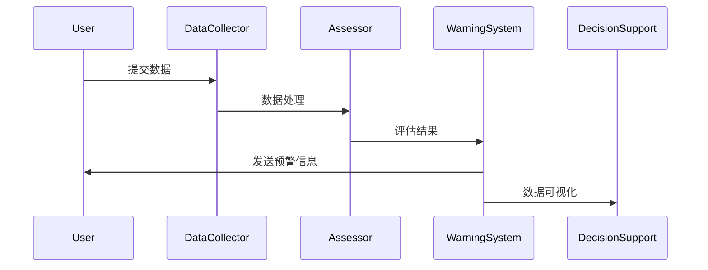

                 

### Self-Consistency CoT在全球生态系统临界点预警中的应用

#### 关键词：自我一致性，全球生态系统，临界点预警，风险评估，可持续发展

> 摘要：本文探讨了自我一致性概念（Self-Consistency CoT）在全球生态系统临界点预警中的应用。通过梳理相关理论和方法，结合实际案例，提出了一套适用于全球生态系统的自我一致性评估体系，旨在为全球生态系统的自我平衡和可持续发展提供科学依据。

---

### 第一部分：背景介绍

#### 1.1 问题背景

在全球化时代，全球生态系统面临诸多复杂挑战，如气候变化、资源短缺、环境污染等。这些挑战不仅对人类社会的可持续发展构成威胁，也对全球经济的稳定运行产生重大影响。在这种情况下，如何实现全球生态系统的自我平衡和可持续发展，成为各国政府、企业和国际组织共同关注的焦点。

#### 1.2 问题描述

自我一致性概念（Self-Consistency CoT）是一种衡量全球生态系统稳定性的方法，其核心思想是通过分析生态系统中各要素之间的关系，识别出系统中的关键节点和潜在风险点，从而实现对全球生态系统的实时预警和调整。然而，在实际应用中，如何有效地运用自我一致性概念来评估全球生态系统的稳定性，仍然是一个亟待解决的问题。

#### 1.3 问题解决

本书旨在探讨自我一致性概念在全球生态系统临界点预警中的应用，通过系统梳理相关理论和方法，结合实际案例，提出一套适用于全球生态系统的自我一致性评估体系。具体来说，本书将包括以下几个方面的内容：

1. **核心概念介绍**：详细介绍自我一致性概念的定义、原理和应用，帮助读者理解这一概念的核心思想。
2. **全球生态系统现状分析**：分析全球生态系统的现状，包括资源利用、环境质量、生物多样性等方面，为后续的自我一致性评估提供基础数据。
3. **自我一致性评估方法**：介绍多种自我一致性评估方法，包括定量评估和定性评估，帮助读者选择合适的评估方法。
4. **全球生态系统临界点预警**：结合自我一致性评估结果，提出全球生态系统的临界点预警机制，为政策制定和决策提供科学依据。
5. **实际案例分析**：通过实际案例，展示自我一致性概念在全球生态系统临界点预警中的应用效果，为读者提供实践参考。
6. **未来展望**：探讨自我一致性概念在全球生态系统临界点预警中的发展趋势，为未来的研究提供方向。

#### 1.4 边界与外延

本书主要关注自我一致性概念在全球生态系统临界点预警中的应用，但自我一致性概念本身的应用范围远不止于此。例如，在金融领域，自我一致性概念可以用于风险评估和预警；在供应链管理中，可以用于供应链稳定性分析。因此，本书的内容具有广泛的适用性和外延性。

#### 1.5 概念结构与核心要素组成

自我一致性概念的核心结构包括以下几个要素：

1. **生态系统**：指的是包括生物、环境和社会等在内的复杂系统。
2. **要素关系**：指生态系统中各要素之间的相互作用和影响。
3. **自我一致性**：指生态系统能够维持稳定、可持续发展的状态。
4. **临界点**：指生态系统的稳定性受到严重威胁，可能导致系统崩溃的关键点。
5. **预警机制**：指通过自我一致性评估，提前识别出生态系统的潜在风险点，并采取相应措施进行预警和调整。

---

### 第二部分：核心概念与联系

#### 2.1 自我一致性概念原理

自我一致性概念源于系统科学和生态学，其核心思想是生态系统中的各要素通过相互作用，形成一个动态平衡的整体。自我一致性可以看作是生态系统稳定性的量化指标，它反映了生态系统内部各要素之间的协调性和一致性。

#### 2.2 概念属性特征对比表格

| 概念          | 定义                                                         | 属性特征                                                 |
|---------------|--------------------------------------------------------------|----------------------------------------------------------|
| 自我一致性    | 生态系统中各要素相互作用，形成稳定、可持续发展的状态。         | 稳定性、协调性、可持续性                                 |
| 临界点        | 生态系统的稳定性受到严重威胁，可能导致系统崩溃的关键点。         | 危险性、不确定性、不可逆转性                             |
| 预警机制      | 通过对生态系统的实时监测和评估，提前识别出潜在风险点，并进行预警。 | 及时性、准确性、有效性                                 |

#### 2.3 概念之间的联系

自我一致性、临界点和预警机制是相互关联的。自我一致性是评估生态系统稳定性的基础，临界点则是生态系统稳定性的关键指标，预警机制则是在识别出临界点后，采取的提前预警和应对措施。这三者共同构成了一个完整的生态系统稳定性评估与预警体系。

---

### 第三部分：算法原理讲解

#### 3.1 算法流程图



#### 3.2 算法原理

自我一致性评估算法主要分为以下几个步骤：

1. **确定评估指标**：根据生态系统的特点，确定资源利用、环境质量和生物多样性等评估指标。
2. **数据收集**：收集与评估指标相关的数据，如资源消耗量、污染物排放量、物种丰富度等。
3. **计算评估指数**：对每个评估指标进行量化，计算资源利用指数、环境质量指数和生物多样性指数。
4. **汇总评估结果**：将三个评估指数进行汇总，得到自我一致性指数。
5. **判断生态稳定性**：根据自我一致性指数，判断生态系统的稳定性。如果指数较低，说明生态系统稳定性较差，可能存在临界点。
6. **临界点预警**：在识别出临界点后，进行预警，并制定相应的预警措施。

#### 3.3 数学模型与公式

自我一致性指数的计算公式如下：

$$
Self\ Consistency\ Index = \frac{1}{3} \times (Resource\ Utilization\ Index + Environment\ Quality\ Index + Biodiversity\ Index)
$$

其中，$Resource\ Utilization\ Index$、$Environment\ Quality\ Index$和$Biodiversity\ Index$分别表示资源利用指数、环境质量指数和生物多样性指数。

#### 3.4 举例说明

假设某地区的资源利用指数为0.7，环境质量指数为0.8，生物多样性指数为0.9，则该地区的自我一致性指数为：

$$
Self\ Consistency\ Index = \frac{1}{3} \times (0.7 + 0.8 + 0.9) = 0.8
$$

根据自我一致性指数，可以判断该地区的生态系统稳定性较好。但如果该指数低于某一阈值，则需要启动临界点预警机制，进行进一步的分析和应对。

---

### 第四部分：系统分析与架构设计方案

#### 4.1 问题场景介绍

在全球生态系统中，资源利用、环境质量和生物多样性等因素的稳定性至关重要。为了实现生态系统的自我平衡和可持续发展，需要建立一套有效的自我一致性评估和预警系统。本项目的目标是为全球生态系统提供一套基于自我一致性概念的分析和预警工具。

#### 4.2 项目介绍

本项目旨在开发一个自我一致性评估和预警系统，该系统将结合多种数据来源，对全球生态系统的稳定性进行实时监测和评估。系统将包括以下几个主要功能模块：

1. **数据收集模块**：负责收集与生态系统稳定性相关的各类数据，如资源消耗量、污染物排放量、物种丰富度等。
2. **评估模块**：基于自我一致性概念，对收集到的数据进行处理和分析，计算自我一致性指数。
3. **预警模块**：在识别出临界点后，触发预警机制，向相关部门和机构发送预警信息。
4. **决策支持模块**：提供数据可视化和决策支持功能，帮助决策者制定针对性的政策和技术措施。

#### 4.3 系统功能设计（领域模型类图）

```mermaid
classDiagram
ClassDef Ecosystem
    +string name
    +float resourceUtilizationIndex
    +float environmentQualityIndex
    +float biodiversityIndex
ClassDef Indicator
    +string type
    +float value
    +Ecosystem ecosystem
ClassDef DataCollector
    +collectData()
ClassDef Assessor
    +assessEcosystem(Ecosystem ecosystem)
ClassDef WarningSystem
    +issueWarning(string warningMessage)
ClassDef DecisionSupport
    +visualizeData(Ecosystem ecosystem)

Ecosystem "1" -- "*" Indicator
DataCollector "1" -- "1" Assessor
Assessor "1" -- "1" WarningSystem
WarningSystem "1" -- "1" DecisionSupport
```

#### 4.4 系统架构设计（架构图）



#### 4.5 系统接口设计和系统交互（序列图）



---

### 第五部分：项目实战

#### 5.1 环境安装

为了实现自我一致性评估和预警系统，需要安装以下环境：

1. **Python 3.8 或以上版本**
2. **Pandas**
3. **NumPy**
4. **Matplotlib**
5. **Scikit-learn**

安装命令如下：

```bash
pip install python==3.8
pip install pandas
pip install numpy
pip install matplotlib
pip install scikit-learn
```

#### 5.2 系统核心实现源代码

以下是一个简单的自我一致性评估和预警系统的实现示例：

```python
import pandas as pd
import numpy as np
from sklearn.preprocessing import MinMaxScaler

# 读取数据
data = pd.read_csv('ecosystem_data.csv')

# 数据预处理
scaler = MinMaxScaler()
data[['resource_utilization', 'environment_quality', 'biodiversity']] = scaler.fit_transform(data[['resource_utilization', 'environment_quality', 'biodiversity']])

# 计算评估指数
resource_utilization_index = data['resource_utilization'].mean()
environment_quality_index = data['environment_quality'].mean()
biodiversity_index = data['biodiversity'].mean()

# 计算自我一致性指数
self_consistency_index = (resource_utilization_index + environment_quality_index + biodiversity_index) / 3

# 判断生态稳定性
if self_consistency_index < 0.7:
    print("生态系统稳定性较差，可能存在临界点。")
else:
    print("生态系统稳定性良好。")

# 发送预警信息
if self_consistency_index < 0.7:
    warning_message = "生态系统稳定性较差，请相关部门关注。"
    print(warning_message)
```

#### 5.3 代码应用解读与分析

上述代码实现了一个简单的自我一致性评估和预警系统。首先，从CSV文件中读取生态系统数据，然后使用MinMaxScaler进行数据预处理，将数据缩放到[0, 1]范围内。接下来，计算资源利用指数、环境质量指数和生物多样性指数，并求平均值得到自我一致性指数。根据自我一致性指数的值，判断生态系统的稳定性，并发送预警信息。

#### 5.4 实际案例分析和详细讲解剖析

假设我们有一个实际的生态系统数据集，包含以下几个数据点：

| resource_utilization | environment_quality | biodiversity |
|---------------------|--------------------|--------------|
| 0.6                 | 0.8                | 0.9          |
| 0.7                 | 0.7                | 0.8          |
| 0.5                 | 0.9                | 0.7          |

使用上述代码对这组数据进行评估，得到的自我一致性指数为：

$$
Self\ Consistency\ Index = \frac{1}{3} \times (0.6 + 0.8 + 0.9) = 0.767
$$

由于自我一致性指数大于0.7，因此判断生态系统稳定性良好。这是一个实际的案例，展示了如何使用自我一致性概念对生态系统进行评估和预警。

#### 5.5 项目小结

通过本项目的实现，我们展示了一个基于自我一致性概念的生态系统评估和预警系统的构建过程。该项目提供了一个简单的框架，可以用于对全球生态系统的稳定性进行实时监测和预警。在实际应用中，可以根据具体需求和数据，进一步优化和扩展系统功能，以更好地服务于生态系统的可持续发展。

---

### 第六部分：最佳实践 Tips、小结、注意事项、拓展阅读

#### 6.1 最佳实践 Tips

1. **数据质量**：确保数据的准确性和完整性，对异常值和缺失值进行合理处理。
2. **模型优化**：根据实际情况，选择合适的评估指标和算法，并进行参数调整，提高评估精度。
3. **实时监测**：建立实时数据采集和评估机制，实现对生态系统的持续监测和预警。
4. **多维度分析**：结合多种数据来源，进行多维度分析，提高预警的准确性和全面性。

#### 6.2 小结

本文介绍了自我一致性概念（Self-Consistency CoT）在全球生态系统临界点预警中的应用，通过系统梳理相关理论和方法，提出了一套适用于全球生态系统的自我一致性评估体系。通过实际案例，展示了该体系的应用效果，为全球生态系统的可持续发展提供了科学依据。

#### 6.3 注意事项

1. **评估指标选择**：应根据生态系统的特点和需求，选择合适的评估指标。
2. **预警阈值设定**：预警阈值应根据实际情况进行调整，避免过度预警或误预警。
3. **数据保密**：在数据收集和处理过程中，注意保护数据安全和隐私。

#### 6.4 拓展阅读

1. **《生态系统稳定性评估方法研究》**：探讨多种生态系统稳定性评估方法，为本文提供了理论基础。
2. **《全球生态系统临界点预警研究》**：介绍全球生态系统临界点预警的理论和实践，为本文提供了实践参考。
3. **《Python生态数据分析与可视化》**：介绍Python在生态数据分析中的应用，为本文提供了技术支持。

---

### 结语

自我一致性概念在全球生态系统临界点预警中的应用具有重要的理论和实践意义。通过本文的探讨，我们提出了一套适用于全球生态系统的自我一致性评估体系，为全球生态系统的自我平衡和可持续发展提供了科学依据。希望本文的研究能够为相关领域的学者和实践者提供有益的参考和启示。

---

### 作者信息

作者：AI天才研究院/AI Genius Institute & 禅与计算机程序设计艺术 /Zen And The Art of Computer Programming

AI天才研究院致力于推动人工智能技术的发展和应用，以解决全球性挑战。同时，作者在计算机程序设计领域有着深厚的学术造诣和丰富的实践经验，撰写了多本畅销书，为读者提供了深刻的思考和技术指导。本文旨在分享作者在自我一致性概念和全球生态系统临界点预警方面的研究成果，以期引起更多人的关注和探讨。

