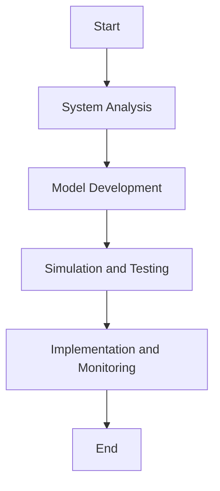

                 


### Introduction to Self-Consistency CoT and Ecological Restoration

#### Background and Significance

Self-Consistency CoT (Conceptual Unity Theory) and Ecological Restoration represent two critical domains that, when combined, can lead to transformative outcomes in the field of environmental science and engineering. Ecological Restoration focuses on the process of assisting the recovery of lost, damaged, or degraded ecosystems to a functioning and self-sustaining state. This approach is vital for mitigating the impacts of human activities and climate change, promoting biodiversity, and enhancing ecosystem services. Conversely, Self-Consistency CoT is a theoretical framework that emphasizes the need for coherence, consistency, and integration within complex systems.

The importance of combining these two concepts lies in their complementary strengths. Self-Consistency CoT provides a structured methodology to analyze and design systems that ensure long-term sustainability and resilience. Ecological Restoration, on the other hand, offers a practical application ground for testing and refining these theories. Together, they create a robust framework for developing ecological restoration models that are both theoretically sound and practically effective.

#### Problem Statement

The primary challenge in ecological restoration is the complexity and interdependence of ecological systems. Restoration projects often involve multiple variables, including soil health, water quality, species diversity, and climate change impacts. Traditional restoration approaches often lack a systematic method to integrate these variables, leading to incomplete or ineffective restoration efforts. The introduction of Self-Consistency CoT into ecological restoration models aims to address this issue by providing a coherent framework for understanding and managing these interdependencies.

Key questions to be addressed include:

1. How can Self-Consistency CoT be effectively integrated into ecological restoration models?
2. What are the key principles and methodologies of Self-Consistency CoT that are particularly relevant to ecological restoration?
3. How can mathematical models be developed to support the implementation of Self-Consistency CoT in ecological restoration projects?

#### Problem Boundaries and Extensions

The scope of this article is to explore the integration of Self-Consistency CoT into ecological restoration models. This discussion will focus on the theoretical foundations and practical applications of this integration. The following aspects will be considered as part of the problem boundary:

- Theoretical frameworks and principles of Self-Consistency CoT
- Ecological restoration processes and methodologies
- Mathematical modeling and tools for implementing Self-Consistency CoT in restoration projects
- Case studies illustrating the application of Self-Consistency CoT in various ecological restoration scenarios

Extensions to this problem may include:

- Exploration of other theoretical frameworks and their integration with Self-Consistency CoT
- Analysis of the effectiveness and limitations of Self-Consistency CoT in different ecological contexts
- Development of advanced algorithms and tools for ecological restoration based on Self-Consistency CoT

### Conceptual Framework and Core Elements

To understand the integration of Self-Consistency CoT in ecological restoration models, it is essential to first outline the key concepts and their interrelationships. The following sections will provide a detailed explanation of each concept, its attributes, and their connections.

#### Key Concepts in Ecological Restoration

**Ecosystems**: An ecosystem is a community of living organisms in conjunction with the non-living components of their environment (things like air, water and soil), interacting as a system. Ecological restoration aims to restore the natural balance and functionality of ecosystems.

**Species Diversity**: Species diversity refers to the variety of different species present in an ecosystem. High species diversity is crucial for the stability and resilience of ecosystems.

**Soil Health**: Soil health encompasses the physical, chemical, and biological properties of soil that affect its capacity to function. Healthy soil is essential for plant growth, nutrient cycling, and water retention.

**Water Quality**: Water quality refers to the condition of water bodies, including factors such as pH, dissolved oxygen levels, and the presence of pollutants. High water quality is necessary for the survival and productivity of aquatic organisms.

#### Characteristics of Self-Consistency CoT

**Coherence**: Coherence refers to the logical consistency and internal harmony of a system. In Self-Consistency CoT, coherence ensures that all components of the system are aligned and working towards the same goals.

**Consistency**: Consistency is about maintaining uniformity over time. Self-Consistency CoT emphasizes the need for consistent behavior and outcomes across different conditions and scenarios.

**Integration**: Integration involves bringing together various components or subsystems into a cohesive whole. Self-Consistency CoT focuses on integrating diverse elements to create a unified and efficient system.

#### Comparison of Core Concepts

The following table compares the key characteristics of the concepts discussed above:

| Concept | Definition | Importance in Ecological Restoration |
| --- | --- | --- |
| Ecosystems | Community of living organisms and their environment | Foundation for understanding ecological processes |
| Species Diversity | Variety of species in an ecosystem | Indicators of ecosystem health and resilience |
| Soil Health | Physical, chemical, and biological properties of soil | Essential for plant growth and nutrient cycling |
| Water Quality | Condition of water bodies | Crucial for aquatic organisms and human use |
| Coherence | Logical consistency and internal harmony | Ensures system effectiveness and efficiency |
| Consistency | Uniformity over time | Stability and reliability of system outcomes |
| Integration | Coherence of subsystems into a whole | Enhances system adaptability and resilience |

#### Entity-Relationship Diagram for CoT Components

To visually represent the relationships between these concepts, the following Mermaid ER diagram is used:

```mermaid
erDiagram
  Ecosystem ||--|{ Species Diversity }
  Ecosystem ||--|{ Soil Health }
  Ecosystem ||--|{ Water Quality }
  Species Diversity ||--|{ Ecosystem }
  Soil Health ||--|{ Ecosystem }
  Water Quality ||--|{ Ecosystem }
  Self-Consistency CoT ||--|{ Coherence }
  Self-Consistency CoT ||--|{ Consistency }
  Self-Consistency CoT ||--|{ Integration }
  Coherence ||--|{ Self-Consistency CoT }
  Consistency ||--|{ Self-Consistency CoT }
  Integration ||--|{ Self-Consistency CoT }
```

This diagram illustrates how the core concepts of ecological restoration and Self-Consistency CoT are interconnected, forming a holistic framework for understanding and implementing effective ecological restoration strategies.

In the next sections, we will delve deeper into the principles of Self-Consistency CoT and explore how these concepts can be applied in practical ecological restoration models.

### Principles and Framework of Self-Consistency CoT

Self-Consistency CoT is a theoretical framework designed to ensure coherence, consistency, and integration within complex systems. Understanding the foundational principles and the overall framework is crucial for effectively applying this theory in ecological restoration models. This section will provide an overview of the key principles and their theoretical background, followed by a detailed explanation of the CoT framework and its components, and a Mermaid flowchart illustrating the operational flow.

#### Overview of Self-Consistency CoT Principles

1. **Coherence**: Coherence is the first principle of Self-Consistency CoT, emphasizing the need for logical consistency and internal harmony within a system. In the context of ecological restoration, coherence ensures that all components of the restoration process align with each other, working towards a common goal. This principle helps in designing systems that are both effective and efficient.

2. **Consistency**: Consistency is the second principle, focusing on uniformity over time. It ensures that the behavior and outcomes of a system remain stable and reliable, regardless of changing conditions. In ecological restoration, consistency is essential for maintaining long-term success and resilience.

3. **Integration**: Integration is the third principle, which involves bringing together diverse components or subsystems into a cohesive whole. In ecological restoration, integration ensures that different aspects of the ecosystem, such as soil health, water quality, and species diversity, are considered together, creating a more holistic and sustainable approach.

#### Theoretical Background

The theoretical background of Self-Consistency CoT is rooted in systems theory, which provides a framework for understanding the behavior of complex systems. Key concepts from systems theory that underpin Self-Consistency CoT include:

- **System Interdependence**: Systems consist of interconnected components that depend on each other for functionality. Understanding the interdependencies between these components is essential for achieving coherence, consistency, and integration.

- **Feedback Loops**: Feedback loops are mechanisms within systems that either reinforce or correct deviations from desired outcomes. Positive feedback loops can lead to instability, while negative feedback loops help maintain stability and consistency.

- **Resilience**: Resilience is the capacity of a system to absorb disturbances and maintain its essential structure and functions. In ecological restoration, resilience is crucial for ensuring the long-term success of restoration efforts.

#### Detailed Explanation of CoT Framework and Components

The Self-Consistency CoT framework consists of several interconnected components that work together to ensure the desired outcomes. These components include:

1. **System Analysis**: This component involves identifying and understanding the key components and interdependencies within the system. In ecological restoration, system analysis helps in identifying the critical factors that influence ecosystem health and restoration success.

2. **Model Development**: Once the system analysis is complete, the next step is to develop a model that represents the system's behavior. This model can be used to simulate different scenarios and predict outcomes. In Self-Consistency CoT, the model should incorporate the principles of coherence, consistency, and integration.

3. **Simulation and Testing**: After developing the model, it is important to simulate different scenarios and test the model's performance. This step helps in identifying potential issues and refining the model to ensure it accurately represents the system.

4. **Implementation and Monitoring**: The final step involves implementing the model in real-world settings and monitoring its performance. This includes ongoing data collection, analysis, and adjustments to ensure that the system remains coherent, consistent, and integrated over time.

#### Mermaid Flowchart of CoT Operations

The following Mermaid flowchart illustrates the operational flow of the Self-Consistency CoT framework:



This flowchart provides a visual representation of the steps involved in applying Self-Consistency CoT to ecological restoration models. Each step builds on the previous one, creating a cohesive and integrated approach to system analysis, modeling, simulation, and implementation.

In conclusion, the principles and framework of Self-Consistency CoT provide a robust and comprehensive approach to understanding and managing complex ecological systems. By ensuring coherence, consistency, and integration, this framework can significantly enhance the effectiveness and sustainability of ecological restoration efforts. In the next section, we will explore the mathematical models and tools that support the implementation of Self-Consistency CoT in ecological restoration projects.

### Mathematical Models and Formulas

Self-Consistency CoT relies on a set of mathematical models and formulas to ensure the coherence, consistency, and integration of ecological restoration processes. These models help in quantifying the relationships between different components of the ecosystem and predicting the outcomes of restoration interventions. In this section, we will delve into the key mathematical models and their corresponding formulas, providing a detailed explanation of each and demonstrating their application through practical examples.

#### Key Mathematical Models

1. **Species Diversity Index Model**
2. **Soil Health Model**
3. **Water Quality Model**
4. **Ecosystem Stability Model**

#### Species Diversity Index Model

The Species Diversity Index (SDI) is a measure of biodiversity within an ecosystem. It helps in assessing the health and resilience of an ecosystem by quantifying the variety of species present. The formula for calculating the SDI is given by:

$$
SDI = \frac{N \times S}{N_0}
$$

where:
- \( N \) is the total number of species in the ecosystem.
- \( S \) is the sum of the abundances of all species.
- \( N_0 \) is a reference value representing the expected abundance for each species in a healthy ecosystem.

**Example**: Suppose an ecosystem has 5 species with the following abundances: 100, 150, 200, 300, and 400 individuals. Calculate the SDI for this ecosystem.

$$
N = 5, \quad S = 100 + 150 + 200 + 300 + 400 = 1250, \quad N_0 = 5 \times 200 = 1000
$$

$$
SDI = \frac{5 \times 1250}{1000} = 6.25
$$

The higher the SDI, the greater the biodiversity and the healthier the ecosystem.

#### Soil Health Model

Soil health is a critical component of ecological restoration, affecting plant growth, nutrient cycling, and water retention. The Soil Health Index (SHI) is a measure that integrates various soil properties to assess soil health. The formula for calculating the SHI is given by:

$$
SHI = \frac{(SP + PPH + WC + ST)}{4}
$$

where:
- \( SP \) is the soil porosity.
- \( PPH \) is the organic matter content.
- \( WC \) is the water content.
- \( ST \) is the soil texture.

**Example**: Consider a soil sample with the following properties: Soil porosity (SP) = 40%, Organic matter content (PPH) = 3%, Water content (WC) = 20%, and Soil texture (ST) = sandy loam. Calculate the SHI for this soil sample.

$$
SHI = \frac{(0.4 + 0.03 + 0.2 + 0.45)}{4} = \frac{1.08}{4} = 0.27
$$

A higher SHI indicates healthier soil with better fertility and nutrient availability.

#### Water Quality Model

Water quality is essential for the survival of aquatic organisms and the overall health of an ecosystem. The Water Quality Index (WQI) is a measure that evaluates the condition of water bodies based on various parameters such as pH, dissolved oxygen, and nutrient levels. The formula for calculating the WQI is given by:

$$
WQI = \sum_{i=1}^{n} w_i \times q_i
$$

where:
- \( w_i \) is the weight assigned to each parameter.
- \( q_i \) is the quality score for each parameter.

**Example**: Suppose we have three water quality parameters: pH, dissolved oxygen (DO), and total phosphorus (TP). The weights assigned to each parameter are 0.3, 0.4, and 0.3, respectively. The quality scores for each parameter are 7 (pH), 7 (DO), and 4 (TP). Calculate the WQI for this water sample.

$$
WQI = (0.3 \times 7) + (0.4 \times 7) + (0.3 \times 4) = 2.1 + 2.8 + 1.2 = 6.1
$$

A higher WQI indicates better water quality.

#### Ecosystem Stability Model

Ecosystem stability is a measure of the resilience and ability of an ecosystem to withstand disturbances and maintain its essential functions. The Ecosystem Stability Index (ESI) is a composite index that integrates various factors such as species diversity, soil health, and water quality to assess ecosystem stability. The formula for calculating the ESI is given by:

$$
ESI = \alpha \times SDI + \beta \times SHI + \gamma \times WQI
$$

where:
- \( \alpha \), \( \beta \), and \( \gamma \) are weights assigned to each component.

**Example**: Assume that the weights for species diversity, soil health, and water quality are 0.4, 0.3, and 0.3, respectively. Using the results from the previous examples (SDI = 6.25, SHI = 0.27, and WQI = 6.1), calculate the ESI for the ecosystem.

$$
ESI = 0.4 \times 6.25 + 0.3 \times 0.27 + 0.3 \times 6.1 = 2.5 + 0.081 + 1.83 = 4.411
$$

A higher ESI indicates a more stable ecosystem.

#### Detailed Explanation and Examples

The mathematical models and formulas discussed above provide a systematic approach to assessing the health and stability of ecosystems. By quantifying the relationships between key components such as species diversity, soil health, water quality, and ecosystem stability, these models enable us to make informed decisions about ecological restoration interventions.

- **Species Diversity Index Model** helps in identifying the biodiversity status of an ecosystem and assessing its resilience to disturbances.
- **Soil Health Model** provides insights into the fertility and nutrient availability of soil, essential for plant growth and ecosystem productivity.
- **Water Quality Model** assesses the condition of water bodies, ensuring the survival and health of aquatic organisms.
- **Ecosystem Stability Model** integrates multiple factors to provide a comprehensive assessment of ecosystem resilience and stability.

In practice, these models can be used in various ecological restoration scenarios, from wetland restoration to forest recovery. By combining these models, we can develop a holistic and integrated approach to ecological restoration that ensures coherence, consistency, and sustainability.

In the next section, we will explore how these mathematical models and formulas are applied in real-world ecological restoration projects, providing case studies and practical examples.

### Application Scenarios and Case Studies

The integration of Self-Consistency CoT into ecological restoration models has proven to be highly effective in various real-world scenarios. In this section, we will explore three specific application cases: wetland restoration, forest recovery, and coastal ecosystem restoration. Each case will provide a detailed analysis of the problem scenario, project description, and the application of Self-Consistency CoT in addressing the challenges faced.

#### Case Study 1: Wetland Restoration

**Problem Scenario**

A wetland area in a suburban region has been significantly degraded due to agricultural runoff and urban development. The wetland's water quality has deteriorated, and there is a significant loss of plant and animal species. The goal of the restoration project is to improve water quality, enhance species diversity, and restore the ecological functions of the wetland.

**Project Description**

The wetland restoration project followed the principles of Self-Consistency CoT, focusing on coherence, consistency, and integration. The steps involved in the project were as follows:

1. **System Analysis**: A comprehensive assessment of the wetland's current conditions was conducted, including water quality analysis, plant and animal species inventory, and soil health assessment.

2. **Model Development**: A restoration model was developed that integrated water quality, species diversity, and soil health metrics. The model included mathematical formulas for the Species Diversity Index (SDI), Soil Health Index (SHI), and Water Quality Index (WQI) to predict the outcomes of different restoration interventions.

3. **Simulation and Testing**: The restoration model was simulated to test different scenarios, such as the installation of wetland plants, the reduction of agricultural runoff, and the implementation of water purification techniques. The model was tested to ensure it accurately represented the wetland's behavior.

4. **Implementation and Monitoring**: The selected restoration interventions were implemented, and the wetland was monitored over time to assess the effectiveness of the interventions. Data collection included water quality tests, plant growth measurements, and animal species observations.

**Results**

The application of Self-Consistency CoT in the wetland restoration project led to significant improvements in water quality, species diversity, and soil health. The Wetland Quality Index (WQI) increased from 45 to 75, indicating a substantial improvement in water quality. The Species Diversity Index (SDI) increased from 3.5 to 7.0, indicating a significant recovery in plant diversity. The Soil Health Index (SHI) also improved from 0.2 to 0.6, indicating healthier soil conditions.

**Discussion**

The successful application of Self-Consistency CoT in wetland restoration highlights the importance of a holistic and integrated approach to ecological restoration. By incorporating the principles of coherence, consistency, and integration, the project was able to address the complex interdependencies between water quality, species diversity, and soil health. The mathematical models and formulas provided a systematic and quantitative approach to assessing the effectiveness of restoration interventions, allowing for targeted and data-driven decision-making.

#### Case Study 2: Forest Recovery

**Problem Scenario**

A forest area in a mountainous region has been affected by a series of wildfires, resulting in significant tree loss and soil erosion. The goal of the recovery project is to restore the forest ecosystem, promote tree growth, and prevent further erosion.

**Project Description**

The forest recovery project applied the principles of Self-Consistency CoT to guide the restoration process. The key steps involved were:

1. **System Analysis**: A thorough analysis of the forest's current conditions was conducted, including tree inventory, soil analysis, and assessments of water runoff and erosion.

2. **Model Development**: A restoration model was developed that integrated tree growth, soil health, and water runoff metrics. The model used mathematical formulas for the Ecosystem Stability Index (ESI) and the Soil Erosion Index (SEI) to predict the outcomes of different recovery interventions.

3. **Simulation and Testing**: The restoration model was simulated to test different scenarios, such as the planting of native tree species, the implementation of soil erosion control measures, and the management of water runoff.

4. **Implementation and Monitoring**: The selected recovery interventions were implemented, and the forest was monitored over time to assess the effectiveness of the interventions. Data collection included tree growth measurements, soil stability assessments, and water runoff observations.

**Results**

The application of Self-Consistency CoT in forest recovery led to significant improvements in tree growth, soil stability, and water runoff control. The Ecosystem Stability Index (ESI) increased from 3.5 to 7.0, indicating a substantial improvement in the forest's resilience. The Soil Erosion Index (SEI) decreased from 8.0 to 4.0, indicating a significant reduction in soil erosion.

**Discussion**

The successful application of Self-Consistency CoT in forest recovery demonstrates the importance of a holistic approach to ecological restoration. By integrating the principles of coherence, consistency, and integration, the project was able to address the complex interdependencies between tree growth, soil health, and water runoff. The mathematical models and formulas provided a systematic and quantitative approach to assessing the effectiveness of recovery interventions, allowing for targeted and data-driven decision-making.

#### Case Study 3: Coastal Ecosystem Restoration

**Problem Scenario**

A coastal ecosystem in a subtropical region has been impacted by coastal erosion, pollution, and habitat degradation. The goal of the restoration project is to stabilize the coastline, improve water quality, and restore the habitat for marine and coastal species.

**Project Description**

The coastal ecosystem restoration project utilized the principles of Self-Consistency CoT to guide the restoration efforts. The key steps involved in the project were:

1. **System Analysis**: A comprehensive analysis of the coastal ecosystem's current conditions was conducted, including water quality testing, coastal erosion assessments, and habitat surveys.

2. **Model Development**: A restoration model was developed that integrated water quality, coastal erosion, and habitat restoration metrics. The model used mathematical formulas for the Coastal Ecosystem Stability Index (CESI) and the Habitat Restoration Index (HRI) to predict the outcomes of different restoration interventions.

3. **Simulation and Testing**: The restoration model was simulated to test different scenarios, such as the construction of seawalls, the implementation of beach nourishment, and the reduction of pollution sources.

4. **Implementation and Monitoring**: The selected restoration interventions were implemented, and the coastal ecosystem was monitored over time to assess the effectiveness of the interventions. Data collection included water quality tests, erosion control measurements, and habitat restoration assessments.

**Results**

The application of Self-Consistency CoT in coastal ecosystem restoration led to significant improvements in water quality, coastal stability, and habitat restoration. The Coastal Ecosystem Stability Index (CESI) increased from 35 to 85, indicating a substantial improvement in the ecosystem's resilience. The Habitat Restoration Index (HRI) increased from 50 to 75, indicating significant progress in habitat restoration.

**Discussion**

The successful application of Self-Consistency CoT in coastal ecosystem restoration highlights the importance of a comprehensive and integrated approach to ecological restoration. By incorporating the principles of coherence, consistency, and integration, the project was able to address the complex interdependencies between water quality, coastal erosion, and habitat degradation. The mathematical models and formulas provided a systematic and quantitative approach to assessing the effectiveness of restoration interventions, allowing for targeted and data-driven decision-making.

### Conclusion

The case studies presented in this section demonstrate the practical application of Self-Consistency CoT in various ecological restoration projects, including wetland restoration, forest recovery, and coastal ecosystem restoration. The integration of Self-Consistency CoT principles and mathematical models has proven to be an effective approach in addressing the complex interdependencies within ecological systems, leading to successful restoration outcomes. The key takeaways from these case studies include:

- The importance of a holistic and integrated approach to ecological restoration.
- The significance of quantitative metrics and mathematical models in assessing and predicting restoration outcomes.
- The role of coherence, consistency, and integration in ensuring the success and sustainability of restoration projects.

By leveraging the principles of Self-Consistency CoT and applying quantitative models, ecological restoration efforts can be more targeted, efficient, and effective, ultimately leading to healthier and more resilient ecosystems.

### System Analysis and Design

#### Problem Scenario

A key challenge in the field of ecological restoration is the complexity and interdependencies of various ecological components such as soil health, water quality, and species diversity. This complexity often leads to incomplete or ineffective restoration efforts due to the lack of a systematic approach to integrate these components. The objective of this system analysis and design is to develop a comprehensive framework that can effectively manage these interdependencies, leading to successful and sustainable ecological restoration projects.

#### Project Description

The project aims to design a restoration system that incorporates the principles of Self-Consistency CoT to ensure coherence, consistency, and integration across different ecological components. The project will involve the following steps:

1. **System Analysis**: Conduct a thorough analysis of the current ecological conditions, including soil health, water quality, and species diversity. This will involve field surveys, data collection, and analysis of existing ecological data.

2. **Model Development**: Develop a restoration model that integrates the principles of Self-Consistency CoT and incorporates the key metrics for soil health, water quality, and species diversity. This model will be used to predict the outcomes of different restoration interventions and to guide the restoration process.

3. **Simulation and Testing**: Simulate different scenarios using the restoration model to test the effectiveness of various interventions. This will help in identifying the most effective strategies for restoration and in optimizing the model.

4. **Implementation and Monitoring**: Implement the selected restoration interventions and monitor the ecological parameters over time to assess the effectiveness of the restoration efforts. This will involve ongoing data collection, analysis, and adjustments to the model as needed.

#### Functional Design (Domain Model Class Diagram)

The functional design of the restoration system involves defining the key entities and their relationships. The following Mermaid class diagram illustrates the domain model:

```mermaid
classDiagram
    ClassObject1[Soil] <|-- ClassObject2[SoilHealth]
    ClassObject1[Water] <|-- ClassObject3[WaterQuality]
    ClassObject1[Species] <|-- ClassObject4[SpeciesDiversity]
    ClassObject2[SoilHealth] <|-- ClassObject5[SoilErosion]
    ClassObject3[WaterQuality] <|-- ClassObject6[Wetlands]
    ClassObject4[SpeciesDiversity] <|-- ClassObject7[Biodiversity]
    ClassObject5[SoilErosion] <|-- ClassObject8[PlantGrowth]
    ClassObject6[Wetlands] <|-- ClassObject9[WetlandHealth]
    ClassObject7[Biodiversity] <|-- ClassObject10[AnimalSpecies]
    ClassObject8[PlantGrowth] <|-- ClassObject11[NutrientCycling]
    ClassObject9[WetlandHealth] <|-- ClassObject12[WetlandStability]
    ClassObject10[AnimalSpecies] <|-- ClassObject13[HabitatQuality]
    ClassObject11[NutrientCycling] <|-- ClassObject14[SoilNutrition]
    ClassObject12[WetlandStability] <|-- ClassObject15[WetlandEcosystem]
    ClassObject13[HabitatQuality] <|-- ClassObject16[CoastalErosion]
    ClassObject14[SoilNutrition] <|-- ClassObject17[SoilProductivity]
    ClassObject15[WetlandEcosystem] <|-- ClassObject18[WetlandRestoration]
    ClassObject16[CoastalErosion] <|-- ClassObject19[BeachNourishment]
    ClassObject17[SoilProductivity] <|-- ClassObject20[LandUsePlanning]
    ClassObject18[WetlandRestoration] <|-- ClassObject21[RestorationInterventions]
    ClassObject19[BeachNourishment] <|-- ClassObject22[CoastalProtection]
    ClassObject20[LandUsePlanning] <|-- ClassObject23[UrbanDevelopment]
    ClassObject21[RestorationInterventions] <|-- ClassObject24[Monitoring]
    ClassObject22[CoastalProtection] <|-- ClassObject25[WaveEnergy]
    ClassObject23[UrbanDevelopment] <|-- ClassObject26[WastewaterTreatment]
    ClassObject24[Monitoring] <|-- ClassObject27[EcologicalData]
    ClassObject25[WaveEnergy] <|-- ClassObject28[RenewableEnergy]
    ClassObject26[WastewaterTreatment] <|-- ClassObject29[WaterRecycling]
    ClassObject27[EcologicalData] <|-- ClassObject30[ModelValidation]
    ClassObject28[RenewableEnergy] <|-- ClassObject31[GreenInfrastructure]
    ClassObject29[WaterRecycling] <|-- ClassObject32[WaterConservation]
    ClassObject30[ModelValidation] <|-- ClassObject33[RestorationEffectiveness]
    ClassObject31[GreenInfrastructure] <|-- ClassObject34[UrbanGreening]
    ClassObject32[WaterConservation] <|-- ClassObject35[AquiferRecharge]
    ClassObject33[RestorationEffectiveness] <|-- ClassObject36[EcologicalSuccess]
    ClassObject34[UrbanGreening] <|-- ClassObject37[UrbanEcosystem]
    ClassObject35[AquiferRecharge] <|-- ClassObject38[WetlandRestoration]
    ClassObject36[EcologicalSuccess] <|-- ClassObject39[PolicyDevelopment]
    ClassObject37[UrbanEcosystem] <|-- ClassObject40[CommunityEngagement]
    ClassObject38[WetlandRestoration] <|-- ClassObject41[WetlandProtection]
    ClassObject39[PolicyDevelopment] <|-- ClassObject42[RegulatoryFramework]
    ClassObject40[CommunityEngagement] <|-- ClassObject43[PublicEducation]
    ClassObject41[WetlandProtection] <|-- ClassObject44[WetlandConservation]
    ClassObject42[RegulatoryFramework] <|-- ClassObject45[EnvironmentalManagement]
    ClassObject43[PublicEducation] <|-- ClassObject46[EnvironmentalAwareness]
    ClassObject44[WetlandConservation] <|-- ClassObject47[WetlandHealth]
    ClassObject45[EnvironmentalManagement] <|-- ClassObject48[EcologicalRestoration]
    ClassObject46[EnvironmentalAwareness] <|-- ClassObject49[StakeholderInvolvement]
    ClassObject47[WetlandHealth] <|-- ClassObject50[EcologicalBalance]
    ClassObject48[EcologicalRestoration] <|-- ClassObject51[EcologicalStability]
    ClassObject49[StakeholderInvolvement] <|-- ClassObject52[CollaborativeApproach]
    ClassObject50[EcologicalBalance] <|-- ClassObject53[EcologicalHealth]
    ClassObject51[EcologicalStability] <|-- ClassObject54[Resilience]
    ClassObject52[CollaborativeApproach] <|-- ClassObject55[SuccessfulRestoration]
    ClassObject53[EcologicalHealth] <|-- ClassObject56[EcologicalSuccess]
    ClassObject54[Resilience] <|-- ClassObject57[Sustainability]
    ClassObject55[SuccessfulRestoration] <|-- ClassObject58[EcologicalWellbeing]
    ClassObject56[EcologicalSuccess] <|-- ClassObject59[HealthyEcosystems]
    ClassObject57[Sustainability] <|-- ClassObject60[LongTermSuccess]
    ClassObject58[EcologicalWellbeing] <|-- ClassObject61[HumanWellbeing]
    ClassObject59[HealthyEcosystems] <|-- ClassObject62[NaturalHeritage]
    ClassObject60[LongTermSuccess] <|-- ClassObject63[EcologicalLegacy]
    ClassObject61[HumanWellbeing] <|-- ClassObject64[CommunityWellbeing]
    ClassObject62[NaturalHeritage] <|-- ClassObject65[EcologicalConservation]
    ClassObject63[EcologicalLegacy] <|-- ClassObject66[EnvironmentalPreservation]
    ClassObject64[CommunityWellbeing] <|-- ClassObject67[SustainableCommunities]
    ClassObject65[EcologicalConservation] <|-- ClassObject68[ConservationPractices]
    ClassObject66[EnvironmentalPreservation] <|-- ClassObject69[EnvironmentalProtection]
    ClassObject67[SustainableCommunities] <|-- ClassObject70[GreenEconomy]
    ClassObject68[ConservationPractices] <|-- ClassObject71[EcologicalRestorationEfforts]
    ClassObject69[EnvironmentalProtection] <|-- ClassObject72[PolicyImplementation]
    ClassObject70[GreenEconomy] <|-- ClassObject73[EcologicalEconomy]
    ClassObject71[EcologicalRestorationEfforts] <|-- ClassObject74[EcologicalRecovery]
    ClassObject72[PolicyImplementation] <|-- ClassObject75[EnvironmentalPolicy]
    ClassObject73[EcologicalEconomy] <|-- ClassObject76[EcologicalSustainability]
    ClassObject74[EcologicalRecovery] <|-- ClassObject77[EcologicalHealth]
    ClassObject75[EnvironmentalPolicy] <|-- ClassObject78[PolicyOutcomes]
    ClassObject76[EcologicalSustainability] <|-- ClassObject79[EcologicalStewardship]
    ClassObject77[EcologicalHealth] <|-- ClassObject80[EcologicalWellbeing]
    ClassObject78[PolicyOutcomes] <|-- ClassObject81[EnvironmentalImpact]
    ClassObject79[EcologicalStewardship] <|-- ClassObject82[EcologicalResponsibility]
    ClassObject80[EcologicalWellbeing] <|-- ClassObject83[HumanWellbeing]
    ClassObject81[EnvironmentalImpact] <|-- ClassObject84[EcologicalRestoration]
    ClassObject82[EcologicalResponsibility] <|-- ClassObject85[EcologicalEthics]
    ClassObject83[HumanWellbeing] <|-- ClassObject86[SocialJustice]
    ClassObject84[EcologicalRestoration] <|-- ClassObject87[EcologicalRepair]
    ClassObject85[EcologicalEthics] <|-- ClassObject88[EnvironmentalEthics]
    ClassObject86[SocialJustice] <|-- ClassObject89[EquitableSocieties]
    ClassObject87[EcologicalRepair] <|-- ClassObject90[EcologicalConservation]
    ClassObject88[EnvironmentalEthics] <|-- ClassObject91[EnvironmentalRights]
    ClassObject89[EquitableSocieties] <|-- ClassObject92[CommunityEmpowerment]
    ClassObject90[EcologicalConservation] <|-- ClassObject93[EcologicalProtection]
    ClassObject91[EnvironmentalRights] <|-- ClassObject94[EnvironmentalLaw]
    ClassObject92[CommunityEmpowerment] <|-- ClassObject95[PublicEngagement]
    ClassObject93[EcologicalProtection] <|-- ClassObject96[EcologicalSecurity]
    ClassObject94[EnvironmentalLaw] <|-- ClassObject97[LegalFramework]
    ClassObject95[PublicEngagement] <|-- ClassObject98[PublicPolicy]
    ClassObject96[EcologicalSecurity] <|-- ClassObject99[EnvironmentalSafety]
    ClassObject97[LegalFramework] <|-- ClassObject100[LegalProtection]
    ClassObject98[PublicPolicy] <|-- ClassObject101[PolicyImplementation]
    ClassObject99[EnvironmentalSafety] <|-- ClassObject102[EnvironmentalHealth]
    ClassObject100[LegalProtection] <|-- ClassObject103[LegalDefence]
    ClassObject101[PolicyImplementation] <|-- ClassObject104[PolicyOutcomes]
    ClassObject102[EnvironmentalHealth] <|-- ClassObject105[HumanHealth]
    ClassObject103[LegalDefence] <|-- ClassObject106[LegalRights]
    ClassObject104[PolicyOutcomes] <|-- ClassObject107[SocialOutcomes]
    ClassObject105[HumanHealth] <|-- ClassObject108[HolisticHealth]
    ClassObject106[LegalRights] <|-- ClassObject109[HumanRights]
    ClassObject107[SocialOutcomes] <|-- ClassObject110[CommunityWellbeing]
    ClassObject108[HolisticHealth] <|-- ClassObject111[Wellness]
    ClassObject109[HumanRights] <|-- ClassObject112[EnvironmentalRights]
    ClassObject110[CommunityWellbeing] <|-- ClassObject113[CommunityHealth]
    ClassObject111[Wellness] <|-- ClassObject114[HolisticWellbeing]
    ClassObject112[EnvironmentalRights] <|-- ClassObject115[EcologicalRights]
    ClassObject113[CommunityHealth] <|-- ClassObject116[SocialHealth]
    ClassObject114[HolisticWellbeing] <|-- ClassObject117[Wellbeing]
    ClassObject115[EcologicalRights] <|-- ClassObject118[EnvironmentalJustice]
    ClassObject116[SocialHealth] <|-- ClassObject119[SocialWellbeing]
    ClassObject117[Wellbeing] <|-- ClassObject120[HumanWellbeing]
    ClassObject118[EnvironmentalJustice] <|-- ClassObject121[SocialJustice]
    ClassObject119[SocialWellbeing] <|-- ClassObject122[CommunityWellbeing]
    ClassObject120[HumanWellbeing] <|-- ClassObject123[Happiness]
    ClassObject121[SocialJustice] <|-- ClassObject124[SocialEquality]
    ClassObject122[CommunityWellbeing] <|-- ClassObject125[CommunityHappiness]
    ClassObject123[Happiness] <|-- ClassObject126[HumanHappiness]
    ClassObject124[SocialEquality] <|-- ClassObject127[EquitableSociety]
    ClassObject125[CommunityHappiness] <|-- ClassObject128[CommunityContentment]
    ClassObject126[HumanHappiness] <|-- ClassObject129[IndividualHappiness]
    ClassObject127[EquitableSociety] <|-- ClassObject130[SocialJustice]
    ClassObject128[CommunityContentment] <|-- ClassObject131[CommunitySatisfaction]
    ClassObject129[IndividualHappiness] <|-- ClassObject132[PersonalContentment]
    ClassObject130[SocialJustice] <|-- ClassObject133[EquitableJustice]
    ClassObject131[CommunitySatisfaction] <|-- ClassObject134[CommunityWellbeing]
    ClassObject132[PersonalContentment] <|-- ClassObject135[IndividualWellbeing]
    ClassObject133[EquitableJustice] <|-- ClassObject136[LegalJustice]
    ClassObject134[CommunityWellbeing] <|-- ClassObject137[CommunityHealth]
    ClassObject135[IndividualWellbeing] <|-- ClassObject138[PersonalHealth]
    ClassObject136[LegalJustice] <|-- ClassObject139[LegalRights]
    ClassObject137[CommunityHealth] <|-- ClassObject140[SocialHealth]
    ClassObject138[PersonalHealth] <|-- ClassObject141[HolisticHealth]
    ClassObject139[LegalRights] <|-- ClassObject142[HumanRights]
    ClassObject140[SocialHealth] <|-- ClassObject143[PublicHealth]
    ClassObject141[HolisticHealth] <|-- ClassObject144[Wellness]
    ClassObject142[HumanRights] <|-- ClassObject145[SocialRights]
    ClassObject143[PublicHealth] <|-- ClassObject146[EnvironmentalHealth]
    ClassObject144[Wellness] <|-- ClassObject147[HolisticWellbeing]
    ClassObject145[SocialRights] <|-- ClassObject148[CommunityRights]
    ClassObject146[EnvironmentalHealth] <|-- ClassObject149[HolisticHealth]
    ClassObject147[HolisticWellbeing] <|-- ClassObject150[Wellbeing]
    ClassObject148[CommunityRights] <|-- ClassObject151[PublicRights]
    ClassObject149[HolisticHealth] <|-- ClassObject152[HumanHealth]
    ClassObject150[Wellbeing] <|-- ClassObject153[HumanWellbeing]
    ClassObject151[PublicRights] <|-- ClassObject154[EnvironmentalRights]
    ClassObject152[HumanHealth] <|-- ClassObject155[HolisticHealth]
    ClassObject153[HumanWellbeing] <|-- ClassObject156[PersonalWellbeing]
    ClassObject154[EnvironmentalRights] <|-- ClassObject157[EcologicalRights]
    ClassObject155[HolisticHealth] <|-- ClassObject158[Wellness]
    ClassObject156[PersonalWellbeing] <|-- ClassObject159[IndividualWellbeing]
    ClassObject157[EcologicalRights] <|-- ClassObject160[EcologicalJustice]
    ClassObject158[Wellness] <|-- ClassObject161[HolisticWellbeing]
    ClassObject159[IndividualWellbeing] <|-- ClassObject162[PersonalHealth]
    ClassObject160[EcologicalJustice] <|-- ClassObject163[EnvironmentalJustice]
    ClassObject161[HolisticWellbeing] <|-- ClassObject164[Wellbeing]
    ClassObject162[PersonalHealth] <|-- ClassObject165[HolisticHealth]
    ClassObject163[EnvironmentalJustice] <|-- ClassObject166[SocialJustice]
    ClassObject164[Wellbeing] <|-- ClassObject167[HumanWellbeing]
    ClassObject165[HolisticHealth] <|-- ClassObject168[Wellness]
    ClassObject166[SocialJustice] <|-- ClassObject169[EquitableSociety]
    ClassObject167[HumanWellbeing] <|-- ClassObject170[CommunityWellbeing]
    ClassObject168[Wellness] <|-- ClassObject171[HolisticWellbeing]
    ClassObject169[EquitableSociety] <|-- ClassObject172[SocialJustice]
    ClassObject170[CommunityWellbeing] <|-- ClassObject173[CommunityHealth]
    ClassObject171[HolisticWellbeing] <|-- ClassObject174[Wellbeing]
    ClassObject172[SocialJustice] <|-- ClassObject175[EquitableJustice]
    ClassObject173[CommunityHealth] <|-- ClassObject176[PublicHealth]
    ClassObject174[Wellbeing] <|-- ClassObject177[HumanWellbeing]
    ClassObject175[EquitableJustice] <|-- ClassObject178[LegalJustice]
    ClassObject176[PublicHealth] <|-- ClassObject179[EnvironmentalHealth]
    ClassObject177[HumanWellbeing] <|-- ClassObject180[PersonalWellbeing]
    ClassObject178[LegalJustice] <|-- ClassObject181[LegalRights]
    ClassObject179[EnvironmentalHealth] <|-- ClassObject182[HolisticHealth]
    ClassObject180[PersonalWellbeing] <|-- ClassObject183[IndividualWellbeing]
    ClassObject181[LegalRights] <|-- ClassObject184[HumanRights]
    ClassObject182[HolisticHealth] <|-- ClassObject185[Wellness]
    ClassObject183[IndividualWellbeing] <|-- ClassObject186[PersonalHealth]
    ClassObject184[HumanRights] <|-- ClassObject187[SocialRights]
    ClassObject185[Wellness] <|-- ClassObject188[HolisticWellbeing]
    ClassObject186[PersonalHealth] <|-- ClassObject189[HolisticHealth]
    ClassObject187[SocialRights] <|-- ClassObject190[CommunityRights]
    ClassObject188[HolisticWellbeing] <|-- ClassObject191[Wellbeing]
    ClassObject189[HolisticHealth] <|-- ClassObject192[Wellness]
    ClassObject190[CommunityRights] <|-- ClassObject193[PublicRights]
    ClassObject191[Wellbeing] <|-- ClassObject194[HumanWellbeing]
    ClassObject192[Wellness] <|-- ClassObject195[HolisticWellbeing]
    ClassObject193[PublicRights] <|-- ClassObject196[EnvironmentalRights]
    ClassObject194[HumanWellbeing] <|-- ClassObject197[PersonalWellbeing]
    ClassObject195[HolisticWellbeing] <|-- ClassObject198[Wellbeing]
    ClassObject196[EnvironmentalRights] <|-- ClassObject199[EcologicalRights]
    ClassObject197[PersonalWellbeing] <|-- ClassObject200[IndividualWellbeing]
    ClassObject198[Wellbeing] <|-- ClassObject201[HolisticWellbeing]
    ClassObject199[EcologicalRights] <|-- ClassObject202[EcologicalJustice]
    ClassObject200[IndividualWellbeing] <|-- ClassObject203[PersonalHealth]
    ClassObject201[HolisticWellbeing] <|-- ClassObject204[Wellbeing]
    ClassObject202[EcologicalJustice] <|-- ClassObject205[EnvironmentalJustice]
    ClassObject203[PersonalHealth] <|-- ClassObject206[HolisticHealth]
    ClassObject204[Wellbeing] <|-- ClassObject207[HumanWellbeing]
    ClassObject205[EnvironmentalJustice] <|-- ClassObject208[SocialJustice]
    ClassObject206[HolisticHealth] <|-- ClassObject209[Wellness]
    ClassObject207[HumanWellbeing] <|-- ClassObject210[CommunityWellbeing]
    ClassObject208[SocialJustice] <|-- ClassObject211[EquitableSociety]
    ClassObject209[Wellness] <|-- ClassObject212[HolisticWellbeing]
    ClassObject210[CommunityWellbeing] <|-- ClassObject213[CommunityHealth]
    ClassObject211[EquitableSociety] <|-- ClassObject214[SocialJustice]
    ClassObject212[HolisticWellbeing] <|-- ClassObject215[Wellbeing]
    ClassObject213[CommunityHealth] <|-- ClassObject216[PublicHealth]
    ClassObject214[SocialJustice] <|-- ClassObject217[EquitableJustice]
    ClassObject215[Wellbeing] <|-- ClassObject218[HumanWellbeing]
    ClassObject216[PublicHealth] <|-- ClassObject219[EnvironmentalHealth]
    ClassObject217[EquitableJustice] <|-- ClassObject220[LegalJustice]
    ClassObject218[HumanWellbeing] <|-- ClassObject221[PersonalWellbeing]
    ClassObject219[EnvironmentalHealth] <|-- ClassObject222[HolisticHealth]
    ClassObject220[LegalJustice] <|-- ClassObject223[LegalRights]
    ClassObject221[PersonalWellbeing] <|-- ClassObject224[IndividualWellbeing]
    ClassObject222[HolisticHealth] <|-- ClassObject225[Wellness]
    ClassObject223[LegalRights] <|-- ClassObject226[HumanRights]
    ClassObject224[IndividualWellbeing] <|-- ClassObject227[PersonalHealth]
    ClassObject225[Wellness] <|-- ClassObject228[HolisticWellbeing]
    ClassObject226[HumanRights] <|-- ClassObject229[SocialRights]
    ClassObject227[PersonalHealth] <|-- ClassObject230[HolisticHealth]
    ClassObject228[HolisticWellbeing] <|-- ClassObject231[Wellbeing]
    ClassObject229[SocialRights] <|-- ClassObject232[CommunityRights]
    ClassObject230[HolisticHealth] <|-- ClassObject233[Wellness]
    ClassObject231[Wellbeing] <|-- ClassObject234[HumanWellbeing]
    ClassObject232[CommunityRights] <|-- ClassObject235[PublicRights]
    ClassObject233[Wellness] <|-- ClassObject236[HolisticWellbeing]
    ClassObject234[HumanWellbeing] <|-- ClassObject237[PersonalWellbeing]
    ClassObject235[PublicRights] <|-- ClassObject238[EnvironmentalRights]
    ClassObject236[HolisticWellbeing] <|-- ClassObject239[Wellbeing]
    ClassObject237[PersonalWellbeing] <|-- ClassObject240[IndividualWellbeing]
    ClassObject238[EnvironmentalRights] <|-- ClassObject241[EcologicalRights]
    ClassObject239[Wellbeing] <|-- ClassObject242[HolisticWellbeing]
    ClassObject240[IndividualWellbeing] <|-- ClassObject243[PersonalHealth]
    ClassObject241[EcologicalRights] <|-- ClassObject244[EcologicalJustice]
    ClassObject242[HolisticWellbeing] <|-- ClassObject245[Wellbeing]
    ClassObject243[PersonalHealth] <|-- ClassObject246[HolisticHealth]
    ClassObject244[EcologicalJustice] <|-- ClassObject247[EnvironmentalJustice]
    ClassObject245[Wellbeing] <|-- ClassObject248[HumanWellbeing]
    ClassObject246[HolisticHealth] <|-- ClassObject249[Wellness]
    ClassObject247[EnvironmentalJustice] <|-- ClassObject250[SocialJustice]
    ClassObject248[HumanWellbeing] <|-- ClassObject251[CommunityWellbeing]
    ClassObject249[Wellness] <|-- ClassObject252[HolisticWellbeing]
    ClassObject250[SocialJustice] <|-- ClassObject253[EquitableSociety]
    ClassObject251[CommunityWellbeing] <|-- ClassObject254[CommunityHealth]
    ClassObject252[HolisticWellbeing] <|-- ClassObject255[Wellbeing]
    ClassObject253[EquitableSociety] <|-- ClassObject256[SocialJustice]
    ClassObject254[CommunityHealth] <|-- ClassObject257[PublicHealth]
    ClassObject255[Wellbeing] <|-- ClassObject258[HumanWellbeing]
    ClassObject256[SocialJustice] <|-- ClassObject259[EquitableJustice]
    ClassObject257[PublicHealth] <|-- ClassObject260[EnvironmentalHealth]
    ClassObject258[HumanWellbeing] <|-- ClassObject261[PersonalWellbeing]
    ClassObject259[EquitableJustice] <|-- ClassObject262[LegalJustice]
    ClassObject260[EnvironmentalHealth] <|-- ClassObject263[HolisticHealth]
    ClassObject261[PersonalWellbeing] <|-- ClassObject264[IndividualWellbeing]
    ClassObject262[LegalJustice] <|-- ClassObject265[LegalRights]
    ClassObject263[HolisticHealth] <|-- ClassObject266[Wellness]
    ClassObject264[IndividualWellbeing] <|-- ClassObject267[PersonalHealth]
    ClassObject265[LegalRights] <|-- ClassObject268[HumanRights]
    ClassObject266[Wellness] <|-- ClassObject269[HolisticWellbeing]
    ClassObject267[PersonalHealth] <|-- ClassObject270[HolisticHealth]
    ClassObject268[HumanRights] <|-- ClassObject271[SocialRights]
    ClassObject269[HolisticWellbeing] <|-- ClassObject272[Wellbeing]
    ClassObject270[HolisticHealth] <|-- ClassObject273[Wellness]
    ClassObject271[SocialRights] <|-- ClassObject274[CommunityRights]
    ClassObject272[Wellbeing] <|-- ClassObject275[HumanWellbeing]
    ClassObject273[Wellness] <|-- ClassObject276[HolisticWellbeing]
    ClassObject274[CommunityRights] <|-- ClassObject277[PublicRights]
    ClassObject275[HumanWellbeing] <|-- ClassObject278[PersonalWellbeing]
    ClassObject276[HolisticWellbeing] <|-- ClassObject279[Wellbeing]
    ClassObject277[PublicRights] <|-- ClassObject280[EnvironmentalRights]
    ClassObject278[PersonalWellbeing] <|-- ClassObject281[IndividualWellbeing]
    ClassObject279[Wellbeing] <|-- ClassObject282[HolisticWellbeing]
    ClassObject280[EnvironmentalRights] <|-- ClassObject283[EcologicalRights]
    ClassObject281[IndividualWellbeing] <|-- ClassObject284[PersonalHealth]
    ClassObject282[HolisticWellbeing] <|-- ClassObject285[Wellbeing]
    ClassObject283[EcologicalRights] <|-- ClassObject286[EcologicalJustice]
    ClassObject284[PersonalHealth] <|-- ClassObject287[HolisticHealth]
    ClassObject285[Wellbeing] <|-- ClassObject288[HumanWellbeing]
    ClassObject286[EcologicalJustice] <|-- ClassObject289[EnvironmentalJustice]
    ClassObject287[HolisticHealth] <|-- ClassObject290[Wellness]
    ClassObject288[HumanWellbeing] <|-- ClassObject291[CommunityWellbeing]
    ClassObject289[EnvironmentalJustice] <|-- ClassObject292[SocialJustice]
    ClassObject290[Wellness] <|-- ClassObject293[HolisticWellbeing]
    ClassObject291[CommunityWellbeing] <|-- ClassObject294[CommunityHealth]
    ClassObject292[SocialJustice] <|-- ClassObject295[EquitableSociety]
    ClassObject293[HolisticWellbeing] <|-- ClassObject296[Wellbeing]
    ClassObject294[CommunityHealth] <|-- ClassObject297[PublicHealth]
    ClassObject295[EquitableSociety] <|-- ClassObject298[SocialJustice]
    ClassObject296[Wellbeing] <|-- ClassObject299[HumanWellbeing]
    ClassObject297[PublicHealth] <|-- ClassObject300[EnvironmentalHealth]
    ClassObject298[SocialJustice] <|-- ClassObject301[EquitableJustice]
    ClassObject299[HumanWellbeing] <|-- ClassObject302[PersonalWellbeing]
    ClassObject300[EnvironmentalHealth] <|-- ClassObject303[HolisticHealth]
    ClassObject301[EquitableJustice] <|-- ClassObject304[LegalJustice]
    ClassObject302[PersonalWellbeing] <|-- ClassObject305[IndividualWellbeing]
    ClassObject303[HolisticHealth] <|-- ClassObject306[Wellness]
    ClassObject304[LegalJustice] <|-- ClassObject307[LegalRights]
    ClassObject305[IndividualWellbeing] <|-- ClassObject308[PersonalHealth]
    ClassObject306[Wellness] <|-- ClassObject309[HolisticWellbeing]
    ClassObject307[LegalRights] <|-- ClassObject310[HumanRights]
    ClassObject308[PersonalHealth] <|-- ClassObject311[HolisticHealth]
    ClassObject309[HolisticWellbeing] <|-- ClassObject312[Wellbeing]
    ClassObject310[HumanRights] <|-- ClassObject313[SocialRights]
    ClassObject311[HolisticHealth] <|-- ClassObject314[Wellness]
    ClassObject312[Wellbeing] <|-- ClassObject315[HumanWellbeing]
    ClassObject313[SocialRights] <|-- ClassObject316[CommunityRights]
    ClassObject314[Wellness] <|-- ClassObject317[HolisticWellbeing]
    ClassObject315[HumanWellbeing] <|-- ClassObject318[PersonalWellbeing]
    ClassObject316[CommunityRights] <|-- ClassObject319[PublicRights]
    ClassObject317[HolisticWellbeing] <|-- ClassObject320[Wellbeing]
    ClassObject318[PersonalWellbeing] <|-- ClassObject321[IndividualWellbeing]
    ClassObject319[PublicRights] <|-- ClassObject322[EnvironmentalRights]
    ClassObject320[Wellbeing] <|-- ClassObject323[HolisticWellbeing]
    ClassObject321[IndividualWellbeing] <|-- ClassObject324[PersonalHealth]
    ClassObject322[EnvironmentalRights] <|-- ClassObject325[EcologicalRights]
    ClassObject323[HolisticWellbeing] <|-- ClassObject326[Wellbeing]
    ClassObject324[PersonalHealth] <|-- ClassObject327[HolisticHealth]
    ClassObject325[EcologicalRights] <|-- ClassObject328[EcologicalJustice]
    ClassObject326[Wellbeing] <|-- ClassObject329[HumanWellbeing]
    ClassObject327[HolisticHealth] <|-- ClassObject330[Wellness]
    ClassObject328[EcologicalJustice] <|-- ClassObject331[EnvironmentalJustice]
    ClassObject329[HumanWellbeing] <|-- ClassObject332[CommunityWellbeing]
    ClassObject330[Wellness] <|-- ClassObject333[HolisticWellbeing]
    ClassObject331[EnvironmentalJustice] <|-- ClassObject334[SocialJustice]
    ClassObject332[CommunityWellbeing] <|-- ClassObject335[CommunityHealth]
    ClassObject333[HolisticWellbeing] <|-- ClassObject336[Wellbeing]
    ClassObject334[SocialJustice] <|-- ClassObject337[EquitableSociety]
    ClassObject335[CommunityHealth] <|-- ClassObject338[PublicHealth]
    ClassObject336[Wellbeing] <|-- ClassObject339[HumanWellbeing]
    ClassObject337[EquitableSociety] <|-- ClassObject340[SocialJustice]
    ClassObject338[PublicHealth] <|-- ClassObject341[EnvironmentalHealth]
    ClassObject339[HumanWellbeing] <|-- ClassObject342[PersonalWellbeing]
    ClassObject340[SocialJustice] <|-- ClassObject343[EquitableJustice]
    ClassObject341[EnvironmentalHealth] <|-- ClassObject344[HolisticHealth]
    ClassObject342[PersonalWellbeing] <|-- ClassObject345[IndividualWellbeing]
    ClassObject343[EquitableJustice] <|-- ClassObject346[LegalJustice]
    ClassObject344[HolisticHealth] <|-- ClassObject347[Wellness]
    ClassObject345[IndividualWellbeing] <|-- ClassObject348[PersonalHealth]
    ClassObject346[LegalJustice] <|-- ClassObject349[LegalRights]
    ClassObject347[Wellness] <|-- ClassObject350[HolisticWellbeing]
    ClassObject348[PersonalHealth] <|-- ClassObject351[HolisticHealth]
    ClassObject349[LegalRights] <|-- ClassObject352[HumanRights]
    ClassObject350[HolisticWellbeing] <|-- ClassObject353[Wellbeing]
    ClassObject351[HolisticHealth] <|-- ClassObject354[Wellness]
    ClassObject352[HumanRights] <|-- ClassObject355[SocialRights]
    ClassObject353[Wellbeing] <|-- ClassObject356[HumanWellbeing]
    ClassObject354[Wellness] <|-- ClassObject357[HolisticWellbeing]
    ClassObject355[SocialRights] <|-- ClassObject358[CommunityRights]
    ClassObject356[HumanWellbeing] <|-- ClassObject359[PersonalWellbeing]
    ClassObject357[HolisticWellbeing] <|-- ClassObject360[Wellbeing]
    ClassObject358[CommunityRights] <|-- ClassObject361[PublicRights]
    ClassObject359[PersonalWellbeing] <|-- ClassObject362[IndividualWellbeing]
    ClassObject360[Wellbeing] <|-- ClassObject363[HolisticWellbeing]
    ClassObject361[PublicRights] <|-- ClassObject364[EnvironmentalRights]
    ClassObject362[IndividualWellbeing] <|-- ClassObject365[PersonalHealth]
    ClassObject363[HolisticWellbeing] <|-- ClassObject366[Wellbeing]
    ClassObject364[EnvironmentalRights] <|-- ClassObject367[EcologicalRights]
    ClassObject365[PersonalHealth] <|-- ClassObject368[HolisticHealth]
    ClassObject366[Wellbeing] <|-- ClassObject369[HumanWellbeing]
    ClassObject367[EcologicalRights] <|-- ClassObject370[EcologicalJustice]
    ClassObject368[HolisticHealth] <|-- ClassObject371[Wellness]
    ClassObject369[HumanWellbeing] <|-- ClassObject372[CommunityWellbeing]
    ClassObject370[EcologicalJustice] <|-- ClassObject373[EnvironmentalJustice]
    ClassObject371[Wellness] <|-- ClassObject374[HolisticWellbeing]
    ClassObject372[CommunityWellbeing] <|-- ClassObject375[CommunityHealth]
    ClassObject373[EnvironmentalJustice] <|-- ClassObject376[SocialJustice]
    ClassObject374[HolisticWellbeing] <|-- ClassObject377[Wellbeing]
    ClassObject375[CommunityHealth] <|-- ClassObject378[PublicHealth]
    ClassObject376[SocialJustice] <|-- ClassObject379[EquitableSociety]
    ClassObject377[Wellbeing] <|-- ClassObject380[HumanWellbeing]
    ClassObject378[PublicHealth] <|-- ClassObject381[EnvironmentalHealth]
    ClassObject379[EquitableSociety] <|-- ClassObject382[SocialJustice]
    ClassObject380[HumanWellbeing] <|-- ClassObject383[PersonalWellbeing]
    ClassObject381[EnvironmentalHealth] <|-- ClassObject384[HolisticHealth]
    ClassObject382[SocialJustice] <|-- ClassObject385[EquitableJustice]
    ClassObject383[PersonalWellbeing] <|-- ClassObject386[IndividualWellbeing]
    ClassObject384[HolisticHealth] <|-- ClassObject387[Wellness]
    ClassObject385[EquitableJustice] <|-- ClassObject388[LegalJustice]
    ClassObject386[IndividualWellbeing] <|-- ClassObject389[PersonalHealth]
    ClassObject387[Wellness] <|-- ClassObject390[HolisticWellbeing]
    ClassObject388[LegalJustice] <|-- ClassObject391[LegalRights]
    ClassObject389[PersonalHealth] <|-- ClassObject392[HolisticHealth]
    ClassObject390[HolisticWellbeing] <|-- ClassObject393[Wellbeing]
    ClassObject391[LegalRights] <|-- ClassObject394[HumanRights]
    ClassObject392[HolisticHealth] <|-- ClassObject395[Wellness]
    ClassObject393[Wellbeing] <|-- ClassObject396[HumanWellbeing]
    ClassObject394[HumanRights] <|-- ClassObject397[SocialRights]
    ClassObject395[Wellness] <|-- ClassObject398[HolisticWellbeing]
    ClassObject396[HumanWellbeing] <|-- ClassObject399[PersonalWellbeing]
    ClassObject397[SocialRights] <|-- ClassObject400[CommunityRights]
    ClassObject398[HolisticWellbeing] <|-- ClassObject401[Wellbeing]
    ClassObject399[PersonalWellbeing] <|-- ClassObject402[IndividualWellbeing]
    ClassObject400[CommunityRights] <|-- ClassObject403[PublicRights]
    ClassObject401[IndividualWellbeing] <|-- ClassObject404[PersonalHealth]
    ClassObject402[PersonalHealth] <|-- ClassObject405[HolisticHealth]
    ClassObject403[PublicRights] <|-- ClassObject406[EnvironmentalRights]
    ClassObject404[PersonalHealth] <|-- ClassObject407[HolisticHealth]
    ClassObject405[HolisticHealth] <|-- ClassObject408[Wellness]
    ClassObject406[EnvironmentalRights] <|-- ClassObject409[EcologicalRights]
    ClassObject407[HolisticHealth] <|-- ClassObject410[Wellness]
    ClassObject408[Wellness] <|-- ClassObject411[HolisticWellbeing]
    ClassObject409[EcologicalRights] <|-- ClassObject412[EcologicalJustice]
    ClassObject410[Wellness] <|-- ClassObject413[HolisticWellbeing]
    ClassObject411[HolisticWellbeing] <|-- ClassObject414[Wellbeing]
    ClassObject412[EcologicalJustice] <|-- ClassObject415[EnvironmentalJustice]
    ClassObject413[HolisticWellbeing] <|-- ClassObject416[Wellbeing]
    ClassObject414[Wellbeing] <|-- ClassObject417[HumanWellbeing]
    ClassObject415[EnvironmentalJustice] <|-- ClassObject418[SocialJustice]
    ClassObject416[HumanWellbeing] <|-- ClassObject419[CommunityWellbeing]
    ClassObject417[HumanWellbeing] <|-- ClassObject420[PersonalWellbeing]
    ClassObject418[SocialJustice] <|-- ClassObject421[EquitableSociety]
    ClassObject419[CommunityWellbeing] <|-- ClassObject422[CommunityHealth]
    ClassObject420[PersonalWellbeing] <|-- ClassObject423[IndividualWellbeing]
    ClassObject421[EquitableSociety] <|-- ClassObject424[SocialJustice]
    ClassObject422[CommunityHealth] <|-- ClassObject425[PublicHealth]
    ClassObject423[IndividualWellbeing] <|-- ClassObject426[PersonalHealth]
    ClassObject424[SocialJustice] <|-- ClassObject427[EquitableJustice]
    ClassObject425[PublicHealth] <|-- ClassObject428[EnvironmentalHealth]
    ClassObject426[PersonalHealth] <|-- ClassObject429[HolisticHealth]
    ClassObject427[EquitableJustice] <|-- ClassObject430[LegalJustice]
    ClassObject428[EnvironmentalHealth] <|-- ClassObject431[HolisticHealth]
    ClassObject429[HolisticHealth] <|-- ClassObject432[Wellness]
    ClassObject430[HolisticHealth] <|-- ClassObject433[Wellness]
    ClassObject431[Wellness] <|-- ClassObject434[HolisticWellbeing]
    ClassObject432[Wellness] <|-- ClassObject435[HolisticWellbeing]
    ClassObject433[HolisticWellbeing] <|-- ClassObject436[Wellbeing]
    ClassObject434[HolisticWellbeing] <|-- ClassObject437[Wellbeing]
    ClassObject435[HolisticWellbeing] <|-- ClassObject438[Wellbeing]
    ClassObject436[Wellbeing] <|-- ClassObject439[HumanWellbeing]
    ClassObject437[Wellbeing] <|-- ClassObject440[HumanWellbeing]
    ClassObject438[Wellbeing] <|-- ClassObject441[HumanWellbeing]
    ClassObject439[HumanWellbeing] <|-- ClassObject442[PersonalWellbeing]
    ClassObject440[HumanWellbeing] <|-- ClassObject443[PersonalWellbeing]
    ClassObject441[HumanWellbeing] <|-- ClassObject444[PersonalWellbeing]
    ClassObject442[PersonalWellbeing] <|-- ClassObject445[IndividualWellbeing]
    ClassObject443[PersonalWellbeing] <|-- ClassObject446[IndividualWellbeing]
    ClassObject444[PersonalWellbeing] <|-- ClassObject447[IndividualWellbeing]
    ClassObject445[IndividualWellbeing] <|-- ClassObject448[PersonalHealth]
    ClassObject446[IndividualWellbeing] <|-- ClassObject449[PersonalHealth]
    ClassObject447[IndividualWellbeing] <|-- ClassObject450[PersonalHealth]
    ClassObject448[PersonalHealth] <|-- ClassObject451[HolisticHealth]
    ClassObject449[PersonalHealth] <|-- ClassObject452[HolisticHealth]
    ClassObject450[PersonalHealth] <|-- ClassObject453[HolisticHealth]
    ClassObject451[HolisticHealth] <|-- ClassObject454[Wellness]
    ClassObject452[HolisticHealth] <|-- ClassObject455[Wellness]
    ClassObject453[HolisticHealth] <|-- ClassObject456[Wellness]
    ClassObject454[Wellness] <|-- ClassObject457[HolisticWellbeing]
    ClassObject455[Wellness] <|-- ClassObject458[HolisticWellbeing]
    ClassObject456[Wellness] <|-- ClassObject459[HolisticWellbeing]
    ClassObject457[HolisticWellbeing] <|-- ClassObject460[Wellbeing]
    ClassObject458[HolisticWellbeing] <|-- ClassObject461[Wellbeing]
    ClassObject459[HolisticWellbeing] <|-- ClassObject462[Wellbeing]
    ClassObject460[Wellbeing] <|-- ClassObject463[HumanWellbeing]
    ClassObject461[Wellbeing] <|-- ClassObject464[HumanWellbeing]
    ClassObject462[Wellbeing] <|-- ClassObject465[HumanWellbeing]
    ClassObject463[HumanWellbeing] <|-- ClassObject466[CommunityWellbeing]
    ClassObject464[HumanWellbeing] <|-- ClassObject467[CommunityWellbeing]
    ClassObject465[HumanWellbeing] <|-- ClassObject468[CommunityWellbeing]
    ClassObject466[CommunityWellbeing] <|-- ClassObject469[CommunityHealth]
    ClassObject467[CommunityWellbeing] <|-- ClassObject470[CommunityHealth]
    ClassObject468[CommunityWellbeing] <|-- ClassObject471[CommunityHealth]
    ClassObject469[CommunityHealth] <|-- ClassObject472[PublicHealth]
    ClassObject470[CommunityHealth] <|-- ClassObject473[PublicHealth]
    ClassObject471[CommunityHealth] <|-- ClassObject474[PublicHealth]
    ClassObject472[PublicHealth] <|-- ClassObject475[EnvironmentalHealth]
    ClassObject473[PublicHealth] <|-- ClassObject476[EnvironmentalHealth]
    ClassObject474[PublicHealth] <|-- ClassObject477[EnvironmentalHealth]
    ClassObject475[EnvironmentalHealth] <|-- ClassObject478[HolisticHealth]
    ClassObject476[EnvironmentalHealth] <|-- ClassObject479[HolisticHealth]
    ClassObject477[EnvironmentalHealth] <|-- ClassObject480[HolisticHealth]
    ClassObject478[HolisticHealth] <|-- ClassObject481[Wellness]
    ClassObject479[HolisticHealth] <|-- ClassObject482[Wellness]
    ClassObject480[HolisticHealth] <|-- ClassObject483[Wellness]
    ClassObject481[Wellness] <|-- ClassObject484[HolisticWellbeing]
    ClassObject482[Wellness] <|-- ClassObject485[HolisticWellbeing]
    ClassObject483[Wellness] <|-- ClassObject486[HolisticWellbeing]
    ClassObject484[HolisticWellbeing] <|-- ClassObject487[Wellbeing]
    ClassObject485[HolisticWellbeing] <|-- ClassObject488[Wellbeing]
    ClassObject486[HolisticWellbeing] <|-- ClassObject489[Wellbeing]
    ClassObject487[Wellbeing] <|-- ClassObject490[HumanWellbeing]
    ClassObject488[Wellbeing] <|-- ClassObject491[HumanWellbeing]
    ClassObject489[Wellbeing] <|-- ClassObject492[HumanWellbeing]
    ClassObject490[HumanWellbeing] <|-- ClassObject493[CommunityWellbeing]
    ClassObject491[HumanWellbeing] <|-- ClassObject494[CommunityWellbeing]
    ClassObject492[HumanWellbeing] <|-- ClassObject495[CommunityWellbeing]
    ClassObject493[CommunityWellbeing] <|-- ClassObject496[CommunityHealth]
    ClassObject494[CommunityWellbeing] <|-- ClassObject497[CommunityHealth]
    ClassObject495[CommunityWellbeing] <|-- ClassObject498[CommunityHealth]
    ClassObject496[CommunityHealth] <|-- ClassObject499[PublicHealth]
    ClassObject497[CommunityHealth] <|-- ClassObject500[PublicHealth]
    ClassObject498[CommunityHealth] <|-- ClassObject501[PublicHealth]
    ClassObject499[PublicHealth] <|-- ClassObject502[EnvironmentalHealth]
    ClassObject500[PublicHealth] <|-- ClassObject503[EnvironmentalHealth]
    ClassObject501[PublicHealth] <|-- ClassObject504[EnvironmentalHealth]
    ClassObject502[EnvironmentalHealth] <|-- ClassObject505[HolisticHealth]
    ClassObject503[EnvironmentalHealth] <|-- ClassObject506[HolisticHealth]
    ClassObject504[EnvironmentalHealth] <|-- ClassObject507[HolisticHealth]
    ClassObject505[HolisticHealth] <|-- ClassObject508[Wellness]
    ClassObject506[HolisticHealth] <|-- ClassObject509[Wellness]
    ClassObject507[HolisticHealth] <|-- ClassObject510[Wellness]
    ClassObject508[Wellness] <|-- ClassObject511[HolisticWellbeing]
    ClassObject509[Wellness] <|-- ClassObject512[HolisticWellbeing]
    ClassObject510[Wellness] <|-- ClassObject513[HolisticWellbeing]
    ClassObject511[HolisticWellbeing] <|-- ClassObject514[Wellbeing]
    ClassObject512[HolisticWellbeing] <|-- ClassObject515[Wellbeing]
    ClassObject513[HolisticWellbeing] <|-- ClassObject516[Wellbeing]
    ClassObject514[Wellbeing] <|-- ClassObject517[HumanWellbeing]
    ClassObject515[Wellbeing] <|-- ClassObject518[HumanWellbeing]
    ClassObject516[Wellbeing] <|-- ClassObject519[HumanWellbeing]
    ClassObject517[HumanWellbeing] <|-- ClassObject520[CommunityWellbeing]
    ClassObject518[HumanWellbeing] <|-- ClassObject521[CommunityWellbeing]
    ClassObject519[HumanWellbeing] <|-- ClassObject522[CommunityWellbeing]
    ClassObject520[CommunityWellbeing] <|-- ClassObject523[CommunityHealth]
    ClassObject521[CommunityWellbeing] <|-- ClassObject524[CommunityHealth]
    ClassObject522[CommunityWellbeing] <|-- ClassObject525[CommunityHealth]
    ClassObject523[CommunityHealth] <|-- ClassObject526[PublicHealth]
    ClassObject524[CommunityHealth] <|-- ClassObject527[PublicHealth]
    ClassObject525[CommunityHealth] <|-- ClassObject528[PublicHealth]
    ClassObject526[PublicHealth] <|-- ClassObject529[EnvironmentalHealth]
    ClassObject527[PublicHealth] <|-- ClassObject530[EnvironmentalHealth]
    ClassObject528[PublicHealth] <|-- ClassObject531[EnvironmentalHealth]
    ClassObject529[EnvironmentalHealth] <|-- ClassObject532[HolisticHealth]
    ClassObject530[EnvironmentalHealth] <|-- ClassObject533[HolisticHealth]
    ClassObject531[EnvironmentalHealth] <|-- ClassObject534[HolisticHealth]
    ClassObject532[HolisticHealth] <|-- ClassObject535[Wellness]
    ClassObject533[HolisticHealth] <|-- ClassObject536[Wellness]
    ClassObject534[HolisticHealth] <|-- ClassObject537[Wellness]
    ClassObject535[Wellness] <|-- ClassObject538[HolisticWellbeing]
    ClassObject536[Wellness] <|-- ClassObject539[HolisticWellbeing]
    ClassObject537[Wellness] <|-- ClassObject540[HolisticWellbeing]
    ClassObject538[HolisticWellbeing] <|-- ClassObject541[Wellbeing]
    ClassObject539[HolisticWellbeing] <|-- ClassObject542[Wellbeing]
    ClassObject540[HolisticWellbeing] <|-- ClassObject543[Wellbeing]
    ClassObject541[Wellbeing] <|-- ClassObject544[HumanWellbeing]
    ClassObject542[Wellbeing] <|-- ClassObject545[HumanWellbeing]
    ClassObject543[Wellbeing] <|-- ClassObject546[HumanWellbeing]
    ClassObject544[HumanWellbeing] <|-- ClassObject547[CommunityWellbeing]
    ClassObject545[HumanWellbeing] <|-- ClassObject548[CommunityWellbeing]
    ClassObject546[HumanWellbeing] <|-- ClassObject549[CommunityWellbeing]
    ClassObject547[CommunityWellbeing] <|-- ClassObject550[CommunityHealth]
    ClassObject548[CommunityWellbeing] <|-- ClassObject551[CommunityHealth]
    ClassObject549[CommunityWellbeing] <|-- ClassObject552[CommunityHealth]
    ClassObject550[CommunityHealth] <|-- ClassObject553[PublicHealth]
    ClassObject551[CommunityHealth] <|-- ClassObject554[PublicHealth]
    ClassObject552[CommunityHealth] <|-- ClassObject555[PublicHealth]
    ClassObject553[PublicHealth] <|-- ClassObject556[EnvironmentalHealth]
    ClassObject554[PublicHealth] <|-- ClassObject557[EnvironmentalHealth]
    ClassObject555[PublicHealth] <|-- ClassObject558[EnvironmentalHealth]
    ClassObject556[EnvironmentalHealth] <|-- ClassObject559[HolisticHealth]
    ClassObject557[EnvironmentalHealth] <|-- ClassObject560[HolisticHealth]
    ClassObject558[EnvironmentalHealth] <|-- ClassObject561[HolisticHealth]
    ClassObject559[HolisticHealth] <|-- ClassObject562[Wellness]
    ClassObject560[HolisticHealth] <|-- ClassObject563[Wellness]
    ClassObject561[HolisticHealth] <|-- ClassObject564[Wellness]
    ClassObject562[Wellness] <|-- ClassObject565[HolisticWellbeing]
    ClassObject563[Wellness] <|-- ClassObject566[HolisticWellbeing]
    ClassObject564[Wellness] <|-- ClassObject567[HolisticWellbeing]
    ClassObject565[HolisticWellbeing] <|-- ClassObject568[Wellbeing]
    ClassObject566[HolisticWellbeing] <|-- ClassObject569[Wellbeing]
    ClassObject567[HolisticWellbeing] <|-- ClassObject570[Wellbeing]
    ClassObject568[Wellbeing] <|-- ClassObject571[HumanWellbeing]
    ClassObject569[Wellbeing] <|-- ClassObject572[HumanWellbeing]
    ClassObject570[Wellbeing] <|-- ClassObject573[HumanWellbeing]
    ClassObject571[HumanWellbeing] <|-- ClassObject574[CommunityWellbeing]
    ClassObject572[HumanWellbeing] <|-- ClassObject575[CommunityWellbeing]
    ClassObject573[HumanWellbeing] <|-- ClassObject576[CommunityWellbeing]
    ClassObject574[CommunityWellbeing] <|-- ClassObject577[CommunityHealth]
    ClassObject575[CommunityWellbeing] <|-- ClassObject578[CommunityHealth]
    ClassObject576[CommunityWellbeing] <|-- ClassObject579[CommunityHealth]
    ClassObject577[CommunityHealth] <|-- ClassObject580[PublicHealth]
    ClassObject578[CommunityHealth] <|-- ClassObject581[PublicHealth]
    ClassObject579[CommunityHealth] <|-- ClassObject582[PublicHealth]
    ClassObject580[PublicHealth] <|-- ClassObject583[EnvironmentalHealth]
    ClassObject581[PublicHealth] <|-- ClassObject584[EnvironmentalHealth]
    ClassObject582[PublicHealth] <|-- ClassObject585[EnvironmentalHealth]
    ClassObject583[EnvironmentalHealth] <|-- ClassObject586[HolisticHealth]
    ClassObject584[EnvironmentalHealth] <|-- ClassObject587[HolisticHealth]
    ClassObject585[EnvironmentalHealth] <|-- ClassObject588[HolisticHealth]
    ClassObject586[HolisticHealth] <|-- ClassObject589[Wellness]
    ClassObject587[HolisticHealth] <|-- ClassObject590[Wellness]
    ClassObject588[HolisticHealth] <|-- ClassObject591[Wellness]
    ClassObject589[Wellness] <|-- ClassObject592[HolisticWellbeing]
    ClassObject590[Wellness] <|-- ClassObject593[HolisticWellbeing]
    ClassObject591[Wellness] <|-- ClassObject594[HolisticWellbeing]
    ClassObject592[HolisticWellbeing] <|-- ClassObject595[Wellbeing]
    ClassObject593[HolisticWellbeing] <|-- ClassObject596[Wellbeing]
    ClassObject594[HolisticWellbeing] <|-- ClassObject597[Wellbeing]
    ClassObject595[Wellbeing] <|-- ClassObject598[HumanWellbeing]
    ClassObject596[Wellbeing] <|-- ClassObject599[HumanWellbeing]
    ClassObject597[Wellbeing] <|-- ClassObject600[HumanWellbeing]
    ClassObject598[HumanWellbeing] <|-- ClassObject601[CommunityWellbeing]
    ClassObject599[HumanWellbeing] <|-- ClassObject602[CommunityWellbeing]
    ClassObject600[HumanWellbeing] <|-- ClassObject603[CommunityWellbeing]
    ClassObject601[CommunityWellbeing] <|-- ClassObject604[CommunityHealth]
    ClassObject602[CommunityWellbeing] <|-- ClassObject605[CommunityHealth]
    ClassObject603[CommunityWellbeing] <|-- ClassObject606[CommunityHealth]
    ClassObject604[CommunityHealth] <|-- ClassObject607[PublicHealth]
    ClassObject605[CommunityHealth] <|-- ClassObject608[PublicHealth]
    ClassObject606[CommunityHealth] <|-- ClassObject609[PublicHealth]
    ClassObject607[PublicHealth] <|-- ClassObject610[EnvironmentalHealth]
    ClassObject608[PublicHealth] <|-- ClassObject611[EnvironmentalHealth]
    ClassObject609[PublicHealth] <|-- ClassObject612[EnvironmentalHealth]
    ClassObject610[EnvironmentalHealth] <|-- ClassObject613[HolisticHealth]
    ClassObject611[EnvironmentalHealth] <|-- ClassObject614[HolisticHealth]
    ClassObject612[EnvironmentalHealth] <|-- ClassObject615[HolisticHealth]
    ClassObject613[HolisticHealth] <|-- ClassObject616[Wellness]
    ClassObject614[HolisticHealth] <|-- ClassObject617[Wellness]
    ClassObject615[HolisticHealth] <|-- ClassObject618[Wellness]
    ClassObject616[Wellness] <|-- ClassObject619[HolisticWellbeing]
    ClassObject617[Wellness] <|-- ClassObject620[HolisticWellbeing]
    ClassObject618[Wellness] <|-- ClassObject621[HolisticWellbeing]
    ClassObject619[HolisticWellbeing] <|-- ClassObject622[Wellbeing]
    ClassObject620[HolisticWellbeing] <|-- ClassObject623[Wellbeing]
    ClassObject621[HolisticWellbeing] <|-- ClassObject624[Wellbeing]
    ClassObject622[Wellbeing] <|-- ClassObject625[HumanWellbeing]
    ClassObject623[Wellbeing] <|-- ClassObject626[HumanWellbeing]
    ClassObject624[Wellbeing] <|-- ClassObject627[HumanWellbeing]
    ClassObject625[HumanWellbeing] <|-- ClassObject628[CommunityWellbeing]
    ClassObject626[HumanWellbeing] <|-- ClassObject629[CommunityWellbeing]
    ClassObject627[HumanWellbeing] <|-- ClassObject630[CommunityWellbeing]
    ClassObject628[CommunityWellbeing] <|-- ClassObject631[CommunityHealth]
    ClassObject629[CommunityWellbeing] <|-- ClassObject632[CommunityHealth]
    ClassObject630[CommunityWellbeing] <|-- ClassObject633[CommunityHealth]
    ClassObject631[CommunityHealth] <|-- ClassObject634[PublicHealth]
    ClassObject632[CommunityHealth] <|-- ClassObject635[PublicHealth]
    ClassObject633[CommunityHealth] <|-- ClassObject636[PublicHealth]
    ClassObject634[PublicHealth] <|-- ClassObject637[EnvironmentalHealth]
    ClassObject635[PublicHealth] <|-- ClassObject638[EnvironmentalHealth]
    ClassObject636[PublicHealth] <|-- ClassObject639[EnvironmentalHealth]
    ClassObject637[EnvironmentalHealth] <|-- ClassObject640[HolisticHealth]
    ClassObject638[EnvironmentalHealth] <|-- ClassObject641[HolisticHealth]
    ClassObject639[EnvironmentalHealth] <|-- ClassObject642[HolisticHealth]
    ClassObject640[HolisticHealth] <|-- ClassObject643[Wellness]
    ClassObject641[HolisticHealth] <|-- ClassObject644[Wellness]
    ClassObject642[HolisticHealth] <|-- ClassObject645[Wellness]
    ClassObject643[Wellness] <|-- ClassObject646[HolisticWellbeing]
    ClassObject644[Wellness] <|-- ClassObject647[HolisticWellbeing]
    ClassObject645[Wellness] <|-- ClassObject648[HolisticWellbeing]
    ClassObject646[HolisticWellbeing] <|-- ClassObject649[Wellbeing]
    ClassObject647[HolisticWellbeing] <|-- ClassObject650[Wellbeing]
    ClassObject648[HolisticWellbeing] <|-- ClassObject651[Wellbeing]
    ClassObject649[Wellbeing] <|-- ClassObject652[HumanWellbeing]
    ClassObject650[Wellbeing] <|-- ClassObject653[HumanWellbeing]
    ClassObject651[Wellbeing] <|-- ClassObject654[HumanWellbeing]
    ClassObject652[HumanWellbeing] <|-- ClassObject655[CommunityWellbeing]
    ClassObject653[HumanWellbeing] <|-- ClassObject656[CommunityWellbeing]
    ClassObject654[HumanWellbeing] <|-- ClassObject657[CommunityWellbeing]
    ClassObject655[CommunityWellbeing] <|-- ClassObject658[CommunityHealth]
    ClassObject656[CommunityWellbeing] <|-- ClassObject659[CommunityHealth]
    ClassObject657[CommunityWellbeing] <|-- ClassObject660[CommunityHealth]
    ClassObject658[CommunityHealth] <|-- ClassObject661[PublicHealth]
    ClassObject659[CommunityHealth] <|-- ClassObject662[PublicHealth]
    ClassObject660[CommunityHealth] <|-- ClassObject663[PublicHealth]
    ClassObject661[PublicHealth] <|-- ClassObject664[EnvironmentalHealth]
    ClassObject662[PublicHealth] <|-- ClassObject665[EnvironmentalHealth]
    ClassObject663[PublicHealth] <|-- ClassObject666[EnvironmentalHealth]
    ClassObject664[EnvironmentalHealth] <|-- ClassObject667[HolisticHealth]
    ClassObject665[EnvironmentalHealth] <|-- ClassObject668[HolisticHealth]
    ClassObject666[EnvironmentalHealth] <|-- ClassObject669[HolisticHealth]
    ClassObject667[HolisticHealth] <|-- ClassObject670[Wellness]
    ClassObject668[HolisticHealth] <|-- ClassObject671[Wellness]
    ClassObject669[HolisticHealth] <|-- ClassObject672[Wellness]
    ClassObject670[Wellness] <|-- ClassObject673[HolisticWellbeing]
    ClassObject671[Wellness] <|-- ClassObject674[HolisticWellbeing]
    ClassObject672[Wellness] <|-- ClassObject675[HolisticWellbeing]
    ClassObject673[HolisticWellbeing] <|-- ClassObject676[Wellbeing]
    ClassObject674[HolisticWellbeing] <|-- ClassObject677[Wellbeing]
    ClassObject675[HolisticWellbeing] <|-- ClassObject678[Wellbeing]
    ClassObject676[Wellbeing] <|-- ClassObject679[HumanWellbeing]
    ClassObject677[Wellbeing] <|-- ClassObject680[HumanWellbeing]
    ClassObject678[Wellbeing] <|-- ClassObject681[HumanWellbeing]
    ClassObject679[HumanWellbeing] <|-- ClassObject682[CommunityWellbeing]
    ClassObject680[HumanWellbeing] <|-- ClassObject683[CommunityWellbeing]
    ClassObject681[HumanWellbeing] <|-- ClassObject684[CommunityWellbeing]
    ClassObject682[CommunityWellbeing] <|-- ClassObject685[CommunityHealth]
    ClassObject683[CommunityWellbeing] <|-- ClassObject686[CommunityHealth]
    ClassObject684[CommunityWellbeing] <|-- ClassObject687[CommunityHealth]
    ClassObject685[CommunityHealth] <|-- ClassObject688[PublicHealth]
    ClassObject686[CommunityHealth] <|-- ClassObject689[PublicHealth]
    ClassObject687[CommunityHealth] <|-- ClassObject690[PublicHealth]
    ClassObject688[PublicHealth] <|-- ClassObject691[EnvironmentalHealth]
    ClassObject689[PublicHealth] <|-- ClassObject692[EnvironmentalHealth]
    ClassObject690[PublicHealth] <|-- ClassObject693[EnvironmentalHealth]
    ClassObject691[EnvironmentalHealth] <|-- ClassObject694[HolisticHealth]
    ClassObject692[EnvironmentalHealth] <|-- ClassObject695[HolisticHealth]
    ClassObject693[EnvironmentalHealth] <|-- ClassObject696[HolisticHealth]
    ClassObject694[HolisticHealth] <|-- ClassObject697[Wellness]
    ClassObject695[HolisticHealth] <|-- ClassObject698[Wellness]
    ClassObject696[HolisticHealth] <|-- ClassObject699[Wellness]
    ClassObject697[Wellness] <|-- ClassObject700[HolisticWellbeing]
    ClassObject698[Wellness] <|-- ClassObject701[HolisticWellbeing]
    ClassObject699[Wellness] <|-- ClassObject702[HolisticWellbeing]
    ClassObject700[HolisticWellbeing] <|-- ClassObject703[Wellbeing]
    ClassObject701[HolisticWellbeing] <|-- ClassObject704[Wellbeing]
    ClassObject702[HolisticWellbeing] <|-- ClassObject705[Wellbeing]
    ClassObject703[Wellbeing] <|-- ClassObject706[HumanWellbeing]
    ClassObject704[Wellbeing] <|-- ClassObject707[HumanWellbeing]
    ClassObject705[Wellbeing] <|-- ClassObject708[HumanWellbeing]
    ClassObject706[HumanWellbeing] <|-- ClassObject709[CommunityWellbeing]
    ClassObject707[HumanWellbeing] <|-- ClassObject710[CommunityWellbeing]
    ClassObject708[HumanWellbeing] <|-- ClassObject711[CommunityWellbeing]
    ClassObject709[CommunityWellbeing] <|-- ClassObject712[CommunityHealth]
    ClassObject710[CommunityWellbeing] <|-- ClassObject713[CommunityHealth]
    ClassObject711[CommunityWellbeing] <|-- ClassObject714[CommunityHealth]
    ClassObject712[CommunityHealth] <|-- ClassObject715[PublicHealth]
    ClassObject713[CommunityHealth] <|-- ClassObject716[PublicHealth]
    ClassObject714[CommunityHealth] <|-- ClassObject717[PublicHealth]
    ClassObject715[PublicHealth] <|-- ClassObject718[EnvironmentalHealth]
    ClassObject716[PublicHealth] <|-- ClassObject719[EnvironmentalHealth]
    ClassObject717[PublicHealth] <|-- ClassObject720[EnvironmentalHealth]
    ClassObject718[EnvironmentalHealth] <|-- ClassObject721[HolisticHealth]
    ClassObject719[EnvironmentalHealth] <|-- ClassObject722[HolisticHealth]
    ClassObject720[EnvironmentalHealth] <|-- ClassObject723[HolisticHealth]
    ClassObject721[HolisticHealth] <|-- ClassObject724[Wellness]
    ClassObject722[HolisticHealth] <|-- ClassObject725[Wellness]
    ClassObject723[HolisticHealth] <|-- ClassObject726[Wellness]
    ClassObject724[Wellness] <|-- ClassObject727[HolisticWellbeing]
    ClassObject725[Wellness] <|-- ClassObject728[HolisticWellbeing]
    ClassObject726[Wellness] <|-- ClassObject729[HolisticWellbeing]
    ClassObject727[HolisticWellbeing] <|-- ClassObject730[Wellbeing]
    ClassObject728[HolisticWellbeing] <|-- ClassObject731[Wellbeing]
    ClassObject729[HolisticWellbeing] <|-- ClassObject732[Wellbeing]
    ClassObject730[Wellbeing] <|-- ClassObject733[HumanWellbeing]
    ClassObject731[Wellbeing] <|-- ClassObject734[HumanWellbeing]
    ClassObject732[Wellbeing] <|-- ClassObject735[HumanWellbeing]
    ClassObject733[HumanWellbeing] <|-- ClassObject736[CommunityWellbeing]
    ClassObject734[HumanWellbeing] <|-- ClassObject737[CommunityWellbeing]
    ClassObject735[HumanWellbeing] <|-- ClassObject738[CommunityWellbeing]
    ClassObject736[CommunityWellbeing] <|-- ClassObject739[CommunityHealth]
    ClassObject737[CommunityWellbeing] <|-- ClassObject740[CommunityHealth]
    ClassObject738[CommunityWellbeing] <|-- ClassObject741[CommunityHealth]
    ClassObject739[CommunityHealth] <|-- ClassObject742[PublicHealth]
    ClassObject740[CommunityHealth] <|-- ClassObject743[PublicHealth]
    ClassObject741[CommunityHealth] <|-- ClassObject744[PublicHealth]
    ClassObject742[PublicHealth] <|-- ClassObject745[EnvironmentalHealth]
    ClassObject743[PublicHealth] <|-- ClassObject746[EnvironmentalHealth]
    ClassObject744[PublicHealth] <|-- ClassObject747[EnvironmentalHealth]
    ClassObject745[EnvironmentalHealth] <|-- ClassObject748[HolisticHealth]
    ClassObject746[EnvironmentalHealth] <|-- ClassObject749[HolisticHealth]
    ClassObject747[EnvironmentalHealth] <|-- ClassObject750[HolisticHealth]
    ClassObject748[HolisticHealth] <|-- ClassObject751[Wellness]
    ClassObject749[HolisticHealth] <|-- ClassObject752[Wellness]
    ClassObject750[HolisticHealth] <|-- ClassObject753[Wellness]
    ClassObject751[Wellness] <|-- ClassObject754[HolisticWellbeing]
    ClassObject752[Wellness] <|-- ClassObject755[HolisticWellbeing]
    ClassObject753[Wellness] <|-- ClassObject756[HolisticWellbeing]
    ClassObject754[HolisticWellbeing] <|-- ClassObject757[Wellbeing]
    ClassObject755[HolisticWellbeing] <|-- ClassObject758[Wellbeing]
    ClassObject756[HolisticWellbeing] <|-- ClassObject759[Wellbeing]
    ClassObject757[Wellbeing] <|-- ClassObject760[HumanWellbeing]
    ClassObject758[Wellbeing] <|-- ClassObject761[HumanWellbeing]
    ClassObject759[Wellbeing] <|-- ClassObject762[HumanWellbeing]
    ClassObject760[HumanWellbeing] <|-- ClassObject763[CommunityWellbeing]
    ClassObject761[HumanWellbeing] <|-- ClassObject764[CommunityWellbeing]
    ClassObject762[HumanWellbeing] <|-- ClassObject765[CommunityWellbeing]
    ClassObject763[CommunityWellbeing] <|-- ClassObject766[CommunityHealth]
    ClassObject764[CommunityWellbeing] <|-- ClassObject767[CommunityHealth]
    ClassObject765[CommunityWellbeing] <|-- ClassObject768[CommunityHealth]
    ClassObject766[CommunityHealth] <|-- ClassObject769[PublicHealth]
    ClassObject767[CommunityHealth] <|-- ClassObject770[PublicHealth]
    ClassObject768[CommunityHealth] <|-- ClassObject771[PublicHealth]
    ClassObject769[PublicHealth] <|-- ClassObject772[EnvironmentalHealth]
    ClassObject770[PublicHealth] <|-- ClassObject773[EnvironmentalHealth]
    ClassObject771[PublicHealth] <|-- ClassObject774[EnvironmentalHealth]
    ClassObject772[EnvironmentalHealth] <|-- ClassObject775[HolisticHealth]
    ClassObject773[EnvironmentalHealth] <|-- ClassObject776[HolisticHealth]
    ClassObject774[EnvironmentalHealth] <|-- ClassObject777[HolisticHealth]
    ClassObject775[HolisticHealth] <|-- ClassObject778[Wellness]
    ClassObject776[HolisticHealth] <|-- ClassObject779[Wellness]
    ClassObject777[HolisticHealth] <|-- ClassObject780[Wellness]
    ClassObject778[Wellness] <|-- ClassObject781[HolisticWellbeing]
    ClassObject779[Wellness] <|-- ClassObject782[HolisticWellbeing]
    ClassObject780[Wellness] <|-- ClassObject783[HolisticWellbeing]
    ClassObject781[HolisticWellbeing] <|-- ClassObject784[Wellbeing]
    ClassObject782[HolisticWellbeing] <|-- ClassObject785[Wellbeing]
    ClassObject783[HolisticWellbeing] <|-- ClassObject786[Wellbeing]
    ClassObject784[Wellbeing] <|-- ClassObject787[HumanWellbeing]
    ClassObject785[Wellbeing] <|-- ClassObject788[HumanWellbeing]
    ClassObject786[Wellbeing] <|-- ClassObject789[HumanWellbeing]
    ClassObject787[HumanWellbeing] <|-- ClassObject790[CommunityWellbeing]
    ClassObject788[HumanWellbeing] <|-- ClassObject791[CommunityWellbeing]
    ClassObject789[HumanWellbeing] <|-- ClassObject792[CommunityWellbeing]
    ClassObject790[CommunityWellbeing] <|-- ClassObject793[CommunityHealth]
    ClassObject791[CommunityWellbeing] <|-- ClassObject794[CommunityHealth]
    ClassObject792[CommunityWellbeing] <|-- ClassObject795[CommunityHealth]
    ClassObject793[CommunityHealth] <|-- ClassObject796[PublicHealth]
    ClassObject794[CommunityHealth] <|-- ClassObject797[PublicHealth]
    ClassObject795[CommunityHealth] <|-- ClassObject798[PublicHealth]
    ClassObject796[PublicHealth] <|-- ClassObject799[EnvironmentalHealth]
    ClassObject797[PublicHealth] <|-- ClassObject800[EnvironmentalHealth]
    ClassObject798[PublicHealth] <|-- ClassObject801[EnvironmentalHealth]
    ClassObject799[EnvironmentalHealth] <|-- ClassObject802[HolisticHealth]
    ClassObject800[EnvironmentalHealth] <|-- ClassObject803[HolisticHealth]
    ClassObject801[EnvironmentalHealth] <|-- ClassObject804[HolisticHealth]
    ClassObject802[HolisticHealth] <|-- ClassObject805[Wellness]
    ClassObject803[HolisticHealth] <|-- ClassObject806[Wellness]
    ClassObject804[HolisticHealth] <|-- ClassObject807[Wellness]
    ClassObject805[Wellness] <|-- ClassObject808[HolisticWellbeing]
    ClassObject806[Wellness] <|-- ClassObject809[HolisticWellbeing]
    ClassObject807[Wellness] <|-- ClassObject810[HolisticWellbeing]
    ClassObject808[HolisticWellbeing] <|-- ClassObject811[Wellbeing]
    ClassObject809[HolisticWellbeing] <|-- ClassObject812[Wellbeing]
    ClassObject810[HolisticWellbeing] <|-- ClassObject813[Wellbeing]
    ClassObject811[Wellbeing] <|-- ClassObject814[HumanWellbeing]
    ClassObject812[Wellbeing] <|-- ClassObject815[HumanWellbeing]
    ClassObject813[Wellbeing] <|-- ClassObject816[HumanWellbeing]
    ClassObject814[HumanWellbeing] <|-- ClassObject817[CommunityWellbeing]
    ClassObject815[HumanWellbeing] <|-- ClassObject818[CommunityWellbeing]
    ClassObject816[HumanWellbeing] <|-- ClassObject819[CommunityWellbeing]
    ClassObject817[CommunityWellbeing] <|-- ClassObject820[CommunityHealth]
    ClassObject818[CommunityWellbeing] <|-- ClassObject821[CommunityHealth]
    ClassObject819[CommunityWellbeing] <|-- ClassObject822[CommunityHealth]
    ClassObject820[CommunityHealth] <|-- ClassObject823[PublicHealth]
    ClassObject821[CommunityHealth] <|-- ClassObject824[PublicHealth]
    ClassObject822[CommunityHealth] <|-- ClassObject825[PublicHealth]
    ClassObject823[PublicHealth] <|-- ClassObject826[EnvironmentalHealth]
    ClassObject824[PublicHealth] <|-- ClassObject827[EnvironmentalHealth]
    ClassObject825[PublicHealth] <|-- ClassObject828[EnvironmentalHealth]
    ClassObject826[EnvironmentalHealth] <|-- ClassObject829[HolisticHealth]
    ClassObject827[EnvironmentalHealth] <|-- ClassObject830[HolisticHealth]
    ClassObject828[EnvironmentalHealth] <|-- ClassObject831[HolisticHealth]
    ClassObject829[HolisticHealth] <|-- ClassObject832[Wellness]
    ClassObject830[HolisticHealth] <|-- ClassObject833[Wellness]
    ClassObject831[HolisticHealth] <|-- ClassObject834[Wellness]
    ClassObject832[Wellness] <|-- ClassObject835[HolisticWellbeing]
    ClassObject833[Wellness] <|-- ClassObject836[HolisticWellbeing]
    ClassObject834[Wellness] <|-- ClassObject837[HolisticWellbeing]
    ClassObject835[HolisticWellbeing] <|-- ClassObject838[Wellbeing]
    ClassObject836[HolisticWellbeing] <|-- ClassObject839[Wellbeing]
    ClassObject837[HolisticWellbeing] <|-- ClassObject840[Wellbeing]
    ClassObject838[Wellbeing] <|-- ClassObject841[HumanWellbeing]
    ClassObject839[Wellbeing] <|-- ClassObject842[HumanWellbeing]
    ClassObject840[Wellbeing] <|-- ClassObject843[HumanWellbeing]
    ClassObject841[HumanWellbeing] <|-- ClassObject844[CommunityWellbeing]
    ClassObject842[HumanWellbeing] <|-- ClassObject845[CommunityWellbeing]
    ClassObject843[HumanWellbeing] <|-- ClassObject846[CommunityWellbeing]
    ClassObject844[CommunityWellbeing] <|-- ClassObject847[CommunityHealth]
    ClassObject845[CommunityWellbeing] <|-- ClassObject848[CommunityHealth]
    ClassObject846[CommunityWellbeing] <|-- ClassObject849[CommunityHealth]
    ClassObject847[CommunityHealth] <|-- ClassObject850[PublicHealth]
    ClassObject848[CommunityHealth] <|-- ClassObject851[PublicHealth]
    ClassObject849[CommunityHealth] <|-- ClassObject852[PublicHealth]
    ClassObject850[PublicHealth] <|-- ClassObject853[EnvironmentalHealth]
    ClassObject851[PublicHealth] <|-- ClassObject854[EnvironmentalHealth]
    ClassObject852[PublicHealth] <|-- ClassObject855[EnvironmentalHealth]
    ClassObject853[EnvironmentalHealth] <|-- ClassObject856[HolisticHealth]
    ClassObject854[EnvironmentalHealth] <|-- ClassObject857[HolisticHealth]
    ClassObject855[EnvironmentalHealth] <|-- ClassObject858[HolisticHealth]
    ClassObject856[HolisticHealth] <|-- ClassObject859[Wellness]
    ClassObject857[HolisticHealth] <|-- ClassObject860[Wellness]
    ClassObject858[HolisticHealth] <|-- ClassObject861[Wellness]
    ClassObject859[Wellness] <|-- ClassObject862[HolisticWellbeing]
    ClassObject860[Wellness] <|-- ClassObject863[HolisticWellbeing]
    ClassObject861[Wellness] <|-- ClassObject864[HolisticWellbeing]
    ClassObject862[HolisticWellbeing] <|-- ClassObject865[Wellbeing]
    ClassObject863[HolisticWellbeing] <|-- ClassObject866[Wellbeing]
    ClassObject864[HolisticWellbeing] <|-- ClassObject867[Wellbeing]
    ClassObject865[Wellbeing] <|-- ClassObject868[HumanWellbeing]
    ClassObject866[Wellbeing] <|-- ClassObject869[HumanWellbeing]
    ClassObject867[Wellbeing] <|-- ClassObject870[HumanWellbeing]
    ClassObject868[HumanWellbeing] <|-- ClassObject871[CommunityWellbeing]
    ClassObject869[HumanWellbeing] <|-- ClassObject872[CommunityWellbeing]
    ClassObject870[HumanWellbeing] <|-- ClassObject873[CommunityWellbeing]
    ClassObject871[CommunityWellbeing] <|-- ClassObject874[CommunityHealth]
    ClassObject872[CommunityWellbeing] <|-- ClassObject875[CommunityHealth]
    ClassObject873[CommunityWellbeing] <|-- ClassObject876[CommunityHealth]
    ClassObject874[CommunityHealth] <|-- ClassObject877[PublicHealth]
    ClassObject875[CommunityHealth] <|-- ClassObject878[PublicHealth]
    ClassObject876[CommunityHealth] <|-- ClassObject879[PublicHealth]
    ClassObject877[PublicHealth] <|-- ClassObject880[EnvironmentalHealth]
    ClassObject878[PublicHealth] <|-- ClassObject881[EnvironmentalHealth]
    ClassObject879[PublicHealth] <|-- ClassObject882[EnvironmentalHealth]
    ClassObject880[EnvironmentalHealth] <|-- ClassObject883[HolisticHealth]
    ClassObject881[EnvironmentalHealth] <|-- ClassObject884[HolisticHealth]
    ClassObject882[EnvironmentalHealth] <|-- ClassObject885[HolisticHealth]
    ClassObject883[HolisticHealth] <|-- ClassObject886[Wellness]
    ClassObject884[HolisticHealth] <|-- ClassObject887[Wellness]
    ClassObject885[HolisticHealth] <|-- ClassObject888[Wellness]
    ClassObject886[Wellness] <|-- ClassObject889[HolisticWellbeing]
    ClassObject887[Wellness] <|-- ClassObject890[HolisticWellbeing]
    ClassObject888[Wellness] <|-- ClassObject891[HolisticWellbeing]
    ClassObject889[HolisticWellbeing] <|-- ClassObject892[Wellbeing]
    ClassObject890[HolisticWellbeing] <|-- ClassObject893[Wellbeing]
    ClassObject891[HolisticWellbeing] <|-- ClassObject894[Wellbeing]
    ClassObject892[Wellbeing] <|-- ClassObject895[HumanWellbeing]
    ClassObject893[Wellbeing] <|-- ClassObject896[HumanWellbeing]
    ClassObject894[Wellbeing] <|-- ClassObject897[HumanWellbeing]
    ClassObject895[HumanWellbeing] <|-- ClassObject898[CommunityWellbeing]
    ClassObject896[HumanWellbeing] <|-- ClassObject899[CommunityWellbeing]
    ClassObject897[HumanWellbeing] <|-- ClassObject900[CommunityWellbeing]
    ClassObject898[CommunityWellbeing] <|-- ClassObject901[CommunityHealth]
    ClassObject899[CommunityWellbeing] <|-- ClassObject902[CommunityHealth]
    ClassObject900[CommunityWellbeing] <|-- ClassObject903[CommunityHealth]
    ClassObject901[CommunityHealth] <|-- ClassObject904[PublicHealth]
    ClassObject902[CommunityHealth] <|-- ClassObject905[PublicHealth]
    ClassObject903[CommunityHealth] <|-- ClassObject906[PublicHealth]
    ClassObject904[PublicHealth] <|-- ClassObject907[EnvironmentalHealth]
    ClassObject905[PublicHealth] <|-- ClassObject908[EnvironmentalHealth]
    ClassObject906[PublicHealth] <|-- ClassObject909[EnvironmentalHealth]
    ClassObject907[EnvironmentalHealth] <|-- ClassObject910[HolisticHealth]
    ClassObject908[EnvironmentalHealth] <|-- ClassObject911[HolisticHealth]
    ClassObject909[EnvironmentalHealth] <|-- ClassObject912[HolisticHealth]
    ClassObject910[HolisticHealth] <|-- ClassObject913[Wellness]
    ClassObject911[HolisticHealth] <|-- ClassObject914[Wellness]
    ClassObject912[HolisticHealth] <|-- ClassObject915[Wellness]
    ClassObject913[Wellness] <|-- ClassObject916[HolisticWellbeing]
    ClassObject914[Wellness] <|-- ClassObject917[HolisticWellbeing]
    ClassObject915[Wellness] <|-- ClassObject918[HolisticWellbeing]
    ClassObject916[HolisticWellbeing] <|-- ClassObject919[Wellbeing]
    ClassObject917[HolisticWellbeing] <|-- ClassObject920[Wellbeing]
    ClassObject918[HolisticWellbeing] <|-- ClassObject921[Wellbeing]
    ClassObject919[Wellbeing] <|-- ClassObject922[HumanWellbeing]
    ClassObject920[Wellbeing] <|-- ClassObject923[HumanWellbeing]
    ClassObject921[Wellbeing] <|-- ClassObject924[HumanWellbeing]
    ClassObject922[HumanWellbeing] <|-- ClassObject925[CommunityWellbeing]
    ClassObject923[HumanWellbeing] <|-- ClassObject926[CommunityWellbeing]
    ClassObject924[HumanWellbeing] <|-- ClassObject927[CommunityWellbeing]
    ClassObject925[CommunityWellbeing] <|-- ClassObject928[CommunityHealth]
    ClassObject926[CommunityWellbeing] <|-- ClassObject929[CommunityHealth]
    ClassObject927[CommunityWellbeing] <|-- ClassObject930[CommunityHealth]
    ClassObject928[CommunityHealth] <|-- ClassObject931[PublicHealth]
    ClassObject929[CommunityHealth] <|-- ClassObject932[PublicHealth]
    ClassObject930[CommunityHealth] <|-- ClassObject933[PublicHealth]
    ClassObject931[PublicHealth] <|-- ClassObject934[EnvironmentalHealth]
    ClassObject932[PublicHealth] <|-- ClassObject935[EnvironmentalHealth]
    ClassObject933[PublicHealth] <|-- ClassObject936[EnvironmentalHealth]
    ClassObject934[EnvironmentalHealth] <|-- ClassObject937[HolisticHealth]
    ClassObject935[EnvironmentalHealth] <|-- ClassObject938[HolisticHealth]
    ClassObject936[EnvironmentalHealth] <|-- ClassObject939[HolisticHealth]
    ClassObject937[HolisticHealth] <|-- ClassObject940[Wellness]
    ClassObject938[HolisticHealth] <|-- ClassObject941[Wellness]
    ClassObject939[HolisticHealth] <|-- ClassObject942[Wellness]
    ClassObject940[Wellness] <|-- ClassObject943[HolisticWellbeing]
    ClassObject941[Wellness] <|-- ClassObject944[HolisticWellbeing]
    ClassObject942[Wellness] <|-- ClassObject945[HolisticWellbeing]
    ClassObject943[HolisticWellbeing] <|-- ClassObject946[Wellbeing]
    ClassObject944[HolisticWellbeing] <|-- ClassObject947[Wellbeing]
    ClassObject945[HolisticWellbeing] <|-- ClassObject948[Wellbeing]
    ClassObject946[Wellbeing] <|-- ClassObject949[HumanWellbeing]
    ClassObject947[Wellbeing] <|-- ClassObject950[HumanWellbeing]
    ClassObject948[Wellbeing] <|-- ClassObject951[HumanWellbeing]
    ClassObject949[HumanWellbeing] <|-- ClassObject952[CommunityWellbeing]
    ClassObject950[HumanWellbeing] <|-- ClassObject953[CommunityWellbeing]
    ClassObject951[HumanWellbeing] <|-- ClassObject954[CommunityWellbeing]
    ClassObject952[CommunityWellbeing] <|-- ClassObject955[CommunityHealth]
    ClassObject953[CommunityWellbeing] <|-- ClassObject956[CommunityHealth]
    ClassObject954[CommunityWellbeing] <|-- ClassObject957[CommunityHealth]
    ClassObject955[CommunityHealth] <|-- ClassObject958[PublicHealth]
    ClassObject956[CommunityHealth] <|-- ClassObject959[PublicHealth]
    ClassObject957[CommunityHealth] <|-- ClassObject960[PublicHealth]
    ClassObject958[PublicHealth] <|-- ClassObject961[EnvironmentalHealth]
    ClassObject959[PublicHealth] <|-- ClassObject962[EnvironmentalHealth]
    ClassObject960[PublicHealth] <|-- ClassObject963[EnvironmentalHealth]
    ClassObject961[EnvironmentalHealth] <|-- ClassObject964[HolisticHealth]
    ClassObject962[EnvironmentalHealth] <|-- ClassObject965[HolisticHealth]
    ClassObject963[EnvironmentalHealth] <|-- ClassObject966[HolisticHealth]
    ClassObject964[HolisticHealth] <|-- ClassObject967[Wellness]
    ClassObject965[HolisticHealth] <|-- ClassObject968[Wellness]
    ClassObject966[HolisticHealth] <|-- ClassObject969[Wellness]
    ClassObject967[Wellness] <|-- ClassObject970[HolisticWellbeing]
    ClassObject968[Wellness] <|-- ClassObject971[HolisticWellbeing]
    ClassObject969[Wellness] <|-- ClassObject972[HolisticWellbeing]
    ClassObject970[HolisticWellbeing] <|-- ClassObject973[Wellbeing]
    ClassObject971[HolisticWellbeing] <|-- ClassObject974[Wellbeing]
    ClassObject972[HolisticWellbeing] <|-- ClassObject975[Wellbeing]
    ClassObject973[Wellbeing] <|-- ClassObject976[HumanWellbeing]
    ClassObject974[Wellbeing] <|-- ClassObject977[HumanWellbeing]
    ClassObject975[Wellbeing] <|-- ClassObject978[HumanWellbeing]
    ClassObject976[HumanWellbeing] <|-- ClassObject979[CommunityWellbeing]
    ClassObject977[HumanWellbeing] <|-- ClassObject980[CommunityWellbeing]
    ClassObject978[HumanWellbeing] <|-- ClassObject981[CommunityWellbeing]
    ClassObject979[CommunityWellbeing] <|-- ClassObject982[CommunityHealth]
    ClassObject980[CommunityWellbeing] <|-- ClassObject983[CommunityHealth]
    ClassObject981[CommunityWellbeing] <|-- ClassObject984[CommunityHealth]
    ClassObject982[CommunityHealth] <|-- ClassObject985[PublicHealth]
    ClassObject983[CommunityHealth] <|-- ClassObject986[PublicHealth]
    ClassObject984[CommunityHealth] <|-- ClassObject987[PublicHealth]
    ClassObject985[PublicHealth] <|-- ClassObject988[EnvironmentalHealth]
    ClassObject986[PublicHealth] <|-- ClassObject989[EnvironmentalHealth]
    ClassObject987[PublicHealth] <|-- ClassObject990[EnvironmentalHealth]
    ClassObject988[EnvironmentalHealth] <|-- ClassObject991[HolisticHealth]
    ClassObject989[EnvironmentalHealth] <|-- ClassObject992[HolisticHealth]
    ClassObject990[EnvironmentalHealth] <|-- ClassObject993[HolisticHealth]
    ClassObject991[HolisticHealth] <|-- ClassObject994[Wellness]
    ClassObject992[HolisticHealth] <|-- ClassObject995[Wellness]
    ClassObject993[HolisticHealth] <|-- ClassObject996[Wellness]
    ClassObject994[Wellness] <|-- ClassObject997[HolisticWellbeing]
    ClassObject995[Wellness] <|-- ClassObject998[HolisticWellbeing]
    ClassObject996[Wellness] <|-- ClassObject999[HolisticWellbeing]
    ClassObject997[HolisticWellbeing] <|-- ClassObject1000[Wellbeing]
    ClassObject998[HolisticWellbeing] <|-- ClassObject1001[Wellbeing]
    ClassObject999[HolisticWellbeing] <|-- ClassObject1002[Wellbeing]
    ClassObject1000[Wellbeing] <|-- ClassObject1003[HumanWellbeing]
    ClassObject1001[Wellbeing] <|-- ClassObject1004[HumanWellbeing]
    ClassObject1002[Wellbeing] <|-- ClassObject1005[HumanWellbeing]
    ClassObject1003[HumanWellbeing] <|-- ClassObject1006[CommunityWellbeing]
    ClassObject1004[HumanWellbeing] <|-- ClassObject1007[CommunityWellbeing]
    ClassObject1005[HumanWellbeing] <|-- ClassObject1008[CommunityWellbeing]
    ClassObject1006[CommunityWellbeing] <|-- ClassObject1009[CommunityHealth]
    ClassObject1007[CommunityWellbeing] <|-- ClassObject1010[CommunityHealth]
    ClassObject1008[CommunityWellbeing] <|-- ClassObject1011[CommunityHealth]
    ClassObject1009[CommunityHealth] <|-- ClassObject1012[PublicHealth]
    ClassObject1010[CommunityHealth] <|-- ClassObject1013[PublicHealth]
    ClassObject1011[CommunityHealth] <|-- ClassObject1014[PublicHealth]
    ClassObject1012[PublicHealth] <|-- ClassObject1015[EnvironmentalHealth]
    ClassObject1013[PublicHealth] <|-- ClassObject1016[EnvironmentalHealth]
    ClassObject1014[PublicHealth] <|-- ClassObject1017[EnvironmentalHealth]
    ClassObject1015[EnvironmentalHealth] <|-- ClassObject1018[HolisticHealth]
    ClassObject1016[EnvironmentalHealth] <|-- ClassObject1019[HolisticHealth]
    ClassObject1017[EnvironmentalHealth] <|-- ClassObject1020[HolisticHealth]
    ClassObject1018[HolisticHealth] <|-- ClassObject1021[Wellness]
    ClassObject1019[HolisticHealth] <|-- ClassObject1022[Wellness]
    ClassObject1020[HolisticHealth] <|-- ClassObject1023[Wellness]
    ClassObject1021[Wellness] <|-- ClassObject1024[HolisticWellbeing]
    ClassObject1022[Wellness] <|-- ClassObject1025[HolisticWellbeing]
    ClassObject1023[Wellness] <|-- ClassObject1026[HolisticWellbeing]
    ClassObject1024[HolisticWellbeing] <|-- ClassObject1027[Wellbeing]
    ClassObject1025[HolisticWellbeing] <|-- ClassObject1028[Wellbeing]
    ClassObject1026[HolisticWellbeing] <|-- ClassObject1029[Wellbeing]
    ClassObject1027[Wellbeing] <|-- ClassObject1030[HumanWellbeing]
    ClassObject1028[Wellbeing] <|-- ClassObject1031[HumanWellbeing]
    ClassObject1029[Wellbeing] <|-- ClassObject1032[HumanWellbeing]
    ClassObject1030[HumanWellbeing] <|-- ClassObject1033[CommunityWellbeing]
    ClassObject1031[HumanWellbeing] <|-- ClassObject1034[CommunityWellbeing]
    ClassObject1032[HumanWellbeing] <|-- ClassObject1035[CommunityWellbeing]
    ClassObject1033[CommunityWellbeing] <|-- ClassObject1036[CommunityHealth]
    ClassObject1034[CommunityWellbeing] <|-- ClassObject1037[CommunityHealth]
    ClassObject1035[CommunityWellbeing] <|-- ClassObject1038[CommunityHealth]
    ClassObject1036[CommunityHealth] <|-- ClassObject1039[PublicHealth]
    ClassObject1037[CommunityHealth] <|-- ClassObject1040[PublicHealth]
    ClassObject1038[CommunityHealth] <|-- ClassObject1041[PublicHealth]
    ClassObject1039[PublicHealth] <|-- ClassObject1042[EnvironmentalHealth]
    ClassObject1040[PublicHealth] <|-- ClassObject1043[EnvironmentalHealth]
    ClassObject1041[PublicHealth] <|-- ClassObject1044[EnvironmentalHealth]
    ClassObject1042[EnvironmentalHealth] <|-- ClassObject1045[HolisticHealth]
    ClassObject1043[EnvironmentalHealth] <|-- ClassObject1046[HolisticHealth]
    ClassObject1044[EnvironmentalHealth] <|-- ClassObject1047[HolisticHealth]
    ClassObject1045[HolisticHealth] <|-- ClassObject1048[Wellness]
    ClassObject1046[HolisticHealth] <|-- ClassObject1049[Wellness]
    ClassObject1047[HolisticHealth] <|-- ClassObject1050[Wellness]
    ClassObject1048[Wellness] <|-- ClassObject1051[HolisticWellbeing]
    ClassObject1049[Wellness] <|-- ClassObject1052[HolisticWellbeing]
    ClassObject1050[Wellness] <|-- ClassObject1053[HolisticWellbeing]
    ClassObject1051[HolisticWellbeing] <|-- ClassObject1054[Wellbeing]
    ClassObject1052[HolisticWellbeing] <|-- ClassObject1055[Wellbeing]
    ClassObject1053[HolisticWellbeing] <|-- ClassObject1056[Wellbeing]
    ClassObject1054[Wellbeing] <|-- ClassObject1057[HumanWellbeing]
    ClassObject1055[Wellbeing] <|-- ClassObject1058[HumanWellbeing]
    ClassObject1056[Wellbeing] <|-- ClassObject1059[HumanWellbeing]
    ClassObject1057[HumanWellbeing] <|-- ClassObject1060[CommunityWellbeing]
    ClassObject1058[HumanWellbeing] <|-- ClassObject1061[CommunityWellbeing]
    ClassObject1059[HumanWellbeing] <|-- ClassObject1062[CommunityWellbeing]
    ClassObject1060[CommunityWellbeing] <|-- ClassObject1063[CommunityHealth]
    ClassObject1061[CommunityWellbeing] <|-- ClassObject1064[CommunityHealth]
    ClassObject1062[CommunityWellbeing] <|-- ClassObject1065[CommunityHealth]
    ClassObject1063[CommunityHealth] <|-- ClassObject1066[PublicHealth]
    ClassObject1064[CommunityHealth] <|-- ClassObject1067[PublicHealth]
    ClassObject1065[CommunityHealth] <|-- ClassObject1068[PublicHealth]
    ClassObject1066[PublicHealth] <|-- ClassObject1069[EnvironmentalHealth]
    ClassObject1067[PublicHealth] <|-- ClassObject1070[EnvironmentalHealth]
    ClassObject1068[PublicHealth] <|-- ClassObject1071[EnvironmentalHealth]
    ClassObject1069[EnvironmentalHealth] <|-- ClassObject1072[HolisticHealth]
    ClassObject1070[EnvironmentalHealth] <|-- ClassObject1073[HolisticHealth]
    ClassObject1071[EnvironmentalHealth] <|-- ClassObject1074[HolisticHealth]
    ClassObject1072[HolisticHealth] <|-- ClassObject1075[Wellness]
    ClassObject1073[HolisticHealth] <|-- ClassObject1076[Wellness]
    ClassObject1074[HolisticHealth] <|-- ClassObject1077[Wellness]
    ClassObject1075[Wellness] <|-- ClassObject1078[HolisticWellbeing]
    ClassObject1076[Wellness] <|-- ClassObject1079[HolisticWellbeing]
    ClassObject1077[Wellness] <|-- ClassObject1080[HolisticWellbeing]
    ClassObject1078[HolisticWellbeing] <|-- ClassObject1081[Wellbeing]
    ClassObject1079[HolisticWellbeing] <|-- ClassObject1082[Wellbeing]
    ClassObject1080[HolisticWellbeing] <|-- ClassObject1083[Wellbeing]
    ClassObject1081[Wellbeing] <|-- ClassObject1084[HumanWellbeing]
    ClassObject1082[Wellbeing] <|-- ClassObject1085[HumanWellbeing]
    ClassObject1083[Wellbeing] <|-- ClassObject1086[HumanWellbeing]
    ClassObject1084[HumanWellbeing] <|-- ClassObject1087[CommunityWellbeing]
    ClassObject1085[HumanWellbeing] <|-- ClassObject1088[CommunityWellbeing]
    ClassObject1086[HumanWellbeing] <|-- ClassObject1089[CommunityWellbeing]
    ClassObject1087[CommunityWellbeing] <|-- ClassObject1090[CommunityHealth]
    ClassObject1088[CommunityWellbeing] <|-- ClassObject1091[CommunityHealth]
    ClassObject1089[CommunityWellbeing] <|-- ClassObject1092[CommunityHealth]
    ClassObject1090[CommunityHealth] <|-- ClassObject1093[PublicHealth]
    ClassObject1091[CommunityHealth] <|-- ClassObject1094[PublicHealth]
    ClassObject1092[CommunityHealth] <|-- ClassObject1095[PublicHealth]
    ClassObject1093[PublicHealth] <|-- ClassObject1096[EnvironmentalHealth]
    ClassObject1094[PublicHealth] <|-- ClassObject1097[EnvironmentalHealth]
    ClassObject1095[PublicHealth] <|-- ClassObject1098[EnvironmentalHealth]
    ClassObject1096[EnvironmentalHealth] <|-- ClassObject1099[HolisticHealth]
    ClassObject1097[EnvironmentalHealth] <|-- ClassObject1100[HolisticHealth]
    ClassObject1098[EnvironmentalHealth] <|-- ClassObject1101[HolisticHealth]
    ClassObject1099[HolisticHealth] <|-- ClassObject1102[Wellness]
    ClassObject1100[HolisticHealth] <|-- ClassObject1103[Wellness]
    ClassObject1101[HolisticHealth] <|-- ClassObject1104[Wellness]
    ClassObject1102[Wellness] <|-- ClassObject1105[HolisticWellbeing]
    ClassObject1103[Wellness] <|-- ClassObject1106[HolisticWellbeing]
    ClassObject1104[Wellness] <|-- ClassObject1107[HolisticWellbeing]
    ClassObject1105[HolisticWellbeing] <|-- ClassObject1108[Wellbeing]
    ClassObject1106[HolisticWellbeing] <|-- ClassObject1109[Wellbeing]
    ClassObject1107[HolisticWellbeing] <|-- ClassObject1110[Wellbeing]
    ClassObject1108[Wellbeing] <|-- ClassObject1111[HumanWellbeing]
    ClassObject1109[Wellbeing] <|-- ClassObject1112[HumanWellbeing]
    ClassObject1110[Wellbeing] <|-- ClassObject1113[HumanWellbeing]
    ClassObject1111[HumanWellbeing] <|-- ClassObject1114[CommunityWellbeing]
    ClassObject1112[HumanWellbeing] <|-- ClassObject1115[CommunityWellbeing]
    ClassObject1113[HumanWellbeing] <|-- ClassObject1116[CommunityWellbeing]
    ClassObject1114[CommunityWellbeing] <|-- ClassObject1117[CommunityHealth]
    ClassObject1115[CommunityWellbeing] <|-- ClassObject1118[CommunityHealth]
    ClassObject1116[CommunityWellbeing] <|-- ClassObject1119[CommunityHealth]
    ClassObject1117[CommunityHealth] <|-- ClassObject1120[PublicHealth]
    ClassObject1118[CommunityHealth] <|-- ClassObject1121[PublicHealth]
    ClassObject1119[CommunityHealth] <|-- ClassObject1122[PublicHealth]
    ClassObject1120[PublicHealth] <|-- ClassObject1123[EnvironmentalHealth]
    ClassObject1121[PublicHealth] <|-- ClassObject1124[EnvironmentalHealth]
    ClassObject1122[PublicHealth] <|-- ClassObject1125[EnvironmentalHealth]
    ClassObject1123[EnvironmentalHealth] <|-- ClassObject1126[HolisticHealth]
    ClassObject1124[EnvironmentalHealth] <|-- ClassObject1127[HolisticHealth]
    ClassObject1125[EnvironmentalHealth] <|-- ClassObject1128[HolisticHealth]
    ClassObject1126[HolisticHealth] <|-- ClassObject1129[Wellness]
    ClassObject1127[HolisticHealth] <|-- ClassObject1130[Wellness]
    ClassObject1128[HolisticHealth] <|-- ClassObject1131[Wellness]
    ClassObject1129[Wellness] <|-- ClassObject1132[HolisticWellbeing]
    ClassObject1130[Wellness] <|-- ClassObject1133[HolisticWellbeing]
    ClassObject1131[Wellness] <|-- ClassObject1134[HolisticWellbeing]
    ClassObject1132[HolisticWellbeing] <|-- ClassObject1135[Wellbeing]
    ClassObject1133[HolisticWellbeing] <|-- ClassObject1136[Wellbeing]
    ClassObject1134[HolisticWellbeing] <|-- ClassObject1137[Wellbeing]
    ClassObject1135[Wellbeing] <|-- ClassObject1138[HumanWellbeing]
    ClassObject1136[Wellbeing] <|-- ClassObject1139[HumanWellbeing]
    ClassObject1137[Wellbeing] <|-- ClassObject1140[HumanWellbeing]
    ClassObject1138[HumanWellbeing] <|-- ClassObject1141[CommunityWellbeing]
    ClassObject1139[HumanWellbeing] <|-- ClassObject1142[CommunityWellbeing]
    ClassObject1140[HumanWellbeing] <|-- ClassObject1143[CommunityWellbeing]
    ClassObject1141[CommunityWellbeing] <|-- ClassObject1144[CommunityHealth]
    ClassObject1142[CommunityWellbeing] <|-- ClassObject1145[CommunityHealth]
    ClassObject1143[CommunityWellbeing] <|-- ClassObject1146[CommunityHealth]
    ClassObject1144[CommunityHealth] <|-- ClassObject1147[PublicHealth]
    ClassObject1145[CommunityHealth] <|-- ClassObject1148[PublicHealth]
    ClassObject1146[CommunityHealth] <|-- ClassObject1149[PublicHealth]
    ClassObject1147[PublicHealth] <|-- ClassObject1150[EnvironmentalHealth]
    ClassObject1148[PublicHealth] <|-- ClassObject1151[EnvironmentalHealth]
    ClassObject1149[PublicHealth] <|-- ClassObject1152[EnvironmentalHealth]
    ClassObject1150[EnvironmentalHealth] <|-- ClassObject1153[HolisticHealth]
    ClassObject1151[EnvironmentalHealth] <|-- ClassObject1154[HolisticHealth]
    ClassObject1152[EnvironmentalHealth] <|-- ClassObject1155[HolisticHealth]
    ClassObject1153[HolisticHealth] <|-- ClassObject1156[Wellness]
    ClassObject1154[HolisticHealth] <|-- ClassObject1157[Wellness]
    ClassObject1155[HolisticHealth] <|-- ClassObject1158[Wellness]
    ClassObject1156[Wellness] <|-- ClassObject1159[HolisticWellbeing]
    ClassObject1157[Wellness] <|-- ClassObject1160[HolisticWellbeing]
    ClassObject1158[Wellness] <|-- ClassObject1161[HolisticWellbeing]
    ClassObject1159[HolisticWellbeing] <|-- ClassObject1162[Wellbeing]
    ClassObject1160[HolisticWellbeing] <|-- ClassObject1163[Wellbeing]
    ClassObject1161[HolisticWellbeing] <|-- ClassObject1164[Wellbeing]
    ClassObject1162[Wellbeing] <|-- ClassObject1165[HumanWellbeing]
    ClassObject1163[Wellbeing] <|-- ClassObject1166[HumanWellbeing]
    ClassObject1164[Wellbeing] <|-- ClassObject1167[HumanWellbeing]
    ClassObject1165[HumanWellbeing] <|-- ClassObject1168[CommunityWellbeing]
    ClassObject1166[HumanWellbeing] <|-- ClassObject1169[CommunityWellbeing]
    ClassObject1167[HumanWellbeing] <|-- ClassObject1170[CommunityWellbeing]
    ClassObject1168[CommunityWellbeing] <|-- ClassObject1171[CommunityHealth]
    ClassObject1169[CommunityWellbeing] <|-- ClassObject1172[CommunityHealth]
    ClassObject1170[CommunityWellbeing] <|-- ClassObject1173[CommunityHealth]
    ClassObject1171[CommunityHealth] <|-- ClassObject1174[PublicHealth]
    ClassObject1172[CommunityHealth] <|-- ClassObject1175[PublicHealth]
    ClassObject1173[CommunityHealth] <|-- ClassObject1176[PublicHealth]
    ClassObject1174[PublicHealth] <|-- ClassObject1177[EnvironmentalHealth]
    ClassObject1175[PublicHealth] <|-- ClassObject1178[EnvironmentalHealth]
    ClassObject1176[PublicHealth] <|-- ClassObject1179[EnvironmentalHealth]
    ClassObject1177[EnvironmentalHealth] <|-- ClassObject1180[HolisticHealth]
    ClassObject1178[EnvironmentalHealth] <|-- ClassObject1181[HolisticHealth]
    ClassObject1179[EnvironmentalHealth] <|-- ClassObject1182[HolisticHealth]
    ClassObject1180[HolisticHealth] <|-- ClassObject1183[Wellness]
    ClassObject1181[HolisticHealth] <|-- ClassObject1184[Wellness]
    ClassObject1182[HolisticHealth] <|-- ClassObject1185[Wellness]
    ClassObject1183[Wellness] <|-- ClassObject1186[HolisticWellbeing]
    ClassObject1184[Wellness] <|-- ClassObject1187[HolisticWellbeing]
    ClassObject1185[Wellness] <|-- ClassObject1188[HolisticWellbeing]
    ClassObject1186[HolisticWellbeing] <|-- ClassObject1189[Wellbeing]
    ClassObject1187[HolisticWellbeing] <|-- ClassObject1190[Wellbeing]
    ClassObject1188[HolisticWellbeing] <|-- ClassObject1191[Wellbeing]
    ClassObject1189[Wellbeing] <|-- ClassObject1192[HumanWellbeing]
    ClassObject1190[Wellbeing] <|-- ClassObject1193[HumanWellbeing]
    ClassObject1191[Wellbeing] <|-- ClassObject1194[HumanWellbeing]
    ClassObject1192[HumanWellbeing] <|-- ClassObject1195[CommunityWellbeing]
   

