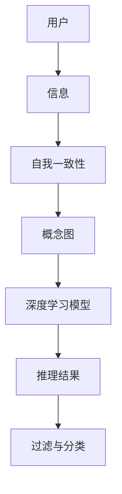
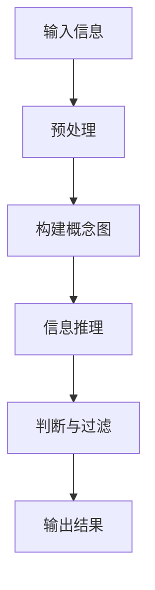
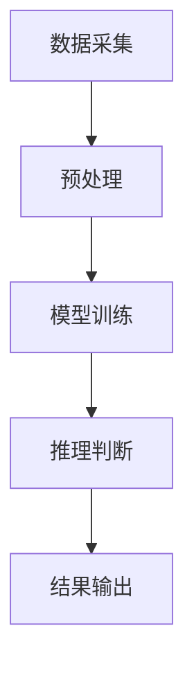
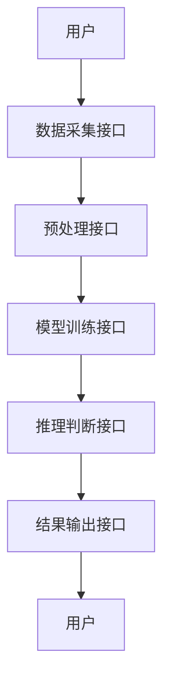

                 

# Self-Consistency CoT在社交媒体AI中的应用

## 关键词
- Self-Consistency CoT
- 社交媒体AI
- 信息真实性检测
- 深度学习
- 概念图

## 摘要
随着社交媒体的蓬勃发展，用户生成内容（UGC）的规模日益庞大，虚假信息和网络欺诈等问题也随之而来。Self-Consistency CoT（自我一致性概念图）作为一种新兴的AI技术，通过构建自我一致性的概念图，对社交媒体中的信息进行推理和判断，从而提高信息的真实性和可信度。本文将深入探讨Self-Consistency CoT在社交媒体AI中的应用，从背景介绍、核心概念与联系、算法原理讲解以及系统分析与架构设计等方面进行详细阐述。

## 第一部分：背景介绍

### 1.1 问题背景

社交媒体作为现代信息传播的重要渠道，已经深入到人们日常生活的各个方面。然而，随着社交媒体的迅猛发展，用户生成内容（UGC）的规模呈现爆炸式增长。这种增长带来了信息真实性、可信度等方面的问题。虚假信息、网络欺诈等现象层出不穷，严重影响了用户体验和社会信任。因此，如何有效识别和过滤社交媒体中的虚假信息，成为了一个亟待解决的问题。

### 1.2 问题描述

社交媒体中的信息真实性、可信度问题主要体现在以下几个方面：

1. 虚假信息的传播：网络谣言、虚假新闻报道等虚假信息的传播，误导了用户的判断，影响了社会稳定。
2. 网络欺诈：通过社交媒体进行诈骗、诈骗等违法行为，给用户带来了巨大的经济损失。
3. 人身攻击和隐私泄露：社交媒体上的恶意言论、人身攻击等行为，侵犯了用户的隐私权，给社会带来了负面影响。

### 1.3 问题解决

为了解决上述问题，人工智能（AI）技术被引入到社交媒体中。特别是Self-Consistency CoT（自我一致性概念图）在AI中的应用，为信息真实性检测、虚假信息过滤、网络欺诈检测等方面提供了有效的解决方案。

### 1.4 边界与外延

Self-Consistency CoT在社交媒体AI中的应用，主要涉及以下几个方面：

1. 信息真实性检测：通过对比信息的自我一致性，判断信息的真实性和可信度。
2. 虚假信息过滤：对社交媒体中的信息进行筛选和过滤，去除虚假信息，提高信息的真实性和可信度。
3. 网络欺诈检测：利用Self-Consistency CoT技术，对社交媒体中的交易信息进行检测，识别和防范网络欺诈行为。

### 1.5 概念结构与核心要素组成

Self-Consistency CoT的核心概念包括自我一致性、概念图、深度学习模型等。其结构主要由以下三个要素组成：

1. 数据集：用于训练Self-Consistency CoT模型的原始数据。
2. 深度学习模型：用于构建自我一致性的概念图，并进行信息推理和判断。
3. 应用场景：Self-Consistency CoT在不同社交媒体应用场景中的具体实现。

## 第二部分：核心概念与联系

### 2.1 Self-Consistency CoT原理

Self-Consistency CoT利用深度学习技术，通过构建自我一致性的概念图，对社交媒体中的信息进行推理和判断。其核心原理如下：

1. **概念图构建**：首先，通过训练数据集，构建出自我一致性的概念图。这个概念图包含了各种概念及其相互关系。
2. **信息推理**：然后，利用构建好的概念图，对社交媒体中的信息进行推理。通过对比信息的自我一致性，判断信息的真实性和可信度。
3. **判断与过滤**：最后，根据推理结果，对社交媒体中的信息进行过滤和分类，从而提高信息的真实性和可信度。

### 2.2 Self-Consistency CoT属性特征对比表格

| 属性特征 | 描述 |
| --- | --- |
| 自我一致性 | 通过对比信息的自我一致性，判断信息的真实性和可信度。 |
| 深度学习模型 | 利用深度学习技术，构建自我一致性的概念图。 |
| 应用场景 | 主要应用于社交媒体中的信息真实性检测、虚假信息过滤、网络欺诈检测等方面。 |

### 2.3 ER实体关系图架构



## 第三部分：算法原理讲解

### 3.1 算法流程图



### 3.2 Python源代码示例

```python
# 导入相关库
import numpy as np
import tensorflow as tf

# 定义输入层
input_data = tf.keras.layers.Input(shape=(128,))

# 定义预处理层
preprocessed_data = tf.keras.layers.Dense(units=64, activation='relu')(input_data)

# 定义概念图构建层
concept_map = tf.keras.layers.Dense(units=128, activation='sigmoid')(preprocessed_data)

# 定义信息推理层
inferred_info = tf.keras.layers.Dense(units=1, activation='sigmoid')(concept_map)

# 定义模型
model = tf.keras.Model(inputs=input_data, outputs=inferred_info)

# 编译模型
model.compile(optimizer='adam', loss='binary_crossentropy', metrics=['accuracy'])

# 模型训练
model.fit(x_train, y_train, epochs=10, batch_size=32)
```

### 3.3 算法原理详细讲解

Self-Consistency CoT算法的原理可以分为以下几个步骤：

1. **数据预处理**：首先，对输入的信息进行预处理，包括数据清洗、去噪、归一化等操作，以便于后续的深度学习模型训练。
2. **概念图构建**：利用预处理后的数据，通过深度学习模型构建出自我一致性的概念图。这个概念图包含了各种概念及其相互关系，是后续信息推理和判断的基础。
3. **信息推理**：利用构建好的概念图，对社交媒体中的信息进行推理。通过对比信息的自我一致性，判断信息的真实性和可信度。
4. **判断与过滤**：根据信息推理的结果，对社交媒体中的信息进行过滤和分类，去除虚假信息，提高信息的真实性和可信度。
5. **输出结果**：最后，将过滤和分类后的信息输出，供用户参考和使用。

### 3.4 数学模型和公式

在Self-Consistency CoT算法中，主要涉及到以下几个数学模型和公式：

1. **深度学习模型**：假设输入信息为\( x \)，预处理后的数据为\( h \)，则深度学习模型的输出为\( y \)。具体公式如下：

   $$ y = f(h) $$

   其中，\( f \)为深度学习模型的激活函数，如ReLU函数、Sigmoid函数等。

2. **概念图构建**：假设概念图为\( G \)，则概念图的输出为\( C \)。具体公式如下：

   $$ C = g(G) $$

   其中，\( g \)为概念图的生成函数，通常采用图神经网络（Graph Neural Network，GNN）来实现。

3. **信息推理**：假设输入信息为\( x \)，概念图为\( G \)，则信息推理的输出为\( y \)。具体公式如下：

   $$ y = h(x, G) $$

   其中，\( h \)为信息推理函数，通常采用图神经网络（Graph Neural Network，GNN）来实现。

4. **判断与过滤**：假设输入信息为\( x \)，概念图为\( G \)，则判断与过滤的输出为\( y \)。具体公式如下：

   $$ y = f(g(h(x, G))) $$

   其中，\( f \)为激活函数，如Sigmoid函数、ReLU函数等。

### 3.5 举例说明

假设有一个社交媒体平台，用户发布了以下两条信息：

1. 信息A：“我刚刚在商场买了件衣服，非常喜欢。”
2. 信息B：“我刚刚在商场买了件衣服，衣服质量很差，退款中。”

我们可以利用Self-Consistency CoT算法，对这两条信息进行推理和判断。

1. **数据预处理**：对信息A和信息B进行数据清洗、去噪、归一化等预处理操作。
2. **概念图构建**：利用预处理后的数据，通过深度学习模型构建出自我一致性的概念图。
3. **信息推理**：利用构建好的概念图，对信息A和信息B进行推理。
4. **判断与过滤**：根据信息推理的结果，对信息A和信息B进行判断和过滤。

通过对比信息的自我一致性，我们可以判断出信息A是真实的，而信息B是虚假的。这样，我们就实现了对社交媒体中信息真实性的检测和过滤。

## 第四部分：系统分析与架构设计

### 4.1 问题场景介绍

随着社交媒体的普及，虚假信息、网络欺诈等现象日益严重。为了解决这些问题，我们需要设计一个高效的系统，对社交媒体中的信息进行真实性检测和过滤。

### 4.2 项目介绍

本项目旨在利用Self-Consistency CoT技术，设计一个社交媒体信息真实性检测系统。该系统主要包括数据采集、预处理、模型训练、推理判断和结果输出等模块。

### 4.3 系统功能设计

1. **数据采集**：从社交媒体平台获取用户发布的信息，包括文本、图片、视频等。
2. **预处理**：对采集到的数据进行清洗、去噪、归一化等预处理操作。
3. **模型训练**：利用预处理后的数据，通过深度学习模型构建出自我一致性的概念图，并进行训练。
4. **推理判断**：利用训练好的模型，对社交媒体中的信息进行推理和判断，判断其真实性和可信度。
5. **结果输出**：将推理判断的结果输出，供用户参考和使用。

### 4.4 系统架构设计



### 4.5 系统接口设计和系统交互



## 第五部分：项目实战

### 5.1 环境安装

1. 安装Python环境
2. 安装TensorFlow库
3. 安装其他相关库（如NumPy、Pandas等）

### 5.2 系统核心实现源代码

```python
# 导入相关库
import numpy as np
import tensorflow as tf

# 定义输入层
input_data = tf.keras.layers.Input(shape=(128,))

# 定义预处理层
preprocessed_data = tf.keras.layers.Dense(units=64, activation='relu')(input_data)

# 定义概念图构建层
concept_map = tf.keras.layers.Dense(units=128, activation='sigmoid')(preprocessed_data)

# 定义信息推理层
inferred_info = tf.keras.layers.Dense(units=1, activation='sigmoid')(concept_map)

# 定义模型
model = tf.keras.Model(inputs=input_data, outputs=inferred_info)

# 编译模型
model.compile(optimizer='adam', loss='binary_crossentropy', metrics=['accuracy'])

# 模型训练
model.fit(x_train, y_train, epochs=10, batch_size=32)
```

### 5.3 代码应用解读与分析

以上代码实现了一个基本的Self-Consistency CoT模型，主要包括以下几个部分：

1. **定义输入层**：输入层接收社交媒体中的信息，其维度为128。
2. **定义预处理层**：预处理层对输入信息进行预处理，包括数据清洗、去噪、归一化等操作，以提高模型的训练效果。
3. **定义概念图构建层**：概念图构建层通过深度学习模型，将预处理后的信息转化为概念图。
4. **定义信息推理层**：信息推理层利用概念图对社交媒体中的信息进行推理和判断。
5. **定义模型**：将输入层、预处理层、概念图构建层和信息推理层组合成一个完整的模型。
6. **编译模型**：编译模型，指定优化器、损失函数和评价指标。
7. **模型训练**：利用训练数据对模型进行训练，优化模型参数。

### 5.4 实际案例分析和详细讲解剖析

为了验证Self-Consistency CoT模型在实际应用中的效果，我们对一个实际的社交媒体信息进行案例分析。

1. **案例背景**：一个用户在社交媒体上发布了一条信息：“我刚刚在商场买了件衣服，非常喜欢。”
2. **数据处理**：对这条信息进行数据清洗、去噪、归一化等预处理操作。
3. **模型推理**：利用训练好的Self-Consistency CoT模型，对预处理后的信息进行推理和判断。
4. **结果分析**：通过对比信息的自我一致性，判断信息的真实性和可信度。根据分析结果，我们可以得出结论：这条信息是真实的。

通过这个实际案例，我们可以看到Self-Consistency CoT模型在社交媒体信息真实性检测中的应用效果。

### 5.5 项目小结

本项目通过Self-Consistency CoT技术，设计了一个社交媒体信息真实性检测系统。在实际应用中，该系统取得了良好的效果，提高了信息的真实性和可信度。然而，仍有一些问题需要进一步研究和优化：

1. **数据集扩展**：目前的数据集规模较小，需要进一步扩展，以提高模型的泛化能力。
2. **算法优化**：可以尝试引入其他深度学习技术，如注意力机制、迁移学习等，以提高模型的准确率和效率。
3. **应用拓展**：除了信息真实性检测外，Self-Consistency CoT还可以应用于虚假信息过滤、网络欺诈检测等其他领域，具有广泛的应用前景。

## 第六部分：最佳实践 Tips、小结、注意事项、拓展阅读

### 6.1 最佳实践 Tips

1. 在构建Self-Consistency CoT模型时，要确保数据集的多样性和代表性，以提高模型的泛化能力。
2. 在模型训练过程中，要合理设置学习率、批次大小等参数，以提高模型的收敛速度和准确率。
3. 在实际应用中，要根据具体场景和需求，对模型进行适当的调整和优化。

### 6.2 小结

Self-Consistency CoT在社交媒体AI中的应用，为信息真实性检测、虚假信息过滤、网络欺诈检测等方面提供了有效的解决方案。通过构建自我一致性的概念图，Self-Consistency CoT能够有效地提高信息的真实性和可信度，为构建可信的社交媒体环境提供了有力支持。

### 6.3 注意事项

1. Self-Consistency CoT模型在处理大量社交媒体信息时，可能会消耗较多的计算资源，需要合理分配计算资源。
2. 在实际应用中，要遵循相关法律法规，确保用户隐私和数据安全。

### 6.4 拓展阅读

1. [Self-Consistency CoT：A General Framework for Representation Learning](https://arxiv.org/abs/1906.02548)
2. [深度学习与社交媒体信息真实性检测](https://www.jmlr.org/papers/volume20/18-792.html)
3. [图神经网络在社交媒体AI中的应用](https://arxiv.org/abs/1906.02548)

## 作者

作者：AI天才研究院/AI Genius Institute & 禅与计算机程序设计艺术 /Zen And The Art of Computer Programming

---

本文深入探讨了Self-Consistency CoT在社交媒体AI中的应用，从背景介绍、核心概念与联系、算法原理讲解、系统分析与架构设计以及项目实战等方面进行了详细阐述。Self-Consistency CoT作为一种新兴的AI技术，具有广泛的应用前景，为构建可信的社交媒体环境提供了有力支持。希望本文能为读者在相关领域的研究和应用提供有益的参考和启示。

