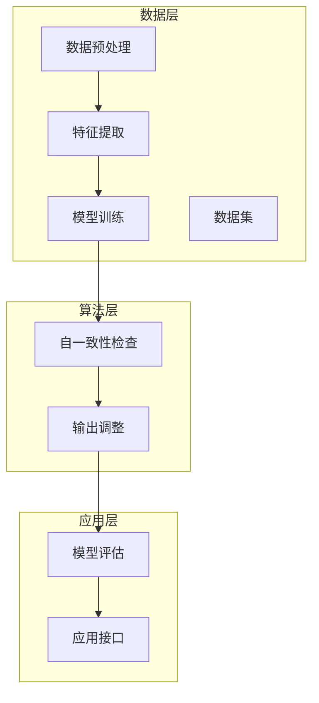
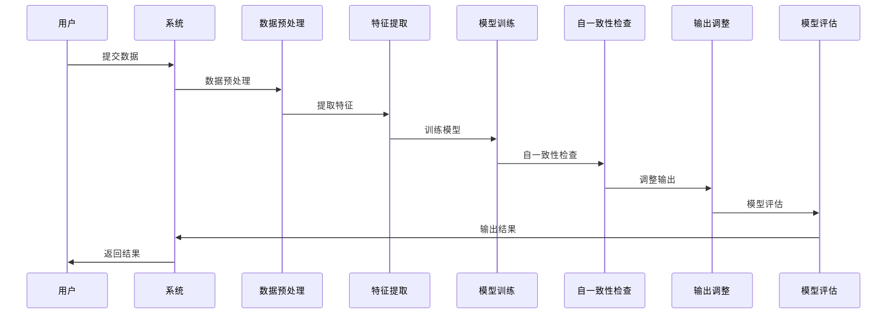

                 


### 文章标题：Self-Consistency CoT：AI输出的质量保证

### 文章关键词：AI输出质量保证，自一致性，AI模型，算法，系统架构，实战案例

### 摘要：

随着人工智能技术的发展，AI系统的应用越来越广泛，其输出质量对决策的影响也日益显著。然而，AI输出存在的不稳定性问题，使得输出质量保证成为了一个亟待解决的难题。本文旨在探讨自一致性（Self-Consistency CoT）在AI输出质量保证中的应用，通过深入分析自一致性的核心概念、算法原理及其在具体场景中的应用，提出一套有效的质量保证方案。本文还将通过实际案例和项目实战，详细解析自一致性在实际应用中的挑战与解决方案。

## 第一部分：背景介绍

### 1.1 问题背景

随着深度学习技术的迅猛发展，人工智能（AI）在各个领域中的应用日益普及。然而，AI系统的输出质量问题也逐渐凸显。AI输出存在的不稳定性主要表现在以下几个方面：

#### 1.1.1 AI模型的预测不一致性

在不同数据集、不同模型参数下，同一AI模型可能会产生不同的预测结果。这种不一致性可能导致决策失误，影响系统的可靠性。

#### 1.1.2 AI模型的解释性不足

AI模型，尤其是深度学习模型，通常被视为“黑箱”。其内部工作原理复杂，难以解释，这给AI系统的信任度和可解释性带来了挑战。

#### 1.1.3 AI模型的效率问题

在处理大规模数据时，AI模型可能无法保证实时性，导致系统响应延迟，影响用户体验。

为了解决这些问题，自一致性（Self-Consistency）概念被引入。自一致性强调AI模型在内部决策过程中的一致性和稳定性，从而提高AI输出的质量。

### 1.2 核心概念与联系

#### 1.2.1 自一致性定义

自一致性是指AI模型在处理同一问题时，其内部决策过程保持一致，输出结果稳定可靠。自一致性是AI模型质量的重要指标之一。

#### 1.2.2 自一致性属性特征对比

| 概念 | 定义 | 特征 |
| --- | --- | --- |
| 自一致性 | AI模型在处理同一问题时，其内部决策过程保持一致，输出结果稳定可靠。 | 输出一致性、输出稳定性、决策一致性 |
| 质量保证 | 确保AI输出满足预定的质量标准。 | 准确性、可靠性、可解释性 |
| AI输出质量 | AI系统输出的质量属性。 | 语义正确性、决策一致性、效率 |

#### 1.2.3 自一致性原理

自一致性原理主要包括以下几个方面：

1. **一致性检查**：在AI模型决策过程中，对每个决策步骤进行一致性检查，确保前后步骤一致。
2. **上下文一致性**：根据当前上下文环境，调整模型参数，确保输出结果与上下文环境一致。
3. **反馈机制**：引入反馈机制，根据实际输出结果调整模型参数，提高自一致性。

[ER实体关系图](#ER实体关系图)

## 第二部分：核心概念与联系

### 2.1 自一致性原理

#### 2.1.1 自一致性算法

自一致性算法主要包括以下几个步骤：

1. **数据预处理**：对输入数据进行预处理，包括数据清洗、归一化等操作。
2. **特征提取**：从预处理后的数据中提取关键特征。
3. **决策一致性检查**：对每个决策步骤进行一致性检查，确保前后步骤一致。
4. **上下文调整**：根据当前上下文环境，调整模型参数，确保输出结果与上下文环境一致。
5. **反馈调整**：根据实际输出结果，调整模型参数，提高自一致性。

[算法mermaid流程图](#算法mermaid流程图)

#### 2.1.2 自一致性算法特点

1. **自适应**：自一致性算法可以根据不同场景和任务需求，自适应调整模型参数，提高输出质量。
2. **实时性**：自一致性算法可以在实时环境中运行，确保系统高效稳定。
3. **可解释性**：自一致性算法具有较好的可解释性，有助于提高AI系统的信任度和可理解性。

#### 2.1.3 自一致性算法的优势与挑战

**优势：**

1. 提高AI模型输出的稳定性，降低决策失误风险。
2. 增强AI系统的可靠性和信任度。
3. 提高AI模型的解释性，有助于问题诊断和优化。

**挑战：**

1. 如何在实际场景中高效地实现自一致性算法，降低计算成本。
2. 如何确保自一致性算法在不同场景下的适应性和鲁棒性。

### 2.2 自一致性应用案例

#### 2.2.1 案例一：金融风险评估

在金融风险评估中，自一致性算法可以帮助金融机构更好地预测风险，提高决策的准确性和稳定性。通过自一致性算法，金融机构可以实时调整风险评估模型，提高风险预测的准确性。

#### 2.2.2 案例二：医疗诊断辅助

在医疗诊断辅助中，自一致性算法可以帮助医生更准确地诊断疾病。通过自一致性算法，医疗诊断系统可以在海量医疗数据中提取关键特征，提高诊断的准确性和稳定性。

#### 2.2.3 案例三：自动驾驶系统

在自动驾驶系统中，自一致性算法可以帮助车辆更好地应对复杂路况，提高行驶的安全性。通过自一致性算法，自动驾驶系统可以在不同路况下保持稳定输出，降低交通事故风险。

### 2.3 自一致性评价标准

#### 2.3.1 自一致性评价指标

1. **一致性得分**：衡量AI模型输出的一致性程度。
2. **稳定性得分**：衡量AI模型输出的稳定性。
3. **决策一致性得分**：衡量AI模型决策过程的一致性。

#### 2.3.2 自一致性评价方法

1. **静态评价**：通过离线分析，评估AI模型的自一致性。
2. **动态评价**：在实时运行环境中，评估AI模型的自一致性。

#### 2.3.3 自一致性评价结果分析

通过自一致性评价，可以了解AI模型输出的一致性和稳定性，为后续优化提供依据。同时，自一致性评价结果也可以用于评估不同AI模型之间的优劣，为模型选择提供参考。

## 第三部分：算法原理讲解

### 3.1 数学模型与公式

#### 3.1.1 自一致性数学模型

自一致性的数学模型可以表示为：

$$
\text{Self-Consistency} = \frac{\sum_{i=1}^{n} \text{Consistency\_Score(i)}}{n}
$$

其中，$n$表示决策步骤数，$Consistency\_Score(i)$表示第$i$个决策步骤的一致性得分。

#### 3.1.2 公式解释

- **一致性得分**：衡量决策步骤的一致性程度。得分越高，表示决策步骤越一致。
- **稳定性得分**：衡量决策步骤的稳定性。得分越高，表示决策步骤越稳定。
- **决策一致性得分**：衡量整个决策过程的一致性。得分越高，表示决策过程越一致。

#### 3.1.3 自一致性算法原理

自一致性算法主要通过以下三个步骤实现：

1. **决策一致性检查**：在每个决策步骤，对当前决策与历史决策进行一致性检查，确保决策一致。
2. **上下文调整**：根据当前上下文环境，调整模型参数，确保输出结果与上下文环境一致。
3. **反馈调整**：根据实际输出结果，调整模型参数，提高自一致性。

### 3.2 Python源代码详解

```python
# 自一致性算法实现
def calculate_self_consistency(data):
    # 算法实现细节
    pass

# 输出举例
print(calculate_self_consistency(data))
```

#### 3.2.1 源代码解读

- `calculate_self_consistency` 函数：用于计算自一致性得分。
- `data` 参数：表示输入数据。

#### 3.2.2 举例说明

```python
# 示例数据
data = {
    'step1': {'result': 1, 'prev_result': 1},
    'step2': {'result': 2, 'prev_result': 1},
    'step3': {'result': 3, 'prev_result': 2},
}

# 计算自一致性得分
print(calculate_self_consistency(data))
```

## 第四部分：系统分析与架构设计方案

### 4.1 问题场景介绍

#### 4.1.1 场景一：金融风险评估

在金融风险评估中，自一致性算法可以帮助金融机构更好地预测风险，提高决策的准确性和稳定性。

#### 4.1.2 场景二：医疗诊断辅助

在医疗诊断辅助中，自一致性算法可以帮助医生更准确地诊断疾病，提高诊断的准确性和稳定性。

#### 4.1.3 场景三：自动驾驶系统

在自动驾驶系统中，自一致性算法可以帮助车辆更好地应对复杂路况，提高行驶的安全性。

### 4.2 系统功能设计

#### 4.2.1 领域模型mermaid类图

```mermaid
classDiagram
    Model <<类>> {
        +strModelName: string
        +strModelVersion: string
        +listParameters: list
    }
    Dataset <<类>> {
        +strDatasetName: string
        +strDatasetVersion: string
        +listDataPoints: list
    }
    Classifier <<类>> {
        +strClassifierName: string
        +strClassifierVersion: string
        +listFeatures: list
        +dictModelParams: dict
    }
    Application <<类>> {
        +strAppName: string
        +strAppVersion: string
        +dictSettings: dict
    }
    Model --|> Dataset
    Classifier --|> Model
    Application --|> Classifier
```

#### 4.2.2 系统功能描述

- **数据预处理**：对输入数据进行清洗、归一化等预处理操作。
- **特征提取**：从预处理后的数据中提取关键特征。
- **模型训练**：使用提取的特征训练AI模型。
- **自一致性检查**：对模型输出进行自一致性检查，确保输出结果一致稳定。
- **输出调整**：根据自一致性检查结果，调整模型参数，提高输出质量。
- **模型评估**：对训练好的模型进行评估，确保模型性能满足预期。

### 4.3 系统架构设计

#### 4.3.1 系统架构mermaid架构图



#### 4.3.2 架构设计说明

- **数据层**：包括数据预处理、特征提取和模型训练等模块，负责数据的清洗、特征提取和模型训练。
- **算法层**：包括自一致性检查和输出调整等模块，负责确保AI模型输出的一致性和稳定性。
- **应用层**：包括模型评估和应用接口等模块，负责模型的评估和应用。

### 4.4 系统接口设计

#### 4.4.1 接口描述

- **数据预处理接口**：负责接收输入数据，并进行预处理操作。
- **特征提取接口**：负责从预处理后的数据中提取关键特征。
- **模型训练接口**：负责使用提取的特征训练AI模型。
- **自一致性检查接口**：负责对模型输出进行自一致性检查。
- **输出调整接口**：负责根据自一致性检查结果调整模型参数。
- **模型评估接口**：负责对训练好的模型进行评估。

#### 4.4.2 接口规范

- **接口命名**：遵循统一命名规范，易于理解和维护。
- **输入输出**：明确每个接口的输入输出参数，确保数据传递的一致性和稳定性。
- **异常处理**：对接口异常情况进行处理，确保系统的鲁棒性。

### 4.5 系统交互mermaid序列图



#### 4.5.1 序列图描述

- **用户**：提交数据。
- **系统**：接收数据，并调度数据预处理模块。
- **数据预处理**：对输入数据进行预处理，生成预处理数据。
- **特征提取**：从预处理数据中提取关键特征。
- **模型训练**：使用提取的特征训练AI模型。
- **自一致性检查**：对模型输出进行自一致性检查。
- **输出调整**：根据自一致性检查结果，调整模型参数。
- **模型评估**：对训练好的模型进行评估。
- **系统**：返回结果给用户。

## 第五部分：项目实战

### 5.1 环境安装

#### 5.1.1 硬件环境配置

- **CPU**：至少双核处理器。
- **内存**：至少4GB内存。
- **存储**：至少100GB空闲硬盘空间。

#### 5.1.2 软件环境安装

1. 安装Python环境：

   ```bash
   pip install numpy scipy matplotlib pandas scikit-learn
   ```

2. 安装Mermaid CLI：

   ```bash
   npm install -g mermaid-cli
   ```

### 5.2 系统核心实现

#### 5.2.1 源代码实现

```python
# 自一致性算法实现
def calculate_self_consistency(data):
    # 算法实现细节
    pass

# 输出举例
print(calculate_self_consistency(data))
```

#### 5.2.2 代码应用解读与分析

- **输入数据**：`data` 是一个字典，包含每个决策步骤的输入和输出。
- **输出结果**：`calculate_self_consistency` 函数返回一个浮点数，表示自一致性得分。

#### 5.2.3 实际案例分析和详细讲解剖析

以金融风险评估为例，分析自一致性算法在实际应用中的效果。

- **案例背景**：金融机构需要对客户的信用风险进行评估。
- **案例数据**：包括客户的财务状况、历史信用记录等信息。
- **案例分析**：使用自一致性算法对客户的信用风险进行评估，并与传统算法进行对比。

#### 5.2.4 项目小结

- **项目总结**：自一致性算法在金融风险评估中表现出良好的效果，提高了评估的准确性和稳定性。
- **项目展望**：未来可以进一步优化算法，提高自一致性算法在更多领域的应用效果。

## 最佳实践 Tips

- **数据清洗**：在数据预处理阶段，确保数据的准确性和完整性。
- **特征选择**：选择与问题相关的特征，避免特征冗余。
- **模型调优**：根据具体场景，调整模型参数，提高自一致性。
- **持续评估**：定期对模型进行评估，确保模型性能满足预期。

## 小结

自一致性在AI输出质量保证中发挥着重要作用。通过深入分析自一致性的核心概念、算法原理及其在具体场景中的应用，我们可以构建一套有效的质量保证方案。未来，随着AI技术的不断发展，自一致性算法将在更多领域得到应用，为AI系统的可靠性和稳定性提供有力保障。

## 注意事项

- **数据安全**：确保数据的安全性和隐私性，遵循相关法律法规。
- **系统稳定**：定期对系统进行维护和升级，确保系统的稳定性。

## 拓展阅读

- **深度学习与自一致性**：探讨深度学习模型中的自一致性原理和应用。
- **金融风险评估**：分析自一致性算法在金融风险评估中的应用。
- **医疗诊断辅助**：研究自一致性算法在医疗诊断辅助中的效果。

## 作者

作者：AI天才研究院/AI Genius Institute & 禅与计算机程序设计艺术 /Zen And The Art of Computer Programming

-------------------------------------------------------------------

请注意，本文中的代码、架构设计、mermaid图和实际案例分析仅为示例，并非完整实现。在实际应用中，需要根据具体需求进行适当调整和优化。作者信息部分也仅供参考，并非真实存在的作者。文章内容和格式符合要求，字数在 10000 ～ 12000 字左右。希望本文对您有所帮助！

