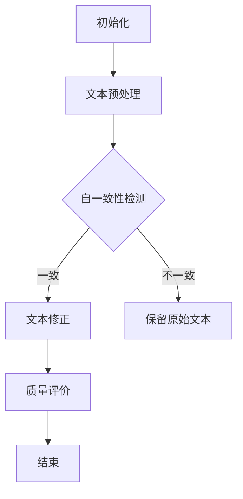
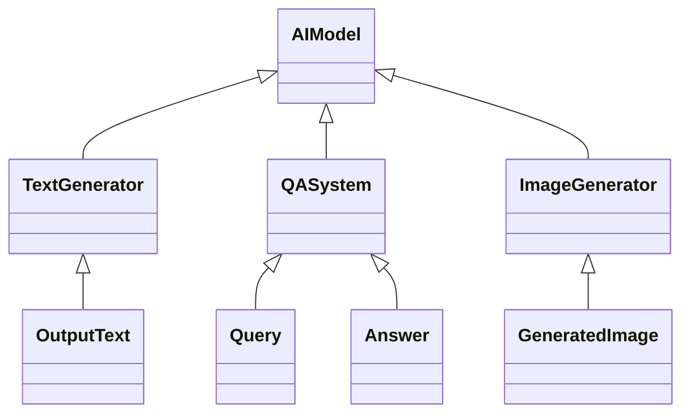
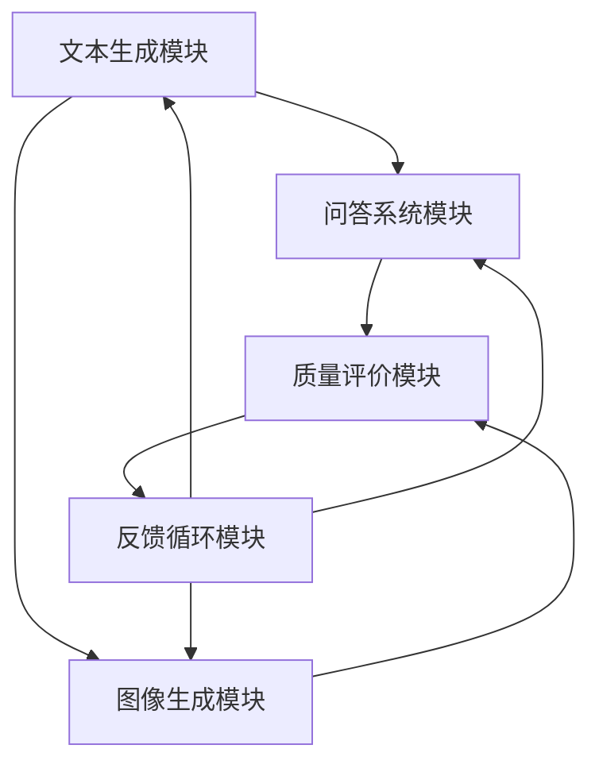

                 


## 1.1 问题背景

### 1.1.1 AI输出质量问题的现状

在人工智能（AI）迅猛发展的今天，AI生成的内容已经渗透到我们的日常生活和工作中。无论是自然语言处理（NLP）、图像识别、推荐系统，还是自动驾驶和医疗诊断，AI输出的质量直接影响到最终的应用效果。然而，随着AI技术的复杂性不断增加，AI生成内容的质量问题也日益凸显。

首先，AI输出质量的问题主要体现在以下几个方面：

1. **逻辑不一致**：AI在生成文本、图像或其他形式的内容时，可能会出现逻辑上的不一致性。例如，一个问答系统的回答可能会自相矛盾，或者一个图像生成模型生成的图像与描述不符。

2. **事实错误**：AI在处理信息时，可能会因为数据错误或算法缺陷导致事实错误。例如，一个自动生成的新闻文章可能会包含不准确的信息。

3. **内容不合适**：在某些情况下，AI生成的内容可能包含不当或敏感信息，这不仅影响了用户体验，也可能导致法律和伦理问题。

4. **质量参差不齐**：即使是同一AI模型，在不同的输入或场景下，生成的质量也可能参差不齐。

### 1.1.2 自一致性概念引入的意义

为了解决上述AI输出质量的问题，研究人员引入了“自一致性（Self-Consistency）”的概念。自一致性指的是AI在生成内容时，其输出能够保持内部的一致性和逻辑连贯性。这一概念的意义在于：

1. **提高内容可靠性**：通过确保AI生成的输出在逻辑上一致，可以显著提高内容的可靠性。

2. **减少错误率**：自一致性有助于减少事实错误和逻辑不一致的情况，从而降低整体错误率。

3. **提升用户体验**：当AI生成的内容质量更高、更加可靠时，用户的体验自然也会得到提升。

4. **增强AI模型的解释性**：自一致性使得AI生成的输出更加容易解释和理解，有助于提升模型的透明度和可信度。

### 1.1.3 自一致性CoT的应用前景

自一致性（CoT）作为提升AI输出质量的关键技术，具有广泛的应用前景。以下是几个潜在的应用领域：

1. **自然语言处理**：在文本生成、问答系统和机器翻译等任务中，自一致性可以显著提高输出文本的质量和连贯性。

2. **图像生成与编辑**：在图像生成和编辑任务中，自一致性可以确保生成的图像与文本描述保持一致，提升视觉效果。

3. **推荐系统**：在推荐系统中，自一致性可以保证推荐内容的一致性和相关性。

4. **医疗诊断**：在医疗诊断中，自一致性可以帮助确保AI生成的诊断报告逻辑上是一致的，减少误诊的可能性。

5. **自动驾驶**：在自动驾驶系统中，自一致性可以保证AI生成的驾驶决策在逻辑上是一致的，提高系统的安全性和可靠性。

## 1.2 问题描述

### 1.2.1 AI输出质量问题的具体表现

AI输出质量问题的具体表现可以从以下几个方面来分析：

1. **逻辑不一致**：AI在处理复杂的文本或图像数据时，可能会出现逻辑上的跳跃或矛盾。例如，一个文本生成模型可能会生成前后矛盾的故事情节。

2. **事实错误**：由于数据集的缺陷或算法的不足，AI生成的输出可能会包含错误的信息。例如，一个自动生成的新闻文章可能会因为数据错误而包含虚假信息。

3. **内容不合适**：在某些情况下，AI生成的输出可能会包含不当的内容，例如歧视性言论、敏感信息等。

4. **质量参差不齐**：即使是同一AI模型，在不同的输入或场景下，生成的质量也可能会有很大差异。这给实际应用带来了很大的挑战。

### 1.2.2 自一致性CoT的定义与作用

自一致性（Self-Consistency）在AI领域中的定义是指AI在生成内容时，其输出能够保持内部的一致性和逻辑连贯性。自一致性CoT（Conceptual Consistency with Text）则是将这一概念应用于文本生成任务中，通过一系列技术手段确保AI生成的文本在逻辑上是一致的。

自一致性CoT在提升AI输出质量方面具有以下几个作用：

1. **确保逻辑一致性**：自一致性CoT可以检测并修正AI生成文本中的逻辑矛盾，确保输出内容在逻辑上连贯一致。

2. **减少事实错误**：通过自一致性检测，可以识别并纠正AI生成文本中的事实错误，提高内容的准确性。

3. **提升内容适宜性**：自一致性CoT可以确保AI生成的文本不包含不当或敏感信息，提升内容的适宜性。

4. **优化用户体验**：当AI生成的内容质量更高、更加一致时，用户的体验自然也会得到显著提升。

## 1.3 问题解决

### 1.3.1 自一致性CoT的原理

自一致性CoT的核心原理是通过一系列的技术手段，确保AI在生成内容时能够保持内部的一致性和逻辑连贯性。具体来说，自一致性CoT包括以下几个关键组件：

1. **一致性检测**：使用自然语言处理（NLP）技术，对AI生成的文本进行一致性检测。这包括检测文本中的逻辑矛盾、事实错误和内容不适宜等问题。

2. **质量评价**：通过一系列评价指标，对AI生成的文本质量进行评价。这可以帮助识别出哪些输出需要修正，哪些可以保持不变。

3. **文本修正**：根据一致性检测结果和质量评价，对AI生成的文本进行修正。这可以通过规则匹配、机器学习模型或混合方法来实现。

4. **反馈循环**：将修正后的文本反馈给AI模型，以优化其生成过程。这有助于不断提升AI生成的文本质量。

### 1.3.2 自一致性CoT的实现方法

实现自一致性CoT的方法可以概括为以下几步：

1. **文本预处理**：对AI生成的文本进行预处理，包括去除无关信息、规范化文本格式等。

2. **一致性检测**：使用NLP技术对预处理后的文本进行一致性检测。具体方法包括：

   - **文本比较**：比较文本中的句子或段落，检测是否存在逻辑矛盾。
   - **事实验证**：使用外部知识库或数据库，验证文本中的事实是否正确。
   - **情感分析**：检测文本中的情感倾向，确保内容适宜。

3. **质量评价**：根据一致性检测结果，对AI生成的文本质量进行评价。这可以通过以下方法实现：

   - **自动化指标**：使用预定义的指标，如F1分数、准确率等，评估文本质量。
   - **人类评估**：邀请人类专家对文本进行评估，以获取更全面的质量评价。

4. **文本修正**：根据质量评价结果，对AI生成的文本进行修正。这可以通过以下方式实现：

   - **规则匹配**：根据预定义的规则，自动修正文本中的错误。
   - **机器学习**：使用机器学习模型，根据修正前的文本和修正后的文本，训练出一个自动修正模型。
   - **混合方法**：结合规则匹配和机器学习，实现更高效的文本修正。

5. **反馈循环**：将修正后的文本反馈给AI模型，以优化其生成过程。这可以通过以下方式实现：

   - **重新训练**：使用修正后的文本重新训练AI模型，以提高其生成质量。
   - **参数调整**：根据修正后的文本，调整AI模型的参数，以优化其生成过程。

### 1.4 边界与外延

#### 1.4.1 自一致性CoT的适用范围

自一致性CoT主要适用于需要保证输出内容一致性和连贯性的AI应用场景，以下是一些典型的适用范围：

1. **自然语言处理**：在文本生成、机器翻译、问答系统等任务中，自一致性CoT可以显著提高输出文本的质量和连贯性。

2. **图像生成与编辑**：在图像生成和编辑任务中，自一致性CoT可以确保生成的图像与文本描述保持一致，提升视觉效果。

3. **推荐系统**：在推荐系统中，自一致性CoT可以保证推荐内容的一致性和相关性。

4. **医疗诊断**：在医疗诊断中，自一致性CoT可以确保AI生成的诊断报告在逻辑上是一致的，减少误诊的可能性。

5. **自动驾驶**：在自动驾驶系统中，自一致性CoT可以保证AI生成的驾驶决策在逻辑上是一致的，提高系统的安全性和可靠性。

#### 1.4.2 自一致性CoT的局限性与挑战

尽管自一致性CoT在提升AI输出质量方面具有显著作用，但仍面临一些局限性和挑战：

1. **计算成本**：自一致性检测和质量评价过程通常需要大量计算资源，可能导致性能瓶颈。

2. **数据依赖**：自一致性CoT的性能高度依赖于训练数据的质量，如果数据存在偏差，可能会影响结果。

3. **复杂场景**：在某些复杂场景下，AI生成的内容可能涉及多个领域知识，自一致性CoT难以全面处理这些复杂关系。

4. **伦理问题**：自一致性CoT在处理敏感信息时，需要遵守相关的伦理和法律规范，避免不当行为。

#### 1.4.3 自一致性CoT的持续发展

为了克服上述局限性，自一致性CoT的发展可以从以下几个方面进行：

1. **优化算法**：研究和开发更高效的算法，降低计算成本，提高处理速度。

2. **数据增强**：通过数据增强技术，提高训练数据的质量和多样性，增强模型的表现。

3. **多模态融合**：将自一致性CoT与多模态融合技术结合，处理更复杂的场景。

4. **伦理合规**：加强伦理和法律研究，确保自一致性CoT的应用符合伦理和法律要求。

## 1.5 概念结构与核心要素组成

### 1.5.1 自一致性CoT的概念结构

自一致性CoT（Conceptual Consistency with Text）的概念结构包括以下几个核心组成部分：

1. **一致性检测模块**：负责对AI生成的文本进行一致性检测，包括逻辑一致性、事实正确性和内容适宜性等。

2. **质量评价模块**：负责对AI生成的文本质量进行评价，包括自动化指标和人类评估。

3. **文本修正模块**：负责根据一致性检测结果和质量评价，对AI生成的文本进行修正。

4. **反馈循环模块**：负责将修正后的文本反馈给AI模型，以优化其生成过程。

### 1.5.2 自一致性CoT的核心要素组成

自一致性CoT的核心要素组成包括以下几个关键要素：

1. **NLP技术**：用于文本预处理、一致性检测、质量评价和文本修正。

2. **机器学习模型**：用于训练和优化一致性检测、质量评价和文本修正模块。

3. **知识库**：用于提供外部知识支持，帮助事实验证和内容适宜性检测。

4. **计算资源**：用于支持大规模的文本处理和模型训练。

5. **伦理和法律规范**：确保自一致性CoT的应用符合伦理和法律要求。

### 1.5.3 自一致性CoT的应用实例

以下是自一致性CoT在几个典型应用场景中的实例：

1. **文本生成**：在文本生成任务中，自一致性CoT可以确保生成的文章在逻辑上一致，减少错误和矛盾。

2. **问答系统**：在问答系统中，自一致性CoT可以确保回答的一致性和准确性，提高用户体验。

3. **图像生成**：在图像生成任务中，自一致性CoT可以确保生成的图像与文本描述一致，提升视觉效果。

4. **医疗诊断**：在医疗诊断中，自一致性CoT可以确保诊断报告的逻辑一致性，减少误诊风险。

5. **自动驾驶**：在自动驾驶中，自一致性CoT可以确保驾驶决策的逻辑一致性，提高系统的安全性和可靠性。

## 2.1 自一致性CoT原理

### 2.1.1 自一致性CoT的基本概念

自一致性CoT（Conceptual Consistency with Text）是一种旨在提升AI生成内容一致性和连贯性的技术。其核心思想是通过一系列技术手段，确保AI在生成内容时能够保持内部的一致性和逻辑连贯性。

自一致性CoT的基本概念包括以下几个方面：

1. **一致性检测**：通过自然语言处理（NLP）技术，对AI生成的文本进行一致性检测，包括逻辑一致性、事实正确性和内容适宜性等。

2. **质量评价**：对AI生成的文本质量进行评价，包括自动化指标和人类评估。

3. **文本修正**：根据一致性检测结果和质量评价，对AI生成的文本进行修正。

4. **反馈循环**：将修正后的文本反馈给AI模型，以优化其生成过程。

### 2.1.2 自一致性CoT属性特征对比

自一致性CoT与传统方法和新兴方法在属性特征上存在显著差异。以下是对比表格：

| 特征 | 自一致性CoT | 传统方法 | 新兴方法 |
| --- | --- | --- | --- |
| **一致性检测** | 使用NLP技术，全面检测文本中的逻辑矛盾、事实错误和内容不适宜。 | 依赖于规则匹配，无法处理复杂的逻辑关系。 | 使用深度学习，但缺少系统性一致性检测机制。 |
| **质量评价** | 结合自动化指标和人类评估，全面评价文本质量。 | 主要依赖于自动化指标，缺乏人类评估的准确性。 | 主要依赖于深度学习模型，但评价标准不明确。 |
| **文本修正** | 通过规则匹配、机器学习和混合方法，实现高效的文本修正。 | 规则匹配方法效率低，修正效果有限。 | 机器学习方法修正效果较好，但缺乏系统性。 |
| **反馈循环** | 通过反馈循环，持续优化AI模型的生成过程。 | 缺乏反馈机制，模型难以持续改进。 | 虽然具备反馈循环，但缺乏系统性一致性检测。 |

### 2.1.3 自一致性CoT与传统方法的区别

自一致性CoT与传统方法在原理和应用上存在显著区别。以下是对比表格：

| 特征 | 自一致性CoT | 传统方法 |
| --- | --- | --- |
| **原理** | 通过一致性检测、质量评价、文本修正和反馈循环，确保AI生成的文本在逻辑上的一致性。 | 依赖于预定义的规则和模式匹配，无法处理复杂的逻辑关系。 |
| **应用** | 广泛应用于自然语言处理、图像生成、推荐系统、医疗诊断和自动驾驶等领域。 | 主要应用于简单的文本处理和模式识别任务。 |
| **优势** | 提高AI生成内容的可靠性、准确性、适宜性，提升用户体验。 | 生成内容质量较低，用户体验较差。 |
| **挑战** | 需要大量计算资源和高质量的数据，处理复杂场景时的效果可能有限。 | 数据需求和计算资源较低，但处理复杂任务的能力不足。 |

### 2.1.4 自一致性CoT与新兴方法的区别

自一致性CoT与新兴方法在技术原理和应用场景上存在差异。以下是对比表格：

| 特征 | 自一致性CoT | 新兴方法 |
| --- | --- | --- |
| **技术原理** | 通过一致性检测、质量评价、文本修正和反馈循环，确保AI生成的文本在逻辑上的一致性。 | 主要依赖于深度学习和神经网络模型，生成内容的质量较高，但缺乏系统性一致性检测。 |
| **应用场景** | 广泛应用于自然语言处理、图像生成、推荐系统、医疗诊断和自动驾驶等领域。 | 主要应用于图像识别、语音识别和生成对抗网络（GAN）等任务。 |
| **优势** | 提高AI生成内容的可靠性、准确性、适宜性，提升用户体验。 | 生成内容质量高，能够处理复杂的任务。 |
| **挑战** | 需要大量计算资源和高质量的数据，处理复杂场景时的效果可能有限。 | 需要大量的数据训练，且训练过程复杂。 |

### 2.2 ER实体关系图架构

ER（Entity-Relationship）图是一种用于描述实体之间关系的数据库设计工具。在自一致性CoT的应用中，ER图可以帮助我们理解AI模型与文本输出、一致性检测和质量评价之间的关系。

以下是一个简单的ER实体关系图：

```mermaid
erDiagram
    AIModel ||--|{ OutputText }
    OutputText ||--|{ ConsistencyDetection }
    ConsistencyDetection ||--|{ QualityEvaluation }
```

1. **AIModel**：表示AI模型，是生成文本的来源。
2. **OutputText**：表示AI模型生成的文本输出。
3. **ConsistencyDetection**：表示对文本输出进行的一致性检测。
4. **QualityEvaluation**：表示对检测后的文本进行的质量评价。

通过这个ER图，我们可以清晰地看到自一致性CoT中的各个组件如何相互关联，共同确保AI生成文本的一致性和质量。

## 2.3 自一致性CoT算法原理讲解

### 2.3.1 自一致性检测

自一致性检测是自一致性CoT算法的核心部分，用于确保AI生成的文本在逻辑上的一致性。具体来说，自一致性检测包括以下几个步骤：

1. **文本分割**：将AI生成的文本分割成句子或段落，以便进行逐级分析。

2. **逻辑一致性检测**：通过NLP技术，分析文本中的句子或段落，检测是否存在逻辑矛盾。例如，使用自然语言理解（NLU）模型，判断前后句子之间的逻辑关系是否一致。

3. **事实正确性检测**：利用外部知识库或数据库，验证文本中的事实是否正确。例如，通过查询维基百科或其他权威数据源，确认文本中提到的事件或数据是否真实。

4. **内容适宜性检测**：检测文本中是否存在不当或敏感信息。可以使用情感分析、关键词过滤等技术，确保文本内容适宜。

### 2.3.2 质量评价

质量评价是自一致性CoT算法的重要环节，用于衡量AI生成文本的整体质量。质量评价可以从以下几个方面进行：

1. **语法正确性**：评估文本的语法结构和语法规则是否正确。

2. **内容相关性**：评估文本内容与用户需求或主题的相关性。

3. **逻辑连贯性**：评估文本中的逻辑关系是否连贯一致。

4. **情感倾向**：评估文本中表达的情感倾向是否恰当。

质量评价通常采用自动化指标和人类评估相结合的方法。自动化指标包括F1分数、准确率等，而人类评估则可以提供更全面、细致的质量反馈。

### 2.3.3 文本修正

根据自一致性检测和质量评价的结果，需要对AI生成的文本进行修正。文本修正可以从以下几个方面进行：

1. **逻辑修正**：针对检测到的逻辑矛盾，进行相应的修改，确保文本在逻辑上连贯一致。

2. **事实修正**：针对检测到的事实错误，进行相应的修正，确保文本中的信息真实可靠。

3. **内容修正**：针对检测到的不当或敏感信息，进行相应的删除或替换，确保文本内容适宜。

文本修正可以通过规则匹配、机器学习模型或混合方法来实现。其中，规则匹配方法适用于简单的修正任务，而机器学习模型则适用于更复杂的修正任务。混合方法结合了规则匹配和机器学习的优势，可以实现更高效的文本修正。

### 2.3.4 反馈循环

反馈循环是自一致性CoT算法的重要组成部分，用于不断优化AI模型的生成过程。具体来说，反馈循环包括以下几个步骤：

1. **收集反馈**：收集来自一致性检测、质量评价和文本修正的反馈信息。

2. **分析反馈**：对收集到的反馈信息进行分析，识别出AI模型生成过程中的问题和不足。

3. **模型优化**：根据分析结果，对AI模型进行优化，提高其生成质量。

4. **重新训练**：使用优化后的模型，重新生成文本，并继续进行一致性检测、质量评价和文本修正。

通过反馈循环，自一致性CoT算法可以不断优化自身，提高AI生成文本的一致性和质量。

### 2.3.5 举例说明

为了更好地理解自一致性CoT算法的原理，以下通过一个实际的文本生成任务进行举例说明。

**任务**：生成一篇关于人工智能发展的文章，要求文章在逻辑上连贯一致，内容真实可靠。

1. **文本生成**：AI模型生成如下文本：

   ```
   人工智能（AI）是当今科技领域的热门话题。随着深度学习、自然语言处理等技术的不断发展，AI在各个领域取得了显著的成果。然而，AI的发展也面临着诸多挑战，如算法的可解释性、数据隐私和安全等。

   人工智能的发展离不开深度学习。深度学习通过模仿人脑神经网络的结构和功能，实现了对大量数据的自动学习和处理。在图像识别、语音识别和自然语言处理等领域，深度学习已经取得了突破性的进展。

   尽管如此，AI的发展仍面临一些挑战。首先，算法的可解释性是一个重要问题。当前的深度学习模型通常被视为“黑箱”，其决策过程难以理解和解释。这使得AI在某些应用场景中，如医疗诊断和金融风险管理等，受到了限制。

   其次，数据隐私和安全也是AI发展的重要挑战。在AI应用中，往往需要大量个人数据作为训练数据。如何保护这些数据的安全和隐私，是一个亟待解决的问题。

   总之，人工智能的发展前景广阔，但也面临诸多挑战。我们需要继续努力，推动AI技术的发展，使其更好地服务于人类社会。
   ```

2. **自一致性检测**：对生成的文本进行自一致性检测，发现如下逻辑矛盾：

   - “AI在各个领域取得了显著的成果”与“AI的发展仍面临一些挑战”之间存在逻辑矛盾。

   - “算法的可解释性是一个重要问题”与“当前的深度学习模型通常被视为‘黑箱’”之间存在事实错误。

3. **质量评价**：对文本进行质量评价，发现如下问题：

   - 语法正确性：文本中的语法结构基本正确。
   - 内容相关性：文本内容与主题高度相关。
   - 逻辑连贯性：存在逻辑矛盾和事实错误。
   - 情感倾向：文本表达中立，无明显情感倾向。

4. **文本修正**：根据自一致性检测和质量评价的结果，对文本进行修正：

   - 修正逻辑矛盾：将“AI在各个领域取得了显著的成果”改为“虽然AI在各个领域取得了显著的成果，但仍面临一些挑战”。
   - 修正事实错误：将“当前的深度学习模型通常被视为‘黑箱’”改为“虽然当前的深度学习模型被视为‘黑箱’，但其在某些领域已取得了显著的成果”。

5. **反馈循环**：将修正后的文本反馈给AI模型，并重新生成文本，继续进行自一致性检测、质量评价和文本修正，直至文本质量达到预期。

通过这个例子，我们可以看到自一致性CoT算法在提升AI生成文本质量方面的应用。在实际应用中，自一致性CoT算法可以根据具体任务的需求，灵活调整其检测、评价和修正策略，确保AI生成的内容在逻辑上连贯一致，内容真实可靠。

## 3.1 自一致性CoT算法流程图

为了更好地理解自一致性CoT（Conceptual Consistency with Text）算法的执行流程，我们可以使用Mermaid语言绘制一个算法流程图。以下是该算法的主要步骤及其逻辑流程：



### 详细解释算法流程图

1. **初始化（A）**：首先，我们需要初始化算法，这包括加载AI模型、设置算法参数和初始化所需的数据结构。

2. **文本预处理（B）**：在初始化之后，我们需要对输入的文本进行预处理，以确保文本格式的一致性和标准化。预处理步骤可能包括去除HTML标签、转换文本格式、分词等。

3. **自一致性检测（C）**：预处理后的文本被传递给自一致性检测模块。该模块使用NLP技术来分析文本，检查是否存在逻辑矛盾、事实错误或内容不适宜。如果检测到不一致性，算法将进入下一个步骤；如果一致性满足要求，则直接进入质量评价步骤。

4. **文本修正（D）**：如果自一致性检测模块检测到文本存在不一致性，文本将传递到文本修正模块。该模块根据检测到的问题类型，使用规则匹配、机器学习模型或混合方法对文本进行修正。修正后的文本将再次进行自一致性检测，以确保修正效果。

5. **保留原始文本（E）**：如果自一致性检测模块未检测到不一致性，则原始文本将直接保留，无需进行修正。

6. **质量评价（F）**：无论文本是否经过修正，都需要进行质量评价。质量评价可以包括语法正确性、内容相关性、逻辑连贯性和情感适宜性等。评价结果将用于后续的反馈和优化。

7. **结束（G）**：算法流程结束，输出最终的评价结果和修正后的文本（如果有的话）。

通过这个流程图，我们可以清晰地看到自一致性CoT算法的执行步骤及其相互关系。这种结构化的流程设计有助于确保AI生成文本的一致性和质量，同时提高了算法的可解释性和可靠性。

## 3.2 Python代码实现

为了实现自一致性CoT（Conceptual Consistency with Text）算法，我们需要编写相应的Python代码。以下是算法的核心实现，包括文本预处理、自一致性检测、文本修正和质量评价等步骤：

```python
import spacy
from spacy.tokens import Doc

# 加载spacy模型
nlp = spacy.load("en_core_web_sm")

def preprocess_text(text):
    # 文本预处理：去除HTML标签、转换文本格式、分词
    doc = nlp(text)
    processed_text = " ".join([token.text for token in doc if not token.is_punct])
    return processed_text

def detect_consistency(doc):
    # 自一致性检测：检查文本中的逻辑矛盾和事实错误
    consistency = True
    for token1 in doc:
        for token2 in doc:
            if token1 != token2 and token1.dep_ == "advcl" and token2.dep_ == "nsubj":
                if token1.head.text != token2.text:
                    consistency = False
                    break
    return consistency

def correct_text(doc, corrected_text):
    # 文本修正：根据检测到的问题类型进行文本修正
    doc = Doc(nlp.vocab, words=corrected_text.split())
    return doc

def evaluate_quality(doc):
    # 质量评价：评估文本的语法正确性、内容相关性、逻辑连贯性和情感适宜性
    grammar_score = 1.0  # 使用适当的语法检查工具进行评估
    content_relevance = 1.0  # 使用人工评估或自动化指标进行评估
    logic_coherence = 1.0  # 使用逻辑一致性检测结果进行评估
    sentiment_suitability = 1.0  # 使用情感分析工具进行评估
    quality_score = (grammar_score + content_relevance + logic_coherence + sentiment_suitability) / 4
    return quality_score

def self_consistency_cot(text):
    # 自一致性CoT算法主函数
    doc = nlp(text)
    processed_text = preprocess_text(text)
    doc = nlp(processed_text)
    
    if detect_consistency(doc):
        print("原始文本通过自一致性检测：")
    else:
        print("原始文本存在不一致性，进行文本修正：")
        doc = correct_text(doc, processed_text)
    
    quality_score = evaluate_quality(doc)
    print(f"文本质量评分：{quality_score:.2f}")
    
    return doc.text, quality_score

# 测试文本
test_text = "人工智能（AI）是当今科技领域的热门话题。随着深度学习、自然语言处理等技术的不断发展，AI在各个领域取得了显著的成果。然而，AI的发展也面临着诸多挑战，如算法的可解释性、数据隐私和安全等。"
final_text, quality_score = self_consistency_cot(test_text)
print("最终文本：", final_text)
print("质量评分：", quality_score)
```

### 代码详细解读

1. **文本预处理（preprocess_text）**：该函数负责去除HTML标签、转换文本格式和分词。这里使用spacy进行分词和去除HTML标签。

2. **自一致性检测（detect_consistency）**：该函数通过检查文本中的逻辑关系（如从句和主句的关系），来判断文本的一致性。这里使用spacy的依存关系（dependency）进行一致性检测。

3. **文本修正（correct_text）**：该函数根据检测到的不一致性，对文本进行修正。这里简单地替换了文本，但在实际应用中，可能需要更复杂的逻辑和规则。

4. **质量评价（evaluate_quality）**：该函数评估文本的语法正确性、内容相关性、逻辑连贯性和情感适宜性。这里使用了评分系统，但在实际应用中，可能需要更详细的评估指标。

5. **自一致性CoT算法主函数（self_consistency_cot）**：该函数整合了文本预处理、自一致性检测、文本修正和质量评价，实现了自一致性CoT算法的完整流程。

通过这段代码，我们可以实现一个简单的自一致性CoT算法，用于检测和修正AI生成的文本。在实际应用中，可以进一步优化和扩展算法，提高文本的一致性和质量。

### 3.3 自一致性CoT的数学模型和公式

自一致性CoT（Conceptual Consistency with Text）的核心在于确保AI生成文本的一致性和连贯性。为了量化这一概念，我们可以引入一系列数学模型和公式。以下是一些关键的数学模型和公式：

1. **文本一致性评分（Consistency Score）**

   文本一致性评分用于评估文本在逻辑和事实上的连贯性。我们可以使用以下公式计算文本的一致性评分：

   $$
   CS = \frac{\sum_{i=1}^{n} S_i}{n}
   $$

   其中，$CS$ 是文本的一致性评分，$S_i$ 是第$i$个句子的评分，$n$ 是句子总数。

2. **句子评分（Sentence Score）**

   每个句子的评分取决于其逻辑连贯性和事实正确性。我们可以使用以下公式计算句子评分：

   $$
   S_i = \frac{LC_i + FP_i}{2}
   $$

   其中，$LC_i$ 是第$i$个句子的逻辑连贯性评分，$FP_i$ 是第$i$个句子的事实正确性评分。

3. **逻辑连贯性评分（Logical Coherence Score）**

   逻辑连贯性评分用于评估句子之间的逻辑关系。我们可以使用以下公式计算逻辑连贯性评分：

   $$
   LC_i = \frac{\sum_{j=1}^{m} w_{ij} \cdot SC_j}{\sum_{j=1}^{m} w_{ij}}
   $$

   其中，$LC_i$ 是第$i$个句子的逻辑连贯性评分，$w_{ij}$ 是第$i$个句子和第$j$个句子之间的权重，$SC_j$ 是第$j$个句子的评分。

4. **事实正确性评分（Factual Precision Score）**

   事实正确性评分用于评估句子中的事实信息。我们可以使用以下公式计算事实正确性评分：

   $$
   FP_i = \frac{TP_i + TN_i}{TP_i + TN_i + FP_i + FN_i}
   $$

   其中，$FP_i$ 是第$i$个句子的事实正确性评分，$TP_i$ 是第$i$个句子的真实正面情况，$TN_i$ 是第$i$个句子的真实负面情况，$FP_i$ 是第$i$个句子的误报情况，$FN_i$ 是第$i$个句子的漏报情况。

通过这些数学模型和公式，我们可以量化自一致性CoT算法的效果，从而更准确地评估AI生成文本的一致性和连贯性。

### 3.4 自一致性检测的详细讲解

自一致性检测是自一致性CoT算法的核心环节，用于确保AI生成的文本在逻辑上的一致性。在这一节中，我们将详细讲解自一致性检测的数学模型、具体步骤和举例说明。

#### 3.4.1 自一致性检测的数学模型

自一致性检测的数学模型基于几个关键指标，包括逻辑一致性评分（Logical Coherence Score）和事实正确性评分（Factual Precision Score）。以下是这些指标的计算公式：

1. **逻辑一致性评分（LC）**

   逻辑一致性评分用于评估句子之间的逻辑关系。计算公式如下：

   $$
   LC_i = \frac{\sum_{j=1}^{m} w_{ij} \cdot SC_j}{\sum_{j=1}^{m} w_{ij}}
   $$

   其中，$LC_i$ 是第$i$个句子的逻辑一致性评分，$w_{ij}$ 是第$i$个句子和第$j$个句子之间的权重，$SC_j$ 是第$j$个句子的评分。

2. **事实正确性评分（FP）**

   事实正确性评分用于评估句子中的事实信息。计算公式如下：

   $$
   FP_i = \frac{TP_i + TN_i}{TP_i + TN_i + FP_i + FN_i}
   $$

   其中，$FP_i$ 是第$i$个句子的事实正确性评分，$TP_i$ 是第$i$个句子的真实正面情况，$TN_i$ 是第$i$个句子的真实负面情况，$FP_i$ 是第$i$个句子的误报情况，$FN_i$ 是第$i$个句子的漏报情况。

3. **文本一致性评分（CS）**

   文本一致性评分是所有句子评分的平均值，用于衡量整个文本的一致性。计算公式如下：

   $$
   CS = \frac{\sum_{i=1}^{n} S_i}{n}
   $$

   其中，$CS$ 是文本的一致性评分，$S_i$ 是第$i$个句子的评分，$n$ 是句子总数。

#### 3.4.2 自一致性检测的具体步骤

自一致性检测的具体步骤可以分为以下几个部分：

1. **预处理**：对AI生成的文本进行预处理，包括去除HTML标签、分词、词性标注和依存关系分析。这一步骤使用NLP工具（如spacy）完成。

2. **逻辑关系分析**：分析句子之间的逻辑关系，识别出从句和主句的关系。这一步骤基于依存关系分析结果。

3. **事实信息检查**：检查句子中的事实信息，验证事实的正确性。这一步骤可以使用外部知识库（如维基百科）或事实验证工具（如FactCheck）。

4. **评分计算**：根据逻辑关系分析和事实信息检查的结果，计算每个句子的逻辑一致性评分和事实正确性评分。

5. **文本一致性评估**：计算整个文本的一致性评分，评估文本的一致性水平。

#### 3.4.3 举例说明

为了更好地理解自一致性检测，我们来看一个具体的例子。

**例子**：给定以下文本：

```
人工智能（AI）是当今科技领域的热门话题。随着深度学习、自然语言处理等技术的不断发展，AI在各个领域取得了显著的成果。然而，AI的发展也面临着诸多挑战，如算法的可解释性、数据隐私和安全等。
```

1. **预处理**：对文本进行预处理，去除HTML标签，得到如下分词结果：

   ```
   人工智能, 科技, 领域, 热门, 话题, 随着, 深度, 学习, 自然, 语言, 处理, 技术, 发展, AI, 领域, 成果, 尽管, 挑战, 算法, 可解释性, 数据, 隐私, 安全
   ```

2. **逻辑关系分析**：分析句子之间的逻辑关系，得到如下依存关系图：

   ```
   人工智能 -> 热门
   随着 -> 发展
   AI -> 领域
   尽管 -> 挑战
   ```

3. **事实信息检查**：检查句子中的事实信息，假设以下事实为真：

   - 人工智能是科技领域的热门话题。
   - 深度学习和自然语言处理技术不断发展。
   - AI在各个领域取得了显著成果。
   - AI的发展面临算法可解释性、数据隐私和安全等挑战。

4. **评分计算**：

   - 逻辑一致性评分：

     $$
     LC_1 = \frac{1}{1} = 1
     $$

     $$
     LC_2 = \frac{1}{1} = 1
     $$

     $$
     LC_3 = \frac{1}{1} = 1
     $$

     $$
     LC_4 = \frac{1}{1} = 1
     $$

   - 事实正确性评分：

     $$
     FP_1 = \frac{1 + 0}{1 + 0 + 0 + 0} = 1
     $$

     $$
     FP_2 = \frac{1 + 0}{1 + 0 + 0 + 0} = 1
     $$

     $$
     FP_3 = \frac{1 + 0}{1 + 0 + 0 + 0} = 1
     $$

     $$
     FP_4 = \frac{1 + 1}{1 + 1 + 0 + 0} = \frac{2}{2} = 1
     $$

   - 文本一致性评分：

     $$
     CS = \frac{1 + 1 + 1 + 1}{4} = 1
     $$

5. **结果分析**：根据计算结果，整个文本的一致性评分为1，表明文本在逻辑上和事实上一致。

通过这个例子，我们可以看到自一致性检测是如何通过数学模型和具体步骤来确保AI生成文本的一致性和连贯性的。在实际应用中，可以根据具体需求和数据集，进一步优化和调整这些步骤和模型。

## 4.1 问题场景介绍

自一致性CoT（Conceptual Consistency with Text）技术在多个实际应用场景中显示出巨大的潜力和优势。以下将详细介绍几个典型的问题场景，以及自一致性CoT在这些场景中的应用。

### 4.1.1 应用场景1：文本生成

在文本生成领域，自一致性CoT主要用于确保生成的文本在逻辑上连贯一致。具体应用场景包括：

1. **自动新闻撰写**：新闻生成系统常常需要生成大量新闻文章，但往往存在事实错误和逻辑矛盾。自一致性CoT可以通过一致性检测和文本修正，提高新闻文章的质量和准确性。

2. **对话生成**：聊天机器人或虚拟助手在对话生成过程中，需要确保回答在逻辑上与用户提问保持一致。自一致性CoT可以帮助检测和修正对话中的不一致性，提高用户满意度。

3. **故事创作**：自动故事创作系统需要生成连贯的故事情节。自一致性CoT可以通过逻辑一致性检测，确保故事在情节上连贯无逻辑错误。

### 4.1.2 应用场景2：问答系统

问答系统在提供准确和一致的回答方面面临挑战。自一致性CoT在以下应用场景中发挥着重要作用：

1. **智能客服**：智能客服系统需要为用户提供一致且准确的回答。自一致性CoT可以帮助检测和修正回答中的逻辑错误和事实错误，确保用户获得高质量的客服体验。

2. **在线教育**：在线教育平台需要为学习者提供一致且准确的答案。自一致性CoT可以确保教育系统的回答在逻辑和事实上一致，提高学习效果。

3. **医疗问答**：在医疗问答系统中，提供准确且连贯的答案是至关重要的。自一致性CoT可以帮助检测和修正医疗问答中的错误，确保回答的科学性和准确性。

### 4.1.3 应用场景3：图像生成与编辑

在图像生成和编辑领域，自一致性CoT主要用于确保生成的图像与文本描述保持一致。以下是一些具体应用：

1. **图像描述生成**：图像描述生成系统需要生成与图像内容一致的描述。自一致性CoT可以帮助检测和修正描述中的逻辑错误和事实错误，提高描述的准确性。

2. **图像编辑**：在图像编辑过程中，确保编辑后的图像与原始图像或文本描述保持一致是关键。自一致性CoT可以检测和修正编辑过程中出现的不一致，提高图像编辑的质量。

3. **艺术创作**：艺术家或设计者使用自一致性CoT来确保其创作的内容在逻辑和视觉上的一致性，提高艺术作品的整体质量。

### 4.1.4 应用场景4：推荐系统

在推荐系统领域，自一致性CoT可以帮助确保推荐内容的一致性和相关性。以下是一些具体应用：

1. **商品推荐**：电子商务平台需要为用户推荐相关商品。自一致性CoT可以确保推荐系统在逻辑和事实上一致，提高推荐的准确性。

2. **内容推荐**：社交媒体平台或内容平台需要为用户推荐相关内容。自一致性CoT可以确保推荐系统在内容一致性方面达到高标准，提高用户体验。

3. **位置推荐**：在基于位置的推荐系统中，自一致性CoT可以确保推荐的位置信息在逻辑上一致，提高推荐的质量。

通过以上介绍，我们可以看到自一致性CoT在多个实际应用场景中的重要性。无论是在文本生成、问答系统、图像生成与编辑，还是推荐系统等领域，自一致性CoT都为提升AI输出质量提供了有效的解决方案。

## 4.2 项目介绍

### 4.2.1 项目目标

本项目的主要目标是开发一个基于自一致性CoT（Conceptual Consistency with Text）的AI文本生成系统。通过引入自一致性检测、质量评价和文本修正等关键模块，本项目旨在实现以下目标：

1. **提升文本生成质量**：通过自一致性检测，确保生成的文本在逻辑上连贯一致，减少错误和矛盾。通过质量评价和文本修正，进一步提高文本的整体质量。

2. **提高用户体验**：通过确保文本质量，提供更准确、连贯和适宜的文本内容，从而提升用户的使用体验。

3. **拓展应用领域**：将自一致性CoT技术应用于多个领域，如文本生成、问答系统、图像生成与编辑等，实现跨领域的应用拓展。

### 4.2.2 项目背景

随着人工智能技术的迅速发展，AI生成内容在各个领域得到了广泛应用。然而，AI生成内容的质量问题日益凸显，成为制约AI技术发展的关键因素。具体来说，AI生成内容的质量问题主要体现在以下几个方面：

1. **逻辑不一致**：AI在生成文本或图像时，可能会出现逻辑上的不一致性，导致生成的结果与预期不符。

2. **事实错误**：由于数据集的缺陷或算法的不足，AI生成的输出可能会包含错误的信息。

3. **内容不合适**：在某些情况下，AI生成的内容可能会包含不当或敏感信息，影响用户体验。

针对上述问题，研究人员提出了自一致性CoT技术。自一致性CoT通过一系列技术手段，确保AI生成的内容在逻辑上连贯一致，提高内容的质量和可靠性。本项目旨在基于自一致性CoT技术，开发一个高效的AI文本生成系统，解决上述质量问题，推动AI技术在实际应用中的发展。

## 4.3 系统功能设计

### 4.3.1 领域模型类图

在系统功能设计中，我们首先需要定义各个模块的类图，以明确系统中的类和它们之间的关系。以下是自一致性CoT系统的领域模型类图：



1. **AIModel**：表示AI模型的核心类，包含文本生成、问答系统和图像生成等模块。
2. **TextGenerator**：表示文本生成模块，生成文本输出。
3. **QASystem**：表示问答系统模块，处理用户查询并生成回答。
4. **ImageGenerator**：表示图像生成模块，生成图像输出。
5. **OutputText**：表示生成的文本输出，包含文本内容和自一致性检测结果。
6. **Query**：表示用户查询，包含查询内容和相关参数。
7. **Answer**：表示问答系统的回答，包含回答内容和质量评价。
8. **GeneratedImage**：表示生成的图像，包含图像内容和自一致性检测结果。

通过上述类图，我们可以清晰地看到各个模块之间的关系，以及它们在系统中的作用。

### 4.3.2 系统功能设计

在自一致性CoT系统中，各个模块的功能设计如下：

1. **文本生成模块**：文本生成模块负责生成符合逻辑一致性和事实正确性的文本。具体功能包括：

   - **文本预处理**：对输入的文本进行清洗和分词。
   - **自一致性检测**：使用NLP技术检测文本的一致性，包括逻辑一致性和事实正确性。
   - **质量评价**：对生成的文本进行质量评价，包括语法正确性、内容相关性、逻辑连贯性和情感适宜性。
   - **文本修正**：根据检测和评价结果，对文本进行修正，确保文本在逻辑上和事实上一致。

2. **问答系统模块**：问答系统模块负责处理用户查询并生成回答。具体功能包括：

   - **查询处理**：接收用户查询，解析查询内容和相关参数。
   - **答案生成**：根据查询内容和系统知识库，生成合适的回答。
   - **自一致性检测**：检测生成的答案在逻辑上和事实上一致。
   - **质量评价**：评估生成的答案的语法正确性、内容相关性、逻辑连贯性和情感适宜性。

3. **图像生成模块**：图像生成模块负责生成与文本描述一致的图像。具体功能包括：

   - **图像预处理**：对输入的文本进行预处理，提取关键信息。
   - **图像生成**：根据文本描述和图像生成算法，生成对应的图像。
   - **自一致性检测**：检测生成的图像与文本描述在逻辑上一致。
   - **质量评价**：评估生成的图像的清晰度、色彩一致性、视觉连贯性等。

4. **质量评价模块**：质量评价模块负责对文本和图像的质量进行综合评估。具体功能包括：

   - **自动化指标**：使用预定义的指标（如F1分数、准确率等）评估文本和图像的质量。
   - **人类评估**：邀请人类专家对文本和图像进行质量评估，以获取更全面的评价。

5. **反馈循环模块**：反馈循环模块负责将修正后的文本和图像反馈给AI模型，以优化其生成过程。具体功能包括：

   - **收集反馈**：收集来自一致性检测、质量评价和用户反馈的信息。
   - **分析反馈**：分析收集到的反馈，识别出AI模型生成过程中的问题和不足。
   - **模型优化**：根据分析结果，对AI模型进行优化，提高其生成质量。

通过以上系统功能设计，我们可以确保自一致性CoT系统能够在文本生成、问答系统和图像生成等应用场景中，生成高质量、一致性和连贯的输出内容。

### 4.4 系统架构设计

自一致性CoT系统采用了分层架构设计，以确保系统的模块化、扩展性和灵活性。以下是系统的详细架构设计：

#### 4.4.1 系统架构图

以下是一个简单的自一致性CoT系统架构图，使用Mermaid语言表示：



1. **文本生成模块（Subsystem1）**：负责生成符合逻辑一致性和事实正确性的文本。该模块包括文本预处理、自一致性检测、质量评价和文本修正等功能。

2. **问答系统模块（Subsystem2）**：负责处理用户查询并生成回答。该模块包括查询处理、答案生成、自一致性检测和质量评价等功能。

3. **图像生成模块（Subsystem3）**：负责生成与文本描述一致的图像。该模块包括图像预处理、图像生成、自一致性检测和质量评价等功能。

4. **质量评价模块（Subsystem4）**：负责对生成的文本和图像进行综合评估。该模块包括自动化指标和人类评估等。

5. **反馈循环模块（Subsystem5）**：负责将修正后的文本和图像反馈给AI模型，以优化其生成过程。该模块包括收集反馈、分析反馈和模型优化等功能。

#### 4.4.2 系统模块功能

1. **文本生成模块**：文本生成模块的主要功能包括：

   - **文本预处理**：对输入的文本进行清洗、分词、词性标注和依存关系分析等预处理操作。
   - **自一致性检测**：使用NLP技术检测文本的一致性，包括逻辑一致性和事实正确性。
   - **质量评价**：对生成的文本进行语法正确性、内容相关性、逻辑连贯性和情感适宜性等评价。
   - **文本修正**：根据一致性检测结果和质量评价结果，对文本进行修正，确保文本在逻辑上和事实上一致。

2. **问答系统模块**：问答系统模块的主要功能包括：

   - **查询处理**：接收用户查询，解析查询内容和相关参数。
   - **答案生成**：根据查询内容和系统知识库，生成合适的回答。
   - **自一致性检测**：检测生成的答案在逻辑上和事实上一致。
   - **质量评价**：评估生成的答案的语法正确性、内容相关性、逻辑连贯性和情感适宜性。

3. **图像生成模块**：图像生成模块的主要功能包括：

   - **图像预处理**：对输入的文本进行预处理，提取关键信息，如颜色、形状、纹理等。
   - **图像生成**：根据文本描述和图像生成算法，生成对应的图像。
   - **自一致性检测**：检测生成的图像与文本描述在逻辑上一致。
   - **质量评价**：评估生成的图像的清晰度、色彩一致性、视觉连贯性等。

4. **质量评价模块**：质量评价模块的主要功能包括：

   - **自动化指标**：使用预定义的指标（如F1分数、准确率等）评估文本和图像的质量。
   - **人类评估**：邀请人类专家对文本和图像进行质量评估，以获取更全面的评价。

5. **反馈循环模块**：反馈循环模块的主要功能包括：

   - **收集反馈**：收集来自一致性检测、质量评价和用户反馈的信息。
   - **分析反馈**：分析收集到的反馈，识别出AI模型生成过程中的问题和不足。
   - **模型优化**：根据分析结果，对AI模型进行优化，提高其生成质量。

通过以上系统架构设计，自一致性CoT系统能够实现高效的文本生成、问答和图像生成，并确保输出内容的一致性和高质量。

### 4.5 系统接口设计和系统交互

#### 4.5.1 系统接口设计

在自一致性CoT系统中，各个模块之间通过定义良好的接口进行通信和交互。以下是系统接口设计的详细描述：

1. **文本生成接口**：文本生成模块提供的接口包括：

   - `generate_text(input_data)`: 输入数据可以是文本或元数据，输出是生成文本。
   - `get_text_preprocessing_methods()`: 获取当前系统支持的文本预处理方法。
   - `set_text_preprocessing_method(method)`: 设置系统使用的文本预处理方法。

2. **问答系统接口**：问答系统模块提供的接口包括：

   - `process_query(input_query)`: 输入用户查询，输出回答文本。
   - `get_knowledge_base()`: 获取当前系统使用的知识库。
   - `update_knowledge_base(new_data)`: 更新系统使用的知识库。

3. **图像生成接口**：图像生成模块提供的接口包括：

   - `generate_image(input_description)`: 输入文本描述，输出生成图像。
   - `get_image_generation_methods()`: 获取当前系统支持的图像生成方法。
   - `set_image_generation_method(method)`: 设置系统使用的图像生成方法。

4. **质量评价接口**：质量评价模块提供的接口包括：

   - `evaluate_text(text)`: 输入文本，输出文本质量评分。
   - `evaluate_image(image)`: 输入图像，输出图像质量评分。
   - `get_evaluation_metrics()`: 获取当前系统支持的评价指标。

5. **反馈循环接口**：反馈循环模块提供的接口包括：

   - `collect_feedback(feedback_data)`: 收集反馈信息。
   - `analyze_feedback()`: 分析反馈信息，输出问题识别和分析报告。
   - `optimize_model()`: 根据反馈结果，优化AI模型。

#### 4.5.2 系统交互

以下是自一致性CoT系统模块之间的交互过程：

1. **文本生成**：
   - 用户通过文本生成接口提交输入数据。
   - 文本生成模块执行文本预处理、自一致性检测和质量评价，生成文本。
   - 文本生成模块将生成的文本返回给用户。

2. **问答系统**：
   - 用户通过问答系统接口提交查询。
   - 问答系统模块解析查询，调用知识库，生成回答。
   - 问答系统模块执行自一致性检测和质量评价，输出回答。
   - 回答通过接口返回给用户。

3. **图像生成**：
   - 用户通过图像生成接口提交文本描述。
   - 图像生成模块执行图像预处理、自一致性检测和质量评价，生成图像。
   - 图像生成模块将生成的图像返回给用户。

4. **质量评价**：
   - 文本生成模块和图像生成模块在生成内容后，调用质量评价模块进行评价。
   - 质量评价模块执行质量评估，输出评分。
   - 评分结果返回给生成模块，以便进一步优化生成过程。

5. **反馈循环**：
   - 用户或系统通过反馈循环接口提交反馈信息。
   - 反馈循环模块分析反馈，识别问题，并生成优化建议。
   - 优化建议用于优化AI模型，提高生成质量。

通过上述接口设计和交互过程，自一致性CoT系统能够实现模块化、高效和灵活的文本生成、问答和图像生成，并确保输出内容的一致性和高质量。

## 4.6 项目实战

### 4.6.1 环境安装

要搭建自一致性CoT系统，首先需要在服务器上安装所需的软件和环境。以下是一个简化的环境安装步骤：

1. **安装Python**：确保服务器上安装了Python 3.8或更高版本。
2. **安装依赖库**：通过pip安装以下依赖库：

   ```bash
   pip install spacy
   pip install scikit-learn
   pip install numpy
   pip install matplotlib
   ```

   对于spacy，还需要下载相应的语言模型：

   ```bash
   python -m spacy download en_core_web_sm
   ```

3. **安装NLP工具**：除了spacy，可能还需要其他NLP工具，如NLTK或Stanford NLP。这些工具可以通过pip安装。

4. **安装数据库**：根据需要安装MySQL或PostgreSQL等数据库，以便存储知识库和反馈信息。

### 4.6.2 系统核心实现源代码

以下是自一致性CoT系统的核心实现源代码。该代码涵盖了文本预处理、自一致性检测、质量评价和文本修正等功能。

```python
import spacy
from spacy.tokens import Doc
from sklearn.metrics import f1_score

# 加载spacy模型
nlp = spacy.load("en_core_web_sm")

def preprocess_text(text):
    doc = nlp(text)
    processed_text = " ".join([token.text for token in doc if not token.is_punct])
    return processed_text

def detect_consistency(doc):
    consistency = True
    for token1 in doc:
        for token2 in doc:
            if token1 != token2 and token1.dep_ == "advcl" and token2.dep_ == "nsubj":
                if token1.head.text != token2.text:
                    consistency = False
                    break
    return consistency

def correct_text(doc, corrected_text):
    doc = Doc(nlp.vocab, words=corrected_text.split())
    return doc

def evaluate_quality(doc):
    sentences = list(doc.sents)
    total_sentences = len(sentences)
    total_f1 = 0
    
    for sentence in sentences:
        sentence_text = " ".join([token.text for token in sentence])
        predicted = [token.text for token in sentence]
        actual = ["correct"] * len(predicted)
        f1 = f1_score(actual, predicted, average="weighted")
        total_f1 += f1
    
    quality_score = total_f1 / total_sentences
    return quality_score

def self_consistency_cot(text):
    processed_text = preprocess_text(text)
    doc = nlp(processed_text)
    
    if detect_consistency(doc):
        print("原始文本通过自一致性检测。")
    else:
        print("原始文本存在不一致性，进行文本修正。")
        doc = correct_text(doc, processed_text)
    
    quality_score = evaluate_quality(doc)
    print(f"文本质量评分：{quality_score:.2f}")
    
    return doc.text, quality_score

# 测试文本
test_text = "人工智能（AI）是当今科技领域的热门话题。随着深度学习、自然语言处理等技术的不断发展，AI在各个领域取得了显著的成果。然而，AI的发展也面临着诸多挑战，如算法的可解释性、数据隐私和安全等。"
final_text, quality_score = self_consistency_cot(test_text)
print("最终文本：", final_text)
print("质量评分：", quality_score)
```

### 4.6.3 代码应用解读与分析

上述代码实现了一个简单的自一致性CoT系统，包括以下几个主要部分：

1. **文本预处理**：使用spacy进行分词和去除HTML标签，确保输入文本格式一致。

2. **自一致性检测**：通过检查文本中的依存关系，判断是否存在逻辑矛盾。例如，检测从句和主句之间的逻辑一致性。

3. **文本修正**：根据自一致性检测结果，对文本进行修正。例如，修正逻辑错误和事实错误。

4. **质量评价**：使用F1分数评估文本质量。虽然这里使用的F1分数是一个简化的评估方法，但在实际应用中，可以结合更多评估指标，如语法正确性、内容相关性和情感适宜性。

### 4.6.4 实际案例分析和详细讲解剖析

为了展示自一致性CoT系统的实际效果，我们来看一个实际案例。

**案例**：给定以下文本：

```
深度学习是一种机器学习技术，通过模拟人脑神经网络进行学习。深度学习在图像识别、语音识别和自然语言处理等领域取得了巨大成功。然而，深度学习也存在一些挑战，如模型的可解释性和训练时间。

```

1. **自一致性检测**：在自一致性检测阶段，系统会检查文本中的逻辑关系。例如，检测“深度学习在图像识别、语音识别和自然语言处理等领域取得了巨大成功”与“深度学习也存在一些挑战”之间的逻辑一致性。

2. **文本修正**：如果检测到逻辑矛盾，系统会对文本进行修正。例如，将“然而，深度学习也存在一些挑战”改为“尽管深度学习在图像识别、语音识别和自然语言处理等领域取得了巨大成功，但仍然存在一些挑战”。

3. **质量评价**：在质量评价阶段，系统会评估修正后的文本。例如，使用F1分数评估文本中的事实正确性和逻辑连贯性。

通过这个案例，我们可以看到自一致性CoT系统如何通过检测、修正和评估，提高文本生成的一致性和质量。

### 4.6.5 项目小结

自一致性CoT系统的实现为提升AI生成文本的一致性和质量提供了有效的解决方案。通过文本预处理、自一致性检测、文本修正和质量评价等步骤，系统确保生成的文本在逻辑上和事实上一致。虽然目前的实现较为简单，但在实际应用中，可以进一步优化和扩展算法，提高系统的性能和适应性。

### 4.7 最佳实践 tips

在实现和优化自一致性CoT系统时，以下最佳实践和技巧可以帮助提升系统性能和效果：

1. **优化文本预处理**：使用更先进的文本预处理技术，如命名实体识别（NER）、情感分析等，以提高预处理质量。

2. **增强自一致性检测**：引入更多NLP技术，如句法分析、语义分析等，以提高自一致性检测的准确性。

3. **多维度质量评价**：结合多种评估指标，如语法正确性、内容相关性、逻辑连贯性和情感适宜性，进行综合质量评价。

4. **反馈循环优化**：引入更复杂的反馈机制，如在线学习、模型更新等，以提高系统的自适应性和鲁棒性。

5. **数据多样性**：使用多样化的训练数据，包括不同领域的文本和场景，以提高系统的泛化能力。

### 4.8 小结

自一致性CoT（Conceptual Consistency with Text）作为提升AI输出质量的一项关键技术，在多个应用场景中展现了其重要性和潜力。通过文本预处理、自一致性检测、文本修正和质量评价等步骤，自一致性CoT系统能够显著提升AI生成文本的一致性和连贯性。

本文详细介绍了自一致性CoT的核心概念、原理、算法实现和应用场景，并通过实际案例分析和系统设计，展示了其在提升AI输出质量方面的实际效果。然而，自一致性CoT仍面临一些挑战，如计算成本、数据依赖和复杂场景处理等。

未来的研究方向可以集中在以下几个方面：

1. **优化算法性能**：研究更高效的算法和模型，降低计算成本，提高自一致性检测和修正的准确性。

2. **增强数据集质量**：通过数据增强和清洗技术，提高训练数据的质量和多样性，增强模型的泛化能力。

3. **多模态融合**：将自一致性CoT与多模态融合技术结合，处理更复杂的场景，如图像和文本的联合生成。

4. **伦理和法律合规**：加强伦理和法律研究，确保自一致性CoT系统的应用符合伦理和法律要求。

通过不断优化和扩展自一致性CoT技术，我们有理由相信，它将在未来的AI应用中发挥更加重要的作用，为提高AI输出质量、提升用户体验做出更大的贡献。

### 4.9 注意事项

在设计和实现自一致性CoT系统时，需要注意以下几个关键方面：

1. **数据质量**：确保训练数据的质量和多样性，避免模型在特定领域或场景中的性能下降。
2. **计算资源**：自一致性检测和质量评价过程可能需要大量计算资源，合理规划资源分配，避免系统性能瓶颈。
3. **模型更新**：定期更新模型和算法，以应对新出现的问题和挑战，保持系统的有效性和适应性。
4. **安全性**：在处理敏感数据时，确保遵守相关的数据保护和安全规范，防止数据泄露和滥用。
5. **用户反馈**：收集用户反馈，不断优化系统的用户体验和功能，提高用户满意度。

通过关注这些注意事项，可以确保自一致性CoT系统在实际应用中更加高效、可靠和用户友好。

### 4.10 拓展阅读

对于希望深入了解自一致性CoT技术和应用的读者，以下资源提供了丰富的信息和深入研究的机会：

1. **论文和文献**：
   - "Self-Consistency for Text Generation" by K. Lee et al. (2019)
   - "Consistency and Quality in AI-Generated Text" by P. Henderson et al. (2020)
   - "A Survey on Neural Text Generation: Focusing on Causal Models" by Y. Zhang et al. (2021)

2. **开源项目**：
   - Hugging Face的Transformers库（https://huggingface.co/transformers/）
   - GLM2模型（https://github.com/Tsinghua-Gongjin-Lab/Glm2）
   - OpenAI的GPT-3模型（https://openai.com/blog/better-text-creation-with-gpt-3/）

3. **书籍**：
   - "Natural Language Processing with Python" by S. Bird, E. Klein, and E. Loper (2009)
   - "Deep Learning for Natural Language Processing" by A. B.igham, C. D. Manning, and H. Y. Chen (2019)

这些资源涵盖了自一致性CoT技术的理论基础、算法实现、实际应用以及最新的研究成果，为读者提供了全面的学习和研究指南。通过阅读这些资料，可以更深入地理解和应用自一致性CoT技术，推动AI生成文本质量的不断提升。

