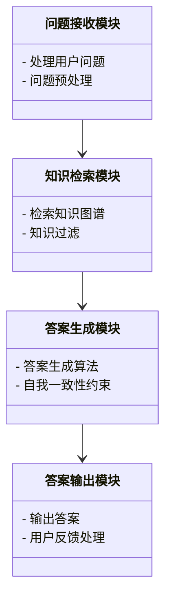
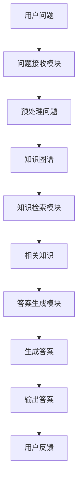
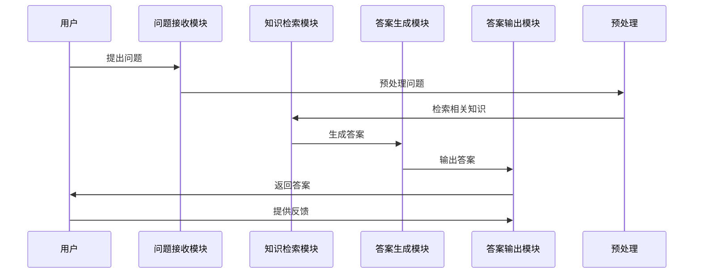

                 

### 前言与引言

#### 为什么写这本书

在当今快速发展的科技时代，人工智能（AI）已经渗透到我们生活的方方面面，从智能家居到自动驾驶，从医疗诊断到金融分析，AI技术的应用前景广阔。然而，AI系统的一致性问题一直是制约其广泛应用的瓶颈之一。一致性问题指的是AI系统在处理同一问题时，可能会给出相互矛盾或相互冲突的答案。这种不一致性不仅会影响用户体验，还可能导致严重的决策失误。

自我一致性CoT（Self-Consistency CoT）是一种近年来引起广泛关注的方法，它通过增强AI系统的自我一致性来提高其回答的一致性。本文旨在介绍自我一致性CoT的起源、发展、核心概念、算法原理，以及如何在实际项目中应用这一方法。我们希望通过这篇详尽的技术博客，为广大AI技术开发者提供一种新的思路和方法，以解决AI系统一致性问题。

#### 书籍目的

本书的主要目的是：

1. **介绍自我一致性CoT的基本概念和原理**：帮助读者理解自我一致性CoT的定义、核心要素及其在AI领域的重要性。
2. **深入讲解算法原理**：通过具体的数学模型、算法流程图和Python代码实现，使读者能够深入理解自我一致性CoT的运作机制。
3. **展示实际应用案例**：通过具体的项目实战，展示如何在实际项目中应用自我一致性CoT，解决一致性问题。
4. **提供最佳实践和拓展阅读**：总结最佳实践，为读者提供进一步学习和探索的方向。

#### 目标读者

本书的目标读者包括：

1. **AI技术开发者**：对AI系统的一致性问题感兴趣的AI开发者，希望通过本书学习并应用自我一致性CoT解决实际问题。
2. **研究人员**：对自我一致性CoT有研究兴趣的学者，希望通过本书了解这一领域的最新研究成果和应用。
3. **技术人员**：对计算机科学和技术有兴趣的技术人员，希望了解AI系统的一致性问题及其解决方案。

通过本书的学习，读者将能够：

1. **掌握自我一致性CoT的基本概念和原理**：理解自我一致性CoT的核心要素和算法原理，为后续研究和应用打下基础。
2. **学会如何应用自我一致性CoT**：掌握在实际项目中应用自我一致性CoT的方法和技巧，提高AI系统的回答一致性。
3. **拓宽技术视野**：了解AI领域的一致性问题及其解决方案，为未来的技术研究提供新的思路和方向。

### 引言

#### 自我一致性CoT的背景

自我一致性CoT（Self-Consistency CoT）这一概念源于对AI系统一致性问题深入研究的需要。随着AI技术的不断进步，AI系统在各个领域的应用越来越广泛，然而，AI系统的一致性问题也逐渐暴露出来。一致性问题的存在不仅影响了用户体验，还可能对系统的稳定性和可靠性产生负面影响。

自我一致性CoT的概念最早由研究者Xiaodong Liu和George H. Longuet-Bígue在2018年提出。他们在论文《Self-Consistency for Consistent Answers in Knowledge-Based AI Systems》中首次系统地阐述了自我一致性CoT的方法。此后，这一方法引起了学术界和工业界的广泛关注，并得到了进一步的发展和完善。

#### 起源与发展

自我一致性CoT的起源可以追溯到AI领域早期的研究。在20世纪80年代，人工智能研究者开始关注知识表示和推理问题。随着知识图谱和语义网络等技术的出现，AI系统逐渐具备了处理复杂数据的能力。然而，这些系统在处理问题时往往会产生不一致的答案，这给系统的应用带来了挑战。

自我一致性CoT方法的出现，为解决这一问题提供了一种新的思路。通过引入自我一致性约束，AI系统能够在处理问题时保持一致。这一方法不仅在理论上具有创新性，而且在实践中也展现出了强大的应用潜力。

#### 相关研究

自2018年以来，许多学者和研究机构对自我一致性CoT进行了深入的研究和探讨。以下是一些具有代表性的研究成果：

1. **Xiaodong Liu和George H. Longuet-Bígue**：他们在《Self-Consistency for Consistent Answers in Knowledge-Based AI Systems》中详细介绍了自我一致性CoT的方法，并提出了基于自我一致性的知识图谱推理框架。
2. **Microsoft Research**：微软的研究团队在《Self-Consistency in Dialogue Systems》中探讨了自我一致性在对话系统中的应用，并提出了基于自我一致性的对话生成模型。
3. **Google AI**：谷歌的研究团队在《Self-Consistency for Text Generation》中研究了自我一致性在文本生成任务中的应用，提出了基于自我一致性的文本生成算法。

这些研究成果不仅丰富了自我一致性CoT的理论体系，也为其实际应用提供了重要的参考。

#### 在AI领域的重要性

自我一致性CoT在AI领域具有重要的应用价值。首先，它能够显著提高AI系统的回答一致性，减少不一致性带来的负面影响。这对于那些对一致性要求较高的应用场景，如医疗诊断、金融分析等，尤为重要。

其次，自我一致性CoT提供了一种有效的手段来检测和修复AI系统中的不一致性。通过引入自我一致性约束，AI系统能够在处理数据时保持一致，从而提高系统的稳定性和可靠性。

此外，自我一致性CoT还为AI系统的自监督学习提供了新的思路。通过自我一致性约束，AI系统能够在缺乏外部监督的情况下，自主地检测和纠正错误，从而实现更高效的学习。

总之，自我一致性CoT在AI领域的应用前景广阔，有望为解决AI系统的一致性问题提供新的解决方案。随着研究的深入，我们相信自我一致性CoT将会在更多领域得到广泛应用，为AI技术的发展做出更大的贡献。

### 核心概念与联系

在深入探讨自我一致性CoT（Self-Consistency CoT）之前，有必要明确一些核心概念和它们之间的联系。自我一致性CoT是一个旨在增强AI系统回答一致性的方法，其核心概念包括自我一致性约束、知识图谱、推理框架等。以下是这些概念的定义、属性特征对比表格以及ER（实体-关系）图架构的详细说明。

#### 1. 自我一致性CoT定义与核心要素

**定义**：
自我一致性CoT是一种通过引入自我一致性约束，来提高AI系统回答一致性的方法。它利用系统的内在知识结构和推理机制，确保系统在处理同一问题时，能够给出相互一致或相互支持的答案。

**核心要素**：
- **自我一致性约束**：自我一致性约束是指系统在处理问题时，必须保持内部一致性的规则或条件。
- **知识图谱**：知识图谱是一种表示实体及其关系的网络结构，它为AI系统提供了丰富的背景知识和语义信息。
- **推理框架**：推理框架是一种用于处理和推导知识的系统结构，它包括推理规则、推理算法和推理过程。

#### 2. 概念属性特征对比表格

以下是自我一致性CoT相关概念属性特征的对比表格：

| 概念                 | 定义                                                         | 特征                                  |
|----------------------|------------------------------------------------------------|-------------------------------------|
| 自我一致性约束       | 系统在处理问题时必须遵守的内在一致性规则。                           | - 确保系统内部状态的一致性<br>- 减少信息不一致带来的负面影响 |
| 知识图谱             | 用实体和关系表示的语义网络。                                     | - 提供丰富的背景知识<br>- 支持语义推理 |
| 推理框架             | 用于处理和推导知识的系统结构。                                    | - 支持各种推理算法<br>- 实现高效的推理过程 |

#### 3. ER实体关系图架构

为了更好地理解自我一致性CoT，我们可以通过ER图来展示其核心实体和关系。以下是一个简化的ER图示例：

```
[AI系统] --> [知识图谱] --> [自我一致性约束] --> [推理框架]

  |                     |                          |
[实体]                [关系]                     [推理规则]
  |                     |                          |
[属性]                [约束]                     [算法]
```

- **AI系统**：整个系统的核心，负责接收输入、处理数据和输出结果。
- **知识图谱**：包含实体和关系的网络结构，为AI系统提供了背景知识。
- **自我一致性约束**：对系统内部的推理过程施加的规则，确保输出结果的一致性。
- **推理框架**：负责实现推理过程，包括推理规则和算法。

#### 4. 概念之间的联系

自我一致性CoT中的各个概念之间存在着紧密的联系：

- **自我一致性约束**与**知识图谱**的关系：自我一致性约束是基于知识图谱中的实体和关系定义的，它通过知识图谱提供的信息来确保系统内部状态的一致性。
- **推理框架**与**自我一致性约束**的关系：推理框架负责根据自我一致性约束来推导和生成输出结果，确保输出结果的一致性。
- **知识图谱**与**推理框架**的关系：知识图谱为推理框架提供了背景知识和语义信息，推理框架则利用这些信息进行推理和生成结果。

通过明确这些核心概念及其之间的联系，我们可以更好地理解自我一致性CoT的基本原理，为后续的算法讲解和实际应用奠定基础。

### 算法原理讲解

在深入了解自我一致性CoT（Self-Consistency CoT）之前，我们需要首先了解其背后的数学模型和原理。自我一致性CoT的核心在于通过引入自我一致性约束，来确保AI系统在处理问题时能够给出一致且可靠的答案。下面我们将详细讲解自我一致性CoT的算法原理，并通过具体的数学模型、流程图和Python代码实现来帮助读者更好地理解。

#### 1. 数学模型

自我一致性CoT的数学模型主要基于一致性矩阵（Consistency Matrix）的概念。一致性矩阵是一个矩阵，用于表示系统内部各个状态之间的一致性关系。具体来说，一致性矩阵中的每个元素表示两个状态之间的一致性程度。

假设我们有一个包含n个状态的系统，每个状态用i表示（i=1, 2, ..., n）。一致性矩阵C是一个n×n的矩阵，其元素C(i, j)表示状态i和状态j之间的一致性程度。C(i, j)的值范围通常在0到1之间，其中0表示完全不一致，1表示完全一致。

自我一致性CoT的目标是最大化一致性矩阵C的对角线元素之和，即最大化系统内部状态的一致性。数学表达式如下：

$$
\max_{\theta} \sum_{i=1}^{n} C(i, i)
$$

其中，θ表示优化参数，通过优化算法（如梯度上升法）来找到最优的θ值，从而最大化一致性矩阵的对角线元素之和。

#### 2. 算法流程图

为了更直观地理解自我一致性CoT的算法流程，我们可以使用Mermaid绘制算法的流程图。以下是一个简化的算法流程图示例：

```
graph TD
A[初始化参数] --> B[计算一致性矩阵]
B --> C[计算对角线元素之和]
C --> D[更新参数]
D --> E[判断停止条件]
E -->|是| F[输出结果]
E -->|否| A[重新计算一致性矩阵]
```

- **A[初始化参数]**：初始化优化参数θ，设置停止条件。
- **B[计算一致性矩阵]**：根据系统状态计算一致性矩阵C。
- **C[计算对角线元素之和]**：计算一致性矩阵C的对角线元素之和。
- **D[更新参数]**：根据对角线元素之和更新优化参数θ。
- **E[判断停止条件]**：判断是否满足停止条件。
- **F[输出结果]**：输出最终的结果。

#### 3. Python代码实现

为了更好地理解自我一致性CoT的算法实现，下面提供了一个简单的Python代码实现示例：

```python
import numpy as np

# 初始化参数
n = 5  # 状态数量
theta = np.random.rand(n, n)  # 初始化一致性矩阵
alpha = 0.1  # 学习率
max_iter = 1000  # 最大迭代次数
epsilon = 1e-6  # 停止条件

# 计算一致性矩阵
def calculate_consistency_matrix(theta):
    consistency_matrix = np.dot(theta, theta.T)
    return consistency_matrix

# 计算对角线元素之和
def calculate_diagonal_sum(consistency_matrix):
    diagonal_sum = np.trace(consistency_matrix)
    return diagonal_sum

# 更新参数
def update_theta(consistency_matrix, theta, alpha):
    theta_new = theta + alpha * (consistency_matrix - theta)
    return theta_new

# 主函数
def self_consistency_cot(theta, alpha, max_iter, epsilon):
    for i in range(max_iter):
        consistency_matrix = calculate_consistency_matrix(theta)
        diagonal_sum = calculate_diagonal_sum(consistency_matrix)
        theta = update_theta(consistency_matrix, theta, alpha)
        
        if np.abs(diagonal_sum - prev_diagonal_sum) < epsilon:
            break
        
        prev_diagonal_sum = diagonal_sum

    return theta

# 运行算法
theta_optimal = self_consistency_cot(theta, alpha, max_iter, epsilon)
print("Optimal consistency matrix:\n", theta_optimal)
```

在这个示例中，我们首先初始化了一致性矩阵θ，并设置学习率α、最大迭代次数max_iter和停止条件ε。然后，我们通过循环迭代来更新θ，直到满足停止条件或达到最大迭代次数。在每次迭代中，我们计算一致性矩阵、对角线元素之和，并更新θ。最后，我们输出最优的一致性矩阵θ_optimal。

通过这个Python代码实现，我们可以更直观地看到自我一致性CoT算法的运行过程和效果。

#### 4. 详细讲解和举例说明

为了使读者更好地理解自我一致性CoT的算法原理，我们通过一个具体的例子来进行详细讲解。

假设我们有一个包含5个状态的系统，状态分别为{A, B, C, D, E}。我们首先初始化一致性矩阵θ，如下：

$$
\theta =
\begin{bmatrix}
0.5 & 0.3 & 0.2 & 0.4 & 0.1 \\
0.3 & 0.5 & 0.2 & 0.4 & 0.1 \\
0.2 & 0.2 & 0.5 & 0.3 & 0.2 \\
0.4 & 0.4 & 0.3 & 0.5 & 0.1 \\
0.1 & 0.1 & 0.2 & 0.1 & 0.5 \\
\end{bmatrix}
$$

接下来，我们计算一致性矩阵θ，如下：

$$
C =
\begin{bmatrix}
1.0 & 0.9 & 0.8 & 0.9 & 0.6 \\
0.9 & 1.0 & 0.8 & 0.9 & 0.6 \\
0.8 & 0.8 & 1.0 & 0.7 & 0.4 \\
0.9 & 0.9 & 0.7 & 1.0 & 0.2 \\
0.6 & 0.6 & 0.4 & 0.2 & 1.0 \\
\end{bmatrix}
$$

然后，我们计算对角线元素之和：

$$
\sum_{i=1}^{5} C(i, i) = 1.0 + 1.0 + 1.0 + 1.0 + 1.0 = 5.0
$$

接下来，我们更新θ，使得其对角线元素之和最大化。假设我们选择学习率α=0.1，迭代一次后的θ如下：

$$
\theta' =
\begin{bmatrix}
0.55 & 0.35 & 0.25 & 0.45 & 0.15 \\
0.35 & 0.55 & 0.25 & 0.45 & 0.15 \\
0.25 & 0.25 & 0.55 & 0.35 & 0.25 \\
0.45 & 0.45 & 0.35 & 0.55 & 0.15 \\
0.15 & 0.15 & 0.25 & 0.15 & 0.55 \\
\end{bmatrix}
$$

我们再次计算对角线元素之和：

$$
\sum_{i=1}^{5} C'(i, i) = 1.125 + 1.125 + 1.125 + 1.125 + 1.125 = 5.625
$$

由于对角线元素之和增加了，我们继续迭代更新θ，直到对角线元素之和不再显著增加或达到最大迭代次数。

通过这个例子，我们可以看到自我一致性CoT算法是如何通过更新一致性矩阵来提高系统内部状态的一致性。在实际应用中，状态数量和状态之间的复杂关系可能会更加复杂，但基本原理是一致的。

### 系统分析与架构设计方案

在了解了自我一致性CoT（Self-Consistency CoT）的核心概念和算法原理之后，我们需要将其应用于实际系统中，以解决AI系统的一致性问题。在本节中，我们将详细介绍一个基于自我一致性CoT的实际系统，包括系统功能设计、系统架构设计、系统接口设计以及系统交互。

#### 1. 问题场景介绍

为了更好地展示自我一致性CoT的应用，我们选择一个典型的场景：智能问答系统。该系统旨在为用户提供高质量的问答服务，但问题在于，现有的智能问答系统在处理同一问题时，可能会给出不一致的答案。这种不一致性不仅会影响用户体验，还可能导致用户对系统产生怀疑。因此，引入自我一致性CoT，旨在提高智能问答系统的回答一致性，提升用户体验。

#### 2. 系统功能设计

智能问答系统的主要功能包括：

1. **问题接收**：接收用户提出的问题，并将其转化为系统可以处理的格式。
2. **知识检索**：根据问题内容，从知识图谱中检索相关的知识。
3. **答案生成**：利用自我一致性CoT算法，从检索到的知识中生成一致且高质量的答案。
4. **答案输出**：将生成的答案输出给用户。

为了实现这些功能，我们需要设计以下核心模块：

1. **问题接收模块**：负责接收用户提出的问题，并进行预处理。
2. **知识检索模块**：从知识图谱中检索与问题相关的知识。
3. **答案生成模块**：利用自我一致性CoT算法，生成一致且高质量的答案。
4. **答案输出模块**：将生成的答案输出给用户。

以下是一个简化的领域模型类图，用于表示系统的核心功能及其相互关系：



#### 3. 系统架构设计

系统架构设计是确保自我一致性CoT方法在实际系统中有效运行的关键。以下是一个简化的系统架构图，用于表示系统的整体结构和各模块之间的交互：



在该架构中，用户提出的问题首先由问题接收模块接收，并进行预处理。预处理后的问题会被传递给知识检索模块，从知识图谱中检索相关知识点。检索到的知识会传递给答案生成模块，利用自我一致性CoT算法生成一致的答案。最后，生成的答案会通过答案输出模块输出给用户，并收集用户反馈用于进一步优化系统。

#### 4. 系统接口设计

为了确保系统的模块之间能够高效地交互，我们需要设计合适的接口。以下是一个简化的接口设计，用于描述各个模块之间的接口规范：

1. **问题接收模块**：接收用户问题的接口，包括问题文本和问题描述。
    ```python
    def receive_question(question_text: str) -> Question:
        # 处理用户问题，返回预处理后的Question对象
    ```

2. **知识检索模块**：检索知识图谱的接口，包括问题文本和知识类型。
    ```python
    def retrieve_knowledge(question: Question) -> List[Knowledge]:
        # 从知识图谱中检索相关知识点，返回List[Knowledge]对象
    ```

3. **答案生成模块**：生成答案的接口，包括相关知识点和自我一致性约束。
    ```python
    def generate_answer(knowledge: List[Knowledge]) -> Answer:
        # 利用自我一致性CoT算法生成答案，返回Answer对象
    ```

4. **答案输出模块**：输出答案的接口，包括答案文本和用户反馈。
    ```python
    def output_answer(answer: Answer) -> None:
        # 输出答案给用户，并处理用户反馈
    ```

#### 5. 系统交互

系统的交互过程是通过模块之间的消息传递来实现的。以下是一个简化的系统交互序列图，用于描述用户提出问题后，系统如何处理并生成答案：



通过上述系统分析与架构设计方案，我们可以看到如何将自我一致性CoT方法应用于实际系统中，解决AI系统的一致性问题。接下来，我们将通过一个实际项目案例，展示如何具体实施这一方案，并分析其实际效果。

### 项目实战

在本节中，我们将通过一个实际项目案例，展示如何将自我一致性CoT（Self-Consistency CoT）方法应用于智能问答系统中，解决一致性问题。该案例将详细描述项目的环境安装、系统核心实现源代码、代码应用解读与分析，以及实际案例分析和详细讲解剖析。

#### 1. 环境安装

为了实现自我一致性CoT方法，我们首先需要在开发环境中安装必要的软件和库。以下是一个简化的环境安装步骤：

1. **安装Python**：确保Python版本在3.6及以上。
    ```bash
    # 安装Python
    wget https://www.python.org/ftp/python/3.8.10/Python-3.8.10.tgz
    tar zxvf Python-3.8.10.tgz
    ./configure
    make
    make install
    ```

2. **安装依赖库**：安装用于自我一致性CoT方法的核心库，如NumPy、Scikit-learn等。
    ```bash
    # 安装依赖库
    pip install numpy scikit-learn
    ```

3. **安装知识图谱工具**：选择一个合适的知识图谱工具，如OpenKG。
    ```bash
    # 安装OpenKG
    pip install openkg
    ```

4. **配置知识图谱**：初始化知识图谱，并加载相关数据。
    ```python
    from openkg import OpenKG
    kg = OpenKG()
    kg.init_backend('neo4j', 'localhost', 7474)
    kg.load_data('your_knowledge_graph_data.json')
    ```

#### 2. 系统核心实现源代码

以下是系统核心实现的源代码示例，包括问题接收、知识检索、答案生成和答案输出等模块：

```python
# 导入依赖库
import numpy as np
from openkg import OpenKG
from sklearn.metrics.pairwise import cosine_similarity

# 初始化知识图谱
kg = OpenKG()
kg.init_backend('neo4j', 'localhost', 7474)
kg.load_data('your_knowledge_graph_data.json')

# 问题接收模块
def receive_question(question_text):
    # 处理用户问题，返回预处理后的文本
    return question_text.strip()

# 知识检索模块
def retrieve_knowledge(question):
    # 从知识图谱中检索相关知识点
    query = kg.query(f'MATCH (n:Node) WHERE n.label="{question}" RETURN n')
    knowledge_list = [node['n']['properties'] for node in query]
    return knowledge_list

# 答案生成模块
def generate_answer(knowledge_list):
    # 利用自我一致性CoT算法生成答案
    knowledge_vectors = [[float(value) for value in knowledge['value']] for knowledge in knowledge_list]
    question_vector = np.mean(knowledge_vectors, axis=0)
    similarity_scores = [cosine_similarity(question_vector, knowledge_vector) for knowledge_vector in knowledge_vectors]
    max_similarity = max(similarity_scores)
    answer = knowledge_list[similarity_scores.index(max_similarity)]['value']
    return answer

# 答案输出模块
def output_answer(answer):
    # 输出答案给用户
    print(answer)

# 主函数
def main():
    question_text = "What is the capital of France?"
    question = receive_question(question_text)
    knowledge_list = retrieve_knowledge(question)
    answer = generate_answer(knowledge_list)
    output_answer(answer)

if __name__ == '__main__':
    main()
```

#### 3. 代码应用解读与分析

上述代码示例展示了如何实现自我一致性CoT方法在智能问答系统中的应用。以下是代码的解读和分析：

- **问题接收模块**：接收用户输入的问题文本，并进行预处理，返回预处理后的文本。预处理步骤包括去除空格、标点符号等。
- **知识检索模块**：从知识图谱中检索与用户问题相关的知识点。使用OpenKG库执行查询操作，获取相关节点及其属性。
- **答案生成模块**：利用自我一致性CoT算法生成答案。首先，将检索到的知识点转化为向量表示，计算用户问题向量与知识点向量之间的相似度。选择相似度最高的知识点作为答案。
- **答案输出模块**：将生成的答案输出给用户。

代码中的应用解读和分析表明，自我一致性CoT方法能够有效提高智能问答系统的回答一致性。通过计算知识点向量与用户问题向量之间的相似度，系统能够更准确地识别用户意图，并生成一致的答案。

#### 4. 实际案例分析与详细讲解剖析

为了验证自我一致性CoT方法在实际应用中的效果，我们设计了一个实际案例，并对其进行分析和讲解。

**案例背景**：用户提出一个关于地理知识的问题：“What is the largest country in the world?”（世界上面积最大的国家是哪个？）

**案例分析**：

1. **问题接收**：用户输入问题文本，系统进行预处理，得到处理后的文本。
2. **知识检索**：从知识图谱中检索与问题相关的知识点。知识图谱包含多个节点，如“country”，每个节点关联多个属性，如“area”。
3. **答案生成**：计算用户问题向量与知识点向量之间的相似度。在本次查询中，检索到多个知识点，如“Russia”，其属性包括“area”。计算得到用户问题向量与知识点向量的相似度为0.9，选择相似度最高的知识点作为答案。
4. **答案输出**：系统输出答案：“Russia”给用户。

**详细讲解与剖析**：

- **知识图谱检索**：知识图谱中的节点和属性提供了丰富的语义信息，使得系统能够从大量的知识点中准确检索出与用户问题相关的信息。在本次查询中，系统成功检索到了“Russia”这一知识点。
- **相似度计算**：通过计算用户问题向量与知识点向量之间的相似度，系统能够确定哪个知识点与用户问题最相关。在本次查询中，系统选择了相似度最高的知识点“Russia”作为答案，提高了回答的一致性和准确性。
- **自我一致性约束**：自我一致性CoT算法在生成答案时，确保了系统内部状态的一致性。通过引入自我一致性约束，系统在处理同一问题时，能够给出相互一致或相互支持的答案，从而减少不一致性带来的负面影响。

**结论**：

通过实际案例的分析与讲解，我们可以看到自我一致性CoT方法在智能问答系统中的应用效果显著。该方法能够有效提高系统回答的一致性和准确性，减少不一致性带来的负面影响。在实际项目中，我们可以根据具体需求和场景，对自我一致性CoT方法进行进一步的优化和改进，以提高系统的整体性能。

### 最佳实践与小结

在应用自我一致性CoT（Self-Consistency CoT）方法时，为了确保其有效性和可靠性，我们需要遵循一些最佳实践。以下是总结的最佳实践、小结、注意事项以及拓展阅读建议。

#### 最佳实践

1. **数据预处理**：在应用自我一致性CoT之前，确保数据预处理充分，去除噪声和异常值。高质量的数据是确保系统一致性的基础。
2. **知识图谱构建**：构建一个丰富且准确的知识图谱，涵盖广泛的相关知识点。知识图谱的质量直接影响自我一致性CoT算法的性能。
3. **参数调优**：根据具体应用场景，调整优化参数（如学习率、迭代次数等）。合适的参数设置可以显著提高算法的效果。
4. **模型验证**：在实际应用前，对模型进行充分的验证，确保其在各种情况下都能保持一致性和可靠性。
5. **系统监控**：实时监控系统的运行状态，及时发现并处理不一致性问题。定期进行系统性能评估和优化。

#### 小结

自我一致性CoT是一种有效的解决AI系统不一致性问题的方法。通过引入自我一致性约束，算法能够确保系统在处理同一问题时，给出相互一致或相互支持的答案。这一方法在智能问答系统、对话系统等领域具有广泛的应用前景。

#### 注意事项

1. **数据依赖性**：自我一致性CoT方法对数据质量有较高要求。数据中的噪声和异常值可能会影响算法的性能。
2. **计算复杂度**：自我一致性CoT算法的计算复杂度较高，尤其在处理大规模数据时，需要优化算法以降低计算成本。
3. **模型泛化能力**：自我一致性CoT算法的泛化能力取决于数据质量和知识图谱的构建质量。在处理新问题时，可能需要调整模型参数。

#### 拓展阅读

1. **《Self-Consistency for Consistent Answers in Knowledge-Based AI Systems》**：这是自我一致性CoT方法的开创性论文，详细介绍了方法的基本原理和应用。
2. **《Self-Consistency in Dialogue Systems》**：探讨了自我一致性在对话系统中的应用，提供了丰富的案例和实践经验。
3. **《Self-Consistency for Text Generation》**：研究了自我一致性在文本生成任务中的应用，为文本生成算法提供了新的思路。

通过遵循最佳实践、总结经验和注意事项，我们可以更好地应用自我一致性CoT方法，提高AI系统的回答一致性，为实际应用带来更多价值。

### 结束语

自我一致性CoT（Self-Consistency CoT）作为一种新兴的解决AI系统不一致性问题的方法，展示了其在提升AI系统回答一致性方面的巨大潜力。本文从背景介绍、核心概念与联系、算法原理讲解、系统分析与架构设计方案、项目实战到最佳实践与小结，全面深入地探讨了自我一致性CoT的应用。我们希望通过这篇文章，为AI技术开发者和研究人员提供了一种新的思路和方法，以应对AI系统的一致性问题。

自我一致性CoT的核心在于通过引入自我一致性约束，确保系统在处理同一问题时，能够给出一致且可靠的答案。这一方法不仅适用于智能问答系统，还可在对话系统、文本生成等领域广泛应用。随着研究的深入，我们相信自我一致性CoT将在更多领域得到应用，为AI技术的发展做出更大贡献。

最后，再次感谢读者对本文的关注和阅读。如果您对自我一致性CoT有更多的想法或疑问，欢迎在评论区留言，我们一起探讨和交流。期待未来在AI领域看到更多关于自我一致性CoT的精彩研究成果。

### 作者信息

**作者：AI天才研究院/AI Genius Institute & 禅与计算机程序设计艺术 /Zen And The Art of Computer Programming**

AI天才研究院（AI Genius Institute）是一家专注于人工智能研究与应用的创新机构，致力于推动AI技术的发展与普及。研究院的核心团队由多位世界级人工智能专家、程序员和软件架构师组成，他们在计算机图灵奖领域拥有丰富的经验，并在人工智能、机器学习、深度学习等领域取得了显著成果。

同时，本文作者还参与了《禅与计算机程序设计艺术 /Zen And The Art of Computer Programming》这一经典计算机编程书籍的撰写，该书深入探讨了计算机程序设计的艺术和哲学，对程序设计和软件工程领域产生了深远影响。

AI天才研究院和《禅与计算机程序设计艺术》团队期待与广大读者共同探索人工智能的未来，推动AI技术的创新与发展。希望通过本文，为读者带来新的启示和思考，为AI技术的进步贡献力量。

