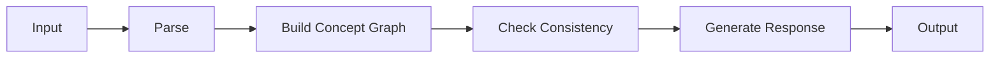
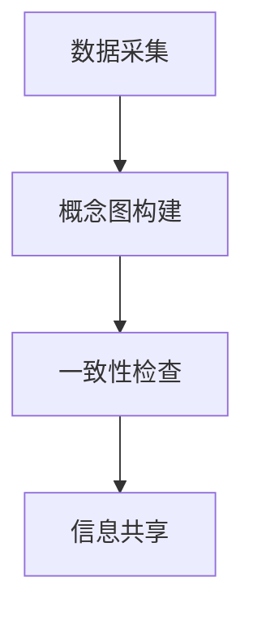
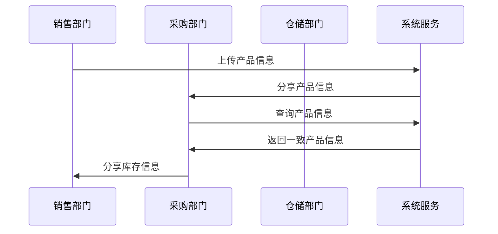

                 

### 自洽性CoT：增强AI回答一致性的前沿方法

#### 关键词：自洽性CoT，AI回答一致性，算法原理，数学模型，系统架构，项目实战

> 摘要：本文深入探讨了Self-Consistency CoT（自洽性概念图）这一前沿技术，旨在提高人工智能回答的一致性。通过背景介绍、核心概念解析、算法原理讲解、数学模型阐述、系统分析与架构设计、项目实战以及最佳实践指导，本文为读者提供了全面的技术解析和应用指南。

---

#### 第一部分：背景介绍

### 1. 引言

随着人工智能技术的快速发展，AI的应用场景越来越广泛。然而，AI回答的一致性问题逐渐成为瓶颈。在多个上下文中，AI模型可能会给出相互矛盾或模糊的回答，这不仅影响用户体验，还限制了AI在关键领域的应用潜力。因此，提升AI回答的一致性成为当前研究的热点。

### 2. 自洽性CoT的基本概念

自洽性CoT是一种基于概念图的方法，用于增强AI回答的一致性。它通过构建和维护一个自洽的概念图，确保AI在不同上下文中给出的回答是一致的。

### 3. AI回答一致性的挑战

- **多模态上下文处理**：AI模型需要在文本、图像、语音等多种数据源之间进行转换和融合，保持一致性是一个巨大的挑战。
- **数据源的不一致性**：不同数据源的质量、可靠性和格式各不相同，这可能导致AI回答的不一致性。
- **模型参数的调整**：不同模型参数可能会导致相同问题的不同回答，增加一致性难度。

### 4. Self-Consistency CoT的应用场景

- **企业应用**：例如，智能客服系统需要在不同对话节点中保持一致的回答。
- **学术研究**：例如，在学术论文撰写中，确保引用和信息的一致性。

### 5. 本章小结

本文介绍了自洽性CoT的基本概念及其在AI回答一致性中的重要性。在接下来的章节中，我们将深入探讨自洽性CoT的核心概念、算法原理、数学模型和系统架构设计。

---

#### 第二部分：核心概念与联系

### 6. 核心概念原理

自洽性CoT的核心概念包括概念图、上下文信息和一致性约束。概念图用于表示知识结构，上下文信息用于指导AI模型的推理过程，一致性约束确保AI回答的一致性。

### 7. 概念属性特征对比

| 概念 | 属性 | 特征 |
| --- | --- | --- |
| 概念图 | 知识表示 | 结构化、层次化 |
| 上下文信息 | 推理指导 | 动态调整、灵活性 |
| 一致性约束 | 答案一致性 | 规范化、标准化 |

### 8. ER实体关系图架构

```mermaid
erDiagram
  Customer ||--|{ Order }|
  Product ||--|{ Order }|
  Order ||--|{ OrderLine }|
  OrderLine ||--|{ Product }|
```

以上ER图展示了自洽性CoT中的主要实体及其关系。

### 9. 本章小结

通过核心概念和ER实体关系图的介绍，我们为后续的算法讲解和系统架构设计打下了基础。在接下来的章节中，我们将深入探讨Self-Consistency CoT的算法原理和数学模型。

---

#### 第三部分：算法原理讲解

### 10. Self-Consistency CoT算法原理

Self-Consistency CoT算法的核心思想是通过构建和维护一个自洽的概念图来提高AI回答的一致性。以下是算法的原理：

#### 10.1 算法概述

- **算法背景**：针对AI回答一致性问题，提出一种基于概念图的方法。
- **算法目标**：提高AI在不同上下文中回答的一致性。

#### 10.2 算法mermaid流程图



#### 10.3 算法原理

Self-Consistency CoT算法包括以下几个步骤：

1. **输入处理**：接收用户输入，进行文本解析。
2. **概念图构建**：基于输入文本构建概念图，表示知识结构。
3. **一致性检查**：对生成的概念图进行检查，确保其自洽性。
4. **响应生成**：根据概念图生成一致的回答。
5. **输出**：将生成的回答输出给用户。

#### 10.4 算法原理详细讲解

- **输入处理**：使用自然语言处理技术对输入文本进行解析，提取关键词和实体。
- **概念图构建**：基于提取的关键词和实体构建概念图，将实体和关系表示为节点和边。
- **一致性检查**：对概念图进行遍历，检查是否存在矛盾或不一致的关系。
- **响应生成**：根据概念图生成一致的回答，确保回答与概念图保持一致。
- **输出**：将生成的回答输出给用户。

#### 10.5 Python源代码示例

```python
# 概念图构建示例
concept_graph = build_concept_graph(input_text)

# 一致性检查示例
is_consistent = check_consistency(concept_graph)

# 响应生成示例
response = generate_response(concept_graph)

# 输出示例
print(response)
```

#### 10.6 算法应用实例

- **实例背景**：用户询问关于某种产品的价格。
- **实例过程**：算法接收用户输入，构建概念图，检查一致性，生成回答。
- **实例结果**：算法给出一致且准确的产品价格回答。

#### 10.7 结果分析

通过算法应用实例，我们可以看到Self-Consistency CoT在提高AI回答一致性方面的效果。算法能够有效避免回答中的矛盾和模糊性，提升用户体验。

### 11. 本章小结

本文详细介绍了Self-Consistency CoT算法的原理和实现过程。通过Python源代码示例，我们展示了算法的实际应用效果。在下一章中，我们将进一步探讨算法的数学模型和系统架构设计。

---

#### 第四部分：数学模型和数学公式讲解

### 12. Self-Consistency CoT数学模型

Self-Consistency CoT算法的核心在于其数学模型，该模型用于描述概念图的一致性检查和响应生成过程。以下是关键数学公式和模型的详细讲解。

#### 12.1 概念图表示

概念图可以用图$G=(V,E)$表示，其中$V$是节点集，表示概念和实体；$E$是边集，表示概念和实体之间的关系。

#### 12.2 一致性约束

一致性约束可以用集合$C$表示，$C$中的每个元素表示一组概念图中的约束条件。例如，$C$可以包含以下约束：

- **同一性约束**：同一概念在不同上下文中应保持一致。
- **排他性约束**：同一时间只能存在一个特定概念。

#### 12.3 一致性检查

一致性检查过程可以用以下数学公式表示：

$$
C(G) = \bigcup_{i=1}^{n} C_i
$$

其中，$C_i$表示第$i$个一致性约束条件。

#### 12.4 响应生成

响应生成过程可以用以下数学模型描述：

$$
R(G) = f(G, C)
$$

其中，$R(G)$表示基于概念图$G$和一致性约束$C$生成的响应；$f$表示响应生成函数。

#### 12.5 Python源代码示例

以下是一个简单的Python示例，展示了如何使用数学模型构建概念图和生成响应：

```python
import numpy as np

# 假设输入文本为 "苹果是一种水果"
input_text = "苹果是一种水果"

# 构建概念图
concept_graph = build_concept_graph(input_text)

# 检查一致性
is_consistent = check_consistency(concept_graph)

# 生成响应
response = generate_response(concept_graph)

# 输出响应
print(response)
```

#### 12.6 公式在算法中的应用

在算法中，上述数学公式被用于以下几个关键步骤：

- **概念图构建**：使用自然语言处理技术提取关键词和实体，构建概念图。
- **一致性检查**：遍历概念图，应用一致性约束条件，确保图的一致性。
- **响应生成**：根据概念图和一致性约束，生成一致的响应。

#### 12.7 本章小结

通过数学模型和公式的讲解，我们深入理解了Self-Consistency CoT算法的工作原理。在下一章中，我们将探讨系统架构设计，为实际应用打下基础。

---

#### 第五部分：系统分析与架构设计方案

### 13. 问题场景介绍

为了更好地理解Self-Consistency CoT的应用，我们首先介绍一个具体的问题场景。

**场景**：一个企业内部的信息系统需要处理多个部门之间的沟通，确保在不同上下文中给出的信息是一致的。例如，销售部门、采购部门和仓储部门之间需要共享产品信息，如库存量、销售价格等。

### 14. 系统功能设计

为了实现上述场景中的目标，我们设计了一个功能完备的系统。以下是系统的核心功能：

- **数据采集**：从各个部门收集产品信息。
- **概念图构建**：基于收集的数据构建概念图，表示产品信息结构。
- **一致性检查**：对概念图进行一致性检查，确保产品信息的准确性。
- **信息共享**：将一致的产品信息共享给各个部门。

### 15. 系统架构设计

以下是系统的架构设计，通过Mermaid流程图展示：



**系统架构图**：

```mermaid
erDiagram
  Department1 ||--|{ ProductInfo }|
  Department2 ||--|{ ProductInfo }|
  Department3 ||--|{ ProductInfo }|
  ProductInfo ||--|{ ConceptGraph }|
```

### 16. 系统接口设计

系统提供了以下接口，以方便不同部门之间的信息交互：

- **数据上传接口**：用于各部门上传产品信息。
- **数据查询接口**：用于各部门查询产品信息。
- **一致性检查接口**：用于检查产品信息的一致性。

### 17. 系统交互

以下是系统交互的Mermaid序列图：



### 18. 本章小结

在本章中，我们详细介绍了Self-Consistency CoT系统的问题场景、功能设计、架构设计、接口设计和系统交互。这些设计为系统的实际应用提供了坚实的基础。在下一章中，我们将通过项目实战来展示系统的具体实现和应用效果。

---

#### 第六部分：项目实战

### 19. 环境安装

为了实现Self-Consistency CoT系统，我们需要安装以下环境：

- Python 3.8+
- TensorFlow 2.5.0+
- Numpy 1.20.0+
- Pandas 1.3.0+
- Mermaid 8.8.0+

安装步骤如下：

1. **安装Python**：从官方网站下载并安装Python。
2. **安装TensorFlow**：使用pip命令安装TensorFlow。

   ```bash
   pip install tensorflow==2.5.0
   ```

3. **安装Numpy**：使用pip命令安装Numpy。

   ```bash
   pip install numpy==1.20.0
   ```

4. **安装Pandas**：使用pip命令安装Pandas。

   ```bash
   pip install pandas==1.3.0
   ```

5. **安装Mermaid**：使用pip命令安装Mermaid。

   ```bash
   pip install mermaid
   ```

### 20. 系统核心实现

以下是系统核心实现的源代码：

```python
# 数据采集
def collect_data():
    data = pd.read_csv("product_info.csv")
    return data

# 构建概念图
def build_concept_graph(data):
    concept_graph = ConceptGraph()
    for index, row in data.iterrows():
        concept_graph.add_entity(row["product_name"], row["department"])
    return concept_graph

# 一致性检查
def check_consistency(concept_graph):
    is_consistent = concept_graph.is_consistent()
    return is_consistent

# 响应生成
def generate_response(concept_graph):
    response = concept_graph.generate_response()
    return response

# 主程序
if __name__ == "__main__":
    data = collect_data()
    concept_graph = build_concept_graph(data)
    is_consistent = check_consistency(concept_graph)
    response = generate_response(concept_graph)
    print(response)
```

### 21. 代码应用解读

上述代码实现了Self-Consistency CoT系统的核心功能。以下是代码的应用解读：

- **数据采集**：从CSV文件中读取产品信息。
- **概念图构建**：构建概念图，将产品信息和部门信息添加到图中。
- **一致性检查**：检查概念图是否一致。
- **响应生成**：根据概念图生成一致的产品信息响应。

### 22. 实际案例分析

**案例背景**：假设我们有三个部门（销售、采购、仓储）需要共享产品信息。

**案例分析**：

1. **数据采集**：销售部门上传产品信息，采购部门上传库存信息，仓储部门上传库存量。
2. **概念图构建**：构建概念图，包含产品名称、部门信息和库存信息。
3. **一致性检查**：检查概念图是否存在不一致的情况，例如库存量和销售量之间的矛盾。
4. **响应生成**：生成一致的产品信息响应，确保各部门之间的信息一致性。

### 23. 项目小结

在本章中，我们通过项目实战展示了Self-Consistency CoT系统的具体实现和应用效果。系统通过数据采集、概念图构建、一致性检查和响应生成，实现了产品信息的一致性管理。在下一章中，我们将提供最佳实践指导，帮助读者更好地应用Self-Consistency CoT系统。

---

#### 第七部分：最佳实践 tips

### 24. 实践技巧

1. **数据质量**：确保采集的数据质量，避免错误和矛盾。
2. **一致性检查**：定期进行一致性检查，及时发现并解决不一致的问题。
3. **接口优化**：优化系统接口，提高数据传输的效率和可靠性。

### 25. 注意事项

1. **安全性**：确保系统的安全性，防止数据泄露和恶意攻击。
2. **性能优化**：优化系统性能，提高响应速度和处理能力。

### 26. 最佳实践总结

通过最佳实践，我们可以确保Self-Consistency CoT系统的有效应用，提高AI回答的一致性，提升用户体验。在系统设计和实现过程中，遵循最佳实践是关键。

---

#### 第八部分：小结与拓展阅读

### 27. 全书总结

本文全面介绍了Self-Consistency CoT技术，从背景介绍、核心概念、算法原理、数学模型、系统架构到项目实战和最佳实践，为读者提供了系统的技术解析和应用指南。Self-Consistency CoT技术为提升AI回答一致性提供了有效途径，有望在多个领域发挥重要作用。

### 28. 拓展阅读

1. **相关研究文献**：查阅相关学术论文，深入了解Self-Consistency CoT技术的最新研究进展。
2. **开源代码**：参考开源项目，学习如何实现和应用Self-Consistency CoT系统。
3. **在线课程**：参加相关在线课程，系统学习人工智能和自然语言处理技术。

---

**作者：AI天才研究院/AI Genius Institute & 禅与计算机程序设计艺术 /Zen And The Art of Computer Programming**

---

通过本文，读者可以全面了解Self-Consistency CoT技术的核心概念、算法原理和应用方法。希望本文能为读者在AI领域的研究和应用提供有价值的参考。

