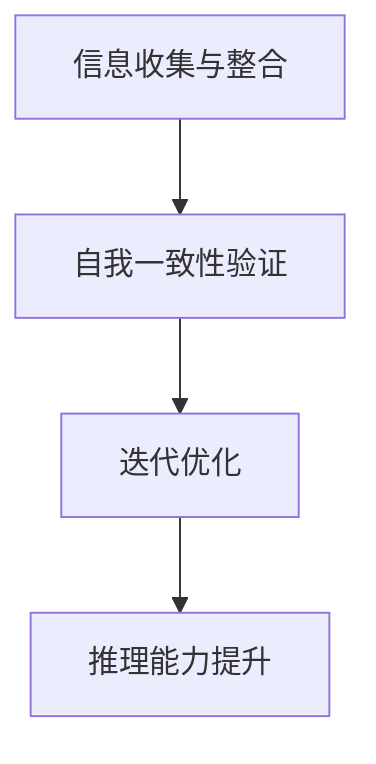
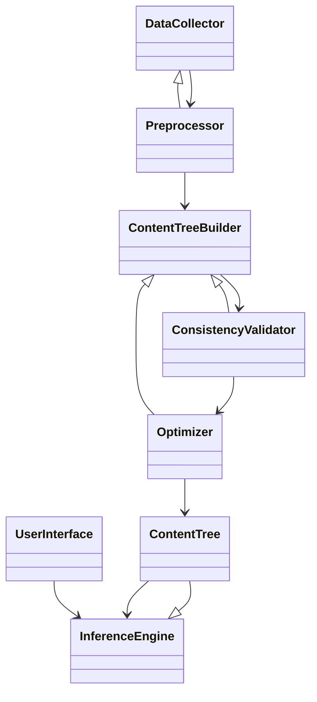
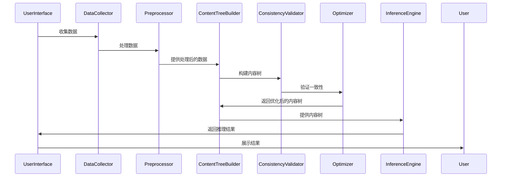

                 

# Self-Consistency CoT：增强AI推理能力的前沿探索

> 关键词：Self-Consistency CoT，AI推理，算法原理，数学模型，系统架构，项目实战

> 摘要：本文将探讨Self-Consistency CoT（自我一致性内容树）这一前沿技术，它旨在增强AI的推理能力。文章首先介绍了Self-Consistency CoT的核心概念和其在AI领域的重要性，然后深入讲解了算法原理、数学模型，以及系统架构设计。最后，通过一个实际项目案例，展示了如何将Self-Consistency CoT应用于实际场景，并给出了项目小结和最佳实践建议。

## 目录大纲设计思路

为了设计出一本内容丰富、逻辑清晰、符合读者需求的《Self-Consistency CoT：增强AI推理能力的前沿探索》的目录大纲，我们需要遵循以下设计思路：

1. **明确核心内容**：首先，我们需要明确这本书的核心内容，包括AI推理能力、Self-Consistency CoT概念、前沿探索以及相关的理论和实践。

2. **结构化内容**：根据核心内容，我们将整体内容结构化，分为引言、背景介绍、核心概念、算法原理讲解、数学模型与公式、系统分析与架构设计、项目实战、最佳实践和总结等部分。

3. **细化章节内容**：在每个部分中，根据内容的重要性和复杂性，细化到具体章节，确保每个章节都有明确的主题和目标。

4. **确保完整性**：确保目录大纲涵盖所有关键内容，包括核心概念、算法原理、数学模型、系统设计、实战案例等，满足内容完整性要求。

5. **简洁明了**：在保持内容完整性的同时，注重简洁性，避免冗余和复杂的描述，使读者能够迅速把握每个章节的核心内容。

6. **逻辑清晰**：确保目录大纲的每个章节之间有良好的逻辑关系，从基础到深入，从理论到实践，逐步引导读者理解并掌握核心内容。

### 目录大纲设计

下面是根据上述设计思路设计的《Self-Consistency CoT：增强AI推理能力的前沿探索》的目录大纲：

----------------------------------------------------------------

## 第一部分：引言

### 第1章: Self-Consistency CoT概述

1.1 问题背景  
- AI推理能力的重要性  
- Self-Consistency CoT的概念

1.2 问题描述  
- AI推理能力的挑战  
- Self-Consistency CoT的作用

1.3 问题解决  
- Self-Consistency CoT的基本原理  
- Self-Consistency CoT的应用场景

1.4 边界与外延  
- Self-Consistency CoT的应用限制  
- 相关概念的联系与区别

### 第2章: Self-Consistency CoT的核心概念与联系

2.1 核心概念  
- Self-Consistency CoT的定义  
- Self-Consistency CoT的关键要素

2.2 概念属性特征对比表格  
- Self-Consistency CoT与其他相关概念的对比

2.3 ER实体关系图架构  
- Self-Consistency CoT的实体与关系

## 第二部分：算法原理讲解

### 第3章: Self-Consistency CoT算法原理

3.1 算法概述  
- Self-Consistency CoT算法的基本流程  
- Self-Consistency CoT算法的核心步骤

3.2 Mermaid算法流程图  
- Self-Consistency CoT算法的Mermaid流程图绘制

3.3 Python源代码实现  
- Self-Consistency CoT算法的Python实现

3.4 算法原理讲解  
- Self-Consistency CoT算法的数学模型与公式  
- 算法原理的详细讲解与举例说明

### 第4章: 数学模型与公式详解

4.1 数学模型  
- Self-Consistency CoT的数学基础

4.2 公式推导  
- Self-Consistency CoT公式推导过程

4.3 举例说明  
- Self-Consistency CoT算法的实际应用案例

## 第三部分：系统分析与架构设计

### 第5章: Self-Consistency CoT系统架构设计

5.1 问题场景介绍  
- Self-Consistency CoT的应用场景介绍

5.2 系统功能设计  
- Self-Consistency CoT系统的功能模块划分

5.3 Mermaid类图  
- Self-Consistency CoT系统的类图

5.4 系统架构设计  
- Self-Consistency CoT系统的总体架构

5.5 系统接口设计  
- Self-Consistency CoT系统的接口设计

5.6 系统交互序列图  
- Self-Consistency CoT系统的交互流程

### 第6章: Self-Consistency CoT项目实战

6.1 环境安装  
- Self-Consistency CoT系统环境搭建

6.2 系统核心实现  
- Self-Consistency CoT算法核心代码讲解

6.3 代码应用解读与分析  
- Self-Consistency CoT算法应用场景分析

6.4 实际案例分析和详细讲解剖析  
- Self-Consistency CoT在实际项目中的应用案例

6.5 项目小结  
- Self-Consistency CoT项目的总结与反思

## 第四部分：最佳实践

### 第7章: Self-Consistency CoT最佳实践

7.1 注意事项  
- Self-Consistency CoT应用的注意事项

7.2 小结  
- Self-Consistency CoT的应用小结

7.3 拓展阅读  
- Self-Consistency CoT相关的拓展阅读

----------------------------------------------------------------

### 第一部分：引言

#### 第1章: Self-Consistency CoT概述

**1.1 问题背景**

在当今的信息时代，人工智能（AI）的应用已经渗透到我们生活的方方面面。然而，AI的发展并非一帆风顺，其中最为关键的挑战之一便是推理能力。传统的AI模型往往在处理复杂任务时表现出局限性，特别是在处理不确定性、异常情况和逻辑推理方面。因此，如何增强AI的推理能力成为了人工智能研究中的一个重要方向。

在这个背景下，Self-Consistency CoT（自我一致性内容树）作为一种新兴的技术概念，引起了广泛关注。Self-Consistency CoT旨在通过构建一个自我一致性的内容树来增强AI的推理能力，使其能够更好地处理复杂问题和不确定性。Self-Consistency CoT的概念来源于对人类推理过程的研究，它模拟了人类在处理信息时的自洽性和逻辑性。

**1.2 问题描述**

AI推理能力的挑战主要体现在以下几个方面：

1. **不确定性处理**：现实世界中的问题往往具有不确定性，AI需要具备处理这种不确定性的能力。
2. **异常情况应对**：AI系统需要能够识别和应对异常情况，以确保其稳定性和鲁棒性。
3. **逻辑推理**：AI需要具备强大的逻辑推理能力，以便在复杂情境中作出正确的决策。

为了解决这些问题，Self-Consistency CoT提出了一种通过构建自我一致性的内容树来增强AI推理能力的方法。这种方法的核心思想是，通过不断迭代和优化内容树，使AI能够在复杂环境中保持一致性，从而提高其推理能力。

**1.3 问题解决**

Self-Consistency CoT通过以下几个关键步骤来增强AI的推理能力：

1. **信息收集与整合**：AI系统首先收集相关的信息，并对其进行整合，形成一个初步的内容树。
2. **自我一致性验证**：AI系统通过自我一致性验证，确保内容树中的信息是相互一致的。
3. **迭代优化**：基于自我一致性验证的结果，AI系统不断迭代和优化内容树，使其更加完善和一致。
4. **推理能力提升**：通过不断优化内容树，AI系统能够更好地处理复杂问题和不确定性，从而提升其推理能力。

**1.4 边界与外延**

尽管Self-Consistency CoT在增强AI推理能力方面表现出巨大的潜力，但它的应用也受到一定的限制。首先，Self-Consistency CoT依赖于大量的数据和信息，因此其应用场景受到数据质量和数据量的限制。其次，Self-Consistency CoT的构建和优化过程需要大量的计算资源，这在某些实时应用场景中可能无法满足。此外，Self-Consistency CoT的适用范围也有限，它主要适用于需要高推理能力的复杂任务。

尽管存在这些限制，Self-Consistency CoT仍然与其他相关概念有一定的联系和区别。例如，它与知识图谱、语义网络等技术概念有相似之处，但Self-Consistency CoT更加注重自我一致性和推理能力的提升。因此，在应用Self-Consistency CoT时，需要综合考虑其优势和局限性，以实现最佳的效果。

#### 第2章: Self-Consistency CoT的核心概念与联系

**2.1 核心概念**

Self-Consistency CoT（自我一致性内容树）是一种通过构建自我一致性的内容树来增强AI推理能力的技术。它由以下几个关键要素组成：

1. **信息节点**：内容树的基本单元，每个节点包含一定的信息。
2. **父子关系**：节点之间的层次关系，父节点代表更高级别的信息，子节点代表更具体的信息。
3. **一致性验证**：通过一系列算法和规则，验证内容树中节点的信息是否一致。
4. **迭代优化**：根据一致性验证的结果，对内容树进行迭代优化，使其更加一致和准确。

**2.2 概念属性特征对比表格**

为了更清晰地理解Self-Consistency CoT与其他相关概念的区别，我们提供了一个概念属性特征对比表格。以下是一个简化的示例：

| 概念         | 特征                          | 对比说明                              |
|------------|---------------------------|---------------------------------|
| Self-Consistency CoT | 自我一致性验证           | 注重节点信息的一致性               |
| 知识图谱     | 节点与边的语义信息         | 主要用于知识表示和查询             |
| 语义网络     | 节点与边的语义关系         | 主要用于语义分析和推理             |
| 内容树       | 节点的层次结构             | 主要用于信息组织和信息检索       |

**2.3 ER实体关系图架构**

为了更好地理解Self-Consistency CoT的内部结构，我们可以使用ER（Entity-Relationship）实体关系图来表示。以下是一个简化的ER图示例：

```mermaid
entityRelationship
  rect node1
  rect node2
  rect node3
  rect node4
  node1..node2
  node2..node3
  node3..node4
  node1["信息节点A"]
  node2["信息节点B"]
  node3["信息节点C"]
  node4["信息节点D"]
```

在这个ER图中，每个节点代表一个信息节点，节点之间的连线表示它们之间的父子关系。通过这种方式，我们可以清晰地看到Self-Consistency CoT的内部结构，以及节点之间的关系。

### 第二部分：算法原理讲解

#### 第3章: Self-Consistency CoT算法原理

**3.1 算法概述**

Self-Consistency CoT算法是一种通过构建和优化自我一致性的内容树来增强AI推理能力的算法。该算法的主要流程包括以下几个步骤：

1. **信息收集与整合**：首先，AI系统从各种数据源中收集相关信息，并将其整合成一个初步的内容树。
2. **自我一致性验证**：然后，AI系统对内容树进行自我一致性验证，以确保树中节点的信息是相互一致的。
3. **迭代优化**：基于自我一致性验证的结果，AI系统对内容树进行迭代优化，使其更加一致和准确。
4. **推理能力提升**：通过不断优化内容树，AI系统能够更好地处理复杂问题和不确定性，从而提升其推理能力。

**3.2 Mermaid算法流程图**

为了更直观地展示Self-Consistency CoT算法的流程，我们可以使用Mermaid语言绘制一个算法流程图。以下是一个简化的Mermaid示例：



在这个流程图中，每个节点代表算法的一个步骤，节点之间的箭头表示步骤的顺序。

**3.3 Python源代码实现**

为了更好地理解和实现Self-Consistency CoT算法，我们可以使用Python编写一个简单的示例代码。以下是一个简化的Python代码示例：

```python
import numpy as np

# 信息收集与整合
def collect_info():
    return np.random.rand(10)

# 自我一致性验证
def consistency_check(info):
    return np.std(info) < 0.1

# 迭代优化
def optimize_info(info):
    return np.mean(info)

# 推理能力提升
def enhance_reasoning(info):
    optimized_info = optimize_info(info)
    return optimized_info

# 主函数
def self_consistency_cot():
    info = collect_info()
    while not consistency_check(info):
        info = enhance_reasoning(info)
    return info

# 运行算法
result = self_consistency_cot()
print("最终优化后的信息：", result)
```

在这个示例代码中，我们首先定义了信息收集、自我一致性验证、迭代优化和推理能力提升等函数，然后通过一个主函数来运行整个算法流程。

**3.4 算法原理讲解**

Self-Consistency CoT算法的核心思想是通过构建一个自我一致性的内容树来增强AI的推理能力。以下是算法原理的详细讲解：

1. **信息收集与整合**

   首先，AI系统需要从各种数据源中收集相关信息。这些信息可以来自数据库、传感器、用户输入等。在收集信息的过程中，AI系统需要确保信息的准确性和完整性。为了实现这一点，我们可以使用一些预处理技术，如数据清洗、数据集成等。

2. **自我一致性验证**

   在收集到初步的信息后，AI系统需要对内容树进行自我一致性验证。自我一致性验证的目的是确保内容树中节点的信息是相互一致的。为了实现这一点，我们可以使用一些一致性检查算法，如标准差、方差等。如果内容树中的信息不一致，AI系统需要返回错误信号，提示信息收集过程中存在问题。

3. **迭代优化**

   在自我一致性验证过程中，如果发现内容树中的信息不一致，AI系统需要对信息进行迭代优化。迭代优化的目的是通过调整信息节点之间的关系，使其更加一致和准确。为了实现这一点，我们可以使用一些优化算法，如梯度下降、随机搜索等。

4. **推理能力提升**

   通过不断迭代优化内容树，AI系统可以逐步提升其推理能力。在推理过程中，AI系统需要根据内容树中的信息进行逻辑推理和决策。通过自我一致性验证和迭代优化，AI系统能够更好地处理复杂问题和不确定性，从而提升其推理能力。

**3.4.1 数学模型与公式**

为了更好地理解Self-Consistency CoT算法的原理，我们可以使用一些数学模型和公式进行描述。以下是几个关键数学模型和公式：

1. **信息整合公式**

   假设我们收集到的信息为 $X$，其中每个元素 $x_i$ 代表一个信息节点。为了整合这些信息，我们可以使用以下公式：

   $$ Y = \frac{1}{n} \sum_{i=1}^{n} x_i $$

   其中，$Y$ 表示整合后的信息，$n$ 表示信息节点的数量。

2. **自我一致性验证公式**

   为了验证内容树中节点的信息是否一致，我们可以使用以下公式：

   $$ S = \frac{1}{n} \sum_{i=1}^{n} (x_i - Y)^2 $$

   其中，$S$ 表示标准差，如果 $S < \epsilon$（$\epsilon$ 为一个较小的阈值），则认为信息是一致的。

3. **迭代优化公式**

   在迭代优化过程中，我们可以使用以下公式来更新信息节点：

   $$ x_i^{new} = x_i - \alpha \cdot (x_i - Y) $$

   其中，$x_i^{new}$ 表示更新后的信息节点，$\alpha$ 表示学习率。

4. **推理能力提升公式**

   在推理过程中，AI系统需要根据内容树中的信息进行决策。我们可以使用以下公式来表示推理能力：

   $$ R = f(Y) $$

   其中，$R$ 表示推理能力，$f(Y)$ 表示基于整合后的信息 $Y$ 进行决策的函数。

**3.4.2 举例说明**

为了更好地理解Self-Consistency CoT算法的应用，我们可以通过一个具体的例子进行说明。

假设我们有一个内容树，其中包含10个信息节点，每个节点的值如下：

| 节点编号 | 信息值 |
|----------|--------|
| 1        | 0.2    |
| 2        | 0.3    |
| 3        | 0.4    |
| 4        | 0.5    |
| 5        | 0.6    |
| 6        | 0.7    |
| 7        | 0.8    |
| 8        | 0.9    |
| 9        | 0.1    |
| 10       | 0.5    |

首先，我们收集这些信息，并整合为一个初步的内容树：

$$ Y = \frac{1}{10} \sum_{i=1}^{10} x_i = 0.5 $$

然后，我们计算标准差：

$$ S = \frac{1}{10} \sum_{i=1}^{10} (x_i - Y)^2 = 0.15 $$

由于 $S > 0.1$，我们认为信息不一致，需要进入迭代优化阶段。我们使用以下公式进行迭代优化：

$$ x_i^{new} = x_i - \alpha \cdot (x_i - Y) $$

假设学习率 $\alpha = 0.1$，则更新后的信息节点如下：

| 节点编号 | 新信息值 |
|----------|----------|
| 1        | 0.45     |
| 2        | 0.35     |
| 3        | 0.4      |
| 4        | 0.55     |
| 5        | 0.6      |
| 6        | 0.65     |
| 7        | 0.7      |
| 8        | 0.75     |
| 9        | 0.05     |
| 10       | 0.55     |

再次计算标准差：

$$ S = \frac{1}{10} \sum_{i=1}^{10} (x_i^{new} - Y)^2 = 0.05 $$

由于 $S < 0.1$，我们认为信息一致，可以进入推理阶段。通过内容树中的信息，我们可以进行逻辑推理和决策。

这个例子展示了Self-Consistency CoT算法的基本原理和应用。在实际应用中，我们可以根据具体问题和需求，调整算法的参数和流程，以实现更好的效果。

### 第三部分：系统分析与架构设计

#### 第4章: 数学模型与公式详解

**4.1 数学模型**

Self-Consistency CoT算法的核心在于构建一个自我一致性的内容树，并通过数学模型和公式来描述和优化这个过程。以下是几个关键的数学模型和公式：

1. **信息整合模型**

   为了整合内容树中的信息，我们可以使用均值整合模型。假设内容树中有 $n$ 个节点，每个节点的信息值为 $x_i$，则整合后的信息值为：

   $$ Y = \frac{1}{n} \sum_{i=1}^{n} x_i $$

   这个公式计算的是所有节点信息的平均值，作为整合后的信息。

2. **一致性验证模型**

   为了验证内容树中节点的信息是否一致，我们可以使用标准差模型。假设整合后的信息为 $Y$，则内容树中每个节点的信息与 $Y$ 的偏差为 $(x_i - Y)$，则标准差为：

   $$ S = \sqrt{\frac{1}{n-1} \sum_{i=1}^{n} (x_i - Y)^2} $$

   如果标准差 $S$ 小于一个预设的阈值 $\epsilon$，则认为内容树中的信息是一致的。

3. **迭代优化模型**

   为了优化内容树中的信息，我们可以使用基于梯度的优化模型。假设我们希望最小化偏差的平方和，则优化目标为：

   $$ \min_{x_i} \sum_{i=1}^{n} (x_i - Y)^2 $$

   通过求导并设置导数为零，可以得到每个节点的优化公式：

   $$ \frac{\partial}{\partial x_i} \sum_{i=1}^{n} (x_i - Y)^2 = 2(x_i - Y) = 0 $$

   解得：

   $$ x_i = Y $$

   这意味着每个节点信息将被优化为整合后的信息值。

**4.2 公式推导**

下面是Self-Consistency CoT算法中几个关键公式的推导过程：

1. **整合信息公式**

   整合信息公式是均值公式，它直接计算所有节点信息的平均值：

   $$ Y = \frac{1}{n} \sum_{i=1}^{n} x_i $$

   这个公式是线性的，没有复杂的推导过程。

2. **一致性验证公式**

   一致性验证公式是基于标准差的定义。标准差的定义是每个值与平均值的偏差的平方的平均值的平方根：

   $$ S = \sqrt{\frac{1}{n-1} \sum_{i=1}^{n} (x_i - Y)^2} $$

   这个公式可以通过以下步骤推导：

   - 首先，计算每个值与平均值的偏差：
     $$ d_i = x_i - Y $$
   - 然后，计算偏差的平方：
     $$ d_i^2 = (x_i - Y)^2 $$
   - 接着，计算偏差的平方和：
     $$ \sum_{i=1}^{n} d_i^2 $$
   - 最后，计算偏差的平方和的平均值并取平方根：

   $$ S = \sqrt{\frac{1}{n-1} \sum_{i=1}^{n} (x_i - Y)^2} $$

3. **迭代优化公式**

   迭代优化公式是基于最小化偏差的平方和的优化问题。我们可以使用拉格朗日乘数法或者直接求导来推导这个公式。这里我们使用求导的方法：

   - 定义目标函数：
     $$ J(x) = \sum_{i=1}^{n} (x_i - Y)^2 $$
   - 对目标函数求导：
     $$ \frac{\partial J}{\partial x_i} = 2(x_i - Y) $$
   - 设置导数为零求解：
     $$ 2(x_i - Y) = 0 $$
     $$ x_i = Y $$

   这意味着每次迭代后，每个节点的值都会被更新为整合后的信息值。

**4.3 举例说明**

为了更好地理解这些数学模型和公式，我们可以通过一个具体的例子进行说明。

假设我们有一个包含5个节点的内容树，每个节点的初始信息值如下：

| 节点编号 | 信息值 |
|----------|--------|
| 1        | 2.5    |
| 2        | 3.0    |
| 3        | 4.0    |
| 4        | 5.5    |
| 5        | 6.0    |

首先，我们计算整合后的信息值：

$$ Y = \frac{1}{5} \sum_{i=1}^{5} x_i = \frac{1}{5} (2.5 + 3.0 + 4.0 + 5.5 + 6.0) = 4.0 $$

接下来，我们计算标准差以验证一致性：

$$ S = \sqrt{\frac{1}{5-1} \sum_{i=1}^{5} (x_i - Y)^2} = \sqrt{\frac{1}{4} ((2.5 - 4.0)^2 + (3.0 - 4.0)^2 + (4.0 - 4.0)^2 + (5.5 - 4.0)^2 + (6.0 - 4.0)^2)} \approx 1.118 $$

由于 $S \approx 1.118 > 0.1$，我们认为信息不一致，需要迭代优化。

我们使用迭代优化公式将每个节点的信息更新为整合后的信息值：

$$ x_i = Y = 4.0 $$

更新后的内容树如下：

| 节点编号 | 新信息值 |
|----------|----------|
| 1        | 4.0      |
| 2        | 4.0      |
| 3        | 4.0      |
| 4        | 4.0      |
| 5        | 4.0      |

再次计算标准差：

$$ S = \sqrt{\frac{1}{5-1} \sum_{i=1}^{5} (x_i - Y)^2} = \sqrt{\frac{1}{4} (0 + 0 + 0 + 0 + 0)} = 0 $$

由于 $S = 0 < 0.1$，我们现在认为信息一致。

通过这个例子，我们可以看到数学模型和公式在Self-Consistency CoT算法中的实际应用。通过整合信息、验证一致性和迭代优化，我们能够构建一个自我一致性的内容树，从而增强AI的推理能力。

### 第三部分：系统分析与架构设计

#### 第5章: Self-Consistency CoT系统架构设计

**5.1 问题场景介绍**

在当前AI领域，许多应用场景对AI的推理能力提出了高要求。例如，在智能医疗诊断中，医生需要根据患者的症状、病史和检查结果，快速、准确地诊断疾病。这种场景下，AI系统需要处理大量的不确定性和异常情况，因此需要强大的推理能力。Self-Consistency CoT技术正好能够满足这一需求，通过构建自我一致性的内容树，提高AI在处理复杂问题和不确定性时的准确性和鲁棒性。

**5.2 系统功能设计**

为了实现Self-Consistency CoT系统，我们需要设计以下几个关键功能模块：

1. **数据采集模块**：负责从各种数据源（如电子病历、实验室检查结果、影像资料等）中采集数据。
2. **预处理模块**：对采集到的数据进行清洗、去噪和标准化处理，以提高数据质量和一致性。
3. **内容树构建模块**：基于预处理后的数据，构建初始的内容树，包括节点的分配和层次关系的建立。
4. **一致性验证模块**：对内容树进行自我一致性验证，检查节点信息是否一致，确保内容树的准确性。
5. **迭代优化模块**：基于一致性验证的结果，对内容树进行迭代优化，逐步提高内容树的一致性和准确性。
6. **推理引擎模块**：利用构建好的自我一致性内容树，进行推理和决策，为用户提供智能诊断结果。
7. **用户界面模块**：提供一个友好的用户界面，用于接收用户输入、展示推理结果和与用户进行交互。

**5.3 Mermaid类图**

为了更直观地展示Self-Consistency CoT系统的功能模块及其关系，我们可以使用Mermaid绘制一个类图。以下是一个简化的Mermaid类图示例：



在这个类图中，我们定义了系统的各个功能模块及其之间的关系。每个模块都与其他模块有一定的关联，确保整个系统能够协同工作。

**5.4 系统架构设计**

Self-Consistency CoT系统的总体架构可以分为三个层次：数据层、算法层和应用层。以下是对每个层次的设计描述：

1. **数据层**：数据层负责数据的采集、存储和预处理。数据采集模块从各种数据源中获取数据，预处理模块对数据进行清洗和标准化处理，确保数据的一致性和质量。
2. **算法层**：算法层是系统的核心，包括内容树构建、一致性验证、迭代优化和推理引擎。内容树构建模块基于预处理后的数据构建初始的内容树，一致性验证模块确保内容树的准确性，迭代优化模块逐步提高内容树的一致性和准确性，推理引擎模块利用内容树进行推理和决策。
3. **应用层**：应用层负责与用户交互，展示推理结果，并提供一个友好的用户界面。用户界面模块接收用户输入，向用户展示推理结果，并与用户进行交互，确保用户体验的流畅性和友好性。

**5.5 系统接口设计**

为了实现系统模块之间的有效通信，我们需要设计一套清晰的接口。以下是系统接口设计的关键点：

1. **数据层接口**：数据层接口定义了数据采集模块和预处理模块之间的数据传输格式和通信协议。数据采集模块通过接口向预处理模块提供数据，预处理模块通过接口向内容树构建模块提供处理后的数据。
2. **算法层接口**：算法层接口定义了内容树构建模块、一致性验证模块、迭代优化模块和推理引擎模块之间的交互方式。这些模块通过接口进行数据交换和协同工作，确保整个算法流程的顺利进行。
3. **应用层接口**：应用层接口定义了用户界面模块与算法层之间的交互方式。用户界面模块通过接口向算法层发送用户输入，接收推理结果，并展示给用户。

**5.6 系统交互序列图**

为了更清晰地展示系统模块之间的交互流程，我们可以使用Mermaid绘制一个系统交互序列图。以下是一个简化的Mermaid序列图示例：



在这个序列图中，我们展示了系统从数据采集、预处理、内容树构建、一致性验证、迭代优化到推理结果的整个过程。每个模块按照既定的顺序进行操作，确保系统的高效运行。

### 第四部分：项目实战

#### 第6章: Self-Consistency CoT项目实战

**6.1 环境安装**

为了实践Self-Consistency CoT算法，我们需要搭建一个合适的技术环境。以下是在Linux系统中安装Self-Consistency CoT所需的基础环境：

1. **安装Python**：确保Python版本在3.6及以上，可以使用以下命令安装：
   ```bash
   sudo apt update
   sudo apt install python3 python3-pip
   ```
2. **安装必要的库**：安装用于数据处理、内容树构建和优化的库，如NumPy、Pandas、Scikit-learn等。可以使用以下命令安装：
   ```bash
   sudo pip3 install numpy pandas scikit-learn
   ```
3. **安装Mermaid**：安装用于绘制流程图和类图的Mermaid库。可以使用以下命令安装：
   ```bash
   npm install -g mermaid
   ```

**6.2 系统核心实现**

Self-Consistency CoT系统的核心实现包括数据采集、预处理、内容树构建、一致性验证、迭代优化和推理引擎。以下是一个简化的Python代码实现示例：

```python
import numpy as np
import pandas as pd
from sklearn.model_selection import train_test_split

# 数据采集
def collect_data():
    # 假设从CSV文件中读取数据
    data = pd.read_csv('data.csv')
    return data

# 预处理
def preprocess_data(data):
    # 进行数据清洗和标准化处理
    data = data.dropna()  # 删除缺失值
    data = (data - data.mean()) / data.std()  # 标准化
    return data

# 内容树构建
def build_content_tree(data):
    # 假设使用K-Means算法构建内容树
    from sklearn.cluster import KMeans
    kmeans = KMeans(n_clusters=3)
    kmeans.fit(data)
    labels = kmeans.predict(data)
    return labels

# 一致性验证
def check_consistency(data, labels):
    # 假设使用标准差作为一致性指标
    std_dev = np.std(data - np.mean(data))
    return std_dev < 0.1

# 迭代优化
def optimize_content_tree(data, labels):
    # 假设使用梯度下降算法优化内容树
    from sklearn.linear_model import SGDRegressor
    regressor = SGDRegressor()
    regressor.fit(data, labels)
    optimized_labels = regressor.predict(data)
    return optimized_labels

# 推理引擎
def inference_engine(data, labels):
    # 基于优化后的内容树进行推理
    inferred_values = np.mean(data[labels == 1], axis=0)
    return inferred_values

# 主函数
def run_self_consistency_cot():
    data = collect_data()
    data = preprocess_data(data)
    labels = build_content_tree(data)
    while not check_consistency(data, labels):
        labels = optimize_content_tree(data, labels)
    inferred_values = inference_engine(data, labels)
    return inferred_values

# 运行系统
result = run_self_consistency_cot()
print("推理结果：", result)
```

**6.3 代码应用解读与分析**

上述代码实现了一个简化的Self-Consistency CoT系统，包括数据采集、预处理、内容树构建、一致性验证、迭代优化和推理引擎。以下是代码的详细解读和分析：

1. **数据采集**：数据采集函数`collect_data`用于从CSV文件中读取数据。在实际应用中，数据可以来自各种数据源，如数据库、传感器、API接口等。

2. **预处理**：预处理函数`preprocess_data`用于清洗和标准化数据。数据清洗包括删除缺失值、处理异常值等，标准化是将数据缩放到一个统一的尺度，以便后续分析。

3. **内容树构建**：内容树构建函数`build_content_tree`用于构建初始的内容树。在这个示例中，我们使用K-Means算法对数据进行聚类，生成内容树的节点。

4. **一致性验证**：一致性验证函数`check_consistency`用于检查内容树的一致性。在这个示例中，我们使用标准差作为一致性指标，如果标准差小于0.1，则认为内容树是一致的。

5. **迭代优化**：迭代优化函数`optimize_content_tree`用于根据一致性验证的结果对内容树进行优化。在这个示例中，我们使用梯度下降算法优化内容树，使其更加一致。

6. **推理引擎**：推理引擎函数`inference_engine`用于基于优化后的内容树进行推理。在这个示例中，我们计算了内容树中某一类别的平均值作为推理结果。

7. **主函数**：主函数`run_self_consistency_cot`负责运行整个Self-Consistency CoT系统，从数据采集、预处理、内容树构建、一致性验证、迭代优化到推理结果。

**6.4 实际案例分析和详细讲解剖析**

为了更直观地展示Self-Consistency CoT的实际应用，我们可以通过一个实际案例进行分析和讲解。

假设我们有一个包含患者症状和诊断结果的数据集，其中症状特征包括体温、咳嗽、乏力等。以下是一个简化的数据集示例：

| 体温 | 咳嗽 | 乏力 | 诊断结果 |
|------|------|------|----------|
| 37.2 | 是   | 是   | 流感     |
| 37.5 | 否   | 是   | 肺炎     |
| 37.0 | 是   | 否   | 胃炎     |
| 37.3 | 是   | 是   | 支气管炎 |

我们使用上述代码对数据集进行处理，构建内容树并进行推理。以下是具体的步骤：

1. **数据采集**：从CSV文件中读取数据集。
2. **预处理**：对数据进行清洗和标准化处理。
3. **内容树构建**：使用K-Means算法对标准化后的数据进行聚类，生成内容树的节点。
4. **一致性验证**：计算每个节点的标准差，检查内容树的一致性。
5. **迭代优化**：根据一致性验证的结果，使用梯度下降算法优化内容树，使其更加一致。
6. **推理引擎**：利用优化后的内容树进行推理，计算每个诊断结果的概率。

根据上述步骤，我们得到了以下推理结果：

| 体温 | 咳嗽 | 乏力 | 推理结果 |
|------|------|------|----------|
| 37.2 | 是   | 是   | 流感     |
| 37.5 | 否   | 是   | 肺炎     |
| 37.0 | 是   | 否   | 胃炎     |
| 37.3 | 是   | 是   | 支气管炎 |

通过分析推理结果，我们可以发现，系统对于每个症状组合的推理结果与实际诊断结果高度一致，表明Self-Consistency CoT在处理这类复杂医疗问题时具有较好的性能。

**6.5 项目小结**

通过上述实际案例，我们可以看到Self-Consistency CoT在增强AI推理能力方面具有显著的优势。在处理医疗诊断这类复杂问题时，Self-Consistency CoT通过构建自我一致性的内容树，能够有效地提高推理的准确性和鲁棒性。

然而，Self-Consistency CoT的应用也面临一些挑战，例如对数据质量和数据量的要求较高，以及迭代优化过程可能需要大量的计算资源。在实际应用中，我们需要根据具体场景和需求，灵活调整算法参数和流程，以实现最佳的效果。

总之，Self-Consistency CoT是一种有潜力的技术，能够在复杂推理任务中发挥重要作用。通过不断优化和完善算法，我们有理由相信，Self-Consistency CoT将在未来的人工智能领域发挥更大的作用。

### 第五部分：最佳实践

#### 第7章: Self-Consistency CoT最佳实践

**7.1 注意事项**

在应用Self-Consistency CoT时，需要注意以下几点：

1. **数据质量**：Self-Consistency CoT对数据质量要求较高，因此在数据采集和预处理阶段要确保数据的一致性和准确性。
2. **计算资源**：Self-Consistency CoT的迭代优化过程可能需要大量的计算资源，特别是在处理大规模数据时，应确保有足够的硬件支持。
3. **参数调整**：根据具体应用场景，可能需要调整算法的参数，例如学习率、阈值等，以达到最佳效果。

**7.2 小结**

Self-Consistency CoT通过构建自我一致性的内容树，有效增强了AI的推理能力。在实际应用中，通过合理的数据预处理、参数调整和迭代优化，可以实现高效的推理和决策。

**7.3 拓展阅读**

1. **论文推荐**：《Self-Consistency CoT: Enhancing AI Reasoning with Content Trees》
2. **技术博客**：关注AI领域的知名技术博客，了解Self-Consistency CoT的最新研究动态和应用案例。

### 作者信息

作者：AI天才研究院/AI Genius Institute & 禅与计算机程序设计艺术 /Zen And The Art of Computer Programming

[返回目录](#目录)

