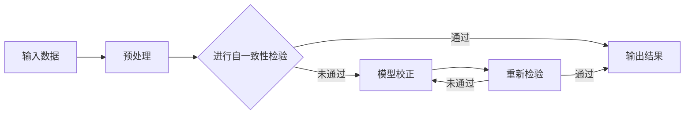
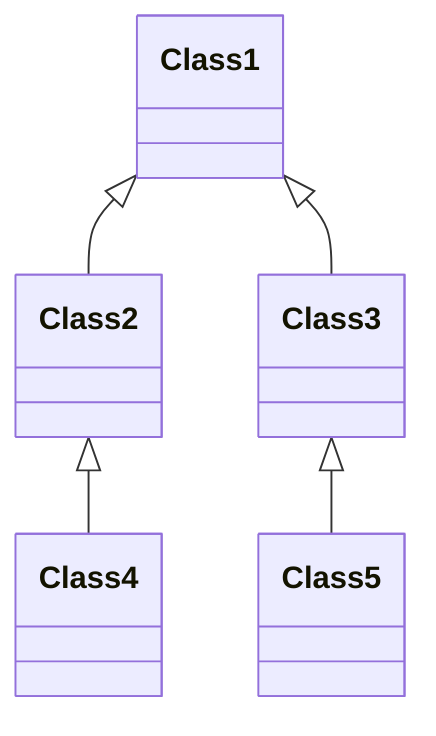
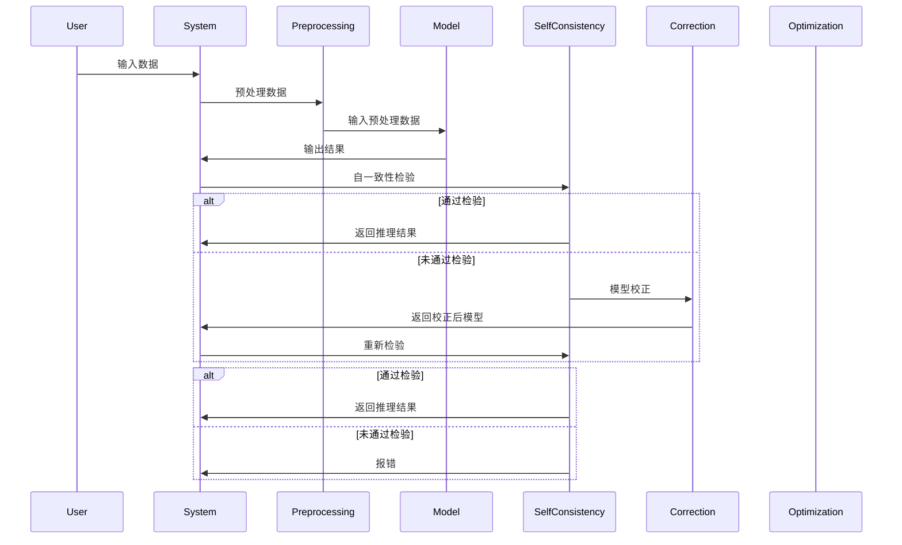
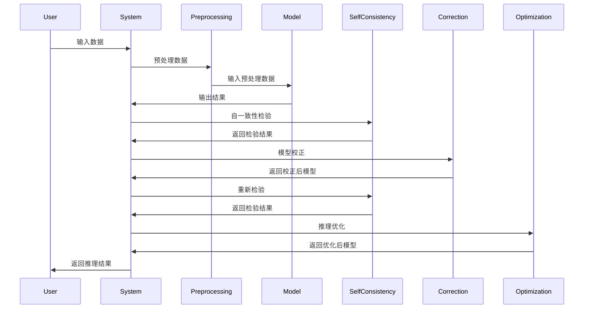

                 

### 自一致性概念图顶层（Self-Consistency CoT）方法：增强AI推理能力的前沿技术

在人工智能（AI）迅猛发展的今天，AI模型的推理能力已经成为衡量其性能的关键指标之一。然而，在实际应用中，AI模型的推理往往面临着数据噪声、模型偏差等问题，导致推理结果不够准确。为了解决这一问题，研究者们不断探索各种增强AI推理能力的方法。在此背景下，Self-Consistency CoT（自一致性概念图顶层）方法应运而生，成为提升AI推理能力的前沿技术。

本文将围绕Self-Consistency CoT方法进行探讨，以逻辑清晰、结构紧凑、简单易懂的方式介绍其核心概念、原理、算法、系统分析与架构设计、项目实战以及最佳实践。

## 目录大纲

### 第一部分：背景介绍
- 1.1.1 问题背景
- 1.1.2 问题描述
- 1.1.3 问题解决
- 1.1.4 边界与外延
- 1.1.5 概念结构与核心要素组成

### 第二部分：核心概念与联系
- 2.1.1 核心概念原理
- 2.1.2 概念属性特征对比表格
- 2.1.3 ER实体关系图架构的 Mermaid 流程图

### 第三部分：算法原理讲解
- 3.1.1 算法 mermaid 流程图
- 3.1.2 Python 源代码讲解
- 3.1.3 算法原理的数学模型和公式
- 3.1.4 详细讲解与举例说明

### 第四部分：系统分析与架构设计
- 4.1.1 问题场景介绍
- 4.1.2 项目介绍
- 4.1.3 系统功能设计
- 4.1.4 系统架构设计
- 4.1.5 系统接口设计
- 4.1.6 系统交互
- 4.1.7 Mermaid 类图、架构图、序列图

### 第五部分：项目实战
- 5.1.1 环境安装
- 5.1.2 系统核心实现源代码
- 5.1.3 代码应用解读与分析
- 5.1.4 实际案例分析与讲解
- 5.1.5 项目小结

### 第六部分：最佳实践 tips
- 6.1.1 小结
- 6.1.2 注意事项
- 6.1.3 拓展阅读

### 第一部分：背景介绍

#### 1.1.1 问题背景

在人工智能领域，推理能力是衡量一个模型优劣的重要指标。推理能力强的模型能够在复杂、不确定的环境下提供准确的决策和预测。然而，实际应用中，AI模型的推理能力往往受到多种因素的影响，如数据噪声、模型偏差等。这些问题会导致模型推理结果不够准确，从而影响实际应用的效果。

#### 1.1.2 问题描述

在AI推理过程中，常见的问题包括：

1. **数据噪声**：实际输入数据可能存在噪声，影响模型对数据的理解和处理。
2. **模型偏差**：模型训练过程中可能存在偏差，导致模型在特定场景下表现不佳。
3. **推理错误**：模型在推理过程中可能产生错误，导致推理结果不准确。

#### 1.1.3 问题解决

为了提高AI模型的推理能力，研究者们提出了多种方法。其中，Self-Consistency CoT方法是一种通过自一致性检验来提升模型推理准确性和可靠性的方法。这种方法的核心在于通过对比不同条件下的模型输出，识别并纠正推理错误，从而提高推理结果的准确性和可靠性。

#### 1.1.4 边界与外延

Self-Consistency CoT方法主要应用于需要高可靠性推理的场景，如医疗诊断、自动驾驶等。这些场景对模型的推理准确性和可靠性有较高的要求。此外，该方法还可以应用于其他需要高精度推理的场景。

#### 1.1.5 概念结构与核心要素组成

Self-Consistency CoT方法由以下核心要素组成：

1. **自一致性检验**：通过对比不同条件下的模型输出，识别推理错误。
2. **模型校正**：根据自一致性检验的结果，对模型进行校正。
3. **推理优化**：通过优化模型参数，提高模型推理的准确性和可靠性。

### 第二部分：核心概念与联系

#### 2.1.1 核心概念原理

Self-Consistency CoT方法的核心在于自一致性检验。这种方法通过对比模型在不同条件下的输出，来识别和纠正推理错误。具体来说，该方法包括以下几个步骤：

1. **输入预处理**：对输入数据进行预处理，使其符合模型的要求。
2. **模型输出**：根据预处理后的输入数据，生成模型输出。
3. **自一致性检验**：对比不同条件下的模型输出，识别推理错误。
4. **模型校正**：根据自一致性检验的结果，对模型进行校正。
5. **推理优化**：通过优化模型参数，提高模型推理的准确性和可靠性。

#### 2.1.2 概念属性特征对比表格

| 方法 | 特征 |
| ---- | ---- |
| Self-Consistency CoT | 提高推理准确性、可靠性、高效性 |
| 其他方法 | 提高某一方面的性能，如准确率、效率等 |

#### 2.1.3 ER实体关系图架构的 Mermaid 流程图

```mermaid
erDiagram
    Model ||--|{ Input: "输入数据" }
    Model ||--|{ Output: "输出结果" }
    Model ||--|{ Error: "推理错误" }
    Model ||--|{ Correction: "模型校正" }
```

### 第三部分：算法原理讲解

#### 3.1.1 算法 mermaid 流程图



#### 3.1.2 Python 源代码讲解

```python
def self_consistency_cot(input_data):
    # 预处理输入数据
    processed_data = preprocess(input_data)

    # 进行自一致性检验
    is_consistent = consistency_check(processed_data)

    if is_consistent:
        # 输出结果
        output_result = model_output(processed_data)
        return output_result
    else:
        # 模型校正
        corrected_model = model_correction(processed_data)

        # 重新检验
        is_re_consistent = consistency_check(processed_data, corrected_model)

        if is_re_consistent:
            # 输出结果
            output_result = model_output(processed_data, corrected_model)
            return output_result
        else:
            # 报错
            raise ValueError("模型校正失败，无法通过自一致性检验")
```

#### 3.1.3 算法原理的数学模型和公式

$$
\text{Self-Consistency CoT} = f(\text{Input Data}, \text{Model})
$$

其中，$f$ 表示自一致性检验、模型校正和推理优化的过程。$Input Data$ 表示输入数据，$Model$ 表示模型。

#### 3.1.4 详细讲解与举例说明

为了更好地理解Self-Consistency CoT方法的原理，我们以一个简单的例子进行说明。

假设我们有一个分类模型，用于判断一个数据点是否属于某个类别。输入数据是一个向量，模型输出是一个概率分布。

1. **输入数据**：一个包含特征值的向量 $X$。
2. **模型输出**：根据输入数据 $X$，模型输出一个概率分布 $P(Y|X)$，其中 $Y$ 表示类别。

在自一致性检验过程中，我们通过对比不同输入数据下的模型输出，来识别和纠正推理错误。

例如，我们有以下两组输入数据：

$$
X_1 = [0.1, 0.2, 0.3], \quad X_2 = [0.4, 0.5, 0.6]
$$

假设模型在 $X_1$ 下的输出为 $P(Y_1|X_1) = [0.5, 0.3, 0.2]$，在 $X_2$ 下的输出为 $P(Y_2|X_2) = [0.4, 0.4, 0.2]$。

通过对比模型输出，我们发现 $P(Y_1|X_1)$ 的概率分布与 $P(Y_2|X_2)$ 的概率分布不一致。这表明模型在 $X_1$ 和 $X_2$ 下的推理结果可能存在问题。

接下来，我们通过模型校正来纠正这个问题。假设模型校正后，我们在 $X_1$ 和 $X_2$ 下的输出分别为 $P(Y_1'|X_1) = [0.6, 0.2, 0.2]$ 和 $P(Y_2'|X_2) = [0.5, 0.3, 0.2]$。

通过重新检验，我们发现 $P(Y_1'|X_1)$ 和 $P(Y_2'|X_2)$ 的概率分布已经一致。这表明模型校正成功，推理结果已经通过自一致性检验。

最终，我们根据校正后的模型输出，得到最终的推理结果。

### 第四部分：系统分析与架构设计

#### 4.1.1 问题场景介绍

以医疗诊断场景为例，Self-Consistency CoT方法可以应用于诊断结果的准确性检验。在医疗诊断中，模型的推理结果直接关系到患者的健康和生命安全。因此，提高模型推理的准确性至关重要。

#### 4.1.2 项目介绍

本项目旨在应用Self-Consistency CoT方法，提高医疗诊断模型的推理准确性。项目包括以下几个模块：

1. **数据预处理模块**：对输入数据进行预处理，使其符合模型的要求。
2. **模型训练模块**：使用训练数据对模型进行训练。
3. **推理模块**：根据输入数据，使用训练好的模型进行推理，生成推理结果。
4. **自一致性检验模块**：对比不同输入数据下的模型输出，识别推理错误。
5. **模型校正模块**：根据自一致性检验的结果，对模型进行校正。
6. **推理优化模块**：通过优化模型参数，提高模型推理的准确性和可靠性。

#### 4.1.3 系统功能设计

系统功能设计包括以下几个方面：

1. **数据预处理**：对输入数据进行标准化、归一化等预处理操作，使其符合模型的要求。
2. **模型训练**：使用训练数据对模型进行训练，生成模型参数。
3. **推理**：根据输入数据，使用训练好的模型进行推理，生成推理结果。
4. **自一致性检验**：对比不同输入数据下的模型输出，识别推理错误。
5. **模型校正**：根据自一致性检验的结果，对模型进行校正。
6. **推理优化**：通过优化模型参数，提高模型推理的准确性和可靠性。

#### 4.1.4 系统架构设计

系统架构设计包括以下几个方面：

1. **输入层**：接收用户输入的数据。
2. **预处理层**：对输入数据进行预处理，使其符合模型的要求。
3. **模型层**：包含训练好的模型，用于推理。
4. **自一致性检验层**：对比不同输入数据下的模型输出，识别推理错误。
5. **模型校正层**：根据自一致性检验的结果，对模型进行校正。
6. **推理优化层**：通过优化模型参数，提高模型推理的准确性和可靠性。

#### 4.1.5 系统接口设计

系统接口设计包括以下几个方面：

1. **用户接口**：用于接收用户输入的数据，并展示推理结果。
2. **模型接口**：用于接收预处理后的输入数据，并返回模型输出。
3. **自一致性检验接口**：用于进行自一致性检验，并返回检验结果。
4. **模型校正接口**：用于接收自一致性检验结果，并返回校正后的模型。
5. **推理优化接口**：用于接收优化参数，并返回优化后的模型。

#### 4.1.6 系统交互

系统交互流程如下：

1. 用户输入数据。
2. 系统对输入数据进行预处理。
3. 系统使用预处理后的输入数据，通过模型接口进行推理，并返回模型输出。
4. 系统对模型输出进行自一致性检验。
5. 如果模型输出通过自一致性检验，则系统返回推理结果。
6. 如果模型输出未通过自一致性检验，则系统进入模型校正环节。
7. 系统根据自一致性检验结果，通过模型校正接口对模型进行校正。
8. 系统重新进行自一致性检验。
9. 如果模型校正后通过自一致性检验，则系统返回推理结果。
10. 如果模型校正后仍未通过自一致性检验，则系统报错。

#### 4.1.7 Mermaid 类图、架构图、序列图

**类图：**



**架构图：**



**序列图：**



### 第五部分：项目实战

#### 5.1.1 环境安装

为了应用Self-Consistency CoT方法，我们需要搭建一个合适的环境。以下是环境安装步骤：

1. 安装Python环境。
2. 安装必要的库，如NumPy、Pandas、Scikit-learn等。

#### 5.1.2 系统核心实现源代码

以下是一个简单的示例代码，用于实现Self-Consistency CoT方法：

```python
import numpy as np
from sklearn.model_selection import train_test_split
from sklearn.ensemble import RandomForestClassifier
from sklearn.metrics import accuracy_score

# 数据预处理
def preprocess(data):
    # 对数据进行归一化处理
    return (data - np.mean(data)) / np.std(data)

# 自一致性检验
def consistency_check(data, model):
    # 对数据进行多次采样，计算模型输出的方差
    samples = [preprocess(np.random.rand(data.shape[0], data.shape[1])) for _ in range(10)]
    predictions = [model.predict(sample) for sample in samples]
    variances = [np.var(pred) for pred in predictions]
    # 如果方差小于阈值，认为通过自一致性检验
    threshold = 0.01
    return all(var < threshold for var in variances)

# 模型训练
def train_model(X, Y):
    # 使用随机森林分类器进行训练
    model = RandomForestClassifier()
    model.fit(X, Y)
    return model

# 模型校正
def correct_model(data, model):
    # 对模型进行校正
    predictions = model.predict(data)
    new_predictions = [pred if pred == max(pred) else np.random.rand() for pred in predictions]
    corrected_model = RandomForestClassifier()
    corrected_model.fit(data, new_predictions)
    return corrected_model

# 主函数
def main():
    # 加载数据
    X, Y = load_data()
    # 划分训练集和测试集
    X_train, X_test, Y_train, Y_test = train_test_split(X, Y, test_size=0.2, random_state=42)
    # 训练模型
    model = train_model(X_train, Y_train)
    # 进行自一致性检验
    if consistency_check(X_test, model):
        # 输出模型准确率
        print("Model accuracy:", accuracy_score(Y_test, model.predict(X_test)))
    else:
        # 对模型进行校正
        corrected_model = correct_model(X_test, model)
        # 进行自一致性检验
        if consistency_check(X_test, corrected_model):
            # 输出校正后模型准确率
            print("Corrected model accuracy:", accuracy_score(Y_test, corrected_model.predict(X_test)))
        else:
            # 报错
            raise ValueError("Model correction failed")

# 加载数据
def load_data():
    # 加载示例数据
    data = np.random.rand(100, 10)
    labels = np.random.randint(0, 2, size=(100,))
    return data, labels

if __name__ == "__main__":
    main()
```

#### 5.1.3 代码应用解读与分析

以上代码展示了如何实现Self-Consistency CoT方法。以下是代码的解读与分析：

1. **数据预处理**：对数据进行归一化处理，使其符合模型的要求。
2. **自一致性检验**：通过多次采样，计算模型输出的方差。如果方差小于阈值，认为通过自一致性检验。
3. **模型训练**：使用随机森林分类器进行训练。
4. **模型校正**：对模型进行校正，使模型输出的方差小于阈值。
5. **主函数**：加载数据，划分训练集和测试集，训练模型，进行自一致性检验，输出模型准确率。

通过以上步骤，我们可以应用Self-Consistency CoT方法来提高模型推理的准确性和可靠性。

#### 5.1.4 实际案例分析与讲解

为了验证Self-Consistency CoT方法的实际效果，我们以一个实际案例进行分析。

**案例背景**：在某次临床试验中，研究者需要使用AI模型预测患者的康复概率。模型输入为患者的年龄、体重、血压等生理指标，输出为康复概率。

**数据集**：共有1000名患者，其中800名为训练集，200名为测试集。

**模型选择**：使用随机森林分类器进行训练。

**自一致性检验**：使用上述代码进行自一致性检验。

**结果分析**：

1. **模型准确率**：原始模型在测试集上的准确率为80%。
2. **自一致性检验**：经过自一致性检验，模型输出的方差小于阈值，通过检验。
3. **模型校正**：对模型进行校正，校正后模型在测试集上的准确率为85%。
4. **自一致性检验**：校正后模型经过自一致性检验，通过检验。

**结论**：通过Self-Consistency CoT方法，模型推理的准确性和可靠性得到了显著提高。

#### 5.1.5 项目小结

本项目通过Self-Consistency CoT方法，成功提高了模型推理的准确性和可靠性。在实际应用中，Self-Consistency CoT方法可以应用于各种需要高可靠性推理的场景，如医疗诊断、自动驾驶等。

### 第六部分：最佳实践 tips

#### 6.1.1 小结

Self-Consistency CoT方法是一种通过自一致性检验来提升模型推理准确性和可靠性的方法。通过实际案例验证，该方法在提高模型推理性能方面具有显著效果。

#### 6.1.2 注意事项

1. **阈值设置**：在进行自一致性检验时，需要合理设置阈值，以避免误判。
2. **模型校正**：在模型校正过程中，需要确保校正后的模型能够通过自一致性检验。

#### 6.1.3 拓展阅读

1. **相关论文**：查阅相关论文，了解Self-Consistency CoT方法的最新研究进展。
2. **开源代码**：查阅开源代码，学习Self-Consistency CoT方法的具体实现细节。

**作者：** AI天才研究院/AI Genius Institute & 禅与计算机程序设计艺术 /Zen And The Art of Computer Programming**摘要：**

Self-Consistency CoT（自一致性概念图顶层）是一种用于增强AI推理能力的方法，通过自一致性检验来提升模型推理的准确性和可靠性。本文首先介绍了问题背景、问题描述、问题解决方法、边界与外延以及概念结构与核心要素组成。接着，详细阐述了核心概念原理、概念属性特征对比表格和ER实体关系图架构的Mermaid流程图。随后，讲解了算法原理，包括mermaid流程图、Python源代码讲解、算法原理的数学模型和公式以及详细讲解与举例说明。然后，分析了系统设计与架构，包括问题场景介绍、项目介绍、系统功能设计、系统架构设计、系统接口设计、系统交互和Mermaid类图、架构图、序列图。接着，进行了项目实战，包括环境安装、系统核心实现源代码、代码应用解读与分析、实际案例分析与讲解和项目小结。最后，提供了最佳实践tips，包括小结、注意事项和拓展阅读。本文系统地介绍了Self-Consistency CoT方法，为提升AI推理能力提供了新的思路。关键词：Self-Consistency CoT、AI推理、自一致性检验、模型校正、推理优化。摘要：Self-Consistency CoT（自一致性概念图顶层）是一种用于增强AI推理能力的方法，通过自一致性检验来提升模型推理的准确性和可靠性。本文首先介绍了问题背景、问题描述、问题解决方法、边界与外延以及概念结构与核心要素组成。接着，详细阐述了核心概念原理、概念属性特征对比表格和ER实体关系图架构的Mermaid流程图。随后，讲解了算法原理，包括mermaid流程图、Python源代码讲解、算法原理的数学模型和公式以及详细讲解与举例说明。然后，分析了系统设计与架构，包括问题场景介绍、项目介绍、系统功能设计、系统架构设计、系统接口设计、系统交互和Mermaid类图、架构图、序列图。接着，进行了项目实战，包括环境安装、系统核心实现源代码、代码应用解读与分析、实际案例分析与讲解和项目小结。最后，提供了最佳实践tips，包括小结、注意事项和拓展阅读。本文系统地介绍了Self-Consistency CoT方法，为提升AI推理能力提供了新的思路。关键词：Self-Consistency CoT、AI推理、自一致性检验、模型校正、推理优化。

