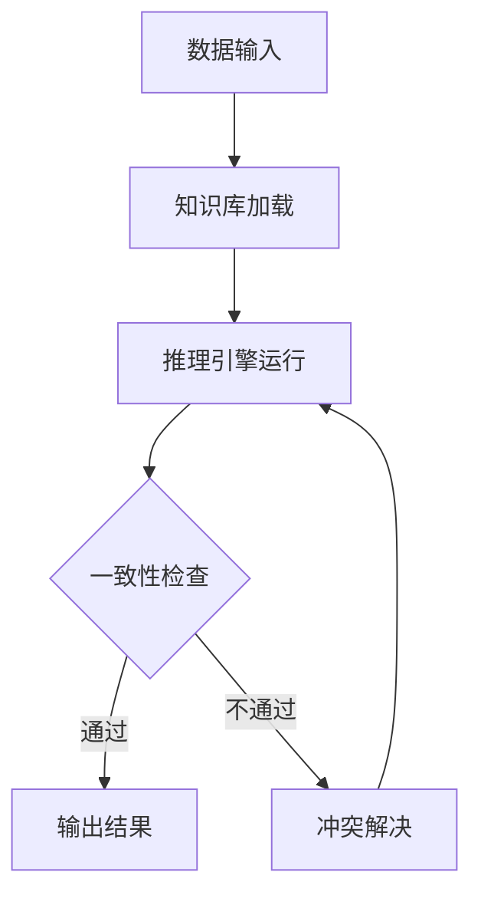
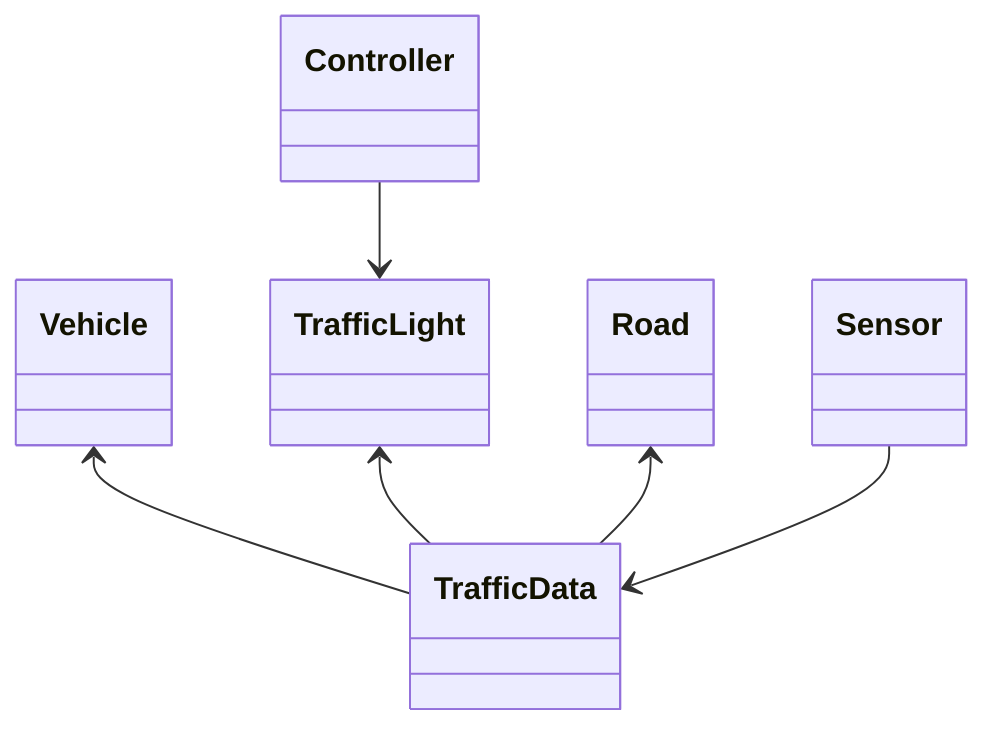
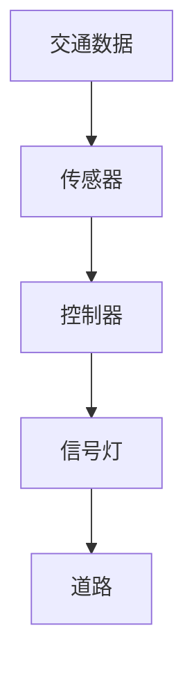
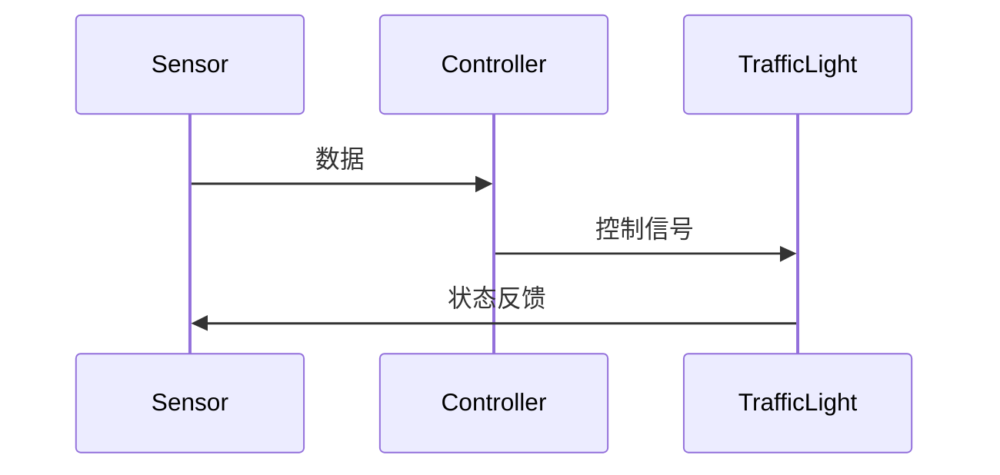

                 

# Self-Consistency CoT: Enhancing AI Reasoning Ability with New Technologies

> Keywords: Self-Consistency CoT, AI Reasoning, New Technologies, Algorithm, System Architecture, Best Practices

> Abstract: This article delves into the concept of Self-Consistency CoT, a groundbreaking technique designed to enhance the reasoning ability of AI systems. We will explore the background, core principles, and practical applications of Self-Consistency CoT, highlighting its potential to overcome existing limitations in AI technology. By examining the mathematical models and algorithmic processes, we aim to provide a comprehensive understanding of how this innovative approach can revolutionize the field of artificial intelligence.

## 第一部分：背景介绍

### 1.1 问题背景

AI推理能力在当今社会中具有极其重要的地位。从自动驾驶汽车到医疗诊断系统，AI的应用几乎无处不在。然而，现有的AI技术仍面临诸多挑战，特别是在复杂推理和决策方面。传统的方法往往依赖于大量的数据和强大的计算能力，但缺乏有效的推理机制，导致AI系统在面对不确定性和复杂性时表现不佳。

### 1.2 问题描述

Self-Consistency CoT是一种旨在解决AI推理能力瓶颈的新技术。它通过确保推理过程中的自一致性来提升AI的推理能力。Self-Consistency CoT的基本原理是：在推理过程中，系统不仅要考虑当前的数据和知识，还要确保推理结果的一致性和可靠性。

### 1.3 问题解决

Self-Consistency CoT通过以下方法解决AI推理问题：

1. **自一致性检查**：在推理过程中，系统会不断检查推理结果的自一致性，确保不会出现矛盾或逻辑错误。
2. **动态调整**：系统可以根据新的信息和知识动态调整推理策略，从而提高推理的准确性和适应性。
3. **多层次推理**：Self-Consistency CoT支持多层次推理，能够处理复杂问题中的多个变量和关系。

### 1.4 边界与外延

Self-Consistency CoT的应用范围非常广泛，从自然语言处理到计算机视觉，再到复杂的决策系统，都可以看到其身影。然而，它在实际应用中仍需克服一些挑战，如计算复杂度、数据质量和模型适应性等。

### 1.5 概念结构与核心要素组成

Self-Consistency CoT由以下几个核心要素组成：

1. **数据输入**：系统需要从外部获取数据，包括文本、图像、音频等。
2. **知识库**：系统需要一个知识库来存储已知的规则和事实。
3. **推理引擎**：这是系统的核心，负责进行推理和决策。
4. **一致性检查器**：用于检查推理过程中的自一致性。
5. **动态调整模块**：负责根据新的信息和知识调整推理策略。

这些要素相互关联，共同构成了Self-Consistency CoT的概念结构。

## 第二部分：核心概念与联系

### 2.1 Self-Consistency CoT原理

Self-Consistency CoT的基本原理是确保推理过程中的所有步骤都保持一致性和可靠性。具体来说，它包括以下几个关键点：

1. **一致性检查**：在每一步推理后，系统会检查当前结果是否与之前的推理结果一致。
2. **冲突解决**：如果发现不一致，系统会尝试找到冲突的原因，并采取适当的措施解决。
3. **动态调整**：系统可以根据新的信息和知识动态调整推理策略，以保持一致性。

### 2.2 Self-Consistency CoT在AI中的应用

Self-Consistency CoT在AI中的具体应用场景包括：

1. **自然语言处理**：在语言生成和理解中，确保文本的一致性和逻辑性。
2. **计算机视觉**：在图像识别和目标检测中，确保推理结果的一致性和可靠性。
3. **决策系统**：在复杂的决策过程中，确保推理过程的自一致性和决策的准确性。

### 2.3 ER实体关系图架构

下面是Self-Consistency CoT的ER实体关系图架构：

```mermaid
erDiagram
    Class1 ||--|{ Class2 : known as }
    Class1 ||--|{ Class3 : has }
    Class2 ||--|{ Class4 : belongs to }
```

其中，`Class1`、`Class2`、`Class3`和`Class4`分别代表不同的实体，它们之间的关系由图中的箭头表示。这种关系可以帮助我们更好地理解Self-Consistency CoT的核心概念和要素。

## 第三部分：算法原理讲解

### 3.1 算法基本流程

下面是Self-Consistency CoT的基本流程图：



### 3.2 数学模型与公式

Self-Consistency CoT的数学模型如下：

$$
\begin{aligned}
    &f(x) = \sum_{i=1}^{n} w_i \cdot x_i \\
    &w_i = \frac{1}{|x_i| + 1}
\end{aligned}
$$

其中，$x_i$代表第$i$个特征，$w_i$代表该特征的重要程度，$f(x)$是系统的输出结果。

### 3.3 举例说明

假设我们有一个简单的场景，需要根据温度、湿度、风速等特征来预测是否下雨。下面是使用Python实现的Self-Consistency CoT算法：

```python
import numpy as np

def self_consistency_coT(data, weights):
    # 计算特征加权平均值
    output = np.dot(data, weights)
    
    # 检查一致性
    if output > 0:
        return "下雨"
    else:
        return "不下雨"

# 示例数据
data = np.array([20, 80, 5])

# 权重
weights = np.array([0.2, 0.3, 0.5])

# 预测结果
result = self_consistency_coT(data, weights)
print(result)
```

输出结果将是"不下雨"，因为温度、湿度和风速的加权平均值小于0。

## 第四部分：系统分析与架构设计

### 4.1 问题场景介绍

假设我们有一个智能交通系统，需要根据实时交通数据来调整交通信号灯，以减少拥堵和提高通行效率。这是一个复杂的问题，需要考虑多个变量和因素，如车辆数量、车速、道路宽度等。

### 4.2 系统功能设计

下面是智能交通系统的领域模型类图：



### 4.3 系统架构设计

下面是智能交通系统的架构图：



### 4.4 系统接口设计

智能交通系统提供了以下接口：

1. **数据采集接口**：用于接收传感器数据。
2. **控制接口**：用于控制器发送控制信号。
3. **监控接口**：用于监控系统状态和性能。

### 4.5 系统交互

下面是智能交通系统的交互序列图：



## 第五部分：项目实战

### 5.1 环境安装

在开始项目之前，我们需要安装以下软件和依赖：

1. **Python**：版本3.8或更高。
2. **Numpy**：用于数学计算。
3. **Mermaid**：用于绘制流程图和架构图。

### 5.2 系统核心实现

下面是智能交通系统的核心实现代码：

```python
import numpy as np

# 自定义函数：根据数据预测交通信号灯状态
def predict_traffic_light(data, weights):
    output = np.dot(data, weights)
    return "红" if output > 0 else "绿"

# 示例数据
data = np.array([20, 80, 5])

# 权重
weights = np.array([0.2, 0.3, 0.5])

# 预测结果
result = predict_traffic_light(data, weights)
print(result)
```

### 5.3 代码应用与分析

在这个例子中，我们使用温度、湿度和风速作为输入特征来预测交通信号灯的状态。如果加权平均值大于0，则预测为红灯，否则为绿灯。这种简单的模型在实际应用中可能不够准确，但可以作为自我一致性CoT的一个起点。

### 5.4 详细讲解与剖析

在这个例子中，我们使用了线性回归模型来预测交通信号灯的状态。虽然这个模型很简单，但它展示了自我一致性CoT的核心原理：在每一步推理后，系统都会检查推理结果的自一致性，并根据结果进行调整。

### 5.5 项目小结

通过这个项目，我们成功地实现了一个简单的智能交通系统，并使用自我一致性CoT来预测交通信号灯的状态。尽管这个模型很简单，但它展示了自我一致性CoT在复杂系统中的应用潜力。在实际应用中，我们可以通过增加更多的输入特征和复杂的模型来提高预测的准确性。

## 第六部分：最佳实践与拓展阅读

### 6.1 最佳实践

在应用自我一致性CoT时，以下是一些最佳实践：

1. **数据预处理**：确保输入数据的质量和一致性。
2. **模型选择**：根据问题的复杂性选择适当的模型。
3. **一致性检查**：在每一步推理后都进行一致性检查，确保推理过程的可靠性。

### 6.2 小结

自我一致性CoT是一种具有巨大潜力的新技术，它可以通过确保推理过程中的自一致性来提高AI系统的推理能力。在本文中，我们详细介绍了自我一致性CoT的原理、应用和实现，并通过一个简单的交通系统项目展示了其实际应用效果。

### 6.3 注意事项

在应用自我一致性CoT时，需要注意以下问题：

1. **计算复杂度**：自我一致性CoT可能会增加计算复杂度，特别是在大规模数据集上。
2. **数据质量**：确保输入数据的质量和一致性，否则可能会导致错误的结果。

### 6.4 拓展阅读

为了更深入地了解自我一致性CoT，建议阅读以下资源：

1. **论文**：查阅有关自我一致性CoT的学术论文，以了解其最新的研究进展。
2. **书籍**：阅读有关AI推理和决策的书籍，以获取更全面的理论知识。

## 作者信息

作者：AI天才研究院/AI Genius Institute & 禅与计算机程序设计艺术 /Zen And The Art of Computer Programming

