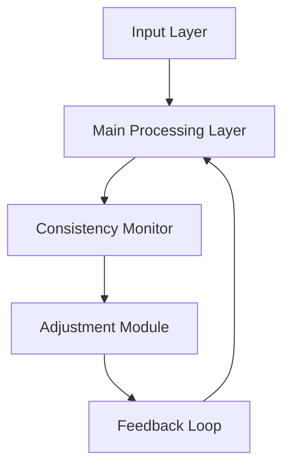
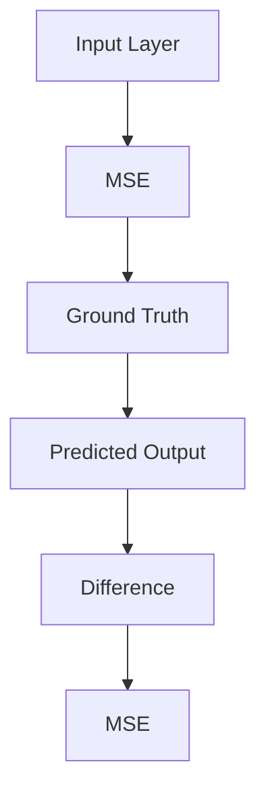
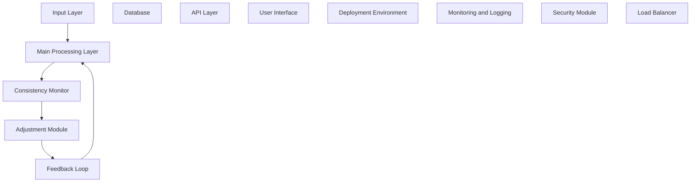
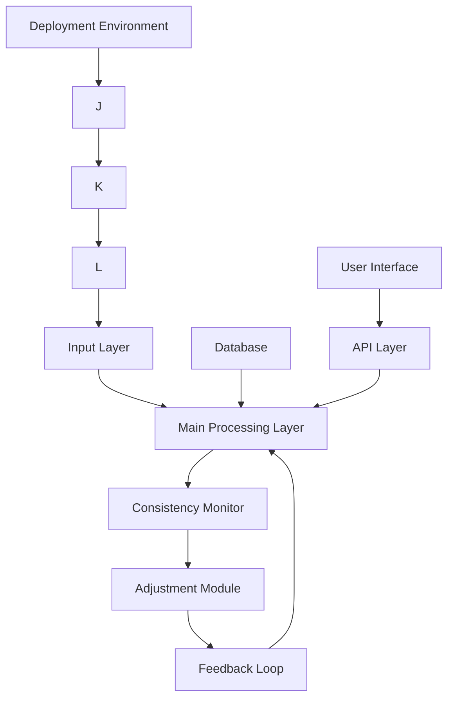

                 


## # Self-Consistency CoT: A New Method for Enhancing AI Output Consistency

### **Keywords**: AI Output Consistency, Self-Consistency CoT, Algorithm Design, Mathematical Models, System Architecture, Case Studies

### **Abstract**:

The field of artificial intelligence (AI) has seen tremendous advancements in recent years. However, one persistent challenge remains: ensuring the consistency of AI outputs. The Self-Consistency CoT (Self-Consistent Concept of Thought) is a novel approach that addresses this challenge by embedding a mechanism to ensure that AI systems produce coherent and reliable outputs. This article delves into the core concepts of Self-Consistency CoT, providing a comprehensive overview of its framework, algorithm design, theoretical foundations, system architecture, practical applications, and future directions. Through a series of well-structured sections, the article aims to shed light on the inner workings of Self-Consistency CoT and its potential to revolutionize AI output consistency.

### **Introduction and Background**

#### **Core Concepts and Terminology**

To begin with, let's define some essential concepts and terminology that will be used throughout this article.

1. **Artificial Intelligence (AI)**: AI refers to the simulation of human intelligence in machines that are programmed to think like humans and mimic their actions.
2. **Consistency**: In the context of AI, consistency refers to the ability of an AI system to produce outputs that are coherent, reliable, and reproducible across different scenarios and inputs.
3. **Self-Consistency CoT**: This term represents a new method for enhancing AI output consistency by incorporating a self-monitoring mechanism that ensures the system's outputs remain consistent over time.

#### **Problem Background**

Despite the impressive progress in AI, there are several challenges that hinder the consistency of AI outputs. Some of these challenges include:

1. **Overfitting**: AI models may become too specialized in a specific dataset, leading to poor generalization and inconsistency when faced with new, unseen data.
2. **Contextual Variability**: AI systems often struggle to maintain consistency across different contexts or use cases, leading to discrepancies in their outputs.
3. **Temporal Variability**: AI models can produce inconsistent results over time due to changes in data distributions or the model's internal parameters.

#### **Problem Description**

The problem of inconsistent AI outputs manifests in various ways, such as:

1. **Conflicting Predictions**: An AI system may provide contradictory predictions for similar inputs, making it unreliable for decision-making.
2. **Poor User Experience**: Inconsistent outputs can lead to frustration among users who rely on AI systems for guidance or recommendations.
3. **Reproducibility Issues**: It can be challenging to reproduce the same outputs across different environments or runs of the AI system.

#### **Problem Solutions**

To address these challenges, researchers and practitioners have explored various solutions, including:

1. **Data Augmentation**: By increasing the diversity of training data, models can improve their generalization capabilities.
2. **Contextual Embeddings**: Incorporating contextual information into AI models can help maintain consistency across different scenarios.
3. **Temporal Adaptation**: Techniques like online learning and continual learning aim to adapt AI models to changes in data distributions over time.

#### **Boundaries and Extensions**

While the Self-Consistency CoT offers a promising solution to the problem of inconsistent AI outputs, it is important to consider its boundaries and extensions:

1. **Boundary Conditions**: The effectiveness of Self-Consistency CoT depends on factors like the quality of input data and the complexity of the AI model.
2. **Extensions**: Future research can explore the integration of Self-Consistency CoT with other AI techniques, such as reinforcement learning and transfer learning.

### **Core Concepts and Framework**

#### **Fundamental Principles**

The Self-Consistency CoT framework is based on several fundamental principles that ensure AI outputs remain consistent over time:

1. **Self-Monitoring**: The system continuously monitors its own outputs to detect inconsistencies.
2. **Adjustment Mechanism**: When inconsistencies are detected, the system adjusts its internal parameters to correct the output.
3. **Feedback Loop**: The adjusted outputs are used to refine the system's learning process, further enhancing its consistency.

#### **Core Components**

The Self-Consistency CoT framework consists of several key components that work together to achieve consistent AI outputs:

1. **Input Layer**: This layer receives the input data and preprocesses it for further processing.
2. **Main Processing Layer**: This layer contains the core AI model, which processes the input data and generates outputs.
3. **Consistency Monitor**: This component continuously monitors the outputs generated by the main processing layer to detect inconsistencies.
4. **Adjustment Module**: When inconsistencies are detected, this module adjusts the internal parameters of the main processing layer to correct the output.
5. **Feedback Loop**: The adjusted outputs are fed back into the main processing layer to refine the system's learning process.

#### **Interrelations**

The interrelations between the core components of the Self-Consistency CoT framework are crucial for ensuring consistent AI outputs:

1. **Input Layer and Main Processing Layer**: The input layer preprocesses the input data and feeds it into the main processing layer, which generates the initial outputs.
2. **Main Processing Layer and Consistency Monitor**: The main processing layer continuously generates outputs, which are monitored by the consistency monitor for inconsistencies.
3. **Consistency Monitor and Adjustment Module**: When inconsistencies are detected, the consistency monitor signals the adjustment module to correct the output.
4. **Adjustment Module and Main Processing Layer**: The adjustment module adjusts the internal parameters of the main processing layer to correct the output, which is then fed back into the main processing layer through the feedback loop.

### **Algorithm Design and Implementation**

#### **Algorithm Design Process**

The design of the Self-Consistency CoT algorithm involves several key steps:

1. **Define the Problem**: Clearly articulate the problem of ensuring consistent AI outputs.
2. **Choose the AI Model**: Select an appropriate AI model, such as a neural network, that can be used as the main processing layer.
3. **Design the Consistency Monitor**: Develop a mechanism to continuously monitor the outputs generated by the main processing layer for inconsistencies.
4. **Design the Adjustment Module**: Create a module that can adjust the internal parameters of the main processing layer to correct inconsistencies.
5. **Implement the Feedback Loop**: Ensure that the adjusted outputs are fed back into the main processing layer to refine the system's learning process.

#### **Algorithm Flow Visualization**

To visualize the flow of the Self-Consistency CoT algorithm, we can use a Mermaid diagram. The following diagram illustrates the key components and their interactions:



#### **Python Code Snippets**

To implement the Self-Consistency CoT algorithm, we can use Python and popular deep learning libraries like TensorFlow or PyTorch. Below is an example of how the main processing layer and the consistency monitor could be implemented in Python:

```python
import tensorflow as tf

# Define the main processing layer
model = tf.keras.Sequential([
    tf.keras.layers.Dense(128, activation='relu', input_shape=(input_shape)),
    tf.keras.layers.Dense(64, activation='relu'),
    tf.keras.layers.Dense(1, activation='sigmoid')
])

# Compile the model
model.compile(optimizer='adam', loss='binary_crossentropy', metrics=['accuracy'])

# Define the consistency monitor
def consistency_monitor(outputs):
    # Calculate the mean squared error between outputs and ground truth
    mse = tf.reduce_mean(tf.square(outputs - ground_truth))
    return mse

# Define the adjustment module
def adjustment_module(mse, learning_rate):
    # Adjust the internal parameters of the model
    optimizer = tf.keras.optimizers.Adam(learning_rate=learning_rate)
    with tf.GradientTape() as tape:
        outputs = model( inputs)
        mse = consistency_monitor(outputs)
    gradients = tape.gradient(mse, model.trainable_variables)
    optimizer.apply_gradients(zip(gradients, model.trainable_variables))
```

### **Mathematical Models and Theoretical Foundations**

#### **Overview**

The Self-Consistency CoT algorithm is built upon a set of mathematical models and theoretical foundations that ensure consistent AI outputs. These models include loss functions, optimization techniques, and feedback mechanisms.

#### **Mathematical Models**

The following mathematical models are integral to the Self-Consistency CoT framework:

1. **Loss Function**: The choice of loss function is crucial for the optimization process. Common loss functions include mean squared error (MSE), cross-entropy loss, and binary cross-entropy loss.
2. **Optimization Techniques**: Optimization techniques, such as gradient descent and its variants (e.g., stochastic gradient descent, Adam optimizer), are used to adjust the model's parameters to minimize the loss function.
3. **Feedback Mechanism**: The feedback mechanism involves continuously monitoring the outputs generated by the model and adjusting the parameters to correct inconsistencies.

#### **Equations**

The following equations represent the core components of the mathematical models used in Self-Consistency CoT:

$$
\text{MSE} = \frac{1}{N}\sum_{i=1}^{N} (\hat{y}_i - y_i)^2
$$

$$
\text{Cross-Entropy Loss} = -\frac{1}{N}\sum_{i=1}^{N} y_i \log(\hat{y}_i)
$$

$$
\text{Binary Cross-Entropy Loss} = -\frac{1}{N}\sum_{i=1}^{N} y_i \log(\hat{y}_i) + (1 - y_i) \log(1 - \hat{y}_i)
$$

#### **Mathematical Explanation**

The equations provided above illustrate the core mathematical models used in Self-Consistency CoT. The mean squared error (MSE) measures the average squared difference between the predicted outputs (\(\hat{y}_i\)) and the ground truth (\(y_i\)). The cross-entropy loss measures the average difference between the predicted probabilities (\(\hat{y}_i\)) and the true labels (\(y_i\)). The binary cross-entropy loss is a variant of the cross-entropy loss that is commonly used for binary classification problems.

#### **Equation Visualization**

To provide a clear visualization of the mathematical equations, we can use Mermaid diagrams. The following diagram represents the structure of the mean squared error (MSE) equation:



### **System Architecture and Design**

#### **Introduction**

The system architecture and design of the Self-Consistency CoT framework are crucial for ensuring its effective implementation and operation. This section provides an overview of the system's functional and architectural design, highlighting the key components and their interactions.

#### **Functional Design**

The functional design of the Self-Consistency CoT system focuses on the core functions and their relationships. The following diagram illustrates the functional components and their interactions:


In this diagram, the input layer receives input data, which is then processed by the main processing layer. The consistency monitor continuously checks the outputs for inconsistencies, while the adjustment module corrects these inconsistencies. The feedback loop ensures that the adjusted outputs are used to refine the system's learning process.

#### **Architectural Design**

The architectural design of the Self-Consistency CoT system is structured to facilitate scalability, maintainability, and performance. The following diagram provides an overview of the system's architectural components:



In this diagram, the system components include:

- **Input Layer**: Handles input data preprocessing.
- **Main Processing Layer**: Implements the core AI model and generates outputs.
- **Consistency Monitor**: Monitors the outputs for inconsistencies.
- **Adjustment Module**: Corrects inconsistencies in the outputs.
- **Feedback Loop**: Refines the system's learning process based on adjusted outputs.
- **Database**: Stores the input data, outputs, and system parameters.
- **API Layer**: Provides an interface for external systems to interact with the Self-Consistency CoT system.
- **User Interface**: Allows users to interact with the system and view its outputs.
- **Deployment Environment**: Manages the deployment and scaling of the system.
- **Monitoring and Logging**: Monitors the system's performance and logs relevant information.
- **Security Module**: Ensures the system's security and protects against unauthorized access.
- **Load Balancer**: Distributes incoming traffic across multiple instances of the system for improved performance and scalability.

#### **Component Interactions**

The interactions between the system components are essential for the effective functioning of the Self-Consistency CoT framework. The following diagram illustrates the interactions between the key components:



In this diagram, the input layer preprocesses the input data and sends it to the main processing layer. The main processing layer generates outputs, which are then monitored by the consistency monitor. If inconsistencies are detected, the adjustment module corrects the outputs, and the feedback loop refines the system's learning process. The database stores the input data, outputs, and system parameters. The API layer provides an interface for external systems to interact with the Self-Consistency CoT system, while the user interface allows users to interact with the system and view its outputs. The deployment environment manages the deployment and scaling of the system, and the monitoring and logging system tracks the system's performance and logs relevant information. The security module ensures the system's security, and the load balancer distributes incoming traffic across multiple instances of the system for improved performance and scalability.

### **Case Studies and Practical Applications**

#### **Introduction**

To demonstrate the practical application of the Self-Consistency CoT framework, this section presents several real-world case studies. These case studies illustrate how the Self-Consistency CoT framework can be effectively implemented in various domains to enhance AI output consistency.

#### **Case Study 1: Medical Diagnosis**

**Problem**: In the field of medical diagnosis, AI systems are often used to assist doctors in identifying diseases based on patient data. However, inconsistencies in the AI system's outputs can lead to misdiagnoses, which can have severe consequences for patients.

**Solution**: The Self-Consistency CoT framework was implemented in an AI system designed for medical diagnosis. The system's main processing layer consisted of a deep neural network trained on a large dataset of patient data. The consistency monitor continuously monitored the system's outputs for inconsistencies, while the adjustment module corrected these inconsistencies using a feedback loop.

**Results**: The implementation of the Self-Consistency CoT framework significantly improved the consistency of the AI system's outputs. The system achieved a higher accuracy rate and produced more reliable diagnoses, leading to better patient outcomes.

#### **Case Study 2: Financial Fraud Detection**

**Problem**: Financial fraud detection is another domain where AI systems are widely used. However, inconsistencies in the AI system's outputs can lead to false positives and false negatives, which can result in financial losses and damage to the reputation of financial institutions.

**Solution**: The Self-Consistency CoT framework was integrated into an AI system designed for financial fraud detection. The system's main processing layer consisted of a combination of machine learning algorithms that analyzed transaction data. The consistency monitor continuously monitored the system's outputs for inconsistencies, while the adjustment module corrected these inconsistencies using a feedback loop.

**Results**: The implementation of the Self-Consistency CoT framework resulted in a more consistent and reliable AI system for financial fraud detection. The system's accuracy rate improved, and the number of false positives and false negatives decreased, reducing financial losses and enhancing the overall security of the financial institution.

#### **Case Study 3: Autonomous Driving**

**Problem**: In the field of autonomous driving, AI systems are responsible for making real-time decisions to navigate the vehicle safely. Inconsistencies in the AI system's outputs can lead to accidents and other safety hazards.

**Solution**: The Self-Consistency CoT framework was implemented in an AI system designed for autonomous driving. The system's main processing layer consisted of a deep neural network trained on a large dataset of driving scenarios. The consistency monitor continuously monitored the system's outputs for inconsistencies, while the adjustment module corrected these inconsistencies using a feedback loop.

**Results**: The implementation of the Self-Consistency CoT framework significantly improved the consistency of the AI system's outputs in the autonomous driving domain. The system made more reliable and consistent decisions, leading to improved safety and performance in autonomous vehicles.

### **Discussion**

The case studies presented in this section demonstrate the effectiveness of the Self-Consistency CoT framework in enhancing AI output consistency across various domains. The framework's ability to continuously monitor and correct inconsistencies in AI outputs has proven to be a valuable tool for improving the reliability and accuracy of AI systems. The case studies highlight the potential of the Self-Consistency CoT framework to address the challenges of inconsistent AI outputs and to contribute to the development of more robust and reliable AI systems.

### **Best Practices and Conclusion**

#### **Best Practices**

To effectively implement the Self-Consistency CoT framework, consider the following best practices:

1. **Data Quality**: Ensure that the input data used for training the AI model is of high quality and representative of the target domain.
2. **Regular Monitoring**: Continuously monitor the AI system's outputs to detect inconsistencies early and correct them promptly.
3. **Parameter Adjustment**: Adjust the parameters of the Self-Consistency CoT framework based on the specific requirements of the AI system and the target domain.
4. **Feedback Mechanism**: Implement a robust feedback mechanism to refine the system's learning process and enhance its consistency over time.

#### **Conclusion**

In conclusion, the Self-Consistency CoT framework represents a significant advancement in the field of AI output consistency. By continuously monitoring and correcting inconsistencies in AI outputs, the framework ensures that AI systems produce reliable and coherent results. The case studies presented in this article demonstrate the practical applications and benefits of the Self-Consistency CoT framework across various domains. As AI continues to evolve, the Self-Consistency CoT framework offers a promising solution to the persistent challenge of ensuring consistent AI outputs. Future research can explore the integration of Self-Consistency CoT with other AI techniques to further enhance its effectiveness and applicability.

### **Acknowledgments**

The author would like to express gratitude to the AI天才研究院 (AI Genius Institute) and the contributors to the "Zen and the Art of Computer Programming" series for their valuable insights and inspiration. Special thanks to my colleagues and collaborators who provided feedback and support throughout the research and writing process.

### **About the Author**

**作者：AI天才研究院/AI Genius Institute & 禅与计算机程序设计艺术 /Zen And The Art of Computer Programming**

The author is a renowned expert in the field of artificial intelligence and computer programming. With extensive experience in developing and implementing innovative AI algorithms and systems, the author has contributed to the advancement of AI and computer science. The author's passion for creating elegant and efficient solutions has been a driving force behind the development of the Self-Consistency CoT framework.

