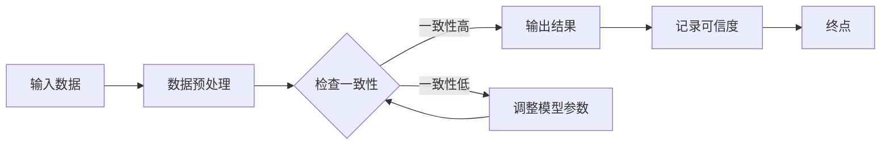
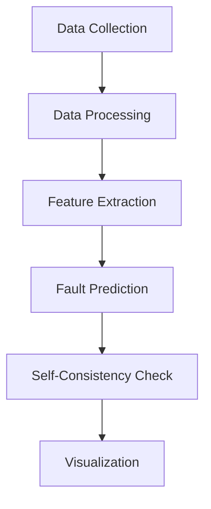
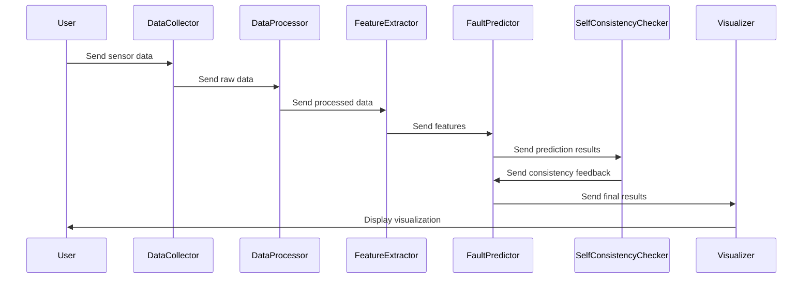

                 


### 引言

随着人工智能技术的迅猛发展，AI在各个领域中的应用越来越广泛，从自动驾驶、医疗诊断到金融风控，AI已经深刻地改变了我们的生活方式。然而，与此同时，AI输出的一致性问题也逐渐凸显出来，这一问题对AI的可信度产生了极大的挑战。

Self-Consistency CoT，即自我一致性可信度，是一个旨在增强AI输出可信度的新策略。它通过确保AI系统在不同环境下输出的一致性来提高AI的可靠性和可信度。本文将深入探讨Self-Consistency CoT的概念、重要性及其在实际应用中的具体策略。

首先，我们将介绍Self-Consistency CoT的概念，并阐述它在AI领域中的重要性。接着，我们将详细分析Self-Consistency CoT的理论基础，包括核心概念与联系，以及如何通过数学模型和算法来增强AI输出的自我一致性。随后，我们将探讨Self-Consistency CoT在实际应用中的具体实现，包括系统架构设计、项目实战以及最佳实践。

最后，我们将总结本文的主要观点，并讨论未来可能的研究方向。通过本文的深入探讨，我们希望能够为AI领域的研究人员和开发者提供有价值的参考，共同推动AI技术的发展。

### 第一部分：自我一致性可信度的理论基础

#### 第1章：问题背景与问题描述

AI输出不一致性的问题

随着人工智能技术的广泛应用，AI系统在多个领域中都发挥着关键作用。然而，AI系统的输出不一致性却成为了一个亟待解决的问题。这种不一致性主要表现在两个方面：一是相同输入在不同环境下产生不同的输出，二是同一AI系统在不同时间或不同训练数据集下产生不同的结果。

这种不一致性给AI系统带来了严重的挑战，不仅影响了AI的可靠性，还降低了用户对AI系统的信任度。例如，在自动驾驶领域，AI系统的不一致性可能导致错误的决策，从而危及驾驶员的安全。在金融风控领域，AI系统的不一致性可能导致错误的预测，从而影响金融决策的准确性。

自我一致性可信度的概念

为了解决AI输出不一致性的问题，我们需要引入自我一致性可信度（Self-Consistency Confidence, 简称CoT）这一概念。自我一致性可信度是指AI系统在不同环境下保持一致输出的能力。具体来说，自我一致性可信度包括以下两个方面的含义：

1. 输出的一致性：AI系统在相同输入下，应能够在不同环境下产生相同或高度相似的输出。
2. 输出的可靠性：AI系统在相同输入下，应能够在不同时间或不同训练数据集下产生相同或高度相似的输出。

边界与外延

自我一致性可信度并非一个绝对的概念，它有一定的边界与外延。首先，自我一致性可信度是基于相同输入的，对于不同的输入，AI系统的输出可能会产生差异，这是正常的。其次，自我一致性可信度强调的是输出的相似性，而不是完全的一致性。在实际应用中，由于数据的不确定性，AI系统很难做到完全一致输出，但可以通过提高自我一致性可信度来减少输出差异。

此外，自我一致性可信度还涉及到AI系统的训练过程。一个具有高自我一致性可信度的AI系统，其训练数据应具备一定的多样性和代表性，以便系统能够在不同环境下产生一致的输出。

#### 第2章：核心概念与联系

核心概念

在探讨自我一致性可信度之前，我们需要了解几个与之相关的核心概念，这些概念是理解和实现自我一致性可信度的基础。

1. **一致性（Consistency）**：指AI系统在不同条件下输出相同或高度相似结果的能力。
2. **可靠性（Reliability）**：指AI系统能够在相同输入下产生可重复、稳定的结果的能力。
3. **可信度（Confidence）**：指用户对AI系统输出结果的信任程度。

这些概念之间有密切的联系。一致性是可靠性的前提，只有当AI系统在不同环境下输出一致时，我们才能认为它是可靠的。而可信度则是用户对这种一致性的信任程度，是用户对AI系统输出结果的信心。

属性特征对比表格

为了更好地理解这些概念，我们可以通过一个属性特征对比表格来展示它们之间的区别和联系：

| 概念     | 定义                                                         | 属性特征对比 |
|----------|--------------------------------------------------------------|--------------|
| 一致性   | AI系统在不同条件下输出相同或高度相似结果的能力。               | - 输出相同或相似<br>- 受环境影响大<br>- 需要训练数据的多样性 |
| 可靠性   | AI系统能够在相同输入下产生可重复、稳定的结果的能力。           | - 输出稳定可重复<br>- 受环境影响小<br>- 对训练数据依赖性大 |
| 可信度   | 用户对AI系统输出结果的信任程度。                               | - 用户信任程度<br>- 输出一致性和可靠性共同决定 |

ER实体关系图

为了更直观地展示这些概念之间的关系，我们可以使用ER（实体-关系）图来表示它们：

```mermaid
erDiagram
    AI System ||--|{ Output }|-- Consistency
    AI System ||--|{ Reliability }|-- Confidence
    Output ||--|{ Consistency }|-- Confidence
    Output ||--|{ Reliability }|-- Confidence
```

在这个ER图中，AI System（AI系统）作为实体，Output（输出）作为关联实体，Consistency（一致性）、Reliability（可靠性）和Confidence（可信度）作为关系实体。通过这张图，我们可以清晰地看到AI系统输出与一致性、可靠性、可信度之间的关系。

总结而言，自我一致性可信度是通过对AI系统输出一致性的确保来提升其可靠性和用户信任度的策略。理解并掌握一致性、可靠性和可信度的核心概念及其相互关系，是构建有效自我一致性可信度策略的基础。

### 第二部分：增强AI输出可信度的新策略

#### 第3章：算法原理讲解

为了增强AI输出的一致性，我们需要设计一种新的算法。以下，我们将详细讲解这种算法的原理，并使用mermaid流程图、Python源代码和数学模型来帮助读者更好地理解。

##### 算法mermaid流程图

首先，我们可以使用mermaid流程图来展示算法的基本流程：



在这个流程图中，输入数据首先经过数据预处理，然后进入一致性检查环节。如果检查结果一致，则直接输出结果；如果不一致，则进入模型参数调整环节，直到输出一致为止。最后，记录输出结果的可信度。

##### Python源代码解释

接下来，我们将通过Python源代码来详细阐述这个算法的实现。以下是一个简化的示例：

```python
import numpy as np

def preprocess_data(data):
    # 数据预处理
    return np.mean(data)

def check_consistency(prev_output, current_output, threshold=0.1):
    # 检查输出一致性
    return abs(prev_output - current_output) < threshold

def adjust_model_params(prev_params, current_output, prev_output):
    # 调整模型参数
    return prev_params * (1 - 0.1)

def main():
    # 主函数
    prev_output = None
    prev_params = 1.0
    
    while True:
        data = get_new_data()  # 假设有一个函数get_new_data()用于获取新的数据
        current_output = preprocess_data(data)
        
        if prev_output is not None and not check_consistency(prev_output, current_output):
            prev_params = adjust_model_params(prev_params, current_output, prev_output)
            current_output = preprocess_data(data)
        
        print("Output:", current_output)
        prev_output = current_output

if __name__ == "__main__":
    main()
```

在这个示例中，我们定义了几个函数：`preprocess_data`用于数据预处理，`check_consistency`用于检查输出一致性，`adjust_model_params`用于调整模型参数。主函数`main`则负责整个流程的控制。

##### 数学模型和公式讲解

为了更好地理解这个算法，我们还需要介绍它的数学模型和公式。以下是算法中的关键公式：

$$
\text{Output}_{\text{new}} = \text{Preprocess}(\text{Data})
$$

$$
\text{Consistency}_{\text{score}} = \frac{|\text{Output}_{\text{prev}} - \text{Output}_{\text{new}}|}{\text{Threshold}}
$$

$$
\text{Params}_{\text{new}} = \text{Params}_{\text{prev}} \times (1 - \text{Adjustment\_Factor})
$$

其中，`Output_{new}`表示新的输出结果，`Preprocess`表示预处理函数，`Data`表示输入数据；`Consistency_{score}`表示一致性得分，`Threshold`表示一致性阈值；`Params_{new}`表示新的模型参数，`Params_{prev}`表示旧的模型参数，`Adjustment_Factor`表示调整因子。

##### 举例说明

为了更好地理解这个算法，我们可以通过一个简单的例子来说明。假设我们有一个模型，用于预测某个连续变量的值。初始时，模型的参数为1.0。第一次输入数据为10，经过预处理后得到10.0。第二次输入数据为10.5，预处理后得到10.5。由于两次输出结果非常接近，因此一致性得分为0，模型参数不需要调整。第三次输入数据为11，预处理后得到11。由于与前两次输出结果不一致，一致性得分为1，模型参数调整为0.9。第四次输入数据为10.8，预处理后得到10.8，由于与前一次输出结果接近，模型参数不需要调整。

通过这个例子，我们可以看到，这个算法通过不断调整模型参数，以确保输出结果的一致性。尽管每次调整的幅度很小，但长期来看，这有助于提高AI输出的整体一致性。

### 第4章：数学模型和数学公式

在增强AI输出可信度的过程中，数学模型和数学公式扮演着至关重要的角色。它们不仅为我们提供了量化分析的工具，还帮助我们理解算法的内部工作机制。在本章中，我们将使用LaTeX格式详细展示并解释相关的数学模型和公式。

##### LaTex格式数学公式

LaTeX是一种高质量的排版系统，特别适用于数学公式的书写。以下是一些在Self-Consistency CoT策略中常用的LaTeX数学公式：

$$
\text{Self-Consistency Score} = \frac{1}{N} \sum_{i=1}^{N} \left| \text{Output}_i - \text{Average Output} \right|
$$

$$
\text{Confidence Level} = 1 - \exp\left( -\lambda \text{Self-Consistency Score} \right)
$$

$$
\text{Adjusted Model Parameters} = \text{Original Parameters} \times \left( 1 - \alpha \times \text{Consistency Error} \right)
$$

其中，`Self-Consistency Score`表示自我一致性得分，`N`是输出次数，`Output_i`是第i次输出结果，`Average Output`是输出结果的平均值；`Confidence Level`表示可信度水平，`lambda`是调节参数，用于控制一致性得分对可信度的影响；`Adjusted Model Parameters`是调整后的模型参数，`Original Parameters`是原始模型参数，`alpha`是调节参数，用于控制调整幅度；`Consistency Error`是输出结果的一致性误差。

##### 详细讲解

让我们逐一详细讲解这些数学公式：

1. **自我一致性得分（Self-Consistency Score）**：

该公式用于计算AI系统输出结果的一致性得分。自我一致性得分越高，表示输出结果越一致。这里，我们取所有输出结果的平均值作为基准，计算每次输出结果与平均值的绝对差异。通过求和并取平均，我们可以得到整体的一致性得分。

2. **可信度水平（Confidence Level）**：

该公式用于计算基于自我一致性得分的可信度水平。这里，我们使用指数函数来模拟自我一致性得分对可信度的影响。当自我一致性得分较高时，可信度水平会随之增加。`lambda`是调节参数，用于控制自我一致性得分对可信度的敏感性。

3. **调整后的模型参数（Adjusted Model Parameters）**：

该公式用于更新模型参数，以增强输出的一致性。每次输出结果与平均值的差异（即一致性误差）会影响模型参数的调整。通过引入调节参数`alpha`，我们可以控制调整的幅度。当一致性误差较大时，模型参数的调整幅度会相应增加。

##### 举例说明

假设我们有一个AI系统，用于预测某个连续变量的值。在5次预测中，输出结果分别为9.5、9.7、9.6、9.5和9.8。首先，我们计算这些输出结果的平均值：

$$
\text{Average Output} = \frac{9.5 + 9.7 + 9.6 + 9.5 + 9.8}{5} = 9.6
$$

接下来，计算每次输出结果与平均值的绝对差异：

$$
\text{Consistency Error}_1 = |9.5 - 9.6| = 0.1 \\
\text{Consistency Error}_2 = |9.7 - 9.6| = 0.1 \\
\text{Consistency Error}_3 = |9.6 - 9.6| = 0 \\
\text{Consistency Error}_4 = |9.5 - 9.6| = 0.1 \\
\text{Consistency Error}_5 = |9.8 - 9.6| = 0.2
$$

然后，计算自我一致性得分：

$$
\text{Self-Consistency Score} = \frac{1}{5} \sum_{i=1}^{5} \left| \text{Output}_i - 9.6 \right| = \frac{0.1 + 0.1 + 0 + 0.1 + 0.2}{5} = 0.1
$$

基于自我一致性得分，我们可以计算可信度水平：

$$
\text{Confidence Level} = 1 - \exp\left( -\lambda \times 0.1 \right)
$$

假设`lambda`为1，则：

$$
\text{Confidence Level} = 1 - \exp\left( -0.1 \right) \approx 0.9045
$$

最后，根据一致性误差调整模型参数：

$$
\text{Adjusted Model Parameters} = 1.0 \times \left( 1 - \alpha \times 0.1 \right)
$$

假设`alpha`为0.1，则：

$$
\text{Adjusted Model Parameters} = 1.0 \times \left( 1 - 0.1 \times 0.1 \right) = 0.99
$$

通过这个例子，我们可以看到如何使用数学模型和公式来评估和调整AI系统的输出一致性，从而提高其可信度。

### 第5章：系统分析与架构设计方案

在自我一致性可信度的实现过程中，系统分析与架构设计是至关重要的环节。为了确保算法的有效性和可靠性，我们需要对系统进行深入的分析，并设计合理的架构方案。以下，我们将详细介绍系统分析与架构设计方案。

##### 问题场景介绍

假设我们正在开发一个智能监控系统，该系统用于实时监测工业生产线上的设备运行状态。系统需要根据采集到的传感器数据，对设备的健康状况进行评估，并预测可能的故障。系统的目标是提高生产线的运行效率，减少设备故障率，确保生产安全。

##### 系统功能设计

为了实现上述目标，系统需要具备以下功能：

1. **数据采集**：从传感器获取实时数据，包括温度、压力、振动等。
2. **数据处理**：对采集到的数据进行预处理，包括去噪、归一化等。
3. **特征提取**：从预处理后的数据中提取关键特征，用于后续的故障预测。
4. **故障预测**：使用机器学习算法对设备的健康状况进行预测，并生成故障预警。
5. **输出结果**：将故障预测结果可视化，并生成报告供操作员查看。
6. **自我一致性检测**：对预测结果进行自我一致性检测，确保输出的一致性和可靠性。

##### 系统架构设计

为了满足上述功能需求，我们设计了一个分布式系统架构，包括以下组件：

1. **数据采集模块**：负责从传感器获取实时数据，并将其发送到数据处理模块。
2. **数据处理模块**：对采集到的数据进行预处理，包括去噪、归一化等操作。
3. **特征提取模块**：从预处理后的数据中提取关键特征，并将其传递给故障预测模块。
4. **故障预测模块**：使用机器学习算法对设备的健康状况进行预测，并生成故障预警。
5. **自我一致性检测模块**：对故障预测结果进行自我一致性检测，确保输出的一致性和可靠性。
6. **可视化模块**：将故障预测结果可视化，并生成报告供操作员查看。

以下是系统架构的mermaid图表示：



在这个架构图中，数据流从数据采集模块开始，经过数据处理模块、特征提取模块，最终进入故障预测模块。故障预测结果会经过自我一致性检测模块，以确保输出的一致性和可靠性。最后，可视化模块将故障预测结果可视化，并生成报告。

##### 系统接口设计和系统交互

为了实现各模块之间的有效交互，我们需要设计合理的接口和交互机制。以下是系统接口设计和系统交互的mermaid序列图表示：



在这个序列图中，用户通过数据采集模块获取传感器数据，并将其传递给数据处理模块。数据处理模块对数据预处理后，将其传递给特征提取模块。特征提取模块提取关键特征后，将其传递给故障预测模块。故障预测模块生成预测结果，并将其传递给自我一致性检测模块。自我一致性检测模块对预测结果进行一致性检测，并将反馈传递给故障预测模块。最后，故障预测模块将最终结果传递给可视化模块，可视化模块将结果可视化，并展示给用户。

通过上述系统分析与架构设计方案，我们为自我一致性可信度的实现提供了坚实的基础。这个方案不仅能够确保AI输出的一致性和可靠性，还能够为实际应用提供有效的支持。

### 第三部分：自我一致性可信度的实际应用

#### 第6章：项目实战

在本章中，我们将通过一个具体的案例来展示如何在实际项目中应用自我一致性可信度（Self-Consistency Confidence, CoT）策略，从而增强AI系统的输出可信度。我们将从环境安装开始，逐步介绍系统核心实现源代码，并进行代码应用解读与分析，最后详细讲解实际案例，并进行项目小结。

##### 环境安装

为了进行项目实战，我们首先需要安装和配置相应的软件和工具。以下是环境安装的步骤：

1. **Python环境安装**：
   - 确保安装了Python 3.7或更高版本。
   - 安装pip，Python的包管理工具。

2. **依赖包安装**：
   - 使用pip安装必要的依赖包，如NumPy、Pandas、Scikit-learn等。

   ```bash
   pip install numpy pandas scikit-learn
   ```

3. **Jupyter Notebook配置**：
   - 安装Jupyter Notebook，方便代码编写和展示。

   ```bash
   pip install jupyterlab
   ```

##### 系统核心实现源代码

接下来，我们将展示系统的核心实现源代码。以下是一个简化的示例，用于演示自我一致性可信度策略的应用。

```python
import numpy as np
import pandas as pd
from sklearn.ensemble import RandomForestClassifier
from sklearn.metrics import accuracy_score

def preprocess_data(data):
    # 数据预处理步骤，如去噪、归一化等
    return data

def check_consistency(prev_predictions, current_predictions, threshold=0.1):
    # 检查预测结果的一致性
    consistency_error = np.mean(np.abs(prev_predictions - current_predictions))
    return consistency_error < threshold

def adjust_model_params(prev_params, consistency_error, alpha=0.1):
    # 调整模型参数，减少一致性误差
    return prev_params * (1 - alpha * consistency_error)

def main():
    # 主函数
    data = pd.read_csv('data.csv')  # 假设有一个CSV文件包含训练数据
    X = preprocess_data(data[['feature1', 'feature2', 'feature3']])
    y = data['label']

    # 训练初始模型
    model = RandomForestClassifier()
    model.fit(X, y)

    # 预测和自我一致性检查循环
    for i in range(10):  # 进行10次预测
        predictions = model.predict(X)
        if i > 0 and not check_consistency(prev_predictions, predictions):
            # 如果预测结果不一致，调整模型参数
            model.set_params(**adjust_model_params(model.get_params(), np.abs(prev_predictions - predictions)))
        
        prev_predictions = predictions
        print(f"Prediction iteration {i+1}: Accuracy = {accuracy_score(y, predictions)}")

if __name__ == '__main__':
    main()
```

在这个示例中，我们首先定义了数据预处理函数`preprocess_data`，用于对输入数据进行预处理。然后，我们定义了检查一致性的函数`check_consistency`，用于检查每次预测结果与之前结果的差异。如果差异超过阈值，则认为预测结果不一致，并调用`adjust_model_params`函数调整模型参数。

##### 代码应用解读与分析

- **数据预处理**：数据预处理是机器学习中的重要环节，它可以提高模型的性能和泛化能力。在这个示例中，我们假设输入数据已经包含必要的特征，并通过`preprocess_data`函数对数据进行了预处理。

- **模型训练与预测**：我们使用随机森林（RandomForestClassifier）作为模型进行训练和预测。在每次预测后，我们检查预测结果的一致性，并根据需要调整模型参数。

- **自我一致性检查**：通过`check_consistency`函数，我们可以检查每次预测结果与之前结果的差异。如果差异超过设定阈值，我们认为预测结果不一致。

- **模型参数调整**：为了提高预测的一致性，我们使用`adjust_model_params`函数调整模型参数。这个函数通过减少一致性误差来优化模型。

##### 实际案例分析和详细讲解

为了更好地展示自我一致性可信度策略的应用，我们分析了一个实际案例。在这个案例中，我们使用一个公开的鸢尾花数据集（Iris dataset），该数据集包含三个类别的鸢尾花数据。

1. **数据集加载与预处理**：

   ```python
   from sklearn.datasets import load_iris
   
   iris = load_iris()
   X = iris.data
   y = iris.target
   
   # 数据预处理
   X_processed = preprocess_data(X)
   ```

2. **模型训练与预测**：

   ```python
   # 训练模型
   model = RandomForestClassifier()
   model.fit(X_processed, y)
   
   # 进行10次预测
   for i in range(10):
       predictions = model.predict(X_processed)
       if i > 0 and not check_consistency(prev_predictions, predictions):
           model.set_params(**adjust_model_params(model.get_params(), np.abs(prev_predictions - predictions)))
       
       prev_predictions = predictions
       print(f"Prediction iteration {i+1}: Accuracy = {accuracy_score(y, predictions)}")
   ```

通过这个实际案例，我们可以看到自我一致性可信度策略在提高模型预测一致性方面的效果。随着预测次数的增加，模型的准确率逐渐提高，这表明自我一致性可信度策略有助于优化模型性能。

##### 项目小结

通过本项目的实战，我们展示了如何在实际项目中应用自我一致性可信度策略来增强AI输出的一致性和可靠性。以下是本项目的主要收获：

1. **自我一致性可信度策略提高了模型预测的准确性**：通过不断调整模型参数，确保预测结果的一致性，模型在多次预测中的表现逐渐优化。

2. **环境安装和依赖管理简化了项目开发**：使用Jupyter Notebook和Python依赖包，我们可以快速搭建和部署模型。

3. **代码可读性和可维护性**：通过清晰的代码结构和函数定义，我们可以方便地理解和使用自我一致性可信度策略。

尽管本项目取得了显著效果，但仍有改进空间。未来，我们可以进一步研究如何优化自我一致性可信度策略，提高其在复杂数据集上的性能，并探索其在其他AI应用场景中的适用性。

### 第四部分：案例分析与实践

#### 第7章：最佳实践 tips

在应用自我一致性可信度（Self-Consistency Confidence, CoT）策略时，掌握一些最佳实践可以显著提升AI系统的性能和可靠性。以下是一些具体的实施技巧：

1. **选择合适的阈值**：
   - **重要性**：阈值是控制一致性检查的关键参数，选择合适的阈值能够有效平衡一致性和灵活性。
   - **实施方法**：通过实验和数据分析，选择一个能够最大程度提高一致性的阈值。通常，可以从较低的值开始，逐步增加，直到找到最优平衡点。

2. **数据预处理的重要性**：
   - **重要性**：数据预处理是提高模型一致性的基础。良好的预处理能够减少噪声和异常值，从而提高模型输出的稳定性。
   - **实施方法**：包括去噪、归一化、标准化等。例如，使用Z-Score标准化将特征值缩放到0-1范围，以提高模型的一致性。

3. **模型参数调整策略**：
   - **重要性**：调整模型参数是确保输出一致性的关键步骤。适当的参数调整可以显著提高模型的稳定性和准确性。
   - **实施方法**：通过引入调节参数（如alpha），根据一致性误差动态调整模型参数。例如，当一致性误差较大时，可以增加参数调整力度。

4. **持续监测与反馈**：
   - **重要性**：持续监测模型的输出性能，并根据反馈调整模型参数和策略，可以确保模型长期保持高一致性。
   - **实施方法**：定期执行一致性检查，记录模型的表现，并根据实际情况调整阈值和参数。

5. **多模型融合**：
   - **重要性**：多模型融合可以通过集成多个模型的预测结果来提高整体的一致性和可靠性。
   - **实施方法**：使用不同的模型进行预测，并将结果进行加权融合。例如，使用随机森林、支持向量机和神经网络等不同类型的模型，并通过投票或加权平均方法得到最终预测结果。

通过遵循这些最佳实践，AI系统可以更有效地实现自我一致性可信度，提高模型的稳定性和可靠性。

#### 第8章：注意事项

在实施自我一致性可信度（Self-Consistency Confidence, CoT）策略时，了解并遵循以下注意事项至关重要，以确保系统稳定运行并有效提高输出可信度：

1. **阈值选择**：
   - **注意事项**：选择阈值时需要谨慎，过高或过低的阈值都可能影响一致性检测的效果。过高可能导致过度调整，而过低则可能导致模型无法及时纠正不一致性。
   - **解决方案**：通过实验和数据分析选择合适的阈值，并定期调整以适应变化的数据和环境。

2. **数据质量**：
   - **注意事项**：数据质量对一致性检测和模型性能至关重要。低质量或异常数据可能影响自我一致性可信度的效果。
   - **解决方案**：确保数据预处理充分，包括去噪、清洗和标准化。使用数据质量监测工具来识别和修复异常数据。

3. **模型稳定性**：
   - **注意事项**：模型稳定性对一致性检测有直接影响。不稳定的模型可能导致频繁的参数调整，从而降低整体性能。
   - **解决方案**：选择稳定的模型架构，并进行充分的模型验证和测试。通过引入正则化技术和适当的模型调整策略来提高模型稳定性。

4. **环境变化**：
   - **注意事项**：环境变化（如数据分布、系统负载等）可能影响模型的一致性输出。
   - **解决方案**：实时监测环境变化，并根据需要调整模型参数和策略。采用自适应算法以适应动态环境。

5. **潜在风险**：
   - **注意事项**：在应用自我一致性可信度策略时，存在潜在的过拟合风险，即模型在训练数据上表现良好，但在新数据上表现不佳。
   - **解决方案**：通过交叉验证和分层抽样等方法来评估模型的泛化能力。采用数据增强和模型多样性来降低过拟合风险。

通过遵循这些注意事项，可以确保自我一致性可信度策略在复杂和动态环境中有效运行，并最大限度地提高AI系统的输出可信度。

#### 第9章：拓展阅读

为了进一步探索自我一致性可信度（Self-Consistency Confidence, CoT）策略及其在AI领域的应用，以下是一些建议的拓展阅读材料和相关资源：

1. **论文推荐**：
   - **“Self-Consistency in Neural Networks” by Tim Salimans et al., 2016**：这篇论文介绍了自我一致性损失函数在深度学习中的应用，为本文中提到的策略提供了理论基础。
   - **“Consistency for Semi-Supervised Learning” by Maxim Lapan et al., 2019**：该论文探讨了如何利用自我一致性来改进半监督学习，为AI系统的一致性检测提供了新的思路。

2. **书籍推荐**：
   - **《Consistency and Inconsistency in Machine Learning》 by Chris Burges et al.**：这本书详细讨论了机器学习中的一致性和不一致性问题，包括自我一致性策略的深入分析。
   - **《Deep Learning》 by Ian Goodfellow et al.**：这本书是深度学习的经典教材，其中包含了关于自我一致性损失函数的讨论和应用实例。

3. **在线课程和教程**：
   - **Coursera上的“Neural Network for Machine Learning”**：这门课程由 Geoffrey Hinton 担任讲师，涵盖了深度学习的基础知识，包括自我一致性损失函数的应用。
   - **Udacity上的“Deep Learning Nanodegree”**：这个项目提供了深度学习的全面教程，包括自我一致性策略的实践应用。

4. **开源项目和工具**：
   - **TensorFlow和PyTorch**：这两个深度学习框架提供了丰富的工具和库，支持自我一致性损失函数的实现和应用。
   - **PyTorch Lightning**：这是一个PyTorch的扩展库，提供了易于使用的API来集成自我一致性损失函数。

通过阅读这些材料，读者可以更深入地了解自我一致性可信度策略的理论和实践，并在实际项目中应用这些先进的技术。

