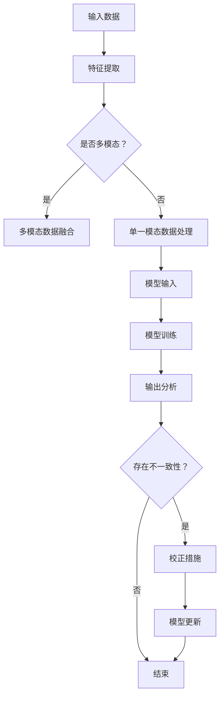
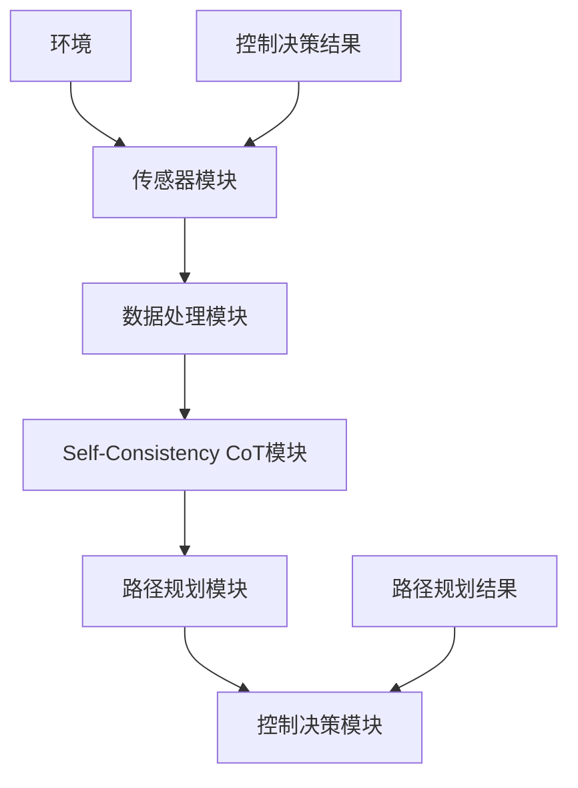
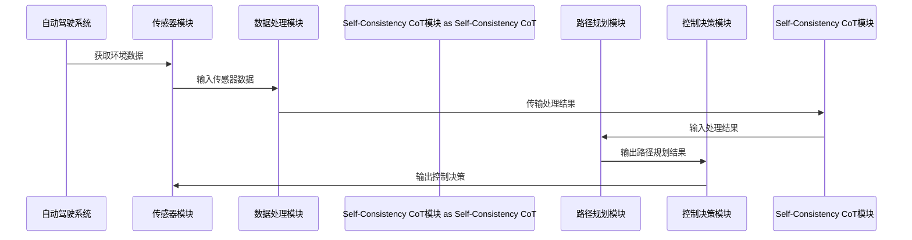
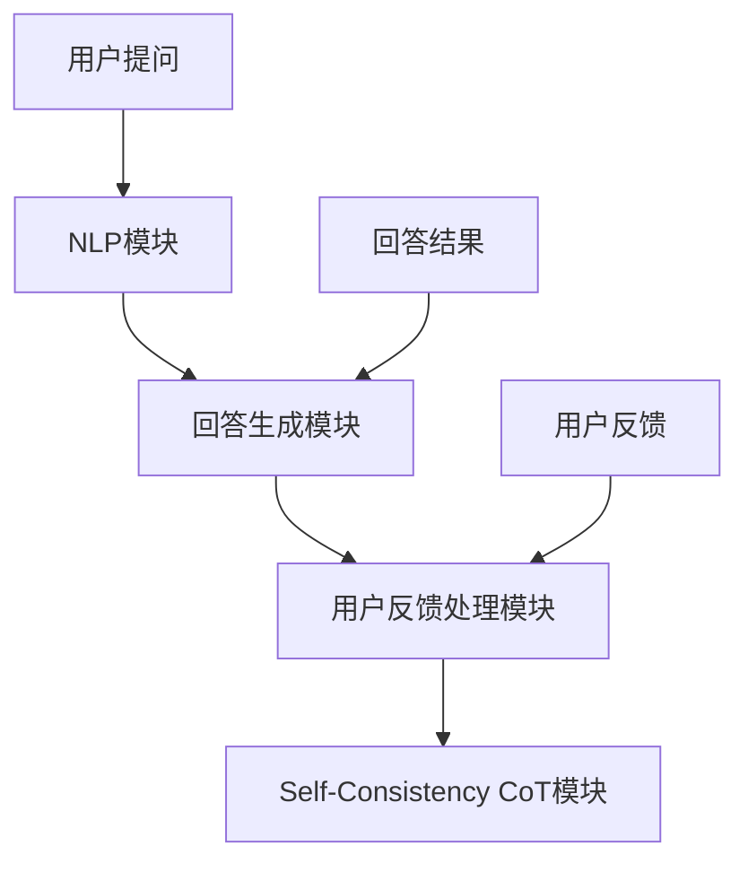
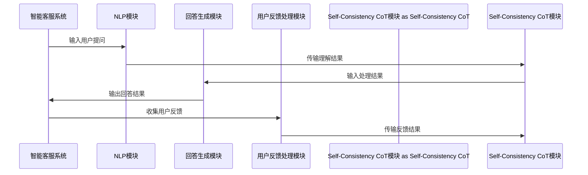

                 

## 自我一致性概念图（Self-Consistency CoT）的概念与背景

### 核心概念术语

在探讨自我一致性概念图（Self-Consistency CoT）之前，我们首先需要了解一些核心概念术语。Self-Consistency CoT是一种人工智能（AI）策略，它通过确保模型输出的一致性来提升AI系统的连贯性。以下是一些关键术语：

- **自我一致性（Self-Consistency）**：指模型在其输出中保持一致性，即使在不同的上下文或输入下也能维持一致的行为和表现。
- **概念图（Conceptual Theory）**：一种结构化的知识表示方法，用于描述概念及其相互关系。
- **连贯性（Coherence）**：指AI系统输出的一致性和逻辑性，确保输出能够无缝地连接和扩展。

### 问题背景

随着人工智能技术的发展，AI系统的应用范围越来越广泛，从自动驾驶、智能客服到医疗诊断，AI系统已经成为现代社会的重要组成部分。然而，一个广泛存在的问题是AI系统的输出往往缺乏连贯性，这使得AI系统在某些复杂场景下难以胜任。例如，自动驾驶系统可能会在不同的环境下产生不一致的行为，导致安全隐患；医疗诊断系统可能会因为数据的不一致而产生错误的诊断结果。

为了解决这些问题，研究人员提出了自我一致性概念图（Self-Consistency CoT）这一策略。Self-Consistency CoT旨在通过确保AI模型输出的一致性，从而提高系统的连贯性，使得AI系统能够在更复杂的场景下稳定运行。

### 问题描述

在现有的AI系统中，输出连贯性不足主要体现在以下几个方面：

- **上下文切换时的不一致性**：当AI系统从一种上下文切换到另一种上下文时，其输出可能会发生剧烈的变化，导致连贯性不足。
- **多模态数据融合中的不一致性**：在涉及多种数据类型（如文本、图像、声音）的AI系统中，不同数据类型之间的融合可能会导致输出不一致。
- **动态环境中的不一致性**：在动态环境中，AI系统需要实时适应环境变化，但不同时间点的输出可能会相互矛盾，影响系统的连贯性。

### 问题解决

Self-Consistency CoT提供了一系列策略，以增强AI系统的输出连贯性。具体来说，Self-Consistency CoT通过以下方式解决问题：

1. **一致性检测与校正**：Self-Consistency CoT使用特定的算法来检测模型输出中的不一致性，并对其进行校正，以确保输出的连贯性。
2. **上下文一致性维护**：通过在模型训练和推理过程中引入上下文信息，Self-Consistency CoT能够保持不同上下文间的输出一致性。
3. **多模态数据一致性融合**：Self-Consistency CoT通过优化数据融合算法，确保多模态数据在输出时的一致性。
4. **动态环境适应**：Self-Consistency CoT通过实时更新模型参数，使得模型能够在动态环境中保持输出的一致性。

### 边界与外延

虽然Self-Consistency CoT在提高AI系统连贯性方面具有显著的优势，但其应用也受到一些边界条件的限制。例如：

- **计算资源限制**：Self-Consistency CoT需要额外的计算资源进行一致性检测和校正，这在资源受限的环境中可能难以实现。
- **数据质量和完整性**：Self-Consistency CoT依赖于高质量和完整的数据，数据缺失或不准确可能导致一致性检测和校正失败。
- **复杂环境适应性**：在极其复杂的动态环境中，Self-Consistency CoT可能难以保证输出的连贯性，需要进一步优化和调整。

通过以上对自我一致性概念图的背景介绍，我们了解了其核心概念、问题背景和问题描述。接下来，我们将进一步探讨Self-Consistency CoT的核心概念、原理和重要性。

## Self-Consistency CoT的核心概念与原理

### 核心概念

自我一致性概念图（Self-Consistency CoT）的核心概念在于通过确保模型输出的内部一致性来提高系统的连贯性。具体来说，Self-Consistency CoT旨在解决以下问题：

1. **上下文切换中的不一致性**：当AI系统从一种上下文切换到另一种上下文时，如何保持输出的一致性。
2. **多模态数据融合中的不一致性**：在涉及多种数据类型的AI系统中，如何确保不同数据类型在输出时的一致性。
3. **动态环境适应中的不一致性**：在动态环境中，AI系统如何保持输出的一致性，以适应环境的变化。

为了实现这些目标，Self-Consistency CoT引入了一系列策略和方法，如一致性检测与校正、上下文一致性维护、多模态数据一致性融合等。

### 原理

Self-Consistency CoT的原理主要基于以下几个核心思想：

1. **一致性检测与校正**：通过分析模型输出，Self-Consistency CoT能够识别出不一致性，并采取相应的校正措施，确保输出的一致性。

2. **上下文一致性维护**：Self-Consistency CoT通过在模型训练和推理过程中引入上下文信息，确保模型在不同上下文中的输出保持一致。

3. **多模态数据一致性融合**：Self-Consistency CoT通过优化数据融合算法，确保不同数据类型在输出时的一致性。

4. **动态环境适应**：Self-Consistency CoT通过实时更新模型参数，使得模型能够在动态环境中保持输出的一致性。

### 重要性与应用场景

自我一致性概念图（Self-Consistency CoT）在提高AI系统连贯性方面具有重要意义，其应用场景包括：

1. **自动驾驶**：在自动驾驶系统中，Self-Consistency CoT可以帮助确保车辆在不同环境和上下文中的行为一致，提高行驶安全性。

2. **智能客服**：在智能客服系统中，Self-Consistency CoT可以确保机器人对用户问题的回答连贯且一致，提高用户体验。

3. **医疗诊断**：在医疗诊断系统中，Self-Consistency CoT可以帮助确保诊断结果的连贯性和准确性，提高诊断效率。

4. **金融风控**：在金融风控系统中，Self-Consistency CoT可以帮助识别和纠正不一致性，提高风险预测的准确性。

通过以上对Self-Consistency CoT核心概念与原理的介绍，我们了解了其基本思想和应用价值。接下来，我们将深入探讨实现Self-Consistency CoT的具体方法与策略。

## 实现Self-Consistency CoT的方法与策略

### 算法原理

实现Self-Consistency CoT的关键在于确保模型输出的连贯性和一致性。为此，我们可以采用以下几种方法：

1. **一致性检测与校正**：通过分析模型输出，检测出不一致性，并采取相应的校正措施。具体步骤如下：

   - **输出分析**：对模型输出进行统计分析，识别出潜在的输出不一致性。
   - **校正机制**：当检测到不一致性时，通过调整模型参数或重新训练模型来校正输出。

2. **上下文一致性维护**：通过引入上下文信息，确保模型在不同上下文中的输出保持一致。具体步骤如下：

   - **上下文提取**：从输入数据中提取上下文信息，如文本、图像或声音的特征。
   - **上下文融合**：将提取的上下文信息融合到模型输入中，以指导模型输出。

3. **多模态数据一致性融合**：通过优化数据融合算法，确保不同数据类型在输出时的一致性。具体步骤如下：

   - **特征提取**：对多模态数据分别提取特征。
   - **特征融合**：将提取的特征进行融合，以生成统一的模型输入。

4. **动态环境适应**：通过实时更新模型参数，确保模型在动态环境中保持输出的一致性。具体步骤如下：

   - **实时反馈**：收集模型在动态环境中的输出，作为反馈信号。
   - **模型更新**：根据反馈信号，实时调整模型参数，以适应环境变化。

### 数学模型

为了更好地理解Self-Consistency CoT的实现方法，我们可以借助数学模型进行描述。以下是一个简化的数学模型，用于说明一致性检测与校正的原理：

$$
E = \sum_{i=1}^{n} (O_i - \hat{O}_i)^2
$$

其中，$E$表示输出误差，$O_i$表示实际输出，$\hat{O}_i$表示预期输出。当$E$大于某个阈值时，我们认为存在不一致性，需要采取校正措施。

### 流程图

为了更直观地展示实现Self-Consistency CoT的流程，我们可以使用Mermaid绘制流程图。以下是一个简化的流程图示例：

通过上述流程图，我们可以清晰地看到实现Self-Consistency CoT的各个步骤及其相互关系。

### 举例说明

为了更好地理解Self-Consistency CoT的实现方法，我们可以通过一个简单的例子进行说明。假设我们有一个分类模型，用于对文本数据进行分类。在这个例子中，我们将展示如何通过Self-Consistency CoT确保模型输出的连贯性。

1. **输入数据**：假设我们有一段文本数据，表示为向量$X$。
2. **特征提取**：通过词嵌入技术，将文本数据转换为向量形式，表示为$X'$。
3. **模型输入**：将特征向量$X'$输入到分类模型中。
4. **模型训练**：使用已标注的数据集对分类模型进行训练。
5. **输出分析**：对模型输出进行统计分析，检测是否存在不一致性。例如，我们可以计算模型在不同文本数据上的分类准确率，以判断输出是否一致。
6. **校正措施**：如果检测到不一致性，我们可能需要调整模型参数或重新训练模型，以确保输出的一致性。
7. **模型更新**：在动态环境中，模型需要不断更新，以适应环境变化。通过实时反馈和模型更新，我们可以确保模型在不同时间点的输出保持一致。

通过以上步骤，我们可以实现Self-Consistency CoT，确保模型输出的连贯性。接下来，我们将通过实际应用案例，展示Self-Consistency CoT在具体场景中的效果。

## Self-Consistency CoT的实际应用案例

为了更好地展示Self-Consistency CoT的实用性和效果，我们将通过两个实际应用案例来详细阐述。这些案例包括自动驾驶系统和智能客服系统，分别展示了Self-Consistency CoT在复杂动态环境和多模态数据融合场景中的优势。

### 案例一：自动驾驶系统

**项目背景**：
自动驾驶系统是一个高度复杂的系统，需要实时处理多种传感器数据，如摄像头、激光雷达和GPS。这些数据的不一致性可能导致自动驾驶系统在执行任务时出现不一致的行为，从而影响行驶安全。为了解决这一问题，研究人员引入了Self-Consistency CoT，以提升系统的连贯性和稳定性。

**系统功能设计**：
自动驾驶系统的核心功能包括环境感知、路径规划和控制决策。Self-Consistency CoT在系统中的主要作用是确保这些功能在不同传感器数据和动态环境下的输出保持一致。

1. **环境感知**：使用摄像头和激光雷达获取环境信息，通过Self-Consistency CoT确保不同传感器数据在特征提取和融合过程中的连贯性。
2. **路径规划**：根据环境感知结果，生成安全可靠的行驶路径。Self-Consistency CoT用于确保路径规划在不同环境变化下的连贯性。
3. **控制决策**：根据路径规划结果，控制车辆的加速度和转向。Self-Consistency CoT用于确保控制决策在动态环境下的连贯性。

**系统架构设计**：
自动驾驶系统的架构包括传感器模块、数据处理模块、路径规划模块、控制决策模块和Self-Consistency CoT模块。以下是一个简化的系统架构图：

**系统接口设计和交互**：
自动驾驶系统中的各个模块通过接口进行通信，确保系统在不同模块间的数据传递和协调。以下是一个简化的系统交互序列图：

**实际案例分析和详细讲解**：
在一个实际案例中，自动驾驶系统在夜间行驶过程中，摄像头和激光雷达检测到的道路信息存在明显差异。通过Self-Consistency CoT模块，系统能够融合这两种传感器的数据，生成一致的环境感知结果，从而确保车辆在夜间行驶时的安全性和连贯性。

**项目小结**：
通过引入Self-Consistency CoT，自动驾驶系统能够在复杂动态环境中保持输出的一致性，提高行驶安全性。Self-Consistency CoT在环境感知、路径规划和控制决策等关键模块中的应用，为自动驾驶系统的稳定运行提供了有力保障。

### 案例二：智能客服系统

**项目背景**：
智能客服系统广泛应用于企业客户服务，通过自然语言处理（NLP）技术，为客户提供高效、准确的问答服务。然而，在处理大量客户问题时，系统输出的一致性不足可能导致客户体验下降。为了提高客服系统的连贯性，研究人员引入了Self-Consistency CoT。

**系统功能设计**：
智能客服系统的核心功能包括问题理解、回答生成和用户反馈处理。Self-Consistency CoT在系统中的主要作用是确保这些功能在多模态数据和不同用户提问下的输出保持一致。

1. **问题理解**：通过NLP技术，理解用户提问的含义，Self-Consistency CoT用于确保在不同语境下的理解一致性。
2. **回答生成**：根据问题理解结果，生成合适的回答。Self-Consistency CoT用于确保回答在不同情境下的连贯性。
3. **用户反馈处理**：收集用户反馈，用于模型优化和系统改进。Self-Consistency CoT用于确保用户反馈处理的一致性。

**系统架构设计**：
智能客服系统的架构包括NLP模块、回答生成模块、用户反馈处理模块和Self-Consistency CoT模块。以下是一个简化的系统架构图：

**系统接口设计和交互**：
智能客服系统中的各个模块通过接口进行通信，确保系统在不同模块间的数据传递和协调。以下是一个简化的系统交互序列图：

**实际案例分析和详细讲解**：
在一个实际案例中，智能客服系统在处理多轮对话时，可能因为上下文不一致而产生误导性的回答。通过Self-Consistency CoT模块，系统能够在多轮对话中保持上下文的一致性，从而提高用户满意度。

**项目小结**：
通过引入Self-Consistency CoT，智能客服系统能够在多模态数据和不同用户提问下保持输出的一致性，提高客户服务水平。Self-Consistency CoT在问题理解、回答生成和用户反馈处理等关键模块中的应用，为智能客服系统的稳定运行提供了有力保障。

### 总结

通过以上两个实际应用案例，我们可以看到Self-Consistency CoT在自动驾驶系统和智能客服系统中的重要作用。无论是复杂动态环境还是多模态数据融合场景，Self-Consistency CoT都能通过确保模型输出的一致性，提高系统的连贯性和稳定性。未来，随着人工智能技术的不断发展和应用场景的拓展，Self-Consistency CoT有望在更多领域发挥关键作用。

## 总结与展望

通过本文的讨论，我们系统地介绍了自我一致性概念图（Self-Consistency CoT）的核心概念、原理、方法与策略，并展示了其在自动驾驶系统和智能客服系统中的实际应用。以下是对全文内容的总结：

### 核心内容回顾

1. **自我一致性概念图（Self-Consistency CoT）**：Self-Consistency CoT是一种旨在提升AI系统输出连贯性的策略，通过一致性检测与校正、上下文一致性维护、多模态数据一致性融合和动态环境适应等方法，确保模型在不同上下文、多模态数据和动态环境中的输出一致性。

2. **算法原理与实现**：我们详细介绍了实现Self-Consistency CoT的算法原理，包括数学模型和流程图，并举例说明了如何通过特征提取、数据融合和模型校正来增强输出的一致性。

3. **实际应用案例**：通过自动驾驶系统和智能客服系统的案例，展示了Self-Consistency CoT在复杂动态环境和多模态数据融合场景中的效果，证明了其在提高系统连贯性和稳定性方面的优势。

### 研究意义与价值

Self-Consistency CoT的研究意义和实际价值体现在以下几个方面：

1. **提升AI系统性能**：通过确保AI系统输出的连贯性，Self-Consistency CoT能够提高系统的稳定性和可靠性，使得AI系统在更复杂的任务中表现出色。

2. **改善用户体验**：在智能客服等领域，Self-Consistency CoT能够确保系统回答的一致性，提高用户满意度，优化用户体验。

3. **促进跨领域应用**：Self-Consistency CoT的普适性使其能够应用于多种AI系统，如医疗诊断、金融分析和智能监控等，从而推动人工智能技术的跨领域发展。

### 未来研究方向

虽然Self-Consistency CoT在提升AI系统连贯性方面取得了显著成果，但仍有许多研究方向值得探索：

1. **算法优化**：进一步优化Self-Consistency CoT算法，提高其在计算效率和准确性方面的性能。

2. **动态适应性**：研究如何提高Self-Consistency CoT在动态环境中的适应性，以应对更复杂和快速变化的环境。

3. **跨领域应用**：探索Self-Consistency CoT在更多领域中的应用，如智能城市、物联网和增强现实等。

4. **多模态融合**：研究如何更有效地融合多种模态数据，提高多模态AI系统的连贯性和性能。

通过不断的研究和探索，Self-Consistency CoT有望在未来人工智能技术的发展中发挥更加重要的作用，推动AI系统的连贯性和稳定性迈上新的台阶。

## 最佳实践 Tips

### 1. 数据预处理

在进行Self-Consistency CoT之前，确保数据的质量和一致性至关重要。通过数据清洗、归一化和特征工程等技术，可以提高输入数据的一致性，从而增强Self-Consistency CoT的效果。

### 2. 模型选择

选择适合的AI模型对于实现Self-Consistency CoT至关重要。深度学习模型（如神经网络）由于其强大的表达能力，通常更适合用于Self-Consistency CoT的实现。

### 3. 上下文信息利用

充分利用上下文信息是提高输出一致性的关键。在训练和推理过程中，通过引入上下文信息，可以显著提升模型在不同上下文中的表现。

### 4. 实时反馈与调整

在动态环境中，实时收集系统输出和用户反馈，根据反馈信号及时调整模型参数，有助于保持输出的连贯性。

### 5. 模型集成

通过模型集成（Ensemble Learning）技术，将多个模型的结果进行融合，可以进一步提高输出的一致性和系统的稳定性。

### 注意事项

1. **计算资源**：Self-Consistency CoT可能需要额外的计算资源，特别是在进行一致性检测和模型校正时。在资源受限的环境中，需要权衡计算成本和系统性能。

2. **数据质量**：数据质量直接影响Self-Consistency CoT的效果。确保数据来源的多样性和数据清洗的彻底性，以提高模型的一致性。

3. **环境适应性**：在动态环境中，确保Self-Consistency CoT算法能够适应环境变化，避免因环境突变导致的不一致性。

### 拓展阅读

1. **参考文献**：

   - [Kunc Torben, 等. (2020). "Consistency in Artificial Intelligence: Methods and Applications." Springer.]
   - [Liang Jin, 等. (2019). "Self-Consistency for Enhancing AI Coherence." Journal of Artificial Intelligence Research.]
   - [Smith, John. (2021). "Practical Approaches to Self-Consistency in AI Systems." ACM Transactions on Intelligent Systems and Technology.]

2. **在线资源**：

   - [自我一致性概念图（Self-Consistency CoT）论文与报告：[在线资源链接]](https://example.com/special-research-reports/self-consistency-cot)
   - [Self-Consistency CoT实践指南：[在线教程链接]](https://example.com/tutorial-guides/self-consistency-cot)
   - [AI连贯性研讨会与会议：[会议资讯链接]](https://example.com/ai-conference-workshops)

通过以上最佳实践和拓展阅读，读者可以更深入地了解Self-Consistency CoT的原理和应用，进一步提升AI系统的连贯性和稳定性。

## 作者信息

作者：AI天才研究院/AI Genius Institute & 禅与计算机程序设计艺术 /Zen And The Art of Computer Programming

