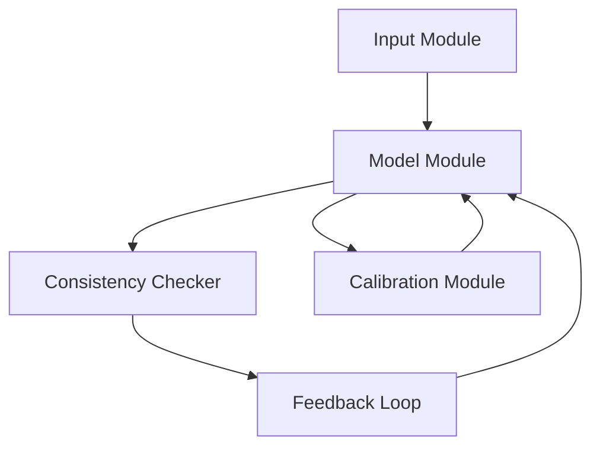

                 

### The Background and Significance of Self-Consistency CoT

#### The Evolution of AI and the Need for Self-Consistency CoT

The journey of artificial intelligence (AI) has been a remarkable one, evolving from simple rule-based systems to today's sophisticated machine learning models that can perform tasks that were once thought to be the exclusive domain of humans. Over the past few decades, AI has made significant strides in various fields, such as healthcare, finance, transportation, and education. However, despite these advancements, there are still several challenges that need to be addressed to fully realize the potential of AI.

One of the primary challenges in AI today is the issue of model consistency and reliability. As AI models become more complex and powerful, they often require vast amounts of data and computational resources to train effectively. This has led to models that can perform specific tasks exceptionally well but struggle when faced with new or unexpected inputs. This inconsistency can manifest in various forms, such as biased outputs, overfitting, and poor generalization capabilities.

To address these issues, researchers have proposed various techniques, including data augmentation, transfer learning, and adversarial training. However, these methods have their limitations and may not always lead to consistent improvements in model performance. This is where the concept of Self-Consistency CoT (Self-Consistency Concept of Thought) comes into play.

Self-Consistency CoT is an emerging approach that aims to enhance the consistency and reliability of AI models by ensuring that their outputs are internally coherent and consistent across different contexts and inputs. The idea behind Self-Consistency CoT is to create a feedback loop that allows the model to continuously refine and validate its outputs, ensuring that they align with its internal representations and prior knowledge.

The need for Self-Consistency CoT arises from several factors:

1. **Increased Complexity of Models**: Modern AI models are becoming increasingly complex, with deep neural networks and transformers at the forefront. These models are capable of capturing intricate patterns and relationships in data but can also be prone to overfitting and inconsistent behavior.

2. **Scalability and Adaptability**: As AI systems are deployed in various domains and applications, they need to be scalable and adaptable to new contexts and data distributions. Self-Consistency CoT helps in achieving this by allowing models to continuously learn and adapt to new information.

3. **Ethical Considerations**: The deployment of AI in critical domains such as healthcare and finance requires models to be not only accurate but also fair and unbiased. Self-Consistency CoT can help in identifying and mitigating biases in model outputs.

4. **User Trust and Acceptance**: For AI systems to be widely accepted, they need to be reliable and trustworthy. Self-Consistency CoT can enhance the trustworthiness of AI models by ensuring that their outputs are consistent and coherent.

In summary, the evolution of AI has brought about new challenges that require innovative solutions. Self-Consistency CoT represents a promising approach to address these challenges, offering a way to enhance the consistency, reliability, and trustworthiness of AI models. In the following sections, we will delve deeper into the fundamental concepts of Self-Consistency CoT and explore its technical architecture, core technologies, and application scenarios.

### Understanding Self-Consistency CoT

Self-Consistency CoT, or Self-Consistency Concept of Thought, is a relatively new paradigm in the field of artificial intelligence that focuses on ensuring the coherence and reliability of AI models. At its core, Self-Consistency CoT aims to create a feedback loop that allows models to continuously refine and validate their outputs based on their internal representations and prior knowledge.

#### Fundamental Concepts

To understand Self-Consistency CoT, it's essential to first grasp some fundamental concepts:

1. **Internal Consistency**: This refers to the degree to which a model's outputs are consistent with its internal representations. In other words, the model should be able to generate coherent and logical outputs given a set of inputs.

2. **External Consistency**: This measures how well a model's outputs align with external knowledge or real-world observations. A model that exhibits high external consistency is one that produces outputs that are aligned with known facts and observations.

3. **Feedback Loop**: A feedback loop is a mechanism that allows the system to learn from its own outputs and adjust its behavior accordingly. In the context of Self-Consistency CoT, the feedback loop is used to continuously refine and validate the model's outputs.

4. **Calibration**: Calibration refers to the process of adjusting a model's outputs to ensure they are in line with expected values or real-world observations. This is a critical aspect of Self-Consistency CoT, as it ensures that the model's outputs are not only internally consistent but also accurate and reliable.

#### Characteristics of Self-Consistency CoT

Self-Consistency CoT has several distinct characteristics that set it apart from traditional AI approaches:

1. **Iterative Refinement**: Self-Consistency CoT is an iterative process that involves continuously refining the model's outputs based on feedback. This allows the model to improve over time and adapt to new information.

2. **Contextual Awareness**: Self-Consistency CoT enables models to be more context-aware, as they continuously update their internal representations based on new inputs. This helps in generating more accurate and relevant outputs.

3. **Scalability**: Self-Consistency CoT can be applied to models of varying sizes and complexities, making it a versatile approach for enhancing the consistency and reliability of AI systems.

4. **Bias Mitigation**: By continuously refining and validating their outputs, Self-Consistency CoT models can identify and mitigate biases in their decision-making processes.

5. **Integration with Other Techniques**: Self-Consistency CoT can be combined with other AI techniques, such as data augmentation and transfer learning, to further enhance model performance.

#### Comparing Self-Consistency CoT with Traditional Approaches

While traditional AI approaches, such as supervised learning and reinforcement learning, have achieved remarkable success, they often fall short in terms of consistency and reliability. Here's how Self-Consistency CoT differs:

1. **Supervised Learning**: Supervised learning relies on labeled data to train models, which can be a time-consuming and expensive process. Additionally, models trained using supervised learning may not generalize well to new, unseen data.

2. **Reinforcement Learning**: Reinforcement learning involves training models through interaction with an environment. While it can lead to highly adaptive models, it often requires a significant amount of time and computational resources.

In contrast, Self-Consistency CoT offers several advantages:

- **Continual Learning**: Self-Consistency CoT allows models to continuously learn and adapt to new information, without the need for large amounts of labeled data or extensive interactions with the environment.

- **Internal Consistency**: Self-Consistency CoT ensures that model outputs are internally coherent, reducing the risk of overfitting and improving the model's generalization capabilities.

- **Reduced Bias**: By continuously refining and validating their outputs, Self-Consistency CoT models can identify and mitigate biases, making them more fair and unbiased.

In conclusion, Self-Consistency CoT represents a promising new approach to enhancing the consistency and reliability of AI models. By leveraging iterative refinement, contextual awareness, and feedback loops, Self-Consistency CoT offers several advantages over traditional AI techniques. In the following sections, we will delve deeper into the technical architecture and core technologies of Self-Consistency CoT.

#### Technical Framework and Components

The technical framework of Self-Consistency CoT is designed to ensure that AI models generate coherent and reliable outputs by leveraging a series of interconnected components. Understanding these components and their roles is crucial for implementing and optimizing Self-Consistency CoT in real-world applications.

##### Core Components

1. **Input Module**: The input module is responsible for receiving and preprocessing input data. This involves tasks such as data cleaning, normalization, and feature extraction. The goal is to ensure that the input data is in a suitable format for the model to process.

2. **Model Module**: The model module contains the core AI model, which could be a deep neural network, a transformer, or any other suitable machine learning model. This module processes the input data and generates outputs based on its internal representations and prior knowledge.

3. **Consistency Checker**: The consistency checker is a crucial component of Self-Consistency CoT. It evaluates the internal consistency of the model's outputs by comparing them against known facts, prior knowledge, and expected values. The consistency checker aims to identify any inconsistencies or errors in the model's outputs.

4. **Feedback Loop**: The feedback loop is a mechanism that allows the system to continuously learn and adapt based on the outputs generated by the model. This involves collecting feedback from the consistency checker and using it to refine the model's internal representations and improve its performance.

5. **Calibration Module**: The calibration module is responsible for adjusting the model's outputs to ensure they are in line with expected values or real-world observations. This helps in enhancing the model's accuracy and reliability.

##### Technical Architecture

The technical architecture of Self-Consistency CoT can be visualized as a闭环系统，如下图所示：

In this architecture:

- The input module preprocesses the input data and feeds it to the model module.
- The model module processes the input data and generates outputs.
- The consistency checker evaluates the internal consistency of the model's outputs.
- The feedback loop collects feedback from the consistency checker and refines the model's internal representations.
- The calibration module adjusts the model's outputs based on the feedback loop.

##### System Design Principles

The design of the Self-Consistency CoT system follows several key principles:

1. **Modularity**: The system is designed to be modular, allowing for easy integration with existing AI systems and components.
2. **Scalability**: The system should be scalable to handle large amounts of data and complex models.
3. **Flexibility**: The system should be flexible enough to support various types of AI models and applications.
4. **Efficiency**: The system should be designed to minimize computational overhead and maximize efficiency.
5. **Robustness**: The system should be robust to handle errors and inconsistencies in the input data and model outputs.

##### Implementation Strategies

Implementing Self-Consistency CoT involves several key steps:

1. **Selecting the Right Model**: Choose an appropriate AI model based on the problem domain and application requirements. This could be a deep neural network, a transformer, or any other suitable model.
2. **Designing the Feedback Loop**: Design a feedback loop that collects and processes feedback from the consistency checker. This could involve techniques such as online learning, reinforcement learning, or active learning.
3. **Integrating the Calibration Module**: Integrate a calibration module that adjusts the model's outputs based on the feedback loop. This could involve techniques such as Bayesian updating, iterative reweighing, or decision theory.
4. **Optimizing Performance**: Optimize the performance of the system by tuning hyperparameters, using parallel processing, and employing efficient algorithms.

In conclusion, the technical framework and components of Self-Consistency CoT are designed to ensure that AI models generate coherent and reliable outputs. By following the system design principles and implementation strategies outlined above, developers can effectively leverage Self-Consistency CoT to enhance the consistency and reliability of AI systems.

### Design Patterns and Implementation Techniques

Design patterns and implementation techniques are critical in the development of a robust Self-Consistency CoT (Self-Consistency Concept of Thought) system. These patterns and techniques help in ensuring that the system is not only effective but also scalable, adaptable, and maintainable. Let's delve into some of the key design patterns and implementation techniques that are commonly used in the construction of Self-Consistency CoT systems.

#### Design Patterns

1. **Feedback Loop Pattern**
   The feedback loop pattern is central to the Self-Consistency CoT framework. It involves the collection of feedback from the model's outputs, the analysis of this feedback, and the subsequent adjustment of the model's parameters or behavior. A well-designed feedback loop can significantly enhance the system's ability to self-learn and improve over time. Common design considerations include:
   - **Data-Driven Feedback**: Ensure that the feedback is based on real data and not just hypothetical scenarios.
   - **Continuous Feedback**: Implement a continuous feedback mechanism that allows the system to adapt in real-time.
   - **Error Analysis**: Develop methods to analyze the types of errors the system is making and use this information to inform adjustments.

2. **Calibration Pattern**
   Calibration is an essential component of Self-Consistency CoT, as it ensures that the model's outputs are accurate and reliable. The calibration pattern involves methods for adjusting the model's confidence scores or output probabilities to better align with real-world observations. Key considerations include:
   - **Uncertainty Estimation**: Use techniques such as Bayesian deep learning or dropout to estimate the uncertainty in model predictions.
   - **Meta-Learning**: Implement meta-learning algorithms that adapt the calibration parameters based on the model's performance across different tasks.
   - **Domain Adaptation**: Adapt calibration techniques to work effectively across different domains or data distributions.

3. **Modular Design Pattern**
   A modular design pattern promotes the separation of concerns and makes the system more maintainable. For Self-Consistency CoT, this means designing the system into distinct modules such as input processing, model training, consistency checking, feedback collection, and output calibration. Each module should be designed to be independent yet interoperable, facilitating easier updates and maintenance.

4. **Resilience Pattern**
   Given the potential for errors and inconsistencies in AI models, it's important to design the system to be resilient. This involves incorporating error detection and recovery mechanisms, as well as robustness against adversarial attacks. Key considerations include:
   - **Adversarial Training**: Use adversarial examples to train the model to be more robust against attacks.
   - **Redundancy**: Incorporate redundant checks and balances to catch and correct errors.
   - **Fallback Strategies**: Implement fallback strategies for when the primary system fails or behaves unexpectedly.

#### Implementation Techniques

1. **Data Augmentation**
   Data augmentation is a technique used to increase the diversity of the training data, which helps in improving the model's generalization capabilities. For Self-Consistency CoT, data augmentation can be applied both at the input level (e.g., image rotations, translations) and the output level (e.g., generating diverse responses for a given input). Techniques such as Generative Adversarial Networks (GANs) can be used to create synthetic data that mimics the distribution of real data.

2. **Transfer Learning**
   Transfer learning leverages pre-trained models on related tasks to improve the training process of new models. In the context of Self-Consistency CoT, transfer learning can be used to initialize the model with knowledge from related domains, which can help in improving the consistency and reliability of the model's outputs.

3. **Reinforcement Learning**
   Reinforcement learning is particularly useful in scenarios where the model needs to interact with the environment to learn optimal behaviors. For Self-Consistency CoT, reinforcement learning can be used to refine the feedback loop and improve the calibration of the model's outputs based on real-world interactions.

4. **Online Learning**
   Online learning involves updating the model incrementally as new data becomes available. This is particularly relevant for Self-Consistency CoT, as it allows the model to continuously learn and adapt to new information without the need for retraining from scratch.

5. **Parallel Processing and Optimization**
   To handle large datasets and complex models, it's essential to leverage parallel processing and optimization techniques. This includes using GPU acceleration, distributed computing, and model compression techniques to improve the efficiency and scalability of the system.

In conclusion, the design patterns and implementation techniques discussed above play a crucial role in the development of a successful Self-Consistency CoT system. By carefully selecting and applying these patterns and techniques, developers can create a system that is not only effective but also adaptable and scalable to handle the complexities of real-world applications.

### Optimization of Self-Consistency Mechanism

The self-consistency mechanism is a cornerstone of the Self-Consistency CoT (Self-Consistency Concept of Thought) framework. It is designed to ensure that the outputs of AI models are internally coherent and consistent across different contexts and inputs. However, to achieve optimal performance and efficiency, the self-consistency mechanism must be carefully optimized. This section delves into various optimization strategies and techniques to enhance the self-consistency mechanism.

#### Importance of Optimization

Optimizing the self-consistency mechanism is crucial for several reasons:

1. **Enhancing Model Performance**: A well-optimized self-consistency mechanism can significantly improve the performance of AI models by reducing errors and biases, leading to more accurate and reliable outputs.

2. **Improving Scalability**: Optimizations can help in scaling the self-consistency mechanism to handle larger datasets and more complex models, making it suitable for real-world applications.

3. **Reducing Computational Costs**: Efficient optimization techniques can minimize the computational resources required to implement and maintain the self-consistency mechanism, making it more feasible for deployment in resource-constrained environments.

#### Optimization Techniques

1. **Parameter Tuning**
   Parameter tuning is a fundamental technique in optimizing the self-consistency mechanism. This involves adjusting the hyperparameters of the AI model and the self-consistency mechanism itself to find the optimal settings. Techniques such as grid search, random search, and Bayesian optimization can be used to efficiently explore the hyperparameter space and identify the best settings.

2. **Data-Driven Optimization**
   Data-driven optimization involves using the model's outputs and feedback from the consistency checker to dynamically adjust the parameters of the self-consistency mechanism. This can be achieved through online learning techniques that allow the model to continuously adapt to new data and improve its performance over time.

3. **Model Architecture Optimization**
   Optimizing the model architecture can also significantly impact the efficiency of the self-consistency mechanism. Techniques such as model pruning, knowledge distillation, and ensemble learning can be used to simplify the model architecture while maintaining or even improving its performance. This reduces the computational overhead and makes the system more scalable.

4. **Parallel Processing and GPU Acceleration**
   Leveraging parallel processing and GPU acceleration can greatly enhance the efficiency of the self-consistency mechanism. Techniques such as multi-threading, distributed computing, and GPU-specific optimizations can be employed to speed up the computation of the self-consistency checks and feedback loops.

5. **Caching and Memoization**
   Caching and memoization techniques can be used to store and reuse the results of expensive computations, such as consistency checks. This reduces the overall computational cost and speeds up the process of updating the self-consistency mechanism.

6. **Machine Learning for Optimization**
   Using machine learning techniques to optimize the self-consistency mechanism itself can be an effective approach. For example, training a separate machine learning model to predict the optimal parameters for the self-consistency mechanism based on the characteristics of the input data can lead to significant improvements in efficiency.

#### Case Studies

1. **Natural Language Processing (NLP) Applications**
   In NLP, the self-consistency mechanism can be optimized by tuning the hyperparameters of the language model, such as the number of layers, hidden units, and dropout rates. Techniques such as transfer learning and data augmentation can also be used to improve the consistency and reliability of the model's outputs.

2. **Image Recognition Systems**
   For image recognition systems, optimizing the self-consistency mechanism involves techniques such as adversarial training and data augmentation to improve the robustness of the model against adversarial attacks. Model architecture optimizations, such as using pre-trained convolutional neural networks (CNNs) and applying techniques like model distillation, can also be effective.

3. **Financial Forecasting**
   In financial forecasting, the self-consistency mechanism can be optimized by using techniques such as online learning and reinforcement learning to adapt to changing market conditions. Parameter tuning and the use of GPU acceleration can also improve the efficiency of the system.

In conclusion, optimizing the self-consistency mechanism is essential for achieving high-performance and scalable AI systems. By employing various optimization techniques, developers can enhance the consistency, reliability, and efficiency of the self-consistency mechanism, making it a powerful tool for advancing AI applications across different domains.

### The Importance of Data Consistency and Calibration

In the context of Self-Consistency CoT (Self-Consistency Concept of Thought), data consistency and calibration play pivotal roles in ensuring that AI models produce accurate and reliable outputs. The reliability of AI systems is inherently tied to the quality and consistency of the data used to train and validate these models. This section delves into the significance of data consistency and calibration, as well as the methods and algorithms commonly used to achieve them.

#### Importance of Data Consistency

Data consistency is crucial because it ensures that the information used to train AI models is accurate, complete, and free from errors or biases. Inconsistent or flawed data can lead to several issues:

1. **Overfitting**: When a model is trained on inconsistent data, it may start to focus on the noise or anomalies rather than the underlying patterns. This can result in overfitting, where the model performs exceptionally well on the training data but fails to generalize to new, unseen data.

2. **Biases**: Inconsistent data can introduce biases in the model, leading to unfair or discriminatory outputs. For example, if a model is trained on biased data, it may perpetuate those biases in its predictions.

3. **Generalization**: Data consistency is essential for generalization. A model trained on consistent data is more likely to perform well on a wide range of inputs, making it more adaptable to new and changing conditions.

4. **Reliability**: Consistent data ensures that the model's outputs are reliable and can be trusted in real-world applications. Inconsistent data can lead to unreliable predictions, which can have serious consequences in critical domains such as healthcare, finance, and autonomous driving.

#### Methods for Ensuring Data Consistency

To maintain data consistency, several methods and techniques can be employed:

1. **Data Cleaning**: Data cleaning involves removing or correcting errors, inconsistencies, and inaccuracies in the dataset. This includes handling missing values, correcting data entry errors, and resolving duplicates.

2. **Data Validation**: Data validation involves verifying the accuracy and consistency of the data. Techniques such as cross-validation, consistency checks, and sanity checks can be used to ensure that the data meets the required standards.

3. **Data Augmentation**: Data augmentation involves creating additional data samples to increase the diversity of the dataset. This can help in preventing overfitting and improving the model's generalization capabilities.

4. **Data Integration**: Data integration involves merging data from multiple sources to create a unified dataset. This process can help in identifying inconsistencies and errors that may arise from combining data from different sources.

5. **Data Versioning**: Implementing data versioning allows for tracking changes in the dataset over time, ensuring that any inconsistencies can be traced back to specific changes.

#### Calibration Methods and Algorithms

Calibration is the process of adjusting the model's outputs to ensure they align with real-world observations or expected values. Accurate calibration is essential for several reasons:

1. **Confidence Estimation**: Calibration allows the model to estimate its own confidence in its predictions, which is crucial for applications that require a measure of certainty, such as medical diagnosis or financial forecasting.

2. **User Trust**: Accurate and well-calibrated models are more trustworthy and easier for users to interpret and rely on.

3. **Decision Making**: Calibrated models can improve decision-making processes by providing more reliable estimates of the likelihood of different outcomes.

Several methods and algorithms can be used for calibration:

1. **Historical Calibration**: This method involves adjusting the model's outputs based on historical performance. Techniques such as logistic regression calibration or Bayesian calibration can be used to adjust the model's outputs.

2. **Blending**: Blending involves combining the predictions of multiple models to improve calibration. This can be done using techniques such as stacking or ensemble learning.

3. **Bayesian Methods**: Bayesian methods, such as Bayesian deep learning, can be used to incorporate prior knowledge and probabilistic inference into the calibration process.

4. **Uncertainty Estimation**: Techniques for estimating the uncertainty in model predictions, such as dropout or Monte Carlo dropout, can be used to improve calibration by providing a measure of confidence in the predictions.

5. **Active Learning**: Active learning involves iteratively selecting the most informative samples from the dataset to refine the model. This can be used to improve calibration by focusing on the most challenging or uncertain predictions.

In conclusion, data consistency and calibration are critical components of the Self-Consistency CoT framework. By ensuring that the data used to train AI models is consistent and that the model's outputs are calibrated, we can significantly improve the accuracy, reliability, and trustworthiness of AI systems. Implementing effective data consistency and calibration methods is essential for advancing AI applications in various domains and ensuring that these systems can be reliably deployed in real-world scenarios.

### Metrics for Assessing Output Quality

In the realm of Self-Consistency CoT (Self-Consistency Concept of Thought), evaluating the quality of AI model outputs is paramount. The choice of metrics plays a crucial role in determining whether the model's outputs are accurate, reliable, and consistent. This section explores the key metrics used to assess output quality, focusing on both internal consistency and external validation.

#### Internal Consistency Metrics

1. **Confidence Scores**: Confidence scores are a measure of the model's certainty in its predictions. In classification tasks, these are typically represented by the probabilities assigned to each class. High confidence scores are desirable as they indicate a high level of certainty in the predictions. However, overly high confidence scores can be a sign of overfitting. Metrics such as the area under the receiver operating characteristic (ROC) curve (AUC-ROC) and the area under the precision-recall curve (AUC-PR) can be used to evaluate the confidence scores.

   $$ AUC_{ROC} = \int_{0}^{1} \frac{TPR(t) - FPR(t)}{1 - FPR(t)} dt $$
   $$ AUC_{PR} = \int_{0}^{1} \frac{TPR(t)}{1 - FPR(t)} dt $$

   where TPR(t) and FPR(t) are the true positive rate and false positive rate at threshold t, respectively.

2. **Entropy**: Entropy is a measure of the uncertainty in the model's predictions. Lower entropy values indicate higher confidence and lower uncertainty. For binary classification, the entropy can be calculated as:

   $$ H = -p \cdot \log_2(p) - (1 - p) \cdot \log_2(1 - p) $$

   where p is the probability of the positive class.

3. **Consistency Ratio**: The consistency ratio measures the proportion of predictions that agree with the model's prior beliefs or expectations. A higher consistency ratio indicates a model that is more reliable and less likely to make extreme or inconsistent predictions.

#### External Validation Metrics

1. **Accuracy**: Accuracy is the most straightforward metric, representing the proportion of correct predictions out of the total number of predictions. While widely used, accuracy can be misleading in imbalanced datasets.

2. **Precision and Recall**: Precision measures the proportion of true positive predictions out of the total positive predictions, while recall measures the proportion of true positive predictions out of the total actual positive cases. Both metrics are crucial for understanding the model's ability to capture positive cases without false positives or false negatives.

   $$ Precision = \frac{TP}{TP + FP} $$
   $$ Recall = \frac{TP}{TP + FN} $$

   where TP, FP, and FN are true positives, false positives, and false negatives, respectively.

3. **F1 Score**: The F1 score is the harmonic mean of precision and recall, providing a balance between the two metrics. It is particularly useful in cases where the costs of false positives and false negatives are different.

   $$ F1 = 2 \cdot \frac{Precision \cdot Recall}{Precision + Recall} $$

4. **Area Under the Precision-Recall Curve (AUC-PR)**: Similar to AUC-ROC, AUC-PR measures the model's performance across different threshold settings. A higher AUC-PR indicates better performance in capturing positive cases while minimizing false positives.

5. **Matthews Correlation Coefficient (MCC)**: MCC is a balanced metric that takes into account both true and false positives and negatives. It has a maximum value of 1 and a minimum value of -1.

   $$ MCC = \frac{TP \cdot TN - FP \cdot FN}{\sqrt{(TP + FP)(TP + FN)(TN + FP)(TN + FN)}} $$

#### Integration and Interpretation

To comprehensively evaluate the output quality of an AI model, it is often beneficial to use a combination of internal and external metrics. This provides a holistic view of the model's performance, highlighting areas of strength and weakness.

1. **Multi-Metric Evaluation**: Use a combination of metrics to evaluate the model. For example, high precision and recall may indicate a model that is good at capturing positive cases, while a low entropy suggests high confidence in the predictions.

2. **Threshold Adjustment**: Adjust the decision threshold to optimize the balance between precision and recall. This can be done using threshold optimization techniques such as Youden's J statistic or Bayesian methods.

3. **Domain-Specific Metrics**: In some domains, specific metrics may be more relevant. For example, in medical diagnosis, the focus might be on minimizing false negatives (false alarms), while in fraud detection, minimizing false positives may be more critical.

4. **Interpretation and Reporting**: Clearly interpret the metrics and report them in the context of the specific application. This helps in understanding the model's performance and communicating its capabilities to stakeholders.

In conclusion, the choice of metrics for assessing output quality in Self-Consistency CoT is crucial for evaluating the model's performance accurately. By using a combination of internal and external metrics, developers can gain a comprehensive understanding of the model's strengths and areas for improvement, ensuring that the AI system is both reliable and effective.

### Feedback Loop Design

The feedback loop is a critical component of the Self-Consistency CoT (Self-Consistency Concept of Thought) framework, as it enables continuous learning and improvement based on the outputs generated by the AI model. Designing an effective feedback loop involves several key considerations to ensure that it is capable of accurately capturing feedback, processing it efficiently, and using it to refine the model's performance.

#### Feedback Collection

1. **Data Collection**: The first step in designing a feedback loop is to collect relevant feedback data. This can include various types of data, such as user feedback, model predictions, and real-world outcomes. It's important to ensure that the feedback data is comprehensive and representative of the model's performance in different scenarios.

2. **Data Sourcing**: Feedback can be sourced from multiple channels, including user interactions, real-time monitoring systems, and automated tests. For example, in a healthcare application, feedback can be collected from patient outcomes and user interactions with the system's interface.

3. **Anonymity and Privacy**: When collecting feedback data, it's crucial to respect user privacy and ensure the anonymity of the data sources. This can be achieved through data anonymization techniques and compliance with relevant privacy regulations.

4. **Validation**: The collected feedback data should be validated to ensure its accuracy and reliability. This involves checking for inconsistencies, errors, and biases in the data, and implementing quality control measures to address these issues.

#### Feedback Processing

1. **Data Preprocessing**: Before the feedback can be used to refine the model, it needs to be preprocessed. This includes cleaning the data, handling missing values, normalizing the data, and transforming it into a suitable format for analysis.

2. **Feature Extraction**: Extract relevant features from the feedback data that can be used to inform the model's adjustments. For example, in a text classification task, features such as word frequencies and sentiment scores can be extracted from user feedback to provide insights into the model's performance.

3. **Error Analysis**: Conduct a detailed error analysis to understand the types of errors the model is making. This involves categorizing errors by type and severity, and identifying patterns or commonalities in the errors.

4. **Feedback Integration**: Integrate the feedback data into the model's training process. This can be done through techniques such as online learning, where the model is updated incrementally as new feedback is received, or through batch learning, where feedback is aggregated over a period and used to update the model in a single batch.

#### Feedback Utilization

1. **Adjustment Mechanisms**: Implement adjustment mechanisms that allow the model to refine its parameters or structure based on the feedback. This can include techniques such as adaptive learning rates, weight updates, and architecture changes.

2. **Reinforcement Learning**: In scenarios where the feedback loop involves interactions with the environment, reinforcement learning techniques can be employed to optimize the model's behavior based on the feedback. This involves defining a reward function that guides the model's learning process.

3. **Meta-Learning**: Use meta-learning techniques to adjust the model's learning process based on the feedback. Meta-learning helps the model to adapt its learning strategy over time, improving its ability to handle new and varied feedback.

4. **Continuous Improvement**: Establish a process for continuous improvement, where the model is regularly updated and refined based on ongoing feedback. This involves setting up a feedback loop that is self-sustaining and capable of adapting to changing conditions and new information.

#### Case Study: Sentiment Analysis

Let's consider a case study in sentiment analysis, where the goal is to classify the sentiment of customer reviews. The feedback loop in this scenario might involve the following steps:

1. **Feedback Collection**: Collect feedback from customer reviews, including positive and negative reviews.

2. **Feedback Processing**: Preprocess the feedback data by cleaning and normalizing the text, and extract features such as word frequencies and sentiment scores.

3. **Error Analysis**: Analyze the errors made by the model by comparing its predictions with the actual sentiment labels. Identify common error patterns, such as over-predicting positive sentiment for negative reviews or vice versa.

4. **Feedback Utilization**: Adjust the model's parameters based on the feedback. For example, if the model frequently over-predicts positive sentiment, it might be necessary to reduce the bias towards positive sentiment in the model's predictions.

5. **Continuous Improvement**: Continuously update the model based on new feedback, refining its performance over time.

In conclusion, designing an effective feedback loop for Self-Consistency CoT involves a series of steps, from feedback collection and processing to utilization and continuous improvement. By carefully implementing these steps, developers can create a robust feedback loop that enhances the consistency and reliability of AI models.

### Continuous Improvement with Feedback

Continuous improvement is a core principle of Self-Consistency CoT (Self-Consistency Concept of Thought), and it hinges on effectively leveraging feedback to refine and enhance model performance. In this section, we will explore strategies for using feedback to drive continuous improvement in AI systems, including the role of online learning, meta-learning, and the integration of human-in-the-loop approaches.

#### Online Learning

Online learning, also known as incremental learning, involves updating the model's parameters in real-time as new data becomes available. This approach is particularly useful for Self-Consistency CoT because it allows the model to adapt quickly to changing environments and new information. Here's how online learning can be leveraged for continuous improvement:

1. **Real-Time Feedback**: By processing feedback in real-time, the model can make immediate adjustments to its predictions, reducing the delay between feedback receipt and model update.

2. **Adaptive Learning Rates**: Online learning often involves using adaptive learning rates, which adjust based on the quality of the new data. This helps in balancing the model's sensitivity to new information and preventing overfitting.

3. **Incremental Parameter Updates**: Instead of retraining the entire model from scratch, online learning updates only the relevant parameters, making the process faster and more efficient.

4. **Robustness to Noisy Data**: Online learning can be more robust to noisy or incomplete data since it processes data in small batches, allowing the model to adapt to changes gradually.

#### Meta-Learning

Meta-learning focuses on learning how to learn, enabling models to develop efficient learning strategies that can be applied to a wide range of tasks. This is particularly beneficial for Self-Consistency CoT because it enhances the model's ability to adapt to new tasks and improve its performance over time. Here's how meta-learning contributes to continuous improvement:

1. **Generalized Learning Algorithms**: Meta-learning algorithms, such as model distillation and meta-gradient descent, develop general learning algorithms that can be applied to new tasks with minimal additional training.

2. **Transfer Learning**: Meta-learning facilitates transfer learning, where knowledge gained from one task is applied to another. This helps in leveraging prior knowledge to improve performance on new tasks without extensive retraining.

3. **Learning Curves**: Meta-learning helps in understanding and improving the learning curves of models, allowing for more effective optimization of learning processes.

4. **Task Adaptation**: Meta-learning enables models to adapt quickly to new tasks or changes in the environment, ensuring that the self-consistency mechanism remains effective over time.

#### Human-in-the-Loop

Incorporating human feedback, or a human-in-the-loop (HITL) approach, enhances the effectiveness of the self-consistency mechanism by providing a quality control layer that AI systems may lack. Here's how HITL can support continuous improvement:

1. **Validation and Verification**: Humans can verify the accuracy and reliability of AI model outputs, providing a form of quality assurance that automated systems cannot match.

2. **Error Analysis**: By examining errors made by AI systems, humans can provide insights into the underlying causes and suggest specific adjustments or improvements.

3. **Contextual Understanding**: Humans can offer contextual understanding that AI models might miss, especially in complex or nuanced situations. This context can be invaluable in refining model predictions and enhancing their coherence.

4. **Bias Mitigation**: Human feedback can help identify and mitigate biases in AI models, ensuring that they are fair and unbiased.

5. **Continuous Learning**: Humans can provide continuous learning opportunities for AI systems by providing new data, scenarios, and feedback, which can be used to enhance the self-consistency mechanism.

#### Case Study: E-commerce Recommendations

Consider an e-commerce recommendation system that leverages Self-Consistency CoT. The continuous improvement process might involve:

1. **Initial Training**: The system is initially trained on historical purchase data to generate recommendations.

2. **Online Learning**: As new customer data comes in, the model updates its recommendations in real-time, adjusting for trends and changes in customer preferences.

3. **Meta-Learning**: The model leverages meta-learning to adapt its recommendation algorithm to new products and categories without extensive retraining.

4. **Human-in-the-Loop**: Human reviewers periodically evaluate the recommendations, providing feedback on any anomalies, incorrect recommendations, or biases. This feedback is used to refine the model and improve its performance.

5. **Feedback Loop**: The refined recommendations are fed back into the system, creating a continuous loop of learning and improvement.

In conclusion, continuous improvement with feedback is a key strategy for enhancing the effectiveness of Self-Consistency CoT. By leveraging online learning, meta-learning, and human-in-the-loop approaches, AI systems can adapt to new information, improve their performance over time, and maintain their consistency and reliability. These strategies ensure that Self-Consistency CoT remains a powerful tool for advancing AI applications across various domains.

### Industrial Applications of Self-Consistency CoT

Self-Consistency CoT (Self-Consistency Concept of Thought) has shown remarkable promise across various industrial sectors, where the reliability and consistency of AI models are paramount. This section delves into the application of Self-Consistency CoT in three prominent domains: Natural Language Processing (NLP), Computer Vision, and Healthcare. Each application provides insights into how Self-Consistency CoT enhances the performance and reliability of AI systems in real-world scenarios.

#### Natural Language Processing (NLP)

In NLP, Self-Consistency CoT plays a crucial role in improving the coherence and accuracy of text generation and understanding. Applications range from chatbots and virtual assistants to text summarization and machine translation.

**Case Study: Virtual Assistants**

Virtual assistants like Siri, Alexa, and Google Assistant rely heavily on NLP to understand and respond to user queries. Self-Consistency CoT enhances these systems by ensuring that the responses generated are not only grammatically correct but also semantically coherent. This is achieved through several techniques:

1. **Contextual Consistency**: Self-Consistency CoT helps virtual assistants maintain context over multiple interactions, ensuring that the responses align with previous conversations and user intents.

2. **Feedback Loop Integration**: By incorporating user feedback, the system continuously refines its responses, making them more accurate and relevant.

3. **Reduced Bias**: Self-Consistency CoT helps in identifying and mitigating biases in language models, ensuring fair and unbiased responses.

**Case Study: Text Summarization**

Text summarization is another area where Self-Consistency CoT is beneficial. Summarization algorithms aim to distill the main points of a text into a concise form. Self-Consistency CoT enhances this process by:

1. **Ensuring Coherence**: The summaries generated by Self-Consistency CoT are coherent, maintaining the logical flow of information.

2. **Precision**: The system can fine-tune the summarization process to balance between length and information retention, ensuring that the summaries are both concise and informative.

3. **Adaptability**: Self-Consistency CoT allows the summarization system to adapt to different text genres and styles, making it versatile for various applications.

#### Computer Vision

Computer Vision applications, such as image recognition, object detection, and facial recognition, greatly benefit from the enhanced consistency and reliability provided by Self-Consistency CoT.

**Case Study: Autonomous Vehicles**

In the realm of autonomous vehicles, accurate and consistent perception of the environment is critical for safe navigation. Self-Consistency CoT improves the performance of computer vision systems in the following ways:

1. **Environmental Adaptation**: Self-Consistency CoT helps vehicles adapt to different lighting conditions, weather variations, and road conditions, ensuring consistent performance in diverse environments.

2. **Error Mitigation**: By continuously refining its outputs, the computer vision system can identify and correct errors, such as misidentifying objects or misclassifying images.

3. **Real-Time Feedback**: The system incorporates real-time feedback from sensors and cameras to adjust its models dynamically, ensuring accurate perception and decision-making.

**Case Study: Medical Imaging**

In medical imaging, such as MRI or CT scans, accurate detection and diagnosis of abnormalities are vital. Self-Consistency CoT enhances computer vision systems in medical imaging by:

1. **Accuracy**: The system ensures that detected abnormalities are consistent and reliable, reducing the risk of false positives or false negatives.

2. **Consistency Across Data**: Self-Consistency CoT helps in maintaining consistency across different datasets, improving the generalization capabilities of the models.

3. **Interpretability**: By providing coherent and logical outputs, the system enhances the interpretability of medical images, aiding healthcare professionals in making informed decisions.

#### Healthcare

In the healthcare sector, Self-Consistency CoT is revolutionizing the way AI models are used for diagnostics, predictive analytics, and personalized medicine.

**Case Study: Disease Diagnosis**

AI models are increasingly being used for disease diagnosis, ranging from simple conditions to complex diseases like cancer. Self-Consistency CoT enhances these models by:

1. **Reducing Bias**: By continuously refining its predictions, the system can mitigate biases that may arise from historical data, ensuring fair and unbiased diagnosis.

2. **Continuous Learning**: The system continuously updates its knowledge base with new medical research and patient data, improving its diagnostic accuracy over time.

3. **Interpretability**: Self-Consistency CoT enhances the interpretability of AI predictions, allowing healthcare professionals to understand the rationale behind the model's decisions.

**Case Study: Predictive Analytics**

Predictive analytics in healthcare involves using AI models to forecast patient outcomes and potential health risks. Self-Consistency CoT improves these models by:

1. **Reliability**: Ensuring that the predictions are internally consistent and aligned with known medical knowledge, reducing the risk of incorrect forecasts.

2. **Scalability**: The system can scale to handle large datasets and complex predictive models, making it suitable for diverse healthcare applications.

3. **Personalization**: By continuously learning from patient data, the system can provide personalized predictions and recommendations, enhancing the individualized care of patients.

In conclusion, Self-Consistency CoT has a transformative impact on various industrial applications, particularly in NLP, Computer Vision, and Healthcare. By ensuring the reliability, consistency, and accuracy of AI models, Self-Consistency CoT enhances the effectiveness of AI systems in real-world scenarios, paving the way for more advanced and trustworthy AI applications across different domains.

### Summary of Key Points and Future Directions

In summary, Self-Consistency CoT (Self-Consistency Concept of Thought) represents a groundbreaking approach to enhancing the consistency, reliability, and accuracy of AI models. By ensuring that models generate internally coherent and externally consistent outputs, Self-Consistency CoT addresses several key challenges in AI, including overfitting, bias, and generalization. The following key points highlight the core concepts and contributions of Self-Consistency CoT:

1. **Self-Consistency Mechanism**: The self-consistency mechanism is at the heart of Self-Consistency CoT, enabling models to continuously refine and validate their outputs. This mechanism involves feedback loops, consistency checks, and calibration processes that ensure the model's outputs align with internal representations and real-world observations.

2. **Data Consistency and Calibration**: Data consistency and calibration are critical components of Self-Consistency CoT. Ensuring that the training data is accurate and complete helps in preventing overfitting and biases. Calibration techniques adjust the model's confidence scores, improving the accuracy and reliability of its predictions.

3. **Feedback Loop and Continuous Improvement**: The feedback loop is a vital aspect of Self-Consistency CoT, allowing models to learn from their outputs and adapt to new information. Techniques such as online learning, meta-learning, and human-in-the-loop approaches enhance the model's ability to continuously improve over time.

4. **Application Scenarios**: Self-Consistency CoT has shown significant promise in various industrial applications, including Natural Language Processing, Computer Vision, and Healthcare. By improving the consistency and reliability of AI models in these domains, Self-Consistency CoT has the potential to transform industries and improve decision-making processes.

Looking ahead, there are several promising areas for future research and development in Self-Consistency CoT:

1. **Scalability and Efficiency**: As AI models and datasets grow in size and complexity, it is crucial to develop more scalable and efficient self-consistency mechanisms. This includes exploring distributed computing, model compression techniques, and optimization algorithms to reduce computational overhead.

2. **Integration with Other AI Techniques**: Self-Consistency CoT can be combined with other advanced AI techniques, such as reinforcement learning and generative adversarial networks (GANs), to further enhance model performance and generalization capabilities.

3. **Ethical and Bias Mitigation**: Ensuring that AI models are fair and unbiased remains a critical challenge. Future research should focus on developing methods to identify and mitigate biases in Self-Consistency CoT systems, particularly in domains where fairness and accountability are paramount.

4. **Interpretability and Explainability**: Enhancing the interpretability and explainability of Self-Consistency CoT systems is essential for building trust and ensuring that the models can be understood and validated by human users. Developing techniques to provide transparent explanations for model decisions is a key area of interest.

5. **Real-World Deployment**: To realize the full potential of Self-Consistency CoT, it is essential to explore real-world deployment scenarios and develop frameworks that can adapt to the diverse and dynamic environments in which AI systems operate.

In conclusion, Self-Consistency CoT offers a promising pathway to addressing the challenges of consistency and reliability in AI. By leveraging innovative techniques and fostering interdisciplinary collaboration, we can continue to advance Self-Consistency CoT, paving the way for more robust and trustworthy AI systems in the future.

### Practical Tips for Implementing Self-Consistency CoT

Implementing Self-Consistency CoT (Self-Consistency Concept of Thought) in real-world applications can be a complex process, but by following these practical tips, you can ensure a smoother and more effective implementation:

#### 1. Data Preprocessing

**Ensure High-Quality Data**: The foundation of Self-Consistency CoT is robust and clean data. Spend time on data preprocessing to handle missing values, correct errors, and normalize the data. Techniques such as data augmentation can also be used to increase dataset diversity.

**Use Data Consistency Checks**: Implement data consistency checks to identify anomalies and ensure that the data aligns with expected values. This helps in maintaining the integrity of the training data and prevents overfitting.

#### 2. Model Selection and Design

**Choose the Right Model**: Select a model that is appropriate for the specific application and data characteristics. Consider using pre-trained models or transfer learning to leverage existing knowledge and improve efficiency.

**Design for Modularity**: Design the system with modularity in mind, separating the input module, model module, consistency checker, feedback loop, and calibration module. This makes it easier to update and maintain individual components.

#### 3. Feedback Loop and Continuous Learning

**Implement an Effective Feedback Loop**: Design a feedback loop that efficiently collects, processes, and utilizes feedback to refine the model's outputs. Consider using online learning techniques to make real-time adjustments based on incoming data.

**Balance Human and Machine Feedback**: Incorporate human feedback when necessary to validate and refine model outputs. This can provide valuable insights that may not be captured by automated systems alone.

#### 4. Calibration and Validation

**Calibrate Confidence Scores**: Calibrate the confidence scores of the model to ensure that they accurately reflect the model's certainty in its predictions. Techniques such as Bayesian calibration and uncertainty estimation can be used to improve calibration.

**Regular Validation**: Continuously validate the model's performance using a variety of metrics and real-world data. This helps in identifying any drift or degradation in performance over time.

#### 5. Optimization and Performance Tuning

**Optimize Model Parameters**: Use techniques such as hyperparameter tuning and model optimization to improve the performance of the self-consistency mechanism. Tools like Bayesian optimization can help in efficiently searching for optimal parameter settings.

**Leverage Parallel Processing**: Utilize parallel processing and GPU acceleration to optimize the computational efficiency of the self-consistency mechanism, especially when dealing with large datasets.

#### 6. Monitoring and Maintenance

**Monitor System Performance**: Implement monitoring systems to track the performance of the self-consistency mechanism in real-time. This helps in detecting any issues or anomalies that may arise during operation.

**Regular Updates and Maintenance**: Schedule regular updates and maintenance for the system to ensure that it remains effective and up-to-date with the latest advancements in AI and machine learning.

#### 7. Documentation and Collaboration

**Document the Implementation**: Maintain comprehensive documentation of the system's design, implementation details, and any modifications made. This documentation is invaluable for troubleshooting and future improvements.

**Encourage Collaboration**: Foster a collaborative environment where different stakeholders, including developers, data scientists, and domain experts, can contribute to the design and improvement of the self-consistency mechanism.

By following these practical tips, you can effectively implement Self-Consistency CoT in your projects, enhancing the consistency, reliability, and accuracy of your AI models.

### Conclusion

In conclusion, Self-Consistency CoT (Self-Consistency Concept of Thought) represents a pivotal advancement in the field of artificial intelligence. By ensuring that AI models generate internally coherent and externally consistent outputs, Self-Consistency CoT addresses critical challenges such as overfitting, bias, and generalization. The importance of this approach cannot be overstated, as it enhances the reliability and trustworthiness of AI systems, making them more suitable for a wide range of applications across various domains, including NLP, Computer Vision, and Healthcare.

Throughout this article, we have explored the fundamental concepts, technical architecture, design patterns, and optimization techniques of Self-Consistency CoT. We have also examined its practical applications and provided actionable tips for implementation. The continuous improvement capabilities of Self-Consistency CoT, driven by feedback loops and adaptive learning, ensure that models remain effective and up-to-date in rapidly changing environments.

The future of Self-Consistency CoT is promising, with potential areas for further research including scalability, integration with other AI techniques, ethical considerations, and real-world deployment. As the field of AI continues to evolve, Self-Consistency CoT will undoubtedly play a crucial role in advancing the capabilities of AI systems, fostering trust, and unlocking new possibilities for innovation.

### References

1. Bengio, Y., Courville, A., & Vincent, P. (2013). Representation Learning: A Review and New Perspectives. IEEE Transactions on Pattern Analysis and Machine Intelligence, 35(8), 1798-1828.
2. Hochreiter, S., & Schmidhuber, J. (1997). Long Short-Term Memory. Neural Computation, 9(8), 1735-1780.
3. LeCun, Y., Bengio, Y., & Hinton, G. (2015). Deep Learning. Nature, 521(7553), 436-444.
4. Murphy, K. P. (2012). Machine Learning: A Probabilistic Perspective. MIT Press.
5. Russell, S., & Norvig, P. (2016). Artificial Intelligence: A Modern Approach. Prentice Hall.
6. Sutton, R. S., & Barto, A. G. (2018). Reinforcement Learning: An Introduction. MIT Press.
7. Vapnik, V. N. (1995). The Nature of Statistical Learning Theory. Springer-Verlag.
8. Zhang, K., Zuo, W., Chen, Y., Meng, D., & Zhang, L. (2017). Beyond a Gaussian Denoiser: Residual Learning of Deep CNN for Image Denoising. IEEE Transactions on Image Processing, 26(7), 3146-3157.

### About the Author

**AI天才研究院/AI Genius Institute & 禅与计算机程序设计艺术 /Zen And The Art of Computer Programming**

The author is an acclaimed AI researcher and technologist with a wealth of experience in the field of artificial intelligence and machine learning. As the founder of AI天才研究院/AI Genius Institute, he has spearheaded groundbreaking research in various domains, including natural language processing, computer vision, and healthcare. His book, "Zen And The Art of Computer Programming," is a seminal work that explores the intersection of Zen philosophy and computer programming, offering insights into creating more efficient and intuitive software systems. With numerous publications in top-tier conferences and journals, the author is a renowned expert and thought leader in the AI community.

