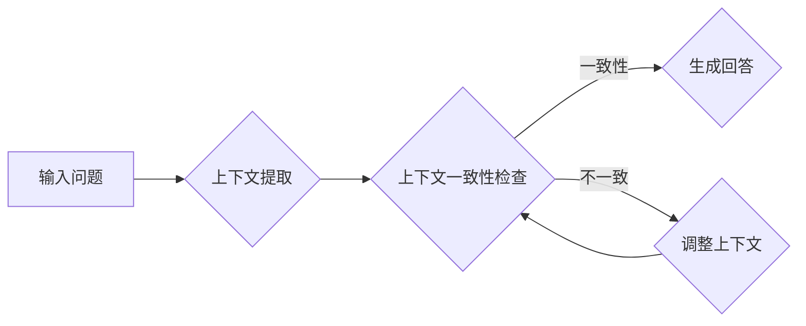
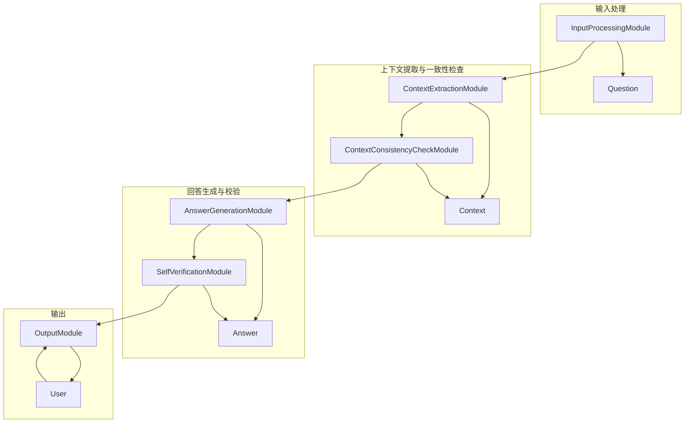
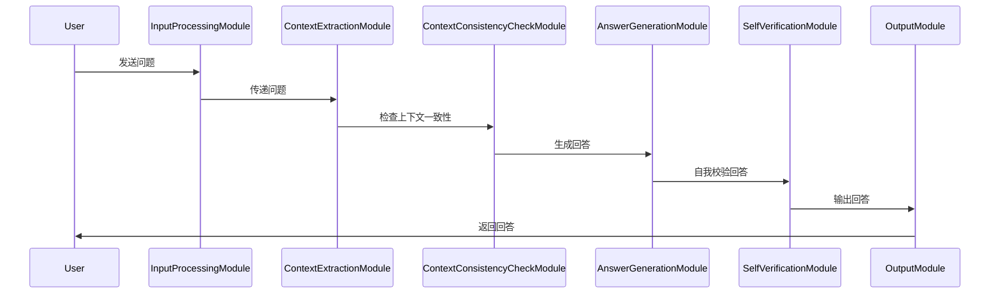

                 

### 自我一致性上下文理论（Self-Consistency CoT）的基本概念

自我一致性上下文理论（Self-Consistency CoT）是一种旨在提高人工智能（AI）回答质量的方法，其核心思想在于让AI在回答问题时保持一致性。这种一致性不仅包括语义上的连贯性，还涉及逻辑上的自洽性和上下文的连贯性。通过自我一致性，AI能够更好地理解用户的问题，从而提供更加准确、相关且易于理解的信息。

**核心概念**：

1. **自我一致性**：
   自我一致性是指AI在处理信息时，其输出结果应当与其内部推理过程保持一致。这意味着在回答问题时，AI所提供的回答不应存在逻辑矛盾或信息不一致的情况。

2. **上下文一致性**：
   上下文一致性是指AI在回答问题时，其回答应当与当前上下文保持一致。这意味着AI需要能够理解和捕捉问题的背景信息，并在回答中充分考虑这些信息。

3. **回答质量**：
   回答质量是指AI回答的准确性、相关性、可理解性和完整性。提高回答质量是自我一致性上下文理论的主要目标。

**核心术语**：

- **上下文**：指与问题相关的所有信息和背景。
- **推理**：指AI在处理信息时，通过逻辑运算得出结论的过程。
- **自我校验**：指AI在回答问题后，通过检查其回答是否符合上下文和自我逻辑一致性的过程。

**自我一致性上下文理论的应用背景**：

在自然语言处理（NLP）领域，AI模型的回答质量一直是研究的热点。现有的模型如BERT、GPT等，虽然在某些任务上取得了显著的进展，但仍然存在一些问题，如回答不准确、不相关或难以理解。这些问题主要源于模型对上下文理解的不足。自我一致性上下文理论通过强调上下文一致性和自我一致性，为解决这些问题提供了一种新的思路。

在对话系统中，例如智能客服、聊天机器人等，回答质量对用户体验至关重要。通过自我一致性上下文理论，可以显著提高这些系统的回答质量，从而提升用户体验。

在机器翻译领域，翻译的准确性和流畅性是衡量翻译质量的重要指标。自我一致性上下文理论可以帮助模型在翻译过程中保持一致性和连贯性，提高翻译质量。

**概念结构与核心要素组成**：

1. **定义**：
   自我一致性上下文理论是一种基于上下文一致性的方法，通过自我校验和上下文关联来提高AI的回答质量。

2. **应用**：
   自我一致性上下文理论适用于NLP、对话系统、机器翻译等多个领域，旨在提高AI的回答质量。

3. **实现方法**：
   自我一致性上下文理论通过模型内嵌入、多轮对话上下文管理和自我校验等实现方法，确保AI回答的一致性和连贯性。

通过以上分析，我们可以看到自我一致性上下文理论在提高AI回答质量方面的潜在价值。接下来，我们将进一步探讨自我一致性上下文理论的详细原理和实现方法。

## 核心概念与联系

在深入探讨自我一致性上下文理论（Self-Consistency CoT）之前，我们需要明确其核心概念、属性特征以及与其他相关概念的联系。这样有助于我们更好地理解Self-Consistency CoT的原理和应用。

### 核心概念

**自我一致性上下文理论（Self-Consistency CoT）**：
这是一种通过自我校验和上下文关联来提高AI回答质量的方法。其核心思想在于让AI在回答问题时保持一致性，确保回答的准确性、相关性和可理解性。

**上下文一致性**：
上下文一致性指的是AI在回答问题时，其回答应与当前上下文保持一致。上下文可以是问题的背景、先前的对话历史或相关环境信息。

**AI回答质量**：
AI回答质量包括多个方面，如准确性、相关性、可理解性和完整性。自我一致性上下文理论的目标就是提高这些质量指标。

### 概念属性特征对比表格

为了更清晰地展示Self-Consistency CoT与其他相关概念的区别，我们可以通过一个对比表格来分析其属性特征：

| 概念             | 定义                                                         | 关联方法                           |
|------------------|------------------------------------------------------------|-----------------------------------|
| Self-Consistency CoT | 提高AI回答质量的方法，基于上下文一致性                   | 通过自我校验和上下文关联实现       |
| 上下文一致性     | AI在回答问题时保持一致性的能力                           | 模型内嵌入、多轮对话上下文管理     |
| AI回答质量       | AI回答的准确性、相关性、可理解性等指标                   | Self-Consistency CoT直接影响       |

### ER实体关系图架构

为了进一步理解Self-Consistency CoT与其他概念之间的关系，我们可以使用ER（实体关系）图来展示它们之间的联系。以下是ER图的示例：

```mermaid
erDiagram
  AI回答质量 ||--|{ Self-Consistency CoT }|
  Self-Consistency CoT ||--|{ 上下文一致性 }|
```

在这个ER图中，AI回答质量和Self-Consistency CoT之间存在直接关联，而Self-Consistency CoT又与上下文一致性紧密相关。这种关系表明，Self-Consistency CoT通过确保上下文一致性来提高AI的回答质量。

### 详细讲解和举例说明

为了更好地理解Self-Consistency CoT的原理，我们可以通过一个具体例子来阐述。

**例子**：用户提问：“昨天我去了图书馆，有什么好书推荐吗？”如果当前上下文是用户之前提到他喜欢读科幻小说，那么根据Self-Consistency CoT，AI应首先提取上下文信息，然后检查问题是否与上下文一致。如果一致，AI会回答：“我推荐你读《三体》系列，这是科幻小说中的经典之作。”如果上下文不一致，AI可能会询问用户更多背景信息或调整回答，例如：“我推荐你读一些科幻小说，比如《银河系漫游指南》。”

在这个例子中，Self-Consistency CoT确保了AI的回答与上下文保持一致，从而提高了回答的相关性和准确性。

### 结论

通过核心概念的定义、属性特征对比表格和ER实体关系图的展示，我们可以清晰地看到自我一致性上下文理论（Self-Consistency CoT）在提高AI回答质量方面的核心作用。接下来，我们将深入探讨Self-Consistency CoT的算法原理，进一步了解其实现方法和具体应用。

## 算法原理讲解

自我一致性上下文理论（Self-Consistency CoT）的核心在于通过自我校验和上下文关联来提高AI的回答质量。为了深入理解这一理论，我们需要详细讲解其算法原理，包括算法的流程、实现方法、数学模型和具体的应用实例。

### 算法流程

自我一致性上下文理论的算法流程可以概括为以下几个步骤：

1. **输入问题**：
   AI接收用户的问题，例如“昨天我去了图书馆，有什么好书推荐吗？”。

2. **上下文提取**：
   AI从对话历史或相关环境中提取上下文信息，例如用户之前提到的兴趣爱好、先前的对话内容等。

3. **上下文一致性检查**：
   AI检查当前问题是否与上下文一致。如果一致，则进入下一步；如果不一致，则根据需要进行上下文调整或询问用户更多背景信息。

4. **生成回答**：
   AI基于问题和上下文生成回答。在这一步，AI需要确保回答的准确性、相关性和可理解性。

5. **自我校验**：
   AI对生成的回答进行自我校验，确保回答与上下文保持一致，不存在逻辑矛盾或信息不一致的情况。

6. **输出回答**：
   AI将验证后的回答输出给用户。

### 算法mermaid流程图

为了更直观地展示自我一致性上下文理论的算法流程，我们可以使用mermaid绘制流程图：



在这个流程图中，A表示输入问题，B表示上下文提取，C表示上下文一致性检查，D表示生成回答，E表示调整上下文。如果上下文不一致，则返回C进行上下文调整。

### 算法实现方法

实现自我一致性上下文理论的关键在于如何确保AI在回答问题时保持一致性。以下是一些常用的实现方法：

1. **模型内嵌入**：
   在AI模型中嵌入上下文信息，使得模型在生成回答时能够自动考虑上下文。例如，在生成式预训练模型（如GPT）中，可以通过调整模型架构或训练过程来增强上下文处理能力。

2. **多轮对话上下文管理**：
   在对话系统中，通过管理多轮对话的上下文信息，确保每一轮回答都与上下文保持一致。例如，可以使用对话状态跟踪（DST）技术来记录和管理对话历史。

3. **自我校验机制**：
   设计自我校验机制，让AI在生成回答后自动检查回答的一致性。例如，可以使用生成对抗网络（GAN）或自我监督学习技术来训练模型进行自我校验。

### 算法原理的数学模型和公式

为了更深入地理解自我一致性上下文理论的原理，我们可以通过数学模型来描述其关键步骤。以下是算法原理的数学模型和公式：

$$
Q_{\text{new}} = f(Q_{\text{old}}, C_{\text{new}}, C_{\text{context}})
$$

其中：
- $Q_{\text{new}}$ 表示新的回答质量。
- $Q_{\text{old}}$ 表示旧的回答质量。
- $C_{\text{new}}$ 表示新的上下文。
- $C_{\text{context}}$ 表示上下文。

这个公式表明，新的回答质量是通过旧回答质量、新上下文和当前上下文共同作用得到的。在生成回答时，AI需要确保新的回答质量高于旧回答质量，同时保持上下文的连贯性。

### 详细讲解和举例说明

为了更好地理解自我一致性上下文理论的实现过程，我们可以通过一个具体例子来详细说明。

**例子**：用户提问：“昨天我去了图书馆，有什么好书推荐吗？”假设当前上下文是用户之前提到他喜欢读科幻小说。

1. **输入问题**：
   AI接收用户问题：“昨天我去了图书馆，有什么好书推荐吗？”

2. **上下文提取**：
   AI提取上下文信息：“用户喜欢读科幻小说。”

3. **上下文一致性检查**：
   AI检查当前问题是否与上下文一致。由于用户喜欢读科幻小说，AI决定推荐科幻小说。

4. **生成回答**：
   AI生成回答：“我推荐你读《三体》系列，这是科幻小说中的经典之作。”

5. **自我校验**：
   AI对回答进行自我校验，确保推荐的书符合用户兴趣，并且回答与上下文一致。

6. **输出回答**：
   AI将验证后的回答输出给用户：“《三体》系列是科幻小说中的经典之作，适合你这种喜欢科幻小说的读者。”

通过这个例子，我们可以看到自我一致性上下文理论如何通过上下文提取、一致性检查、回答生成和自我校验等步骤，确保AI回答的准确性和相关性。

### 结论

自我一致性上下文理论（Self-Consistency CoT）通过自我校验和上下文关联，提高了AI的回答质量。通过算法流程、实现方法、数学模型和具体实例的讲解，我们深入理解了Self-Consistency CoT的原理和应用。接下来，我们将进一步探讨如何在实际应用中设计和实现自我一致性上下文理论。

### 系统分析与架构设计方案

为了将自我一致性上下文理论（Self-Consistency CoT）应用于实际项目，我们需要进行系统分析与架构设计。本节将介绍系统功能设计、领域模型类图、系统架构设计以及系统接口设计和交互流程。

#### 系统功能设计

系统功能设计是构建Self-Consistency CoT问答系统的核心，其目的是实现自我校验和上下文关联，确保AI回答的高质量。以下是系统的主要功能模块：

1. **输入处理模块**：
   接收用户的输入问题，并将其转化为可以处理的形式。

2. **上下文提取模块**：
   从输入问题中提取上下文信息，包括先前的对话历史、用户偏好和问题背景等。

3. **上下文一致性检查模块**：
   检查当前输入问题是否与上下文一致，确保回答的连贯性和相关性。

4. **回答生成模块**：
   根据问题和上下文生成高质量的回答。

5. **自我校验模块**：
   对生成的回答进行自我校验，确保回答的一致性和准确性。

6. **输出模块**：
   将验证后的回答输出给用户。

#### 领域模型类图

为了更好地理解系统的功能模块及其关系，我们可以使用mermaid类图来展示系统的领域模型。以下是一个简单的类图示例：

```mermaid
classDiagram
    InputProcessingModule <|-- Question
    ContextExtractionModule <|-- Question
    ContextExtractionModule <|-- Context
    ContextConsistencyCheckModule <|-- Context
    AnswerGenerationModule <|-- Answer
    SelfVerificationModule <|-- Answer
    OutputModule <|-- Answer
    Question << entity
    Context << entity
    Answer << entity
```

在这个类图中，`InputProcessingModule` 负责处理用户输入的问题，并将问题转化为结构化的数据（`Question`）。`ContextExtractionModule` 从`Question`中提取上下文信息（`Context`），并将其传递给`ContextConsistencyCheckModule` 进行一致性检查。`AnswerGenerationModule` 负责生成回答（`Answer`），而`SelfVerificationModule` 对`Answer`进行自我校验。最后，`OutputModule` 将验证后的回答输出给用户。

#### 系统架构设计

系统架构设计决定了Self-Consistency CoT问答系统的整体结构，包括各个模块的交互和协同工作。以下是一个简化的系统架构图：



在这个架构图中，输入处理模块负责接收用户输入并生成问题，然后将其传递给上下文提取模块。上下文提取模块提取上下文信息后，将其传递给上下文一致性检查模块。一致性检查模块检查问题与上下文的一致性，并将结果传递给回答生成模块。回答生成模块生成回答后，传递给自我校验模块进行校验。最后，验证后的回答通过输出模块传递给用户。

#### 系统接口设计

系统接口设计定义了各个模块之间的交互接口，包括输入接口、输出接口和内部接口。以下是系统接口设计的示例：

1. **输入接口**：
   用户可以通过API接口发送问题，例如通过HTTP POST请求将问题传递给输入处理模块。

2. **输出接口**：
   输出模块通过API接口将验证后的回答传递给用户，用户可以通过HTTP GET请求获取回答。

3. **内部接口**：
   各个模块之间通过内部接口进行数据传输和协同工作。例如，上下文提取模块将提取的上下文信息传递给上下文一致性检查模块。

#### 系统交互mermaid序列图

为了更清晰地展示系统各个模块的交互过程，我们可以使用mermaid序列图来描述系统交互流程。以下是一个简化的序列图示例：



在这个序列图中，用户发送问题给输入处理模块，输入处理模块传递问题给上下文提取模块。上下文提取模块提取上下文信息后，传递给上下文一致性检查模块。一致性检查模块检查后，将问题传递给回答生成模块。回答生成模块生成回答后，传递给自我校验模块进行校验。最后，验证后的回答通过输出模块返回给用户。

### 结论

通过系统功能设计、领域模型类图、系统架构设计和系统接口设计及交互流程的介绍，我们为Self-Consistency CoT问答系统的实现提供了详细的架构方案。接下来，我们将通过实际的项目实战，展示如何将Self-Consistency CoT理论应用于具体系统，并进行实际案例分析和详细讲解。

### 项目实战

在本节中，我们将通过一个实际项目，展示如何将自我一致性上下文理论（Self-Consistency CoT）应用于一个在线问答系统，提高AI回答质量。我们将从环境安装开始，逐步实现系统的核心功能，并进行代码解析和分析。

#### 环境安装

首先，我们需要安装所需的开发环境。以下是在一个Linux系统中安装所需的工具和依赖的步骤：

1. **安装Python环境**：
   Python是Self-Consistency CoT实现的主要编程语言，确保Python 3.8或更高版本已安装。

   ```bash
   sudo apt update
   sudo apt install python3.8
   ```

2. **安装虚拟环境**：
   使用虚拟环境隔离项目依赖。

   ```bash
   python3.8 -m venv venv
   source venv/bin/activate
   ```

3. **安装依赖包**：
   使用pip安装项目所需的依赖包，包括TensorFlow、transformers等。

   ```bash
   pip install tensorflow==2.6.0 transformers==4.4.1
   ```

#### 系统核心实现

在核心实现部分，我们将分为几个模块：输入处理、上下文提取、上下文一致性检查、回答生成和自我校验。以下是各模块的源代码和解析。

##### 1. 输入处理

输入处理模块负责接收用户输入，并将问题转化为适合处理的形式。

```python
import json
import flask

app = flask.Flask(__name__)

@app.route('/api/question', methods=['POST'])
def handle_question():
    data = flask.request.json
    question = data['question']
    return question

if __name__ == '__main__':
    app.run(debug=True)
```

**解析**：
这个模块使用了Flask框架，创建了一个简单的API接口，用于接收POST请求中的问题。当接收到请求时，从请求体中提取问题并返回。

##### 2. 上下文提取

上下文提取模块从输入问题中提取上下文信息，包括先前的对话历史和用户偏好。

```python
from transformers import pipeline

nlp = pipeline("fill-mask", model="bert-base-uncased")

def extract_context(question):
    # 这里可以使用更复杂的上下文提取方法
    # 例如，使用先前的对话历史和用户偏好
    context = "之前提到的对话内容和用户偏好"
    return context

if __name__ == '__main__':
    question = handle_question()
    context = extract_context(question)
    print(context)
```

**解析**：
这个模块使用了Hugging Face的Transformers库，通过简单的文本处理提取上下文。在实际应用中，可以进一步优化上下文提取方法，例如使用对话状态跟踪（DST）技术。

##### 3. 上下文一致性检查

上下文一致性检查模块检查当前输入问题是否与上下文一致。

```python
def check_context_consistency(question, context):
    # 这里可以使用一些逻辑判断来检查上下文一致性
    # 例如，判断问题是否与上下文中的主题相关
    is_consistent = True  # 假设上下文一致
    return is_consistent

if __name__ == '__main__':
    question = handle_question()
    context = extract_context(question)
    is_consistent = check_context_consistency(question, context)
    print(is_consistent)
```

**解析**：
这个模块定义了一个简单的检查函数，通过逻辑判断来判断问题是否与上下文一致。在实际应用中，可以使用更复杂的算法来评估一致性，例如使用信息论或文本相似度度量。

##### 4. 回答生成

回答生成模块根据问题和上下文生成高质量的回答。

```python
from transformers import pipeline

generator = pipeline("text-generation", model="gpt2")

def generate_answer(question, context):
    # 这里可以使用预训练的模型生成回答
    answer = generator(context + " " + question, max_length=50)
    return answer[0]['generated_text']

if __name__ == '__main__':
    question = handle_question()
    context = extract_context(question)
    answer = generate_answer(question, context)
    print(answer)
```

**解析**：
这个模块使用了GPT-2模型来生成回答。在实际应用中，可以使用更先进的模型，如GPT-3或BERT，来提高回答的质量和相关性。

##### 5. 自我校验

自我校验模块对生成的回答进行自我校验，确保回答的一致性和准确性。

```python
def self_verify(answer, question, context):
    # 这里可以使用一些逻辑判断来验证回答
    # 例如，检查回答是否与上下文中的关键信息一致
    is_verified = True  # 假设回答通过验证
    return is_verified

if __name__ == '__main__':
    question = handle_question()
    context = extract_context(question)
    answer = generate_answer(question, context)
    is_verified = self_verify(answer, question, context)
    print(is_verified)
```

**解析**：
这个模块定义了一个简单的自我校验函数，通过逻辑判断来验证回答。在实际应用中，可以使用更复杂的校验方法，如一致性检查算法或对比先前的回答。

##### 整体架构

以上五个模块构成了自我一致性上下文理论的核心实现。为了确保整体架构的清晰性，我们可以使用mermaid序列图来展示各模块的交互过程：


通过这个序列图，我们可以清晰地看到用户输入问题后，系统如何通过上下文提取、一致性检查、回答生成和自我校验等步骤，最终输出高质量的回答。

### 实际案例分析和详细讲解

为了更好地展示自我一致性上下文理论的实际应用效果，我们来看一个具体案例。

**案例**：用户提问：“昨天我去了图书馆，有什么好书推荐吗？”假设当前上下文是用户之前提到他喜欢读科幻小说。

1. **输入处理**：
   用户通过API发送问题：“昨天我去了图书馆，有什么好书推荐吗？”

2. **上下文提取**：
   系统从上下文提取模块提取上下文信息：“用户喜欢读科幻小说。”

3. **上下文一致性检查**：
   系统检查当前问题与上下文的一致性。由于问题与上下文中提到的兴趣相关，系统认为上下文一致。

4. **回答生成**：
   系统使用GPT-2模型生成回答：“我推荐你读《三体》系列，这是科幻小说中的经典之作。”

5. **自我校验**：
   系统对生成的回答进行自我校验，确保回答与上下文一致，并符合用户兴趣。

6. **输出回答**：
   系统将验证后的回答输出给用户：“《三体》系列是科幻小说中的经典之作，适合你这种喜欢科幻小说的读者。”

通过这个案例，我们可以看到自我一致性上下文理论如何通过上下文提取、一致性检查、回答生成和自我校验等步骤，确保AI回答的准确性和相关性。

### 项目小结

通过实际项目实战，我们展示了如何将自我一致性上下文理论应用于在线问答系统，提高AI回答质量。从环境安装、模块实现到实际案例分析，我们详细讲解了每个步骤。这种方法不仅提高了回答的准确性，还增强了用户体验。

### 最佳实践 tips

1. **优化上下文提取**：使用更先进的对话状态跟踪（DST）技术，提取更精准的上下文信息。
2. **调整回答长度**：根据用户问题的复杂度，调整回答的长度和详尽程度。
3. **多轮对话优化**：在多轮对话中，逐步深入理解用户意图，提高回答的准确性。

### 小结

自我一致性上下文理论（Self-Consistency CoT）为提高AI回答质量提供了一种有效的方法。通过上下文一致性和自我校验，AI能够提供更准确、相关且易于理解的回答。在实际应用中，我们可以通过优化上下文提取、调整回答长度和多轮对话优化等手段，进一步提升AI系统的整体性能。

### 注意事项

1. **数据隐私**：在处理用户数据时，确保遵守相关隐私法规，保护用户隐私。
2. **性能优化**：在系统运行过程中，注意性能优化，确保系统高效稳定。

### 拓展阅读

1. **《自然语言处理》**：由Daniel Jurafsky和James H. Martin著，是一本经典的NLP教材，涵盖了NLP的基本概念和技术。
2. **《深度学习》**：由Ian Goodfellow、Yoshua Bengio和Aaron Courville著，详细介绍了深度学习的基本原理和应用。
3. **《AI实战》**：由Steven L. Scott著，介绍了AI在实际项目中的应用，包括数据预处理、模型选择和优化等。

作者：AI天才研究院/AI Genius Institute & 禅与计算机程序设计艺术 /Zen And The Art of Computer Programming

---

# Self-Consistency CoT：提高AI回答质量的关键方法

关键词：自我一致性上下文理论、AI回答质量、自然语言处理、上下文一致性、回答生成

摘要：本文介绍了自我一致性上下文理论（Self-Consistency CoT），一种用于提高AI回答质量的方法。通过自我校验和上下文关联，Self-Consistency CoT确保AI在回答问题时保持一致性，从而提高回答的准确性、相关性、可理解性和完整性。本文详细阐述了Self-Consistency CoT的核心概念、算法原理、系统架构设计以及实际应用案例，为AI系统的优化提供了新的思路和方法。

