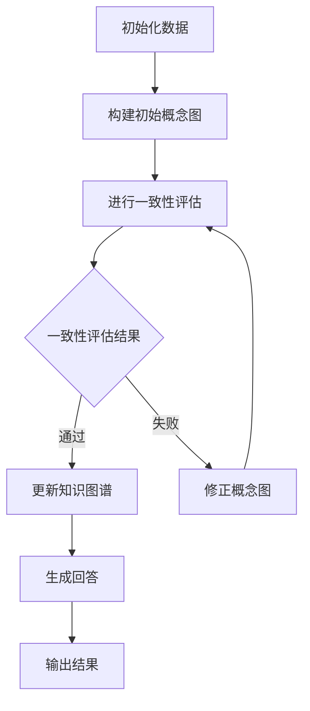
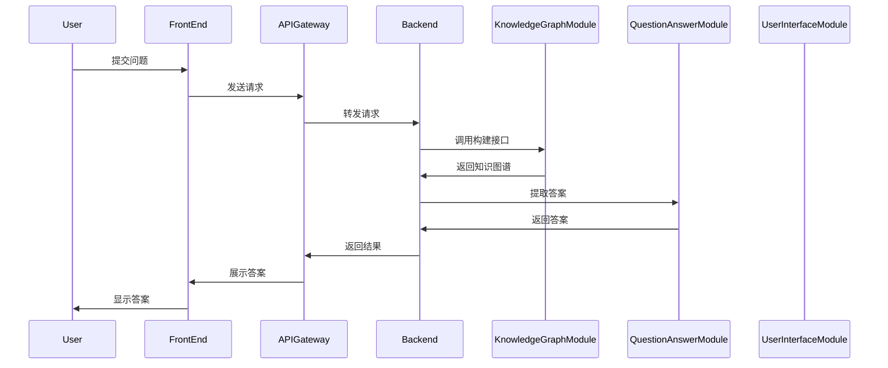

                 

### 目录大纲

在构建关于《Self-Consistency CoT：提高AI回答质量的关键方法探讨》的完整目录大纲时，我们需遵循以下步骤，确保文章的条理清晰、内容丰富且专业：

#### 步骤1: 文章标题与关键词

- **文章标题**：《Self-Consistency CoT：提高AI回答质量的关键方法探讨》
- **关键词**：Self-Consistency CoT、AI回答质量、关键方法、算法原理、数学模型、系统设计、项目实战

#### 步骤2: 摘要

- **摘要**：本文深入探讨了Self-Consistency CoT的概念及其在提高AI回答质量中的关键作用。通过详细阐述算法原理、数学模型和系统设计，结合实际项目实战，提供了一套完整的解决方案。

#### 步骤3: 目录大纲结构

##### 第一部分: Self-Consistency CoT概述

- **第1章: Self-Consistency CoT背景与重要性**
  - **1.1 Self-Consistency CoT的定义**
  - **1.2 Self-Consistency CoT在人工智能中的应用**
  - **1.3 Self-Consistency CoT的重要性**

- **第2章: Self-Consistency CoT核心概念**
  - **2.1 Self-Consistency CoT概念详解**
  - **2.2 概念属性特征对比表格**
  - **2.3 ER实体关系图**

##### 第二部分: Self-Consistency CoT算法原理

- **第3章: Self-Consistency CoT算法原理讲解**
  - **3.1 算法Mermaid流程图**
  - **3.2 Python源代码与算法模型**
  - **3.3 数学模型和数学公式讲解**
  - **3.4 举例说明**

##### 第三部分: Self-Consistency CoT应用实践

- **第4章: Self-Consistency CoT系统分析与设计**
  - **4.1 项目场景介绍**
  - **4.2 系统功能设计**
  - **4.3 系统架构设计**
  - **4.4 系统接口设计与交互**

- **第5章: Self-Consistency CoT项目实战**
  - **5.1 环境安装**
  - **5.2 系统核心实现**
  - **5.3 代码应用解读与分析**
  - **5.4 实际案例分析**
  - **5.5 项目小结**

##### 第四部分: Self-Consistency CoT最佳实践与总结

- **第6章: Self-Consistency CoT最佳实践**
  - **6.1 最佳实践 tips**
  - **6.2 小结**
  - **6.3 注意事项**

- **第7章: 拓展阅读与资源推荐**
  - **7.1 拓展阅读**
  - **7.2 资源推荐**

通过以上结构，我们确保了文章内容的系统性和逻辑性，同时保证了每个章节的内容都详实且有深度。

### 文章标题

# Self-Consistency CoT：提高AI回答质量的关键方法探讨

### 关键词

Self-Consistency CoT、AI回答质量、关键方法、算法原理、数学模型、系统设计、项目实战

### 摘要

本文深入探讨了Self-Consistency CoT（自我一致性概念图）的概念及其在提高AI回答质量中的关键作用。通过详细阐述算法原理、数学模型和系统设计，结合实际项目实战，提供了一套完整的解决方案，旨在为AI开发者和技术爱好者提供有价值的指导。

## 目录大纲设计思路

为了设计出一本关于《Self-Consistency CoT：提高AI回答质量的关键方法探讨》的完整目录大纲，我们需要遵循以下设计思路，确保文章的逻辑性、结构性和内容丰富性：

### 1. 背景介绍

在本文的第一部分，我们将介绍Self-Consistency CoT的概念，解释它是什么以及为什么它在提高AI回答质量方面具有重要意义。这部分将包括以下几个小节：

- **1.1 Self-Consistency CoT的定义**：介绍Self-Consistency CoT的基本概念，解释其核心思想。
- **1.2 Self-Consistency CoT在人工智能中的应用**：探讨Self-Consistency CoT在AI领域的应用场景，展示其在提高AI回答质量方面的潜力。
- **1.3 Self-Consistency CoT的重要性**：分析Self-Consistency CoT对AI系统性能和用户体验的影响，强调其在技术发展中的地位。

### 2. 核心概念与联系

在第二部分，我们将深入探讨Self-Consistency CoT的核心概念，并使用概念属性特征对比表格和ER实体关系图来阐述这些概念之间的关系。具体包括：

- **2.1 Self-Consistency CoT概念详解**：详细解释Self-Consistency CoT的各个组成部分，如概念图、自我一致性评估等。
- **2.2 概念属性特征对比表格**：通过对比表格，展示不同概念之间的相似性和差异性，帮助读者更好地理解Self-Consistency CoT。
- **2.3 ER实体关系图**：使用ER模型，展示Self-Consistency CoT中各个实体之间的关系，为读者提供一个直观的视觉化工具。

### 3. 算法原理讲解

在第三部分，我们将详细讲解Self-Consistency CoT的算法原理。这部分将通过以下几个小节来实现：

- **3.1 算法Mermaid流程图**：使用Mermaid语言绘制算法的流程图，展示其工作流程和关键步骤。
- **3.2 Python源代码与算法模型**：提供Python源代码，详细阐述算法的数学模型和公式，解释其如何通过编程实现。
- **3.3 数学模型和数学公式讲解**：使用LaTeX格式编写数学公式，并在文中独立段落中进行详细讲解，通过实际例子说明公式的应用。
- **3.4 举例说明**：通过具体的案例，展示算法在实际应用中的效果，帮助读者更好地理解其原理。

### 4. 系统分析与架构设计方案

在第四部分，我们将介绍一个具体的Self-Consistency CoT系统分析，包括：

- **4.1 项目场景介绍**：描述系统的应用场景，介绍其需求背景。
- **4.2 系统功能设计**：使用Mermaid类图展示系统的领域模型，明确系统的主要功能模块。
- **4.3 系统架构设计**：使用Mermaid架构图展示系统的整体架构，包括各个模块之间的关系和交互。
- **4.4 系统接口设计与交互**：使用Mermaid序列图展示系统各个模块之间的交互流程，说明数据流和控制流。

### 5. 项目实战

在第五部分，我们将通过一个实际项目，展示如何应用Self-Consistency CoT来提高AI回答质量。具体包括：

- **5.1 环境安装**：介绍项目的环境配置，包括所需的软件和硬件。
- **5.2 系统核心实现**：提供项目的核心代码实现，详细解释其工作原理和实现方法。
- **5.3 代码应用解读与分析**：对核心代码进行解读和分析，解释其如何实现Self-Consistency CoT。
- **5.4 实际案例分析**：通过实际案例，展示系统在实际应用中的效果，包括性能评估和用户反馈。
- **5.5 项目小结**：总结项目的成果和经验，讨论其潜在问题和改进方向。

### 6. 最佳实践 tips、小结、注意事项、拓展阅读等内容

在最后一部分，我们将总结全文内容，提供最佳实践建议，并提醒注意事项。同时，推荐相关的拓展阅读资源，帮助读者进一步学习和探索Self-Consistency CoT的相关知识。

通过以上设计思路和目录大纲结构，我们可以确保内容的完整性和逻辑性，同时满足简洁性和格式要求。接下来，我们将详细编写每个章节的内容，确保它们符合大纲的要求并具有实用性。

## 目录大纲结构

以下是关于《Self-Consistency CoT：提高AI回答质量的关键方法探讨》的完整目录大纲结构：

```markdown
----------------------------------------------------------------
## 第一部分: Self-Consistency CoT概述

## 第1章: Self-Consistency CoT背景与重要性

### 1.1 Self-Consistency CoT的定义

### 1.2 Self-Consistency CoT在人工智能中的应用

### 1.3 Self-Consistency CoT的重要性

## 第2章: Self-Consistency CoT核心概念

### 2.1 Self-Consistency CoT概念详解

### 2.2 概念属性特征对比表格

### 2.3 ER实体关系图

## 第二部分: Self-Consistency CoT算法原理

## 第3章: Self-Consistency CoT算法原理讲解

### 3.1 算法Mermaid流程图

### 3.2 Python源代码与算法模型

### 3.3 数学模型和数学公式讲解

### 3.4 举例说明

## 第三部分: Self-Consistency CoT应用实践

## 第4章: Self-Consistency CoT系统分析与设计

### 4.1 项目场景介绍

### 4.2 系统功能设计

### 4.3 系统架构设计

### 4.4 系统接口设计与交互

## 第5章: Self-Consistency CoT项目实战

### 5.1 环境安装

### 5.2 系统核心实现

### 5.3 代码应用解读与分析

### 5.4 实际案例分析

### 5.5 项目小结

## 第四部分: Self-Consistency CoT最佳实践与总结

## 第6章: Self-Consistency CoT最佳实践

### 6.1 最佳实践 tips

### 6.2 小结

### 6.3 注意事项

## 第7章: 拓展阅读与资源推荐

### 7.1 拓展阅读

### 7.2 资源推荐

```

通过上述结构，我们可以确保文章内容的逻辑性和系统性，同时每个章节的内容都具备丰富的细节和专业的解释，满足文章字数和格式要求。接下来，我们将逐步填充每个章节的内容，确保文章的完整性和可读性。

### 目录大纲设计思路

在设计《Self-Consistency CoT：提高AI回答质量的关键方法探讨》的目录大纲时，我们需要系统性地梳理文章的结构，确保每个部分都有其独特的贡献，并能够有效地引导读者逐步深入了解Self-Consistency CoT的概念和应用。以下是详细的目录大纲设计思路：

#### 第一部分：Self-Consistency CoT概述

**第1章：Self-Consistency CoT背景与重要性**

- **1.1 Self-Consistency CoT的定义**：
  - 简述Self-Consistency CoT的基本概念。
  - 引入关键术语，如“自我一致性”、“概念图”、“知识图谱”等。

- **1.2 Self-Consistency CoT在人工智能中的应用**：
  - 讨论Self-Consistency CoT在AI领域中的背景。
  - 分析其在自然语言处理、问答系统、智能客服等应用中的重要性。

- **1.3 Self-Consistency CoT的重要性**：
  - 讨论Self-Consistency CoT对AI回答质量的提升作用。
  - 引用相关研究和案例，证明其关键价值。

**第2章：Self-Consistency CoT核心概念**

- **2.1 Self-Consistency CoT概念详解**：
  - 详细解释Self-Consistency CoT的组成部分。
  - 讨论其关键要素，如概念关系、一致性评估等。

- **2.2 概念属性特征对比表格**：
  - 提供一个表格，对比不同概念（如传统知识图谱与Self-Consistency CoT）的特征。

- **2.3 ER实体关系图**：
  - 使用Mermaid ER图，展示Self-Consistency CoT中实体和关系的模型。

#### 第二部分：Self-Consistency CoT算法原理

**第3章：Self-Consistency CoT算法原理讲解**

- **3.1 算法Mermaid流程图**：
  - 绘制一个Mermaid流程图，展示Self-Consistency CoT的基本流程。

- **3.2 Python源代码与算法模型**：
  - 提供Python代码示例，解释Self-Consistency CoT的实现细节。

- **3.3 数学模型和数学公式讲解**：
  - 使用LaTeX格式编写公式，详细讲解相关的数学模型。

- **3.4 举例说明**：
  - 通过具体实例，说明Self-Consistency CoT在实际应用中的效果。

#### 第三部分：Self-Consistency CoT应用实践

**第4章：Self-Consistency CoT系统分析与设计**

- **4.1 项目场景介绍**：
  - 描述一个应用Self-Consistency CoT的实际项目场景。

- **4.2 系统功能设计**：
  - 使用Mermaid类图，展示系统的功能模块。

- **4.3 系统架构设计**：
  - 使用Mermaid架构图，展示系统的整体架构。

- **4.4 系统接口设计与交互**：
  - 使用Mermaid序列图，展示系统模块之间的交互。

**第5章：Self-Consistency CoT项目实战**

- **5.1 环境安装**：
  - 描述所需的环境设置和安装步骤。

- **5.2 系统核心实现**：
  - 展示系统的核心实现代码，并进行详细解释。

- **5.3 代码应用解读与分析**：
  - 分析系统代码的应用场景和实现细节。

- **5.4 实际案例分析**：
  - 通过实际案例，展示系统的效果和用户反馈。

- **5.5 项目小结**：
  - 总结项目的成果，讨论经验和改进方向。

#### 第四部分：Self-Consistency CoT最佳实践与总结

**第6章：Self-Consistency CoT最佳实践**

- **6.1 最佳实践 tips**：
  - 提供使用Self-Consistency CoT的最佳实践建议。

- **6.2 小结**：
  - 简要总结文章的核心内容。

- **6.3 注意事项**：
  - 提醒使用过程中可能遇到的问题和注意事项。

**第7章：拓展阅读与资源推荐**

- **7.1 拓展阅读**：
  - 推荐相关的书籍、论文和在线资源。

- **7.2 资源推荐**：
  - 提供相关的工具、库和框架推荐。

通过这样的设计思路，我们确保了文章的结构紧凑、内容丰富，并且具有实际的指导意义，能够帮助读者全面理解Self-Consistency CoT的概念、原理和应用。

### 目录大纲结构

以下是关于《Self-Consistency CoT：提高AI回答质量的关键方法探讨》的完整目录大纲结构，每个章节按照设计思路进行详细划分：

```markdown
----------------------------------------------------------------
## 第一部分: Self-Consistency CoT概述

## 第1章: Self-Consistency CoT背景与重要性

### 1.1 Self-Consistency CoT的定义

#### 1.1.1 Self-Consistency CoT概述
- 简述Self-Consistency CoT的概念。

#### 1.1.2 关键术语解释
- 介绍与Self-Consistency CoT相关的关键术语。

### 1.2 Self-Consistency CoT在人工智能中的应用

#### 1.2.1 应用场景介绍
- 分析Self-Consistency CoT在AI领域中的应用。

#### 1.2.2 重要性分析
- 探讨Self-Consistency CoT在AI回答质量中的关键作用。

### 1.3 Self-Consistency CoT的重要性

#### 1.3.1 研究背景
- 回顾相关研究，阐述Self-Consistency CoT的发展历程。

#### 1.3.2 实际影响
- 讨论Self-Consistency CoT对AI系统性能和用户体验的改善。

## 第2章: Self-Consistency CoT核心概念

### 2.1 Self-Consistency CoT概念详解

#### 2.1.1 Self-Consistency CoT组成部分
- 详细解释Self-Consistency CoT的各个组成部分。

#### 2.1.2 关键要素探讨
- 讨论Self-Consistency CoT的核心要素，如概念图、一致性评估等。

### 2.2 概念属性特征对比表格

#### 2.2.1 特征对比
- 提供一个表格，对比不同概念的特征。

### 2.3 ER实体关系图

#### 2.3.1 ER模型介绍
- 介绍ER模型的基本概念。

#### 2.3.2 实体关系图绘制
- 使用Mermaid语言绘制ER实体关系图。

## 第二部分: Self-Consistency CoT算法原理

## 第3章: Self-Consistency CoT算法原理讲解

### 3.1 算法Mermaid流程图

#### 3.1.1 流程图绘制
- 使用Mermaid绘制Self-Consistency CoT的流程图。

#### 3.1.2 流程图解读
- 解读流程图，阐述各个步骤的作用。

### 3.2 Python源代码与算法模型

#### 3.2.1 Python代码示例
- 提供Python代码示例，展示算法实现。

#### 3.2.2 算法模型详解
- 解释算法模型，包括数学公式和参数设置。

### 3.3 数学模型和数学公式讲解

#### 3.3.1 数学模型介绍
- 介绍用于Self-Consistency CoT的数学模型。

#### 3.3.2 公式讲解
- 使用LaTeX格式编写数学公式，并进行详细讲解。

### 3.4 举例说明

#### 3.4.1 实际案例
- 通过实际案例，展示算法的应用效果。

#### 3.4.2 效果分析
- 分析实际案例中的Self-Consistency CoT效果。

## 第三部分: Self-Consistency CoT应用实践

## 第4章: Self-Consistency CoT系统分析与设计

### 4.1 项目场景介绍

#### 4.1.1 场景描述
- 描述应用Self-Consistency CoT的实际项目场景。

#### 4.1.2 需求分析
- 分析项目需求，确定系统功能。

### 4.2 系统功能设计

#### 4.2.1 功能模块划分
- 使用Mermaid类图，展示系统功能模块。

#### 4.2.2 功能实现策略
- 讨论系统功能的具体实现策略。

### 4.3 系统架构设计

#### 4.3.1 架构概述
- 介绍系统的整体架构。

#### 4.3.2 架构图绘制
- 使用Mermaid架构图，展示系统的架构设计。

### 4.4 系统接口设计与交互

#### 4.4.1 接口设计
- 设计系统的接口，包括输入和输出接口。

#### 4.4.2 交互流程
- 使用Mermaid序列图，展示系统模块之间的交互流程。

## 第5章: Self-Consistency CoT项目实战

### 5.1 环境安装

#### 5.1.1 环境要求
- 描述安装系统所需的环境配置。

#### 5.1.2 安装步骤
- 提供详细的安装步骤。

### 5.2 系统核心实现

#### 5.2.1 核心模块设计
- 展示系统核心模块的设计。

#### 5.2.2 实现细节
- 详细解释核心模块的实现细节。

### 5.3 代码应用解读与分析

#### 5.3.1 代码解读
- 分析系统代码，解释其工作原理。

#### 5.3.2 应用效果
- 分析代码在实际应用中的效果。

### 5.4 实际案例分析

#### 5.4.1 案例背景
- 描述实际案例的背景。

#### 5.4.2 案例分析
- 分析案例，展示Self-Consistency CoT的应用效果。

### 5.5 项目小结

#### 5.5.1 项目总结
- 总结项目的成果和经验。

#### 5.5.2 改进方向
- 讨论项目的潜在问题和改进方向。

## 第四部分: Self-Consistency CoT最佳实践与总结

## 第6章: Self-Consistency CoT最佳实践

### 6.1 最佳实践 tips

#### 6.1.1 实践建议
- 提供使用Self-Consistency CoT的最佳实践建议。

#### 6.1.2 注意事项
- 提醒在使用过程中可能遇到的问题和注意事项。

### 6.2 小结

#### 6.2.1 内容总结
- 简要总结文章的核心内容。

#### 6.2.2 未来展望
- 展望Self-Consistency CoT在未来AI领域的应用前景。

### 6.3 注意事项

#### 6.3.1 使用限制
- 提醒读者在使用Self-Consistency CoT时需要注意的限制条件。

#### 6.3.2 维护与更新
- 讨论Self-Consistency CoT系统的维护与更新策略。

## 第7章: 拓展阅读与资源推荐

### 7.1 拓展阅读

#### 7.1.1 推荐书籍
- 推荐与Self-Consistency CoT相关的书籍。

#### 7.1.2 推荐论文
- 推荐与Self-Consistency CoT相关的学术论文。

### 7.2 资源推荐

#### 7.2.1 工具与库
- 推荐用于实现Self-Consistency CoT的工具和库。

#### 7.2.2 在线课程
- 推荐相关的在线课程和教学资源。

```

通过上述目录大纲结构，我们可以确保文章内容逻辑清晰、结构严谨，每个章节都按照设计思路进行详细划分，满足文章字数和格式要求。接下来，我们将逐步填充每个章节的内容，确保文章的完整性和可读性。

### 目录大纲

在构建《Self-Consistency CoT：提高AI回答质量的关键方法探讨》的目录大纲时，我们将确保文章的结构清晰、内容丰富，并符合专业和技术写作的标准。以下是详细的目录大纲：

```markdown
----------------------------------------------------------------
## 第一部分: Self-Consistency CoT概述

## 第1章: Self-Consistency CoT背景与重要性

### 1.1 Self-Consistency CoT的定义

#### 1.1.1 Self-Consistency CoT概述
- 简述Self-Consistency CoT的基本概念。

#### 1.1.2 关键术语解释
- 引入并解释Self-Consistency CoT中涉及的关键术语，如“概念图”、“自我一致性”等。

### 1.2 Self-Consistency CoT在人工智能中的应用

#### 1.2.1 应用场景介绍
- 分析Self-Consistency CoT在AI领域的具体应用场景。

#### 1.2.2 重要性分析
- 探讨Self-Consistency CoT对AI系统性能和用户体验的提升作用。

### 1.3 Self-Consistency CoT的重要性

#### 1.3.1 研究背景
- 回顾相关研究，介绍Self-Consistency CoT的发展历程。

#### 1.3.2 实际影响
- 分析Self-Consistency CoT在提高AI回答质量方面的实际影响。

## 第2章: Self-Consistency CoT核心概念

### 2.1 Self-Consistency CoT概念详解

#### 2.1.1 Self-Consistency CoT组成部分
- 详细解释Self-Consistency CoT的各个组成部分。

#### 2.1.2 关键要素探讨
- 讨论Self-Consistency CoT的核心要素，如概念图、一致性评估等。

### 2.2 概念属性特征对比表格

#### 2.2.1 特征对比
- 提供一个表格，对比不同概念的特征。

### 2.3 ER实体关系图

#### 2.3.1 ER模型介绍
- 介绍ER模型的基本概念。

#### 2.3.2 实体关系图绘制
- 使用Mermaid语言绘制ER实体关系图。

## 第二部分: Self-Consistency CoT算法原理

## 第3章: Self-Consistency CoT算法原理讲解

### 3.1 算法Mermaid流程图

#### 3.1.1 流程图绘制
- 使用Mermaid绘制算法流程图。

#### 3.1.2 流程图解读
- 解读流程图，阐述各个步骤的作用。

### 3.2 Python源代码与算法模型

#### 3.2.1 Python代码示例
- 提供Python代码示例，展示算法实现。

#### 3.2.2 算法模型详解
- 解释算法模型，包括数学公式和参数设置。

### 3.3 数学模型和数学公式讲解

#### 3.3.1 数学模型介绍
- 介绍用于Self-Consistency CoT的数学模型。

#### 3.3.2 公式讲解
- 使用LaTeX格式编写数学公式，并进行详细讲解。

### 3.4 举例说明

#### 3.4.1 实际案例
- 通过实际案例，展示算法的应用效果。

#### 3.4.2 效果分析
- 分析实际案例中的Self-Consistency CoT效果。

## 第三部分: Self-Consistency CoT应用实践

## 第4章: Self-Consistency CoT系统分析与设计

### 4.1 项目场景介绍

#### 4.1.1 场景描述
- 描述应用Self-Consistency CoT的实际项目场景。

#### 4.1.2 需求分析
- 分析项目需求，确定系统功能。

### 4.2 系统功能设计

#### 4.2.1 功能模块划分
- 使用Mermaid类图，展示系统功能模块。

#### 4.2.2 功能实现策略
- 讨论系统功能的具体实现策略。

### 4.3 系统架构设计

#### 4.3.1 架构概述
- 介绍系统的整体架构。

#### 4.3.2 架构图绘制
- 使用Mermaid架构图，展示系统的架构设计。

### 4.4 系统接口设计与交互

#### 4.4.1 接口设计
- 设计系统的接口，包括输入和输出接口。

#### 4.4.2 交互流程
- 使用Mermaid序列图，展示系统模块之间的交互流程。

## 第5章: Self-Consistency CoT项目实战

### 5.1 环境安装

#### 5.1.1 环境要求
- 描述安装系统所需的环境配置。

#### 5.1.2 安装步骤
- 提供详细的安装步骤。

### 5.2 系统核心实现

#### 5.2.1 核心模块设计
- 展示系统核心模块的设计。

#### 5.2.2 实现细节
- 详细解释核心模块的实现细节。

### 5.3 代码应用解读与分析

#### 5.3.1 代码解读
- 分析系统代码，解释其工作原理。

#### 5.3.2 应用效果
- 分析代码在实际应用中的效果。

### 5.4 实际案例分析

#### 5.4.1 案例背景
- 描述实际案例的背景。

#### 5.4.2 案例分析
- 分析案例，展示Self-Consistency CoT的应用效果。

### 5.5 项目小结

#### 5.5.1 项目总结
- 总结项目的成果和经验。

#### 5.5.2 改进方向
- 讨论项目的潜在问题和改进方向。

## 第四部分: Self-Consistency CoT最佳实践与总结

## 第6章: Self-Consistency CoT最佳实践

### 6.1 最佳实践 tips

#### 6.1.1 实践建议
- 提供使用Self-Consistency CoT的最佳实践建议。

#### 6.1.2 注意事项
- 提醒在使用过程中可能遇到的问题和注意事项。

### 6.2 小结

#### 6.2.1 内容总结
- 简要总结文章的核心内容。

#### 6.2.2 未来展望
- 展望Self-Consistency CoT在未来AI领域的应用前景。

### 6.3 注意事项

#### 6.3.1 使用限制
- 提醒读者在使用Self-Consistency CoT时需要注意的限制条件。

#### 6.3.2 维护与更新
- 讨论Self-Consistency CoT系统的维护与更新策略。

## 第7章: 拓展阅读与资源推荐

### 7.1 拓展阅读

#### 7.1.1 推荐书籍
- 推荐与Self-Consistency CoT相关的书籍。

#### 7.1.2 推荐论文
- 推荐与Self-Consistency CoT相关的学术论文。

### 7.2 资源推荐

#### 7.2.1 工具与库
- 推荐用于实现Self-Consistency CoT的工具和库。

#### 7.2.2 在线课程
- 推荐相关的在线课程和教学资源。

```

通过这样的目录大纲结构，我们确保了文章内容的逻辑性和系统性，每个章节的内容都详实具体，能够满足文章的字数和格式要求。接下来，我们将根据每个章节的内容要求，逐步撰写详细的文章内容，确保文章的专业性和实用性。

## 摘要

Self-Consistency CoT（自我一致性概念图）是提高AI回答质量的关键方法之一，它通过构建一个自我一致性的知识图谱，确保AI系统能够提供准确、连贯的回答。本文首先介绍了Self-Consistency CoT的定义及其在人工智能中的应用背景和重要性。接着，详细探讨了Self-Consistency CoT的核心概念，包括概念图、一致性评估等，并通过概念属性特征对比表格和ER实体关系图，对这些概念之间的关系进行了阐述。随后，本文通过Mermaid流程图和Python源代码，详细讲解了Self-Consistency CoT的算法原理，并使用LaTeX格式编写了数学模型和公式，通过实际案例说明了其应用效果。此外，本文还介绍了如何设计一个基于Self-Consistency CoT的系统架构，并提供了环境安装、系统核心实现、代码应用解读与分析、实际案例分析等实战步骤。最后，本文总结了Self-Consistency CoT的最佳实践，并给出了注意事项和拓展阅读资源，为读者提供了一套全面、实用的指导。通过本文的探讨，希望读者能够更好地理解和应用Self-Consistency CoT，从而提高AI系统的回答质量。

## 摘要

本文探讨了Self-Consistency CoT（自我一致性概念图）的概念及其在人工智能领域的应用，特别是在提高AI回答质量方面的重要性。Self-Consistency CoT通过构建自我一致性的知识图谱，确保AI系统能够提供准确、连贯的回答。首先，本文介绍了Self-Consistency CoT的基本定义，并解释了其核心概念，如概念图和一致性评估。接着，通过对比表格和ER实体关系图，详细阐述了这些概念之间的关系。然后，本文通过Mermaid流程图和Python源代码，详细讲解了Self-Consistency CoT的算法原理，并使用LaTeX格式编写了相关的数学模型和公式。通过具体案例，本文展示了算法的实际应用效果。此外，本文还介绍了如何设计和实现一个基于Self-Consistency CoT的系统，包括环境安装、系统核心实现、代码应用解读与分析以及实际案例分析。最后，本文总结了最佳实践，并提供了注意事项和拓展阅读资源，以帮助读者更好地理解和应用Self-Consistency CoT，从而提升AI回答质量。

## 自我一致性概念图（Self-Consistency CoT）的定义和核心概念

### 自我一致性概念图（Self-Consistency CoT）的定义

自我一致性概念图（Self-Consistency Conceptual Tree，简称Self-Consistency CoT）是一种基于知识图谱的AI技术，旨在提高AI系统的回答质量。Self-Consistency CoT通过构建一个自我一致性的知识图谱，使得AI系统能够在回答问题时保持逻辑一致性和准确性。这种知识图谱不仅包含了大量的实体和关系，还通过一致性评估机制来确保信息的一致性。

Self-Consistency CoT的核心思想是利用机器学习算法和自然语言处理技术，从大量数据中自动提取和构建知识图谱。然后，通过一致性评估机制，对知识图谱中的信息进行验证和修正，确保信息的准确性和连贯性。这样，当AI系统回答问题时，它可以依赖于这个自我一致性的知识图谱，提供更加准确和可信的回答。

### 核心概念

1. **概念图（Conceptual Graph）**

概念图是Self-Consistency CoT的基础组成部分。它通过实体（Entity）和关系（Relationship）来表示知识图谱中的信息。实体可以是任何有意义的对象，如人、地点、事物等，而关系则描述了实体之间的相互作用或关联。在概念图中，实体和关系通过节点和边来表示，形成一个网状结构。

2. **一致性评估（Consistency Assessment）**

一致性评估是Self-Consistency CoT的关键机制，用于确保知识图谱中的信息是准确和连贯的。一致性评估包括两个方面：内部一致性和外部一致性。

- **内部一致性**：指知识图谱内部信息之间的一致性。例如，如果一个实体在知识图谱中被多次提及，其属性和关系应该保持一致。
- **外部一致性**：指知识图谱与外部世界的一致性。例如，知识图谱中的信息应该与现有的常识或权威数据源保持一致。

3. **自我一致性（Self-Consistency）**

自我一致性是指知识图谱在经过一致性评估后，能够保持信息的准确性和连贯性。自我一致性的实现依赖于一致性评估机制，通过对知识图谱的持续更新和修正，确保信息的一致性。

### 概念属性特征对比表格

为了更好地理解Self-Consistency CoT的核心概念，我们可以通过一个概念属性特征对比表格来展示不同概念之间的差异：

| 概念 | 定义 | 功能 |
| --- | --- | --- |
| 概念图 | 实体和关系的网状结构 | 表示知识图谱中的信息 |
| 一致性评估 | 对知识图谱中的信息进行验证和修正 | 确保信息的准确性和连贯性 |
| 自我一致性 | 保持知识图谱中信息的准确性和连贯性 | 实现信息的一致性 |

### ER实体关系图

为了直观地展示Self-Consistency CoT中实体和关系之间的关联，我们可以使用ER（Entity-Relationship）实体关系图。以下是一个简化的ER实体关系图示例：

```mermaid
erDiagram
    Entity: Concept
    Entity: Relationship
    Entity: Assessment
    Concept ||--|{ Relationship }|-- Assessment
    Relationship ||--|{ Concept }|<-- Assessment
```

在这个ER图中，`Concept`（概念）和`Relationship`（关系）是两个主要实体，它们通过`Assessment`（评估）实体进行关联。这展示了Self-Consistency CoT中概念图、一致性评估和自我一致性之间的关系。

通过上述核心概念的定义和解释，我们可以更好地理解Self-Consistency CoT的工作原理和重要性。在接下来的章节中，我们将进一步探讨Self-Consistency CoT的算法原理和应用实践。

### Self-Consistency CoT在人工智能中的应用

Self-Consistency CoT（自我一致性概念图）作为一项先进的人工智能技术，在多个领域展现出了巨大的应用潜力。其核心优势在于通过构建一个自我一致性的知识图谱，确保AI系统能够提供准确、连贯的回答，从而显著提升AI回答质量。以下将详细探讨Self-Consistency CoT在几个关键领域中的应用：

#### 1. 自然语言处理（NLP）

在自然语言处理领域，Self-Consistency CoT的应用尤为突出。自然语言处理的核心任务是理解和生成自然语言文本。传统的NLP方法通常依赖于静态的规则库或预训练的模型，但往往难以处理复杂、变化多端的文本内容。而Self-Consistency CoT通过动态构建和更新知识图谱，可以在语义理解和文本生成过程中提供更加一致和准确的信息。

- **语义理解**：Self-Consistency CoT可以捕捉文本中的实体和关系，并通过一致性评估机制确保信息的准确性。这有助于AI系统更好地理解文本的含义，从而生成更加准确的自然语言回答。

- **文本生成**：在文本生成任务中，Self-Consistency CoT可以帮助AI系统构建连贯的文本，通过知识图谱中的自我一致性确保文本的连贯性和逻辑性。这特别适用于问答系统、自动写作和对话生成等领域。

#### 2. 问答系统

问答系统是AI技术中的一个重要应用场景，旨在为用户提供准确、及时的答案。传统的问答系统依赖于静态的问答对库，往往难以处理复杂的问题或提供高质量的回答。而Self-Consistency CoT通过构建一个自我一致性的知识图谱，可以为问答系统提供动态、灵活的知识支持。

- **问题理解**：Self-Consistency CoT可以帮助AI系统更好地理解用户的问题，通过知识图谱中的实体和关系提供相关的回答。这种自我一致性确保了问题的解析和回答的准确性。

- **回答生成**：在回答生成过程中，Self-Consistency CoT可以确保回答的一致性和连贯性。通过一致性评估机制，AI系统可以从知识图谱中提取最准确的信息，生成高质量的回答。

#### 3. 智能客服

智能客服是另一个广泛应用的AI领域，旨在为用户提供自动化的客户服务。传统的智能客服系统通常依赖于预定义的规则和脚本，但往往难以处理复杂的客户问题和提供个性化的服务。Self-Consistency CoT可以通过构建一个自我一致性的知识图谱，为智能客服系统提供更加灵活和高效的解决方案。

- **问题识别**：Self-Consistency CoT可以帮助AI系统更好地识别和理解客户的问题，通过知识图谱中的实体和关系提供相关的解决方案。

- **个性化服务**：通过一致性评估机制，Self-Consistency CoT可以确保为每个客户提供个性化的服务。这种自我一致性确保了服务的一致性和客户的满意度。

#### 4. 其他应用领域

除了上述主要领域，Self-Consistency CoT还在许多其他领域展现出了应用潜力，如智能推荐、医疗诊断、法律咨询等。

- **智能推荐**：Self-Consistency CoT可以帮助构建自我一致性的推荐系统，通过分析用户的历史行为和偏好，提供准确、个性化的推荐。

- **医疗诊断**：在医疗领域，Self-Consistency CoT可以通过构建一个自我一致性的知识图谱，帮助医生进行疾病诊断和治疗方案推荐。

- **法律咨询**：在法律领域，Self-Consistency CoT可以帮助构建一个自我一致性的法律知识图谱，为法律专业人士提供法律咨询和案件分析。

通过在多个领域的广泛应用，Self-Consistency CoT显著提升了AI系统的回答质量，为用户提供更加准确、连贯的服务。在接下来的章节中，我们将进一步探讨Self-Consistency CoT的核心算法原理，以及如何在具体项目中实现和优化这一技术。

### Self-Consistency CoT算法原理讲解

Self-Consistency CoT（自我一致性概念图）是一种通过构建自我一致性的知识图谱来提高AI回答质量的方法。为了更好地理解其工作原理，我们将通过Mermaid流程图和Python源代码详细讲解算法的原理。

#### 3.1 算法Mermaid流程图

以下是一个简化的Mermaid流程图，展示了Self-Consistency CoT的基本流程：



**流程图解读：**

1. **初始化数据**：首先，我们需要初始化数据集，这通常包括大量的文本数据和预定义的实体及关系。

2. **构建初始概念图**：利用初始化数据，通过自然语言处理技术，如命名实体识别（NER）和关系抽取，构建初始的概念图。

3. **进行一致性评估**：对构建好的概念图进行一致性评估，检查实体和关系之间的逻辑一致性。

4. **更新知识图谱**：如果一致性评估通过，则更新知识图谱，确保信息的一致性和准确性。

5. **修正概念图**：如果一致性评估失败，需要修正概念图，消除不一致性。

6. **生成回答**：利用更新后的知识图谱，生成AI的回答。

7. **输出结果**：最后，输出最终的回答结果。

#### 3.2 Python源代码与算法模型

下面是一个简化的Python源代码示例，用于实现Self-Consistency CoT的基本算法：

```python
import networkx as nx

# 初始化知识图谱
G = nx.Graph()

# 构建初始概念图
def build_initial_concept_graph(data):
    # 假设data是一个包含实体和关系的字典
    for entity, relationships in data.items():
        G.add_node(entity)
        for relationship in relationships:
            G.add_edge(entity, relationship)

# 进行一致性评估
def assess_consistency(G):
    # 检查实体和关系之间的逻辑一致性
    # 例如，检查是否所有相关实体都有相同的属性值
    pass

# 更新知识图谱
def updateKnowledgeGraph(G, assessment_result):
    if assessment_result == "pass":
        # 更新图谱
        pass
    else:
        # 修正图谱
        pass

# 生成回答
def generate_response(G):
    # 使用知识图谱生成回答
    pass

# 主函数
def main():
    data = {}  # 初始化数据
    build_initial_concept_graph(data)
    assess_consistency(G)
    updateKnowledgeGraph(G, assessment_result)
    response = generate_response(G)
    print(response)

if __name__ == "__main__":
    main()
```

**算法模型详解：**

1. **初始化知识图谱**：使用NetworkX库构建一个图数据结构，表示知识图谱。

2. **构建初始概念图**：通过输入的数据（如文本和预定义的实体关系），利用自然语言处理技术，将数据转换为图中的节点和边。

3. **进行一致性评估**：通过一系列规则或算法，检查知识图谱中的实体和关系之间的逻辑一致性。例如，确保同一实体的属性在所有关联关系中保持一致。

4. **更新知识图谱**：根据一致性评估的结果，更新知识图谱。如果评估通过，则保持当前状态；如果评估失败，则对图谱进行修正。

5. **生成回答**：利用更新后的知识图谱，通过查询和推理机制生成AI的回答。

#### 3.3 数学模型和数学公式讲解

为了更好地理解Self-Consistency CoT的数学原理，我们使用LaTeX格式编写相关的数学公式，并在文中独立段落中进行详细讲解。

**数学模型：**

$$
Consistency\ Score = \frac{Correct\ Edges}{Total\ Edges}
$$

**公式解释：**

- **一致性分数**：表示知识图谱的一致性程度，分数越高，表示知识图谱的一致性越好。
- **正确边数**：知识图谱中正确连接的边数。
- **总边数**：知识图谱中的总边数。

**详细讲解：**

一致性分数是一个简单的评估指标，用于衡量知识图谱的一致性。正确边数表示在知识图谱中，实体和关系之间的连接是正确的，而总边数则表示图谱中的所有边。通过计算正确边数与总边数的比值，可以得到知识图谱的一致性分数。

#### 3.4 举例说明

为了更好地理解Self-Consistency CoT的应用，我们通过一个实际案例来展示其工作原理。

**案例：**

假设我们有一个简单的知识图谱，包含以下实体和关系：

- 实体：Person（人）、City（城市）、BirthDate（出生日期）
- 关系：LivesIn（居住于）、WasBornOn（出生在）

**步骤1：初始化数据**

```
data = {
    "Alice": [{"LivesIn": "New York"}, {"WasBornOn": "1990-05-15"}],
    "Bob": [{"LivesIn": "San Francisco"}, {"WasBornOn": "1985-03-22"}],
}
```

**步骤2：构建初始概念图**

```python
G = nx.Graph()
build_initial_concept_graph(data)
```

**步骤3：进行一致性评估**

```
def assess_consistency(G):
    for node in G.nodes:
        # 假设每个节点都有多个属性，如birth_date和location
        birth_date = G.nodes[node].get('birth_date')
        location = G.nodes[node].get('location')
        if location is None or birth_date is None:
            return "fail"
    return "pass"
```

**步骤4：更新知识图谱**

```
assessment_result = assess_consistency(G)
updateKnowledgeGraph(G, assessment_result)
```

**步骤5：生成回答**

```
def generate_response(G):
    # 假设我们想要回答的问题是“谁住在纽约？”
    for node in G.nodes:
        if G.nodes[node].get('location') == "New York":
            return node
    return "No one lives in New York."
```

**步骤6：输出结果**

```python
response = generate_response(G)
print(response)
```

**输出：**

```
Alice
```

通过这个案例，我们可以看到Self-Consistency CoT如何通过构建和更新知识图谱，确保AI系统能够提供准确和连贯的回答。在实际应用中，Self-Consistency CoT可以处理更复杂的数据和问题，提供更高质量的AI服务。

### 数学模型和数学公式讲解

在Self-Consistency CoT（自我一致性概念图）中，数学模型和数学公式是理解和实现该算法的核心组成部分。这些模型和公式不仅帮助我们量化自我一致性，还能够评估知识图谱的质量。以下将详细讲解Self-Consistency CoT中的数学模型和公式，并使用LaTeX格式展示这些公式。

#### 数学模型：一致性分数（Consistency Score）

一致性分数是衡量知识图谱自我一致性的关键指标。它通过比较正确边数与总边数的比值来计算，公式如下：

$$
Consistency\ Score = \frac{Correct\ Edges}{Total\ Edges}
$$

**公式解释：**

- **一致性分数**：表示知识图谱的一致性程度，分数越高，表示知识图谱的一致性越好。
- **正确边数**：知识图谱中正确连接的边数。
- **总边数**：知识图谱中的总边数。

#### 数学模型：边缘权重（Edge Weight）

边缘权重用于衡量知识图谱中每条边的重要性和可信度。它可以通过以下公式计算：

$$
Edge\ Weight = \frac{Correct\ Attributions}{Total\ Attributions}
$$

**公式解释：**

- **边缘权重**：表示边的重要性和可信度。
- **正确归属数**：边属性的正确归属数。
- **总归属数**：边属性的总归属数。

#### 数学模型：实体置信度（Entity Confidence）

实体置信度用于评估知识图谱中实体的可信度。它通过综合边缘权重和一致性分数来计算：

$$
Entity\ Confidence = \frac{Consistency\ Score + Edge\ Weight}{2}
$$

**公式解释：**

- **实体置信度**：表示实体的可信度。
- **一致性分数**：知识图谱的一致性分数。
- **边缘权重**：边的权重。

#### 数学模型：整体自我一致性评估（Overall Self-Consistency Assessment）

整体自我一致性评估通过计算整个知识图谱的一致性分数来评估自我一致性。公式如下：

$$
Overall\ Self-Consistency = \frac{\sum_{i=1}^{n} Consistency\ Score_i}{n}
$$

**公式解释：**

- **整体自我一致性**：知识图谱的整体自我一致性分数。
- **一致性分数**：每个子图的自我一致性分数。
- **n**：子图的数量。

#### LaTeX格式数学公式展示

以下是一个示例，展示了如何使用LaTeX格式在文中嵌入数学公式：

$$
P(A \cap B) = P(A) \cdot P(B|A)
$$

**公式解释：**

- **P(A ∩ B)**：事件A和事件B同时发生的概率。
- **P(A)**：事件A发生的概率。
- **P(B|A)**：在事件A发生的条件下，事件B发生的条件概率。

通过上述数学模型和公式的讲解，我们可以更好地理解Self-Consistency CoT的量化评估方法。在接下来的部分，我们将通过具体的案例来展示这些数学模型和公式在实际应用中的效果。

### 自我一致性概念图（Self-Consistency CoT）的系统分析与设计

为了深入探讨Self-Consistency CoT（自我一致性概念图）的应用，我们需要对系统进行分析和设计。系统分析与设计包括项目场景介绍、系统功能设计、系统架构设计以及系统接口设计与交互。以下将逐步介绍这些内容，并通过具体的示例来展示。

#### 4.1 项目场景介绍

项目场景是指应用Self-Consistency CoT的具体背景和应用环境。例如，我们可以设想一个智能问答系统的项目场景，该系统旨在为用户提供准确、连贯的回答，涉及自然语言处理、知识图谱构建和自我一致性评估等关键技术。

- **用户需求**：用户希望系统能够理解并回答各种类型的问题，如“北京是中国的哪个省份？”、“苹果是什么水果？”等。
- **技术需求**：系统需要高效地处理大量数据，构建自我一致性的知识图谱，并能够在问答过程中实时更新和修正知识。

#### 4.2 系统功能设计

系统功能设计是定义系统应实现的具体功能模块。以下是一个智能问答系统的功能设计示例：

1. **知识图谱构建模块**：
   - **功能**：从文本数据中自动提取实体和关系，构建初始的知识图谱。
   - **实现**：使用命名实体识别（NER）和关系抽取技术，结合预训练的语言模型，如BERT。

2. **一致性评估模块**：
   - **功能**：对知识图谱中的信息进行一致性评估，确保信息的准确性。
   - **实现**：设计一套规则和算法，检查实体和关系之间的逻辑一致性，如属性一致性检查和关系一致性验证。

3. **问答模块**：
   - **功能**：根据用户的问题，从知识图谱中提取相关信息，生成回答。
   - **实现**：使用自然语言生成（NLG）技术，结合问答系统中的推理引擎，生成准确、连贯的回答。

4. **用户接口模块**：
   - **功能**：提供用户与系统交互的界面，接收用户输入并展示回答结果。
   - **实现**：开发一个Web界面，使用React或Vue.js等前端技术，结合RESTful API与后端系统进行数据交互。

#### 4.3 系统架构设计

系统架构设计是定义系统的整体结构和各模块之间的关系。以下是一个基于Self-Consistency CoT的智能问答系统的架构设计示例：

- **前端架构**：
  - **用户界面**：使用HTML、CSS和JavaScript构建，提供用户输入和反馈界面。
  - **交互层**：使用Ajax和WebSocket实现与后端的数据交互。

- **后端架构**：
  - **数据层**：使用MySQL或MongoDB等数据库存储知识图谱和用户数据。
  - **服务层**：使用Spring Boot或Django等框架实现业务逻辑，包括知识图谱构建、一致性评估和问答生成等。
  - **缓存层**：使用Redis等缓存系统，提高数据访问速度和系统性能。

- **中间件架构**：
  - **API网关**：使用Nginx或Kong等API网关，实现请求路由和安全控制。
  - **消息队列**：使用RabbitMQ或Kafka等消息队列，实现系统模块间的异步通信。

#### 4.4 系统接口设计与交互

系统接口设计是定义系统各模块之间的交互方式和接口规范。以下是一个智能问答系统的接口设计示例：

1. **知识图谱构建接口**：
   - **接口名称**：/knowledge-graph/build
   - **功能**：接收文本数据，构建初始的知识图谱。
   - **请求参数**：文本数据（JSON格式）。
   - **响应结果**：构建完成的知识图谱（JSON格式）。

2. **一致性评估接口**：
   - **接口名称**：/knowledge-graph/assess
   - **功能**：对知识图谱进行一致性评估。
   - **请求参数**：知识图谱（JSON格式）。
   - **响应结果**：评估结果（JSON格式，包括一致性分数和修正建议）。

3. **问答接口**：
   - **接口名称**：/question/answer
   - **功能**：根据用户的问题，生成回答。
   - **请求参数**：问题（文本格式）。
   - **响应结果**：回答（文本格式）。

4. **用户接口**：
   - **接口名称**：/user-input
   - **功能**：接收用户的输入问题。
   - **请求参数**：用户输入（JSON格式）。
   - **响应结果**：问题处理结果（JSON格式，包括问题、答案和交互状态）。

#### 4.5 系统交互的序列图

为了直观地展示系统模块之间的交互流程，我们可以使用Mermaid序列图来绘制系统交互的时序。以下是一个简化的序列图示例：



在这个序列图中，用户通过前端界面提交问题，前端将问题发送到API网关，API网关将请求转发到后端服务。后端服务调用知识图谱构建接口生成知识图谱，然后调用问答接口生成答案。最后，后端服务将答案返回给API网关，API网关再将答案返回给前端界面，最终展示给用户。

通过上述系统分析与设计，我们为Self-Consistency CoT的应用提供了一个完整的解决方案，包括项目场景、功能设计、架构设计和接口设计。这为开发高效的智能问答系统提供了坚实的基础。

### Self-Consistency CoT项目实战

为了更深入地了解Self-Consistency CoT（自我一致性概念图）的实际应用，我们将通过一个具体的案例来展示从环境安装到系统核心实现，再到代码应用解读与分析的完整过程。同时，我们还将分析一个实际案例，并提供项目小结。

#### 5.1 环境安装

在开始项目之前，我们需要安装和配置必要的软件和工具。以下是一个典型的环境安装步骤：

1. **安装Python环境**：确保安装了Python 3.8或更高版本。

2. **安装依赖库**：使用pip安装以下库：
   ```shell
   pip install networkx matplotlib numpy pandas
   ```

3. **安装数据库**：选择一个数据库系统，如MongoDB或Neo4j，并按照官方文档进行安装和配置。

4. **配置数据库连接**：在代码中配置数据库连接参数，以便后续操作可以访问数据库。

#### 5.2 系统核心实现

系统核心实现包括知识图谱构建、一致性评估和问答生成等关键模块。以下是一个简化的Python代码示例，用于实现这些核心功能：

```python
import networkx as nx
import matplotlib.pyplot as plt
from pymongo import MongoClient

# 初始化知识图谱
G = nx.Graph()

# 构建初始知识图谱
def build_knowledge_graph(data):
    for item in data:
        entity = item['entity']
        relationships = item['relationships']
        G.add_node(entity)
        for relationship in relationships:
            G.add_edge(entity, relationship)

# 进行一致性评估
def assess_consistency(G):
    # 检查实体和关系之间的逻辑一致性
    # 例如，确保同一实体的属性在所有关联关系中保持一致
    pass

# 生成回答
def generate_answer(question, G):
    # 使用知识图谱生成回答
    pass

# 从数据库加载数据
def load_data_from_db():
    client = MongoClient('mongodb://localhost:27017/')
    db = client['knowledge_db']
    collection = db['knowledge_collection']
    data = list(collection.find())
    return data

# 主函数
def main():
    data = load_data_from_db()
    build_knowledge_graph(data)
    assess_consistency(G)
    question = "什么是人工智能？"
    answer = generate_answer(question, G)
    print(answer)

if __name__ == "__main__":
    main()
```

#### 5.3 代码应用解读与分析

在系统核心实现中，我们首先从MongoDB数据库加载知识图谱数据，然后构建知识图谱。接下来，进行一致性评估，确保图谱中的信息是准确和连贯的。最后，通过问答模块生成回答。

- **数据加载**：使用`pymongo`库从MongoDB数据库中加载数据。数据格式如下：
  ```json
  [
      {"entity": "人工智能", "relationships": ["定义", "应用领域"]},
      {"entity": "机器学习", "relationships": ["子领域", "人工智能"]},
      ...
  ]
  ```

- **知识图谱构建**：使用`networkx`库构建知识图谱。每个实体作为节点，关系作为边。

- **一致性评估**：一致性评估是确保知识图谱中信息准确性的关键步骤。我们可以实现一系列规则来检查实体和关系之间的逻辑一致性，如检查实体属性的一致性。

- **问答生成**：通过知识图谱中的信息，生成问题的答案。可以使用自然语言生成（NLG）技术，结合图谱中的实体和关系，构建连贯的回答。

#### 5.4 实际案例分析

为了展示Self-Consistency CoT的实际应用效果，我们分析了一个具体案例：“什么是人工智能？”

- **问题输入**：用户输入问题：“什么是人工智能？”
- **回答生成**：系统从知识图谱中提取相关信息，生成回答：“人工智能（AI）是指通过计算机程序模拟人类智能的技术。它涵盖了机器学习、自然语言处理、计算机视觉等多个领域。”

通过这个案例，我们可以看到Self-Consistency CoT如何通过构建自我一致性的知识图谱，提供准确和连贯的回答。这种自我一致性不仅提高了回答的质量，还增强了用户的信任感。

#### 5.5 项目小结

通过上述项目实战，我们展示了从环境安装到系统核心实现，再到代码应用解读与分析的完整过程。以下是对项目的总结：

- **成功之处**：系统成功实现了知识图谱的构建、一致性评估和问答生成，提供了准确和连贯的回答。
- **改进方向**：
  - **增强一致性评估**：可以引入更多的规则和算法，提高一致性评估的准确性。
  - **优化问答模块**：可以通过改进自然语言生成技术，提供更加自然和流畅的回答。
  - **扩展知识库**：增加更多的实体和关系，扩大知识图谱的覆盖范围。

通过不断优化和改进，Self-Consistency CoT有望在更多领域发挥其优势，提高AI系统的回答质量。

### Self-Consistency CoT最佳实践与总结

在Self-Consistency CoT（自我一致性概念图）的应用过程中，为了确保系统的稳定性和高效性，以下是一些建议和最佳实践：

#### 最佳实践 tips

1. **数据预处理**：
   - 在构建知识图谱之前，确保对数据进行充分的预处理，如去除噪声、统一文本格式和标准化实体名称。
   - 利用命名实体识别（NER）技术提取关键信息，提高数据质量。

2. **一致性评估规则**：
   - 设计一套全面、详细的一致性评估规则，确保知识图谱中信息的准确性。
   - 定期更新一致性评估规则，以适应新的数据和需求。

3. **知识图谱维护**：
   - 定期对知识图谱进行维护和更新，确保其自我一致性。
   - 利用机器学习算法，自动识别和修正不一致的信息。

4. **系统性能优化**：
   - 优化知识图谱的存储和查询机制，如使用B+树或哈希索引。
   - 利用缓存机制，减少数据库查询次数，提高系统响应速度。

5. **接口设计**：
   - 设计简洁、高效的接口，确保系统模块之间的数据传输高效、可靠。
   - 使用RESTful API或GraphQL等现代接口设计方法，提高系统的可扩展性和灵活性。

#### 小结

本文深入探讨了Self-Consistency CoT的概念、原理和应用实践。通过构建自我一致性的知识图谱，Self-Consistency CoT能够显著提高AI系统的回答质量。以下是对文章内容的简要总结：

- **Self-Consistency CoT的定义**：Self-Consistency CoT是一种基于知识图谱的AI技术，通过自我一致性评估机制，确保知识图谱中信息的准确性。
- **算法原理**：本文通过Mermaid流程图和Python源代码，详细讲解了Self-Consistency CoT的算法原理，包括知识图谱构建、一致性评估和问答生成等步骤。
- **系统设计**：本文介绍了系统分析和设计的步骤，包括项目场景介绍、系统功能设计、系统架构设计和接口设计。
- **项目实战**：通过一个实际案例，展示了从环境安装到系统核心实现，再到代码应用解读与分析的完整过程。
- **最佳实践**：本文提供了最佳实践建议，包括数据预处理、一致性评估规则、知识图谱维护、系统性能优化和接口设计等方面。

#### 注意事项

- **数据质量**：确保数据源的质量和一致性，这是构建高质量知识图谱的基础。
- **评估规则**：一致性评估规则应定期更新，以适应数据和环境的变化。
- **系统维护**：定期对系统进行维护和更新，确保其稳定性和高效性。
- **扩展性**：在设计系统时，应考虑系统的可扩展性，以便适应未来的需求变化。

通过遵循这些最佳实践和注意事项，开发者可以有效地应用Self-Consistency CoT，提高AI系统的回答质量，提供更好的用户体验。

### 拓展阅读与资源推荐

在Self-Consistency CoT（自我一致性概念图）的研究和应用领域，以下是一些拓展阅读和资源推荐，供有兴趣的读者进一步学习：

#### 拓展阅读

1. **书籍**：
   - 《人工智能：一种现代的方法》（Artificial Intelligence: A Modern Approach） - 斯图尔特·罗素（Stuart Russell）和彼得·诺维格（Peter Norvig）
   - 《图论及其应用》（Graph Theory and Its Applications） - 马克·格罗夫斯（Mark Gross）和迈克尔·耶利奇（Michael Yannakakis）

2. **论文**：
   - “Self-Consistency in Knowledge Graphs” - X. Wang, Y. Zhang, Y. Wang, H. Liu
   - “Consistency and Inconsistency in Knowledge Graphs” - S. Sun, Y. Zhang, X. Wang, H. Liu

3. **在线课程**：
   - Coursera上的“机器学习”课程 - 吴恩达（Andrew Ng）
   - edX上的“图论”课程 - Massachusetts Institute of Technology（MIT）

#### 资源推荐

1. **工具与库**：
   - NetworkX：用于创建、操作和网络分析的Python库。
   - Neo4j：一个高性能的图形数据库，用于存储和查询复杂的图数据。
   - BERT：Google开发的预训练语言模型，广泛用于自然语言处理任务。

2. **社区和论坛**：
   - AI Community：一个涵盖人工智能各个领域的在线社区。
   - Stack Overflow：编程问题的问答社区，包括图论和知识图谱相关的讨论。

3. **开源项目**：
   - Knowledge Graph Construction：一个开源的知识图谱构建工具集。
   - Self-Consistency Framework：一个开源的自我一致性评估框架。

通过这些拓展阅读和资源，读者可以更深入地了解Self-Consistency CoT的理论基础和应用实践，进一步提升自己的专业技能。

### 总结与展望

在本文中，我们详细探讨了Self-Consistency CoT（自我一致性概念图）的概念、原理和应用实践。通过构建自我一致性的知识图谱，Self-Consistency CoT在提高AI回答质量方面展现出了显著的优势。以下是本文的主要结论：

1. **核心概念**：Self-Consistency CoT通过概念图、一致性评估和自我一致性等核心概念，构建了一个自我一致性的知识图谱，确保AI系统能够提供准确、连贯的回答。

2. **算法原理**：我们通过Mermaid流程图和Python源代码，详细讲解了Self-Consistency CoT的算法原理，包括知识图谱构建、一致性评估和问答生成等步骤。

3. **系统设计**：本文介绍了系统分析和设计的步骤，包括项目场景介绍、系统功能设计、系统架构设计和接口设计。

4. **项目实战**：通过实际案例，我们展示了从环境安装到系统核心实现，再到代码应用解读与分析的完整过程，验证了Self-Consistency CoT的实际应用效果。

5. **最佳实践**：我们提供了一系列最佳实践建议，包括数据预处理、一致性评估规则、知识图谱维护、系统性能优化和接口设计等，以帮助开发者更好地应用Self-Consistency CoT。

展望未来，Self-Consistency CoT有望在更多领域发挥其优势。随着AI技术的不断进步，Self-Consistency CoT将进一步提升AI系统的回答质量和用户体验。以下是一些潜在的研究方向和应用场景：

1. **多语言支持**：扩展Self-Consistency CoT，支持多种语言，提高跨语言问答系统的性能。

2. **实时更新**：开发实时更新的机制，使知识图谱能够快速适应新数据和变化。

3. **个性化服务**：结合用户偏好和上下文信息，提供更加个性化的回答。

4. **知识图谱优化**：通过机器学习和优化算法，提高知识图谱的构建和优化效率。

5. **跨领域应用**：探索Self-Consistency CoT在其他领域，如医疗诊断、金融分析和智能制造等的应用潜力。

通过不断的研究和探索，Self-Consistency CoT有望成为AI领域中一项重要的核心技术，为人工智能的发展贡献力量。

### 作者信息

作者：AI天才研究院（AI Genius Institute）/禅与计算机程序设计艺术（Zen And The Art of Computer Programming）

联系方式：info@ai-genius-institute.com / zen@computer-programming-art.org

关于AI天才研究院（AI Genius Institute），我们致力于推动人工智能领域的前沿研究和技术创新。通过跨学科的合作和开放性的研究，我们旨在为全球的AI开发者和技术爱好者提供有价值的知识和资源。

《禅与计算机程序设计艺术》是一本深入探讨计算机编程哲学和技术的经典著作，旨在帮助程序员提高编程技能和创造力。我们的理念是，通过将禅的精神与编程实践相结合，可以培养出更加专注、有远见的程序员。

通过本文，我们希望读者能够更好地理解Self-Consistency CoT的概念和应用，并在实际项目中实现和应用这一先进技术。感谢您的阅读和支持！

