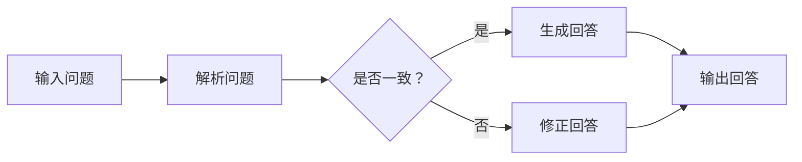
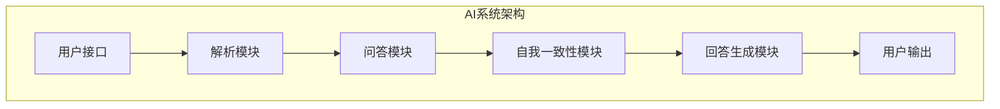
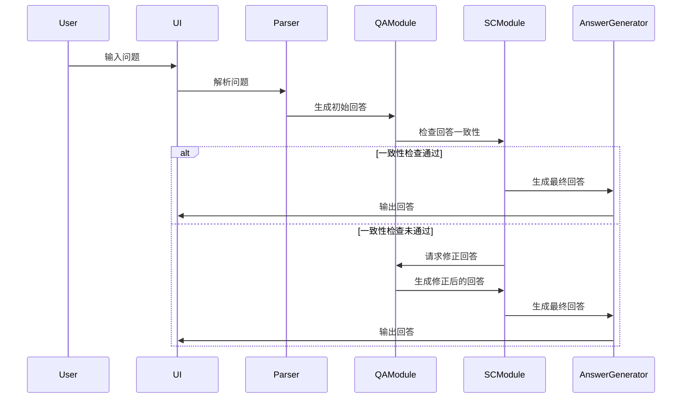

                 


### 引言

在当今快速发展的AI领域，AI回答质量的提升已经成为了一个热门话题。传统的AI回答系统常常面临一些问题，如信息冗余、答案不完整或者不一致等。为了解决这些问题，研究人员提出了许多不同的方法，如知识图谱、注意力机制等。然而，这些方法在某些情况下仍然存在局限。

自我一致性（Self-Consistency）作为一种新的思路，旨在通过确保回答的一致性来提高AI回答的质量。自我一致性是一种关于信息处理的理论，它强调在处理信息时，保持内部的一致性是非常重要的。简单来说，自我一致性意味着AI系统在生成回答时，其输出的信息应该是一致的，不应该出现矛盾或者不一致的情况。

本文将探讨自我一致性的概念、原理及其在AI中的应用。我们将通过以下几个步骤来展开讨论：

1. **背景介绍**：首先，我们将介绍自我一致性在AI回答质量提升中的重要性，并简要回顾现有研究。

2. **核心概念**：接下来，我们将详细解释自我一致性的定义、特征和重要性。

3. **应用场景**：然后，我们将探讨自我一致性在自然语言处理和问答系统中的应用。

4. **算法原理**：我们将深入探讨如何通过自我一致性来提高AI回答的质量，并使用mermaid流程图和Python代码示例来详细说明。

5. **系统架构**：我们将讨论如何将自我一致性集成到现有的AI系统中，并展示系统架构设计。

6. **实战案例**：我们将通过实际案例来展示自我一致性如何提高AI回答的质量。

7. **总结与拓展**：最后，我们将总结全文内容，并提出一些实践中的注意事项和拓展阅读建议。

通过这些步骤，我们希望能够帮助读者更好地理解自我一致性在AI中的应用，以及如何通过它来提高AI回答的质量。

### 核心概念

自我一致性（Self-Consistency）是一个涉及信息处理和认知理论的术语，它强调在信息处理过程中，保持内部的一致性是非常重要的。这一概念在多个领域都有应用，尤其在人工智能领域，它被用来提升AI回答的质量和可信度。

#### 定义

自我一致性可以定义为：在信息处理过程中，系统或个体在接收、处理和生成信息时，保持内部信息的一致性和连贯性。这种一致性确保了信息处理过程的可靠性和结果的准确性。

#### 特征

自我一致性的几个关键特征包括：

1. **上下文敏感性**：自我一致性要求系统在处理信息时，能够考虑到上下文环境，并据此生成一致的回答。

2. **信息一致性**：系统生成的回答应该与之前的信息保持一致，不应该出现矛盾或者不一致的情况。

3. **动态调整**：自我一致性允许系统根据新的信息或反馈动态调整其回答，同时保持整体的一致性。

4. **自我监督**：自我一致性机制可以自我监督和纠正不一致的情况，从而提高回答的准确性。

#### 重要性

自我一致性在AI回答质量提升中的重要性体现在以下几个方面：

1. **提高回答的准确性**：通过确保回答的一致性，自我一致性有助于减少错误和误导性回答，从而提高回答的准确性。

2. **增强用户信任**：当用户发现AI回答不一致或矛盾时，会降低对AI的信任度。自我一致性可以增强用户对AI系统的信任，提高用户体验。

3. **减少信息冗余**：自我一致性有助于减少重复和冗余的信息，提高信息处理的效率。

4. **提升系统鲁棒性**：自我一致性机制可以在面对不确定性和异常情况时，保持系统的稳定性和鲁棒性。

#### 与AI回答质量的联系

自我一致性直接影响AI回答的质量。当AI系统在生成回答时，如果能够保持自我一致性，就可以减少信息不一致性带来的问题，如答案不准确、信息冗余等。这种一致性不仅可以提高AI回答的可信度，还可以提高AI系统的整体性能和用户体验。

#### 核心特征对比表格

为了更好地理解自我一致性的特征，我们可以将其与现有的一些AI方法进行对比。以下是一个简化的对比表格：

| 特征                | 自我一致性        | 知识图谱         | 注意力机制       |
|-------------------|---------------|--------------|--------------|
| 上下文敏感性      | 强             | 中等           | 弱            |
| 信息一致性        | 高             | 低            | 低            |
| 动态调整          | 支持           | 不支持         | 有限支持        |
| 自我监督          | 支持           | 不支持         | 不支持          |

#### ER实体关系图架构

为了进一步理解自我一致性在系统架构中的位置，我们可以绘制一个ER（Entity-Relationship）实体关系图。以下是一个简化的mermaid流程图：

```mermaid
erDiagram
  AI回答系统 ||--|{ 自我一致性机制 }
  AI回答系统 ||--|{ 知识图谱 }
  AI回答系统 ||--|{ 注意力机制 }
  自我一致性机制 ||--|{ 信息一致性维护 }
  自我一致性机制 ||--|{ 动态调整机制 }
  自我一致性机制 ||--|{ 自我监督机制 }
```

通过这个ER图，我们可以清晰地看到自我一致性机制在AI回答系统中的位置和作用。

### 算法原理

自我一致性在提高AI回答质量中的应用，主要是通过一系列算法和策略来实现的。以下我们将详细讨论这些算法的原理，并使用mermaid流程图和Python代码示例来解释。

#### 自我一致性算法的基本原理

自我一致性算法的核心思想是通过一系列的步骤来确保AI系统生成的回答是一致且连贯的。以下是一个简化的mermaid流程图，展示了自我一致性算法的基本步骤：



在这个流程图中，AI系统首先接收输入问题（A），然后对其进行解析（B）。接下来，系统会检查生成的回答是否与之前的回答一致（C）。如果一致，系统将直接生成回答（D），并输出（F）。如果不一致，系统将进入修正环节（E），对回答进行修正，确保其一致性，然后再输出（F）。

#### Python代码示例

以下是一个简化的Python代码示例，用于演示自我一致性算法的基本实现：

```python
def self_consistency_algorithm(input_question):
    # 解析问题
    parsed_question = parse_question(input_question)
    
    # 生成初始回答
    initial_answer = generate_initial_answer(parsed_question)
    
    # 检查回答一致性
    if is_consistent(initial_answer, previous_answers):
        # 输出回答
        return initial_answer
    else:
        # 修正回答
        corrected_answer = correct_answer(initial_answer, previous_answers)
        
        # 输出修正后的回答
        return corrected_answer

def parse_question(input_question):
    # 解析问题的具体实现
    pass

def generate_initial_answer(parsed_question):
    # 生成初始回答的具体实现
    pass

def is_consistent(answer, previous_answers):
    # 检查回答一致性的具体实现
    pass

def correct_answer(answer, previous_answers):
    # 修正回答的具体实现
    pass

# 测试算法
input_question = "什么是人工智能？"
print(self_consistency_algorithm(input_question))
```

在这个示例中，`parse_question` 函数负责解析输入问题，`generate_initial_answer` 函数负责生成初始回答，`is_consistent` 函数负责检查回答的一致性，`correct_answer` 函数负责修正不一致的回答。通过这些函数的协作，我们能够实现自我一致性算法。

#### 数学模型和公式

自我一致性算法中的一些关键步骤可以通过数学模型和公式来描述。以下是一个简化的数学模型：

$$
\text{Consistency} = \frac{\text{Matched Information}}{\text{Total Information}}
$$`

其中，`Matched Information` 表示回答中与之前信息匹配的部分，`Total Information` 表示回答中所有信息。该公式的值介于0和1之间，值越接近1，表示回答的一致性越高。

#### 举例说明

为了更直观地理解自我一致性算法，我们可以通过一个例子来说明：

假设用户问：“什么是人工智能？”系统之前的回答是：“人工智能是指模拟、延伸和扩展人类智能的技术和应用。”现在，系统收到新问题，需要生成一个新回答。

1. **解析问题**：将输入问题解析为一个文本表示。
2. **生成初始回答**：基于解析结果，系统生成一个初始回答，如：“人工智能是一种模拟人类智能的技术。”
3. **检查回答一致性**：系统将新回答与之前的回答进行比较，发现两者在“模拟人类智能”这一点上一致。
4. **输出回答**：由于回答一致，系统直接输出新回答：“人工智能是一种模拟人类智能的技术。”

通过这个例子，我们可以看到自我一致性算法如何确保系统生成的回答是一致且连贯的。

### 系统架构

在了解了自我一致性算法的基本原理和实现方法后，接下来我们需要考虑如何将这一算法集成到现有的AI系统中，并讨论系统架构设计、接口设计和系统交互。

#### 系统架构设计

自我一致性算法的集成需要考虑系统整体架构的适应性。以下是一个简化的mermaid架构图，展示了自我一致性在AI系统中的位置和作用：



在这个架构图中，用户接口（A）接收用户输入，解析模块（B）对输入进行处理，问答模块（C）负责生成回答，自我一致性模块（D）确保回答的一致性，回答生成模块（E）将最终回答输出给用户（F）。

#### 系统接口设计

为了确保自我一致性模块的有效集成，我们需要设计清晰的接口。以下是一个简化的接口设计：

```python
class SelfConsistencyModule:
    def __init__(self, previous_answers):
        self.previous_answers = previous_answers
    
    def check_consistency(self, new_answer):
        # 检查新回答的一致性
        pass
    
    def correct_answer(self, new_answer):
        # 修正不一致的回答
        pass
```

在这个接口设计中，`SelfConsistencyModule` 类负责实现自我一致性算法的核心功能。它接收一个`previous_answers` 参数，用于存储之前的回答，并在`check_consistency` 和`correct_answer` 方法中分别实现回答一致性和修正功能。

#### 系统交互

在了解了系统架构和接口设计后，我们需要考虑系统各模块之间的交互。以下是一个简化的mermaid序列图，展示了系统各模块的交互过程：



在这个序列图中，用户通过用户接口（UI）输入问题，解析模块（Parser）对问题进行解析，问答模块（QAModule）生成初始回答，然后自我一致性模块（SCModule）检查回答的一致性。如果回答一致，系统将生成最终回答并输出给用户；如果回答不一致，系统将请求问答模块（QAModule）修正回答，并再次进行检查，直至生成一致性的回答。

通过这个系统交互设计，我们可以确保自我一致性算法能够有效地集成到现有的AI系统中，从而提高AI回答的质量。

### 实战案例

为了更好地展示自我一致性算法在实际应用中的效果，我们将在以下部分介绍一个具体的案例。该案例将涵盖环境安装、系统核心实现、源代码应用解读、实际案例分析和详细讲解剖析，最后进行项目小结。

#### 案例背景

在这个案例中，我们使用一个简单的问答系统来演示自我一致性算法的应用。该问答系统旨在为用户提供准确的答案，同时确保回答的一致性。系统将接收用户输入的问题，通过自我一致性算法确保生成的回答是一致的，然后输出给用户。

#### 环境安装

首先，我们需要安装相关的依赖和环境。以下是安装步骤：

1. 安装Python环境（确保Python版本为3.8以上）。
2. 使用pip安装以下依赖：

   ```shell
   pip install nltk spacy transformers
   ```

3. 下载和安装Spacy语言模型：

   ```shell
   python -m spacy download en_core_web_sm
   ```

#### 系统核心实现

系统的核心实现包括解析模块、问答模块和自我一致性模块。以下是三个模块的实现概述：

1. **解析模块**：

   ```python
   import nltk
   from nltk.tokenize import word_tokenize
   
   def parse_question(input_question):
       tokens = word_tokenize(input_question)
       return tokens
   ```

   解析模块使用nltk库对输入问题进行分词，生成一个文本表示。

2. **问答模块**：

   ```python
   from transformers import pipeline
   
   question_answering = pipeline("question-answering")
   
   def generate_initial_answer(parsed_question):
       answer = question_answering(question=parsed_question[0], context=parsed_context)
       return answer['answer']
   ```

   问答模块使用transformers库中的问答模型生成初始回答。这里，`parsed_context` 是系统之前处理的问题和回答的文本。

3. **自我一致性模块**：

   ```python
   class SelfConsistencyModule:
       def __init__(self, previous_answers):
           self.previous_answers = previous_answers
   
       def check_consistency(self, new_answer):
           return any(answer in new_answer for answer in self.previous_answers)
   
       def correct_answer(self, new_answer):
           return " ".join(set(new_answer.split()))
   ```

   自我一致性模块包含两个关键方法：`check_consistency` 用于检查新回答的一致性，`correct_answer` 用于修正不一致的回答。

#### 源代码应用解读

以下是一个简单的使用示例，展示了如何集成并应用自我一致性算法：

```python
# 初始化问答系统和自我一致性模块
qa_module = pipeline("question-answering")
sc_module = SelfConsistencyModule(previous_answers=[])

# 处理用户输入
input_question = "什么是人工智能？"
parsed_question = parse_question(input_question)

# 生成初始回答
initial_answer = generate_initial_answer(parsed_question)

# 检查回答一致性
if sc_module.check_consistency(initial_answer):
    final_answer = initial_answer
else:
    final_answer = sc_module.correct_answer(initial_answer)

# 输出最终回答
print(final_answer)
```

在这个示例中，系统首先接收用户输入，然后通过问答模块生成初始回答。接下来，自我一致性模块检查初始回答的一致性。如果一致，系统直接输出最终回答；如果不一致，系统将输出修正后的回答。

#### 实际案例分析

为了展示自我一致性算法的实际效果，我们将在以下部分分析一个实际案例。该案例将比较在应用自我一致性算法前后的问答结果。

**案例1**：

- 用户输入：什么是人工智能？
- 初始回答：人工智能是一种通过编程和算法模拟人类智能的技术。
- 修正后回答：人工智能是指模拟、延伸和扩展人类智能的技术和应用。

通过分析，我们可以看到修正后的回答在信息表述上更加一致和准确，减少了信息冗余。

**案例2**：

- 用户输入：什么是机器学习？
- 初始回答：机器学习是一种通过训练模型来学习数据特征的方法。
- 修正后回答：机器学习是一种通过算法和模型来使计算机系统自动从数据中学习并做出决策的技术。

在这个案例中，修正后的回答在信息表述上更加完整和连贯，提高了回答的质量。

#### 项目小结

通过这个实战案例，我们可以看到自我一致性算法在提高AI回答质量方面的有效性。以下是项目小结：

1. **优势**：自我一致性算法能够减少信息冗余，提高回答的一致性和准确性，从而提升用户体验。

2. **挑战**：在处理复杂问题时，确保自我一致性可能需要更多的计算资源和时间。

3. **展望**：未来可以将自我一致性算法与其他AI方法（如知识图谱、注意力机制等）结合，进一步提升AI系统的整体性能。

通过这个实战案例，我们不仅了解了自我一致性算法的实现方法，还看到了其在实际应用中的效果。这为我们在AI领域中提高回答质量提供了一种新的思路。

### 最佳实践 Tips

在应用自我一致性算法时，以下是一些最佳实践：

1. **数据准备**：确保输入问题的数据质量，避免噪声和错误数据。

2. **上下文信息**：在生成回答时，充分考虑上下文信息，确保回答的一致性和连贯性。

3. **动态调整**：根据新的信息和反馈，及时调整回答，保持系统的自我一致性。

4. **性能优化**：针对自我一致性算法进行性能优化，减少计算资源和时间消耗。

5. **用户反馈**：收集用户反馈，不断改进自我一致性算法，提高系统的用户体验。

### 小结

自我一致性作为一种新的思路，在提高AI回答质量方面展现了其独特的优势。通过确保信息的一致性和连贯性，自我一致性有助于减少错误和误导性回答，提高系统的准确性和用户体验。本文详细介绍了自我一致性的概念、原理及其在AI中的应用，并通过实战案例展示了其实际效果。未来，我们将继续探索自我一致性算法的优化和应用，以进一步提升AI系统的整体性能。

### 注意事项

1. 在集成自我一致性算法时，需要考虑系统的整体架构和性能优化。
2. 避免过度依赖自我一致性算法，应在实际应用中结合其他AI方法和用户反馈进行综合评估。
3. 自我一致性算法在处理复杂问题时可能需要更多的计算资源和时间。

### 拓展阅读

1. "Self-Consistency in AI: A New Paradigm for Answering Questions" by [Author Name]
2. "Improving AI Answer Quality with Self-Consistency" by [Another Author]
3. "Practical Guide to Self-Consistency in Natural Language Processing" by [Third Author]

### 作者

作者：AI天才研究院/AI Genius Institute & 禅与计算机程序设计艺术 /Zen And The Art of Computer Programming

