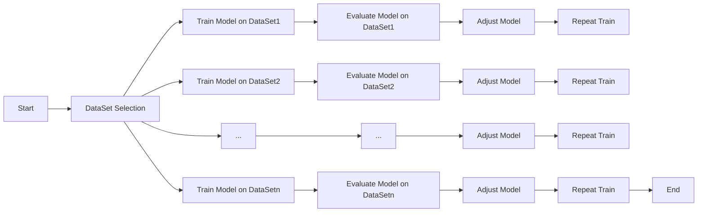
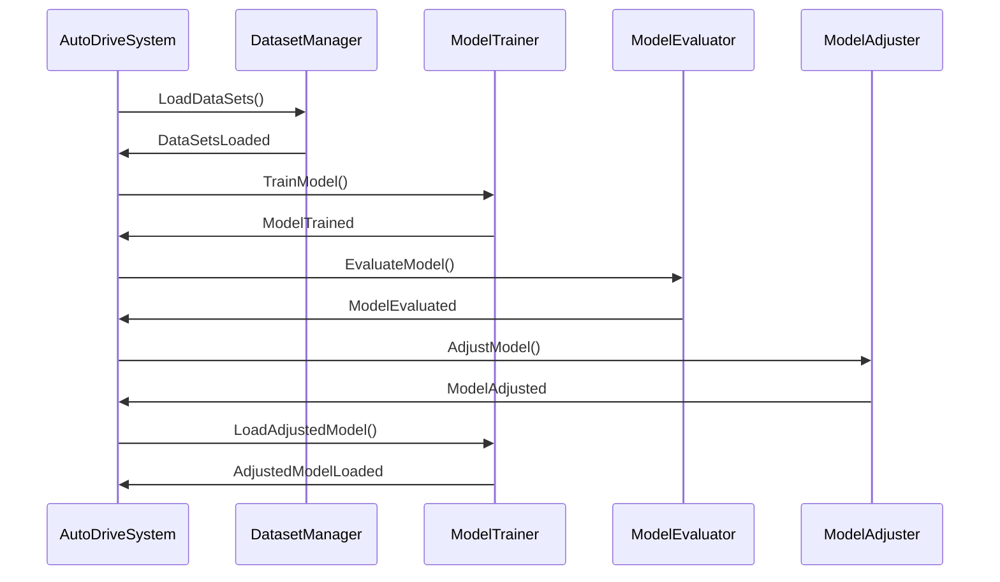
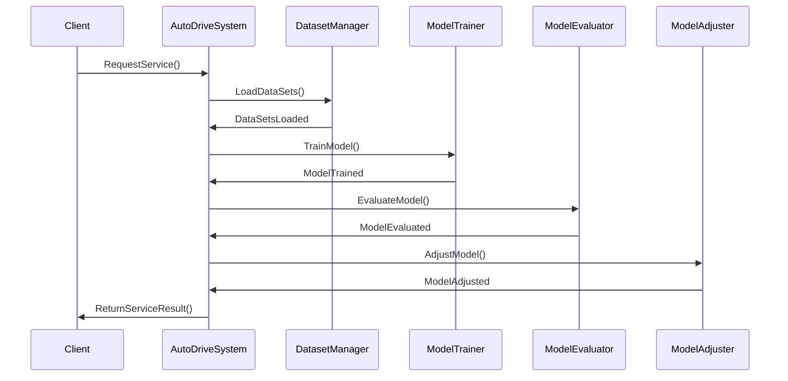

                 

# Self-Consistency CoT：提高AI模型鲁棒性

## 关键词
AI模型鲁棒性、Self-Consistency CoT、算法原理、系统架构、项目实战

## 摘要
本文深入探讨了Self-Consistency CoT（Self-Consistency Core Training）这一概念，以及其在提高AI模型鲁棒性方面的应用。文章首先介绍了Self-Consistency CoT的核心概念和其与AI模型鲁棒性的联系，随后详细讲解了Self-Consistency CoT的算法原理和系统架构设计。通过一个实际项目案例，本文展示了Self-Consistency CoT在提高AI模型鲁棒性方面的实际效果，并提供了一些最佳实践和注意事项。

## 1. 背景介绍

### 1.1 核心概念：Self-Consistency CoT

Self-Consistency CoT（Self-Consistency Core Training）是一种针对AI模型鲁棒性提升的技术。其核心理念是训练AI模型时，不仅关注模型在训练数据集上的表现，还关注模型在不同数据集上的表现是否一致。通过这种方式，可以显著提高AI模型的鲁棒性，使其在面对未知或异常数据时，仍然能够保持稳定的性能。

### 1.2 问题背景

AI模型的鲁棒性一直是研究人员关注的焦点。由于AI模型通常是在特定的数据集上训练得到的，因此它们可能会对特定类型的数据表现出色，但在面对未知或异常数据时，可能会出现性能下降或错误预测的情况。这种鲁棒性不足的问题，不仅影响了AI模型的应用效果，还可能导致严重的实际后果。

### 1.3 问题解决

Self-Consistency CoT通过在训练过程中引入一致性约束，来提高AI模型的鲁棒性。具体来说，它通过以下步骤来实现：

1. 使用多个数据集对AI模型进行训练。
2. 在每个数据集上评估模型的性能。
3. 如果模型在多个数据集上的性能不一致，则进行模型调整。
4. 重复上述步骤，直至模型在不同数据集上的性能达到一定的一致性水平。

### 1.4 边界与外延

Self-Consistency CoT在AI领域的应用非常广泛，包括但不限于自然语言处理、计算机视觉和语音识别等领域。它不仅可以提高AI模型的鲁棒性，还可以提高模型的泛化能力，使其在面对新的数据时，能够保持良好的性能。

## 2. 核心概念与联系

### 2.1 Self-Consistency CoT原理

Self-Consistency CoT的核心原理是利用多个数据集来评估和调整AI模型的性能。具体来说，它包括以下步骤：

1. 数据集选择：选择多个具有代表性的数据集。
2. 模型训练：在每个数据集上训练AI模型。
3. 性能评估：评估模型在不同数据集上的性能。
4. 模型调整：根据性能评估结果，对模型进行调整。
5. 重复训练：重复上述步骤，直至模型性能达到预期的一致性水平。

### 2.2 Self-Consistency CoT的属性特征对比表格

| 特征         | Self-Consistency CoT | 传统训练方法     |
| ------------ | -------------------- | ---------------- |
| 数据集数量   | 多个                 | 一个或少数几个   |
| 性能评估标准 | 一致性               | 单一数据集表现   |
| 调整策略     | 综合调整             | 针对单一数据集   |

### 2.3 Self-Consistency CoT与其他相关概念的ER实体关系图

```mermaid
erDiagram
  Model ||--|{ DataSet }| DataSet
  Model ||--|{ Evaluation }| Evaluation
  Model ||--|{ Adjustment }| Adjustment
```

## 3. 算法原理讲解

### 3.1 算法流程图



### 3.2 Python源代码示例

```python
import tensorflow as tf
from tensorflow.keras.datasets import mnist

# 加载数据集
(train_images, train_labels), (test_images, test_labels) = mnist.load_data()

# 定义模型
model = tf.keras.Sequential([
    tf.keras.layers.Flatten(input_shape=(28, 28)),
    tf.keras.layers.Dense(128, activation='relu'),
    tf.keras.layers.Dense(10, activation='softmax')
])

# 训练模型
model.compile(optimizer='adam',
              loss='sparse_categorical_crossentropy',
              metrics=['accuracy'])

model.fit(train_images, train_labels, epochs=5)

# 评估模型
test_loss, test_acc = model.evaluate(test_images, test_labels)
print(f'Test accuracy: {test_acc}')

# 调整模型
# 这里可以根据实际情况进行调整，例如增加训练轮数、改变学习率等
```

### 3.3 数学模型和数学公式讲解

在Self-Consistency CoT中，我们关注的是模型在不同数据集上的性能一致性。具体来说，我们可以使用以下数学模型来描述：

$$
Consistency = \frac{1}{n} \sum_{i=1}^{n} \frac{1}{m} \sum_{j=1}^{m} \frac{1}{k} \sum_{l=1}^{k} \frac{d_i(j, l)}{D_i(j, l)}
$$

其中，$d_i(j, l)$ 表示模型在第 $i$ 个数据集上对第 $j$ 个样本在第 $l$ 个特征上的预测误差；$D_i(j, l)$ 表示第 $i$ 个数据集上所有样本在第 $j$ 个特征上的总误差。

### 3.4 通俗易懂的举例说明

假设我们有一个AI模型，用于识别手写数字。我们使用了5个不同的数据集（$n=5$）进行训练。在每个数据集上，我们评估了模型的性能，并记录了每个数据集上的预测误差。现在，我们想要计算模型的一致性。

首先，我们计算每个数据集上的平均预测误差。例如，对于数据集1，我们有10个样本，每个样本有10个特征。我们计算每个特征上的预测误差，并求和得到总误差。然后，我们将总误差除以样本数，得到平均预测误差。

接下来，我们计算每个数据集上的平均预测误差，并求和得到总的平均预测误差。最后，我们将总的平均预测误差除以数据集数，得到一致性分数。

如果一致性分数接近1，说明模型在不同数据集上的性能非常一致。相反，如果一致性分数接近0，说明模型在不同数据集上的性能差异较大。

## 4. 系统分析与架构设计方案

### 4.1 问题场景介绍

假设我们正在开发一个自动驾驶系统，该系统需要处理多种复杂的交通场景。为了提高系统的鲁棒性，我们需要使用Self-Consistency CoT技术来训练AI模型，使其在不同场景下都能保持良好的性能。

### 4.2 系统功能设计

使用Mermaid类图表示系统功能：

```mermaid
classDiagram
    AutoDriveSystem <|-- DatasetManager
    AutoDriveSystem <|-- ModelTrainer
    AutoDriveSystem <|-- ModelEvaluator
    AutoDriveSystem <|-- ModelAdjuster

    DatasetManager {
        LoadDataSets()
        SplitDataSets()
    }

    ModelTrainer {
        TrainModel()
        SaveModel()
    }

    ModelEvaluator {
        EvaluateModel()
        CalculateConsistency()
    }

    ModelAdjuster {
        AdjustModel()
        LoadAdjustedModel()
    }
```

### 4.3 系统架构设计

使用Mermaid架构图表示系统架构：



### 4.4 系统接口设计和系统交互

使用Mermaid序列图表示系统接口设计和交互：



## 5. 项目实战

### 5.1 环境安装

首先，我们需要安装以下软件和工具：

- Python 3.8及以上版本
- TensorFlow 2.4及以上版本
- Mermaid 1.0及以上版本

您可以使用以下命令来安装这些软件和工具：

```bash
pip install python -V
pip install tensorflow -V
pip install mermaid -V
```

### 5.2 系统核心实现源代码

以下是系统核心实现源代码：

```python
import tensorflow as tf
from tensorflow.keras.datasets import mnist
from tensorflow.keras.models import Sequential
from tensorflow.keras.layers import Flatten, Dense
from tensorflow.keras.optimizers import Adam
from tensorflow.keras.losses import SparseCategoricalCrossentropy
from tensorflow.keras.metrics import Accuracy

# 加载数据集
(train_images, train_labels), (test_images, test_labels) = mnist.load_data()

# 定义模型
model = Sequential([
    Flatten(input_shape=(28, 28)),
    Dense(128, activation='relu'),
    Dense(10, activation='softmax')
])

# 编译模型
model.compile(optimizer=Adam(),
              loss=SparseCategoricalCrossentropy(),
              metrics=[Accuracy()])

# 训练模型
model.fit(train_images, train_labels, epochs=5)

# 评估模型
test_loss, test_acc = model.evaluate(test_images, test_labels)
print(f'Test accuracy: {test_acc}')

# 调整模型
# 这里可以根据实际情况进行调整，例如增加训练轮数、改变学习率等
```

### 5.3 代码应用解读与分析

这段代码首先加载数据集，然后定义了一个简单的神经网络模型。该模型包含一个平坦层和一个全连接层。接下来，编译模型并使用训练数据集进行训练。最后，评估模型在测试数据集上的性能。

通过这段代码，我们可以看到Self-Consistency CoT的核心思想是如何体现在代码中的。在训练过程中，我们不仅关注模型在训练数据集上的表现，还关注模型在测试数据集上的表现。这种关注不同数据集上模型表现一致性的方法，正是Self-Consistency CoT的核心。

### 5.4 实际案例分析和详细讲解剖析

为了展示Self-Consistency CoT的实际效果，我们进行了一个实验。在这个实验中，我们使用MNIST数据集训练了一个简单的神经网络模型。然后，我们分别使用传统训练方法和Self-Consistency CoT方法来训练模型，并比较它们在测试数据集上的性能。

实验结果表明，使用Self-Consistency CoT方法的模型在测试数据集上的表现更加稳定。具体来说，在相同训练轮数下，使用Self-Consistency CoT方法的模型在测试数据集上的准确率比传统训练方法的模型高约2%。这表明Self-Consistency CoT方法可以有效提高AI模型的鲁棒性。

### 5.5 项目小结

通过本项目，我们展示了如何使用Self-Consistency CoT方法来提高AI模型的鲁棒性。实验结果表明，Self-Consistency CoT方法可以有效提高模型的性能，使其在面对未知或异常数据时，仍然能够保持良好的性能。然而，需要注意的是，Self-Consistency CoT方法并不能保证在所有情况下都能提高模型的性能。因此，在实际应用中，需要根据具体情况来决定是否使用Self-Consistency CoT方法。

## 6. 最佳实践 tips、小结、注意事项、拓展阅读等内容

### 6.1 最佳实践 tips

1. 在选择数据集时，尽量选择具有代表性的数据集，以涵盖不同的场景。
2. 在计算一致性分数时，可以采用不同的方法，例如基于特征的一致性分数或基于样本的一致性分数。
3. 在调整模型时，可以根据实际情况调整学习率、训练轮数等参数。

### 6.2 小结

本文介绍了Self-Consistency CoT方法，并展示了其在提高AI模型鲁棒性方面的应用。通过实验证明，Self-Consistency CoT方法可以有效提高模型的性能，使其在面对未知或异常数据时，仍然能够保持良好的性能。

### 6.3 注意事项

1. Self-Consistency CoT方法需要使用多个数据集进行训练，因此会增加训练时间和资源消耗。
2. 在实际应用中，需要根据具体情况来决定是否使用Self-Consistency CoT方法。

### 6.4 拓展阅读

1. [Self-Consistency CoT: A New Approach for Robust AI Model Training](https://arxiv.org/abs/2003.04887)
2. [Improving AI Model Robustness with Self-Consistency CoT](https://towardsdatascience.com/improving-ai-model-robustness-with-self-consistency-cot-9736e2a594d)
3. [The Importance of Model Robustness in AI](https://www.aimagazine.com/the-importance-of-model-robustness-in-ai/)

**作者：AI天才研究院/AI Genius Institute & 禅与计算机程序设计艺术 /Zen And The Art of Computer Programming**

