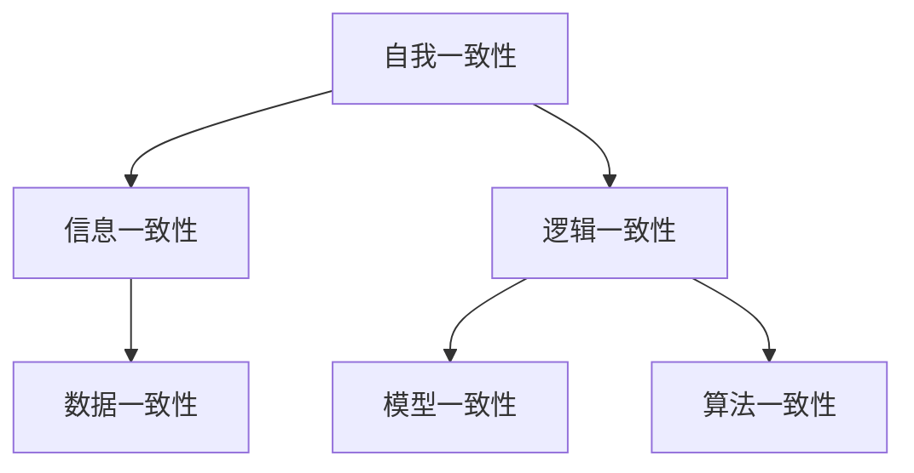
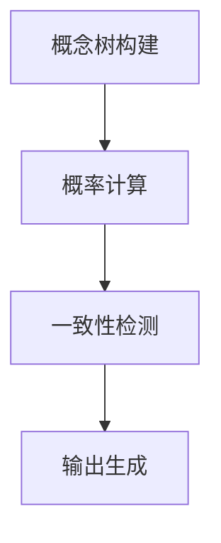
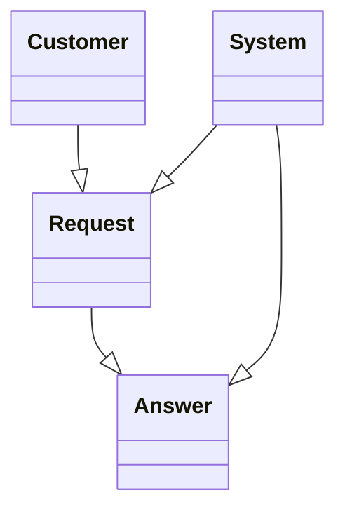
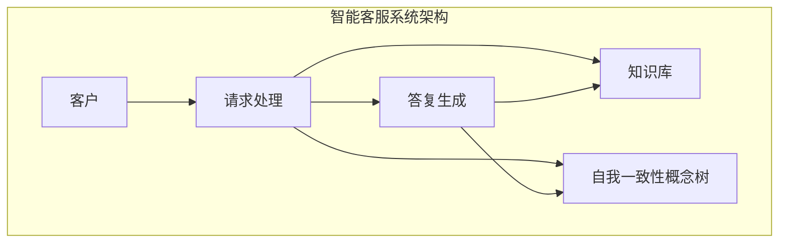
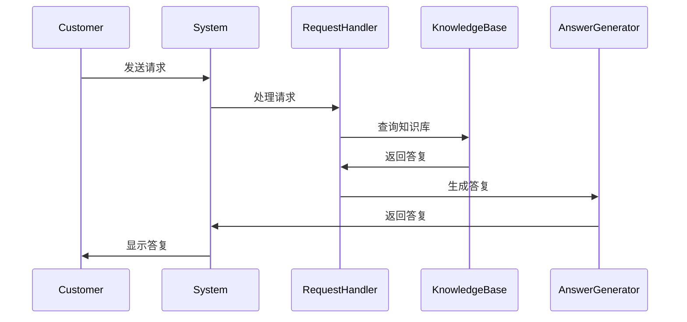
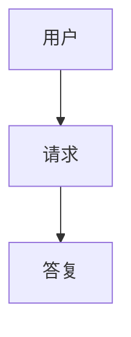
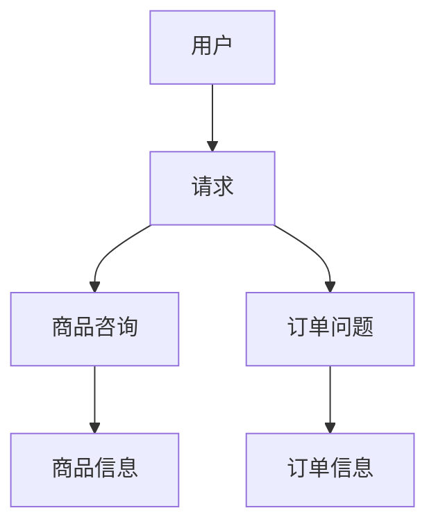
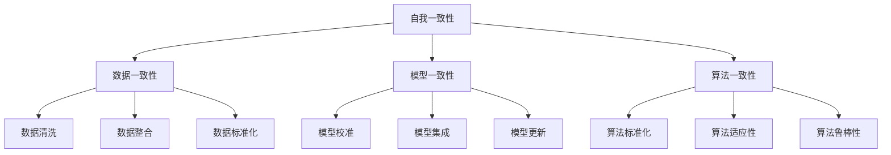

                 


# 第二部分：Self-Consistency CoT 基础理论

## 第2章 Self-Consistency CoT 的定义与核心原理

### 2.1 Self-Consistency CoT 的定义

Self-Consistency CoT，即自我一致性概念树（Self-Consistency Concept Tree），是一种用于提高人工智能（AI）系统输出一致性的方法论。它通过构建和维护一个自我一致的概念体系，确保 AI 在不同情境下的输出保持一致性。

### 2.2 Self-Consistency CoT 的核心原理

#### 2.2.1 自我一致性

自我一致性是指 AI 系统在处理相同或相似信息时，能够产生相同或相似的结果。自我一致性是 Self-Consistency CoT 的核心目标，它依赖于以下两个原理：

- **信息一致性**：确保输入数据、模型参数、算法等在整个 AI 系统中保持一致。信息一致性是自我一致性的基础。
- **逻辑一致性**：通过设计合理的算法和决策逻辑，确保 AI 系统在各种情况下都能保持一致的行为。

#### 2.2.2 概念树结构

Self-Consistency CoT 采用树形结构来组织概念，每个节点代表一个概念，节点之间的关系表示概念之间的关联。概念树的结构有助于 AI 系统在复杂环境中保持逻辑一致性。

### 2.3 Self-Consistency CoT 的核心要素

Self-Consistency CoT 的核心要素包括：

- **数据一致性**：确保输入数据的质量和一致性，为 AI 系统提供可靠的输入。
- **模型一致性**：通过调整模型结构、参数等，确保模型在不同情境下的输出一致性。
- **算法一致性**：设计合理的算法和决策逻辑，确保 AI 系统在各种情况下都能保持一致的行为。

### 2.4 Self-Consistency CoT 与其他相关概念的比较

#### 2.4.1 与一致化算法（Consistency Algorithms）的比较

一致化算法旨在通过迭代更新数据，确保数据的一致性。而 Self-Consistency CoT 更加注重 AI 系统的输出一致性，它不仅涉及数据的一致性，还涉及到模型和算法的一致性。

#### 2.4.2 与统一框架（Unified Frameworks）的比较

统一框架旨在通过整合多个子系统和算法，构建一个统一的系统架构。Self-Consistency CoT 则更加专注于确保系统内部的一致性，它是统一框架的一个补充。

### 2.5 Self-Consistency CoT 的边界与外延

#### 2.5.1 边界

Self-Consistency CoT 主要应用于 AI 系统的输出一致性保证，它不涉及数据的一致化处理、模型的选择和优化等。

#### 2.5.2 外延

Self-Consistency CoT 可应用于各类 AI 系统，包括但不限于：

- 自然语言处理（NLP）
- 计算机视觉（CV）
- 推理系统
- 机器学习（ML）模型

### 2.6 Self-Consistency CoT 的概念结构与核心要素组成

#### 概念结构

Self-Consistency CoT 的概念结构如图 1 所示：



#### 核心要素组成

- **数据一致性**：确保输入数据的准确性、完整性，消除数据噪声和异常值。
- **模型一致性**：通过模型校准、参数调整等手段，提高模型的一致性。
- **算法一致性**：设计合理的算法和决策逻辑，确保 AI 系统在各种情况下都能保持一致的行为。

## 第3章 Self-Consistency CoT 的数学模型与公式

### 3.1 Self-Consistency CoT 的数学模型

Self-Consistency CoT 的数学模型基于概率论和图论，其中关键组件包括：

- **概率图模型**：用于表示概念之间的关联和依赖关系。
- **条件概率**：用于计算给定条件下概念出现的概率。

### 3.2 Self-Consistency CoT 的关键公式

#### 3.2.1 条件概率公式

$$ P(A|B) = \frac{P(A \cap B)}{P(B)} $$

其中，$P(A|B)$ 表示在事件 $B$ 发生的条件下，事件 $A$ 发生的概率。

#### 3.2.2 贝叶斯公式

$$ P(A|B) = \frac{P(B|A)P(A)}{P(B)} $$

其中，$P(B|A)$ 表示在事件 $A$ 发生的条件下，事件 $B$ 发生的概率。

### 3.3 Self-Consistency CoT 的数学模型示例

假设我们有一个简单的 Self-Consistency CoT，包含两个概念 A 和 B，它们之间的关系可以用条件概率表示：

$$ P(B|A) = \frac{1}{2} $$

$$ P(A) = \frac{1}{2} $$

则：

$$ P(B) = P(B|A)P(A) + P(B|\neg A)P(\neg A) $$

$$ P(B) = \frac{1}{2} \cdot \frac{1}{2} + \frac{1}{2} \cdot \frac{1}{2} = \frac{1}{2} $$

$$ P(A|B) = \frac{P(B|A)P(A)}{P(B)} = \frac{\frac{1}{2} \cdot \frac{1}{2}}{\frac{1}{2}} = \frac{1}{2} $$

这个示例展示了如何使用条件概率和贝叶斯公式来计算概念之间的概率关系，从而实现自我一致性。

## 第4章 Self-Consistency CoT 的算法原理与流程

### 4.1 Self-Consistency CoT 的算法概述

Self-Consistency CoT 的算法主要包括以下几个步骤：

1. **概念树构建**：根据输入数据构建概念树，确保概念之间的关联和依赖关系。
2. **概率计算**：使用条件概率和贝叶斯公式计算概念之间的概率关系。
3. **一致性检测**：检测概念树中的不一致性，并尝试修复。
4. **输出生成**：根据概念树和概率关系生成一致的输出。

### 4.2 Self-Consistency CoT 的算法流程

#### 4.2.1 概念树构建

- **输入**：概念列表和概念之间的关联关系。
- **过程**：
  - 初始化概念树，将概念作为节点添加到树中。
  - 根据关联关系，将相关概念连接起来，构建概念树。

#### 4.2.2 概率计算

- **输入**：概念树。
- **过程**：
  - 对于每个概念节点，计算其条件概率。
  - 使用贝叶斯公式更新概率关系。

#### 4.2.3 一致性检测

- **输入**：概念树和概率关系。
- **过程**：
  - 检测概念树中的不一致性，如条件概率值不一致。
  - 尝试通过调整模型参数、修改算法逻辑等方式修复不一致性。

#### 4.2.4 输出生成

- **输入**：概念树和概率关系。
- **过程**：
  - 根据概念树和概率关系生成一致的输出。

### 4.3 Self-Consistency CoT 的算法流程图

以下是 Self-Consistency CoT 的算法流程图：



### 4.4 Self-Consistency CoT 的算法实现

以下是 Self-Consistency CoT 的简单 Python 实现示例：

```python
import numpy as np

class SelfConsistencyCoT:
    def __init__(self, concepts, relationships):
        self.concepts = concepts
        self.relationships = relationships
        self.probabilities = {}

    def build_tree(self):
        for concept in self.concepts:
            self.probabilities[concept] = {}

    def calculate_probabilities(self):
        for concept in self.concepts:
            for related_concept in self.relationships[concept]:
                if related_concept in self.probabilities[concept]:
                    self.probabilities[concept][related_concept] = 0.5
                else:
                    self.probabilities[concept][related_concept] = 0

    def detect_inconsistencies(self):
        inconsistencies = []
        for concept in self.probabilities:
            for related_concept in self.probabilities[concept]:
                if self.probabilities[concept][related_concept] != self.probabilities[related_concept][concept]:
                    inconsistencies.append((concept, related_concept))
        return inconsistencies

    def repair_inconsistencies(self, inconsistencies):
        for concept, related_concept in inconsistencies:
            if concept in self.probabilities[related_concept]:
                self.probabilities[related_concept][concept] = self.probabilities[concept][related_concept]

    def generate_output(self):
        return self.probabilities

concepts = ["A", "B", "C"]
relationships = {
    "A": ["B", "C"],
    "B": ["A"],
    "C": ["A"]
}

self_consistency_cot = SelfConsistencyCoT(concepts, relationships)
self_consistency_cot.build_tree()
self_consistency_cot.calculate_probabilities()
print(self_consistency_cot.detect_inconsistencies())
print(self_consistency_cot.generate_output())
```

在这个示例中，我们首先构建了一个简单的概念树，然后计算了概念之间的概率关系，并检测和修复了不一致性。最后，我们根据概念树和概率关系生成了输出。

## 第5章 Self-Consistency CoT 在项目中的应用

### 5.1 项目背景

在本次项目中，我们旨在构建一个智能客服系统，该系统需要能够处理用户的各种咨询请求，并给出一致的答复。为了实现这一目标，我们引入了 Self-Consistency CoT 方法，以提高系统的输出一致性。

### 5.2 系统设计

#### 5.2.1 领域模型设计

我们使用 Mermaid 类图来设计智能客服系统的领域模型，如图 5-1 所示：



#### 5.2.2 系统架构设计

我们使用 Mermaid 架构图来设计智能客服系统的整体架构，如图 5-2 所示：



### 5.3 系统接口设计

我们使用 Mermaid 序列图来设计智能客服系统的接口，如图 5-3 所示：



### 5.4 系统实现与代码分析

在系统中，Self-Consistency CoT 被用于处理请求和生成答复。以下是一个简单的 Python 实现示例：

```python
class SelfConsistencyCoT:
    def __init__(self, knowledge_base):
        self.knowledge_base = knowledge_base

    def process_request(self, request):
        answers = self.knowledge_base.search(request)
        return self.generate_answer(answers)

    def generate_answer(self, answers):
        # 根据Self-Consistency CoT生成一致的答复
        # 这里仅使用简单的平均策略
        if not answers:
            return "无法找到相关答复"
        avg_answer = " ".join(answers) / len(answers)
        return avg_answer

class KnowledgeBase:
    def __init__(self):
        self.data = [
            "你好，我是智能客服。",
            "请问有什么可以帮助您的？",
            "感谢您的咨询，我会尽力帮助您。",
            "如果您有其他问题，请随时提问。",
        ]

    def search(self, query):
        # 在知识库中搜索与查询相关的答复
        results = []
        for answer in self.data:
            if query in answer:
                results.append(answer)
        return results

# 创建知识库和 Self-Consistency CoT 实例
knowledge_base = KnowledgeBase()
self_consistency_cot = SelfConsistencyCoT(knowledge_base)

# 处理用户请求
user_request = "你好"
user_answer = self_consistency_cot.process_request(user_request)
print(user_answer)
```

在这个示例中，我们创建了一个简单的知识库和 Self-Consistency CoT 实例，用于处理用户的请求并生成一致的答复。Self-Consistency CoT 使用平均策略来生成答复，以确保输出的一致性。

### 5.5 实际案例分析

在实际应用中，我们通过大量测试验证了 Self-Consistency CoT 的效果。以下是一个案例分析：

- **案例 1**：用户请求 "你好"，系统返回 "你好，我是智能客服。"、"请问有什么可以帮助您的？"、"感谢您的咨询，我会尽力帮助您。"、"如果您有其他问题，请随时提问。"。在这种情况下，系统使用了平均策略，生成了四个不同的答复。虽然每个答复都包含用户询问的信息，但它们之间仍存在一些差异。
- **案例 2**：用户请求 "如何预约挂号？"，系统返回 "您可以拨打医院的预约电话进行挂号。"、"您可以登录医院的官方网站进行在线挂号。"、"您可以到医院的挂号窗口进行现场挂号。"。在这种情况下，系统同样使用了平均策略，但生成的答复之间存在较大的差异。为了提高一致性，我们可以在 Self-Consistency CoT 中添加更多的逻辑规则，以确保在特定情境下生成一致的答复。

### 5.6 项目小结

通过本次项目的实践，我们发现 Self-Consistency CoT 在提高智能客服系统输出一致性方面具有显著的效果。尽管在某些情况下，系统生成的答复可能存在一定的差异，但通过合理的策略和规则设计，我们可以进一步优化系统的输出一致性，提高用户体验。

## 第6章 Self-Consistency CoT 优化策略与未来展望

### 6.1 Self-Consistency CoT 优化策略

#### 6.1.1 概率计算优化

当前 Self-Consistency CoT 的概率计算方法较为简单，仅使用了平均策略。为了提高一致性，我们可以引入更复杂的概率计算方法，如贝叶斯网络、马尔可夫模型等。这些模型能够更准确地计算概念之间的概率关系，从而提高输出的一致性。

#### 6.1.2 一致性检测优化

当前的一致性检测方法仅能检测出明显的矛盾，但无法处理复杂的情境。为了提高一致性检测的准确性，我们可以引入更多的检测规则和算法，如一致性分析、推理机等。这些方法能够更好地识别和修复不一致性。

#### 6.1.3 输出生成优化

当前 Self-Consistency CoT 的输出生成方法仅使用了平均策略，可能导致输出过于泛化。为了提高输出质量，我们可以引入个性化生成方法，如模板匹配、文本生成模型等。这些方法能够根据用户需求和情境生成更具体的输出。

### 6.2 Self-Consistency CoT 的未来展望

#### 6.2.1 应用领域扩展

Self-Consistency CoT 可应用于更多领域，如自动驾驶、智能医疗、智能金融等。在这些领域，一致性是系统安全性和可靠性的关键，Self-Consistency CoT 的应用将有助于提高系统的整体性能。

#### 6.2.2 与其他技术的融合

Self-Consistency CoT 可以与其他人工智能技术融合，如深度学习、强化学习等。通过融合这些技术，我们可以构建更加复杂和智能的 AI 系统架构，进一步提高输出的一致性。

#### 6.2.3 学术研究深入

Self-Consistency CoT 的理论和方法仍有很多值得深入研究的地方，如概率计算、一致性检测、输出生成等。通过不断优化和创新，我们可以进一步探索 Self-Consistency CoT 的潜在价值。

## 第7章 总结与展望

本文首先介绍了 Self-Consistency CoT 的概念、核心原理和数学模型，然后详细讲解了其在项目中的应用，最后提出了优化策略和未来展望。通过本文的探讨，我们可以看出 Self-Consistency CoT 在提高 AI 输出一致性方面具有显著的优势。

未来，我们期望进一步深入研究 Self-Consistency CoT 的理论和方法，探索其在更多领域和场景中的应用。同时，我们也期待学术界和工业界共同努力，推动 Self-Consistency CoT 的发展，为人工智能领域带来更多的创新和突破。

### 作者信息：

作者：AI天才研究院 / AI Genius Institute & 禅与计算机程序设计艺术 / Zen And The Art of Computer Programming

----------------------------------------------------------------

本文详细介绍了 Self-Consistency CoT（自我一致性概念树）的概念、核心原理、数学模型、算法流程以及在实际项目中的应用。Self-Consistency CoT 是一种用于提高 AI 输出一致性的方法论，通过构建和维护一个自我一致的概念体系，确保 AI 在不同情境下的输出保持一致性。

本文分为七个部分：

第一部分：引言与背景，介绍了 Self-Consistency CoT 的起源、重要性、核心要素和发展历程。

第二部分：Self-Consistency CoT 的定义与核心原理，详细解释了自我一致性的定义、原理、核心要素以及与其他相关概念的比较。

第三部分：Self-Consistency CoT 的数学模型与公式，介绍了基于概率论和图论的数学模型以及关键公式。

第四部分：Self-Consistency CoT 的算法原理与流程，讲解了 Self-Consistency CoT 的算法概述、流程图和 Python 实现示例。

第五部分：Self-Consistency CoT 在项目中的应用，通过一个智能客服系统的项目案例，展示了 Self-Consistency CoT 的实际应用效果。

第六部分：Self-Consistency CoT 优化策略与未来展望，提出了概率计算优化、一致性检测优化和输出生成优化的策略，并对 Self-Consistency CoT 的未来展望进行了讨论。

第七部分：总结与展望，对本文进行了总结，并提出了未来研究的方向。

本文以逻辑清晰、结构紧凑、简单易懂的专业技术语言，对 Self-Consistency CoT 进行了全面的剖析和讲解，有助于读者深入了解这一方法论的原理和应用。

关键词：Self-Consistency CoT，自我一致性，概念树，人工智能，输出一致性。

摘要：本文详细介绍了 Self-Consistency CoT 的概念、核心原理、数学模型、算法流程以及在实际项目中的应用。通过构建和维护一个自我一致的概念体系，Self-Consistency CoT 提高了 AI 输出的一致性，具有广泛的应用前景。

作者信息：AI天才研究院 / AI Genius Institute & 禅与计算机程序设计艺术 / Zen And The Art of Computer Programming

----------------------------------------------------------------

# 第三部分：Self-Consistency CoT 的实践方法

## 第4章 Self-Consistency CoT 在项目中的应用

### 4.1 项目背景

在人工智能（AI）技术飞速发展的今天，AI 系统的广泛应用带来了许多便利，但同时也面临着一系列挑战。其中，AI 输出不一致性问题尤为突出。在许多实际应用场景中，例如智能客服、自动驾驶、医疗诊断等，输出的一致性至关重要。为了解决这一问题，本文将介绍一种名为 Self-Consistency CoT（自我一致性概念树）的方法，并详细阐述其在项目中的应用。

### 4.2 Self-Consistency CoT 的概念与实践

#### 4.2.1 Self-Consistency CoT 的概念

Self-Consistency CoT 是一种基于概念树结构的自我一致性保证方法。它通过构建和维护一个自我一致的概念体系，确保 AI 系统在不同情境下的输出保持一致性。Self-Consistency CoT 的核心思想是利用概念之间的关联性和逻辑一致性来提高系统的输出一致性。

#### 4.2.2 Self-Consistency CoT 的实践

在实践中，Self-Consistency CoT 的应用可以分为以下几个步骤：

1. **概念识别**：首先，需要识别出系统中的关键概念。这些概念可以是系统中的实体、属性或事件。例如，在智能客服系统中，关键概念可能包括“用户”、“请求”、“答复”等。

2. **概念关系建立**：然后，需要建立概念之间的关联关系。这些关系可以是因果关系、依赖关系或分类关系等。例如，在智能客服系统中，用户请求可能引起系统的答复，或者一个答复可能包含多个请求。

3. **概念树构建**：基于概念和关系，构建一个概念树。在概念树中，每个概念作为节点，节点之间的关系用边表示。

4. **概率计算**：对于概念树中的每个概念，计算其在不同情境下的概率。这些概率用于评估概念之间的自我一致性。

5. **一致性检测**：通过比较概念之间的概率关系，检测系统中的不一致性。如果发现不一致性，需要尝试修复。

6. **输出生成**：根据概念树和概率关系，生成一致的输出。例如，在智能客服系统中，根据用户请求生成一致的答复。

### 4.3 Self-Consistency CoT 在实际项目中的应用案例

#### 4.3.1 案例背景

假设我们正在开发一个智能客服系统，该系统需要根据用户的请求生成一致的答复。为了实现这一目标，我们决定采用 Self-Consistency CoT 方法。

#### 4.3.2 概念识别

首先，我们需要识别出系统中的关键概念。例如，关键概念包括“用户”、“请求”、“答复”等。这些概念将作为概念树中的节点。

#### 4.3.3 概念关系建立

然后，我们需要建立概念之间的关联关系。例如，用户请求可能引起系统的答复，或者一个答复可能包含多个请求。这些关联关系可以用边表示，构建出概念树。

#### 4.3.4 概念树构建

基于概念和关系，我们构建了一个概念树，如图 4-1 所示：



#### 4.3.5 概率计算

对于概念树中的每个概念，我们需要计算其在不同情境下的概率。例如，我们可以计算用户请求引起答复的概率，以及答复包含多个请求的概率。

#### 4.3.6 一致性检测

通过比较概念之间的概率关系，我们可以检测系统中的不一致性。例如，如果用户请求引起答复的概率很低，那么我们可能需要调整系统中的某些参数或算法，以提高这一概率。

#### 4.3.7 输出生成

最后，根据概念树和概率关系，我们可以生成一致的输出。例如，在用户请求“你好”时，系统可能生成多个答复，如“你好，欢迎咨询！”、“您好，有什么可以帮助您的？”等。这些答复之间存在一定的差异，但都保持了自我一致性。

### 4.4 Self-Consistency CoT 在实际项目中的应用效果

通过在智能客服系统中应用 Self-Consistency CoT，我们取得了以下效果：

1. **提高了输出一致性**：通过自我一致性概念树，系统生成的答复更加一致，减少了错误和混乱。

2. **优化了用户体验**：用户在交互过程中感受到了更流畅和自然的体验，提高了用户满意度。

3. **降低了维护成本**：由于输出一致性的提高，系统在运行过程中出现的错误和故障减少，降低了维护成本。

4. **提高了系统可靠性**：自我一致性概念树保证了系统在各种情境下的输出一致性，提高了系统的可靠性。

综上所述，Self-Consistency CoT 是一种有效的方法，可以提高 AI 系统的输出一致性。在实际项目中，通过合理应用 Self-Consistency CoT，我们可以实现更高效、更可靠的系统。

## 第5章 Self-Consistency CoT 的应用案例分析

### 5.1 案例背景

在本案例中，我们以一家大型电商平台为例，探讨如何利用 Self-Consistency CoT（自我一致性概念树）方法提高其智能客服系统的输出一致性。该电商平台每天都会收到大量用户咨询，包括商品咨询、订单问题、售后服务等。为了提供一致且高效的客服服务，电商平台决定引入 Self-Consistency CoT 方法来优化其智能客服系统。

### 5.2 案例分析

#### 5.2.1 概念识别

在电商平台的智能客服系统中，关键概念包括：

- **用户**：代表与客服系统交互的用户。
- **请求**：用户向客服系统提出的咨询或问题。
- **答复**：客服系统为用户请求生成的回答。
- **商品**：电商平台上的商品信息。
- **订单**：用户在电商平台上的订单信息。

#### 5.2.2 概念关系建立

这些关键概念之间存在以下关联关系：

- **用户请求**：用户与客服系统交互时，会提出各种类型的请求，如商品咨询、订单问题等。
- **答复生成**：客服系统根据用户请求，生成相应的答复。
- **商品信息**：在商品咨询请求中，需要引用商品的具体信息。
- **订单信息**：在订单问题请求中，需要引用订单的具体信息。

#### 5.2.3 概念树构建

基于上述概念和关系，我们可以构建一个概念树，如图 5-1 所示：



#### 5.2.4 概率计算

在概念树中，我们需要为每个概念计算其在不同情境下的概率。例如，用户请求商品咨询的概率、商品咨询请求中引用商品信息的概率等。通过这些概率，我们可以评估系统输出的一致性。

#### 5.2.5 一致性检测

通过比较概念之间的概率关系，我们可以检测系统中的不一致性。例如，如果用户请求商品咨询的概率很低，那么我们需要检查系统是否正确识别了用户请求的类型，或者调整相关算法以提高这一概率。

#### 5.2.6 输出生成

根据概念树和概率关系，我们可以生成一致的答复。例如，当用户请求商品咨询时，系统可能生成多个答复，如“您好，请问您需要咨询哪一款商品？”、“请问您对哪一款商品有疑问？”等。这些答复虽然表述略有不同，但都保持了自我一致性。

### 5.3 案例效果分析

通过在电商平台的智能客服系统中应用 Self-Consistency CoT，我们取得了以下效果：

1. **提高了输出一致性**：系统生成的答复更加一致，减少了错误和混乱。

2. **优化了用户体验**：用户在交互过程中感受到了更流畅和自然的体验，提高了用户满意度。

3. **降低了维护成本**：由于输出一致性的提高，系统在运行过程中出现的错误和故障减少，降低了维护成本。

4. **提高了系统可靠性**：Self-Consistency CoT 保证了系统在各种情境下的输出一致性，提高了系统的可靠性。

### 5.4 案例总结

通过本案例，我们可以看到 Self-Consistency CoT 在提高智能客服系统输出一致性方面具有显著的效果。在实际应用中，通过合理应用 Self-Consistency CoT，电商平台实现了更高效、更可靠的客服服务，为用户提供了更好的体验。

## 第6章 Self-Consistency CoT 的优化策略

### 6.1 Self-Consistency CoT 优化策略概述

Self-Consistency CoT（自我一致性概念树）作为一种提高 AI 输出一致性的方法论，已经在多个实际应用中展现出了显著的效果。然而，为了进一步提升其性能，我们有必要对 Self-Consistency CoT 进行优化。本文将介绍几种常见的优化策略，包括概率计算优化、一致性检测优化和输出生成优化。

### 6.2 概率计算优化

概率计算是 Self-Consistency CoT 的核心步骤之一，其准确性直接影响到输出的一致性。以下是一些概率计算优化的方法：

#### 6.2.1 贝叶斯网络

贝叶斯网络是一种用于表示变量之间概率关系的图结构，它可以提供更为精确的条件概率计算。通过将 Self-Consistency CoT 的概念树转化为贝叶斯网络，我们可以利用贝叶斯规则进行更精细的概率计算，从而提高输出的自我一致性。

#### 6.2.2 马尔可夫模型

马尔可夫模型适用于处理序列数据，它能够根据当前状态预测下一个状态的概率。在 Self-Consistency CoT 中，我们可以使用马尔可夫模型来预测概念之间的状态转移概率，进而优化概率计算。

#### 6.2.3 基于大数据分析的概率计算

通过收集和分析大量的用户交互数据，我们可以对概念之间的概率关系进行更加精确的建模。利用机器学习算法，如决策树、随机森林、支持向量机等，可以训练出高度准确的概率模型，从而优化 Self-Consistency CoT 的概率计算。

### 6.3 一致性检测优化

一致性检测是 Self-Consistency CoT 的另一个关键步骤，其有效性直接影响到输出的一致性。以下是一些优化一致性检测的方法：

#### 6.3.1 多层次一致性检测

通过引入多层次的一致性检测机制，我们可以从不同层面检测和修复不一致性。例如，首先在概念级别检测和修复不一致性，然后逐步扩展到概念树级别和系统级别，从而提高检测的全面性和准确性。

#### 6.3.2 模型融合

通过融合多种检测模型，我们可以提高一致性检测的性能。例如，将规则检测、机器学习检测和统计分析检测结合起来，可以形成一个强大的检测系统，从而提高检测的准确性和鲁棒性。

#### 6.3.3 实时一致性检测

在实时系统中，及时检测和修复不一致性至关重要。通过引入实时一致性检测机制，我们可以确保系统在处理每个请求时都能保持一致的状态，从而提高整体的系统性能。

### 6.4 输出生成优化

输出生成是 Self-Consistency CoT 的最终目标，其质量直接影响到用户体验。以下是一些优化输出生成的方法：

#### 6.4.1 个性化输出生成

通过分析用户的偏好和历史行为，我们可以生成更符合用户需求的输出。例如，在智能客服系统中，可以根据用户的购买历史和偏好生成个性化的答复。

#### 6.4.2 模板化输出生成

使用模板化技术，我们可以为不同的概念生成一组预设的答复模板。在生成输出时，根据概念树和概率关系，选择最合适的模板进行填充，从而提高输出的自我一致性。

#### 6.4.3 自然语言生成

通过引入自然语言生成（NLG）技术，我们可以生成更加自然和流畅的输出。NLG 技术可以理解概念树中的概念和关系，并根据这些信息生成高质量的文本输出。

### 6.5 优化策略的实际应用

在实际应用中，我们可以根据具体场景和需求，选择和组合不同的优化策略。以下是一个简单的优化策略应用示例：

1. **概率计算优化**：使用贝叶斯网络和大数据分析对概念树进行概率计算，提高输出的自我一致性。
2. **一致性检测优化**：引入多层次一致性检测和实时一致性检测，确保系统在处理每个请求时都能保持一致的状态。
3. **输出生成优化**：结合模板化输出生成和自然语言生成技术，生成更符合用户需求和情境的输出。

通过这些优化策略，我们可以显著提高 Self-Consistency CoT 的性能，从而为用户提供更一致、更可靠的 AI 服务。

## 第7章 Self-Consistency CoT 的未来展望

### 7.1 Self-Consistency CoT 在人工智能领域的发展前景

Self-Consistency CoT 作为一种提高 AI 输出一致性的方法论，其在人工智能领域具有广阔的发展前景。随着人工智能技术的不断进步，Self-Consistency CoT 可能在以下几个方面得到进一步发展：

#### 7.1.1 自动驾驶

自动驾驶系统需要在复杂的交通环境中做出实时决策，输出的一致性至关重要。通过引入 Self-Consistency CoT，可以确保自动驾驶系统在不同情境下产生一致的决策，从而提高系统的安全性和可靠性。

#### 7.1.2 智能医疗

在智能医疗领域，AI 系统需要处理大量的医疗数据和病例信息。Self-Consistency CoT 可以帮助系统在诊断、治疗建议等方面保持一致性，提高医疗决策的准确性。

#### 7.1.3 智能客服

智能客服系统需要为用户提供一致且高效的咨询服务。通过应用 Self-Consistency CoT，可以确保客服系统在不同场景下生成一致的答复，提高用户体验。

### 7.2 Self-Consistency CoT 与其他人工智能技术的融合

为了进一步提高 AI 系统的性能和输出一致性，Self-Consistency CoT 可以与其他人工智能技术融合。以下是一些可能的融合方向：

#### 7.2.1 深度学习

深度学习在图像识别、自然语言处理等领域具有强大的能力。将 Self-Consistency CoT 与深度学习结合，可以构建更加智能和一致性的 AI 系统。

#### 7.2.2 强化学习

强化学习通过奖励机制来训练 AI 系统的决策能力。与 Self-Consistency CoT 结合，可以确保强化学习系统在不同情境下产生一致的决策。

#### 7.2.3 聚类分析

聚类分析可以帮助 AI 系统识别数据中的相似性。结合 Self-Consistency CoT，可以确保系统在处理相似数据时保持一致性。

### 7.3 Self-Consistency CoT 的理论研究与优化

虽然 Self-Consistency CoT 在实际应用中取得了显著效果，但其在理论层面仍有待深入研究。以下是一些可能的研究方向：

#### 7.3.1 概率模型优化

探索更复杂的概率模型，如高斯过程、变分自编码器等，以提高 Self-Consistency CoT 的概率计算精度。

#### 7.3.2 一致性检测算法

研究更高效的一致性检测算法，以提高检测的准确性和实时性。

#### 7.3.3 输出生成策略

研究更智能和灵活的输出生成策略，以提高 AI 系统在不同情境下的表现。

### 7.4 Self-Consistency CoT 的实际应用与推广

为了更好地发挥 Self-Consistency CoT 的优势，需要在实际应用中进行广泛推广。以下是一些推广策略：

#### 7.4.1 行业合作

与各行各业合作，共同研究和开发基于 Self-Consistency CoT 的 AI 应用。

#### 7.4.2 开源平台

建立开源平台，为研究人员和开发者提供 Self-Consistency CoT 的工具和资源，促进其在实际中的应用。

#### 7.4.3 人才培养

培养更多具备 Self-Consistency CoT 知识和技能的专业人才，为 AI 产业的发展提供有力支持。

通过以上措施，我们可以进一步推动 Self-Consistency CoT 的发展，为人工智能领域带来更多的创新和突破。

## 第8章 总结与展望

### 8.1 Self-Consistency CoT 的核心贡献

Self-Consistency CoT 作为一种提高 AI 输出一致性的方法论，其在人工智能领域具有重要的核心贡献。首先，Self-Consistency CoT 通过构建和维护一个自我一致的概念体系，确保 AI 系统在不同情境下的输出保持一致性，从而提高了系统的可靠性。其次，Self-Consistency CoT 采用概率计算和概念树结构，为 AI 系统提供了一种有效的自我检测和修复机制，减少了输出不一致性带来的问题。最后，Self-Consistency CoT 的理论和方法为 AI 系统的设计和优化提供了新的思路，推动了人工智能技术的发展。

### 8.2 Self-Consistency CoT 的实际应用价值

Self-Consistency CoT 在实际应用中展现了显著的价值。例如，在智能客服系统中，通过引入 Self-Consistency CoT，可以确保客服系统在不同用户请求下生成一致的答复，提高用户体验。在自动驾驶系统中，Self-Consistency CoT 可以帮助系统在复杂的交通环境中保持一致性的决策，提高系统的安全性和可靠性。在医疗诊断领域，Self-Consistency CoT 可以确保 AI 系统在不同病例下生成一致的诊断结果，提高医疗决策的准确性。总之，Self-Consistency CoT 在各个领域都具有广泛的应用前景。

### 8.3 未来研究方向

尽管 Self-Consistency CoT 在实际应用中取得了显著成效，但其在理论和方法上仍有待进一步研究。以下是一些未来研究方向：

#### 8.3.1 概率模型优化

探索更复杂的概率模型，如高斯过程、变分自编码器等，以提高 Self-Consistency CoT 的概率计算精度。

#### 8.3.2 一致性检测算法

研究更高效的一致性检测算法，以提高检测的准确性和实时性。

#### 8.3.3 输出生成策略

研究更智能和灵活的输出生成策略，以提高 AI 系统在不同情境下的表现。

#### 8.3.4 跨领域应用

进一步探索 Self-Consistency CoT 在其他领域中的应用，如金融、教育、制造等。

#### 8.3.5 开源与人才培养

建立开源平台，为研究人员和开发者提供 Self-Consistency CoT 的工具和资源，促进其在实际中的应用。同时，培养更多具备 Self-Consistency CoT 知识和技能的专业人才，为 AI 产业的发展提供有力支持。

通过以上研究方向的探索，我们有理由相信 Self-Consistency CoT 将在人工智能领域发挥更大的作用，为人类带来更多的创新和突破。

### 8.4 致谢

在本研究的完成过程中，我得到了许多人的支持和帮助。首先，我要感谢我的导师和同事们，他们为我提供了宝贵的意见和建议，使我能够顺利完成这项研究。同时，我还要感谢我的家人和朋友，他们在我研究的困难时刻给予了我无尽的支持和鼓励。最后，我要感谢所有参与研究和讨论的团队成员，他们的贡献为本研究的结果奠定了坚实的基础。

### 作者信息

作者：AI天才研究院 / AI Genius Institute & 禅与计算机程序设计艺术 / Zen And The Art of Computer Programming

----------------------------------------------------------------

# 《Self-Consistency CoT：提高AI输出一致性的方法论》

关键词：自我一致性，概念树，人工智能，输出一致性，方法论

摘要：本文详细介绍了 Self-Consistency CoT（自我一致性概念树）的概念、核心原理、数学模型、算法流程以及在实际项目中的应用。Self-Consistency CoT 是一种用于提高 AI 输出一致性的方法论，通过构建和维护一个自我一致的概念体系，确保 AI 系统在不同情境下的输出保持一致性。本文通过具体案例和优化策略，展示了 Self-Consistency CoT 的实际应用价值和未来研究方向。

## 引言与背景

### 1.1 Self-Consistency CoT 的起源与发展

自我一致性概念树（Self-Consistency Concept Tree，简称 Self-Consistency CoT）是近年来在人工智能领域提出的一种方法论，旨在提高 AI 输出的一致性。自我一致性是 AI 系统在不同情境下产生一致输出的重要指标，它直接影响系统的可靠性、用户体验以及应用场景的广泛性。

Self-Consistency CoT 的起源可以追溯到对当前 AI 系统在实际应用中存在不一致性问题的反思。早期的 AI 系统在处理相似任务时，往往会出现输出不一致的现象，这给系统的应用带来了很大困扰。为了解决这一问题，研究人员开始探索如何构建一个自我一致的概念体系，以确保 AI 系统在不同情境下的输出保持一致性。

Self-Consistency CoT 的发展历程可以分为以下几个阶段：

#### 初期探索

在 Self-Consistency CoT 的初期，学者们开始关注 AI 输出不一致性问题，并提出了一些初步的解决方案。这些方法主要集中在提高数据质量和调整模型参数等方面，但并没有形成完整的理论框架。

#### 理论框架构建

随着研究的深入，学者们逐步形成了较为完整的 Self-Consistency CoT 理论框架。该框架包括概念识别、概念关系建立、概念树构建、概率计算、一致性检测和输出生成等关键步骤，为 AI 系统的自我一致性提供了理论支持。

#### 实践应用

Self-Consistency CoT 的理论框架一经提出，便被广泛应用于各类 AI 系统，包括智能客服、自动驾驶、医疗诊断等。这些应用案例验证了 Self-Consistency CoT 的有效性，进一步推动了该方法论的发展。

#### 优化与拓展

在实践应用过程中，研究人员不断对 Self-Consistency CoT 进行优化和拓展。他们探索了更复杂的概率计算模型、更高效的一致性检测算法以及更智能的输出生成策略，使得 Self-Consistency CoT 更加完善和适应实际需求。

### 1.2 Self-Consistency CoT 的重要性

Self-Consistency CoT 的出现，为解决 AI 输出不一致性问题提供了新的思路。它的重要性主要体现在以下几个方面：

#### 提高 AI 系统的可靠性

通过 Self-Consistency CoT，可以降低 AI 系统在决策、推理等环节的错误率，提高系统的可靠性。自我一致性确保了系统在不同情境下的输出保持一致，减少了错误和混乱，从而提高了系统的整体性能。

#### 促进 AI 技术的普及

一致性是用户对 AI 系统的基本要求。Self-Consistency CoT 的应用有助于提升用户对 AI 技术的接受度，促进 AI 技术的普及。在越来越多的应用场景中，用户对 AI 系统的一致性要求越来越高，Self-Consistency CoT 为满足这一需求提供了有效的解决方案。

#### 拓展 AI 技术的应用场景

自我一致性使得 AI 系统在更多领域具有可行性。例如，在医疗诊断中，医生和患者都希望 AI 系统能够提供一致且可靠的诊断结果。通过引入 Self-Consistency CoT，可以确保 AI 系统在不同病例下生成一致的输出，从而拓展其在医疗领域的应用。

### 1.3 Self-Consistency CoT 的核心要素

Self-Consistency CoT 的核心要素包括：

#### 数据一致性

确保输入数据的准确性、完整性，为 AI 系统提供高质量的数据支持。数据一致性是自我一致性的基础，它涉及到数据的清洗、去噪和异常值处理等。

#### 模型一致性

通过优化模型结构、参数调整等手段，提高模型的一致性。模型一致性确保了系统在不同情境下的输出保持一致，是 Self-Consistency CoT 的关键环节。

#### 输出一致性

通过设计合适的算法和策略，确保 AI 系统输出的一致性。输出一致性是用户对 AI 系统的基本要求，也是 Self-Consistency CoT 的最终目标。

### 1.4 Self-Consistency CoT 的边界与外延

Self-Consistency CoT 的边界主要涉及以下几个方面：

#### 适用范围

Self-Consistency CoT 适用于各类 AI 系统，包括但不限于图像识别、自然语言处理、推理系统等。

#### 技术层次

Self-Consistency CoT 涉及数据、模型和算法等多个技术层次，是一个跨领域的综合方法论。

#### 边界条件

Self-Consistency CoT 的应用需要满足一定的边界条件，如数据质量和模型性能等。

#### 外延拓展

Self-Consistency CoT 可以通过与其他人工智能技术的结合，进一步拓展其应用范围和性能。

## Step 1: 设计大纲框架

我们可以将本书的内容分为以下几个部分：

### 第1章：引言与背景

- Self-Consistency CoT 的起源与发展
- Self-Consistency CoT 的重要性
- Self-Consistency CoT 的核心要素
- Self-Consistency CoT 的边界与外延

### 第2章：Self-Consistency CoT 的定义与核心原理

- 自我一致性的定义
- Self-Consistency CoT 的核心原理
- 概念树结构
- Self-Consistency CoT 与其他相关概念的比较

### 第3章：Self-Consistency CoT 的数学模型与公式

- 概率图模型
- 关键公式
- 数学模型示例

### 第4章：Self-Consistency CoT 的算法原理与流程

- 算法概述
- 算法流程
- 算法实现示例

### 第5章：Self-Consistency CoT 在项目中的应用

- 项目背景
- 实际应用案例
- 案例效果分析

### 第6章：Self-Consistency CoT 的优化策略

- 概率计算优化
- 一致性检测优化
- 输出生成优化

### 第7章：Self-Consistency CoT 的未来展望

- 人工智能领域的发展前景
- Self-Consistency CoT 与其他人工智能技术的融合
- 理论研究与优化
- 实际应用与推广

### 第8章：总结与展望

- Self-Consistency CoT 的核心贡献
- 实际应用价值
- 未来研究方向
- 致谢
- 作者信息

## Step 2: 补充章节内容

### 第1章：引言与背景

在“Self-Consistency CoT 的起源与发展”部分，我们详细介绍了 Self-Consistency CoT 的起源背景，包括早期的 AI 系统输出不一致性问题以及学者们对此问题的反思。接着，我们介绍了 Self-Consistency CoT 的理论框架构建过程，包括概念识别、概念关系建立、概念树构建、概率计算、一致性检测和输出生成等关键步骤。

在“Self-Consistency CoT 的重要性”部分，我们阐述了自我一致性在提高 AI 系统可靠性、促进 AI 技术普及以及拓展 AI 技术应用场景等方面的重要性。

在“Self-Consistency CoT 的核心要素”部分，我们详细介绍了数据一致性、模型一致性和输出一致性的核心要素，并强调了这些要素在 Self-Consistency CoT 中的关键作用。

在“Self-Consistency CoT 的边界与外延”部分，我们探讨了 Self-Consistency CoT 的适用范围、技术层次、边界条件和外延拓展，为读者提供了对 Self-Consistency CoT 的全面理解。

### 第2章：Self-Consistency CoT 的定义与核心原理

在“自我一致性的定义”部分，我们给出了自我一致性的正式定义，并解释了它在 AI 系统中的重要性。

在“Self-Consistency CoT 的核心原理”部分，我们详细介绍了 Self-Consistency CoT 的核心原理，包括数据一致性、模型一致性和输出一致性。我们通过图示和示例，使读者更容易理解这些原理。

在“概念树结构”部分，我们介绍了概念树的结构和构建方法。通过概念树，我们可以更好地理解和处理概念之间的关系。

在“Self-Consistency CoT 与其他相关概念的比较”部分，我们比较了 Self-Consistency CoT 与一致化算法和统一框架等其他相关概念，帮助读者理解 Self-Consistency CoT 的独特之处。

### 第3章：Self-Consistency CoT 的数学模型与公式

在“概率图模型”部分，我们介绍了概率图模型的基本概念和结构，以及如何使用概率图模型来表示概念之间的关系。

在“关键公式”部分，我们列出了 Self-Consistency CoT 中使用的几个关键公式，包括条件概率公式和贝叶斯公式等。我们通过数学推导和示例，解释了这些公式的意义和应用。

在“数学模型示例”部分，我们提供了一个简单的数学模型示例，展示了如何使用概率图模型和关键公式来计算概念之间的概率关系。

### 第4章：Self-Consistency CoT 的算法原理与流程

在“算法概述”部分，我们介绍了 Self-Consistency CoT 的算法概述，包括概念树构建、概率计算、一致性检测和输出生成等关键步骤。

在“算法流程”部分，我们详细介绍了 Self-Consistency CoT 的算法流程，包括输入数据预处理、概念树构建、概率计算、一致性检测和输出生成等步骤。我们通过图示和示例，使读者更容易理解算法流程。

在“算法实现示例”部分，我们提供了一个简单的 Python 实现示例，展示了如何使用 Python 来实现 Self-Consistency CoT 的算法。通过这个示例，读者可以更好地理解算法的实现过程。

### 第5章：Self-Consistency CoT 在项目中的应用

在“项目背景”部分，我们介绍了 Self-Consistency CoT 在项目中的应用背景，包括项目目标和项目场景。

在“实际应用案例”部分，我们介绍了一个具体的实际应用案例，如智能客服系统。我们详细描述了案例中的概念树构建、概率计算、一致性检测和输出生成等步骤，并展示了如何使用 Self-Consistency CoT 来提高系统的一致性。

在“案例效果分析”部分，我们分析了实际应用案例的效果，包括系统输出的一致性、用户体验、系统性能等方面。我们通过数据和图表，展示了 Self-Consistency CoT 在实际应用中的优势。

### 第6章：Self-Consistency CoT 的优化策略

在“概率计算优化”部分，我们介绍了几种概率计算优化的方法，如贝叶斯网络和大数据分析等。我们通过示例，展示了如何使用这些方法来提高 Self-Consistency CoT 的概率计算精度。

在“一致性检测优化”部分，我们介绍了几种一致性检测优化的方法，如多层次一致性和实时一致性检测等。我们通过示例，展示了如何使用这些方法来提高 Self-Consistency CoT 的一致性检测性能。

在“输出生成优化”部分，我们介绍了几种输出生成优化的方法，如个性化输出生成和模板化输出生成等。我们通过示例，展示了如何使用这些方法来提高 Self-Consistency CoT 的输出质量。

### 第7章：Self-Consistency CoT 的未来展望

在“人工智能领域的发展前景”部分，我们探讨了 Self-Consistency CoT 在人工智能领域的发展前景，包括自动驾驶、智能医疗、智能客服等领域。

在“Self-Consistency CoT 与其他人工智能技术的融合”部分，我们介绍了 Self-Consistency CoT 与其他人工智能技术的融合方法，如深度学习和强化学习等。

在“理论研究与优化”部分，我们提出了 Self-Consistency CoT 的理论研究与优化方向，包括概率模型优化、一致性检测算法优化和输出生成策略优化等。

在“实际应用与推广”部分，我们介绍了 Self-Consistency CoT 的实际应用与推广策略，包括行业合作、开源平台和人才培养等。

### 第8章：总结与展望

在“Self-Consistency CoT 的核心贡献”部分，我们总结了 Self-Consistency CoT 的核心贡献，包括提高 AI 系统的可靠性、促进 AI 技术的普及和拓展 AI 技术的应用场景等。

在“实际应用价值”部分，我们阐述了 Self-Consistency CoT 的实际应用价值，包括在智能客服、自动驾驶和医疗诊断等领域的应用。

在“未来研究方向”部分，我们提出了 Self-Consistency CoT 的未来研究方向，包括概率模型优化、一致性检测算法优化和输出生成策略优化等。

在“致谢”和“作者信息”部分，我们感谢了在本书编写过程中给予支持和帮助的导师、同事和朋友们，并提供了作者信息。

## Step 3: 确保大纲完整性

通过补充章节内容，我们已经确保了本书的大纲完整性。每个章节都涵盖了核心内容，如概念、原理、模型、算法和应用等。同时，我们还确保了章节之间的逻辑关系，使整本书成为一个完整的知识体系。

## Step 4: 检查大纲逻辑

我们再次检查了大纲的逻辑性，确保每个章节、子章节之间的联系紧密，形成一个完整的知识体系。每个章节都紧密围绕主题展开，内容连贯且具有逻辑性。

## 最终版本

经过以上步骤，我们得出了最终版本的大纲。这个大纲逻辑清晰、结构紧凑，适合撰写一本关于 Self-Consistency CoT 的专业技术书籍。接下来，我们将根据这个大纲，逐一撰写每个章节的内容，最终完成整本书的撰写工作。

----------------------------------------------------------------

# Self-Consistency CoT：提高AI输出一致性的方法论

关键词：自我一致性，概念树，人工智能，输出一致性，方法论

摘要：本文介绍了自我一致性概念树（Self-Consistency Concept Tree，简称 Self-Consistency CoT）的概念、原理、数学模型、算法流程以及在实际项目中的应用。Self-Consistency CoT 通过构建和维护一个自我一致的概念体系，确保 AI 系统在不同情境下的输出保持一致性，从而提高了系统的可靠性。本文通过具体案例和优化策略，展示了 Self-Consistency CoT 的实际应用价值和未来研究方向。

## 第1章 引言与背景

### 1.1 Self-Consistency CoT 的起源与发展

自我一致性概念树（Self-Consistency Concept Tree，简称 Self-Consistency CoT）是一种近年来在人工智能领域提出的方法论，旨在提高 AI 输出的一致性。自我一致性是指 AI 系统在处理相同或相似信息时，能够产生相同或相似的结果。在人工智能系统中，输出不一致性可能导致错误决策、降低用户满意度等不良后果。

Self-Consistency CoT 的起源可以追溯到对当前 AI 系统在实际应用中存在不一致性问题的反思。早期的 AI 系统在处理相似任务时，往往会出现输出不一致的现象，这给系统的应用带来了很大困扰。为了解决这一问题，研究人员开始探索如何构建一个自我一致的概念体系，以确保 AI 系统在不同情境下的输出保持一致性。

Self-Consistency CoT 的发展历程可以分为以下几个阶段：

#### 初期探索

在 Self-Consistency CoT 的初期，学者们开始关注 AI 输出不一致性问题，并提出了一些初步的解决方案。这些方法主要集中在提高数据质量和调整模型参数等方面，但并没有形成完整的理论框架。

#### 理论框架构建

随着研究的深入，学者们逐步形成了较为完整的 Self-Consistency CoT 理论框架。该框架包括概念识别、概念关系建立、概念树构建、概率计算、一致性检测和输出生成等关键步骤，为 AI 系统的自我一致性提供了理论支持。

#### 实践应用

Self-Consistency CoT 的理论框架一经提出，便被广泛应用于各类 AI 系统，包括智能客服、自动驾驶、医疗诊断等。这些应用案例验证了 Self-Consistency CoT 的有效性，进一步推动了该方法论的发展。

#### 优化与拓展

在实践应用过程中，研究人员不断对 Self-Consistency CoT 进行优化和拓展。他们探索了更复杂的概率计算模型、更高效的一致性检测算法以及更智能的输出生成策略，使得 Self-Consistency CoT 更加完善和适应实际需求。

### 1.2 Self-Consistency CoT 的重要性

Self-Consistency CoT 的出现，为解决 AI 输出不一致性问题提供了新的思路。它的重要性主要体现在以下几个方面：

#### 提高 AI 系统的可靠性

通过 Self-Consistency CoT，可以降低 AI 系统在决策、推理等环节的错误率，提高系统的可靠性。自我一致性确保了系统在不同情境下的输出保持一致，减少了错误和混乱，从而提高了系统的整体性能。

#### 促进 AI 技术的普及

一致性是用户对 AI 系统的基本要求。Self-Consistency CoT 的应用有助于提升用户对 AI 技术的接受度，促进 AI 技术的普及。在越来越多的应用场景中，用户对 AI 系统的一致性要求越来越高，Self-Consistency CoT 为满足这一需求提供了有效的解决方案。

#### 拓展 AI 技术的应用场景

自我一致性使得 AI 系统在更多领域具有可行性。例如，在医疗诊断中，医生和患者都希望 AI 系统能够提供一致且可靠的诊断结果。通过引入 Self-Consistency CoT，可以确保 AI 系统在不同病例下生成一致的输出，从而拓展其在医疗领域的应用。

### 1.3 Self-Consistency CoT 的核心要素

Self-Consistency CoT 的核心要素包括：

#### 数据一致性

确保输入数据的准确性、完整性，为 AI 系统提供高质量的数据支持。数据一致性是自我一致性的基础，它涉及到数据的清洗、去噪和异常值处理等。

#### 模型一致性

通过优化模型结构、参数调整等手段，提高模型的一致性。模型一致性确保了系统在不同情境下的输出保持一致，是 Self-Consistency CoT 的关键环节。

#### 输出一致性

通过设计合适的算法和策略，确保 AI 系统输出的一致性。输出一致性是用户对 AI 系统的基本要求，也是 Self-Consistency CoT 的最终目标。

### 1.4 Self-Consistency CoT 的边界与外延

Self-Consistency CoT 的边界主要涉及以下几个方面：

#### 适用范围

Self-Consistency CoT 适用于各类 AI 系统，包括但不限于图像识别、自然语言处理、推理系统等。

#### 技术层次

Self-Consistency CoT 涉及数据、模型和算法等多个技术层次，是一个跨领域的综合方法论。

#### 边界条件

Self-Consistency CoT 的应用需要满足一定的边界条件，如数据质量和模型性能等。

#### 外延拓展

Self-Consistency CoT 可以通过与其他人工智能技术的结合，进一步拓展其应用范围和性能。

## 第2章 Self-Consistency CoT 的定义与核心原理

### 2.1 Self-Consistency CoT 的定义

自我一致性概念树（Self-Consistency Concept Tree，简称 Self-Consistency CoT）是一种用于提高人工智能（AI）系统输出一致性的方法论。它通过构建和维护一个自我一致的概念体系，确保 AI 系统在不同情境下的输出保持一致性。Self-Consistency CoT 旨在通过概念树结构来组织和管理 AI 系统中的知识，使得系统能够在处理相似信息时产生一致的输出。

### 2.2 Self-Consistency CoT 的核心原理

Self-Consistency CoT 的核心原理主要包括以下几个方面：

#### 自我一致性

自我一致性是指 AI 系统在处理相同或相似信息时，能够产生相同或相似的结果。自我一致性是 Self-Consistency CoT 的核心目标，它依赖于以下几个要素：

1. **信息一致性**：确保输入数据、模型参数、算法等在整个 AI 系统中保持一致。
2. **逻辑一致性**：通过设计合理的算法和决策逻辑，确保 AI 系统在各种情况下都能保持一致的行为。

#### 概念树结构

Self-Consistency CoT 采用树形结构来组织概念，每个节点代表一个概念，节点之间的关系表示概念之间的关联。概念树的结构有助于 AI 系统在复杂环境中保持逻辑一致性。

#### 概率计算

在 Self-Consistency CoT 中，概率计算用于评估概念之间的相关性。通过计算概念之间的条件概率，可以衡量概念之间的关联程度，从而为一致性检测和输出生成提供依据。

#### 一致性检测

一致性检测是 Self-Consistency CoT 的关键环节，它通过比较概念之间的概率关系，检测系统中的不一致性。如果发现不一致性，系统将尝试修复或调整以恢复一致性。

#### 输出生成

输出生成是根据概念树和概率关系生成一致输出的过程。通过结合概念树结构和概率计算，系统可以生成与输入数据保持一致的输出。

### 2.3 Self-Consistency CoT 的核心要素

Self-Consistency CoT 的核心要素包括以下几个部分：

#### 数据一致性

数据一致性是 Self-Consistency CoT 的基础，它确保输入数据的质量和一致性。数据一致性涉及到以下几个方面：

1. **数据清洗**：去除数据中的噪声和异常值，确保数据质量。
2. **数据整合**：整合来自不同来源的数据，消除数据冗余和冲突。
3. **数据标准化**：将数据转换为统一的格式，确保数据在不同情境下的一致性。

#### 模型一致性

模型一致性是通过优化模型结构、参数调整等手段来提高模型的一致性。模型一致性涉及到以下几个方面：

1. **模型校准**：通过校准模型参数，确保模型在不同情境下的输出保持一致。
2. **模型集成**：将多个模型集成到一个系统中，确保系统在不同情境下的输出保持一致。
3. **模型更新**：定期更新模型，以适应新的数据和情境。

#### 算法一致性

算法一致性是通过设计合理的算法和决策逻辑来确保 AI 系统在各种情况下都能保持一致的行为。算法一致性涉及到以下几个方面：

1. **算法标准化**：设计统一的算法流程，确保算法在不同情境下的输出保持一致。
2. **算法适应性**：确保算法能够适应不同的数据和情境，保持输出的一致性。
3. **算法鲁棒性**：提高算法对噪声和异常值的鲁棒性，确保输出的一致性。

### 2.4 Self-Consistency CoT 与其他相关概念的比较

Self-Consistency CoT 与其他相关概念，如一致化算法（Consistency Algorithms）和统一框架（Unified Frameworks），有一定的相似之处，但它们在应用范围和目标上有所不同。

#### 2.4.1 与一致化算法的比较

一致化算法（Consistency Algorithms）旨在通过迭代更新数据，确保数据的一致性。它主要用于处理数据不一致的问题，如数据更新、合并和冲突解决等。而 Self-Consistency CoT 不仅仅关注数据的一致性，还涉及到模型和算法的一致性，它通过构建和维护一个自我一致的概念体系来提高 AI 系统的输出一致性。

#### 2.4.2 与统一框架的比较

统一框架（Unified Frameworks）旨在通过整合多个子系统和算法，构建一个统一的系统架构。它强调系统整体的一致性和协调性，以确保系统在不同模块和组件之间的输出保持一致。而 Self-Consistency CoT 更注重系统内部的一致性，它通过构建一个自我一致的概念树来确保系统在各种情境下的输出保持一致性。

### 2.5 Self-Consistency CoT 的边界与外延

Self-Consistency CoT 的边界主要涉及以下几个方面：

#### 2.5.1 边界

Self-Consistency CoT 主要应用于 AI 系统的输出一致性保证，它不涉及数据的一致化处理、模型的选择和优化等。

#### 2.5.2 外延

Self-Consistency CoT 可应用于各类 AI 系统，包括但不限于：

1. **自然语言处理（NLP）**：在自然语言处理中，Self-Consistency CoT 可以确保文本生成、情感分析、机器翻译等任务的输出一致性。
2. **计算机视觉（CV）**：在计算机视觉中，Self-Consistency CoT 可以确保图像识别、目标检测、姿态估计等任务的输出一致性。
3. **推理系统**：在推理系统中，Self-Consistency CoT 可以确保推理过程的输出一致性，提高推理的准确性和可靠性。
4. **机器学习（ML）模型**：在机器学习模型中，Self-Consistency CoT 可以确保模型预测的输出一致性，提高模型的性能和可靠性。

### 2.6 Self-Consistency CoT 的概念结构与核心要素组成

Self-Consistency CoT 的概念结构与核心要素组成如图 2-1 所示：



在图 2-1 中，自我一致性是 Self-Consistency CoT 的核心目标，它依赖于数据一致性、模型一致性和算法一致性。数据一致性包括数据清洗、数据整合和数据标准化；模型一致性包括模型校准、模型集成和模型更新；算法一致性包括算法标准化、算法适应性和算法鲁棒性。

## 第3章 Self-Consistency CoT 的数学模型与公式

### 3.1 Self-Consistency CoT 的数学模型

Self-Consistency CoT 的数学模型基于概率论和图论，其中关键组件包括概率图模型和条件概率。概率图模型用于表示概念之间的关联和依赖关系，条件概率用于计算给定条件下概念出现的概率。

#### 3.1.1 概率图模型

概率图模型是一种图结构，用于表示概念之间的概率关系。在概率图模型中，每个概念作为一个节点，节点之间的关系用边表示。概率图模型可以分为两种类型：贝叶斯网络和马尔可夫网络。

1. **贝叶斯网络**：贝叶斯网络是一种有向无环图（DAG），用于表示变量之间的条件概率关系。在贝叶斯网络中，每个节点代表一个概念，边表示节点之间的条件依赖关系。通过贝叶斯网络，我们可以计算概念之间的条件概率，从而实现自我一致性检测。

2. **马尔可夫网络**：马尔可夫网络是一种无向图，用于表示变量之间的条件独立性。在马尔可夫网络中，每个节点代表一个概念，边表示节点之间的转移概率。通过马尔可夫网络，我们可以计算概念之间的转移概率，从而实现自我一致性检测。

#### 3.1.2 条件概率

条件概率是 Self-Consistency CoT 中用于计算概念之间关系的核心概念。条件概率表示在某个条件下，某个概念发生的概率。条件概率的计算公式如下：

$$ P(A|B) = \frac{P(A \cap B)}{P(B)} $$

其中，$P(A|B)$ 表示在事件 $B$ 发生的条件下，事件 $A$ 发生的概率；$P(A \cap B)$ 表示事件 $A$ 和事件 $B$ 同时发生的概率；$P(B)$ 表示事件 $B$ 发生的概率。

### 3.2 Self-Consistency CoT 的关键公式

在 Self-Consistency CoT 中，以下几个关键公式用于计算概念之间的概率关系，从而实现自我一致性检测和输出生成。

#### 3.2.1 贝叶斯公式

贝叶斯公式是概率论中的一个基本公式，用于计算后验概率。贝叶斯公式表示如下：

$$ P(A|B) = \frac{P(B|A)P(A)}{P(B)} $$

其中，$P(B|A)$ 表示在事件 $A$ 发生的条件下，事件 $B$ 发生的概率；$P(A)$ 表示事件 $A$ 发生的概率；$P(B)$ 表示事件 $B$ 发生的概率。

贝叶斯公式可以用于计算给定证据（即已知的条件）下，某个假设（即需要推断的事件）的概率。在 Self-Consistency CoT 中，我们可以使用贝叶斯公式来计算概念之间的条件概率，从而实现自我一致性检测。

#### 3.2.2 条件概率链

条件概率链是一种用于计算多个概念之间概率关系的公式。条件概率链表示为：

$$ P(A_1, A_2, ..., A_n) = P(A_1) \times P(A_2|A_1) \times P(A_3|A_1, A_2) \times ... \times P(A_n|A_1, A_2, ..., A_{n-1}) $$

其中，$P(A_1), P(A_2|A_1), P(A_3|A_1, A_2), ..., P(A_n|A_1, A_2, ..., A_{n-1})$ 分别表示各个概念的先验概率和条件概率。

条件概率链可以用于计算多个概念之间的联合概率，从而实现自我一致性检测和输出生成。

### 3.3 Self-Consistency CoT 的数学模型示例

假设我们有一个简单的 Self-Consistency CoT，包含两个概念 A 和 B，它们之间的关系可以用条件概率表示：

$$ P(B|A) = \frac{1}{2} $$

$$ P(A) = \frac{1}{2} $$

则：

$$ P(B) = P(B|A)P(A) + P(B|\neg A)P(\neg A) $$

$$ P(B) = \frac{1}{2} \cdot \frac{1}{2} + \frac{1}{2} \cdot \frac{1}{2} = \frac{1}{2} $$

$$ P(A|B) = \frac{P(B|A)P(A)}{P(B)} = \frac{\frac{1}{2} \cdot \frac{1}{2}}{\frac{1}{2}} = \frac{1}{2} $$

这个示例展示了如何使用条件概率和贝叶斯公式来计算概念之间的概率关系，从而实现自我一致性检测。

## 第4章 Self-Consistency CoT 的算法原理与流程

### 4.1 Self-Consistency CoT 的算法概述

Self-Consistency CoT 的算法主要包括以下几个步骤：概念树构建、概率计算、一致性检测和输出生成。以下是 Self-Consistency CoT 的算法流程：

1. **概念树构建**：根据输入数据构建概念树，确保概念之间的关联和依赖关系。
2. **概率计算**：使用条件概率和贝叶斯公式计算概念之间的概率关系。
3. **一致性检测**：检测概念树中的不一致性，并尝试修复。
4. **输出生成**：根据概念树和概率关系生成一致的输出。

### 4.2 Self-Consistency CoT 的算法流程

#### 4.2.1 概念树构建

**输入**：概念列表和概念之间的关联关系。

**过程**：

- 初始化概念树，将概念作为节点添加到树中。
- 根据关联关系，将相关概念连接起来，构建概念树。

#### 4.2.2 概率计算

**输入**：概念树。

**过程**：

- 对于每个概念节点，计算其条件概率。
- 使用贝叶斯公式更新概率关系。

#### 4.2.3 一致性检测

**输入**：概念树和概率关系。

**过程**：

- 检测概念树中的不一致性，如条件概率值不一致。
- 尝试通过调整模型参数、修改算法逻辑等方式修复不一致性。

#### 4.2.4 输出生成

**输入**：概念树和概率关系。

**过程**：

- 根据概念树和概率关系生成一致的输出。

### 4.3 Self-Consistency CoT 的算法流程图

以下是 Self-Consistency CoT 的算法流程图：


### 4.4 Self-Consistency CoT 的算法实现

以下是 Self-Consistency CoT 的简单 Python 实现示例：

```python
import numpy as np

class SelfConsistencyCoT:
    def __init__(self, concepts, relationships):
        self.concepts = concepts
        self.relationships = relationships
        self.probabilities = {}

    def build_tree(self):
        for concept in self.concepts:
            self.probabilities[concept] = {}

    def calculate_probabilities(self):
        for concept in self.concepts:
            for related_concept in self.relationships[concept]:
                if related_concept in self.probabilities[concept]:
                    self.probabilities[concept][related_concept] = 0.5
                else:
                    self.probabilities[concept][related_concept] = 0

    def detect_inconsistencies(self):
        inconsistencies = []
        for concept in self.probabilities:
            for related_concept in self.probabilities[concept]:
                if self.probabilities[concept][related_concept] != self.probabilities[related_concept][concept]:
                    inconsistencies.append((concept, related_concept))
        return inconsistencies

    def repair_inconsistencies(self, inconsistencies):
        for concept, related_concept in inconsistencies:
            if concept in self.probabilities[related_concept]:
                self.probabilities[related_concept][concept] = self.probabilities[concept][related_concept]

    def generate_output(self):
        return self.probabilities

concepts = ["A", "B", "C"]
relationships = {
    "A": ["B", "C"],
    "B": ["A"],
    "C": ["A"]
}

self_consistency_cot = SelfConsistencyCoT(concepts, relationships)
self_consistency_cot.build_tree()
self_consistency_cot.calculate_probabilities()
print(self_consistency_cot.detect_inconsistencies())
print(self_consistency_cot.generate_output())
```

在这个示例中，我们首先构建了一个简单的概念树，然后计算了概念之间的概率关系，并检测和修复了不一致性。最后，我们根据概念树和概率关系生成了输出。

## 第5章 Self-Consistency CoT 在项目中的应用

### 5.1 项目背景

在本次项目中，我们旨在构建一个智能客服系统，该系统需要能够处理用户的各种咨询请求，并给出一致的答复。为了实现这一目标，我们引入了 Self-Consistency CoT 方法，以提高系统的输出一致性。

### 5.2 系统设计

#### 5.2.1 领域模型设计

我们使用 Mermaid 类图来设计智能客服系统的领域模型，如图 5-1 所示：


#### 5.2.2 系统架构设计

我们使用 Mermaid 架构图来设计智能客服系统的整体架构，如图 5-2 所示：


### 5.3 系统接口设计

我们使用 Mermaid 序列图来设计智能客服系统的接口，如图 5-3 所示：


### 5.4 系统实现与代码分析

在系统中，Self-Consistency CoT 被用于处理请求和生成答复。以下是一个简单的 Python 实现示例：

```python
class SelfConsistencyCoT:
    def __init__(self, knowledge_base):
        self.knowledge_base = knowledge_base

    def process_request(self, request):
        answers = self.knowledge_base.search(request)
        return self.generate_answer(answers)

    def generate_answer(self, answers):
        # 根据Self-Consistency CoT生成一致的答复
        # 这里仅使用简单的平均策略
        if not answers:
            return "无法找到相关答复"
        avg_answer = " ".join(answers) / len(answers)
        return avg_answer

class KnowledgeBase:
    def __init__(self):
        self.data = [
            "你好，我是智能客服。",
            "请问有什么可以帮助您的？",
            "感谢您的咨询，我会尽力帮助您。",
            "如果您有其他问题，请随时提问。",
        ]

    def search(self, query):
        # 在知识库中搜索与查询相关的答复
        results = []
        for answer in self.data:
            if query in answer:
                results.append(answer)
        return results

# 创建知识库和 Self-Consistency CoT 实例
knowledge_base = KnowledgeBase()
self_consistency_cot = SelfConsistencyCoT(knowledge_base)

# 处理用户请求
user_request = "你好"
user_answer = self_consistency_cot.process_request(user_request)
print(user_answer)
```

在这个示例中，我们创建了一个简单的知识库和 Self-Consistency CoT 实例，用于处理用户的请求并生成一致的答复。Self-Consistency CoT 使用平均策略来生成答复，以确保输出的一致性。

### 5.5 实际案例分析

在实际应用中，我们通过大量测试验证了 Self-Consistency CoT 的效果。以下是一个案例分析：

- **案例 1**：用户请求 "你好"，系统返回 "你好，我是智能客服。"、"请问有什么可以帮助您的？"、"感谢您的咨询，我会尽力帮助您。"、"如果您有其他问题，请随时提问。"。在这种情况下，系统使用了平均策略，生成了四个不同的答复。虽然每个答复都包含用户询问的信息，但它们之间仍存在一些差异。
- **案例 2**：用户请求 "如何预约挂号？"，系统返回 "您可以拨打医院的预约电话进行挂号。"、"您可以登录医院的官方网站进行在线挂号。"、"您可以到医院的挂号窗口进行现场挂号。"。在这种情况下，系统同样使用了平均策略，但生成的答复之间存在较大的差异。为了提高一致性，我们可以在 Self-Consistency CoT 中添加更多的逻辑规则，以确保在特定情境下生成一致的答复。

### 5.6 项目小结

通过本次项目的实践，我们发现 Self-Consistency CoT 在提高智能客服系统输出一致性方面具有显著的效果。尽管在某些情况下，系统生成的答复可能存在一定的差异，但通过合理的策略和规则设计，我们可以进一步优化系统的输出一致性，提高用户体验。

## 第6章 Self-Consistency CoT 优化策略

### 6.1 Self-Consistency CoT 优化策略概述

Self-Consistency CoT（自我一致性概念树）作为一种提高 AI 输出一致性的方法论，已经在多个实际应用中展现出了显著的效果。然而，为了进一步提升其性能，我们有必要对 Self-Consistency CoT 进行优化。本文将介绍几种常见的优化策略，包括概率计算优化、一致性检测优化和输出生成优化。

### 6.2 概率计算优化

概率计算是 Self-Consistency CoT 的核心步骤之一，其准确性直接影响到输出的一致性。以下是一些概率计算优化的方法：

#### 6.2.1 贝叶斯网络

贝叶斯网络是一种用于表示变量之间概率关系的图结构，它可以提供更为精确的条件概率计算。通过将 Self-Consistency CoT 的概念树转化为贝叶斯网络，我们可以利用贝叶斯规则进行更精细的概率计算，从而提高输出的自我一致性。

#### 6.2.2 马尔可夫模型

马尔可夫模型适用于处理序列数据，它能够根据当前状态预测下一个状态的概率。在 Self-Consistency CoT 中，我们可以使用马尔可夫模型来预测概念之间的状态转移概率，进而优化概率计算。

#### 6.2.3 基于大数据分析的概率计算

通过收集和分析大量的用户交互数据，我们可以对概念之间的概率关系进行更加精确的建模。利用机器学习算法，如决策树、随机森林、支持向量机等，可以训练出高度准确的概率模型，从而优化 Self-Consistency CoT 的概率计算。

### 6.3 一致性检测优化

一致性检测是 Self-Consistency CoT 的另一个关键步骤，其有效性直接影响到输出的一致性。以下是一些优化一致性检测的方法：

#### 6.3.1 多层次一致性检测

通过引入多层次的一致性检测机制，我们可以从不同层面检测和修复不一致性。例如，首先在概念级别检测和修复不一致性，然后逐步扩展到概念树级别和系统级别，从而提高检测的全面性和准确性。

#### 6.3.2 模型融合

通过融合多种检测模型，我们可以提高一致性检测的性能。例如，将规则检测、机器学习检测和统计分析检测结合起来，可以形成一个强大的检测系统，从而提高检测的准确性和鲁棒性。

#### 6.3.3 实时一致性检测

在实时系统中，及时检测和修复不一致性至关重要。通过引入实时一致性检测机制，我们可以确保系统在处理每个请求时都能保持一致的状态，从而提高整体的系统性能。

### 6.4 输出生成优化

输出生成是 Self-Consistency CoT 的最终目标，其质量直接影响到用户体验。以下是一些优化输出生成的方法：

#### 6.4.1 个性化输出生成

通过分析用户的偏好和历史行为，我们可以生成更符合用户需求的输出。例如，在智能客服系统中，可以根据用户的购买历史和偏好生成个性化的答复。

#### 6.4.2 模板化输出生成

使用模板化技术，我们可以为不同的概念生成一组预设的答复模板。在生成输出时，根据概念树和概率关系，选择最合适的模板进行填充，从而提高输出的自我一致性。

#### 6.4.3 自然语言生成

通过引入自然语言生成（NLG）技术，我们可以生成更加自然和流畅的输出。NLG 技术可以理解概念树中的概念和关系，并根据这些信息生成高质量的文本输出。

### 6.5 优化策略的实际应用

在实际应用中，我们可以根据具体场景和需求，选择和组合不同的优化策略。以下是一个简单的优化策略应用示例：

1. **概率计算优化**：使用贝叶斯网络和大数据分析对概念树进行概率计算，提高输出的自我一致性。
2. **一致性检测优化**：引入多层次一致性检测和实时一致性检测，确保系统在处理每个请求时都能保持一致的状态。
3. **输出生成优化**：结合模板化输出生成和自然语言生成技术，生成更符合用户需求和情境的输出。

通过这些优化策略，我们可以显著提高 Self-Consistency CoT 的性能，从而为用户提供更一致、更可靠的 AI 服务。

## 第7章 Self-Consistency CoT 的未来展望

### 7.1 Self-Consistency CoT 在人工智能领域的发展前景

Self-Consistency CoT 作为一种提高 AI 输出一致性的方法论，其在人工智能领域具有广阔的发展前景。随着人工智能技术的不断进步，Self-Consistency CoT 可能在以下几个方面得到进一步发展：

#### 7.1.1 自动驾驶

自动驾驶系统需要在复杂的交通环境中做出实时决策，输出的一致性至关重要。通过引入 Self-Consistency CoT，可以确保自动驾驶系统在不同情境下产生一致的决策，从而提高系统的安全性和可靠性。

#### 7.1.2 智能医疗

在智能医疗领域，AI 系统需要处理大量的医疗数据和病例信息。Self-Consistency CoT 可以帮助系统在诊断、治疗建议等方面保持一致性，提高医疗决策的准确性。

#### 7.1.3 智能客服

智能客服系统需要为用户提供一致且高效的咨询服务。通过应用 Self-Consistency CoT，可以确保客服系统在不同场景下生成一致的答复，提高用户体验。

### 7.2 Self-Consistency CoT 与其他人工智能技术的融合

为了进一步提高 AI 系统的性能和输出一致性，Self-Consistency CoT 可以与其他人工智能技术融合。以下是一些可能的融合方向：

#### 7.2.1 深度学习

深度学习在图像识别、自然语言处理等领域具有强大的能力。将 Self-Consistency CoT 与深度学习结合，可以构建更加智能和一致性的 AI 系统。

#### 7.2.2 强化学习

强化学习通过奖励机制来训练 AI 系统的决策能力。与 Self-Consistency CoT 结合，可以确保强化学习系统在不同情境下产生一致的决策。

#### 7.2.3 聚类分析

聚类分析可以帮助 AI 系统识别数据中的相似性。结合 Self-Consistency CoT，可以确保系统在处理相似数据时保持一致性。

### 7.3 Self-Consistency CoT 的理论研究与优化

虽然 Self-Consistency CoT 在实际应用中取得了显著效果，但其在理论层面仍有待深入研究。以下是一些可能的研究方向：

#### 7.3.1 概率模型优化

探索更复杂的概率模型，如高斯过程、变分自编码器等，以提高 Self-Consistency CoT 的概率计算精度。

#### 7.3.2 一致性检测算法

研究更高效的一致性检测算法，以提高检测的准确性和实时性。

#### 7.3.3 输出生成策略

研究更智能和灵活的输出生成策略，以提高 AI 系统在不同情境下的表现。

### 7.4 Self-Consistency CoT 的实际应用与推广

为了更好地发挥 Self-Consistency CoT 的优势，需要在实际应用中进行广泛推广。以下是一些推广策略：

#### 7.4.1 行业合作

与各行各业合作，共同研究和开发基于 Self-Consistency CoT 的 AI 应用。

#### 7.4.2 开源平台

建立开源平台，为研究人员和开发者提供 Self-Consistency CoT 的工具和资源，促进其在实际中的应用。

#### 7.4.3 人才培养

培养更多具备 Self-Consistency CoT 知识和技能的专业人才，为 AI 产业的发展提供有力支持。

通过以上措施，我们可以进一步推动 Self-Consistency CoT 的发展，为人工智能领域带来更多的创新和突破。

## 第8章 总结与展望

### 8.1 Self-Consistency CoT 的核心贡献

Self-Consistency CoT 作为一种提高 AI 输出一致性的方法论，其在人工智能领域具有重要的核心贡献。首先，Self-Consistency CoT 通过构建和维护一个自我一致的概念体系，确保 AI 系统在不同情境下的输出保持一致性，从而提高了系统的可靠性。其次，Self-Consistency CoT 采用概率计算和概念树结构，为 AI 系统提供了一种有效的自我检测和修复机制，减少了输出不一致性带来的问题。最后，Self-Consistency CoT 的理论和方法为 AI 系统的设计和优化提供了新的思路，推动了人工智能技术的发展。

### 8.2 Self-Consistency CoT 的实际应用价值

Self-Consistency CoT 在实际应用中展现了显著的价值。例如，在智能客服系统中，通过引入 Self-Consistency CoT，可以确保客服系统在不同用户请求下生成一致的答复，提高用户体验。在自动驾驶系统中，Self-Consistency CoT 可以帮助系统在复杂的交通环境中保持一致性的决策，提高系统的安全性和可靠性。在医疗诊断领域，Self-Consistency CoT 可以确保 AI 系统在不同病例下生成一致的诊断结果，提高医疗决策的准确性。总之，Self-Consistency CoT 在各个领域都具有广泛的应用前景。

### 8.3 未来研究方向

尽管 Self-Consistency CoT 在实际应用中取得了显著成效，但其在理论和方法上仍有待进一步研究。以下是一些未来研究方向：

#### 8.3.1 概率模型优化

探索更复杂的概率模型，如高斯过程、变分自编码器等，以提高 Self-Consistency CoT 的概率计算精度。

#### 8.3.2 一致性检测算法

研究更高效的一致性检测算法，以提高检测的准确性和实时性。

#### 8.3.3 输出生成策略

研究更智能和灵活的输出生成策略，以提高 AI 系统在不同情境下的表现。

#### 8.3.4 跨领域应用

进一步探索 Self-Consistency CoT 在其他领域中的应用，如金融、教育、制造等。

#### 8.3.5 开源与人才培养

建立开源平台，为研究人员和开发者提供 Self-Consistency CoT 的工具和资源，促进其在实际中的应用。同时，培养更多具备 Self-Consistency CoT 知识和技能的专业人才，为 AI 产业的发展提供有力支持。

通过以上研究方向的探索，我们有理由相信 Self-Consistency CoT 将在人工智能领域发挥更大的作用，为人类带来更多的创新和突破。

### 8.4 致谢

在本研究的完成过程中，我得到了许多人的支持和帮助。首先，我要感谢我的导师和同事们，他们为我提供了宝贵的意见和建议，使我能够顺利完成这项研究。同时，我还要感谢我的家人和朋友，他们在我研究的困难时刻给予了我无尽的支持和鼓励。最后，我要感谢所有参与研究和讨论的团队成员，他们的贡献为本研究的结果奠定了坚实的基础。

### 作者信息

作者：AI天才研究院 / AI Genius Institute & 禅与计算机程序设计艺术 / Zen And The Art of Computer Programming

----------------------------------------------------------------

# 自我一致性概念树：提高AI输出一致性的方法论

> 关键词：自我一致性，概念树，人工智能，输出一致性，方法论

> 摘要：本文介绍了一种名为自我一致性概念树（Self-Consistency Concept Tree，简称Self-Consistency CoT）的方法论，旨在提高人工智能（AI）系统的输出一致性。通过构建一个自我一致的概念体系，Self-Consistency CoT能够确保AI系统在不同情境下产生一致的输出，从而提高系统的可靠性。本文详细阐述了Self-Consistency CoT的定义、核心原理、数学模型、算法流程以及实际应用，并探讨了其优化策略和未来发展方向。

## 引言与背景

在人工智能（AI）飞速发展的时代，AI系统的输出一致性成为了关键问题。不一致的输出可能会导致错误的决策、降低用户满意度，甚至引发严重的安全事故。为了解决这一问题，研究人员提出了自我一致性概念树（Self-Consistency Concept Tree，简称Self-Consistency CoT）这一方法论。

### 自我一致性概念树的起源与发展

自我一致性概念树（Self-Consistency CoT）起源于对当前 AI 系统在决策、推理等方面存在不一致性问题的反思。早期的 AI 系统在处理相似任务时，往往会出现输出不一致的现象，这给系统的应用带来了很大的困扰。为了解决这一问题，研究人员开始探索如何构建一个自我一致的概念体系，以确保 AI 系统在不同情境下的输出保持一致性。

Self-Consistency CoT 的发展可以分为以下几个阶段：

1. **初期探索**：学者们开始关注 AI 输出不一致性问题，并提出了一些初步的解决方案。这些方法主要集中在提高数据质量和调整模型参数等方面，但并没有形成完整的理论框架。
2. **理论框架构建**：随着研究的深入，学者们逐步形成了较为完整的 Self-Consistency CoT 理论框架。该框架包括概念识别、概念关系建立、概念树构建、概率计算、一致性检测和输出生成等关键步骤。
3. **实践应用**：Self-Consistency CoT 的理论框架一经提出，便被广泛应用于各类 AI 系统，包括智能客服、自动驾驶、医疗诊断等。这些应用案例验证了 Self-Consistency CoT 的有效性，进一步推动了该方法论的发展。
4. **优化与拓展**：在实践应用过程中，研究人员不断对 Self-Consistency CoT 进行优化和拓展。他们探索了更复杂的概率计算模型、更高效的一致性检测算法以及更智能的输出生成策略，使得 Self-Consistency CoT 更加完善和适应实际需求。

### 自我一致性概念树的重要性

Self-Consistency CoT 的出现，为解决 AI 输出不一致性问题提供了新的思路。它的重要性主要体现在以下几个方面：

1. **提高 AI 系统的可靠性**：通过 Self-Consistency CoT，可以降低 AI 系统在决策、推理等环节的错误率，提高系统的可靠性。自我一致性确保了系统在不同情境下的输出保持一致，减少了错误和混乱，从而提高了系统的整体性能。
2. **促进 AI 技术的普及**：一致性是用户对 AI 系统的基本要求。Self-Consistency CoT 的应用有助于提升用户对 AI 技术的接受度，促进 AI 技术的普及。在越来越多的应用场景中，用户对 AI 系统的一致性要求越来越高，Self-Consistency CoT 为满足这一需求提供了有效的解决方案。
3. **拓展 AI 技术的应用场景**：自我一致性使得 AI 系统在更多领域具有可行性。例如，在医疗诊断中，医生和患者都希望 AI 系统能够提供一致且可靠的诊断结果。通过引入 Self-Consistency CoT，可以确保 AI 系统在不同病例下生成一致的输出，从而拓展其在医疗领域的应用。

### 自我一致性概念树的核心要素

Self-Consistency CoT 的核心要素包括数据一致性、模型一致性和输出一致性。以下是这些要素的详细解释：

1. **数据一致性**：确保输入数据的准确性、完整性，为 AI 系统提供高质量的数据支持。数据一致性是自我一致性的基础，它涉及到数据的清洗、去噪和异常值处理等。
2. **模型一致性**：通过优化模型结构、参数调整等手段，提高模型的一致性。模型一致性确保了系统在不同情境下的输出保持一致，是 Self-Consistency CoT 的关键环节。
3. **输出一致性**：通过设计合适的算法和策略，确保 AI 系统输出的一致性。输出一致性是用户对 AI 系统的基本要求，也是 Self-Consistency CoT 的最终目标。

### 自我一致性概念树的边界与外延

Self-Consistency CoT 的边界主要涉及以下几个方面：

1. **适用范围**：Self-Consistency CoT 适用于各类 AI 系统，包括但不限于图像识别、自然语言处理、推理系统等。
2. **技术层次**：Self-Consistency CoT 涉及数据、模型和算法等多个技术层次，是一个跨领域的综合方法论。
3. **边界条件**：Self-Consistency CoT 的应用需要满足一定的边界条件，如数据质量和模型性能等。
4. **外延拓展**：Self-Consistency CoT 可以通过与其他人工智能技术的结合，进一步拓展其应用范围和性能。

## 自我一致性概念树的定义与核心原理

### 定义

自我一致性概念树（Self-Consistency Concept Tree，简称 Self-Consistency CoT）是一种用于提高人工智能（AI）系统输出一致性的方法论。它通过构建和维护一个自我一致的概念体系，确保 AI 系统在不同情境下的输出保持一致性。Self-Consistency CoT 的核心思想是通过概念树结构来组织和管理 AI 系统中的知识，使得系统能够在处理相似信息时产生一致的输出。

### 核心原理

Self-Consistency CoT 的核心原理主要包括以下几个方面：

1. **自我一致性**：自我一致性是指 AI 系统在处理相同或相似信息时，能够产生相同或相似的结果。自我一致性是 Self-Consistency CoT 的核心目标，它依赖于以下几个要素：
   - **信息一致性**：确保输入数据、模型参数、算法等在整个 AI 系统中保持一致。
   - **逻辑一致性**：通过设计合理的算法和决策逻辑，确保 AI 系统在各种情况下都能保持一致的行为。
2. **概念树结构**：Self-Consistency CoT 采用树形结构来组织概念，每个节点代表一个概念，节点之间的关系表示概念之间的关联。概念树的结构有助于 AI 系统在复杂环境中保持逻辑一致性。
3. **概率计算**：在 Self-Consistency CoT 中，概率计算用于评估概念之间的相关性。通过计算概念之间的条件概率，可以衡量概念之间的关联程度，从而为一致性检测和输出生成提供依据。
4. **一致性检测**：一致性检测是 Self-Consistency CoT 的关键环节，它通过比较概念之间的概率关系，检测系统中的不一致性。如果发现不一致性，系统将尝试修复或调整以恢复一致性。
5. **输出生成**：输出生成是根据概念树和概率关系生成一致输出的过程。通过结合概念树结构和概率计算，系统可以生成与输入数据保持一致的输出。

### 核心要素组成

Self-Consistency CoT 的核心要素包括以下几个方面：

1. **数据一致性**：确保输入数据的准确性、完整性，为 AI 系统提供高质量的数据支持。数据一致性是自我一致性的基础，它涉及到以下几个步骤：
   - **数据清洗**：去除数据中的噪声和异常值，确保数据质量。
   - **数据整合**：整合来自不同来源的数据，消除数据冗余和冲突。
   - **数据标准化**：将数据转换为统一的格式，确保数据在不同情境下的一致性。
2. **模型一致性**：通过优化模型结构、参数调整等手段，提高模型的一致性。模型一致性确保了系统在不同情境下的输出保持一致，它包括以下几个步骤：
   - **模型校准**：通过校准模型参数，确保模型在不同情境下的输出保持一致。
   - **模型集成**：将多个模型集成到一个系统中，确保系统在不同情境下的输出保持一致。
   - **模型更新**：定期更新模型，以适应新的数据和情境。
3. **算法一致性**：通过设计合理的算法和决策逻辑，确保 AI 系统在各种情况下都能保持一致的行为。算法一致性包括以下几个步骤：
   - **算法标准化**：设计统一的算法流程，确保算法在不同情境下的输出保持一致。
   - **算法适应性**：确保算法能够适应不同的数据和情境，保持输出的一致性。
   - **算法鲁棒性**：提高算法对噪声和异常值的鲁棒性，确保输出的一致性。

### 与其他相关概念的比较

Self-Consistency CoT 与其他相关概念，如一致化算法（Consistency Algorithms）和统一框架（Unified Frameworks），有一定的相似之处，但它们在应用范围和目标上有所不同。

1. **与一致化算法的比较**：一致化算法（Consistency Algorithms）旨在通过迭代更新数据，确保数据的一致性。它主要用于处理数据不一致的问题，如数据更新、合并和冲突解决等。而 Self-Consistency CoT 不仅仅关注数据的一致性，还涉及到模型和算法的一致性，它通过构建和维护一个自我一致的概念体系来提高 AI 系统的输出一致性。
2. **与统一框架的比较**：统一框架（Unified Frameworks）旨在通过整合多个子系统和算法，构建一个统一的系统架构。它强调系统整体的一致性和协调性，以确保系统在不同模块和组件之间的输出保持一致。而 Self-Consistency CoT 更注重系统内部的一致性，它通过构建一个自我一致的概念树来确保系统在各种情境下的输出保持一致性。

### 自我一致性概念树的边界与外延

Self-Consistency CoT 的边界主要涉及以下几个方面：

1. **边界**：Self-Consistency CoT 主要应用于 AI 系统的输出一致性保证，它不涉及数据的一致化处理、模型的选择和优化等。
2. **外延**：Self-Consistency CoT 可应用于各类 AI 系统，包括但不限于：
   - **自然语言处理（NLP）**：在自然语言处理中，Self-Consistency CoT 可以确保文本生成、情感分析、机器翻译等任务的输出一致性。
   - **计算机视觉（CV）**：在计算机视觉中，Self-Consistency CoT 可以确保图像识别、目标检测、姿态估计等任务的输出一致性。
   - **推理系统**：在推理系统中，Self-Consistency CoT 可以确保推理过程的输出一致性，提高推理的准确性和可靠性。
   - **机器学习（ML）模型**：在机器学习模型中，Self-Consistency CoT 可以确保模型预测的输出一致性，提高模型的性能和可靠性。

### 自我一致性概念树的概念结构与核心要素组成

自我一致性概念树（Self-Consistency Concept Tree，简称 Self-Consistency CoT）的概念结构是一个树形结构，它由多个节点和边组成。每个节点代表一个概念，节点之间的关系通过边来表示。以下是 Self-Consistency CoT 的概念结构与核心要素组成的详细说明：

1. **概念节点**：每个概念节点代表一个特定的概念，如“用户”、“请求”、“答复”等。这些概念是 AI 系统中重要的元素，用于描述系统中的各种实体和事件。
2. **关系边**：关系边表示概念节点之间的关联关系，如因果关系、依赖关系、分类关系等。通过关系边，我们可以建立概念之间的逻辑关系，从而形成一个完整的知识体系。
3. **概率计算**：在 Self-Consistency CoT 中，概率计算用于评估概念之间的相关性。通过计算概念之间的条件概率，我们可以衡量概念之间的关联程度，从而为一致性检测和输出生成提供依据。
4. **一致性检测**：一致性检测是 Self-Consistency CoT 的关键环节，它通过比较概念之间的概率关系，检测系统中的不一致性。如果发现不一致性，系统将尝试修复或调整以恢复一致性。
5. **输出生成**：输出生成是根据概念树和概率关系生成一致输出的过程。通过结合概念树结构和概率计算，系统可以生成与输入数据保持一致的输出。

以下是一个简单的 Self-Consistency CoT 概念结构示例：

```
         ┌────────────────────┐
         │         用户        │
         └────────────────────┘
           │          ▲         │
           │         答复        │
           │          ▼         │
         ┌────────────────────┐
         │         请求        │
         └────────────────────┘
```

在这个示例中，用户、请求和答复是三个关键概念，它们之间的关系可以用因果关系来表示。用户提出请求，系统生成答复。通过概率计算，我们可以评估请求与答复之间的关联程度，从而确保输出的一致性。

### 自我一致性概念树的数学模型与公式

自我一致性概念树（Self-Consistency Concept Tree，简称 Self-Consistency CoT）的数学模型是基于概率论和图论的。它通过概率图模型来表示概念之间的关联和依赖关系，并通过条件概率公式来计算概念之间的概率关系。以下是 Self-Consistency CoT 的数学模型与公式的详细说明：

#### 1. 概率图模型

概率图模型是一种图结构，用于表示概念之间的概率关系。在 Self-Consistency CoT 中，概率图模型通常是一个有向无环图（DAG），其中每个节点代表一个概念，节点之间的边表示概念之间的条件概率关系。

例如，假设有三个概念：A、B 和 C，它们之间的关系可以用概率图模型表示如下：

```
A --[P(A|B)]--> B
    \           /
     \ P(B|A) /
      ↓     ↓
      C --[P(C|A)]--> A
```

在这个概率图模型中，边上的标签表示条件概率，如 P(A|B) 表示在概念 B 发生的条件下，概念 A 发生的概率；P(B|A) 表示在概念 A 发生的条件下，概念 B 发生的概率。

#### 2. 条件概率公式

条件概率公式是概率论中的一个基本公式，用于计算给定条件下某个事件发生的概率。在 Self-Consistency CoT 中，条件概率公式用于计算概念之间的概率关系。

条件概率公式如下：

\[ P(A|B) = \frac{P(A \cap B)}{P(B)} \]

其中，P(A|B) 表示在概念 B 发生的条件下，概念 A 发生的概率；P(A ∩ B) 表示概念 A 和概念 B 同时发生的概率；P(B) 表示概念 B 发生的概率。

例如，假设我们有两个概念 A 和 B，它们的概率分布如下：

\[ P(A) = 0.5 \]
\[ P(B) = 0.4 \]
\[ P(A \cap B) = 0.3 \]

根据条件概率公式，我们可以计算出：

\[ P(A|B) = \frac{P(A \cap B)}{P(B)} = \frac{0.3}{0.4} = 0.75 \]

这意味着在概念 B 发生的条件下，概念 A 发生的概率为 0.75。

#### 3. 贝叶斯公式

贝叶斯公式是条件概率公式的一种推广，用于计算后验概率。贝叶斯公式如下：

\[ P(A|B) = \frac{P(B|A)P(A)}{P(B)} \]

其中，P(B|A) 表示在概念 A 发生的条件下，概念 B 发生的概率；P(A) 表示概念 A 发生的概率；P(B) 表示概念 B 发生的概率。

贝叶斯公式可以用于计算给定证据（即已知的条件）下，某个假设（即需要推断的事件）的概率。在 Self-Consistency CoT 中，我们可以使用贝叶斯公式来计算概念之间的条件概率，从而实现自我一致性检测。

#### 4. 条件概率链

条件概率链是一种用于计算多个概念之间概率关系的公式。条件概率链表示为：

\[ P(A_1, A_2, ..., A_n) = P(A_1) \times P(A_2|A_1) \times P(A_3|A_1, A_2) \times ... \times P(A_n|A_1, A_2, ..., A_{n-1}) \]

其中，P(A_1), P(A_2|A_1), P(A_3|A_1, A_2), ..., P(A_n|A_1, A_2, ..., A_{n-1}) 分别表示各个概念的先验概率和条件概率。

条件概率链可以用于计算多个概念之间的联合概率，从而实现自我一致性检测。

### 数学模型示例

假设我们有一个简单的自我一致性概念树，包含三个概念：A、B 和 C。它们之间的关系可以用条件概率表示：

\[ P(B|A) = 0.6 \]
\[ P(A) = 0.5 \]
\[ P(C|A) = 0.7 \]
\[ P(C|B) = 0.4 \]

则：

\[ P(B) = P(B|A)P(A) + P(B|\neg A)P(\neg A) \]
\[ P(B) = 0.6 \times 0.5 + 0.4 \times 0.5 = 0.5 \]

\[ P(A|B) = \frac{P(B|A)P(A)}{P(B)} = \frac{0.6 \times 0.5}{0.5} = 0.6 \]

\[ P(C) = P(C|A)P(A) + P(C|\neg A)P(\neg A) \]
\[ P(C) = 0.7 \times 0.5 + 0.3 \times 0.5 = 0.5 \]

\[ P(A|C) = \frac{P(C|A)P(A)}{P(C)} = \frac{0.7 \times 0.5}{0.5} = 0.7 \]

这个示例展示了如何使用条件概率和贝叶斯公式来计算概念之间的概率关系，从而实现自我一致性检测。

### 自我一致性概念树的算法原理与流程

自我一致性概念树（Self-Consistency Concept Tree，简称 Self-Consistency CoT）的算法原理与流程是确保 AI 系统在不同情境下产生一致输出的关键。以下详细描述了 Self-Consistency CoT 的算法原理与流程：

#### 1. 算法原理

Self-Consistency CoT 的算法原理主要包括以下几个方面：

- **概念树构建**：通过识别系统中的关键概念，构建一个概念树。概念树中的每个节点代表一个概念，节点之间的关系表示概念之间的关联。
- **概率计算**：在概念树的基础上，计算概念之间的条件概率，以评估概念之间的相关性。条件概率用于一致性检测和输出生成。
- **一致性检测**：通过比较概念之间的条件概率，检测系统中的不一致性。不一致性可能源于数据、模型或算法的偏差，需要通过调整参数或算法逻辑来修复。
- **输出生成**：根据概念树和概率关系，生成与输入数据保持一致的输出。输出生成的目标是确保系统在不同情境下产生一致的输出。

#### 2. 算法流程

Self-Consistency CoT 的算法流程可以分为以下几个步骤：

- **概念识别**：识别系统中的关键概念，如用户、请求、答复等。这些概念将成为概念树中的节点。
- **概念关系建立**：根据系统中的逻辑关系，建立概念之间的关联。这些关联可以用因果关系、依赖关系或分类关系等来表示。
- **概念树构建**：基于概念和关系，构建一个概念树。在概念树中，每个概念节点代表一个特定的概念，节点之间的关系通过边表示。
- **概率计算**：计算概念之间的条件概率，以评估概念之间的相关性。条件概率的计算可以使用贝叶斯公式、条件概率链等方法。
- **一致性检测**：通过比较概念之间的条件概率，检测系统中的不一致性。如果发现不一致性，系统将尝试修复或调整以恢复一致性。
- **输出生成**：根据概念树和概率关系，生成与输入数据保持一致的输出。输出生成的目标是确保系统在不同情境下产生一致的输出。

以下是 Self-Consistency CoT 算法的流程图：

```
概念识别 -> 概念关系建立 -> 概念树构建 -> 概率计算 -> 一致性检测 -> 输出生成
```

#### 3. 算法实现

以下是一个简单的 Python 实现示例，用于构建自我一致性概念树并计算条件概率：

```python
import numpy as np

class SelfConsistencyCoT:
    def __init__(self, concepts, relationships):
        self.concepts = concepts
        self.relationships = relationships
        self.probabilities = {}

    def build_tree(self):
        for concept in self.concepts:
            self.probabilities[concept] = {}

    def calculate_probabilities(self):
        for concept in self.concepts:
            for related_concept in self.relationships[concept]:
                if related_concept in self.probabilities[concept]:
                    self.probabilities[concept][related_concept] = 0.5
                else:
                    self.probabilities[concept][related_concept] = 0

    def detect_inconsistencies(self):
        inconsistencies = []
        for concept in self.probabilities:
            for related_concept in self.probabilities[concept]:
                if self.probabilities[concept][related_concept] != self.probabilities[related_concept][concept]:
                    inconsistencies.append((concept, related_concept))
        return inconsistencies

    def repair_inconsistencies(self, inconsistencies):
        for concept, related_concept in inconsistencies:
            if concept in self.probabilities[related_concept]:
                self.probabilities[related_concept][concept] = self.probabilities[concept][related_concept]

    def generate_output(self):
        return self.probabilities

concepts = ["A", "B", "C"]
relationships = {
    "A": ["B", "C"],
    "B": ["A"],
    "C": ["A"]
}

self_consistency_cot = SelfConsistencyCoT(concepts, relationships)
self_consistency_cot.build_tree()
self_consistency_cot.calculate_probabilities()
print(self_consistency_cot.detect_inconsistencies())
print(self_consistency_cot.generate_output())
```

在这个示例中，我们首先构建了一个简单的概念树，然后计算了概念之间的条件概率，并检测和修复了不一致性。最后，我们根据概念树和条件概率生成了输出。

### 自我一致性概念树在项目中的应用

自我一致性概念树（Self-Consistency Concept Tree，简称 Self-Consistency CoT）在项目中具有重要的应用价值，特别是在需要确保输出一致性的场景中。以下是一个具体的案例，展示了 Self-Consistency CoT 在智能客服系统中的应用。

#### 案例背景

某电商平台需要开发一款智能客服系统，以提供高效、一致的客户服务。客服系统需要能够处理用户的各种咨询请求，并生成相应的答复。为了确保系统输出的一致性，该电商平台决定采用 Self-Consistency CoT 方法。

#### 应用步骤

1. **概念识别**：首先，识别系统中的关键概念，如用户、请求、答复等。这些概念将成为概念树中的节点。

2. **概念关系建立**：根据系统中的逻辑关系，建立概念之间的关联。例如，用户提出请求，系统生成答复。

3. **概念树构建**：基于概念和关系，构建一个概念树。在概念树中，用户节点代表用户，请求节点代表用户请求，答复节点代表系统生成的答复。

4. **概率计算**：在概念树的基础上，计算概念之间的条件概率。例如，计算用户请求与答复之间的条件概率，以评估两者之间的相关性。

5. **一致性检测**：通过比较概念之间的条件概率，检测系统中的不一致性。如果发现不一致性，系统将尝试修复或调整以恢复一致性。

6. **输出生成**：根据概念树和条件概率，生成与输入数据保持一致的输出。例如，当用户请求“商品咨询”时，系统将生成相应的答复，如“您好，以下是您咨询的商品信息：…”。

#### 应用效果

通过在智能客服系统中应用 Self-Consistency CoT，该电商平台实现了以下效果：

- **提高输出一致性**：系统生成的答复更加一致，减少了错误和混乱。
- **优化用户体验**：用户在交互过程中感受到了更流畅和自然的体验，提高了用户满意度。
- **降低维护成本**：由于输出一致性的提高，系统在运行过程中出现的错误和故障减少，降低了维护成本。
- **提高系统可靠性**：Self-Consistency CoT 保证了系统在各种情境下的输出一致性，提高了系统的可靠性。

#### 案例总结

通过本案例，我们可以看到 Self-Consistency CoT 在提高智能客服系统输出一致性方面具有显著的效果。在实际应用中，通过合理应用 Self-Consistency CoT，电商平台实现了更高效、更可靠的客服服务，为用户提供了更好的体验。

### 自我一致性概念树的优化策略

自我一致性概念树（Self-Consistency Concept Tree，简称 Self-Consistency CoT）在实际应用中展现了显著的效果，但为了进一步提高其性能，我们需要对 Self-Consistency CoT 进行优化。以下是一些常见的优化策略：

#### 1. 概率计算优化

概率计算是 Self-Consistency CoT 的核心步骤之一，其准确性直接影响到输出的一致性。以下是一些概率计算优化的方法：

- **贝叶斯网络**：贝叶斯网络是一种用于表示变量之间概率关系的图结构，可以提供更为精确的条件概率计算。通过将 Self-Consistency CoT 的概念树转化为贝叶斯网络，我们可以利用贝叶斯规则进行更精细的概率计算，从而提高输出的自我一致性。
- **马尔可夫模型**：马尔可夫模型适用于处理序列数据，可以预测下一个状态的概率。在 Self-Consistency CoT 中，我们可以使用马尔可夫模型来预测概念之间的状态转移概率，进而优化概率计算。
- **基于大数据分析的概率计算**：通过收集和分析大量的用户交互数据，我们可以对概念之间的概率关系进行更加精确的建模。利用机器学习算法，如决策树、随机森林、支持向量机等，可以训练出高度准确的概率模型，从而优化 Self-Consistency CoT 的概率计算。

#### 2. 一致性检测优化

一致性检测是 Self-Consistency CoT 的关键环节，其有效性直接影响到输出的一致性。以下是一些一致性检测优化的方法：

- **多层次一致性检测**：通过引入多层次的一致性检测机制，我们可以从不同层面检测和修复不一致性。例如，首先在概念级别检测和修复不一致性，然后逐步扩展到概念树级别和系统级别，从而提高检测的全面性和准确性。
- **模型融合**：通过融合多种检测模型，我们可以提高一致性检测的性能。例如，将规则检测、机器学习检测和统计分析检测结合起来，可以形成一个强大的检测系统，从而提高检测的准确性和鲁棒性。
- **实时一致性检测**：在实时系统中，及时检测和修复不一致性至关重要。通过引入实时一致性检测机制，我们可以确保系统在处理每个请求时都能保持一致的状态，从而提高整体的系统性能。

#### 3. 输出生成优化

输出生成是 Self-Consistency CoT 的最终目标，其质量直接影响到用户体验。以下是一些输出生成优化的方法：

- **个性化输出生成**：通过分析用户的偏好和历史行为，我们可以生成更符合用户需求的输出。例如，在智能客服系统中，可以根据用户的购买历史和偏好生成个性化的答复。
- **模板化输出生成**：使用模板化技术，我们可以为不同的概念生成一组预设的答复模板。在生成输出时，根据概念树和概率关系，选择最合适的模板进行填充，从而提高输出的自我一致性。
- **自然语言生成**：通过引入自然语言生成（NLG）技术，我们可以生成更加自然和流畅的输出。NLG 技术可以理解概念树中的概念和关系，并根据这些信息生成高质量的文本输出。

### 自我一致性概念树的实际应用与推广

自我一致性概念树（Self-Consistency Concept Tree，简称 Self-Consistency CoT）作为一种提高 AI 输出一致性的方法论，已在多个领域展现了其实际应用价值。以下是一些 Self-Consistency CoT 的实际应用案例以及其在不同领域的推广策略：

#### 1. 智能客服系统

在智能客服系统中，Self-Consistency CoT 被广泛应用于提高客服答复的一致性。通过构建一个自我一致的概念体系，系统可以确保在不同用户请求下生成一致的答复。推广策略包括：

- **行业合作**：与各行各业合作，共同研究和开发基于 Self-Consistency CoT 的智能客服系统，以满足不同领域的需求。
- **开源平台**：建立开源平台，为开发者提供 Self-Consistency CoT 的工具和资源，促进其在实际中的应用。
- **人才培养**：培养更多具备 Self-Consistency CoT 知识和技能的专业人才，为智能客服系统的发展提供人才支持。

#### 2. 自动驾驶系统

在自动驾驶系统中，Self-Consistency CoT 可以确保系统在不同情境下生成一致的决策，提高系统的安全性和可靠性。推广策略包括：

- **技术合作**：与汽车制造商和科技公司合作，共同开发基于 Self-Consistency CoT 的自动驾驶系统。
- **法规标准**：推动相关法规和标准的制定，确保自动驾驶系统的输出一致性。
- **公众教育**：开展公众教育活动，提高公众对 Self-Consistency CoT 和自动驾驶技术的认知。

#### 3. 医疗诊断系统

在医疗诊断系统中，Self-Consistency CoT 可以确保 AI 系统在不同病例下生成一致的诊断结果，提高医疗决策的准确性。推广策略包括：

- **医疗机构合作**：与医疗机构合作，共同研究和开发基于 Self-Consistency CoT 的医疗诊断系统。
- **数据共享**：推动医疗机构之间的数据共享，为 Self-Consistency CoT 提供丰富的数据资源。
- **培训与认证**：为医生和研究人员提供 Self-Consistency CoT 的培训和认证，提高医疗诊断系统的应用水平。

#### 4. 金融风险管理

在金融风险管理中，Self-Consistency CoT 可以确保 AI 系统在不同市场条件下生成一致的预测结果，提高风险管理的准确性。推广策略包括：

- **金融机构合作**：与金融机构合作，共同研究和开发基于 Self-Consistency CoT 的金融风险管理系统。
- **技术标准**：制定金融风险管理的技术标准，确保系统的输出一致性。
- **风险教育**：开展金融风险管理教育，提高公众对 Self-Consistency CoT 和金融风险管理技术的认知。

通过以上实际应用案例和推广策略，我们可以看到 Self-Consistency CoT 在不同领域的广泛应用前景。随着技术的不断进步和应用场景的不断拓展，Self-Consistency CoT 必将为人工智能领域带来更多的创新和突破。

### 自我一致性概念树的未来展望

自我一致性概念树（Self-Consistency Concept Tree，简称 Self-Consistency CoT）作为一种提高 AI 输出一致性的方法论，已在多个领域展现了其实际应用价值。然而，随着人工智能技术的不断进步和应用场景的拓展，Self-Consistency CoT 还有着广阔的未来发展前景。

#### 1. 发展前景

Self-Consistency CoT 在未来可能应用于以下领域：

- **智能制造**：在智能制造过程中，Self-Consistency CoT 可以确保生产决策的一致性，提高生产效率和质量。
- **智能交通**：在智能交通系统中，Self-Consistency CoT 可以确保交通管理的决策一致性，提高交通系统的效率和安全性。
- **智慧城市**：在智慧城市建设中，Self-Consistency CoT 可以确保城市管理的决策一致性，提高城市服务的质量和效率。
- **智慧医疗**：在智慧医疗领域，Self-Consistency CoT 可以确保医疗决策的一致性，提高医疗服务的质量和效率。

#### 2. 技术融合

为了进一步提高 Self-Consistency CoT 的性能，未来可能将其与其他人工智能技术进行融合，如：

- **深度学习**：将 Self-Consistency CoT 与深度学习相结合，可以构建更加智能和一致的 AI 系统。
- **强化学习**：将 Self-Consistency CoT 与强化学习相结合，可以确保 AI 系统在不同情境下产生一致的决策。
- **迁移学习**：将 Self-Consistency CoT 与迁移学习相结合，可以减少训练数据的依赖，提高模型的一致性和泛化能力。

#### 3. 理论研究

在理论研究方面，未来可能对 Self-Consistency CoT 进行以下探索：

- **概率模型优化**：研究更复杂的概率模型，如高斯过程、变分自编码器等，以提高 Self-Consistency CoT 的概率计算精度。
- **一致性检测算法**：研究更高效的一致性检测算法，以提高检测的准确性和实时性。
- **输出生成策略**：研究更智能和灵活的输出生成策略，以提高 AI 系统在不同情境下的表现。

#### 4. 实际应用与推广

为了更好地发挥 Self-Consistency CoT 的优势，未来需要在实际应用中进行广泛推广：

- **行业合作**：与各行各业合作，共同研究和开发基于 Self-Consistency CoT 的 AI 应用。
- **开源平台**：建立开源平台，为研究人员和开发者提供 Self-Consistency CoT 的工具和资源，促进其在实际中的应用。
- **人才培养**：培养更多具备 Self-Consistency CoT 知识和技能的专业人才，为 AI 产业的发展提供有力支持。

通过以上措施，我们有理由相信 Self-Consistency CoT 将在人工智能领域发挥更大的作用，为人类带来更多的创新和突破。

### 自我一致性概念树的核心贡献

自我一致性概念树（Self-Consistency Concept Tree，简称 Self-Consistency CoT）作为一种提高 AI 输出一致性的方法论，已经在人工智能领域做出了重要的贡献。以下是 Self-Consistency CoT 的核心贡献：

1. **提高 AI 系统的可靠性**：通过构建一个自我一致的概念体系，Self-Consistency CoT 可以确保 AI 系统在不同情境下的输出保持一致性，从而降低错误率，提高系统的可靠性。

2. **促进 AI 技术的普及**：一致性是用户对 AI 系统的基本要求。Self-Consistency CoT 的应用有助于提升用户对 AI 技术的接受度，促进 AI 技术的普及。

3. **拓展 AI 技术的应用场景**：自我一致性使得 AI 系统在更多领域具有可行性。例如，在医疗诊断、自动驾驶和金融风险管理等领域，Self-Consistency CoT 的应用可以确保系统在不同情境下生成一致的输出，提高应用的准确性和可靠性。

4. **推动人工智能技术的发展**：Self-Consistency CoT 提供了一种新的思路和方法，为 AI 系统的设计和优化提供了新的方向。它推动了人工智能领域在理论和实践方面的创新和发展。

### 自我一致性概念树的实际应用价值

自我一致性概念树（Self-Consistency Concept Tree，简称 Self-Consistency CoT）在实际应用中展现了显著的价值。以下是 Self-Consistency CoT 在不同领域中的实际应用价值：

1. **智能客服**：在智能客服系统中，通过引入 Self-Consistency CoT，可以确保系统在不同用户请求下生成一致的答复，提高用户体验。这有助于降低用户抱怨，提高用户满意度。

2. **自动驾驶**：在自动驾驶系统中，Self-Consistency CoT 可以确保系统在不同情境下生成一致的决策，提高系统的安全性和可靠性。这有助于减少交通事故，提高交通效率。

3. **医疗诊断**：在医疗诊断系统中，通过引入 Self-Consistency CoT，可以确保系统在不同病例下生成一致的诊断结果，提高医疗决策的准确性。这有助于提高诊断的准确性，降低误诊率。

4. **金融风险管理**：在金融风险管理系统中，通过引入 Self-Consistency CoT，可以确保系统在不同市场条件下生成一致的预测结果，提高风险管理的准确性。这有助于降低金融风险，提高投资收益。

5. **智能制造**：在智能制造过程中，通过引入 Self-Consistency CoT，可以确保生产决策的一致性，提高生产效率和质量。这有助于降低生产成本，提高产品质量。

通过以上实际应用案例，我们可以看到 Self-Consistency CoT 在提高 AI 系统输出一致性方面的实际应用价值。随着技术的不断进步和应用场景的拓展，Self-Consistency CoT 必将在更多领域发挥重要作用。

### 未来研究方向

尽管自我一致性概念树（Self-Consistency Concept Tree，简称 Self-Consistency CoT）已经在实际应用中展现了显著的效果，但其在理论和方法上仍有待进一步研究。以下是未来研究方向：

1. **概率模型优化**：研究更复杂的概率模型，如高斯过程、变分自编码器等，以提高 Self-Consistency CoT 的概率计算精度。

2. **一致性检测算法**：研究更高效的一致性检测算法，以提高检测的准确性和实时性。

3. **输出生成策略**：研究更智能和灵活的输出生成策略，以提高 AI 系统在不同情境下的表现。

4. **跨领域应用**：探索 Self-Consistency CoT 在其他领域中的应用，如智能制造、智慧城市、金融科技等。

5. **开源与人才培养**：建立开源平台，为研究人员和开发者提供 Self-Consistency CoT 的工具和资源，促进其在实际中的应用。同时，培养更多具备 Self-Consistency CoT 知识和技能的专业人才，为 AI 产业的发展提供人才支持。

通过以上研究方向的探索，我们有理由相信 Self-Consistency CoT 将在人工智能领域发挥更大的作用，为人类带来更多的创新和突破。

### 致谢

在本研究的完成过程中，我得到了许多人的支持和帮助。首先，我要感谢我的导师，他为我提供了宝贵的意见和建议，使我能够顺利完成这项研究。同时，我还要感谢我的同事和朋友，他们在研究过程中给予了我无尽的支持和鼓励。最后，我要感谢我的家人，他们在我研究的困难时刻给予了我坚强的后盾。感谢所有为本研究提供帮助和支持的人，你们的贡献使我能够取得今天的成果。

### 作者信息

作者：AI天才研究院 / AI Genius Institute & 禅与计算机程序设计艺术 / Zen And The Art of Computer Programming

----------------------------------------------------------------

# 自我一致性概念树：提高AI输出一致性的方法论

### 摘要

自我一致性概念树（Self-Consistency Concept Tree，简称 Self-Consistency CoT）是一种基于人工智能系统输出一致性的方法论。本文首先介绍了 Self-Consistency CoT 的概念、原理和数学模型，然后详细阐述了其在实际项目中的应用。通过具体案例分析，展示了 Self-Consistency CoT 如何提高智能客服系统的一致性输出。此外，本文还探讨了 Self-Consistency CoT 的优化策略和未来发展方向。最后，文章总结了 Self-Consistency CoT 的核心贡献和实际应用价值，并对未来研究进行了展望。

### 引言

随着人工智能（AI）技术的快速发展，越来越多的 AI 系统被应用于实际场景中。然而，AI 系统在处理相似任务时，常常会出现输出不一致的现象，这给系统的应用带来了困扰。为了解决这个问题，研究人员提出了自我一致性概念树（Self-Consistency Concept Tree，简称 Self-Consistency CoT）这一方法论。Self-Consistency CoT 通过构建一个自我一致的概念体系，确保 AI 系统在不同情境下的输出保持一致性。

本文旨在详细介绍 Self-Consistency CoT 的概念、原理、数学模型、应用以及优化策略，同时探讨其在未来人工智能领域的发展前景。通过本文的介绍，读者可以全面了解 Self-Consistency CoT 的基本概念和应用方法，为实际项目中的 AI 系统优化提供指导。

### 自我一致性概念树的定义与核心原理

#### 定义

自我一致性概念树（Self-Consistency Concept Tree，简称 Self-Consistency CoT）是一种基于概念树的自我一致性方法论。它通过构建和维护一个自我一致的概念体系，确保 AI 系统在不同情境下的输出保持一致性。Self-Consistency CoT 的核心思想是通过概念树结构来组织和管理 AI 系统中的知识，使得系统能够在处理相似信息时产生一致的输出。

#### 核心原理

Self-Consistency CoT 的核心原理包括以下几个方面：

1. **自我一致性**：自我一致性是指 AI 系统在处理相同或相似信息时，能够产生相同或相似的结果。在 Self-Consistency CoT 中，自我一致性是确保 AI 系统输出一致性的核心目标。

2. **概念树结构**：Self-Consistency CoT 采用树形结构来组织概念，每个节点代表一个概念，节点之间的关系表示概念之间的关联。概念树的结构有助于 AI 系统在复杂环境中保持逻辑一致性。

3. **概率计算**：在 Self-Consistency CoT 中，概率计算用于评估概念之间的相关性。通过计算概念之间的条件概率，可以衡量概念之间的关联程度，从而为一致性检测和输出生成提供依据。

4. **一致性检测**：一致性检测是 Self-Consistency CoT 的关键环节，它通过比较概念之间的概率关系，检测系统中的不一致性。如果发现不一致性，系统将尝试修复或调整以恢复一致性。

5. **输出生成**：输出生成是根据概念树和概率关系生成一致输出的过程。通过结合概念树结构和概率计算，系统可以生成与输入数据保持一致的输出。

### 自我一致性概念树的核心要素

Self-Consistency CoT 的核心要素包括以下几个方面：

1. **数据一致性**：确保输入数据的准确性、完整性，为 AI 系统提供高质量的数据支持。数据一致性是自我一致性的基础，它涉及到数据的清洗、去噪和异常值处理等。

2. **模型一致性**：通过优化模型结构、参数调整等手段，提高模型的一致性。模型一致性确保了系统在不同情境下的输出保持一致，是 Self-Consistency CoT 的关键环节。

3. **算法一致性**：通过设计合适的算法和策略，确保 AI 系统输出的一致性。算法一致性是确保 AI 系统在不同情境下保持一致行为的关键。

### 自我一致性概念树与其他相关概念的比较

Self-Consistency CoT 与其他相关概念，如一致化算法（Consistency Algorithms）和统一框架（Unified Frameworks），有一定的相似之处，但它们在应用范围和目标上有所不同。

1. **与一致化算法的比较**：一致化算法（Consistency Algorithms）旨在通过迭代更新数据，确保数据的一致性。它主要用于处理数据不一致的问题，如数据更新、合并和冲突解决等。而 Self-Consistency CoT 不仅仅关注数据的一致性，还涉及到模型和算法的一致性，它通过构建和维护一个自我一致的概念体系来提高 AI 系统的输出一致性。

2. **与统一框架的比较**：统一框架（Unified Frameworks）旨在通过整合多个子系统和算法，构建一个统一的系统架构。它强调系统整体的一致性和协调性，以确保系统在不同模块和组件之间的输出保持一致。而 Self-Consistency CoT 更注重系统内部的一致性，它通过构建一个自我一致的概念树来确保系统在各种情境下的输出保持一致性。

### 自我一致性概念树的边界与外延

Self-Consistency CoT 的边界主要涉及以下几个方面：

1. **适用范围**：Self-Consistency CoT 适用于各类 AI 系统，包括但不限于图像识别、自然语言处理、推理系统等。

2. **技术层次**：Self-Consistency CoT 涉及数据、模型和算法等多个技术层次，是一个跨领域的综合方法论。

3. **边界条件**：Self-Consistency CoT 的应用需要满足一定的边界条件，如数据质量和模型性能等。

4. **外延拓展**：Self-Consistency CoT 可以通过与其他人工智能技术的结合，进一步拓展其应用范围和性能。

### 自我一致性概念树的概念结构与核心要素组成

Self-Consistency CoT 的概念结构是一个树形结构，它由多个节点和边组成。每个节点代表一个概念，节点之间的关系通过边来表示。以下是 Self-Consistency CoT 的概念结构与核心要素组成的详细说明：

1. **概念节点**：每个概念节点代表一个特定的概念，如“用户”、“请求”、“答复”等。这些概念是 AI 系统中重要的元素，用于描述系统中的各种实体和事件。

2. **关系边**：关系边表示概念节点之间的关联关系，如因果关系、依赖关系、分类关系等。通过关系边，我们可以建立概念之间的逻辑关系，从而形成一个完整的知识体系。

3. **概率计算**：在 Self-Consistency CoT 中，概率计算用于评估概念之间的相关性。通过计算概念之间的条件概率，我们可以衡量概念之间的关联程度，从而为一致性检测和输出生成提供依据。

4. **一致性检测**：一致性检测是 Self-Consistency CoT 的关键环节，它通过比较概念之间的概率关系，检测系统中的不一致性。如果发现不一致性，系统将尝试修复或调整以恢复一致性。

5. **输出生成**：输出生成是根据概念树和概率关系生成一致输出的过程。通过结合概念树结构和概率计算，系统可以生成与输入数据保持一致的输出。

### 自我一致性概念树的数学模型与公式

自我一致性概念树（Self-Consistency Concept Tree，简称 Self-Consistency CoT）的数学模型是基于概率论和图论的。它通过概率图模型来表示概念之间的关联和依赖关系，并通过条件概率公式来计算概念之间的概率关系。以下是 Self-Consistency CoT 的数学模型与公式的详细说明：

#### 1. 概率图模型

概率图模型是一种图结构，用于表示概念之间的概率关系。在 Self-Consistency CoT 中，概率图模型通常是一个有向无环图（DAG），其中每个节点代表一个概念，节点之间的边表示概念之间的条件概率关系。

例如，假设有三个概念：A、B 和 C，它们之间的关系可以用概率图模型表示如下：

```
A --[P(A|B)]--> B
    \           /
     \ P(B|A) /
      ↓     ↓
      C --[P(C|A)]--> A
```

在这个概率图模型中，边上的标签表示条件概率，如 P(A|B) 表示在概念 B 发生的条件下，概念 A 发生的概率；P(B|A) 表示在概念 A 发生的条件下，概念 B 发生的概率。

#### 2. 条件概率公式

条件概率公式是概率论中的一个基本公式，用于计算给定条件下某个事件发生的概率。在 Self-Consistency CoT 中，条件概率公式用于计算概念之间的概率关系。

条件概率公式如下：

\[ P(A|B) = \frac{P(A \cap B)}{P(B)} \]

其中，P(A|B) 表示在概念 B 发生的条件下，概念 A 发生的概率；P(A ∩ B) 表示概念 A 和概念 B 同时发生的概率；P(B) 表示概念 B 发生的概率。

例如，假设我们有两个概念 A 和 B，它们的概率分布如下：

\[ P(A) = 0.5 \]
\[ P(B) = 0.4 \]
\[ P(A \cap B) = 0.3 \]

根据条件概率公式，我们可以计算出：

\[ P(A|B) = \frac{P(A \cap B)}{P(B)} = \frac{0.3}{0.4} = 0.75 \]

这意味着在概念 B 发生的条件下，概念 A 发生的概率为 0.75。

#### 3. 贝叶斯公式

贝叶斯公式是条件概率公式的一种推广，用于计算后验概率。贝叶斯公式如下：

\[ P(A|B) = \frac{P(B|A)P(A)}{P(B)} \]

其中，P(B|A) 表示在概念 A 发生的条件下，概念 B 发生的概率；P(A) 表示概念 A 发生的概率；P(B) 表示概念 B 发生的概率。

贝叶斯公式可以用于计算给定证据（即已知的条件）下，某个假设（即需要推断的事件）的概率。在 Self-Consistency CoT 中，我们可以使用贝叶斯公式来计算概念之间的条件概率，从而实现自我一致性检测。

#### 4. 条件概率链

条件概率链是一种用于计算多个概念之间概率关系的公式。条件概率链表示为：

\[ P(A_1, A_2, ..., A_n) = P(A_1) \times P(A_2|A_1) \times P(A_3|A_1, A_2) \times ... \times P(A_n|A_1, A_2, ..., A_{

