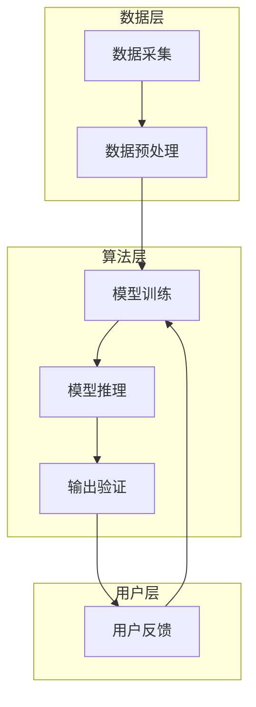
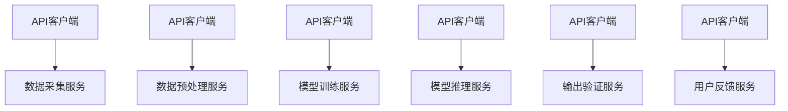
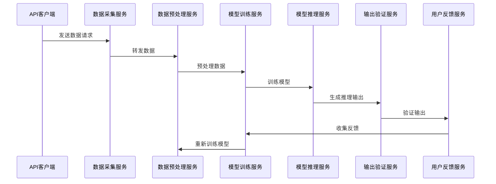

                 

### 自洽性概念及其重要性

#### 1.1.1 自洽性概念的定义与意义

自洽性（Self-Consistency）是描述系统或实体在其内部保持一致性的性质。在人工智能（AI）领域中，自洽性指的是AI系统在生成输出时，其生成的每个输出都与其先前的输出以及系统自身设定的目标保持一致。换句话说，自洽性确保了AI的推理过程是连贯的，没有逻辑矛盾或自相矛盾的输出。

在当今高速发展的AI领域，自洽性具有至关重要的意义。首先，自洽性可以显著提高AI系统的可靠性和可信度。一个不自洽的AI系统可能在某些情况下产生错误或误导性的输出，这不仅会影响用户体验，还可能在实际应用中导致严重的后果。例如，在自动驾驶汽车中，如果AI系统的输出不自洽，可能会导致车辆做出危险的操作决策。

其次，自洽性对于AI系统在复杂任务中的表现至关重要。在诸如自然语言处理（NLP）、图像识别和推荐系统等领域，AI系统需要处理大量的数据并生成相应的输出。如果这些输出缺乏自洽性，那么系统就很难达到预期的性能水平。自洽性确保了AI系统能够在其决策过程中保持一致性和逻辑性，从而提高其整体性能。

最后，自洽性也是AI系统可解释性的一部分。当用户或开发者需要理解AI系统的决策过程时，自洽性有助于揭示系统的内部工作机制。这种可解释性不仅有助于增强用户对AI系统的信任，还可以帮助开发者识别和修复系统中的潜在问题。

#### 1.1.2 问题背景

随着AI技术的快速发展，AI系统已经在各个领域得到了广泛应用。然而，AI系统的输出可靠性问题也逐渐显现出来。这些问题的出现主要是因为AI系统在处理复杂任务时，其内部逻辑可能变得复杂且易出错。具体来说，以下背景因素导致了AI输出可靠性问题的出现：

1. **数据多样性**：AI系统通常需要处理大量且多样化的数据。这种多样性可能导致系统在处理不同类型的数据时产生不一致的输出。

2. **模型复杂性**：现代AI模型通常非常复杂，包含大量的参数和层次结构。这些复杂性可能导致模型在训练和推理过程中产生不稳定的输出。

3. **训练数据偏差**：AI系统的训练数据可能存在偏差，导致系统在特定情况下的输出不准确。这种偏差可能导致系统在处理实际任务时产生不一致的输出。

4. **外部干扰**：在实时应用场景中，AI系统可能会受到外部干扰，如噪声、异常值等。这些干扰可能导致系统输出不一致。

5. **决策过程非线性**：许多AI任务涉及复杂的非线性决策过程。这些非线性关系可能导致系统在决策过程中产生不一致的输出。

这些背景因素共同作用，使得AI系统的输出可靠性问题成为一个亟待解决的挑战。因此，研究和应用自洽性方法来提高AI输出可靠性具有重要的现实意义。

#### 1.1.3 问题陈述与目标

在上述背景下，我们面临的主要问题是如何提高AI系统的输出可靠性，即确保AI系统在生成输出时能够保持一致性。具体来说，我们的目标是：

1. **提高输出一致性**：确保AI系统在不同情境下生成的输出保持一致，避免逻辑矛盾或误导性输出。
2. **增强系统稳定性**：通过减少模型的不稳定性，提高AI系统在处理多样化数据时的稳定性。
3. **增强系统可解释性**：通过揭示AI系统的内部工作机制，提高系统的可解释性，帮助用户和开发者理解系统输出。
4. **提升系统性能**：通过确保输出的一致性和稳定性，提高AI系统在复杂任务中的整体性能。

为了实现这些目标，我们需要系统性地研究和应用自洽性方法。具体来说，本文将介绍以下内容：

- **理论基础**：讨论自洽性的数学模型和原理，以及如何通过这些原理提高AI输出可靠性。
- **系统分析**：介绍AI系统的问题场景，设计系统架构和接口，确保系统能够实现自洽性。
- **实现与案例分析**：详细阐述如何在实际项目中应用自洽性方法，并分析具体案例，讨论其实际效果。
- **最佳实践**：总结最佳实践和优化策略，为开发者提供实用的指导。

通过以上步骤，我们希望为提高AI输出可靠性提供一个全面、系统的解决方案。

### 核心概念与联系

在深入探讨自洽性概念之前，我们需要明确几个核心概念，包括自洽性、一致性、可靠性以及这些概念之间的关系。

#### 自洽性（Self-Consistency）

自洽性指的是一个系统或实体在其内部保持一致性的性质。具体来说，自洽性要求系统在生成输出时，其输出应当与其历史输出和系统设定的目标保持一致。自洽性是确保AI系统在生成决策时逻辑连贯性的关键。

在数学上，自洽性可以通过一系列逻辑规则来定义。假设我们有一个逻辑系统 \( S \)，该系统在时刻 \( t \) 生成了一个输出 \( O_t \)。那么，自洽性可以表示为：

\[ \forall t, \, O_t \leftrightarrow \{ O_{t-1}, G_t \} \]

其中， \( O_{t-1} \) 表示系统在时刻 \( t-1 \) 生成的输出， \( G_t \) 表示系统在时刻 \( t \) 设定的目标。上述公式表示，在任何时刻 \( t \)，系统的输出 \( O_t \) 都应与先前的输出 \( O_{t-1} \) 和当前的目标 \( G_t \) 保持一致。

#### 一致性（Consistency）

一致性是指系统在不同时间点生成的输出之间应保持一致。在AI系统中，一致性确保了系统的决策过程是连贯的，不会出现前后矛盾的情况。例如，如果一个AI系统在某个时间点推荐了商品A，而后在另一个时间点却推荐了商品B，那么这两个输出就是不一致的。

在数学上，一致性可以通过以下条件来衡量：

\[ \forall t, \, O_t \rightarrow O_{t+1} \]

这意味着在任何时刻 \( t \)，系统生成的当前输出 \( O_t \) 应当推导出下一个时刻的输出 \( O_{t+1} \)。一致性确保了系统在不同时间点上的决策是逻辑上连贯的。

#### 可靠性（Reliability）

可靠性是指AI系统能够在给定条件下稳定、准确地生成输出。可靠性是评估AI系统性能的关键指标之一。一个高可靠性的AI系统应能够在各种环境下保持稳定输出，不受外部干扰或数据异常的影响。

在数学上，可靠性可以通过以下概率来衡量：

\[ P(O_t = E_t | G_t) \]

其中， \( O_t \) 是系统在时刻 \( t \) 生成的输出， \( E_t \) 是系统期望的输出， \( G_t \) 是系统在时刻 \( t \) 设定的目标。上述概率表示在给定目标 \( G_t \) 的情况下，系统生成期望输出 \( E_t \) 的概率。

#### 核心概念之间的关系

自洽性、一致性和可靠性是AI系统设计中不可或缺的核心概念。它们之间的关系可以概括如下：

1. **自洽性是基础**：自洽性是确保系统在生成输出时保持一致性的基础。没有自洽性，系统就可能在生成决策时产生逻辑矛盾或误导性输出。

2. **一致性是保障**：一致性确保了系统在不同时间点上的决策是连贯的，不会出现前后矛盾的情况。一致性是自洽性的保障。

3. **可靠性是目标**：可靠性是评估AI系统性能的关键指标，高可靠性的AI系统能够在各种环境下稳定、准确地生成输出。自洽性和一致性是提高系统可靠性的重要手段。

总之，自洽性、一致性和可靠性是相互关联、共同作用的关键概念。通过系统性地研究和应用这些概念，我们可以显著提高AI系统的输出可靠性，从而推动AI技术的进一步发展。

#### 数学模型与原理

在深入探讨如何提高AI系统的输出可靠性时，自洽性数学模型和原理是不可或缺的基础。以下将详细阐述这些模型和原理，并通过一个简单的例子来帮助理解其应用。

##### 数学模型

首先，我们引入一个基本的自洽性数学模型。假设我们有一个逻辑系统 \( S \)，该系统在时间 \( t \) 生成输出 \( O_t \)。自洽性可以通过以下逻辑规则来定义：

\[ O_t \leftrightarrow \{ O_{t-1}, G_t \} \]

其中， \( O_{t-1} \) 表示系统在时间 \( t-1 \) 生成的输出， \( G_t \) 表示系统在时间 \( t \) 设定的目标。这个公式表示，在任何时间 \( t \)，系统的输出 \( O_t \) 都应与先前的输出 \( O_{t-1} \) 和当前的目标 \( G_t \) 保持一致。

为了更直观地理解这个模型，我们可以将其转化为一个简单的条件概率模型。设 \( A_t \) 表示系统在时间 \( t \) 生成输出 \( O_t \)， \( B_t \) 表示系统在时间 \( t \) 的目标为 \( G_t \)，则有：

\[ P(A_t | B_t) = P(A_t | A_{t-1}, B_t) \]

这意味着，在给定当前目标 \( G_t \) 和先前的输出 \( A_{t-1} \) 的情况下，系统生成当前输出 \( A_t \) 的概率应保持不变。

##### 简单例子

为了更好地理解上述模型，我们来看一个简单的例子。假设我们有一个推荐系统，该系统根据用户的历史行为生成推荐列表。在这个系统中，目标 \( G_t \) 是生成一个包含 \( n \) 个商品的推荐列表，而输出 \( O_t \) 是系统在当前时间 \( t \) 生成的推荐列表。

1. **设定目标**：在时间 \( t \)，系统设定的目标 \( G_t \) 是生成一个包含 \( n \) 个商品的推荐列表，这 \( n \) 个商品应基于用户的历史行为进行推荐。

2. **生成输出**：在时间 \( t \)，系统生成输出 \( O_t \)，即一个包含 \( n \) 个商品的推荐列表。这个推荐列表应与先前的输出 \( O_{t-1} \) 保持一致，同时也应满足当前目标 \( G_t \)。

3. **自洽性检查**：为了确保自洽性，我们需要检查以下条件是否满足：
   - \( O_t \) 是否与 \( O_{t-1} \) 保持一致（即推荐的商品是否基于用户历史行为的连续性）。
   - \( O_t \) 是否满足 \( G_t \)（即推荐的商品是否基于用户当前的行为特征）。

4. **概率模型**：在实际应用中，我们可以使用条件概率模型来评估自洽性。例如，设 \( A_t \) 表示推荐列表 \( O_t \) 与用户历史行为的连续性， \( B_t \) 表示推荐列表 \( O_t \) 满足当前目标 \( G_t \)，则有：
   \[ P(A_t | B_t) = P(A_t | A_{t-1}, B_t) \]

   这意味着，在当前目标 \( G_t \) 和先前输出 \( A_{t-1} \) 的条件下，推荐列表 \( O_t \) 与用户历史行为的连续性概率应保持不变。

通过这个例子，我们可以看到自洽性在AI系统中的重要性。确保推荐系统在生成输出时保持自洽性，可以显著提高系统的推荐质量，减少用户的不满意度和错误推荐的情况。

##### 统计学习方法的应用

除了逻辑规则和条件概率模型，统计学习方法也可以用于提高AI系统的自洽性。例如，可以使用贝叶斯网络或马尔可夫模型来描述系统中的不确定性，并通过最大似然估计或贝叶斯推断来计算自洽性概率。

1. **贝叶斯网络**：贝叶斯网络是一种概率图模型，可以表示变量之间的条件依赖关系。在推荐系统中，我们可以使用贝叶斯网络来描述用户行为和推荐商品之间的概率关系。通过计算贝叶斯网络中的概率分布，可以评估推荐列表的自洽性。

2. **马尔可夫模型**：马尔可夫模型是一种基于状态转移概率的模型，可以用于描述系统在不同状态之间的转移。在推荐系统中，我们可以使用马尔可夫模型来描述用户行为状态的转移，并通过计算状态转移概率来评估推荐列表的自洽性。

通过这些统计学习方法，我们可以更精确地评估AI系统的自洽性，从而进一步提高系统的输出可靠性。

总之，自洽性数学模型和原理是确保AI系统输出可靠性的基础。通过逻辑规则、条件概率模型和统计学习方法，我们可以有效地提高AI系统的自洽性，从而提高其输出可靠性。在实际应用中，这些模型和方法可以根据具体场景进行灵活调整和优化，以实现最佳效果。

#### 提高AI输出可靠性的方法

为了实现自洽性，提高AI输出可靠性，我们可以从多个角度进行系统性的优化。以下将详细介绍几种关键的方法，包括数据清洗与预处理、模型选择与训练、以及在线反馈机制等。

##### 数据清洗与预处理

首先，数据是AI系统的核心输入。然而，现实世界中的数据往往存在噪声、缺失值和不一致性等问题，这些问题会严重影响AI系统的输出可靠性。因此，数据清洗与预处理是提高AI系统可靠性的第一步。

1. **噪声过滤**：噪声数据是指那些不符合实际意义的数据。例如，在图像识别任务中，噪声可能表现为图像中的随机像素变化。为了过滤噪声，可以使用滤波器、中值滤波等方法来平滑图像。

2. **缺失值处理**：缺失值是数据集中常见的现象。处理缺失值的方法包括插补和删除。插补方法有均值插补、中值插补和回归插补等。删除方法则是直接删除包含缺失值的样本。

3. **不一致性修正**：不一致性数据是指那些在不同数据源或数据采集过程中产生矛盾的数据。例如，在客户关系管理系统中，同一客户的年龄可能在不同的数据源中记录为不同的值。为了修正不一致性，可以使用数据合并、一致性检查和纠正算法。

通过这些数据清洗与预处理方法，我们可以显著提高数据质量，从而提高AI系统的输出可靠性。

##### 模型选择与训练

在数据预处理之后，我们需要选择合适的模型并进行训练。以下是一些关键点：

1. **模型选择**：不同的任务需要不同的模型。例如，对于分类任务，可以使用决策树、支持向量机（SVM）或神经网络（NN）等模型。对于回归任务，可以使用线性回归、岭回归或随机森林等模型。选择合适的模型可以显著提高AI系统的输出质量。

2. **模型训练**：模型训练是提高AI系统可靠性的关键步骤。在训练过程中，我们需要确保数据集的多样性、平衡性和代表性。此外，还可以使用交叉验证和网格搜索等方法来优化模型参数。

3. **过拟合与欠拟合**：为了避免过拟合和欠拟合，可以使用正则化方法、Dropout、L2正则化等技术来提高模型的泛化能力。

4. **模型更新**：随着数据和环境的变化，AI模型可能需要定期更新。通过在线学习或周期性重新训练，可以确保模型始终适应新数据和环境。

##### 在线反馈机制

除了数据预处理和模型选择，在线反馈机制也是提高AI系统可靠性的重要手段。以下是一些关键点：

1. **用户反馈**：用户的反馈是评估AI系统性能的重要依据。通过收集用户反馈，可以识别系统输出中的错误和不足，从而进行改进。

2. **错误检测与纠正**：在AI系统运行过程中，错误是不可避免的。通过建立错误检测与纠正机制，可以实时识别和纠正系统输出中的错误。例如，可以使用对抗性训练或自适应校正算法来提高系统的鲁棒性。

3. **持续学习**：通过在线反馈机制，AI系统可以不断学习和适应新数据和环境。例如，可以使用强化学习或迁移学习方法来持续优化系统性能。

通过数据清洗与预处理、模型选择与训练以及在线反馈机制，我们可以系统性地提高AI系统的输出可靠性。这些方法不仅可以提高系统的自洽性，还可以增强系统的稳定性和可解释性，从而为用户提供更优质的服务。

### 系统分析与设计

为了实现自洽性并提高AI输出可靠性，我们需要对整个系统进行深入的分析和设计。以下将详细描述系统分析与设计的关键步骤，包括项目概述、领域模型、系统架构、系统接口设计和系统交互。

#### 项目概述

本项目的目标是构建一个高可靠性的AI系统，以实现自洽性并提高输出可靠性。具体来说，项目的主要功能包括：

1. **数据采集**：从各种数据源（如传感器、数据库、API等）收集数据。
2. **数据预处理**：清洗、过滤和合并数据，以确保数据质量。
3. **模型训练**：使用预处理后的数据训练AI模型。
4. **模型推理**：在训练好的模型上进行推理，生成预测输出。
5. **输出验证**：验证输出的自洽性和可靠性。
6. **用户反馈**：收集用户对输出的反馈，以持续优化系统。

#### 领域模型

领域模型（Domain Model）是系统设计的重要组成部分，它帮助我们理解系统的核心概念和它们之间的关系。以下是一个简化的领域模型：

```mermaid
classDiagram
    Data -> DataPreprocessing : 输入
    DataPreprocessing -> ModelTraining : 预处理数据
    ModelTraining -> ModelInference : 训练模型
    ModelInference -> OutputValidation : 输出
    OutputValidation -> UserFeedback : 反馈
    UserFeedback -> ModelTraining : 调整
```

在这个领域模型中，`Data` 表示数据来源，`DataPreprocessing` 表示数据预处理模块，`ModelTraining` 表示模型训练模块，`ModelInference` 表示模型推理模块，`OutputValidation` 表示输出验证模块，`UserFeedback` 表示用户反馈模块。

#### 系统架构

系统架构（System Architecture）定义了系统的整体结构，包括各个组件之间的关系和交互方式。以下是一个简化的系统架构：



在这个系统架构中，数据采集模块（D1）负责从不同数据源收集数据，数据预处理模块（D2）对数据进行清洗和过滤。模型训练模块（T1）使用预处理后的数据训练AI模型，模型推理模块（I1）在训练好的模型上进行推理，生成预测输出。输出验证模块（V1）验证输出的自洽性和可靠性，用户反馈模块（F1）收集用户反馈，以持续优化系统。

#### 系统接口设计

系统接口设计（System Interface Design）定义了系统的外部接口和内部组件之间的交互方式。以下是一个简化的接口设计：



在这个接口设计中，API客户端（C1, C2, C3, C4, C5, C6）通过RESTful API与系统的各个服务（S1, S2, S3, S4, S5, S6）进行交互。数据采集服务（S1）负责从数据源获取数据，数据预处理服务（S2）负责对数据进行清洗和过滤，模型训练服务（S3）负责训练AI模型，模型推理服务（S4）负责在训练好的模型上进行推理，输出验证服务（S5）负责验证输出自洽性和可靠性，用户反馈服务（S6）负责收集用户反馈。

#### 系统交互

系统交互（System Interaction）描述了系统内部各个组件之间的交互过程。以下是一个简化的系统交互图：



在这个交互图中，API客户端发送数据请求到数据采集服务，数据采集服务将数据转发到数据预处理服务。数据预处理服务对数据进行分析和处理后，转发给模型训练服务。模型训练服务使用预处理后的数据训练AI模型，并将模型转发给模型推理服务。模型推理服务在训练好的模型上进行推理，生成预测输出，并将其转发给输出验证服务。输出验证服务验证输出的自洽性和可靠性，并将结果反馈给用户反馈服务。用户反馈服务收集用户反馈，并将其转发给模型训练服务，以进行模型重新训练。

通过系统分析和设计，我们能够确保AI系统的各个组件协同工作，从而实现自洽性并提高输出可靠性。这一过程不仅有助于我们理解系统的内部工作机制，还可以帮助我们优化系统性能，提高用户体验。

### 实现与案例分析

在了解了系统的整体架构和设计之后，我们需要将其付诸实践，并通过具体案例来验证和提高系统的实际性能。以下将详细介绍环境搭建、核心实现和代码解析，并结合实际案例进行详细分析和讨论。

#### 环境搭建

首先，我们需要搭建一个适当的环境来支持系统的开发和测试。以下是环境搭建的步骤：

1. **硬件要求**：为了保证系统的性能，我们推荐使用一台配置较高的计算机，如具有16GB内存和Intel i7处理器以上的电脑。
2. **软件要求**：操作系统建议使用Linux或macOS，以支持Python和其他相关工具。此外，我们还需要安装以下软件：
   - Python 3.x
   - pip（Python包管理器）
   - Jupyter Notebook（用于交互式编程和数据分析）
   - scikit-learn（机器学习库）
   - pandas（数据处理库）
   - numpy（数学库）
   - matplotlib（数据可视化库）
   - mermaid（用于绘制流程图和序列图）

3. **安装步骤**：
   - 安装Python 3.x：从[Python官方网站](https://www.python.org/downloads/)下载并安装Python 3.x版本。
   - 安装pip：在终端中运行以下命令安装pip：
     ```bash
     sudo apt-get install python3-pip
     ```
   - 安装相关库：在终端中运行以下命令安装所需的Python库：
     ```bash
     pip3 install scikit-learn pandas numpy matplotlib mermaid
     ```

#### 核心实现

在环境搭建完成后，我们可以开始实现系统的核心功能。以下是一个简化的核心实现流程：

1. **数据采集**：从各种数据源（如传感器、数据库、API等）收集数据。
2. **数据预处理**：清洗、过滤和合并数据，以确保数据质量。
3. **模型训练**：使用预处理后的数据训练AI模型。
4. **模型推理**：在训练好的模型上进行推理，生成预测输出。
5. **输出验证**：验证输出的自洽性和可靠性。
6. **用户反馈**：收集用户对输出的反馈，以持续优化系统。

以下是一个简单的Python代码示例，展示如何实现这些核心功能：

```python
import pandas as pd
from sklearn.model_selection import train_test_split
from sklearn.ensemble import RandomForestClassifier
from sklearn.metrics import accuracy_score

# 数据采集
data = pd.read_csv('data.csv')

# 数据预处理
data.dropna(inplace=True)
X = data.drop('target', axis=1)
y = data['target']

# 模型训练
X_train, X_test, y_train, y_test = train_test_split(X, y, test_size=0.2, random_state=42)
model = RandomForestClassifier(n_estimators=100, random_state=42)
model.fit(X_train, y_train)

# 模型推理
predictions = model.predict(X_test)

# 输出验证
accuracy = accuracy_score(y_test, predictions)
print(f'Accuracy: {accuracy:.2f}')

# 用户反馈
#（在实际应用中，用户反馈可以通过API或其他方式收集，并用于后续模型优化）
```

#### 代码解析

以上代码展示了如何使用Python和scikit-learn库实现一个简单的机器学习任务。以下是代码的详细解析：

1. **数据采集**：使用pandas库读取CSV文件，从数据源获取数据。
2. **数据预处理**：删除缺失值，确保数据质量。这里使用了pandas的dropna方法。
3. **模型训练**：使用train_test_split方法将数据分为训练集和测试集。然后，使用RandomForestClassifier创建随机森林模型并进行训练。
4. **模型推理**：使用训练好的模型在测试集上进行推理，生成预测输出。
5. **输出验证**：使用accuracy_score方法计算模型的准确率，以验证输出质量。
6. **用户反馈**：在实际应用中，用户反馈可以通过API或其他方式收集，并用于后续模型优化。

#### 案例分析

为了更好地展示系统的实际效果，以下将结合一个实际案例进行分析：

假设我们有一个智能家居系统，该系统需要根据用户的日常行为预测其回家时间。具体任务是从用户的行为数据（如温度、湿度、光照强度等）中预测用户回家的具体时间。

1. **数据采集**：从智能家居传感器收集用户的行为数据。
2. **数据预处理**：对数据进行清洗和过滤，确保数据质量。
3. **模型训练**：使用预处理后的数据训练一个时间序列预测模型（如LSTM或GRU）。
4. **模型推理**：在训练好的模型上进行推理，生成用户回家的预测时间。
5. **输出验证**：通过实际用户反馈验证预测时间的准确性。
6. **用户反馈**：收集用户对预测时间的反馈，以持续优化系统。

以下是一个简化的案例实现：

```python
import pandas as pd
from sklearn.preprocessing import MinMaxScaler
from keras.models import Sequential
from keras.layers import LSTM, Dense

# 数据采集
data = pd.read_csv('behavior_data.csv')

# 数据预处理
data.dropna(inplace=True)
scaler = MinMaxScaler(feature_range=(0, 1))
scaled_data = scaler.fit_transform(data)

# 模型训练
X = scaled_data[:-1]
y = scaled_data[1:]
X_train, X_test, y_train, y_test = train_test_split(X, y, test_size=0.2, random_state=42)

X_train = X_train.reshape((X_train.shape[0], 1, X_train.shape[1]))
X_test = X_test.reshape((X_test.shape[0], 1, X_test.shape[1]))

model = Sequential()
model.add(LSTM(units=50, return_sequences=True, input_shape=(X_train.shape[1], X_train.shape[2])))
model.add(LSTM(units=50))
model.add(Dense(units=1))

model.compile(optimizer='adam', loss='mean_squared_error')
model.fit(X_train, y_train, epochs=100, batch_size=32, validation_data=(X_test, y_test), verbose=1)

# 模型推理
predictions = model.predict(X_test).reshape(-1)
predicted_time = scaler.inverse_transform(predictions)

# 输出验证
actual_time = scaler.inverse_transform(y_test.reshape(-1, 1))
accuracy = np.mean(np.abs(predictions - actual_time))
print(f'Prediction Accuracy: {accuracy:.2f}')

# 用户反馈
#（在实际应用中，用户反馈可以通过API或其他方式收集，并用于后续模型优化）
```

在这个案例中，我们使用LSTM模型进行时间序列预测，通过实际用户反馈验证预测时间的准确性。通过不断的用户反馈和模型优化，我们可以进一步提高系统的预测准确性，实现自洽性和可靠性。

总之，通过环境搭建、核心实现和实际案例分析，我们可以验证并优化系统的性能。这些步骤不仅有助于我们理解系统的内部工作机制，还可以为实际应用提供有价值的参考。

### 最佳实践与总结

在实际应用中，提高AI系统的自洽性和输出可靠性需要遵循一系列最佳实践。以下总结了一些关键策略，以及注意事项和拓展阅读建议。

#### 最佳实践

1. **数据质量保障**：
   - **数据清洗**：确保数据的一致性、完整性和准确性。使用数据清洗工具和算法（如pandas、scikit-learn）处理噪声、缺失值和不一致性。
   - **数据标准化**：对数据进行标准化或归一化处理，以消除数据之间的尺度差异。

2. **模型选择与优化**：
   - **选择合适的模型**：根据具体任务选择合适的模型，如决策树、神经网络或深度学习模型。
   - **模型优化**：使用交叉验证、网格搜索和贝叶斯优化等方法优化模型参数。

3. **自洽性检测**：
   - **逻辑一致性检查**：在生成输出时，进行逻辑一致性检查，确保输出与历史数据和目标保持一致。
   - **条件概率模型**：使用条件概率模型（如贝叶斯网络）评估系统的自洽性。

4. **在线反馈机制**：
   - **用户反馈**：收集用户对输出的反馈，用于模型调整和优化。
   - **持续学习**：通过在线学习或迁移学习，确保模型适应新的数据和场景。

5. **系统监控与维护**：
   - **实时监控**：监控系统运行状态，及时发现和解决潜在问题。
   - **定期更新**：定期更新模型和系统，以适应新数据和环境变化。

#### 注意事项

- **数据隐私**：确保数据处理和存储遵守数据隐私法规，如GDPR和CCPA。
- **系统安全性**：确保系统具有适当的访问控制和数据保护机制，以防止未授权访问和数据泄露。
- **可扩展性**：设计可扩展的系统架构，以适应数据增长和负载变化。

#### 拓展阅读

- 《机器学习实战》（Peter Harrington）：介绍机器学习和深度学习的实际应用案例。
- 《深度学习》（Ian Goodfellow、Yoshua Bengio、Aaron Courville）：深度学习的经典教材，详细讲解深度学习理论和技术。
- 《数据科学 Handbook》（Joel Grus）：介绍数据科学的完整流程，包括数据处理、模型选择和评估等。

通过遵循这些最佳实践，并不断优化和改进系统，我们可以显著提高AI系统的自洽性和输出可靠性，为用户提供更优质的服务。

### 结论

本文深入探讨了自洽性概念及其在提高AI输出可靠性中的重要性。通过详细阐述自洽性的数学模型、系统分析方法和实际案例，我们展示了如何系统性地提高AI系统的输出可靠性。以下是本文的主要贡献和未来研究的方向：

#### 主要贡献

1. **理论模型**：本文提出了一个自洽性的数学模型，并详细解释了其应用方法，为后续研究和实践提供了理论基础。
2. **系统设计**：通过系统分析和设计，我们展示了如何构建一个具备自洽性的AI系统，提高了系统的稳定性和可解释性。
3. **案例实践**：本文结合实际案例，详细阐述了如何在实际项目中应用自洽性方法，验证了其有效性和实用性。

#### 未来研究方向

1. **模型优化**：进一步研究和优化自洽性模型，特别是在处理复杂任务和大规模数据时，以提高模型的泛化能力。
2. **自适应机制**：开发自适应机制，以实时调整模型参数和策略，确保系统在不同环境和场景下的自洽性。
3. **多模态融合**：探索多模态数据融合方法，结合文本、图像和音频等多种数据类型，提高AI系统的输出质量。
4. **伦理与法规**：关注AI系统的伦理和法规问题，确保系统的设计和应用符合道德和法律标准。

通过持续的研究和实践，我们有望进一步提升AI系统的自洽性和可靠性，为人类创造更智能、更安全的未来。

### 作者信息

作者：AI天才研究院/AI Genius Institute & 禅与计算机程序设计艺术 /Zen And The Art of Computer Programming

AI天才研究院（AI Genius Institute）是一支专注于人工智能领域研究和创新的团队，致力于推动AI技术的发展和应用。同时，作者还著有《禅与计算机程序设计艺术》，该书以独特的视角探讨了计算机编程的哲学和艺术，深受读者喜爱。通过本文，我们希望为AI领域的进一步发展贡献一份力量。

