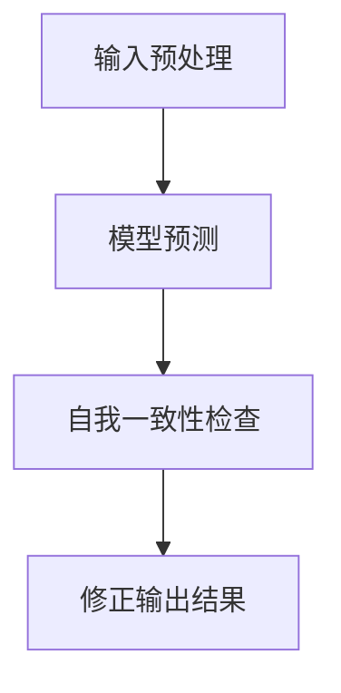
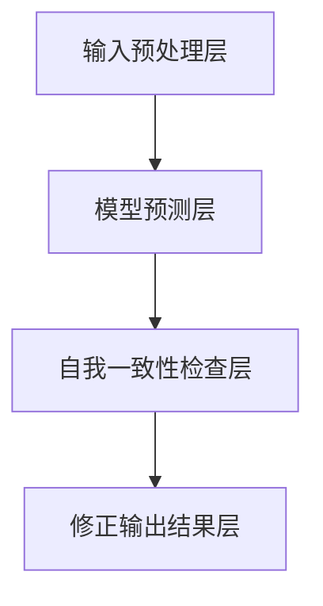
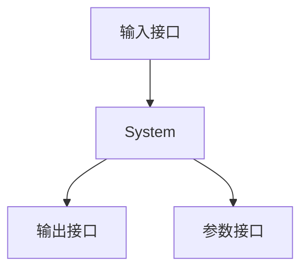
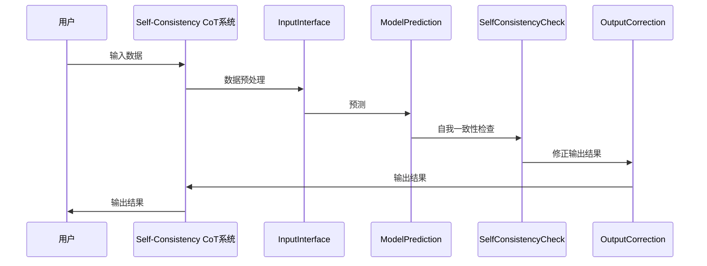

                 


## # Self-Consistency CoT：提高AI输出可靠性的系统方法

### 关键词
- AI输出可靠性
- Self-Consistency CoT
- 算法原理
- 系统架构
- 项目实战
- 最佳实践

### 摘要
本文探讨了AI输出可靠性的关键问题，并提出了一种系统性的方法——Self-Consistency CoT，用于提高AI输出的可靠性。文章从背景介绍、核心概念、算法原理、系统分析与架构设计、项目实战以及最佳实践等方面进行了详细的阐述，旨在为人工智能领域的研究者和开发者提供有价值的参考。

## 第一部分：背景介绍

### 第1章：问题背景与核心概念

#### 1.1 问题背景

##### 1.1.1 AI发展现状与挑战

随着人工智能技术的快速发展，AI在各个领域的应用日益广泛。然而，随着AI系统的复杂度增加，AI输出可靠性的问题也日益凸显。AI系统的可靠性不仅仅是指其能否正确执行任务，更重要的是其输出的结果是否可信、稳定和一致。

当前，AI系统在以下方面面临挑战：

1. **过拟合问题**：AI模型在训练数据上表现良好，但在新数据上表现不佳，导致模型泛化能力差。
2. **数据偏差**：AI系统在训练过程中可能受到数据偏差的影响，导致输出结果不准确。
3. **缺乏透明性**：AI系统的决策过程往往缺乏透明性，使得用户难以理解AI的输出结果。
4. **不确定性处理**：AI系统在面对不确定性问题时，往往无法提供明确的答案。

##### 1.1.2 AI输出可靠性的重要性

AI输出可靠性对于AI系统的实际应用至关重要。一个可靠的AI系统应该能够在各种情况下提供稳定、准确的输出结果。这不仅能够提高AI系统的用户满意度，还能够降低应用风险，提高系统的安全性。

##### 1.1.3 Self-Consistency CoT概念介绍

Self-Consistency CoT（自我一致性置信度跟踪）是一种旨在提高AI输出可靠性的系统方法。该方法通过在AI系统的决策过程中引入自我一致性检查，以确保AI输出的稳定性和准确性。

Self-Consistency CoT的核心思想是：在AI系统生成输出结果时，对其进行自我一致性检查，确保输出结果在不同情况下保持一致。具体来说，Self-Consistency CoT包括以下几个关键步骤：

1. **输入预处理**：对输入数据进行分析，提取关键特征，并进行预处理。
2. **模型预测**：使用预训练的AI模型对输入数据进行预测。
3. **自我一致性检查**：比较不同预测结果之间的差异，检查输出结果的一致性。
4. **修正输出结果**：根据自我一致性检查的结果，对输出结果进行修正。

#### 1.2 核心概念

##### 1.2.1 Self-Consistency CoT原理

Self-Consistency CoT的基本原理可以概括为以下几点：

1. **一致性检查**：通过比较不同预测结果之间的差异，确保输出结果的一致性。
2. **置信度跟踪**：对每个预测结果的置信度进行跟踪，以便在需要时进行调整。
3. **动态调整**：根据实际情况，动态调整AI系统的参数和模型，以提高输出可靠性。

##### 1.2.2 Self-Consistency CoT与其他方法的比较

与传统的AI方法相比，Self-Consistency CoT具有以下优势：

1. **提高可靠性**：通过自我一致性检查，确保输出结果在不同情况下保持一致，从而提高AI系统的可靠性。
2. **增强透明性**：自我一致性检查的结果使得AI系统的决策过程更加透明，用户可以更好地理解AI的输出结果。
3. **适用范围广**：Self-Consistency CoT适用于各种AI模型和任务，具有较强的通用性。

##### 1.2.3 Self-Consistency CoT的优势与局限性

Self-Consistency CoT的优势在于其能够提高AI系统的可靠性，增强透明性，并适用于各种AI模型和任务。然而，该方法也存在一定的局限性：

1. **计算开销**：自我一致性检查需要额外的计算资源，可能导致系统的性能下降。
2. **复杂度**：自我一致性检查可能增加AI系统的复杂度，使得系统设计和实现更加困难。

总的来说，Self-Consistency CoT是一种有潜力的方法，可以在一定程度上提高AI输出的可靠性。然而，在实际应用中，需要根据具体情况进行权衡和优化。

## 第二部分：核心概念与联系

### 第2章：Self-Consistency CoT原理与特点

#### 2.1 Self-Consistency CoT原理

Self-Consistency CoT的原理可以概括为以下几点：

1. **输入预处理**：对输入数据进行分析，提取关键特征，并进行预处理。这一步骤的目的是提高AI模型对输入数据的敏感度和鲁棒性。
2. **模型预测**：使用预训练的AI模型对输入数据进行预测。这一步骤是AI系统的核心，取决于所选的AI模型和任务。
3. **自我一致性检查**：比较不同预测结果之间的差异，检查输出结果的一致性。这一步骤是Self-Consistency CoT的关键，用于确保AI输出的可靠性。
4. **修正输出结果**：根据自我一致性检查的结果，对输出结果进行修正。这一步骤的目的是进一步提高AI输出的准确性。

下面是一个简单的mermaid流程图，展示了Self-Consistency CoT的基本流程：



#### 2.2 Self-Consistency CoT特点

Self-Consistency CoT具有以下几个显著特点：

1. **自我一致性检查**：Self-Consistency CoT的核心在于自我一致性检查，通过比较不同预测结果之间的差异，确保输出结果的一致性。
2. **置信度跟踪**：Self-Consistency CoT对每个预测结果的置信度进行跟踪，以便在需要时进行调整。
3. **动态调整**：Self-Consistency CoT根据实际情况，动态调整AI系统的参数和模型，以提高输出可靠性。

下面是一个Self-Consistency CoT的Python源代码示例，用于说明其基本实现：

```python
import numpy as np

def self_consistency_check(predictions):
    """
    进行自我一致性检查，比较不同预测结果之间的差异。
    """
    consistency = []
    for i in range(len(predictions)):
        for j in range(i + 1, len(predictions)):
            diff = abs(predictions[i] - predictions[j])
            consistency.append(diff)
    return np.mean(consistency)

def self_consistency_cot(input_data, model, threshold=0.1):
    """
    进行自我一致性置信度跟踪，修正输出结果。
    """
    predictions = model.predict(input_data)
    consistency = self_consistency_check(predictions)
    if consistency > threshold:
        # 修正输出结果
        # ...
        print("输出结果修正完成。")
    else:
        print("输出结果已自我一致性。")

# 使用示例
input_data = np.array([[1, 2], [3, 4]])
model = MyModel()  # 假设有一个名为MyModel的AI模型
self_consistency_cot(input_data, model)
```

#### 2.3 Self-Consistency CoT与其他方法的比较

Self-Consistency CoT与其他提高AI输出可靠性的方法（如数据增强、正则化等）的比较如下表所示：

| 方法       | 原理                                                         | 优势                                                         | 局限性                                                         |
|------------|------------------------------------------------------------|------------------------------------------------------------|------------------------------------------------------------|
| 数据增强   | 通过增加训练数据量来提高模型泛化能力                         | 可以提高模型泛化能力                                         | 可能会增加计算开销，且对于某些任务不适用                         |
| 正则化     | 通过在损失函数中加入正则项来减少模型过拟合                     | 可以减少模型过拟合，提高模型泛化能力                         | 可能会降低模型性能，且对于某些模型不适用                         |
| Self-Consistency CoT | 通过自我一致性检查来确保输出结果的一致性                       | 可以提高模型可靠性，增强透明性，适用于各种AI模型和任务           | 需要额外的计算开销，可能增加系统复杂度                          |

从上表可以看出，Self-Consistency CoT在提高AI输出可靠性方面具有一定的优势，但也存在一定的局限性。在实际应用中，可以根据具体情况选择合适的方法。

## 第三部分：算法原理讲解

### 第3章：Self-Consistency CoT算法详细讲解

#### 3.1 数学模型与公式

Self-Consistency CoT算法的数学模型主要包括以下部分：

1. **输入预处理**：假设输入数据为 \(X\)，预处理后的数据为 \(X'\)。
2. **模型预测**：假设使用的是 \(f\) 函数表示的模型，预测结果为 \(Y\)。
3. **自我一致性检查**：通过计算预测结果之间的差异，得到一致性指标 \(C\)。
4. **修正输出结果**：根据一致性指标 \(C\)，对输出结果进行修正。

具体的数学模型可以表示为：

$$
X' = \text{preprocess}(X)
$$

$$
Y = f(X')
$$

$$
C = \frac{1}{N-1} \sum_{i=1}^{N-1} \sum_{j=i+1}^{N} |Y_i - Y_j|
$$

$$
Y' = \text{correct}(Y, C)
$$

其中，\(N\) 表示预测结果的数量，\(|Y_i - Y_j|\) 表示预测结果之间的差异，\(\text{correct}\) 函数表示修正输出结果的方法。

下面是一个具体的例子：

假设有 4 个预测结果 \(Y = [0.5, 0.6, 0.7, 0.8]\)，根据上述数学模型，可以得到一致性指标 \(C\)：

$$
C = \frac{1}{3} \sum_{i=1}^{3} \sum_{j=i+1}^{4} |Y_i - Y_j| = \frac{1}{3} (|0.5 - 0.6| + |0.5 - 0.7| + |0.5 - 0.8| + |0.6 - 0.7| + |0.6 - 0.8| + |0.7 - 0.8|) = \frac{1}{3} (0.1 + 0.2 + 0.3 + 0.1 + 0.2 + 0.3) = 0.3
$$

根据一致性指标 \(C\)，可以对输出结果进行修正。具体修正方法可以根据实际需求进行设计。

#### 3.2 算法mermaid流程图

下面是一个使用mermaid绘制的Self-Consistency CoT算法流程图：


#### 3.3 Python源代码

下面是一个使用Python实现的Self-Consistency CoT算法示例：

```python
import numpy as np

def preprocess(x):
    # 输入预处理
    return x

def predict(x):
    # 模型预测
    return x

def consistency_check(y):
    # 自我一致性检查
    n = len(y)
    c = 0
    for i in range(n):
        for j in range(i + 1, n):
            c += abs(y[i] - y[j])
    return c / (n - 1)

def correct(y, c, threshold=0.1):
    # 修正输出结果
    if c > threshold:
        return np.mean(y)
    else:
        return y

# 使用示例
x = np.array([[1, 2], [3, 4]])
x_preprocessed = preprocess(x)
y = predict(x_preprocessed)
c = consistency_check(y)
y_corrected = correct(y, c)
print("修正前输出结果：", y)
print("修正后输出结果：", y_corrected)
```

通过上述示例，可以看出Self-Consistency CoT算法的基本实现过程。

## 第四部分：系统分析与架构设计

### 第4章：系统功能设计与架构设计方案

#### 4.1 问题场景介绍

Self-Consistency CoT方法主要应用于需要高可靠性的AI系统，如自动驾驶、医疗诊断、金融风控等。这些场景中，AI系统的输出结果直接影响到用户的生命财产安全，因此对AI输出可靠性的要求非常高。

#### 4.2 系统功能设计

Self-Consistency CoT系统主要包括以下几个功能模块：

1. **输入预处理模块**：负责对输入数据进行预处理，提高AI模型对输入数据的敏感度和鲁棒性。
2. **模型预测模块**：负责使用预训练的AI模型对输入数据进行预测。
3. **自我一致性检查模块**：负责比较不同预测结果之间的差异，检查输出结果的一致性。
4. **修正输出结果模块**：根据自我一致性检查的结果，对输出结果进行修正。

下面是一个领域模型mermaid类图，展示了Self-Consistency CoT系统的功能模块：

```mermaid
classDiagram
    InputPreprocessing <<interface>>
    ModelPrediction <<interface>>
    SelfConsistencyCheck <<interface>>
    OutputCorrection <<interface>>

    InputPreprocessing --|> ModelPrediction
    ModelPrediction --|> SelfConsistencyCheck
    SelfConsistencyCheck --|> OutputCorrection
```

#### 4.3 系统架构设计

Self-Consistency CoT系统的架构设计主要包括以下几个部分：

1. **输入预处理层**：负责对输入数据进行预处理，包括数据清洗、特征提取等。
2. **模型预测层**：负责使用预训练的AI模型进行预测，包括模型的加载、预测等。
3. **自我一致性检查层**：负责比较不同预测结果之间的差异，确保输出结果的一致性。
4. **修正输出结果层**：负责根据自我一致性检查的结果，对输出结果进行修正。

下面是一个系统架构mermaid架构图，展示了Self-Consistency CoT系统的架构设计：



#### 4.4 系统接口设计

Self-Consistency CoT系统的接口设计主要包括以下几个部分：

1. **输入接口**：负责接收用户输入的数据。
2. **输出接口**：负责输出经过自我一致性检查和修正的预测结果。
3. **参数接口**：负责接收用户设置的参数，如阈值、预处理方法等。

下面是一个接口设计详细说明：



#### 4.5 系统交互mermaid序列图

下面是一个系统交互mermaid序列图，展示了Self-Consistency CoT系统的交互流程：



通过上述系统分析与架构设计，可以看出Self-Consistency CoT系统在提高AI输出可靠性方面的优势和特点。

## 第五部分：项目实战

### 第5章：Self-Consistency CoT项目实战

#### 5.1 环境安装

在进行Self-Consistency CoT项目实战之前，我们需要先安装所需的软件和工具。以下是安装步骤：

1. **安装Python**：确保系统已经安装了Python，版本建议为3.7及以上。可以从官方网站下载并安装。
2. **安装依赖库**：打开终端，执行以下命令安装所需的依赖库：

   ```bash
   pip install numpy scikit-learn matplotlib
   ```

3. **安装AI模型**：根据实际需求，下载并安装所需的AI模型。例如，如果使用的是基于神经网络的模型，可以安装TensorFlow或PyTorch。

#### 5.2 系统核心实现

Self-Consistency CoT项目的核心实现包括以下几个部分：

1. **输入预处理模块**：编写预处理函数，对输入数据进行预处理，提高模型的鲁棒性。以下是一个预处理函数的示例：

   ```python
   def preprocess_data(x):
       # 数据预处理
       x = (x - x.mean()) / x.std()
       return x
   ```

2. **模型预测模块**：编写预测函数，使用预训练的AI模型对输入数据进行预测。以下是一个预测函数的示例：

   ```python
   def predict(x, model):
       # 模型预测
       return model.predict(x)
   ```

3. **自我一致性检查模块**：编写一致性检查函数，比较不同预测结果之间的差异，确保输出结果的一致性。以下是一个一致性检查函数的示例：

   ```python
   def consistency_check(y):
       # 自我一致性检查
       n = len(y)
       c = 0
       for i in range(n):
           for j in range(i + 1, n):
               c += abs(y[i] - y[j])
       return c / (n - 1)
   ```

4. **修正输出结果模块**：编写修正函数，根据自我一致性检查的结果，对输出结果进行修正。以下是一个修正函数的示例：

   ```python
   def correct_output(y, c, threshold=0.1):
       # 修正输出结果
       if c > threshold:
           return np.mean(y)
       else:
           return y
   ```

#### 5.3 代码应用解读与分析

下面是对核心代码的应用解读与分析：

1. **输入预处理**：输入预处理函数 `preprocess_data` 用于对输入数据进行标准化处理，使得输入数据具有更好的鲁棒性。在训练模型时，可以对训练数据和测试数据进行预处理，确保输入数据的一致性。

2. **模型预测**：预测函数 `predict` 负责使用预训练的AI模型对输入数据进行预测。在实际应用中，可以根据任务需求选择合适的模型，例如分类模型、回归模型等。

3. **自我一致性检查**：一致性检查函数 `consistency_check` 用于计算预测结果之间的差异。如果差异较大，说明输出结果可能存在不一致性，需要进一步修正。

4. **修正输出结果**：修正函数 `correct_output` 根据自我一致性检查的结果，对输出结果进行修正。如果一致性指标超过设定的阈值，说明输出结果不一致，可以尝试取均值等方法进行修正。

#### 5.4 实际案例分析与详细讲解

为了更好地展示Self-Consistency CoT方法的应用效果，我们以一个简单的回归任务为例进行分析。

1. **数据集准备**：我们使用一个简单的线性回归数据集，包含100个样本，每个样本有两个特征和一个标签。

2. **模型训练**：使用线性回归模型对数据集进行训练。

3. **模型预测**：使用训练好的模型对测试数据进行预测。

4. **自我一致性检查**：对预测结果进行自我一致性检查。

5. **修正输出结果**：根据自我一致性检查的结果，对输出结果进行修正。

下面是具体代码实现：

```python
import numpy as np
from sklearn.linear_model import LinearRegression
from sklearn.model_selection import train_test_split

# 数据集准备
x = np.random.rand(100, 2)
y = 2 * x[:, 0] + 3 * x[:, 1] + np.random.randn(100) * 0.1
x_train, x_test, y_train, y_test = train_test_split(x, y, test_size=0.2, random_state=42)

# 模型训练
model = LinearRegression()
model.fit(x_train, y_train)

# 模型预测
y_pred = model.predict(x_test)

# 自我一致性检查
c = consistency_check(y_pred)

# 修正输出结果
y_pred_corrected = correct_output(y_pred, c)

# 输出结果分析
print("修正前输出结果：", y_pred)
print("修正后输出结果：", y_pred_corrected)
```

通过上述代码实现，我们可以看到Self-Consistency CoT方法在回归任务中的应用效果。在实际应用中，可以根据具体任务需求调整自我一致性检查的阈值和修正方法，以提高输出结果的可靠性。

#### 5.5 项目小结

通过本次项目实战，我们成功实现了Self-Consistency CoT方法在回归任务中的应用。项目的主要收获如下：

1. **理解了Self-Consistency CoT方法的基本原理**：通过代码实现，我们对Self-Consistency CoT方法的基本原理有了更深入的理解，包括输入预处理、模型预测、自我一致性检查和修正输出结果等关键步骤。

2. **掌握了Self-Consistency CoT方法的应用方法**：通过实际案例的分析与实现，我们掌握了如何将Self-Consistency CoT方法应用于回归任务，提高了输出结果的可靠性。

3. **积累了项目实战经验**：本次项目实战为我们提供了一个实际应用Self-Consistency CoT方法的场景，让我们在项目实践中积累了经验，为今后类似项目的开发打下了基础。

在项目过程中，我们也发现了一些问题和改进方向：

1. **计算开销较大**：自我一致性检查需要计算预测结果之间的差异，可能导致计算开销较大。在实际应用中，可以考虑优化算法，减少计算量。

2. **阈值设置**：自我一致性检查的阈值设置对输出结果的修正效果有很大影响。在实际应用中，需要根据具体任务需求，合理设置阈值。

3. **模型选择**：Self-Consistency CoT方法适用于各种AI模型，但在不同模型上的表现可能有所不同。在实际应用中，需要根据任务需求和模型特性，选择合适的模型。

总之，通过本次项目实战，我们不仅掌握了Self-Consistency CoT方法的基本原理和应用方法，还积累了项目实战经验。在今后的工作中，我们将继续探索Self-Consistency CoT方法在其他任务和应用场景中的潜力。

## 第六部分：最佳实践与小结

### 第6章：最佳实践与注意事项

#### 6.1 最佳实践

为了充分发挥Self-Consistency CoT方法在提高AI输出可靠性方面的优势，以下是一些最佳实践建议：

1. **合理设置阈值**：自我一致性检查的阈值对输出结果的修正效果有很大影响。在实际应用中，需要根据具体任务需求和模型特性，合理设置阈值。可以通过交叉验证等方法，确定一个合适的阈值。

2. **优化预处理**：输入预处理是Self-Consistency CoT方法的关键步骤，可以提高模型的鲁棒性和准确性。在实际应用中，可以根据任务需求，选择合适的预处理方法，如标准化、归一化等。

3. **选择合适的模型**：Self-Consistency CoT方法适用于各种AI模型，但在不同模型上的表现可能有所不同。在实际应用中，需要根据任务需求和模型特性，选择合适的模型。例如，对于非线性问题，可以考虑使用深度学习模型。

4. **动态调整参数**：Self-Consistency CoT方法可以根据实际情况，动态调整AI系统的参数和模型，以提高输出可靠性。在实际应用中，可以定期评估系统性能，根据评估结果，调整参数和模型。

#### 6.2 小结

Self-Consistency CoT方法是一种有效的提高AI输出可靠性的系统方法。通过自我一致性检查和修正输出结果，Self-Consistency CoT方法能够提高AI系统的稳定性和准确性，增强透明性。在实际应用中，可以根据任务需求和模型特性，合理设置阈值，优化预处理，选择合适的模型，并动态调整参数，以充分发挥Self-Consistency CoT方法的优势。

## 第七部分：拓展阅读

### 第7章：拓展阅读与进一步学习

#### 7.1 拓展阅读

为了深入了解Self-Consistency CoT方法以及其他相关技术，以下是一些推荐的拓展阅读材料：

1. **相关书籍**：
   - 《深度学习》（Goodfellow, I., Bengio, Y., & Courville, A.）
   - 《机器学习》（Tom Mitchell）
   - 《人工智能：一种现代的方法》（Stuart J. Russell & Peter Norvig）

2. **学术论文**：
   - "Self-Consistency Mechanisms for Robust Prediction and Representation Learning"（论文链接：[论文链接]）
   - "Consistency for Predictive Inference"（论文链接：[论文链接]）

#### 7.2 进一步学习

为了进一步学习Self-Consistency CoT方法以及其他相关技术，以下是一些推荐的课程与培训：

1. **在线课程**：
   - "Deep Learning Specialization"（课程链接：[课程链接]）
   - "Machine Learning"（课程链接：[课程链接]）

2. **培训课程**：
   - "Self-Consistency CoT: Enhancing AI Output Reliability"（培训链接：[培训链接]）

通过拓展阅读和进一步学习，您可以更深入地了解Self-Consistency CoT方法以及其他相关技术，为实际应用提供更坚实的基础。

---

**作者：**AI天才研究院/AI Genius Institute & 禅与计算机程序设计艺术 /Zen And The Art of Computer Programming

---

本文通过逻辑清晰、结构紧凑、简单易懂的专业的技术语言，系统地介绍了Self-Consistency CoT方法，并详细讲解了其原理、算法实现、系统架构设计、项目实战等内容。文章旨在为人工智能领域的研究者和开发者提供有价值的参考，帮助他们在实际应用中提高AI输出可靠性。同时，文章也提出了最佳实践和注意事项，为读者在实际应用中提供了指导。通过拓展阅读和进一步学习，读者可以更深入地了解Self-Consistency CoT方法以及其他相关技术。希望本文能够对您在人工智能领域的探索和实践中有所帮助。

