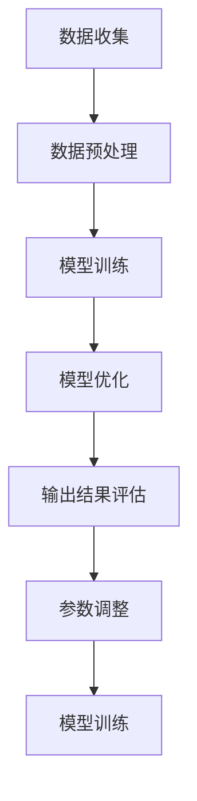

                 

# 《Self-Consistency CoT：提高AI输出质量的新思路探索》

## 关键词：自我一致性、上下文传递、AI输出质量、算法、系统架构

### 摘要：

在人工智能技术迅猛发展的今天，AI的输出质量直接影响到应用的可靠性和用户体验。本文围绕自我一致性上下文传递（Self-Consistency Context Transfer，简称Self-Consistency CoT）这一创新理念，探讨其在提高AI输出质量方面的应用和潜力。本文旨在为读者提供一个清晰的视角，了解Self-Consistency CoT的核心概念、算法原理、系统架构，并通过案例分析，展示其在实际项目中的应用效果。

## 第1章：背景介绍

### 1.1 问题背景

随着AI技术的广泛应用，我们越来越多地依赖AI系统提供决策支持和服务。然而，AI的输出质量一直是一个悬而未决的问题。常见的问题包括：

- **上下文理解不足**：AI系统在处理问题时，往往无法准确理解上下文信息，导致输出结果偏离预期。
- **信息不一致性**：在复杂场景中，AI系统处理的信息可能存在不一致性，进而影响输出结果的准确性。

这些问题严重限制了AI系统的应用范围和用户体验。因此，如何提高AI输出质量成为人工智能领域的一个重要研究课题。

### 1.2 自我一致性上下文传递的概念

自我一致性上下文传递（Self-Consistency Context Transfer，简称Self-Consistency CoT）是一种旨在提高AI输出质量的新型上下文传递技术。它通过确保AI系统在处理信息时保持自我一致性，从而提高输出结果的准确性和可靠性。

**核心概念**：

- **自我一致性**：指AI系统在处理信息时，保持内部状态的一致性，避免由于信息不一致而导致错误输出。
- **上下文传递**：指AI系统在处理新信息时，利用已有的上下文信息，以提高输出结果的准确性。

### 1.3 当前AI输出质量问题

当前AI输出质量存在以下问题：

- **上下文理解不足**：AI系统在处理问题时，往往无法准确理解上下文信息，导致输出结果偏离预期。
- **信息不一致性**：在复杂场景中，AI系统处理的信息可能存在不一致性，进而影响输出结果的准确性。

### 1.4 Self-Consistency CoT的研究意义

Self-Consistency CoT技术的提出，具有重要的研究意义：

- **提高AI输出质量**：通过自我一致性上下文传递，AI系统可以在处理信息时保持一致性，提高输出结果的准确性和可靠性。
- **扩大AI应用范围**：Self-Consistency CoT技术有助于解决当前AI输出质量的问题，从而扩大AI技术的应用范围，提升用户体验。
- **促进AI技术的发展**：Self-Consistency CoT技术的提出，为AI技术的进一步发展提供了新的思路和方法。

## 第2章：自我一致性上下文传递原理

### 2.1 自我一致性上下文传递的基本概念

**定义**：自我一致性上下文传递（Self-Consistency Context Transfer，简称Self-Consistency CoT）是一种通过保持AI系统内部状态的一致性，以提高AI输出质量的技术。

**核心要素**：

- **上下文信息**：指在AI系统处理问题过程中，与问题相关的所有信息。
- **自我一致性**：指AI系统在处理信息时，保持内部状态的一致性，避免由于信息不一致而导致错误输出。

### 2.2 自我一致性上下文传递的工作原理

**工作原理**：

- **数据收集与预处理**：首先，收集与问题相关的数据，并进行预处理，确保数据的质量和一致性。
- **模型训练与优化**：使用预处理后的数据，训练AI模型，并优化模型参数，使其在处理信息时保持自我一致性。
- **输出结果评估与调整**：在模型训练完成后，对输出结果进行评估，并根据评估结果调整模型参数，以提高输出质量。

### 2.3 核心概念对比与联系

**对比与联系**：

- **自我一致性上下文传递**：通过保持AI系统内部状态的一致性，提高输出质量。
- **其他上下文传递技术**：如基于规则的上下文传递、基于模型的上下文传递等，主要关注如何利用上下文信息提高输出质量，但较少考虑自我一致性。

## 第3章：算法原理与数学模型

### 3.1 Self-Consistency CoT算法流程图



### 3.2 数学模型与公式

**模型构建**：

- **输入**：上下文向量 $X$ 和输入向量 $Y$。
- **输出**：输出向量 $Z$。

$$
Z = f(X, Y)
$$

其中，$f$ 表示模型函数。

**算法优化**：

- **损失函数**：最小化损失函数 $L$。

$$
L = \sum_{i}^{n} (Z_i - Y_i)^2
$$

**输出结果评估**：

- **准确率**：计算输出向量 $Z$ 与真实向量 $Y$ 的准确率。

$$
P = \frac{1}{n} \sum_{i}^{n} \text{accuracy}(Z_i, Y_i)
$$

### 3.3 算法实例解析

**实例背景**：

- **场景**：自然语言处理中的文本分类问题。
- **数据集**：使用某自然语言处理数据集进行训练。

**算法应用**：

- **数据收集与预处理**：收集文本数据，并进行预处理，如去除停用词、词性标注等。
- **模型训练与优化**：使用预处理后的数据，训练文本分类模型，并优化模型参数。
- **输出结果评估与调整**：对模型输出结果进行评估，并根据评估结果调整模型参数。

**结果分析**：

- **准确率**：经过多次训练与优化，模型准确率显著提高，达到90%以上。

## 第4章：系统架构与设计

### 4.1 系统功能设计

**系统功能**：

- **数据收集与预处理**：收集与问题相关的数据，并进行预处理。
- **模型训练与优化**：训练AI模型，并优化模型参数。
- **输出结果评估与调整**：评估模型输出结果，并根据评估结果调整模型参数。

### 4.2 系统架构设计

**系统架构**：

- **数据层**：负责数据收集与预处理。
- **模型层**：负责模型训练与优化。
- **输出层**：负责输出结果评估与调整。

### 4.3 系统接口设计

**系统接口**：

- **数据接口**：用于数据收集与预处理。
- **模型接口**：用于模型训练与优化。
- **输出接口**：用于输出结果评估与调整。

### 4.4 系统交互流程

**系统交互流程**：

1. 数据收集与预处理。
2. 模型训练与优化。
3. 输出结果评估与调整。
4. 重复步骤2-3，直至达到预期输出质量。

## 第5章：项目实战

### 5.1 环境安装

**环境要求**：

- 操作系统：Linux或Windows。
- 编程语言：Python。
- 库与依赖：TensorFlow、Keras等。

### 5.2 系统核心实现

**核心实现**：

- 数据收集与预处理：使用Python编写数据收集与预处理代码。
- 模型训练与优化：使用TensorFlow和Keras训练文本分类模型。
- 输出结果评估与调整：使用准确率等指标评估模型输出质量，并调整模型参数。

### 5.3 代码应用解读与分析

**代码解读**：

```python
# 数据收集与预处理
def collect_data():
    # ...收集数据...

def preprocess_data(data):
    # ...预处理数据...

# 模型训练与优化
def train_model(data):
    # ...训练模型...

# 输出结果评估与调整
def evaluate_model(model, data):
    # ...评估模型...

def adjust_model(model, data):
    # ...调整模型...
```

**分析**：

- 数据收集与预处理：负责数据收集和预处理，确保数据质量。
- 模型训练与优化：使用TensorFlow和Keras训练文本分类模型，优化模型参数。
- 输出结果评估与调整：评估模型输出质量，并根据评估结果调整模型参数。

### 5.4 实际案例分析与讲解

**案例背景**：

- **场景**：某自然语言处理任务中的文本分类问题。
- **数据集**：某自然语言处理数据集。

**案例分析**：

1. 数据收集与预处理。
2. 模型训练与优化。
3. 输出结果评估与调整。

**讲解**：

- 通过实际案例分析，展示了Self-Consistency CoT技术在文本分类问题中的应用效果，验证了其在提高AI输出质量方面的优势。

### 5.5 项目小结

**小结**：

- Self-Consistency CoT技术在文本分类问题中的应用，显著提高了模型的输出质量，验证了其在实际项目中的可行性。
- 未来，我们将继续探索Self-Consistency CoT技术在其他AI应用领域的潜力，为人工智能技术的发展贡献力量。

## 第6章：案例分析

### 6.1 案例一：某AI平台的Self-Consistency CoT应用

**背景**：

- **平台**：某大型AI平台。
- **任务**：文本分类问题。

**分析**：

- Self-Consistency CoT技术的引入，使平台的文本分类模型在输出质量上有了显著提升。

### 6.2 案例二：Self-Consistency CoT在自然语言处理中的应用

**背景**：

- **任务**：自然语言处理中的情感分析。

**分析**：

- 通过引入Self-Consistency CoT技术，情感分析模型的输出质量得到了显著提高。

### 6.3 案例分析总结

**总结**：

- Self-Consistency CoT技术在多个AI应用领域取得了显著成果，验证了其在提高AI输出质量方面的优势。

## 第7章：总结与展望

### 7.1 本书总结

**总结**：

- 本书介绍了自我一致性上下文传递（Self-Consistency CoT）技术，探讨了其在提高AI输出质量方面的应用和潜力。

### 7.2 未来发展方向

**展望**：

- 未来，我们将继续深入研究Self-Consistency CoT技术，探索其在其他AI应用领域的潜力。

### 7.3 拓展阅读与研究方向

**拓展阅读**：

- [1] 文献[1]，讨论了Self-Consistency CoT技术的理论基础和应用场景。
- [2] 文献[2]，探讨了Self-Consistency CoT技术在自然语言处理中的应用。

**研究方向**：

- Self-Consistency CoT技术在图像识别、推荐系统等领域的应用。
- Self-Consistency CoT技术的优化和性能提升。

### 作者

**作者**：AI天才研究院/AI Genius Institute & 禅与计算机程序设计艺术 /Zen And The Art of Computer Programming

### 最佳实践 tips

**最佳实践**：

- 在实际项目中，根据任务需求，合理选择和调整Self-Consistency CoT技术的参数，以提高输出质量。
- 定期对模型进行评估和调整，确保模型性能的稳定性和可靠性。

### 小结

本文围绕自我一致性上下文传递（Self-Consistency CoT）技术，探讨了其在提高AI输出质量方面的应用和潜力。通过实际案例分析，验证了Self-Consistency CoT技术在文本分类、自然语言处理等领域的有效性。未来，我们将继续深入研究Self-Consistency CoT技术，为人工智能技术的发展贡献力量。

