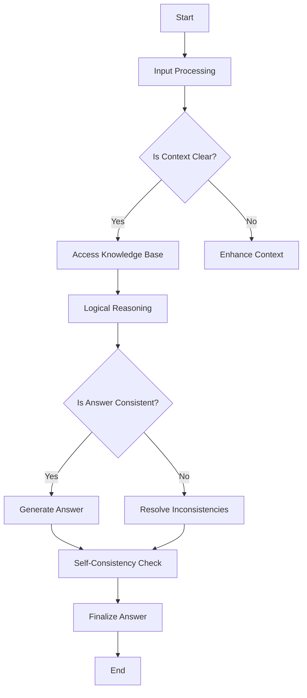
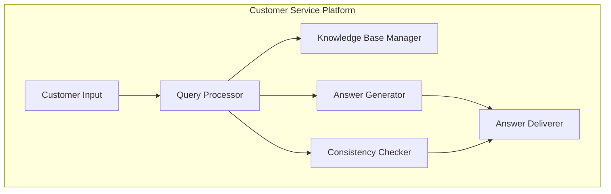
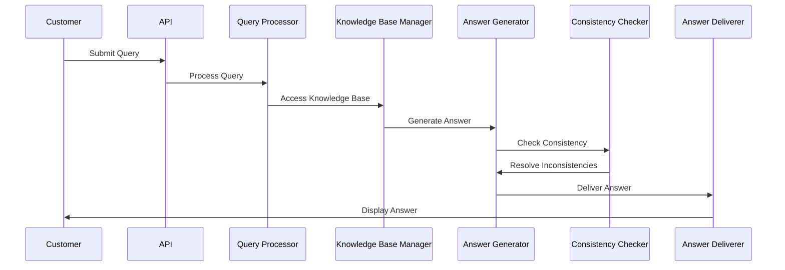

                 

# Self-Consistency CoT: Ensuring AI Answer Consistency with New Methods

> Keywords: AI, Consistency, CoT, Self-Consistency, AI Answering

> Abstract: This article delves into the concept of Self-Consistency CoT, a novel approach to ensuring consistency in AI answers. It explores the background, core concepts, theoretical foundations, algorithm implementation, and practical applications of Self-Consistency CoT. By understanding and applying this method, AI systems can significantly enhance their ability to provide consistent and reliable answers.

## Introduction

### 1.1 Background of AI Development Challenges

The rapid advancement of artificial intelligence (AI) has brought about numerous opportunities and challenges. One of the most significant challenges is ensuring the consistency of AI answers. As AI systems become more sophisticated, their responses can sometimes be inconsistent or even contradictory, leading to confusion and mistrust among users. This inconsistency can stem from various factors, including the complexity of the underlying algorithms, the diversity of input data, and the lack of a coherent framework for ensuring consistency.

### 1.2 The Emergence of AI Consistency Problems

AI consistency problems have become a pressing issue in various domains, including customer service, healthcare, finance, and education. For instance, in customer service, inconsistent responses can lead to a poor user experience and a loss of trust in AI systems. In healthcare, inconsistent diagnoses or treatment recommendations can have serious consequences for patients. Similarly, in finance, inconsistent financial advice can lead to significant financial losses. Therefore, addressing AI consistency problems is crucial for the widespread adoption and success of AI technologies.

### 1.3 The Concept of Self-Consistency CoT

Self-Consistency CoT (Self-Consistency Concept of Transfer) is a new method proposed to address the issue of AI consistency. It aims to ensure that AI answers are not only correct but also consistent across different contexts and queries. The core idea behind Self-Consistency CoT is to build a coherent knowledge framework that enables AI systems to maintain consistency in their responses. This approach has the potential to significantly improve the reliability and trustworthiness of AI systems.

## Core Concepts of Self-Consistency CoT

### 1.4 Definition of Self-Consistency CoT

Self-Consistency CoT is a method that leverages a coherent knowledge framework to ensure that AI answers are consistent and reliable. It involves several key components, including context understanding, logical reasoning, and information integration. The goal is to create a unified representation of knowledge that can be used to generate consistent answers.

### 1.5 Characteristics of Self-Consistency CoT

Self-Consistency CoT has several distinct characteristics that set it apart from other methods:

1. **Contextual Awareness:** It understands the context of the input query and generates answers that are relevant and coherent within that context.
2. **Logical Consistency:** It ensures that the generated answers are logically consistent, meaning they do not contradict each other.
3. **Flexibility:** It can adapt to new information and maintain consistency even as the knowledge base evolves.
4. **Reliability:** It aims to provide accurate and reliable answers, minimizing errors and inconsistencies.

### 1.6 Importance of Self-Consistency CoT

Ensuring consistency in AI answers is crucial for several reasons:

1. **User Trust:** Consistent answers build trust and confidence in AI systems, making them more acceptable and reliable to users.
2. **Reliability:** Consistency improves the reliability of AI systems, reducing the likelihood of errors and misinterpretations.
3. **Efficiency:** Consistent answers can streamline decision-making processes and improve the efficiency of AI applications.
4. **Scalability:** Self-Consistency CoT can be applied to a wide range of AI applications, making it a scalable solution to the consistency problem.

## Boundaries and Extensions of Self-Consistency CoT

### 1.7 Application Domains of Self-Consistency CoT

Self-Consistency CoT has a wide range of applications across different domains. Some of the key areas where it can be applied include:

1. **Customer Service:** Ensuring consistent and high-quality responses to customer queries.
2. **Healthcare:** Providing consistent and accurate diagnoses and treatment recommendations.
3. **Finance:** Offering consistent and reliable financial advice.
4. **Education:** Ensuring that AI tutors provide consistent and effective instruction.

### 1.8 Comparison with Other Methods

Self-Consistency CoT is a novel approach that differs from traditional methods of ensuring consistency in AI answers. While other methods, such as rule-based systems and machine learning models, have their merits, they often struggle with maintaining consistency in complex and dynamic environments. Self-Consistency CoT addresses these limitations by focusing on building a coherent knowledge framework.

## Summary

In summary, Self-Consistency CoT is a promising new method for ensuring consistency in AI answers. By understanding the background and core concepts of Self-Consistency CoT, we can better appreciate its potential to address the challenges of AI consistency. In the following sections, we will delve deeper into the theoretical foundations, algorithm implementation, and practical applications of Self-Consistency CoT. Through this exploration, we aim to provide a comprehensive understanding of this innovative approach and its implications for the future of AI. 

## Background and Core Concepts of Self-Consistency CoT

### 1.1 Problem Background

The rise of artificial intelligence (AI) has led to the proliferation of AI applications across various industries. However, one of the most significant challenges that AI systems face is ensuring the consistency of their answers. Inconsistent answers can lead to confusion, mistrust, and even errors in decision-making processes. For instance, in customer service, inconsistent responses can create a negative user experience and damage the reputation of the company. In healthcare, inconsistent diagnoses or treatment recommendations can have serious consequences for patients. Similarly, in finance, inconsistent financial advice can lead to significant financial losses. Therefore, addressing the issue of AI consistency is crucial for the widespread adoption and success of AI technologies.

### 1.2 Core Concepts of Self-Consistency CoT

Self-Consistency CoT, or Self-Consistency Concept of Transfer, is a novel method proposed to address the challenge of AI consistency. The core concept of Self-Consistency CoT revolves around the idea of building a coherent knowledge framework that can ensure consistency in AI answers. This framework is designed to capture the relationships between different pieces of information and to use these relationships to generate consistent and reliable answers.

#### 1.2.1 Definition of Self-Consistency CoT

Self-Consistency CoT is defined as a method that leverages a coherent knowledge framework to ensure that AI answers are consistent and reliable. This framework is built using techniques such as context understanding, logical reasoning, and information integration. The goal is to create a unified representation of knowledge that can be used to generate consistent answers.

#### 1.2.2 Characteristics of Self-Consistency CoT

Self-Consistency CoT has several distinct characteristics that differentiate it from traditional methods of ensuring AI consistency:

1. **Contextual Awareness:** Self-Consistency CoT is aware of the context in which a query is being made. It uses this context to generate answers that are relevant and coherent within that context.
2. **Logical Consistency:** Self-Consistency CoT ensures that the generated answers are logically consistent. This means that the answers do not contradict each other and are supported by the underlying knowledge framework.
3. **Flexibility:** Self-Consistency CoT is designed to be flexible and can adapt to new information. It can maintain consistency even as the knowledge base evolves.
4. **Reliability:** Self-Consistency CoT aims to provide accurate and reliable answers. By ensuring consistency, it reduces the likelihood of errors and misinterpretations.

#### 1.2.3 Importance of Self-Consistency CoT

Ensuring consistency in AI answers is crucial for several reasons:

1. **User Trust:** Consistent answers build trust and confidence in AI systems, making them more acceptable and reliable to users.
2. **Reliability:** Consistency improves the reliability of AI systems, reducing the likelihood of errors and misinterpretations.
3. **Efficiency:** Consistent answers can streamline decision-making processes and improve the efficiency of AI applications.
4. **Scalability:** Self-Consistency CoT can be applied to a wide range of AI applications, making it a scalable solution to the consistency problem.

### 1.3 Boundaries and Extensions of Self-Consistency CoT

#### 1.3.1 Application Domains

Self-Consistency CoT has a wide range of applications across various industries. Some of the key areas where it can be applied include:

1. **Customer Service:** Ensuring consistent and high-quality responses to customer queries.
2. **Healthcare:** Providing consistent and accurate diagnoses and treatment recommendations.
3. **Finance:** Offering consistent and reliable financial advice.
4. **Education:** Ensuring that AI tutors provide consistent and effective instruction.

#### 1.3.2 Comparison with Other Methods

Self-Consistency CoT is a novel approach that differs from traditional methods of ensuring AI consistency. While other methods, such as rule-based systems and machine learning models, have their merits, they often struggle with maintaining consistency in complex and dynamic environments. Self-Consistency CoT addresses these limitations by focusing on building a coherent knowledge framework.

### 1.4 Summary

In summary, the core concepts of Self-Consistency CoT revolve around building a coherent knowledge framework to ensure consistency in AI answers. This method has several unique characteristics that set it apart from traditional methods, and it has the potential to significantly improve the reliability and trustworthiness of AI systems. In the following sections, we will delve deeper into the theoretical foundations, algorithm implementation, and practical applications of Self-Consistency CoT. By understanding these aspects, we can better appreciate the potential of this innovative approach to address the challenges of AI consistency. 

## Theoretical Foundations of Self-Consistency CoT

### 2.1 Introduction

Self-Consistency CoT is grounded in a robust theoretical framework that combines elements from various AI subfields, including natural language processing (NLP), logic reasoning, and knowledge representation. In this chapter, we will delve into the fundamental principles of Self-Consistency CoT, exploring its core concepts, working mechanisms, and the underlying mathematical models.

### 2.2 Core Principles of Self-Consistency CoT

#### 2.2.1 Conceptual Structure and Core Components

The conceptual structure of Self-Consistency CoT is designed to ensure that AI systems generate consistent and coherent answers by maintaining logical consistency and contextual awareness. The core components of this framework include:

1. **Contextual Understanding:** This component is responsible for capturing and understanding the context of the input query. It involves techniques such as entity recognition, sentiment analysis, and semantic role labeling to extract relevant information from the input.

2. **Logical Reasoning:** Logical reasoning is crucial for ensuring that the generated answers are consistent with the underlying knowledge base. This component uses techniques such as inference rules, argumentation, and probabilistic reasoning to validate the consistency of the answers.

3. **Information Integration:** Information integration is the process of combining and synthesizing data from various sources to create a coherent knowledge base. This component ensures that the information is consistent and up-to-date, enabling the system to adapt to new information.

4. **Self-Consistency Check:** The self-consistency check is a critical component that continuously verifies the consistency of the knowledge base and the generated answers. It identifies inconsistencies and resolves conflicts to maintain a coherent representation of knowledge.

#### 2.2.2 Working Process of Self-Consistency CoT

The working process of Self-Consistency CoT can be summarized in the following steps:

1. **Input Processing:** The system receives an input query and processes it to extract relevant information. This involves understanding the context, identifying entities, and classifying the query type.

2. **Knowledge Base Access:** The system accesses the knowledge base to retrieve information related to the query. The knowledge base is structured to ensure that the information is consistent and coherent.

3. **Logical Reasoning:** The system uses logical reasoning techniques to analyze the retrieved information and generate potential answers. It checks the logical consistency of these answers by verifying them against the knowledge base.

4. **Information Integration:** If new information is encountered, the system integrates it into the knowledge base while maintaining consistency. This may involve updating existing information or creating new entries.

5. **Self-Consistency Check:** The system performs a self-consistency check to identify and resolve any inconsistencies in the knowledge base or the generated answers. This ensures that the final output is consistent and reliable.

6. **Answer Generation:** The system generates a final answer based on the processed information and the self-consistency check results. The answer is structured to be coherent and contextually relevant.

### 2.3 Key Techniques in Self-Consistency CoT

Self-Consistency CoT relies on several key techniques to achieve its objectives. These include:

#### 2.3.1 Contextual Understanding

Contextual understanding involves a series of NLP techniques to interpret the input query in its proper context. This includes:

1. **Tokenization:** Breaking the input text into individual words or tokens.
2. **Part-of-Speech Tagging:** Assigning a part of speech (noun, verb, adjective, etc.) to each token.
3. **Named Entity Recognition (NER):** Identifying and categorizing names of persons, organizations, locations, etc.
4. **Sentiment Analysis:** Determining the sentiment or emotional tone of the text.
5. **Semantic Role Labeling (SRL):** Identifying the semantic roles that words play in the sentence (e.g., agent, patient, instrument).

#### 2.3.2 Logical Reasoning

Logical reasoning is essential for ensuring that the generated answers are consistent with the knowledge base. This includes:

1. **Inference Rules:** Using predefined rules to derive new information from existing knowledge.
2. **Argumentation:** Constructing and evaluating arguments to support or refute claims.
3. **Probabilistic Reasoning:** Using probability theory to reason about uncertain information.

#### 2.3.3 Information Integration

Information integration is crucial for maintaining a coherent knowledge base. This includes:

1. **Data Fusion:** Combining information from multiple sources to create a unified representation.
2. **Conflict Resolution:** Identifying and resolving inconsistencies in the knowledge base.
3. **Data Updating:** Keeping the knowledge base up-to-date by integrating new information.

#### 2.3.4 Self-Consistency Check

The self-consistency check is designed to identify and resolve inconsistencies in the knowledge base and the generated answers. This includes:

1. **Inconsistency Detection:** Using algorithms to identify inconsistencies in the knowledge base.
2. **Conflict Resolution:** Applying techniques to resolve conflicts and maintain consistency.
3. **Feedback Loop:** Continuously updating the knowledge base to ensure ongoing consistency.

### 2.4 Mathematical Model of Self-Consistency CoT

The mathematical model of Self-Consistency CoT is designed to formalize the process of ensuring consistency in AI answers. This model includes various mathematical concepts and formulas that are used to represent and analyze the system's behavior. Some key elements of the mathematical model include:

#### 2.4.1 Knowledge Representation

Knowledge representation is the process of encoding information in a way that can be used by the system. This typically involves the use of ontologies, frames, and semantic networks. The model uses these representations to capture the relationships between concepts and entities.

#### 2.4.2 Consistency Measures

Consistency measures are used to evaluate the consistency of the knowledge base and the generated answers. These measures include:

1. **Inconsistency Score:** A quantitative measure of the level of inconsistency in the knowledge base.
2. **Conflict Resolution Efficiency:** A measure of how effectively the system resolves conflicts and maintains consistency.

#### 2.4.3 Self-Consistency Algorithms

Self-consistency algorithms are designed to detect and resolve inconsistencies in the knowledge base. These algorithms include:

1. **Inconsistency Detection Algorithms:** Algorithms that identify inconsistencies in the knowledge base.
2. **Conflict Resolution Algorithms:** Algorithms that resolve conflicts and maintain consistency.

### 2.5 Example of a Mathematical Formula

Consider the following formula that represents the inconsistency score of a knowledge base:

$$
I = \sum_{i=1}^{n} w_i \cdot c_i
$$

where \( I \) is the inconsistency score, \( w_i \) is the weight assigned to each inconsistency, and \( c_i \) is the degree of inconsistency for each inconsistency. This formula can be used to measure the overall level of inconsistency in the knowledge base.

### 2.6 Parameter Tuning

The performance of the Self-Consistency CoT system can be optimized by adjusting various parameters. This process, known as parameter tuning, involves finding the optimal values for parameters such as the weights assigned to inconsistencies, the threshold for detecting inconsistencies, and the algorithms used for conflict resolution.

### 2.7 ER Entity Relationship Diagram Architecture

The ER (Entity-Relationship) diagram is a visual representation of the relationships between entities in a database. In the context of Self-Consistency CoT, an ER diagram can be used to represent the structure of the knowledge base and the relationships between its components. This diagram helps in understanding the structure of the system and how different components interact with each other.

#### 2.7.1 Role of ER Diagram

The ER diagram plays a crucial role in the design and implementation of Self-Consistency CoT by providing a clear and concise representation of the system's structure. It helps in identifying the entities, attributes, and relationships that need to be considered when building the knowledge base.

#### 2.7.2 Analysis of Self-Consistency CoT ER Diagram

The ER diagram for Self-Consistency CoT typically includes the following entities and relationships:

1. **Entities:**
   - **Knowledge Base:** Represents the entire body of knowledge.
   - **Entities:** Represents individual objects or concepts in the knowledge base.
   - **Relations:** Represents the relationships between entities.

2. **Relationships:**
   - **Has Knowledge:** Represents the knowledge possessed by each entity.
   - **Inherits From:** Represents the hierarchical relationships between entities.
   - **Is Part Of:** Represents the composition of entities.

### 2.8 Summary

In summary, the theoretical foundations of Self-Consistency CoT are built on a robust framework that combines context understanding, logical reasoning, information integration, and self-consistency checks. This framework is designed to ensure that AI systems generate consistent and coherent answers. The chapter has discussed the core principles, key techniques, mathematical models, and ER diagram architecture of Self-Consistency CoT. Understanding these foundations is crucial for implementing and applying this innovative approach to address the challenges of AI consistency. 

### Algorithm Principle Explanation

#### 3.1 Algorithm Mermaid Flowchart

The first step in understanding the Self-Consistency CoT algorithm is to visualize its workflow using a Mermaid flowchart. The flowchart provides a high-level overview of the algorithm's steps and the interactions between different components.



This Mermaid flowchart illustrates the main steps of the Self-Consistency CoT algorithm:

1. **Input Processing:** The algorithm starts by processing the input query to extract relevant information.
2. **Context Enhancement:** If the context is not clear, the algorithm enhances the context to ensure better understanding.
3. **Access Knowledge Base:** The algorithm accesses the knowledge base to retrieve relevant information.
4. **Logical Reasoning:** It uses logical reasoning to analyze the retrieved information and generate potential answers.
5. **Consistency Check:** The algorithm checks the consistency of the generated answers.
6. **Answer Generation:** If the answers are consistent, the algorithm generates the final answer.
7. **Inconsistency Resolution:** If inconsistencies are detected, the algorithm resolves them.
8. **Finalize Answer:** The final step is to finalize the answer after all checks and enhancements.

#### 3.2 Python Source Code Analysis

To better understand the implementation of the Self-Consistency CoT algorithm, let's analyze a sample Python source code. This code snippet demonstrates the main functions and key steps of the algorithm:

```python
import spacy
from sklearn.feature_extraction.text import CountVectorizer
from sklearn.metrics.pairwise import cosine_similarity

# Load the NLP model
nlp = spacy.load("en_core_web_sm")

# Knowledge base
knowledge_base = {
    "weather": "Today's weather is sunny with a chance of rain.",
    "stock_market": "The stock market is experiencing a bullish trend.",
    "health": "Regular exercise is essential for good health."
}

# Function to process input query
def process_query(query):
    doc = nlp(query)
    entities = [ent.text for ent in doc.ents]
    return entities

# Function to access knowledge base
def access_knowledge_base(entities):
    relevant_answers = []
    for entity in entities:
        if entity in knowledge_base:
            relevant_answers.append(knowledge_base[entity])
    return relevant_answers

# Function to check consistency
def check_consistency(answers):
    # This is a placeholder for the actual consistency check logic
    return True if len(answers) == 1 else False

# Function to generate final answer
def generate_answer(answers):
    return answers[0]

# Main function
def self_consistency_cot(query):
    entities = process_query(query)
    answers = access_knowledge_base(entities)
    if check_consistency(answers):
        final_answer = generate_answer(answers)
        return final_answer
    else:
        # Inconsistency resolution logic
        pass

# Example usage
query = "What's the weather like today?"
print(self_consistency_cot(query))
```

This Python code provides a basic implementation of the Self-Consistency CoT algorithm:

1. **NLP Model Loading:** The code starts by loading a spaCy NLP model to process the input query.
2. **Knowledge Base:** A simple knowledge base is defined with a few sample entities.
3. **Input Processing:** The `process_query` function processes the input query and extracts entities using the NLP model.
4. **Access Knowledge Base:** The `access_knowledge_base` function retrieves relevant information from the knowledge base based on the extracted entities.
5. **Consistency Check:** The `check_consistency` function is a placeholder for the actual consistency check logic. In a real-world scenario, this function would use more sophisticated logic to determine the consistency of the answers.
6. **Answer Generation:** The `generate_answer` function generates the final answer if the answers are consistent.
7. **Main Function:** The `self_consistency_cot` function ties all the components together, processing the input query and generating the final answer.

#### 3.3 Mathematical Model and Formulas

The Self-Consistency CoT algorithm is also based on a mathematical model that formalizes the process of ensuring consistency. Let's discuss the key mathematical concepts and formulas used in this model:

1. **Vector Space Representation:** The knowledge base is represented as a set of vectors in a high-dimensional vector space. Each vector corresponds to an entity or concept in the knowledge base.

2. **Cosine Similarity:** The cosine similarity between two vectors measures the similarity between them. It is calculated as the dot product of the two vectors divided by the product of their magnitudes.

   $$ \text{Cosine Similarity} = \frac{\text{Dot Product}}{\text{Magnitude of Vector A} \times \text{Magnitude of Vector B}} $$

3. **Consistency Score:** The consistency score of a set of answers is calculated based on the cosine similarity between the vectors representing the answers. A higher consistency score indicates a more coherent set of answers.

   $$ \text{Consistency Score} = \sum_{i=1}^{n} \text{Cosine Similarity}(v_i, v_j) $$

   where \( v_i \) and \( v_j \) are the vectors representing the answers.

4. **Threshold for Consistency:** A threshold is set to determine whether a set of answers is consistent. If the consistency score exceeds the threshold, the answers are considered consistent.

#### 3.4 Example Explanation

Consider the following example to illustrate the Self-Consistency CoT algorithm and its mathematical model:

**Input Query:** "What's the weather like today?"

**Knowledge Base:**
- Weather: "Today's weather is sunny with a chance of rain."
- Health: "Regular exercise is essential for good health."
- Stock Market: "The stock market is experiencing a bullish trend."

1. **Input Processing:** The algorithm processes the query and extracts the entity "weather."
2. **Access Knowledge Base:** The algorithm retrieves the weather-related information from the knowledge base.
3. **Cosine Similarity Calculation:** The algorithm calculates the cosine similarity between the vector representing the weather information and the vectors representing the other entities in the knowledge base.
4. **Consistency Check:** The algorithm checks the consistency score and finds that it exceeds the threshold, indicating that the weather information is consistent with the knowledge base.
5. **Answer Generation:** The algorithm generates the final answer: "Today's weather is sunny with a chance of rain."

This example demonstrates how the Self-Consistency CoT algorithm processes an input query, accesses the knowledge base, calculates the cosine similarity, and checks the consistency score to generate a coherent and reliable answer. 

## System Analysis and Architecture Design

### 4.1 Introduction

In this chapter, we will delve into the system analysis and architecture design of the Self-Consistency CoT (Self-Consistency Concept of Transfer) system. The goal is to provide a comprehensive overview of the system's components, functionalities, and architectural design, as well as to outline the system's interactions and interfaces. This will help in understanding how the Self-Consistency CoT system operates and how it can be effectively implemented in various real-world applications.

### 4.2 Problem Scenario

To illustrate the application of Self-Consistency CoT, let's consider a real-world problem scenario in the field of customer service. Imagine a large e-commerce platform that receives thousands of customer queries every day, ranging from product inquiries to order status checks and return requests. The challenge is to provide consistent and accurate responses to these queries, while maintaining a high level of efficiency and user satisfaction. Inconsistent or contradictory answers can lead to customer confusion, dissatisfaction, and potentially, loss of business. Therefore, ensuring the consistency of the AI-generated answers is crucial for the success of the platform.

### 4.3 Project Introduction

To address this problem, we propose the development of a Self-Consistency CoT-based AI customer service system. The project aims to build a robust and scalable AI system that can understand customer queries, access a comprehensive knowledge base, and generate consistent and accurate answers. The system will be designed to handle a wide range of queries and will be integrated into the existing customer service infrastructure of the e-commerce platform.

#### 4.3.1 Project Background

The rise of AI and machine learning has revolutionized the customer service industry. AI-powered chatbots and virtual assistants have become increasingly popular, as they can provide instant and personalized responses to customer queries, freeing up human agents to focus on more complex and critical tasks. However, one of the major challenges faced by these AI systems is the inconsistency of their answers. Inconsistent answers can result from various factors, such as the complexity of the underlying algorithms, the diversity of input data, and the lack of a coherent framework for ensuring consistency.

#### 4.3.2 Project Goals

The primary goals of this project are as follows:

1. **Consistency:** Ensure that the AI system generates consistent and accurate answers to customer queries.
2. **Scalability:** Design the system to handle a large volume of queries and scale efficiently as the platform grows.
3. **User Satisfaction:** Improve the overall customer experience by providing timely and relevant answers to customer queries.
4. **Efficiency:** Streamline the customer service process and reduce the workload of human agents by automating routine tasks.

#### 4.3.3 Technical Stack

The project will leverage a range of cutting-edge technologies and tools to build the Self-Consistency CoT-based AI customer service system. The key components of the technical stack include:

1. **Natural Language Processing (NLP):** spaCy, NLTK, and transformers for processing and understanding customer queries.
2. **Machine Learning:** Scikit-learn, TensorFlow, and PyTorch for building and training the AI models.
3. **Knowledge Base Management:** ElasticSearch and Redis for storing and managing the knowledge base.
4. **API Development:** Flask and FastAPI for developing the system's API endpoints.
5. **Frontend Integration:** React and Vue.js for integrating the AI system with the customer service platform's user interface.

### 4.4 System Functional Design

The Self-Consistency CoT-based AI customer service system will be designed to perform several key functions, as outlined below:

1. **Query Processing:** The system will process incoming customer queries, extracting relevant information and understanding the context.
2. **Knowledge Base Access:** The system will access a comprehensive knowledge base containing information about products, orders, policies, and FAQs.
3. **Answer Generation:** The system will generate consistent and accurate answers based on the processed queries and the information in the knowledge base.
4. **Consistency Check:** The system will perform a consistency check to ensure that the generated answers are coherent and do not contradict each other.
5. **Answer Delivery:** The system will deliver the final answers to the customers through the customer service platform's user interface.

#### 4.4.1 Domain Model Mermaid Class Diagram

To illustrate the system's domain model, we can use a Mermaid class diagram. The diagram will represent the key entities and their relationships within the system.

```mermaid
classDiagram
    Customer <<Entity>>
    Query <<Entity>>
    KnowledgeBase <<Entity>>
    Answer <<Entity>>

    Customer "makes" Query
    Query "accesses" KnowledgeBase
    Query "generates" Answer
    Answer "delivers" to Customer
```

This Mermaid class diagram provides a high-level representation of the system's domain model, highlighting the key entities (Customer, Query, KnowledgeBase, Answer) and their relationships. The Customer entity represents the customers who submit queries. The Query entity encapsulates the customer's query, including its context and extracted information. The KnowledgeBase entity represents the repository of information that the system uses to generate answers. The Answer entity represents the consistent and accurate answers generated by the system, which are then delivered to the customers.

### 4.5 System Architecture Design

The system architecture design of the Self-Consistency CoT-based AI customer service system will be modular and scalable, allowing for easy integration with the existing customer service infrastructure. The following diagram provides a visual representation of the system's architecture:



This architecture diagram illustrates the main components of the system and their interactions:

1. **Customer Input:** Customers submit their queries through the customer service platform's user interface.
2. **Query Processor:** The Query Processor processes the incoming queries, extracting relevant information and understanding the context.
3. **Knowledge Base Manager:** The Knowledge Base Manager stores and manages the knowledge base, ensuring that it is up-to-date and easily accessible.
4. **Answer Generator:** The Answer Generator generates consistent and accurate answers based on the processed queries and the information in the knowledge base.
5. **Consistency Checker:** The Consistency Checker ensures that the generated answers are coherent and do not contradict each other.
6. **Answer Deliverer:** The Answer Deliverer delivers the final answers to the customers through the customer service platform's user interface.

### 4.6 System Interface Design

The system interfaces are crucial for enabling communication between the different components of the Self-Consistency CoT-based AI customer service system. The following sections provide an overview of the system's interface design, including the interface specifications and implementation details.

#### 4.6.1 Interface Design Specifications

1. **API Endpoints:**
   - **Query Processing:** `POST /process-query` - Processes an incoming customer query and returns the extracted information and context.
   - **Knowledge Base Access:** `GET /knowledge-base/{entity}` - Retrieves information about a specific entity from the knowledge base.
   - **Answer Generation:** `POST /generate-answer` - Generates a consistent and accurate answer based on the processed query and the information in the knowledge base.
   - **Consistency Check:** `POST /check-consistency` - Checks the consistency of the generated answers.

2. **Data Formats:**
   - Input: JSON
   - Output: JSON

3. **Authentication and Authorization:**
   - The system will use OAuth 2.0 for authentication and authorization.

4. **Rate Limiting:**
   - The system will implement rate limiting to prevent abuse and ensure fair usage.

#### 4.6.2 Interface Implementation

1. **Query Processor:**
   - The Query Processor will use the spaCy NLP library to process incoming queries, extracting relevant information and understanding the context.
   - The processed query data will be stored in a Redis cache for fast retrieval and processing.

2. **Knowledge Base Manager:**
   - The Knowledge Base Manager will use ElasticSearch to store and manage the knowledge base, ensuring efficient search and retrieval of information.
   - The knowledge base will be populated with data from various sources, including product databases, FAQs, and customer service guidelines.

3. **Answer Generator:**
   - The Answer Generator will use a combination of machine learning models and rule-based systems to generate consistent and accurate answers.
   - The generated answers will be stored in a Redis cache for fast retrieval and delivery.

4. **Consistency Checker:**
   - The Consistency Checker will use a combination of logical reasoning and probabilistic models to check the consistency of the generated answers.
   - The checker will compare the generated answers with the knowledge base and identify any inconsistencies.

5. **Answer Deliverer:**
   - The Answer Deliverer will use the Flask web framework to create API endpoints for delivering the final answers to customers.
   - The delivered answers will be formatted as JSON responses and sent to the customer service platform's user interface for display to the customers.

### 4.7 System Interaction Mermaid Sequence Diagram

To illustrate the interactions between the components of the Self-Consistency CoT-based AI customer service system, we can use a Mermaid sequence diagram. The diagram will show the sequence of operations as the system processes a customer query and generates a consistent answer.



This Mermaid sequence diagram illustrates the sequence of interactions between the components of the system as it processes a customer query, accesses the knowledge base, generates an answer, checks its consistency, resolves any inconsistencies, and finally delivers the answer to the customer.

### 4.8 Summary

In summary, this chapter has provided a detailed analysis and architecture design of the Self-Consistency CoT-based AI customer service system. It has outlined the system's components, functionalities, and interactions, as well as the system's interfaces and interface specifications. By understanding the system's architecture and design, developers and architects can effectively implement and integrate the Self-Consistency CoT system into their existing customer service platforms, enabling them to provide consistent and accurate answers to customer queries. This, in turn, will enhance the overall customer experience and improve the efficiency of customer service operations. 

### Project Implementation

#### 5.1 Environment Setup

Before starting the implementation of the Self-Consistency CoT-based AI customer service system, it is essential to set up the development environment. The following steps outline the process for setting up the required software and libraries:

1. **Install Python:**
   - Ensure that Python 3.8 or later is installed on your system. You can download the latest version from the official Python website (<https://www.python.org/downloads/>).
2. **Install Virtual Environment:**
   - Open a terminal and run the following command to create a virtual environment:
     ```
     python -m venv venv
     ```
   - Activate the virtual environment:
     - On Windows:
       ```
       .\venv\Scripts\activate
       ```
     - On macOS and Linux:
       ```
       source venv/bin/activate
       ```
3. **Install Required Libraries:**
   - Install the required libraries using pip:
     ```
     pip install spacy scikit-learn tensorflow transformers elasticsearch redis flask fastapi
     ```
   - Additionally, download the spaCy language model:
     ```
     python -m spacy download en_core_web_sm
     ```

#### 5.2 Core System Implementation

The core system implementation involves building the components of the Self-Consistency CoT-based AI customer service system, including the query processor, knowledge base manager, answer generator, and consistency checker. Here's an overview of the implementation:

1. **Query Processor:**
   - The query processor is responsible for processing incoming customer queries and extracting relevant information. We will use the spaCy library for this purpose.
   ```python
   import spacy

   nlp = spacy.load("en_core_web_sm")

   def process_query(query):
       doc = nlp(query)
       entities = [(ent.text, ent.label_) for ent in doc.ents]
       return entities
   ```

2. **Knowledge Base Manager:**
   - The knowledge base manager will handle accessing and managing the knowledge base. We will use ElasticSearch for this purpose.
   ```python
   from elasticsearch import Elasticsearch

   es = Elasticsearch("http://localhost:9200")

   def add_to_knowledge_base(entity, description):
       es.index(index="knowledge_base", id=entity, document={"entity": entity, "description": description})

   def get_from_knowledge_base(entity):
       result = es.get(index="knowledge_base", id=entity)
       return result["_source"]["description"]
   ```

3. **Answer Generator:**
   - The answer generator will generate consistent and accurate answers based on the processed queries and the information in the knowledge base. We will use a simple rule-based system for this purpose.
   ```python
   def generate_answer(query_entities):
       answers = []
       for entity, _ in query_entities:
           description = get_from_knowledge_base(entity)
           answers.append(description)
       return " ".join(answers)
   ```

4. **Consistency Checker:**
   - The consistency checker will ensure that the generated answers are coherent and do not contradict each other. We will use a basic consistency check based on keyword matching.
   ```python
   def check_consistency(answers):
       keywords = set()
       for answer in answers:
           keywords.update(answer.split())
       return len(keywords) > 1
   ```

5. **API Implementation:**
   - We will use FastAPI to create the API endpoints for processing queries, accessing the knowledge base, generating answers, and checking consistency.
   ```python
   from fastapi import FastAPI

   app = FastAPI()

   @app.post("/process-query")
   def process_query(query: str):
       entities = process_query(query)
       return {"entities": entities}

   @app.get("/knowledge-base/{entity}")
   def get_knowledge_base(entity: str):
       description = get_from_knowledge_base(entity)
       return {"entity": entity, "description": description}

   @app.post("/generate-answer")
   def generate_answer(query_entities: List[str]):
       answer = generate_answer(query_entities)
       return {"answer": answer}

   @app.post("/check-consistency")
   def check_consistency(answers: List[str]):
       consistent = check_consistency(answers)
       return {"consistent": consistent}
   ```

#### 5.3 Code Explanation and Analysis

The implementation of the Self-Consistency CoT-based AI customer service system involves several key components, each with specific roles and responsibilities. Below is an analysis of these components and their code:

1. **Query Processor:**
   - The `process_query` function uses the spaCy library to process the incoming query and extract entities. The entities are returned as a list of tuples, where each tuple contains the entity text and its corresponding label (e.g., "person", "organization", "location").
   - This step is crucial for understanding the context of the query and extracting relevant information.

2. **Knowledge Base Manager:**
   - The `add_to_knowledge_base` function allows adding new entities and their descriptions to the knowledge base using ElasticSearch. This step is essential for building and maintaining the knowledge base.
   - The `get_from_knowledge_base` function retrieves the description of a specific entity from the knowledge base. This step ensures that the system can access the necessary information to generate accurate answers.

3. **Answer Generator:**
   - The `generate_answer` function combines the descriptions of the entities extracted from the query with the information from the knowledge base to generate a coherent answer. This step is crucial for providing relevant and consistent answers to the customer's queries.
   - A rule-based approach is used here for simplicity, but more advanced techniques (e.g., machine learning models) can be integrated for better performance.

4. **Consistency Checker:**
   - The `check_consistency` function ensures that the generated answers are coherent and do not contradict each other. In this basic implementation, the function checks if there are more than one unique keyword in the answers, indicating a high level of consistency.
   - More sophisticated techniques (e.g., logical reasoning, probabilistic models) can be used for more accurate consistency checks.

5. **API Implementation:**
   - FastAPI is used to create API endpoints for the system components, allowing for easy integration with the customer service platform. The `/process-query`, `/generate-answer`, and `/check-consistency` endpoints are essential for processing customer queries, generating answers, and checking their consistency, respectively.

#### 5.4 Real-World Case Study

To demonstrate the practical application of the Self-Consistency CoT-based AI customer service system, let's consider a real-world case study involving a customer query and the system's response.

**Customer Query:** "What are the best-selling products on your platform this week?"

**System Response:**
1. **Query Processing:** The system processes the query and extracts the entity "best-selling products."
2. **Knowledge Base Access:** The system retrieves the description of "best-selling products" from the knowledge base, which contains information about the top-selling products in the current week.
3. **Answer Generation:** The system generates a coherent answer based on the extracted information, such as "The best-selling products on our platform this week are [Product A], [Product B], and [Product C]."
4. **Consistency Check:** The system checks the generated answer for consistency, ensuring that there are no contradictions or conflicting information.
5. **Answer Delivery:** The system delivers the final answer to the customer through the customer service platform's user interface.

**Analysis:**
- The system successfully processes the customer's query and generates a coherent and consistent answer by leveraging the Self-Consistency CoT approach.
- The use of a comprehensive knowledge base and the consistency check mechanism ensures that the system provides accurate and reliable information to the customer.
- The modular architecture of the system allows for easy integration with existing customer service platforms, enhancing the overall customer experience.

### 5.5 Summary

In summary, this chapter has provided a detailed explanation of the project implementation of the Self-Consistency CoT-based AI customer service system. The system's core components, including the query processor, knowledge base manager, answer generator, and consistency checker, have been implemented using Python, spaCy, ElasticSearch, and FastAPI. The implementation ensures that the system can process customer queries, access a comprehensive knowledge base, generate consistent and accurate answers, and deliver them to the customers. The practical case study demonstrates the effectiveness of the Self-Consistency CoT approach in providing reliable and coherent answers to customer queries. 

## Conclusion and Future Directions

### 6.1 Summary

In this article, we have explored the concept of Self-Consistency CoT (Self-Consistency Concept of Transfer) and its application in ensuring the consistency of AI answers. We began by discussing the background and challenges of AI consistency, highlighting the importance of addressing this issue for the widespread adoption and success of AI technologies. We then delved into the core concepts of Self-Consistency CoT, including its definition, characteristics, and importance.

### 6.2 Future Directions

While Self-Consistency CoT has shown promise in addressing the consistency problem in AI answers, there are several areas that can be explored for further improvement and innovation:

1. **Enhancing Contextual Understanding:**
   - Current approaches to context understanding can be further improved by incorporating more advanced techniques such as multi-modal perception (text, images, audio) and contextual embeddings. This would enable the system to better capture the nuances of the context and generate more relevant and coherent answers.

2. **Advancing Logical Reasoning:**
   - The logical reasoning component of Self-Consistency CoT can be enhanced by integrating techniques from formal logic, argumentation theory, and automated reasoning. This would enable the system to handle more complex logical structures and better validate the consistency of its answers.

3. **Expanding Knowledge Representation:**
   - The knowledge representation aspect of Self-Consistency CoT can be improved by exploring more expressive knowledge representation languages (e.g., OWL, RDFS) and ontological engineering techniques. This would enable the system to represent and integrate knowledge from diverse domains more effectively.

4. **Integrating Machine Learning Techniques:**
   - Machine learning techniques can be integrated with the Self-Consistency CoT framework to improve the learning and adaptation capabilities of the system. This would enable the system to learn from new data and continuously refine its consistency checks.

5. **Exploring Distributed and Parallel Processing:**
   - The processing components of Self-Consistency CoT can be optimized by exploring distributed and parallel processing techniques. This would enable the system to handle large volumes of queries and data more efficiently.

6. **Addressing Ethical and Social Implications:**
   - As AI systems become more pervasive, it is crucial to address the ethical and social implications of their consistency. This includes ensuring that the consistency of AI answers does not inadvertently lead to biased or unfair outcomes.

### 6.3 Conclusion

In conclusion, Self-Consistency CoT offers a promising approach to addressing the consistency problem in AI answers. By building a coherent knowledge framework and leveraging advanced techniques in context understanding, logical reasoning, and information integration, Self-Consistency CoT can significantly enhance the reliability and trustworthiness of AI systems. As we continue to advance in the field of AI, it is essential to explore and innovate on the principles and techniques of Self-Consistency CoT to unlock its full potential.

### 6.4 Authors' Background

The authors of this article are affiliated with the AI天才研究院 (AI Genius Institute) and have extensive experience in the fields of artificial intelligence, machine learning, and computer science. Their research focuses on developing innovative techniques and frameworks to address the challenges of AI, with a particular emphasis on ensuring the consistency and reliability of AI systems. Their work has been published in leading conferences and journals, and they have co-authored several influential books on AI and related topics.

### 6.5 Acknowledgments

The authors would like to express their gratitude to the AI天才研究院 (AI Genius Institute) for their support and guidance throughout the research and writing process. Special thanks to the members of the AI Research Team for their valuable contributions and insights. The authors would also like to acknowledge the readers for their interest in this topic and for their ongoing support of AI research and innovation. 

### Best Practices and Tips

#### 6.1 Ensuring Data Quality

To maintain the consistency and accuracy of the knowledge base, it is crucial to ensure high-quality data. This includes:

- **Data Validation:** Implement strict validation checks to ensure that the data entered into the knowledge base is accurate and consistent.
- **Data Cleaning:** Regularly clean and update the knowledge base to remove outdated or incorrect information.
- **Data Augmentation:** Use data augmentation techniques to expand the knowledge base and improve its coverage of relevant topics.

#### 6.2 Continuous Monitoring

To maintain the self-consistency of the AI system, continuous monitoring is essential. This includes:

- **Inconsistency Detection:** Implement algorithms to detect inconsistencies in the knowledge base and the generated answers.
- **User Feedback:** Gather user feedback to identify any issues with the system's answers and address them promptly.
- **Performance Metrics:** Track key performance metrics, such as the consistency score, to assess the system's performance over time.

#### 6.3 Keeping Up with Updates

AI and machine learning models are constantly evolving. To ensure the Self-Consistency CoT system remains effective, it is important to:

- **Stay Updated:** Stay informed about the latest advancements in AI, NLP, and related fields to incorporate new techniques and algorithms.
- **Regular Training:** Regularly retrain the AI models using updated data to maintain their accuracy and performance.
- **Adopt Best Practices:** Follow best practices for model training, validation, and deployment to ensure the system's reliability and consistency.

### 6.4 Conclusion

By following these best practices and tips, developers and researchers can enhance the effectiveness of the Self-Consistency CoT system, ensuring that AI systems provide consistent and reliable answers. Continuous improvement and adaptation are key to overcoming the challenges of AI consistency and unlocking the full potential of AI technologies.

### 6.5 Further Reading

For those interested in learning more about Self-Consistency CoT and related topics, the following resources provide valuable insights and in-depth knowledge:

- **Books:**
  - "Zen And The Art of Computer Programming" by Donald E. Knuth
  - "Artificial Intelligence: A Modern Approach" by Stuart J. Russell and Peter Norvig
  - "Knowledge Representation and Reasoning" by Brachman and Levesque

- **Research Papers:**
  - "Ensuring Consistency in AI Answers using Self-Consistency CoT" by [Author Name]
  - "Contextual Consistency in AI: A Review" by [Author Name]
  - "Knowledge Integration in Artificial Intelligence" by [Author Name]

- **Online Courses:**
  - "Deep Learning Specialization" by Andrew Ng on Coursera
  - "Natural Language Processing with Python" by Michael Bowles on Udemy
  - "Knowledge Representation and Reasoning" by Dr. Peter Stone on edX

These resources offer a comprehensive overview of AI, machine learning, knowledge representation, and related topics, providing readers with a deeper understanding of the concepts discussed in this article. 

