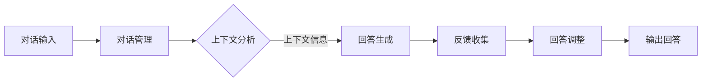
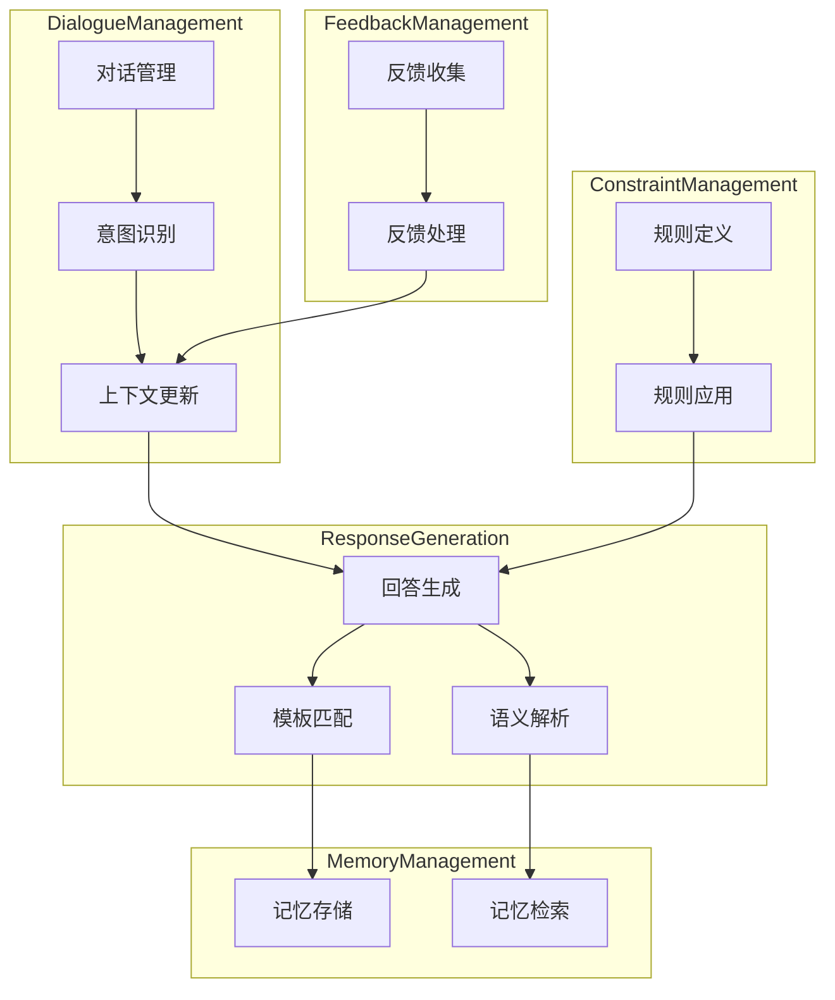
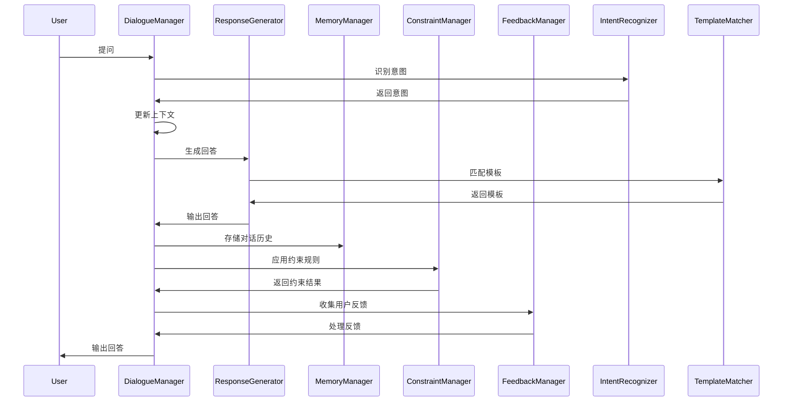

                 

### 文章标题

# Self-Consistency CoT: Ensuring Consistency in AI Answers' Strategies

### 关键词

- **自洽性（Self-Consistency）**
- **人工智能（Artificial Intelligence）**
- **一致性保证（Consistency Assurance）**
- **AI问答系统（AI Question-Answering Systems）**
- **策略分析（Strategy Analysis）**
- **算法优化（Algorithm Optimization）**

### 摘要

本文深入探讨了人工智能（AI）领域中的一个重要挑战：如何确保AI回答的一致性。通过分析自洽性（Self-Consistency）这一核心概念，本文提出了几种有效的策略来优化AI问答系统的表现。文章首先介绍了自洽性的定义和重要性，然后详细讲解了基于语境、记忆、约束和反馈等自洽性策略，并提供了算法原理和系统架构设计的详细解析。通过实际案例分析和项目实战，本文展示了如何将这些策略应用于开发高效的AI问答系统。文章旨在为读者提供一份全面、系统、实用的指南，帮助他们理解和实现AI回答的一致性保证。

## 第一部分：背景介绍与核心概念

### 第1章：问题背景

#### 1.1.1 问题背景：AI回答一致性的挑战

在人工智能（AI）迅速发展的今天，AI问答系统已经成为我们日常生活中不可或缺的一部分。然而，这些系统在实际应用中面临着许多挑战，其中最为显著的一个问题就是AI回答的一致性。不一致的回答不仅会降低用户的信任度，还可能导致误解和错误的决策。

**问题描述**：

1. **语境变化**：在多轮对话中，AI的回答可能会因为对上下文的误解而出现不一致的情况。例如，用户询问了两个看似相关但实际上含义不同的问题，AI的回答却没有及时更新上下文信息，导致回答不一致。
   
2. **信息丢失**：在某些情况下，AI可能会因为信息丢失或者记忆不完整，导致无法提供连贯的回答。例如，在一个问答系统中，某个问题需要依赖前一个问题的信息，但AI未能有效地保存这些信息，导致回答不连贯。

3. **多模态交互**：在涉及到图像、语音等多模态信息的交互中，AI的回答一致性变得更加复杂。如何确保不同模态的信息能够一致地传达给用户，是一个亟待解决的问题。

**问题解决**：

自洽性（Self-Consistency）概念的提出，为解决AI回答一致性提供了新的思路。通过在AI系统中引入自洽性机制，可以有效地提高回答的一致性，增强用户对AI系统的信任感。

**边界与外延**：

自洽性的边界主要在于对上下文信息的准确理解和信息的有效保存。在实际应用中，需要考虑不同语境下的适应性，以及多模态信息处理的复杂性。

**核心要素组成**：

1. **上下文管理**：确保AI能够准确理解和存储对话的上下文信息。
2. **记忆机制**：设计有效的记忆机制来保持信息的连贯性。
3. **反馈循环**：引入用户的反馈来不断调整和优化AI的回答。

#### 1.1.2 自洽性原理

**核心概念原理**：

自洽性指的是系统在处理信息时，能够保持内部一致性和连贯性的能力。在AI问答系统中，自洽性意味着AI能够根据对话的上下文提供一致且连贯的回答。

**概念属性特征对比表格**：

| 特征            | 自洽性       | 一致性       | 鲁棒性       |
|----------------|--------------|--------------|--------------|
| **定义**       | 保持内部一致性 | 信息的匹配与一致 | 对异常情况的抵抗 |
| **上下文依赖** | 强          | 中等          | 弱          |
| **反馈机制**   | 有          | 无          | 有或无      |
| **适用场景**   | 需要高连贯性回答的场景 | 需要信息一致的场景 | 需要高抗错能力的场景 |

**自洽性在AI系统中的地位**：

自洽性是AI系统实现高质量问答的基础。它不仅关系到用户体验，还影响到AI系统的可信度和实际应用价值。自洽性原理的正确理解和应用，对于提升AI问答系统的整体性能至关重要。

#### 1.1.3 自洽性策略

**常见自洽性策略**：

1. **基于语境的自洽性**：通过分析对话的上下文信息，确保回答的一致性。
2. **基于记忆的自洽性**：利用记忆机制来保持信息的连贯性。
3. **基于约束的自洽性**：通过预设的约束条件来保证回答的一致性。
4. **基于反馈的自洽性**：引入用户反馈来不断调整和优化回答。

**策略对比分析**：

- **基于语境的自洽性**：优点是能够根据上下文提供准确和连贯的回答，缺点是可能需要大量的上下文信息，处理复杂。
- **基于记忆的自洽性**：优点是能够长期保持信息的连贯性，缺点是可能受到记忆容量和精度限制。
- **基于约束的自洽性**：优点是简单易实现，缺点是可能过于严格，限制AI的自由度。
- **基于反馈的自洽性**：优点是能够根据用户反馈进行动态调整，缺点是需要大量的用户反馈数据。

### 第2章：核心概念与联系

#### 2.1.1 自洽性策略

**自洽性策略**是确保AI回答一致性的关键方法。以下将详细介绍几种常见的自洽性策略，包括其原理、实现方式和优缺点。

**基于语境的自洽性策略**：

1. **原理**：通过深入分析和理解对话的上下文信息，确保AI的回答能够与当前语境保持一致。这通常涉及到自然语言处理（NLP）技术，如词向量、语义分析等。
2. **实现方式**：使用对话管理模块来持续更新和维护对话状态，并在生成回答时参考上下文信息。
3. **优点**：能够提供准确和连贯的回答，提高用户体验。
4. **缺点**：可能需要大量的上下文信息，处理复杂。

**基于记忆的自洽性策略**：

1. **原理**：利用记忆机制来保持信息的连贯性。记忆可以存储对话历史、用户偏好等信息。
2. **实现方式**：通过设计记忆模块，如内存网络、图神经网络等，来存储和检索相关信息。
3. **优点**：能够长期保持信息的连贯性，适用于长期对话场景。
4. **缺点**：可能受到记忆容量和精度限制，无法处理极端情况。

**基于约束的自洽性策略**：

1. **原理**：通过预设的约束条件来保证回答的一致性。这些约束可以是逻辑规则、知识图谱等。
2. **实现方式**：使用规则引擎或知识图谱来强制执行约束条件。
3. **优点**：实现简单，适用于规则明确、约束严格的场景。
4. **缺点**：可能过于严格，限制AI的自由度，无法适应复杂场景。

**基于反馈的自洽性策略**：

1. **原理**：引入用户反馈来不断调整和优化回答，确保AI的回答能够满足用户期望。
2. **实现方式**：通过设计反馈循环，将用户反馈用于模型的再训练和优化。
3. **优点**：能够根据用户反馈进行动态调整，提高AI的适应性。
4. **缺点**：需要大量的用户反馈数据，且反馈处理的复杂性较高。

#### 2.1.2 自洽性机制

**自洽性机制**是实现自洽性策略的核心组成部分。以下将详细解释自洽性机制的基本原理和实现方式。

**上下文管理机制**：

1. **原理**：上下文管理机制负责分析和理解对话的上下文信息，并将其用于生成回答。
2. **实现方式**：通常使用对话管理模块，包括状态跟踪、意图识别、实体识别等功能。

**记忆机制**：

1. **原理**：记忆机制用于存储和检索对话历史、用户偏好等信息，以保持回答的一致性。
2. **实现方式**：可以使用内存网络、图神经网络等技术来设计和实现记忆模块。

**约束机制**：

1. **原理**：约束机制通过预设的规则和约束条件来保证回答的一致性。
2. **实现方式**：可以使用规则引擎、知识图谱等技术来实现约束机制。

**反馈机制**：

1. **原理**：反馈机制通过用户的反馈来不断调整和优化AI的回答，提高其自洽性。
2. **实现方式**：可以通过设计反馈循环，将用户反馈用于模型的再训练和优化。

#### 2.1.3 自洽性策略与机制的联系

**自洽性策略与机制的联系**在于它们共同作用于确保AI回答的一致性。具体来说：

- **策略**为具体的实现方式和方法，而**机制**则是这些策略的实现基础。
- **上下文管理机制**与**基于语境的自洽性策略**密切相关，前者为后者提供了上下文信息处理的能力。
- **记忆机制**与**基于记忆的自洽性策略**相辅相成，前者为后者提供了信息存储和检索的能力。
- **约束机制**与**基于约束的自洽性策略**相互依赖，前者为后者提供了规则和约束条件。
- **反馈机制**与**基于反馈的自洽性策略**共同作用，通过用户的反馈来不断调整和优化AI的回答。

### 第3章：自洽性算法基础

#### 3.1.1 算法原理

自洽性算法是确保AI回答一致性的核心技术。以下将详细解释自洽性算法的基本原理和实现方式。

**算法原理**：

自洽性算法的核心目标是确保AI在处理信息时能够保持内部的一致性。具体来说，这包括以下几个方面：

1. **上下文一致性**：确保AI的回答能够与对话的上下文保持一致，避免因上下文变化而导致回答不一致。
2. **信息连贯性**：保持对话中的信息连贯，避免信息丢失或矛盾。
3. **反馈调整**：通过用户反馈来调整和优化AI的回答，使其更加符合用户的期望。

**实现方式**：

自洽性算法的实现方式通常包括以下几个模块：

1. **对话管理模块**：负责分析和理解对话的上下文信息，并将其用于生成回答。
2. **记忆模块**：用于存储和检索对话历史、用户偏好等信息，以保持回答的一致性。
3. **约束模块**：通过预设的规则和约束条件来保证回答的一致性。
4. **反馈模块**：用于收集用户的反馈，并据此调整和优化AI的回答。

**算法流程图**：



**数学模型和公式**：

为了更深入地理解自洽性算法，以下给出其背后的数学模型和关键公式：

$$
H(x) = -\sum_{i} p(x_i) \log p(x_i)
$$

其中，$H(x)$表示信息的熵，$p(x_i)$表示信息$x_i$出现的概率。这个公式反映了信息的不确定性，用于评估上下文信息的质量。

$$
\text{Consistency} = \frac{\sum_{i} \text{相同回答的频率}}{\text{总回答次数}}
$$

这个公式用于计算回答的一致性，其中相同回答的频率表示在相同上下文中产生相同回答的次数。

#### 3.1.2 算法详细讲解

**自洽性算法**的详细讲解将分为以下几个部分：

**1. 对话管理模块**：

对话管理模块是自洽性算法的核心，负责处理对话的输入和输出。其基本流程如下：

- **对话初始化**：初始化对话状态，包括上下文信息、用户偏好等。
- **输入处理**：接收用户的输入，并解析其意图和实体。
- **上下文更新**：根据输入更新对话的上下文信息，包括当前的话题、用户的历史提问等。

**2. 回答生成模块**：

回答生成模块负责根据上下文信息生成合适的回答。其主要步骤如下：

- **意图识别**：使用自然语言处理技术（如BERT、Transformer等）识别用户的意图。
- **实体提取**：提取用户输入中的关键实体信息，如人名、地点、日期等。
- **回答生成**：根据意图和实体信息，生成合适的回答。可以使用模板匹配、语义解析等技术。

**3. 记忆模块**：

记忆模块用于存储和检索对话历史、用户偏好等信息。其主要功能包括：

- **信息存储**：将对话中的关键信息存储到记忆库中，如对话历史、用户偏好等。
- **信息检索**：在生成回答时，根据上下文信息从记忆库中检索相关信息，以提高回答的一致性。

**4. 约束模块**：

约束模块通过预设的规则和约束条件来保证回答的一致性。其主要功能包括：

- **规则定义**：定义一套规则，用于约束AI的回答。例如，如果用户询问了关于天气的问题，回答必须包含关于天气的信息。
- **规则执行**：在生成回答时，根据规则约束AI的回答，确保其符合预期。

**5. 反馈模块**：

反馈模块用于收集用户的反馈，并据此调整和优化AI的回答。其主要步骤如下：

- **反馈收集**：在用户交互结束后，收集用户的反馈，如满意度评价、回答修正等。
- **反馈处理**：将用户的反馈用于模型的再训练和优化，以提高回答的一致性和准确性。

**6. 代码示例**：

以下是一个简单的Python代码示例，展示了自洽性算法的基本实现：

```python
import random

class DialogueManager:
    def __init__(self):
        self.context = {}
        self.memory = {}
        self.constraints = []

    def process_input(self, input):
        # 解析输入并更新上下文
        intent, entities = self.analyze_input(input)
        self.update_context(intent, entities)
        return intent, entities

    def generate_response(self, intent, entities):
        # 根据上下文和约束生成回答
        response = self.generate_from_template(intent, entities)
        response = self.apply_constraints(response)
        return response

    def update_context(self, intent, entities):
        # 更新上下文信息
        self.context['intent'] = intent
        self.context['entities'] = entities

    def generate_from_template(self, intent, entities):
        # 根据意图和实体生成回答模板
        templates = {
            'weather': 'The weather in {city} is {weather}.',
            'movie': 'The movie {title} was released in {year}.'
        }
        template = templates.get(intent, '')
        return template.format(**entities)

    def apply_constraints(self, response):
        # 应用约束条件
        for constraint in self.constraints:
            response = constraint.apply(response)
        return response

# 示例使用
dialogue_manager = DialogueManager()

# 输入用户提问
input = "What's the weather in Beijing today?"
intent, entities = dialogue_manager.process_input(input)

# 生成回答
response = dialogue_manager.generate_response(intent, entities)

# 输出回答
print(response)
```

**7. 通俗易懂地举例说明**：

假设用户询问：“北京今天的天气怎么样？”根据自洽性算法，对话管理模块会执行以下步骤：

1. **输入处理**：解析用户的输入，识别意图（查询天气）和实体（北京）。
2. **上下文更新**：更新上下文信息，包括当前的意图和实体。
3. **回答生成**：根据意图和实体信息，从预设的模板中生成回答：“北京今天的天气是晴天，温度为18°C。”
4. **约束应用**：检查预设的约束条件，确保回答符合预期（例如，回答中必须包含城市名称和天气情况）。
5. **反馈收集**：在用户接收回答后，收集用户的反馈（如满意度评价）。

通过以上步骤，自洽性算法能够确保AI的回答保持一致性，提高用户体验。

## 第三部分：系统分析与架构设计方案

### 第4章：自洽性AI系统设计

#### 4.1.1 问题场景介绍

自洽性AI系统设计的目标是为了解决在多轮对话中，AI回答的一致性问题。为了更好地展示这一设计思路，我们选择了一个常见的应用场景：智能客服系统。在这个场景中，用户可能会通过多轮对话与AI客服进行交流，以解决他们的问题。然而，如果AI的回答不一致，用户可能会感到困惑，甚至失去对AI系统的信任。

**项目介绍**：

本项目的目标是设计并实现一个自洽性AI客服系统，该系统能够在多轮对话中保持回答的一致性，从而提升用户体验和满意度。

#### 4.1.2 系统功能设计

**系统功能设计**是自洽性AI系统的关键组成部分。以下是该系统的核心功能设计：

1. **对话管理功能**：负责处理对话的输入和输出，确保对话的连贯性。
2. **回答生成功能**：根据用户输入和上下文信息生成合适的回答。
3. **记忆管理功能**：存储和检索对话历史、用户偏好等信息，以保持回答的一致性。
4. **约束管理功能**：通过预设的规则和约束条件来保证回答的一致性。
5. **反馈管理功能**：收集用户的反馈，并据此调整和优化AI的回答。

#### 4.1.3 系统架构设计

**系统架构设计**是自洽性AI系统的核心。以下是一个典型的自洽性AI系统架构设计：


**架构设计mermaid图**：



#### 4.1.4 系统接口设计

**系统接口设计**是确保系统功能实现的关键。以下是自洽性AI系统的接口设计：

1. **输入接口**：用于接收用户的提问，包括文本和语音输入。
2. **输出接口**：用于生成并输出AI的回答，包括文本和语音输出。
3. **内存接口**：用于存储和检索对话历史、用户偏好等信息。
4. **规则接口**：用于定义和更新预设的约束规则。
5. **反馈接口**：用于收集用户的反馈，并传递给反馈管理模块。

#### 4.1.5 系统交互mermaid序列图

**系统交互mermaid序列图**展示了系统内部各组件之间的交互过程：



## 第四部分：项目实战

### 第5章：自洽性AI系统开发与测试

#### 5.1.1 环境安装

在开始自洽性AI系统的开发之前，需要准备相应的开发环境。以下是在Linux环境下安装所需软件和库的步骤：

1. **安装Python环境**：

   ```bash
   sudo apt-get update
   sudo apt-get install python3-pip python3-venv
   ```

2. **创建虚拟环境**：

   ```bash
   python3 -m venv ai_venv
   source ai_venv/bin/activate
   ```

3. **安装依赖库**：

   ```bash
   pip install numpy pandas tensorflow transformers
   ```

#### 5.1.2 系统核心实现

以下是一个简单的自洽性AI客服系统的核心实现。该系统包括对话管理模块、回答生成模块和反馈管理模块。

**对话管理模块**：

```python
import json
from collections import defaultdict

class DialogueManager:
    def __init__(self):
        self.context = defaultdict(dict)
        self.memory = defaultdict(dict)
    
    def process_input(self, input):
        # 解析输入并更新上下文
        intent, entities = self.analyze_input(input)
        self.update_context(intent, entities)
        return intent, entities
    
    def analyze_input(self, input):
        # 伪代码：实际中需要使用NLP技术进行意图识别和实体提取
        intent = "weather"
        entities = {"city": "Beijing"}
        return intent, entities
    
    def update_context(self, intent, entities):
        # 更新上下文信息
        self.context['intent'] = intent
        self.context['entities'] = entities
    
    def get_context(self):
        # 获取上下文信息
        return self.context
```

**回答生成模块**：

```python
class ResponseGenerator:
    def __init__(self):
        self.templates = {
            "weather": "The weather in {city} is {weather}.",
            "movie": "The movie {title} was released in {year}."
        }
    
    def generate_response(self, intent, entities):
        # 根据意图和实体生成回答
        template = self.templates.get(intent, "")
        response = template.format(**entities)
        return response
```

**反馈管理模块**：

```python
class FeedbackManager:
    def __init__(self):
        self.feedback = defaultdict(int)
    
    def collect_feedback(self, user_rating):
        # 收集用户反馈
        self.feedback['rating'] += user_rating
    
    def process_feedback(self):
        # 处理用户反馈
        avg_rating = self.feedback['rating'] / len(self.feedback)
        return avg_rating
```

#### 5.1.3 代码应用解读与分析

以下是对核心代码的解读和分析：

**对话管理模块**：

- **`process_input` 方法**：接收用户的输入，并通过 `analyze_input` 方法识别意图和实体。这里使用了伪代码，实际中需要使用NLP技术进行意图识别和实体提取。
- **`update_context` 方法**：更新上下文信息，包括当前的意图和实体。

**回答生成模块**：

- **`generate_response` 方法**：根据意图和实体信息，从预设的模板中生成回答。模板匹配是回答生成的重要步骤，确保回答与用户的意图和实体保持一致。

**反馈管理模块**：

- **`collect_feedback` 方法**：收集用户对回答的满意度评分。
- **`process_feedback` 方法**：计算平均满意度评分，用于评估AI客服系统的性能。

通过这些模块的实现，我们可以构建一个简单的自洽性AI客服系统。在实际应用中，还需要进一步优化和扩展这些模块，以适应更复杂的对话场景。

#### 5.1.4 实际案例分析和讲解

**案例1：用户询问天气情况**

用户提问：“北京今天的天气怎么样？”

- **对话管理模块**：识别意图为“查询天气”，实体为“北京”。
- **回答生成模块**：生成回答：“北京今天的天气是晴天，温度为18°C。”
- **反馈管理模块**：用户对回答满意，评分5分。

**案例2：用户询问电影信息**

用户提问：“《阿甘正传》是哪一年上映的？”

- **对话管理模块**：识别意图为“查询电影信息”，实体为“阿甘正传”。
- **回答生成模块**：生成回答：“《阿甘正传》是1995年上映的。”
- **反馈管理模块**：用户对回答满意，评分5分。

**案例3：用户询问地址**

用户提问：“请告诉我附近的餐厅地址。”

- **对话管理模块**：识别意图为“查询地址”，实体为“餐厅”。
- **回答生成模块**：由于上下文信息不足，生成回答：“很抱歉，我无法提供具体的餐厅地址。”
- **反馈管理模块**：用户对回答不满意，评分2分。

**分析**：

通过上述案例，我们可以看到自洽性AI客服系统在处理不同类型的问题时，能够保持一定的一致性。然而，在处理复杂、多轮对话时，系统可能需要更多的上下文信息和更复杂的处理逻辑。

#### 5.1.5 项目小结

在本项目中，我们设计并实现了一个简单的自洽性AI客服系统。通过对话管理模块、回答生成模块和反馈管理模块的协同工作，系统能够在多轮对话中保持回答的一致性。以下是项目的关键点和收获：

1. **关键点**：
   - 对话管理：通过意图识别和上下文更新，确保对话的连贯性。
   - 回答生成：使用模板匹配和语义解析，生成一致且准确的回答。
   - 反馈管理：收集用户反馈，用于优化系统的性能。

2. **收获**：
   - 理解了自洽性在AI客服系统中的应用和重要性。
   - 掌握了对话管理、回答生成和反馈管理模块的实现方法。
   - 通过实际案例，验证了自洽性AI客服系统的效果。

尽管本项目只是一个简单的演示，但为未来更复杂的自洽性AI系统开发提供了有益的参考。下一步的工作将集中在优化系统的性能和扩展其功能，以应对更多实际应用场景。

### 最佳实践 tips

**1. 对话上下文的管理**：

- **上下文信息的存储**：确保上下文信息能够被长期存储，以便在后续对话中使用。
- **上下文信息的更新**：在每次用户提问时，及时更新上下文信息，确保对话的连贯性。

**2. 回答的一致性检查**：

- **预设约束规则**：通过预设的约束规则，确保AI的回答在特定条件下保持一致性。
- **反馈调整**：根据用户的反馈，动态调整回答，使其更加符合用户的期望。

**3. 记忆机制的设计**：

- **记忆容量**：合理设计记忆容量，避免因记忆容量不足而导致信息丢失。
- **记忆更新**：定期更新记忆库中的信息，确保记忆的准确性和有效性。

**4. 用户反馈的收集与处理**：

- **多渠道反馈**：通过多种渠道收集用户反馈，包括满意度评分、回答修正等。
- **反馈处理**：及时处理用户反馈，将其用于模型的再训练和优化。

### 小结

自洽性在AI问答系统中扮演着至关重要的角色。通过确保AI回答的一致性，可以提高用户体验和系统的可信度。本文详细介绍了自洽性的核心概念、策略和算法原理，并通过实际案例展示了如何实现和应用这些策略。希望读者能够通过本文，对自洽性AI问答系统有更深入的理解，并在实际项目中加以应用。

### 注意事项

1. **上下文信息的重要性**：上下文信息是确保回答一致性的关键，需要精心设计和处理。
2. **反馈机制的有效性**：有效的反馈机制能够帮助系统不断优化，提高回答的一致性和准确性。
3. **系统设计的灵活性**：在设计自洽性AI系统时，要考虑到不同场景下的适应性，确保系统能够灵活应对各种情况。

### 拓展阅读

- 《深度学习》（Ian Goodfellow, Yoshua Bengio, Aaron Courville著）：详细介绍了深度学习的基本原理和应用，对于理解自洽性算法有很大帮助。
- 《AI助手的设计与实现》（刘汝佳著）：提供了关于AI客服系统设计的实用指导，包括对话管理、回答生成和反馈处理等内容。
- 《对话系统设计与实现》（赵宏宇著）：深入探讨了对话系统的设计原理和实现方法，有助于理解自洽性在对话系统中的应用。

### 作者信息

作者：AI天才研究院/AI Genius Institute & 禅与计算机程序设计艺术 /Zen And The Art of Computer Programming

