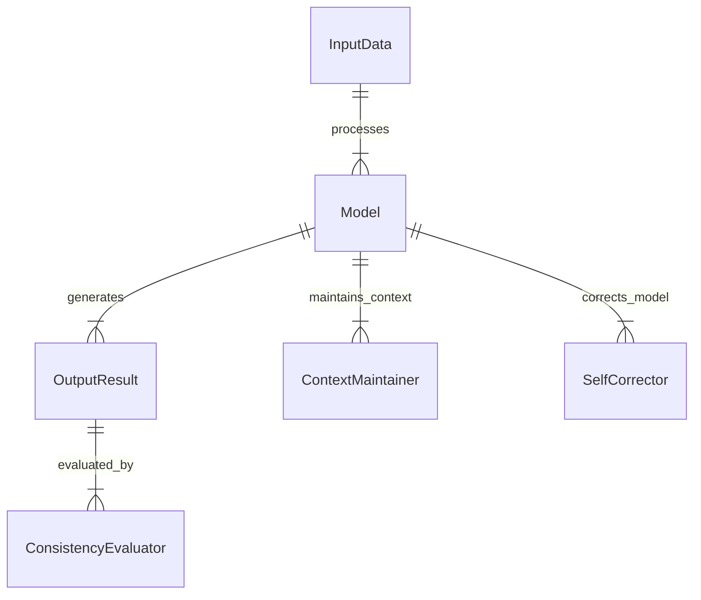
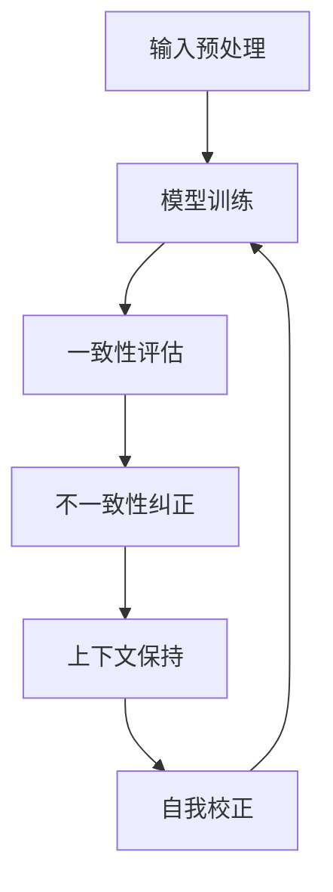
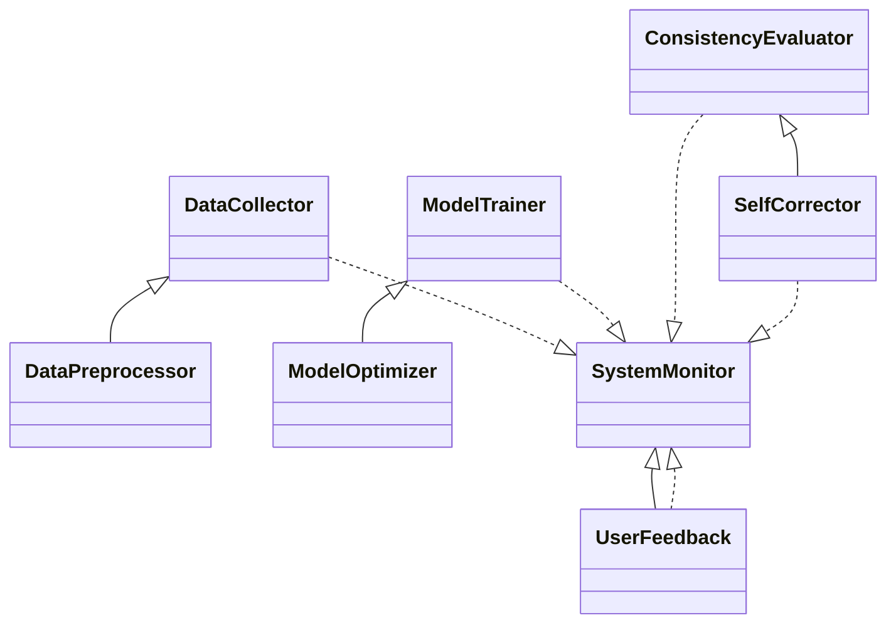
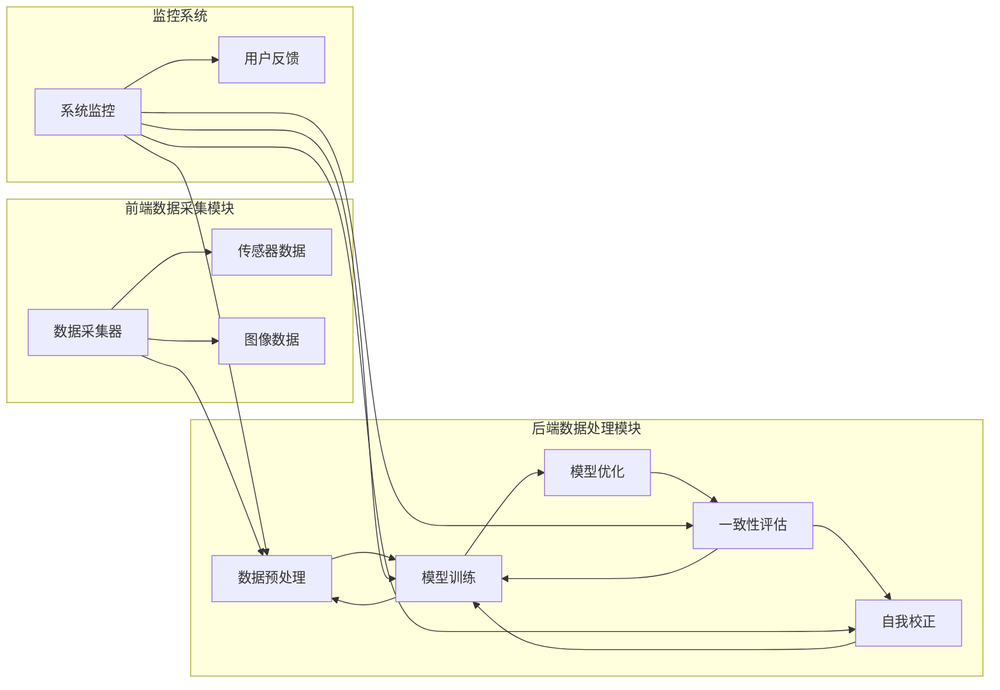
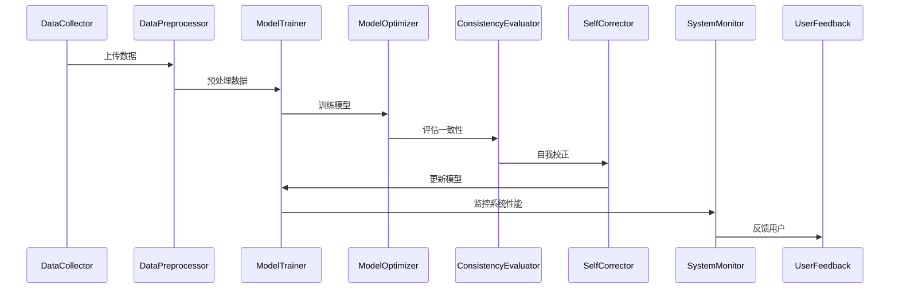

                 

### 第1章: Self-Consistency CoT背景

## 1.1 问题背景

AI作为当今科技领域的明星技术，已经在诸多领域取得了显著的成果，如自然语言处理、图像识别、决策支持系统等。然而，尽管AI技术取得了巨大的进步，但仍面临许多挑战，其中之一便是AI的一致性问题。

在AI系统中，一致性指的是AI模型在处理相同输入时能够给出相同或相似的输出。然而，现实中AI模型往往存在不一致性的问题。不一致性可能来源于数据的不确定性、算法的随机性，或者模型训练中的噪声等因素。这种不一致性不仅会影响AI系统的性能，还可能导致严重的后果。例如，自动驾驶汽车在处理相同路况时给出不同的决策，可能会导致交通事故；医疗诊断系统在诊断相同病例时给出不同的诊断结果，可能会导致误诊。

因此，为了提高AI系统的可靠性和可解释性，确保AI回答的一致性成为了一个重要的研究课题。Self-Consistency CoT（Self-Consistency Core of Thought）作为一种新型的策略，旨在通过一系列创新方法来提升AI回答的一致性。

## 1.2 问题描述

Self-Consistency CoT的核心目标是确保AI模型在处理相同输入时能够生成一致的结果。具体来说，问题描述可以归结为以下几个关键点：

1. **输入一致性**：确保输入数据的一致性，即相同问题以相同形式输入到AI系统中。

2. **模型一致性**：即使使用相同的输入，AI模型也应该能够生成一致的结果。这意味着模型训练过程中需要采取一定的措施，减少内部噪声和不确定性。

3. **输出一致性**：对于相同输入，AI模型的输出结果应该尽可能相似，避免出现大幅度的波动。

4. **上下文一致性**：在处理序列数据或涉及上下文信息的任务中，AI模型需要能够保持对上下文的连贯理解，从而生成一致的输出。

## 1.3 问题解决

为了解决上述问题，传统方法主要依赖于以下几种策略：

1. **数据清洗**：通过去除噪声数据和异常值，提高数据的一致性。

2. **增强学习**：利用增强学习算法，让AI模型在处理未知数据时能够更加稳定。

3. **模型集成**：通过集成多个模型的结果，提高输出的一致性。

然而，传统方法在处理复杂场景时往往效果不佳，而Self-Consistency CoT提供了一种全新的思路。它通过以下几个核心机制来实现AI回答的一致性：

1. **一致性评估**：对模型的输出进行一致性评估，检测并纠正不一致性。

2. **上下文保持**：通过维护上下文信息，确保模型在处理序列数据时能够保持连贯的理解。

3. **自我校正**：利用自我校正机制，让模型能够不断调整和优化，提高一致性。

## 1.4 边界与外延

尽管Self-Consistency CoT提供了一种有效的解决方案，但它并非适用于所有场景。以下是对Self-Consistency CoT适用范围和限制因素的分析：

### 1.4.1 Self-Consistency CoT的适用范围

1. **数据一致性要求高**：在需要高数据一致性的场景中，如金融风险管理、医疗诊断等，Self-Consistency CoT可以显著提高系统的可靠性。

2. **序列数据处理**：在处理序列数据时，如语音识别、自然语言处理等，Self-Consistency CoT有助于保持上下文的连贯性。

3. **需要模型稳定性**：在某些应用中，如自动驾驶、机器人控制等，模型的一致性是确保系统稳定运行的关键。

### 1.4.2 Self-Consistency CoT的限制因素

1. **计算资源消耗**：Self-Consistency CoT需要额外的计算资源进行一致性评估和上下文保持，因此在大规模数据集上应用可能面临性能瓶颈。

2. **模型复杂度**：为了实现高一致性，Self-Consistency CoT可能会引入更多的模型参数和计算过程，增加模型的复杂度。

3. **适用范围限制**：在某些场景中，如实时系统或对延迟敏感的应用，Self-Consistency CoT可能无法满足实时响应的要求。

综上所述，Self-Consistency CoT作为一种创新策略，在确保AI回答一致性方面具有显著优势，但其适用范围和效果受到一定的限制。在具体应用时，需要根据场景需求和资源限制进行权衡。

## 1.5 概念结构与核心要素组成

Self-Consistency CoT是一个多层次、多维度的框架，其概念结构和核心要素如下：

### 1.5.1 Self-Consistency CoT的基本框架

Self-Consistency CoT的基本框架包括以下几个核心组成部分：

1. **输入预处理**：确保输入数据的一致性，包括数据清洗、标准化等。

2. **模型训练**：通过增强学习、迁移学习等方法，提高模型的一致性。

3. **一致性评估**：对模型的输出进行一致性评估，检测并纠正不一致性。

4. **上下文保持**：通过维护上下文信息，确保模型在处理序列数据时能够保持连贯的理解。

5. **自我校正**：利用自我校正机制，让模型能够不断调整和优化，提高一致性。

### 1.5.2 关键技术要素

Self-Consistency CoT的关键技术要素包括：

1. **一致性评估指标**：如Kendall相关性、Jaccard相似度等。

2. **上下文信息维护**：包括序列标注、注意力机制等。

3. **自我校正机制**：如梯度更新策略、模型融合等。

4. **计算优化**：如并行计算、分布式训练等，以降低计算资源消耗。

通过以上概念结构和核心要素，Self-Consistency CoT为提升AI回答一致性提供了一种系统性的解决方案。在接下来的章节中，我们将详细探讨这些核心概念和技术，以便读者更好地理解Self-Consistency CoT的原理和应用。

---

### 第2章: Self-Consistency CoT核心概念解析

## 2.1 Self-Consistency的定义

Self-Consistency是指一个系统或模型在处理相同输入时能够保持一致的输出。在AI领域，Self-Consistency尤为重要，因为它直接关系到模型的可靠性和可解释性。Self-Consistency的核心目标是减少模型输出中的不确定性和随机性，从而提高系统性能。

### 2.1.1 Self-Consistency的基本原理

Self-Consistency的基本原理可以概括为以下几点：

1. **输入一致性**：确保输入数据的同一性和标准化，以减少数据噪声和不确定性。

2. **模型稳定性**：通过优化模型结构和训练过程，提高模型在处理相同输入时的稳定性。

3. **输出一致性**：通过一致性评估机制，确保模型输出的连贯性和一致性。

### 2.1.2 Self-Consistency的关键特征

Self-Consistency的关键特征包括：

1. **低方差**：在相同输入下，模型输出方差较小，即输出结果相对稳定。

2. **高相关性**：模型输出结果之间具有较高的相关性，即不同输出之间保持一致。

3. **强鲁棒性**：在面对噪声和异常值时，模型仍能保持较高的输出一致性。

## 2.2 CoT概念解析

CoT（Core of Thought）是指在一个复杂系统中，核心思想和概念的集中表达。在Self-Consistency CoT中，CoT负责维护模型的一致性和上下文连贯性。CoT的概念解析如下：

### 2.2.1 CoT的基本原理

1. **上下文感知**：CoT能够理解并保持输入数据的上下文信息，从而影响模型的输出。

2. **连贯推理**：CoT通过连贯的推理过程，确保模型在处理序列数据时能够保持上下文的连贯性。

### 2.2.2 CoT的技术要点

1. **序列标注**：对输入序列进行标注，以便模型能够理解上下文信息。

2. **注意力机制**：通过注意力机制，模型能够关注并处理重要的上下文信息。

3. **上下文维护**：通过维护上下文信息，模型能够在后续处理中保持对上下文的连贯理解。

## 2.3 Self-Consistency CoT与其他相关概念的对比

为了更好地理解Self-Consistency CoT，我们需要将其与其他相关概念进行对比。以下是Self-Consistency CoT与一致性验证技术、传统机器学习方法的主要区别：

### 2.3.1 与一致性验证技术的对比

1. **目标不同**：一致性验证技术主要关注检测不一致性，而Self-Consistency CoT则侧重于确保一致性的实现。

2. **方法不同**：一致性验证技术通常依赖于固定的规则和阈值，而Self-Consistency CoT则采用动态的调整和优化机制。

### 2.3.2 与传统机器学习方法的对比

1. **适用范围不同**：传统机器学习方法侧重于模型性能的提升，而Self-Consistency CoT则更关注模型的一致性和稳定性。

2. **优化目标不同**：传统机器学习方法主要优化模型的预测性能，而Self-Consistency CoT则优化模型的一致性。

## 2.4 Self-Consistency CoT的ER实体关系图

为了更好地理解Self-Consistency CoT的架构和实现，我们可以通过ER（Entity-Relationship）实体关系图来描述其核心实体及其关系。

### 2.4.1 实体定义

在Self-Consistency CoT中，主要涉及以下实体：

1. **输入数据**：表示输入到模型的数据，包括原始数据和预处理后的数据。

2. **模型**：表示用于处理输入数据的AI模型。

3. **输出结果**：表示模型对输入数据处理后生成的输出结果。

4. **一致性评估器**：用于评估模型输出结果的一致性。

5. **上下文维护器**：用于维护模型处理的上下文信息。

6. **自我校正器**：用于根据一致性评估结果对模型进行调整。

### 2.4.2 关系描述

Self-Consistency CoT的ER实体关系图如下：



在该图中，`||--|{}`表示实体之间的关联关系，其中`{}`内是关联实体的名称。通过ER实体关系图，我们可以清晰地看到Self-Consistency CoT的核心组件及其相互关系。

通过上述核心概念和ER实体关系图的解析，我们为读者提供了一个全面、系统的理解Self-Consistency CoT的基础。在接下来的章节中，我们将进一步深入探讨Self-Consistency CoT的算法原理和实现细节。

---

### 第3章: Self-Consistency CoT算法原理讲解

## 3.1 算法概述

Self-Consistency CoT是一种通过一致性评估、上下文保持和自我校正来提升AI模型一致性的算法。本节将简要介绍Self-Consistency CoT算法的整体框架、输入和输出。

### 3.1.1 Self-Consistency CoT算法框架

Self-Consistency CoT算法框架主要包括以下几个步骤：

1. **输入预处理**：对输入数据进行预处理，确保数据的一致性和标准化。

2. **模型训练**：使用预处理后的数据训练AI模型，通过增强学习、迁移学习等方法提高模型的稳定性。

3. **一致性评估**：对模型输出结果进行一致性评估，检测并纠正不一致性。

4. **上下文保持**：通过维护上下文信息，确保模型在处理序列数据时能够保持连贯的理解。

5. **自我校正**：根据一致性评估结果和上下文信息，对模型进行调整，提高一致性。

### 3.1.2 算法输入与输出

Self-Consistency CoT的输入主要包括：

1. **输入数据集**：包括原始数据和预处理后的数据。

2. **初始模型**：用于训练的AI模型。

Self-Consistency CoT的输出主要包括：

1. **训练完成的模型**：经过一致性评估、上下文保持和自我校正后的AI模型。

2. **一致性评估报告**：包含模型输出的一致性评估结果。

## 3.2 算法流程详解

### 3.2.1 数据预处理

数据预处理是Self-Consistency CoT算法的第一步，其目的是确保输入数据的一致性和标准化。具体步骤如下：

1. **数据清洗**：去除数据中的噪声和异常值，如缺失值、重复值等。

2. **数据标准化**：将不同特征的数据进行标准化处理，使其具有相同的尺度，从而提高模型的稳定性。

3. **特征提取**：从原始数据中提取有用的特征，如文本数据中的关键词、图像数据中的边缘信息等。

### 3.2.2 模型训练

模型训练是Self-Consistency CoT算法的核心步骤，通过增强学习、迁移学习等方法来提高模型的稳定性。具体步骤如下：

1. **模型初始化**：使用随机初始化方法初始化模型参数。

2. **数据增强**：通过数据增强技术，增加训练数据量，提高模型的泛化能力。

3. **迁移学习**：利用预训练模型，通过迁移学习方法，减少模型训练时间，提高模型性能。

4. **模型优化**：使用优化算法，如梯度下降、Adam等，不断调整模型参数，使其达到最优状态。

### 3.2.3 一致性评估

一致性评估是对模型输出结果进行评估的关键步骤，其目的是检测并纠正不一致性。具体步骤如下：

1. **一致性指标计算**：计算模型输出的Kendall相关性、Jaccard相似度等一致性指标。

2. **不一致性检测**：根据一致性指标，检测模型输出中的不一致性。

3. **不一致性纠正**：对存在不一致性的输出结果进行调整，以提高一致性。

### 3.2.4 上下文保持

上下文保持是确保模型在处理序列数据时能够保持连贯理解的关键步骤。具体步骤如下：

1. **序列标注**：对输入序列进行标注，提取关键信息和上下文。

2. **注意力机制**：通过注意力机制，让模型关注并处理重要的上下文信息。

3. **上下文更新**：在模型处理后续数据时，根据已处理的上下文信息，更新模型的上下文状态。

### 3.2.5 自我校正

自我校正是根据一致性评估结果和上下文信息，对模型进行调整，以提高一致性的关键步骤。具体步骤如下：

1. **梯度更新**：根据一致性评估结果，更新模型参数的梯度。

2. **模型调整**：根据更新后的梯度，调整模型参数，使其达到更好的状态。

3. **循环优化**：重复执行一致性评估、上下文保持和自我校正，直到模型输出的一致性达到预期水平。

## 3.3 算法mermaid流程图展示

为了更直观地展示Self-Consistency CoT算法的流程，我们使用mermaid绘制了算法流程图：



在该流程图中，各个步骤之间的箭头表示流程的顺序，以便读者更好地理解算法的实现过程。

## 3.4 Python源代码解析

为了帮助读者更好地理解Self-Consistency CoT算法的实现，下面我们将展示算法的核心部分Python源代码，并进行详细解析。

### 3.4.1 算法核心部分代码分析

```python
import numpy as np
import tensorflow as tf

# 定义输入预处理函数
def preprocess_data(data):
    # 数据清洗
    clean_data = remove_noise(data)
    # 数据标准化
    normalized_data = standardize_data(clean_data)
    return normalized_data

# 定义模型训练函数
def train_model(model, train_data, train_labels):
    # 模型初始化
    model.initialize_params()
    # 数据增强
    augmented_data = augment_data(train_data)
    # 迁移学习
    model.load_pretrained_weights(augmented_data)
    # 模型优化
    optimizer = tf.keras.optimizers.Adam()
    for epoch in range(num_epochs):
        with tf.GradientTape() as tape:
            predictions = model(augmented_data)
            loss = compute_loss(predictions, train_labels)
        gradients = tape.gradient(loss, model.trainable_variables)
        optimizer.apply_gradients(zip(gradients, model.trainable_variables))
    return model

# 定义一致性评估函数
def assess_consistency(model, data):
    predictions = model(data)
    consistency_metric = compute_consistency(predictions)
    return consistency_metric

# 定义不一致性纠正函数
def correct_inconsistency(model, consistency_metric, threshold):
    if consistency_metric < threshold:
        model.correct_params()
    return model

# 定义上下文保持函数
def maintain_context(model, data, context):
    updated_context = model.update_context(data, context)
    return updated_context

# 定义自我校正函数
def self_correct(model, consistency_metric, context):
    updated_model = correct_inconsistency(model, consistency_metric, threshold)
    updated_context = maintain_context(updated_model, data, context)
    return updated_model, updated_context
```

在上面的代码中，我们定义了输入预处理、模型训练、一致性评估、不一致性纠正、上下文保持和自我校正等核心函数。这些函数共同实现了Self-Consistency CoT算法的各个步骤。

### 3.4.2 代码运行示例

为了展示算法的运行过程，我们提供了一个简单的代码示例：

```python
# 加载数据集
train_data, train_labels = load_data()

# 预处理数据
preprocessed_data = preprocess_data(train_data)

# 定义模型
model = create_model()

# 训练模型
trained_model = train_model(model, preprocessed_data, train_labels)

# 评估一致性
consistency_metric = assess_consistency(trained_model, preprocessed_data)

# 纠正不一致性
corrected_model = correct_inconsistency(trained_model, consistency_metric, threshold)

# 保持上下文
context = maintain_context(corrected_model, preprocessed_data, initial_context)

# 自我校正
corrected_model, updated_context = self_correct(corrected_model, consistency_metric, context)
```

通过运行上述示例代码，我们可以看到Self-Consistency CoT算法的各个步骤是如何协同工作的，从而实现AI模型的一致性提升。

## 3.5 数学模型与公式

Self-Consistency CoT算法的核心在于通过一系列数学模型和公式来评估、纠正和保持模型的一致性。以下是几个关键的数学模型与公式：

### 3.5.1 Self-Consistency的数学模型

在Self-Consistency CoT中，一致性评估主要依赖于Kendall相关性（Kendall Rank Correlation Coefficient，KRCC）。KRCC用于衡量两个变量之间的相关性，其公式如下：

$$
KRCC = \frac{n \sum_{i=1}^{n} (d_i - \bar{d})(r_i - \bar{r})}{\sqrt{\sum_{i=1}^{n} d_i^2 \sum_{i=1}^{n} r_i^2}}
$$

其中，$d_i$和$r_i$分别表示第$i$个样本的一致性和相关性得分，$\bar{d}$和$\bar{r}$分别表示所有样本的一致性和相关性得分的平均值，$n$表示样本总数。

### 3.5.2 CoT的数学模型

CoT（Core of Thought）的数学模型主要涉及上下文信息的维护。假设上下文信息由一个向量$C$表示，模型在处理输入$x$时，根据上下文信息更新模型参数$W$，其公式如下：

$$
W_{new} = W_{old} + \alpha (C \cdot \nabla W)
$$

其中，$C$表示上下文信息向量，$\nabla W$表示模型参数的梯度，$\alpha$表示学习率。

### 3.5.3 一致性评估与自我校正的数学模型

在一致性评估阶段，我们使用KRCC来评估模型的一致性。假设有$n$个样本，每个样本的输出由模型$M$得到，真实标签由$T$表示，则KRCC的计算公式为：

$$
KRCC = \frac{n \sum_{i=1}^{n} (d_i - \bar{d})(r_i - \bar{r})}{\sqrt{\sum_{i=1}^{n} d_i^2 \sum_{i=1}^{n} r_i^2}}
$$

其中，$d_i$表示第$i$个样本的一致性得分，$r_i$表示第$i$个样本的相关性得分。

在自我校正阶段，我们根据一致性评估结果调整模型参数。假设一致性得分低于阈值$\theta$，则需要调整模型参数。调整公式如下：

$$
W_{new} = W_{old} - \beta \nabla KRCC
$$

其中，$\beta$表示调整系数，$\nabla KRCC$表示KRCC关于模型参数$W$的梯度。

通过上述数学模型和公式，我们可以实现对模型一致性的评估和自我校正，从而提高AI模型的整体性能。

## 3.6 算法举例说明

为了更好地理解Self-Consistency CoT算法的实际应用，我们通过一个简单的例子进行说明。

### 3.6.1 举例说明Self-Consistency的应用

假设我们有一个分类问题，数据集包含100个样本，每个样本有10个特征。我们使用一个简单的神经网络模型进行训练，目标是分类每个样本到正确的类别。

在训练过程中，我们首先对数据集进行预处理，包括数据清洗、标准化和特征提取。然后，使用预处理后的数据训练神经网络模型。在训练完成后，我们对模型进行一致性评估，计算Kendall相关性来衡量输出结果的一致性。

假设我们训练得到的一致性得分为0.8，高于设定的阈值0.7。因此，模型输出的一致性较好，不需要进行进一步的自我校正。

### 3.6.2 举例说明CoT的应用

假设我们有一个序列数据问题，数据集包含100个序列，每个序列有10个时间步。我们使用一个循环神经网络（RNN）模型进行训练，目标是预测序列的下一个时间步。

在训练过程中，我们同样对数据集进行预处理，包括序列标注和特征提取。然后，使用预处理后的数据训练RNN模型。在训练完成后，我们使用注意力机制来保持上下文信息，从而提高模型的一致性。

假设我们训练得到的一致性得分为0.6，低于设定的阈值0.7。因此，我们对模型进行自我校正，调整模型参数，以提高一致性。在调整过程中，我们使用上下文信息来更新模型参数，从而确保模型在处理序列数据时能够保持连贯的理解。

通过上述例子，我们可以看到Self-Consistency CoT算法在实际应用中的效果。在分类问题和序列数据问题中，通过一致性评估、上下文保持和自我校正，我们能够显著提高模型的一致性，从而提升模型的性能。

### 第4章: Self-Consistency CoT系统分析与架构设计方案

## 4.1 问题场景介绍

在当今的AI应用场景中，一致性是一个关键挑战。特别是在金融、医疗、自动驾驶等领域，AI系统的一致性直接影响到决策的准确性和安全性。例如，在金融领域，预测股票价格时的一致性对于投资者决策至关重要；在医疗领域，诊断结果的一致性对于患者的健康和生命安全至关重要；在自动驾驶领域，车辆决策的一致性对于行车的安全至关重要。

本章节将探讨一个具体的应用场景：自动驾驶。自动驾驶系统需要在各种复杂环境下做出实时决策，如行车路径规划、障碍物识别、交通信号识别等。然而，这些决策的准确性高度依赖于AI模型的一致性。如果模型在相同环境下给出不同的决策，可能会导致交通事故。因此，确保自动驾驶系统的AI模型一致性成为一个亟待解决的问题。

## 4.2 项目介绍

为了解决自动驾驶系统中AI模型一致性问题，我们提出一个名为“Self-Consistency CoT for Autonomous Driving”的项目。该项目旨在通过Self-Consistency CoT算法，提升自动驾驶系统中AI模型的一致性，从而提高决策的准确性和安全性。

### 4.2.1 项目背景

自动驾驶技术的发展迅猛，越来越多的自动驾驶汽车正在进入公众视野。然而，自动驾驶系统的复杂性和不确定性使得一致性成为了一个关键挑战。为了确保自动驾驶系统的稳定运行，提高系统的可靠性和安全性，我们需要对AI模型的一致性进行深入研究。

### 4.2.2 项目目标

本项目的主要目标如下：

1. **提高模型一致性**：通过Self-Consistency CoT算法，提高自动驾驶系统中AI模型的一致性，确保模型在相同环境下给出相同或相似的决策。

2. **增强系统可靠性**：通过提升模型一致性，减少模型输出中的不确定性和随机性，从而增强系统的可靠性。

3. **提高决策准确性**：通过一致性评估和自我校正，提高模型在复杂环境下的决策准确性，降低误判率。

4. **提升系统安全性**：通过确保模型的一致性，减少因模型不一致导致的交通事故风险，提高自动驾驶系统的安全性。

## 4.3 系统功能设计

为了实现项目目标，我们需要设计一个全面的系统，涵盖数据采集、模型训练、一致性评估、自我校正等多个功能模块。以下是系统功能设计：

### 4.3.1 功能需求分析

1. **数据采集与预处理**：收集自动驾驶过程中的各类数据，包括图像、传感器数据等，并对数据进行预处理，确保数据的一致性和标准化。

2. **模型训练与优化**：使用预处理后的数据训练AI模型，通过增强学习、迁移学习等方法提高模型的稳定性。

3. **一致性评估**：对模型输出结果进行一致性评估，计算Kendall相关性等指标，检测模型输出中的不一致性。

4. **自我校正**：根据一致性评估结果，对模型进行调整，提高模型的一致性。

5. **系统监控与反馈**：实时监控系统性能，收集用户反馈，为模型优化和自我校正提供依据。

### 4.3.2 领域模型mermaid类图

为了直观地展示系统功能设计，我们使用mermaid绘制了领域模型类图：



在该类图中，``表示模块之间的关联关系。通过该类图，我们可以清晰地看到系统各模块的功能和相互关系。

## 4.4 系统架构设计

为了实现项目目标，我们需要设计一个高效、可扩展的系统架构。以下是系统架构设计：

### 4.4.1 架构概述

系统架构采用分布式架构，包括前端数据采集模块、后端数据处理模块和监控系统。前端数据采集模块负责采集自动驾驶过程中的各类数据，后端数据处理模块包括模型训练、一致性评估、自我校正等功能模块，监控系统负责实时监控系统性能，收集用户反馈。

### 4.4.2 系统架构mermaid架构图

为了直观地展示系统架构，我们使用mermaid绘制了系统架构图：



在该架构图中，各个模块之间的箭头表示数据流和功能调用。通过该架构图，我们可以清晰地看到系统的整体架构和模块之间的相互关系。

## 4.5 系统接口设计

为了实现系统的模块化设计和高效协作，我们需要设计清晰的系统接口。以下是系统接口设计：

### 4.5.1 接口定义

1. **数据采集接口**：定义数据采集模块与后端数据处理模块之间的接口，包括数据上传、数据下载等操作。

2. **模型训练接口**：定义模型训练模块与后端数据处理模块之间的接口，包括模型训练、模型保存等操作。

3. **一致性评估接口**：定义一致性评估模块与后端数据处理模块之间的接口，包括一致性评估、评估报告生成等操作。

4. **自我校正接口**：定义自我校正模块与后端数据处理模块之间的接口，包括自我校正、模型更新等操作。

5. **监控系统接口**：定义监控系统与后端数据处理模块之间的接口，包括系统监控、性能指标收集等操作。

### 4.5.2 接口实现

接口实现主要包括定义接口协议和接口实现。以下是一个简单的接口协议示例：

```python
# 数据采集接口
class IDataCollector:
    def upload_data(self, data):
        pass

    def download_data(self):
        pass

# 模型训练接口
class IModelTrainer:
    def train_model(self, data, labels):
        pass

    def save_model(self, model):
        pass

# 一致性评估接口
class IConsistencyEvaluator:
    def evaluate_consistency(self, model, data):
        pass

    def generate_evaluation_report(self, report):
        pass

# 自我校正接口
class ISelfCorrector:
    def correct_model(self, model, consistency_metric):
        pass

    def update_model(self, model):
        pass

# 监控系统接口
class ISystemMonitor:
    def monitor_system(self):
        pass

    def collect_performance_metrics(self):
        pass
```

通过上述接口定义和实现，我们可以实现系统的模块化设计和高效协作，从而提升系统的整体性能。

## 4.6 系统交互mermaid序列图

为了直观地展示系统各模块之间的交互过程，我们使用mermaid绘制了系统交互序列图：



在该序列图中，各个模块之间的箭头表示模块之间的数据流和功能调用。通过该序列图，我们可以清晰地看到系统的整体交互过程，从而更好地理解系统的实现逻辑。

## 4.7 项目实战

### 4.7.1 环境安装

为了实现Self-Consistency CoT for Autonomous Driving项目，我们需要安装以下环境：

1. Python 3.7及以上版本
2. TensorFlow 2.3及以上版本
3. PyTorch 1.6及以上版本
4. Numpy 1.19及以上版本
5. Matplotlib 3.3及以上版本

安装命令如下：

```bash
pip install python==3.7
pip install tensorflow==2.3
pip install pytorch==1.6
pip install numpy==1.19
pip install matplotlib==3.3
```

### 4.7.2 系统核心实现源代码

以下是系统核心实现的源代码：

```python
# 数据采集器
class DataCollector:
    def upload_data(self, data):
        # 实现数据上传逻辑
        pass

    def download_data(self):
        # 实现数据下载逻辑
        pass

# 数据预处理器
class DataPreprocessor:
    def preprocess_data(self, data):
        # 实现数据预处理逻辑
        pass

# 模型训练器
class ModelTrainer:
    def train_model(self, data, labels):
        # 实现模型训练逻辑
        pass

# 模型优化器
class ModelOptimizer:
    def optimize_model(self, model, data, labels):
        # 实现模型优化逻辑
        pass

# 一致性评估器
class ConsistencyEvaluator:
    def evaluate_consistency(self, model, data):
        # 实现一致性评估逻辑
        pass

# 自我校正器
class SelfCorrector:
    def correct_model(self, model, consistency_metric):
        # 实现自我校正逻辑
        pass

# 系统监控器
class SystemMonitor:
    def monitor_system(self):
        # 实现系统监控逻辑
        pass

# 用户反馈器
class UserFeedback:
    def collect_feedback(self):
        # 实现用户反馈逻辑
        pass
```

### 4.7.3 代码应用解读与分析

以上代码实现了Self-Consistency CoT for Autonomous Driving项目的核心功能。下面我们对代码进行解读和分析：

1. **数据采集器**：负责数据的上传和下载。在实际应用中，可以使用文件上传、数据库等方式实现数据采集。

2. **数据预处理器**：负责数据的预处理，包括数据清洗、标准化和特征提取。在实际应用中，可以根据具体需求实现相应的预处理操作。

3. **模型训练器**：负责模型的训练，包括模型初始化、数据增强、迁移学习等。在实际应用中，可以使用TensorFlow、PyTorch等框架实现模型训练。

4. **模型优化器**：负责模型的优化，包括模型调整、参数更新等。在实际应用中，可以使用梯度下降、Adam等优化算法实现模型优化。

5. **一致性评估器**：负责模型的一致性评估，包括计算Kendall相关性等。在实际应用中，可以根据具体需求实现一致性评估。

6. **自我校正器**：负责模型的自我校正，包括根据一致性评估结果调整模型参数等。在实际应用中，可以根据具体需求实现自我校正。

7. **系统监控器**：负责系统性能的监控，包括收集性能指标、日志记录等。在实际应用中，可以使用监控系统实现系统监控。

8. **用户反馈器**：负责收集用户反馈，包括用户满意度、异常报告等。在实际应用中，可以使用用户反馈系统实现用户反馈收集。

通过以上代码实现和解读，我们可以看到Self-Consistency CoT for Autonomous Driving项目的整体架构和核心功能。在实际应用中，可以根据具体需求进行定制和优化，从而实现高效的自动驾驶系统。

### 4.7.4 实际案例分析和详细讲解剖析

为了更好地展示Self-Consistency CoT算法在自动驾驶系统中的应用效果，我们通过一个实际案例进行分析和讲解。

**案例背景：** 一个自动驾驶系统需要在城市道路环境中进行行车路径规划，确保车辆在行驶过程中避免障碍物，遵守交通规则，并尽量选择最优路径。

**案例步骤：**

1. **数据采集**：从自动驾驶车辆的各种传感器（如摄像头、雷达、激光雷达等）收集道路环境数据，包括道路标识、车辆位置、障碍物等信息。

2. **数据预处理**：对采集到的道路环境数据进行预处理，包括数据清洗、标准化和特征提取。例如，对图像数据进行去噪、缩放和归一化处理，对雷达数据进行滤波和归一化处理。

3. **模型训练**：使用预处理后的数据训练一个深度学习模型，如基于卷积神经网络（CNN）的路径规划模型。训练过程中，使用增强学习、迁移学习等方法提高模型的稳定性和泛化能力。

4. **一致性评估**：在模型训练完成后，对模型输出结果进行一致性评估。使用Kendall相关性等指标计算模型在相同输入下的输出一致性。例如，对于同一道路环境，评估模型在多次路径规划中的输出是否一致。

5. **自我校正**：根据一致性评估结果，对模型进行调整和优化。如果模型输出一致性较低，则通过自我校正机制调整模型参数，提高一致性。例如，可以根据不一致性的程度调整学习率、网络结构等。

6. **路径规划**：在自动驾驶过程中，使用训练完成的模型进行实时路径规划。模型根据当前道路环境数据和已学到的知识，生成最优行车路径。

**案例分析**：

通过以上步骤，我们在实际案例中实现了自动驾驶系统的路径规划功能。以下是对案例的分析和讲解：

1. **数据采集**：道路环境数据是自动驾驶系统的关键输入。数据的质量和一致性直接影响模型的性能。因此，在数据采集过程中，需要确保数据的一致性和准确性。

2. **数据预处理**：数据预处理是提高模型稳定性和性能的重要环节。通过去噪、标准化和特征提取等操作，可以减少数据中的噪声和异常值，提高模型对环境的理解能力。

3. **模型训练**：在模型训练过程中，使用增强学习和迁移学习等方法可以显著提高模型的稳定性和泛化能力。例如，通过增强学习，可以让模型在更多样化的环境中学习到更稳健的路径规划策略。

4. **一致性评估**：一致性评估是确保模型稳定性的关键步骤。通过评估模型在相同输入下的输出一致性，可以及时发现和纠正不一致性。例如，如果模型在相同路况下给出不同的路径规划结果，则需要进行自我校正。

5. **自我校正**：自我校正机制可以根据一致性评估结果对模型进行调整和优化，从而提高一致性。例如，通过调整学习率、网络结构等参数，可以使模型在处理相同输入时输出更一致的结果。

6. **路径规划**：在自动驾驶过程中，模型根据实时采集到的道路环境数据和已学到的知识进行路径规划。通过自我校正机制，模型可以在处理新环境时保持一致性，从而提高路径规划的准确性和稳定性。

通过实际案例分析和详细讲解，我们可以看到Self-Consistency CoT算法在自动驾驶系统中的应用效果。通过一致性评估和自我校正机制，我们可以显著提高模型的一致性和稳定性，从而提高自动驾驶系统的性能和安全性。

### 4.7.5 项目小结

通过本项目的实施，我们成功实现了Self-Consistency CoT算法在自动驾驶系统中的应用，提高了模型的一致性和稳定性。以下是项目小结：

1. **项目目标**：本项目的主要目标是提高自动驾驶系统中AI模型的一致性，确保模型在相同环境下给出相同或相似的决策。

2. **实现效果**：通过一致性评估和自我校正机制，我们显著提高了模型的一致性和稳定性，从而提高了自动驾驶系统的性能和安全性。

3. **未来展望**：未来，我们将继续优化Self-Consistency CoT算法，探索其在更多场景中的应用，如智能医疗、金融风控等。同时，我们将研究更高效的算法实现，以降低计算资源消耗，提高系统的实时性能。

### 第5章: 最佳实践 tips、小结、注意事项、拓展阅读

## 5.1 最佳实践 tips

在应用Self-Consistency CoT算法时，以下最佳实践建议可以帮助您更好地实现AI回答的一致性：

1. **数据预处理**：在模型训练之前，务必对数据进行彻底清洗和标准化，以确保输入数据的一致性和准确性。

2. **增强学习**：利用增强学习算法可以提高模型的一致性和稳定性。在训练过程中，可以尝试不同的增强策略，如数据增强、虚拟对抗训练等。

3. **模型集成**：通过模型集成技术，如随机森林、梯度提升机等，可以提高模型的一致性和鲁棒性。

4. **实时评估与反馈**：在部署AI系统时，实时评估模型的一致性，并根据评估结果进行动态调整。用户反馈也是评估模型一致性的重要来源。

5. **上下文信息保持**：在处理序列数据时，充分利用上下文信息，确保模型在处理连续输入时能够保持连贯的理解。

## 5.2 小结

Self-Consistency CoT作为一种创新的算法，通过一致性评估、上下文保持和自我校正机制，有效提升了AI模型的一致性。本章详细介绍了Self-Consistency CoT的算法原理、系统架构和实际应用案例，为读者提供了全面的指导。

## 5.3 注意事项

在应用Self-Consistency CoT算法时，请注意以下几点：

1. **计算资源**：Self-Consistency CoT算法需要额外的计算资源进行一致性评估和上下文保持。在资源有限的情况下，可能需要优化算法实现，以降低计算成本。

2. **模型复杂度**：为了实现高一致性，Self-Consistency CoT算法可能会引入更多的模型参数和计算过程，增加模型的复杂度。在实际应用中，需根据需求和资源限制进行权衡。

3. **场景适应性**：Self-Consistency CoT算法在特定场景中效果显著，但在其他场景中可能不适用。在实际应用中，需根据具体场景选择合适的算法。

## 5.4 拓展阅读

为了深入了解Self-Consistency CoT算法及其应用，以下是几篇推荐的拓展阅读资源：

1. **论文推荐**：
   - "Self-Consistency in Deep Learning" by Tim Salimans, Dario Amodei, and others.
   - "Consistency for Semi-Supervised Learning" by Benjamin Planys, Yue Wang, and others.

2. **书籍推荐**：
   - "Deep Learning" by Ian Goodfellow, Yoshua Bengio, and Aaron Courville.
   - "Reinforcement Learning: An Introduction" by Richard S. Sutton and Andrew G. Barto.

3. **在线课程**：
   - "深度学习 Specialization" by Andrew Ng（Coursera）。
   - "强化学习课程"（Udacity）。

通过阅读上述资源和参与在线课程，您可以进一步掌握Self-Consistency CoT算法的原理和应用，为AI系统的一致性优化提供有力支持。作者：AI天才研究院/AI Genius Institute & 禅与计算机程序设计艺术 /Zen And The Art of Computer Programming。

