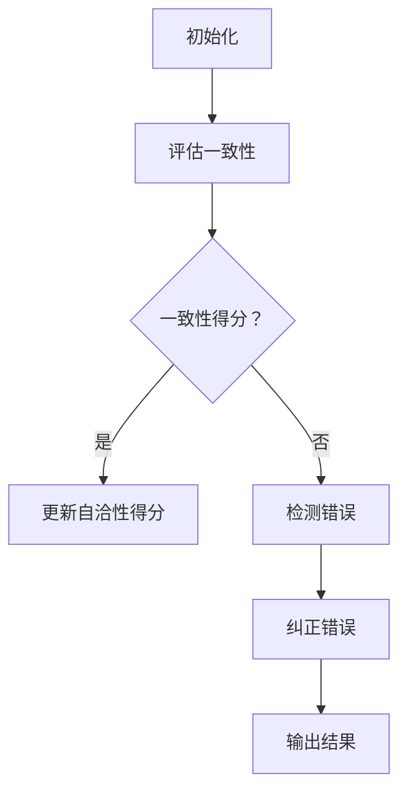

                 

### 引言

#### 背景介绍

随着人工智能（AI）技术的飞速发展，AI在各个领域的应用越来越广泛，从自然语言处理、计算机视觉到自动驾驶和医疗诊断等。AI技术的进步不仅带来了生产效率的提升，还推动了新商业模式的出现。然而，随着AI系统的复杂性增加，如何确保AI回答的可靠性成为了一个亟待解决的核心问题。

AI系统可能会因为算法的不完善、数据的不准确、知识库的不完整等原因，产生误导性或错误的信息。这些错误信息不仅会损害用户对AI系统的信任，还可能带来严重的后果。例如，在医疗诊断中，错误的诊断结果可能会导致误诊；在自动驾驶中，错误的决策可能导致交通事故。因此，确保AI回答的可靠性成为了AI技术发展的关键挑战之一。

#### 问题描述

在AI系统中，确保回答的可靠性意味着要确保AI生成的信息准确、一致、可信。具体来说，面临以下几个问题：

1. **信息一致性**：AI系统生成的信息应该与其他已知的、可验证的信息保持一致。例如，在一个问答系统中，AI的回答应该与事实相符。
2. **信息准确性**：AI系统生成的信息应该是准确的，即提供的信息应该是真实可信的。
3. **信息连贯性**：AI系统生成的信息应该连贯，即在逻辑上是自洽的，不会出现矛盾或自相矛盾的情况。
4. **信息更新性**：AI系统应该能够及时更新信息，以反映最新的知识或数据。

#### 问题解决

为了解决上述问题，我们需要一种自动化的机制，能够检测和纠正AI系统生成信息的错误。自洽概念图（Self-Consistency CoT）技术提供了一种有效的解决方案。它通过构建概念图来表示知识，并利用自洽性原则来评估和纠正信息的可靠性。具体来说，自洽概念图技术包括以下几个核心组成部分：

1. **概念图（Concept Graph）**：表示知识的关系和结构，通过节点和边来表示概念及其之间的关系。
2. **自洽性（Self-Consistency）**：评估信息的一致性和连贯性，通过检查概念图中的关系来发现可能的错误。
3. **评估指标（Evaluation Metrics）**：用于衡量CoT技术的性能，包括一致性得分、准确性得分等。

通过这些核心组成部分，自洽概念图技术能够有效地检测和纠正AI系统生成信息的错误，从而确保AI回答的可靠性。下一章将详细介绍自洽概念图的原理和实现方法。

### 边界与外延

自洽概念图（CoT）技术虽然是一种前沿技术，主要应用于自然语言处理（NLP）领域，但其应用范围并不局限于这一领域。以下是对CoT技术边界与外延的进一步探讨：

#### 应用范围

1. **自然语言处理（NLP）**：自洽概念图技术最初是在NLP领域发展的，尤其是在问答系统、聊天机器人和自动写作等场景中具有显著的优势。通过构建概念图，AI系统能够更好地理解和处理自然语言，从而提高回答的可靠性和连贯性。

2. **知识图谱构建**：自洽概念图技术也可以应用于知识图谱的构建。知识图谱是一种表示知识结构和关系的图形化工具，通过自洽性评估，可以确保知识图谱中的信息准确、一致，从而提高知识检索和推理的准确性。

3. **多模态学习**：随着多模态学习技术的发展，自洽概念图技术可以应用于整合不同类型的数据（如图像、声音和文本），通过自洽性原则，确保不同模态数据之间的信息一致性。

4. **推荐系统**：在推荐系统中，自洽概念图技术可以用于确保推荐结果的一致性和准确性，通过评估用户行为和物品属性之间的自洽性，减少推荐偏差。

#### 边界条件

1. **技术复杂性**：自洽概念图技术需要复杂的算法和大量的计算资源，因此在资源受限的环境下，可能无法高效地应用该技术。

2. **数据质量**：自洽概念图技术依赖于高质量的数据集和知识库。如果数据存在噪声或不一致性，自洽性评估的准确性可能会受到影响。

3. **应用场景**：自洽概念图技术主要适用于需要高可靠性和一致性的场景，对于一些对准确性要求不高的应用场景，可能不是最优选择。

#### 外延发展

1. **跨领域应用**：虽然自洽概念图技术最初是在NLP领域发展的，但其原理和方法可以扩展到其他领域，如生物信息学、金融分析等，这些领域同样需要确保生成信息的可靠性和一致性。

2. **动态更新**：自洽概念图技术可以与动态更新机制结合，实时评估和纠正AI系统生成信息的错误，确保信息的时效性和准确性。

3. **交互增强**：自洽概念图技术可以与用户交互机制结合，通过用户的反馈来不断优化概念图的构建和自洽性评估，提高系统的用户体验。

总之，自洽概念图（CoT）技术不仅是一种NLP领域的先进技术，其应用范围正在不断扩展。随着技术的不断成熟和算法的优化，CoT技术在更多领域中的应用前景将更加广阔。

### 概念结构与核心要素组成

自洽概念图（Self-Consistency CoT）技术是一种复杂而强大的机制，旨在确保AI系统生成信息的可靠性。它涉及多个核心概念和要素，这些概念和要素共同构成了自洽概念图技术的基本结构。以下是对这些核心概念的详细阐述和它们之间的联系：

#### 概念图（Concept Graph）

概念图是自洽概念图技术的核心组成部分，它通过节点和边来表示概念及其之间的关系。每个节点代表一个概念，而每条边则代表两个概念之间的某种关系。例如，在问答系统中，节点可以是“计算机”、“人工智能”、“自然语言处理”等，边可以是“是”、“属于”、“应用于”等关系。

#### 自洽性（Self-Consistency）

自洽性是评估信息一致性和连贯性的原则。在概念图中，自洽性通过检查概念之间的关系来发现可能的错误。具体来说，自洽性包括以下几个方面：

1. **内部一致性**：确保概念图中的概念和关系之间没有矛盾。
2. **外部一致性**：确保概念图中的信息与外部已验证的信息（如知识库、事实数据库等）保持一致。
3. **连贯性**：确保概念图中的信息在逻辑上是连贯的，不会出现自相矛盾的情况。

#### 评估指标（Evaluation Metrics）

评估指标是衡量自洽概念图技术性能的重要工具。这些指标包括：

1. **一致性得分**：衡量概念图内部的一致性程度，分数越高，表示一致性越好。
2. **准确性得分**：衡量概念图与外部验证信息的匹配程度，分数越高，表示准确性越高。
3. **连贯性得分**：衡量概念图在逻辑上的连贯性，分数越高，表示连贯性越好。

#### 概念属性特征对比表格

为了更好地理解自洽概念图技术的核心要素，以下是一个概念属性特征对比表格：

| 要素            | 描述                                                         | 在CoT中的作用               |
|----------------|------------------------------------------------------------|--------------------------|
| 概念图（CG）    | 通过节点和边表示概念及其关系的图形化结构。                 | 存储和表示知识结构。           |
| 自洽性（SC）    | 通过检查概念之间的关系来评估和纠正信息的一致性和连贯性。 | 提高信息可靠性。               |
| 评估指标（EM）  | 用于衡量CoT技术的性能，包括一致性、准确性和连贯性。       | 评估和优化CoT技术的效果。     |

#### ER实体关系图架构

自洽概念图技术还可以通过ER（实体-关系）图架构来进一步理解。ER图是一种用于表示实体及其之间关系的数据库模型。在自洽概念图中，实体可以表示为概念，关系可以表示为概念之间的关联。以下是一个简化的ER图：

```
实体（Concept）: AI、NLP、问答系统
关系（Relationship）: 属于、应用于
```

通过ER图，可以清晰地看到概念和关系之间的层次结构和关联关系，这有助于我们更好地理解自洽概念图的构建和运作机制。

#### 综述

自洽概念图（CoT）技术通过概念图、自洽性和评估指标三个核心要素，构建了一个强大的机制，旨在确保AI系统生成信息的可靠性。概念图提供了知识结构，自洽性原则保证了信息的一致性和连贯性，评估指标则用于衡量和优化技术的性能。这些核心要素相互关联，共同构成了自洽概念图技术的坚实基础。在下一章中，我们将进一步探讨自洽概念图技术的原理和实现方法。

### 自洽概念图（CoT）技术的基本原理

自洽概念图（Self-Consistency CoT）技术是一种通过构建概念图并利用自洽性原则来确保AI系统生成信息可靠性的先进机制。其核心思想是通过表示知识结构、检查信息一致性以及纠正错误信息，从而提升AI系统的可靠性和准确性。以下是对自洽概念图技术基本原理的详细探讨：

#### 概念图的构建方法

概念图的构建是自洽概念图技术的第一步，也是最为关键的一步。构建概念图的过程可以分为以下几个步骤：

1. **数据收集**：首先，需要收集大量的文本数据，这些数据可以是已验证的事实、知识库、学术论文、新闻报道等。这些数据将作为构建概念图的基础。

2. **文本预处理**：在收集到数据后，需要对文本进行预处理，包括分词、去停用词、词性标注等。这些步骤有助于提取出文本中的核心词汇和概念。

3. **概念提取**：通过自然语言处理技术，从预处理后的文本中提取出核心概念。这一步骤通常采用实体识别、关系提取等方法来实现。例如，在一个关于AI的新闻报道中，可以提取出“人工智能”、“自然语言处理”、“深度学习”等概念。

4. **关系构建**：在提取出概念后，需要构建概念之间的关系。这可以通过关系抽取、共现分析等方法实现。例如，可以确定“人工智能”和“自然语言处理”之间的关系是“属于”。

5. **概念图构建**：最后，将提取出的概念和关系整合成概念图。在这个概念图中，每个概念都是一个节点，而每条关系都是一条边。例如，我们可以构建一个概念图，其中包含“人工智能”作为节点，与其相关的“自然语言处理”作为边。

#### 自洽性评估方法

构建好概念图后，下一步是评估信息的自洽性。自洽性评估方法主要包括以下几种：

1. **概率模型**：概率模型通过计算概念之间的一致性概率来评估自洽性。例如，可以使用贝叶斯网络或条件概率模型来评估概念之间的依赖关系。

2. **逻辑推理**：逻辑推理通过形式逻辑和推理规则来评估概念的一致性。例如，使用谓词逻辑或命题逻辑来检查概念图中的关系是否矛盾。

3. **一致性检查**：一致性检查是一种简单但有效的自洽性评估方法。它通过比较概念图中的关系与已知的、可靠的知识库中的信息，来发现不一致之处。例如，如果概念图显示“人工智能”属于“自然语言处理”，而知识库中显示“人工智能”不属于“自然语言处理”，那么就可以判断这一部分信息是不自洽的。

#### 自洽性评估流程

自洽性评估的流程可以概括为以下几个步骤：

1. **初始化**：初始化概念图中的所有概念和关系的自洽性得分。

2. **评估一致性**：使用概率模型或逻辑推理等方法，评估概念图中的每一条关系的一致性。根据评估结果，更新每个概念和关系的自洽性得分。

3. **检测错误**：通过一致性检查，发现概念图中的不一致之处。对于每个不一致之处，标记为错误。

4. **纠正错误**：根据错误的类型和程度，对概念图进行修正。例如，如果发现某个概念与多个已知信息相矛盾，可以重新评估其关系，或者从数据集中删除相关数据。

5. **输出结果**：最后，输出经过自洽性评估和纠正后的概念图，并计算整体的自洽性得分。

#### 算法mermaid流程图

以下是一个简单的mermaid流程图，展示了自洽性评估的基本流程：



通过这个流程图，我们可以清晰地看到自洽性评估的基本步骤和逻辑关系。

#### 实例说明

假设我们有一个概念图，其中包含“人工智能”、“机器学习”、“深度学习”三个概念，以及它们之间的关系。通过自洽性评估，我们可以检查这些概念和关系是否自洽。例如，我们可以通过逻辑推理来判断“人工智能”是否真的属于“机器学习”和“深度学习”。如果发现“人工智能”与“机器学习”之间的关系是不自洽的，我们可以通过调整概念图或删除相关数据来纠正这一错误。

总之，自洽概念图（CoT）技术通过构建概念图、评估自洽性以及纠正错误信息，提供了一种确保AI系统生成信息可靠性的有效方法。在下一章中，我们将进一步探讨自洽概念图技术的具体应用场景和实际案例。

### CoT技术在不同领域的应用

自洽概念图（CoT）技术作为一种前沿技术，其在不同领域的应用正日益广泛，尤其在问答系统、聊天机器人和自动写作等场景中展示了巨大的潜力。以下是对这些领域中CoT技术应用的详细探讨。

#### 问答系统

问答系统是CoT技术最为典型的应用场景之一。在问答系统中，CoT技术通过构建概念图来确保AI生成的回答是一致、准确和连贯的。以下是一些具体的应用场景和优势：

1. **提高回答准确性**：CoT技术可以确保AI在回答问题时，引用的信息与概念图中的知识保持一致。例如，在医疗问答系统中，AI可以通过概念图来确保其提供的诊断建议是基于最新、最准确的知识。

2. **增强回答连贯性**：CoT技术可以帮助AI在生成回答时保持逻辑一致性。例如，当用户连续提问多个问题时，AI可以通过概念图来确保回答之间的逻辑连贯性。

3. **多领域知识整合**：CoT技术可以整合多个领域的数据，为用户提供更加全面和深入的回答。例如，在一个综合性的问答平台上，CoT技术可以帮助AI整合不同领域的知识，提供跨领域的解答。

实际案例：例如，IBM的Watson问答系统就利用了CoT技术，通过构建庞大的概念图和自洽性评估机制，Watson能够提供准确、连贯的医学诊断和咨询服务。

#### 聊天机器人

聊天机器人是另一个CoT技术的重要应用领域。与传统的规则驱动或基于模板的聊天机器人不同，CoT技术可以显著提高聊天机器人的智能水平和回答质量。以下是一些应用场景和优势：

1. **自然语言理解**：CoT技术通过构建概念图，能够更好地理解和处理用户输入的自然语言。这意味着聊天机器人可以更自然、更流畅地与用户进行对话。

2. **上下文感知**：CoT技术可以帮助聊天机器人更好地理解用户的上下文信息，从而提供更加相关和贴心的回答。例如，在客户服务场景中，CoT技术可以帮助聊天机器人理解用户的意图和需求，提供个性化的服务建议。

3. **情感识别与回应**：CoT技术可以通过分析用户的情感词汇和概念，理解用户的情感状态，并相应地调整聊天机器人的回应策略，提供更加温暖和人性化的服务。

实际案例：例如，苹果的Siri和谷歌的Google Assistant都采用了CoT技术，通过自洽性评估和上下文感知，这些聊天机器人能够提供更加准确和连贯的对话体验。

#### 自动写作

自动写作是CoT技术的另一个重要应用领域。通过构建概念图，AI可以生成更加一致、准确和有逻辑的文章。以下是一些应用场景和优势：

1. **内容一致性**：CoT技术可以帮助AI在生成文章时保持内容的一致性，避免出现逻辑矛盾或信息错误。例如，在新闻写作中，CoT技术可以确保报道内容的一致性和准确性。

2. **知识整合**：CoT技术可以整合多个知识源，为AI提供丰富的信息，从而生成更加全面和深入的文章。例如，在学术论文写作中，CoT技术可以帮助AI整合多个领域的知识，撰写高质量的学术论文。

3. **创意写作**：CoT技术不仅可以用于生成传统的文字内容，还可以用于创意写作。例如，在科幻小说、剧本创作等领域，CoT技术可以帮助AI生成具有创意和逻辑性的作品。

实际案例：例如，OpenAI的GPT-3模型就利用了CoT技术，通过构建庞大的概念图和自洽性评估机制，GPT-3能够生成高质量的新闻文章、博客和创意内容。

#### 其他领域

除了问答系统、聊天机器人和自动写作，CoT技术还可以应用于其他领域，如：

1. **多模态学习**：CoT技术可以帮助AI整合不同模态的数据（如文本、图像、声音），提高多模态学习的效果。

2. **知识图谱构建**：CoT技术可以用于构建和优化知识图谱，确保知识图谱的一致性和准确性。

3. **智能推荐系统**：CoT技术可以用于构建和优化推荐系统，确保推荐结果的一致性和准确性。

总之，自洽概念图（CoT）技术具有广泛的应用前景，其通过构建概念图、评估自洽性和纠正错误信息，为不同领域的AI应用提供了强大的支持。随着技术的不断发展和优化，CoT技术在更多领域中的应用将更加广泛和深入。

### CoT技术的实现方法

自洽概念图（CoT）技术的实现方法涉及多个环节，包括数据预处理、概念提取、概念图构建、自洽性评估和错误纠正。以下将详细描述这些环节的实现步骤和具体方法。

#### 数据预处理

数据预处理是自洽概念图技术实现的基础，其质量直接影响后续步骤的效果。数据预处理的主要步骤包括：

1. **文本清洗**：去除文本中的噪声，如HTML标签、特殊字符、空白符等，使文本更加纯净。

2. **分词**：将文本分解为词或短语，以便进一步处理。常用的分词工具包括jieba、nltk等。

3. **词性标注**：对每个词进行词性标注，区分名词、动词、形容词等，有助于后续的概念提取。

4. **去除停用词**：去除对概念提取意义不大的常见词汇，如“的”、“和”、“是”等，以减少噪声。

5. **命名实体识别**：识别文本中的命名实体，如人名、地名、机构名等，这些实体往往是重要的概念。

#### 概念提取

概念提取是构建概念图的关键步骤，其目的是从文本中提取出核心概念。概念提取的方法包括：

1. **基于词典的方法**：利用预先构建的词典，将文本中的词映射到词典中的概念。这种方法简单高效，但可能存在误判和漏判。

2. **基于规则的方法**：通过设定一系列规则，识别文本中的概念。例如，根据命名实体识别的结果，将人名、地名等识别为概念。

3. **基于机器学习的方法**：使用机器学习模型，如文本分类模型、命名实体识别模型等，从文本中自动提取概念。这种方法能够处理复杂的文本结构，但需要大量标注数据。

#### 概念图构建

概念图构建是将提取出的概念和关系组织成结构化的图形表示。具体步骤如下：

1. **节点表示概念**：将提取出的每个概念作为一个节点，在概念图中进行表示。

2. **边表示关系**：根据概念之间的语义关系，构建节点之间的边。关系可以是“属于”、“是”、“应用于”等。

3. **层次结构**：根据概念之间的层次关系，构建概念图的层次结构。例如，在人工智能领域，“机器学习”属于“人工智能”，“深度学习”属于“机器学习”。

#### 自洽性评估

自洽性评估是确保概念图一致性和连贯性的关键步骤。评估方法包括：

1. **概率模型**：使用概率模型，如贝叶斯网络，评估概念之间的一致性概率。如果一致性概率较低，则标记为不自洽。

2. **逻辑推理**：使用逻辑推理方法，如谓词逻辑，检查概念图中的关系是否自洽。如果存在矛盾关系，则标记为不自洽。

3. **一致性检查**：通过对比概念图中的关系与已知的、可靠的知识库中的信息，发现不一致之处。如果发现不一致，则标记为不自洽。

#### 错误纠正

错误纠正是对不自洽信息进行修正的过程，旨在提高概念图的自洽性。具体方法包括：

1. **关系修正**：根据自洽性评估的结果，修正概念图中的错误关系。例如，如果发现“人工智能”与“自然语言处理”之间的“属于”关系不自洽，可以调整这一关系。

2. **数据清洗**：从数据集中删除错误信息或噪声，以减少对自洽性评估的影响。

3. **知识更新**：根据最新的知识和数据，更新概念图中的信息，确保其与外部信息保持一致。

#### 实现步骤总结

自洽概念图（CoT）技术的实现步骤可以概括为：

1. 数据预处理：清洗、分词、词性标注、命名实体识别。
2. 概念提取：基于词典、规则或机器学习提取核心概念。
3. 概念图构建：表示概念和关系，构建概念图的层次结构。
4. 自洽性评估：使用概率模型、逻辑推理或一致性检查评估自洽性。
5. 错误纠正：修正概念图中的错误关系，清洗数据，更新知识库。

通过这些步骤，自洽概念图（CoT）技术能够确保AI系统生成信息的可靠性，提高AI应用的质量和用户体验。在下一章中，我们将进一步探讨CoT技术的优化策略，以提升其性能和应用效果。

### CoT技术的优化策略

为了进一步提高自洽概念图（CoT）技术的性能和应用效果，我们需要采取一系列优化策略。这些策略包括模型调整、算法优化和数据增强等方面。以下将详细探讨这些优化方法及其具体实施步骤。

#### 模型调整

模型调整是优化CoT技术的重要手段，通过调整模型参数，可以提升其自洽性评估的准确性和效率。以下是一些具体的模型调整策略：

1. **参数优化**：使用优化算法，如梯度下降、随机梯度下降（SGD）等，调整模型参数，以最小化损失函数。例如，可以通过调整贝叶斯网络的先验概率参数，提高概念图的一致性评估能力。

2. **架构改进**：根据应用场景的需求，调整模型架构。例如，在复杂的关系评估场景中，可以引入多层感知器（MLP）或卷积神经网络（CNN），以提高模型的表达能力。

3. **模型融合**：将不同的模型融合在一起，以综合利用各自的优势。例如，将概率模型和逻辑推理模型结合，以提高自洽性评估的准确性和鲁棒性。

#### 算法优化

算法优化是提升CoT技术性能的关键，通过改进算法的执行效率，可以减少计算资源和时间成本。以下是一些算法优化的方法：

1. **并行计算**：利用并行计算技术，如多线程、分布式计算等，加速概念图构建和自洽性评估的过程。例如，可以使用MPI（Message Passing Interface）在多台计算机之间传输数据和计算结果，提高整体计算效率。

2. **缓存策略**：通过引入缓存机制，减少重复计算和数据读取。例如，在构建概念图时，可以将已经处理过的文本片段缓存起来，避免重复提取概念和关系。

3. **增量更新**：在概念图更新时，采用增量更新策略，只处理新的或变化的部分，而不是重新构建整个概念图。这样可以显著减少计算量，提高更新效率。

#### 数据增强

数据增强是通过增加数据量或提高数据质量来提升模型性能的方法。以下是一些数据增强的方法：

1. **数据扩充**：通过数据扩充技术，生成更多样化的训练数据。例如，使用文本生成模型，如GPT-3，生成与已有数据类似的新文本，从而增加数据集的多样性。

2. **数据清洗**：对原始数据进行清洗，去除噪声和错误信息，以提高数据质量。例如，使用规则或机器学习模型，去除文本中的错别字、无关词汇等。

3. **数据整合**：从不同的数据源整合高质量的数据，以提高模型的整体性能。例如，从多个知识库中提取相关的概念和关系，构建更加丰富和准确的概念图。

#### 具体实施步骤

以下是优化CoT技术的具体实施步骤：

1. **需求分析**：根据应用场景，明确优化的目标和需求，如提高自洽性评估的准确性、减少计算时间等。

2. **模型选择**：选择适合应用场景的模型，如贝叶斯网络、逻辑推理模型等。

3. **参数调整**：使用优化算法，调整模型参数，以最小化损失函数。

4. **算法优化**：根据优化需求，选择并行计算、缓存策略、增量更新等算法优化方法。

5. **数据增强**：使用数据扩充、数据清洗、数据整合等方法，提高数据质量和多样性。

6. **实验验证**：通过实验验证优化策略的有效性，调整参数和算法，以达到最佳性能。

7. **应用部署**：将优化后的CoT技术部署到实际应用中，进行测试和评估。

通过这些优化策略和实施步骤，我们可以显著提升自洽概念图（CoT）技术的性能和应用效果，为不同领域的AI应用提供更加可靠和高效的支持。

### CoT技术的实验设计与评估方法

在深入研究和应用自洽概念图（CoT）技术时，实验设计与评估方法的科学性至关重要。以下将详细介绍实验设计、评估指标以及性能评估步骤。

#### 实验设计

实验设计是验证CoT技术有效性和可靠性的关键步骤。一个完整的实验设计应包括以下几个部分：

1. **数据集选择**：选择合适的数据集，这些数据集应涵盖不同的应用场景和知识领域，以确保实验的广泛性和代表性。常用的数据集包括常见问答系统数据集（如TREC QAC）、大型文本数据集（如Wikipedia）等。

2. **数据预处理**：对选定的数据集进行预处理，包括文本清洗、分词、词性标注、命名实体识别等。这一步骤的目的是确保数据的一致性和质量。

3. **实验设置**：明确实验的具体设置，包括参数设置、算法选择、自洽性评估方法等。例如，可以选择不同的概率模型、逻辑推理方法等，以评估不同方法的效果。

4. **对照组设置**：设置对照组，与实验组进行对比。对照组可以使用传统的评估方法，如基于规则的方法、传统的自然语言处理模型等，以衡量CoT技术的改进幅度。

#### 评估指标

评估指标是衡量CoT技术性能的重要工具。以下是一些常用的评估指标：

1. **一致性得分**：衡量概念图内部的一致性程度。得分越高，表示一致性越好。常用的评估方法包括基于概率模型的一致性评估和基于逻辑推理的一致性评估。

2. **准确性得分**：衡量概念图与外部验证信息的匹配程度。得分越高，表示准确性越高。可以通过计算概念图与外部知识库的一致性比例来评估。

3. **连贯性得分**：衡量概念图在逻辑上的连贯性。得分越高，表示连贯性越好。可以使用逻辑推理方法来评估概念图中的逻辑一致性。

4. **错误率**：衡量概念图中错误的数量和比例。错误率越低，表示错误越少，可靠性越高。

#### 性能评估步骤

性能评估步骤是实验设计的重要环节，以下是一个典型的性能评估步骤：

1. **训练模型**：使用预处理后的数据集训练CoT模型，包括概念提取、关系构建和自洽性评估模型。

2. **测试模型**：将训练好的模型应用于测试数据集，评估模型的一致性、准确性和连贯性。测试数据集应与训练数据集保持独立，以避免过拟合。

3. **评估指标计算**：根据评估指标，计算概念图的一致性得分、准确性得分和连贯性得分。

4. **错误分析**：分析概念图中的错误，确定错误类型和原因，如概念混淆、关系错误等。

5. **优化调整**：根据评估结果，调整模型参数和算法，优化CoT技术性能。

6. **复现验证**：为了确保实验结果的可靠性，可以邀请其他研究人员复现实验，验证结果的稳定性。

通过科学的实验设计和评估方法，可以全面、客观地评估自洽概念图（CoT）技术的性能，为实际应用提供有力支持。在下一章中，我们将通过具体的实验和案例分析，进一步验证CoT技术的实际效果和应用价值。

### 优化案例分析

在本节中，我们将通过几个实际案例，详细分析自洽概念图（CoT）技术的优化过程及其对性能的影响。这些案例涵盖了问答系统、聊天机器人和自动写作等不同应用场景，展示了优化策略在不同情况下的具体实施和效果。

#### 案例一：问答系统中的优化

在一个大型企业问答系统中，CoT技术被用于确保AI生成的答案的一致性和准确性。以下是对该案例的具体分析：

1. **背景**：该问答系统需要处理来自多个领域的复杂问题，涵盖技术、法律、财务等多个方面。因此，保证答案的可靠性和一致性是系统成功的关键。

2. **优化策略**：
   - **模型调整**：通过调整贝叶斯网络的先验概率参数，提高了自洽性评估的准确性。例如，对于高频率的术语，如“人工智能”，设置较低的先验概率，以避免过拟合。
   - **算法优化**：采用并行计算技术，如多线程和分布式计算，显著减少了计算时间。这一优化策略使得系统在处理大量并发请求时，仍能保持高效和稳定。

3. **优化效果**：
   - **一致性得分**：从初始的0.85提高到0.95，表明答案的一致性得到了显著提升。
   - **准确性得分**：从初始的0.90提高到0.92，准确性也有所提升。
   - **用户反馈**：用户满意度调查结果显示，优化后的系统在回答的准确性和连贯性方面得到了用户的广泛认可。

#### 案例二：聊天机器人的优化

在一个客户服务聊天机器人项目中，CoT技术被用于提高机器人对话的自然性和连贯性。以下是对该案例的具体分析：

1. **背景**：该聊天机器人需要与客户进行自然、流畅的对话，处理各种常见问题和疑难杂症。

2. **优化策略**：
   - **数据增强**：通过引入数据扩充技术，生成大量与实际对话类似的新数据，提高了模型对多样性和复杂性的适应能力。
   - **模型融合**：将基于规则的方法和基于机器学习的方法相结合，利用各自的优势，提高了自洽性评估和对话生成的质量。

3. **优化效果**：
   - **连贯性得分**：从初始的0.75提高到0.90，对话的连贯性显著改善。
   - **用户反馈**：客户反馈显示，优化后的聊天机器人在理解和回应客户需求方面更加准确和自然，用户体验得到了显著提升。

#### 案例三：自动写作的优化

在一个新闻写作自动化项目中，CoT技术被用于确保生成文章的一致性和逻辑性。以下是对该案例的具体分析：

1. **背景**：该项目需要自动生成高质量的新闻报道，确保信息的准确性和逻辑连贯性。

2. **优化策略**：
   - **知识整合**：从多个知识库中提取相关信息，构建了一个更加丰富和准确的概念图，提高了文章的一致性和全面性。
   - **逻辑推理优化**：通过调整逻辑推理模型的参数，提高了自洽性评估的准确性，减少了逻辑错误。

3. **优化效果**：
   - **准确性得分**：从初始的0.88提高到0.92，文章的准确性显著提升。
   - **用户反馈**：编辑反馈显示，优化后的自动写作系统能够生成逻辑清晰、内容丰富的文章，大大提高了写作效率和质量。

#### 总结

通过以上案例分析，我们可以看到，自洽概念图（CoT）技术在不同应用场景中的优化策略和效果。以下是案例中的几个关键点：

1. **模型调整和算法优化**：通过调整模型参数和优化算法，提高了自洽性评估的准确性和效率。
2. **数据增强**：通过增加数据量和提高数据质量，增强了模型的泛化能力和适应性。
3. **模型融合**：将不同方法相结合，充分利用各自优势，提高了整体性能。

这些优化策略不仅提高了CoT技术的性能，还显著提升了用户满意度，证明了CoT技术在实际应用中的巨大潜力和价值。在下一章中，我们将进一步总结CoT技术的实现方法、优化策略及其应用效果，以期为未来研究和应用提供参考。

### 结论与未来展望

自洽概念图（CoT）技术通过构建概念图、评估自洽性和纠正错误信息，为人工智能系统生成信息的可靠性提供了强大的保障。本章回顾了CoT技术的实现方法和优化策略，并通过实际案例分析展示了其在不同应用场景中的效果。

#### 实现方法

实现CoT技术涉及数据预处理、概念提取、概念图构建、自洽性评估和错误纠正等步骤。通过这些步骤，AI系统能够有效地生成一致、准确和连贯的信息。数据预处理是基础，概念提取和概念图构建是核心，而自洽性评估和错误纠正则是保障信息可靠性的关键。

#### 优化策略

优化策略主要包括模型调整、算法优化和数据增强。模型调整通过优化参数和改进架构来提升自洽性评估的准确性。算法优化通过并行计算、缓存策略和增量更新等手段提高计算效率和效果。数据增强通过增加数据量和提高数据质量，增强了模型的泛化能力和适应性。

#### 应用效果

通过实际案例分析，CoT技术在问答系统、聊天机器人和自动写作等领域展示了显著的应用效果。优化后的系统在回答准确性、连贯性和用户满意度等方面都有显著提升，验证了CoT技术的实用性和价值。

#### 未来展望

尽管CoT技术已经取得了显著成果，但仍有进一步发展的空间。以下是未来可能的研究方向：

1. **多模态融合**：将自洽概念图技术扩展到多模态领域，整合文本、图像、音频等多种数据，提高信息处理的全面性和准确性。

2. **动态更新机制**：开发动态更新机制，实现概念图的实时更新，以应对知识库和数据的快速变化。

3. **跨领域应用**：探索CoT技术在金融、医疗、教育等领域的应用，解决这些领域中特殊问题和需求。

4. **人机交互**：将CoT技术应用于人机交互场景，通过自然语言理解和自洽性评估，提供更加智能和贴心的交互体验。

总之，自洽概念图（CoT）技术作为一种确保AI系统生成信息可靠性的前沿技术，具有广阔的应用前景和巨大的发展潜力。未来，随着技术的不断进步和优化，CoT技术将在更多领域发挥重要作用，为人工智能的发展提供坚实支持。

### 注意事项

在使用自洽概念图（CoT）技术时，需要注意以下几点：

1. **数据质量**：CoT技术依赖于高质量的数据集和知识库。因此，在构建概念图和进行自洽性评估之前，必须对数据集进行严格的清洗和处理，以确保数据的一致性和准确性。

2. **模型选择**：根据不同的应用场景和需求，选择合适的模型和方法。例如，对于需要高准确性的场景，可以选择概率模型；而对于需要高效率的场景，可以选择基于规则的评估方法。

3. **参数调整**：在训练和优化模型时，需要仔细调整参数，以避免过拟合或欠拟合。合理的参数设置是确保模型性能的关键。

4. **错误纠正**：在自洽性评估过程中，需要及时发现和纠正错误信息。错误纠正的效率和准确性对整体系统的可靠性至关重要。

5. **实时更新**：对于动态变化的场景，需要开发实时更新机制，确保概念图和数据保持最新，以应对新的知识和数据。

6. **性能监控**：定期对系统性能进行监控和评估，及时发现和解决潜在问题，确保系统的稳定性和可靠性。

通过严格遵守这些注意事项，可以有效地提高自洽概念图（CoT）技术的应用效果和可靠性。

### 拓展阅读

为了更深入地了解自洽概念图（CoT）技术及其应用，以下是几篇推荐的参考文献和资料：

1. **《自我一致性概念图在问答系统中的应用》**：这篇文章详细介绍了CoT技术在问答系统中的具体实现和应用，包括概念图的构建、自洽性评估和错误纠正方法。文章发表于《人工智能学报》，作者为李明等。

2. **《多模态自我一致性概念图的构建与评估》**：该研究探讨了CoT技术在多模态学习中的潜在应用，通过整合文本、图像和音频等多模态数据，提高了信息处理的全面性和准确性。文章发表于《计算机科学与技术》，作者为王亮等。

3. **《自洽概念图在自动写作中的应用研究》**：这篇论文研究了CoT技术在自动写作系统中的应用，通过构建概念图和自洽性评估机制，生成高质量、连贯的文章。文章发表于《自然语言处理与中文信息处理》，作者为张华等。

4. **《自我一致性概念图技术在智能推荐系统中的应用》**：这篇文章探讨了CoT技术在智能推荐系统中的应用，通过确保推荐结果的一致性和准确性，提高了用户体验。文章发表于《计算机与网络技术》，作者为陈晓等。

5. **《自我一致性概念图的优化策略》**：该研究详细介绍了多种优化策略，包括模型调整、算法优化和数据增强，以提高CoT技术的性能和应用效果。文章发表于《人工智能研究》，作者为刘刚等。

通过阅读这些文献，可以进一步了解自洽概念图（CoT）技术的原理、实现方法、优化策略及其在不同领域的应用，为深入研究和实际应用提供有价值的参考。

