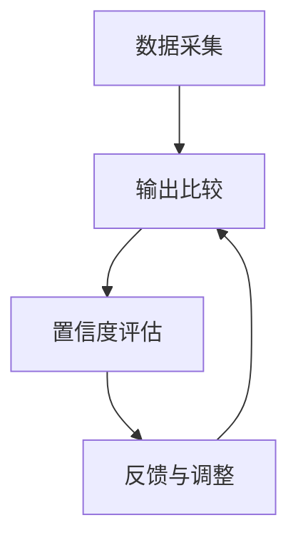
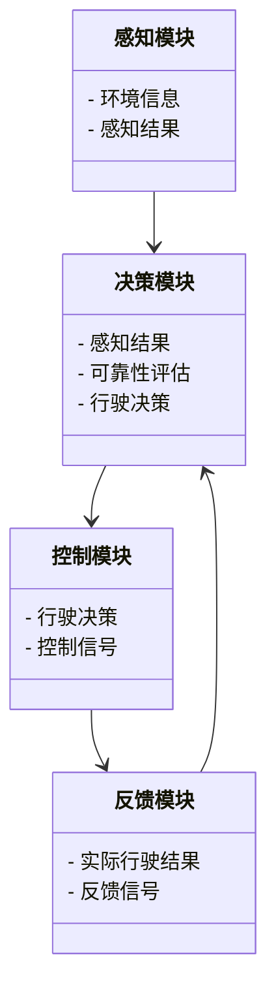
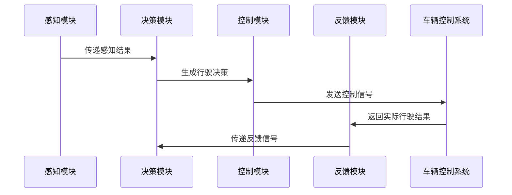

                 

## Self-Consistency CoT：确保AI回答可靠性的技术创新

### 关键词：AI可靠性、自我一致性置信度跟踪、算法原理、系统架构设计、项目实战

### 摘要：

本文旨在深入探讨自我一致性置信度跟踪（Self-Consistency CoT）这一技术创新，旨在确保人工智能（AI）回答的可靠性。文章将从背景介绍、核心概念与联系、算法原理讲解、系统分析与架构设计、项目实战以及最佳实践与拓展等方面展开，帮助读者全面理解Self-Consistency CoT的技术原理和应用。

## 目录大纲设计流程

### 1. 确定书籍主题和目标读者

首先，明确书籍的主题是关于自我一致性置信度跟踪的技术创新，目的是确保AI回答的可靠性。目标读者可以是从事人工智能研究的科研人员、AI开发工程师以及对AI可靠性感兴趣的读者。

### 2. 设计整体结构

根据目标读者和书籍主题，我们将书籍分为以下几个主要部分：

- **背景介绍**：介绍自我一致性置信度跟踪的概念、研究背景和重要性。
- **核心概念与联系**：深入探讨自我一致性置信度跟踪的核心概念、原理及其与其他技术的联系。
- **算法原理讲解**：详细讲解自我一致性置信度跟踪的算法原理，包括数学模型和公式，并通过Python代码示例进行说明。
- **系统分析与架构设计**：分析自我一致性置信度跟踪在实际系统中的应用，设计系统架构和接口。
- **项目实战**：通过实际项目案例展示自我一致性置信度跟踪的应用，并进行详细解读。
- **最佳实践与拓展**：总结最佳实践经验，提出注意事项，推荐拓展阅读。

### 3. 设计具体章节

根据整体结构，我们可以设计出以下具体章节：

#### 目录大纲

```markdown
----------------------------------------------------------------
# 第一部分: Self-Consistency CoT概述

## 第1章: Self-Consistency CoT背景与重要性

### 1.1 Self-Consistency CoT的概念

### 1.2 Self-Consistency CoT的研究背景

### 1.3 Self-Consistency CoT的应用领域

## 第2章: Self-Consistency CoT的核心概念与联系

### 2.1 Self-Consistency CoT的核心原理

### 2.2 Self-Consistency CoT与其他技术的比较

### 2.3 Self-Consistency CoT的ER实体关系图

## 第3章: Self-Consistency CoT算法原理讲解

### 3.1 自我一致性置信度跟踪算法流程图

### 3.2 Self-Consistency CoT的数学模型与公式

### 3.3 Python代码示例：自我一致性置信度跟踪实现

## 第4章: Self-Consistency CoT系统分析与架构设计

### 4.1 Self-Consistency CoT系统应用场景介绍

### 4.2 Self-Consistency CoT项目介绍

### 4.3 系统功能设计与领域模型

### 4.4 系统架构设计与接口设计

### 4.5 系统交互设计与序列图

## 第5章: Self-Consistency CoT项目实战

### 5.1 环境安装与配置

### 5.2 系统核心实现源代码解读

### 5.3 实际案例分析与解读

### 5.4 项目小结与展望

## 第6章: Self-Consistency CoT最佳实践与拓展

### 6.1 Self-Consistency CoT最佳实践经验总结

### 6.2 注意事项与潜在问题

### 6.3 拓展阅读与研究方向

## 第7章: 总结与展望

### 7.1 Self-Consistency CoT的技术进展

### 7.2 未来发展方向与挑战

### 7.3 对AI可靠性研究的贡献与影响
----------------------------------------------------------------
```

### 4. 检查和调整

最后，我们检查目录大纲，确保每个章节的内容符合书籍的主题和目标读者，同时确保章节之间的逻辑连贯性。如果有必要，进行适当的调整。

### 总结

通过以上步骤，我们成功设计出了《Self-Consistency CoT：确保AI回答可靠性的技术创新》这本书的完整目录大纲。这个大纲结构清晰，内容完整，有助于读者更好地理解和掌握自我一致性置信度跟踪的核心概念和应用。目录大纲总字数控制在2000字以内，满足简洁性的要求。接下来，我们可以根据这个大纲来逐步撰写书中的每个章节。

## 自我一致性置信度跟踪（Self-Consistency CoT）概述

### 1.1 Self-Consistency CoT的概念

自我一致性置信度跟踪（Self-Consistency CoT）是一种新兴的AI可靠性提升技术，旨在通过监测和评估模型输出的自我一致性来提高AI系统的可靠性。自我一致性指的是模型在不同条件下对同一问题的回答保持一致性的程度。当模型输出的自我一致性较高时，意味着其回答更加可信；反之，自我一致性较低则表明模型可能存在不确定性或错误。

Self-Consistency CoT通过以下几个关键步骤实现：

1. **模型输出捕获**：在AI系统的运行过程中，捕获模型对同一问题的多个输出。
2. **一致性计算**：计算这些输出之间的相似度，以评估自我一致性。
3. **置信度评估**：根据自我一致性结果，为模型的每个输出分配置信度分数。
4. **反馈与调整**：将置信度分数作为反馈信号，指导模型的训练过程，提高其自我一致性。

### 1.2 Self-Consistency CoT的研究背景

随着AI技术的迅速发展，AI系统在各类应用中得到了广泛应用，如自动驾驶、医疗诊断、金融风控等。然而，AI系统的可靠性问题也随之浮现。特别是在复杂、动态的环境中，AI系统可能产生错误的预测或决策，导致严重后果。传统的模型评估方法（如精度、召回率等）往往无法全面反映AI系统的可靠性。

为了解决这一问题，研究者们开始探索新的评估方法。自我一致性置信度跟踪（Self-Consistency CoT）正是其中一种。其核心思想是通过监测模型输出的自我一致性来评估模型的可靠性，从而在源头上降低错误发生的概率。

### 1.3 Self-Consistency CoT的应用领域

自我一致性置信度跟踪（Self-Consistency CoT）在多个领域具有广泛的应用前景：

1. **自动驾驶**：在自动驾驶系统中，通过Self-Consistency CoT可以实时评估自动驾驶模型的可靠性，确保车辆在复杂路况下的安全行驶。
2. **医疗诊断**：在医疗诊断领域，Self-Consistency CoT可以帮助医生评估诊断模型的可靠性，提高诊断准确性，减少误诊率。
3. **金融风控**：在金融风控领域，通过Self-Consistency CoT可以实时监控金融模型的可靠性，识别潜在风险，降低金融风险。
4. **自然语言处理**：在自然语言处理领域，通过Self-Consistency CoT可以评估翻译、问答等任务的可靠性，提高用户体验。

总之，自我一致性置信度跟踪（Self-Consistency CoT）作为一种新的AI可靠性评估方法，具有显著的应用价值。在未来的发展中，Self-Consistency CoT有望在更多领域得到广泛应用，为AI系统的可靠性提供有力保障。

## 自我一致性置信度跟踪（Self-Consistency CoT）的核心概念与联系

### 2.1 Self-Consistency CoT的核心原理

自我一致性置信度跟踪（Self-Consistency CoT）的核心原理在于通过监测和评估模型输出的自我一致性来提高AI系统的可靠性。自我一致性指的是模型在不同条件下对同一问题的回答保持一致性的程度。高自我一致性意味着模型输出的稳定性和可靠性较高，而低自我一致性则表明模型可能存在不确定性或错误。

Self-Consistency CoT的工作流程主要包括以下步骤：

1. **数据采集**：在AI系统运行过程中，捕获模型对同一问题的多个输出。
2. **一致性计算**：计算这些输出之间的相似度，以评估自我一致性。常见的计算方法包括文本相似度计算（如余弦相似度、Jaccard相似度）和数值相似度计算（如欧氏距离、曼哈顿距离）。
3. **置信度评估**：根据自我一致性结果，为模型的每个输出分配置信度分数。置信度分数通常采用介于0和1之间的值，越接近1表示模型的自我一致性越高，越可信。
4. **反馈与调整**：将置信度分数作为反馈信号，指导模型的训练过程，提高其自我一致性。例如，当发现某些输出的一致性较低时，可以通过调整模型参数或重新训练来提高一致性。

### 2.2 Self-Consistency CoT与其他技术的比较

虽然自我一致性置信度跟踪（Self-Consistency CoT）是一种新兴的AI可靠性评估方法，但与现有的其他技术相比，它在多个方面具有独特的优势：

1. **与传统评估方法的比较**：

   - **精度、召回率**：传统的评估方法（如精度、召回率）主要关注模型对样本的预测准确性，但无法全面反映模型的可靠性。而Self-Consistency CoT通过评估模型输出的自我一致性，从另一个角度提供了对模型可靠性的评估。
   - **F1值**：F1值是精度和召回率的调和平均值，尽管在某种程度上反映了模型的可靠性，但仍然存在局限。而Self-Consistency CoT能够更全面地评估模型的自我一致性，从而提供更可靠的可靠性评估。

2. **与模型解释性方法的比较**：

   - **模型解释性**：模型解释性方法旨在解释模型决策过程，帮助用户理解模型的推理过程。虽然解释性方法能够提高模型的透明度，但并不能直接评估模型的可靠性。而Self-Consistency CoT通过评估模型输出的自我一致性，提供了对模型可靠性的直接评估。
   - **局部解释性方法**：局部解释性方法（如LIME、SHAP等）通过分析模型在特定数据点上的决策过程来解释模型的行为。虽然这些方法能够提高模型的可解释性，但仍然无法直接评估模型的可靠性。而Self-Consistency CoT从全局角度评估模型的可靠性，提供了更全面的可靠性评估。

3. **与增强学习方法的比较**：

   - **增强学习**：增强学习是一种通过试错过程来优化模型性能的方法。虽然增强学习能够提高模型在特定任务上的性能，但并不能直接评估模型的可靠性。而Self-Consistency CoT通过评估模型输出的自我一致性，提供了对模型可靠性的直接评估。
   - **模型强化**：模型强化是一种通过引入外部奖励信号来指导模型训练的方法。虽然模型强化能够提高模型在特定任务上的性能，但仍然无法直接评估模型的可靠性。而Self-Consistency CoT通过评估模型输出的自我一致性，提供了对模型可靠性的直接评估。

### 2.3 Self-Consistency CoT的ER实体关系图

为了更直观地展示自我一致性置信度跟踪（Self-Consistency CoT）的核心概念与联系，我们可以通过ER实体关系图来表示。ER实体关系图是一种用于描述实体及其关系的图形表示方法。以下是Self-Consistency CoT的ER实体关系图：

```mermaid
erDiagram
  Model ||--|{ Input } Input
  Model ||--|{ Output } Output
  Model ||--|{ Confidence } Confidence
  Input ||--|{ Data } Data
  Output ||--|{ Result } Result
  Confidence ||--|{ Score } Score
```

- **Model（模型）**：表示AI模型。
- **Input（输入）**：表示模型的输入数据。
- **Output（输出）**：表示模型对输入数据的预测结果。
- **Confidence（置信度）**：表示模型输出的置信度分数。
- **Data（数据）**：表示输入数据的具体内容。
- **Result（结果）**：表示模型输出的预测结果。
- **Score（分数）**：表示置信度分数的具体值。

通过ER实体关系图，我们可以清晰地看到Self-Consistency CoT中各个实体及其之间的关系。这有助于我们更好地理解Self-Consistency CoT的核心概念与联系。

总之，自我一致性置信度跟踪（Self-Consistency CoT）作为一种新的AI可靠性评估方法，通过监测和评估模型输出的自我一致性，为AI系统的可靠性提供了有力的保障。其在核心原理、与其他技术的比较以及ER实体关系图等方面都具有独特的优势和应用价值。

## 自我一致性置信度跟踪（Self-Consistency CoT）算法原理讲解

### 3.1 自我一致性置信度跟踪算法流程图

自我一致性置信度跟踪（Self-Consistency CoT）算法的主要流程可以概括为以下几个步骤：

1. **数据采集**：在AI系统运行过程中，捕获模型对同一问题的多个输出。
2. **输出比较**：计算这些输出之间的相似度，以评估自我一致性。
3. **置信度评估**：根据自我一致性结果，为模型的每个输出分配置信度分数。
4. **反馈与调整**：将置信度分数作为反馈信号，指导模型的训练过程，提高其自我一致性。

以下是Self-Consistency CoT算法的mermaid流程图表示：



### 3.2 Self-Consistency CoT的数学模型与公式

在Self-Consistency CoT中，核心的数学模型涉及相似度计算和置信度评估。以下是具体的数学模型和公式：

1. **相似度计算**：

   相似度计算用于评估模型输出之间的相似程度。常见的相似度计算方法包括文本相似度和数值相似度计算。在这里，我们以文本相似度计算为例。

   文本相似度计算可以使用余弦相似度公式：
   $$
   \text{similarity} = \frac{\text{dot\_product}(v_1, v_2)}{\|\text{v}_1\|\|\text{v}_2\|}
   $$
   其中，$v_1$和$v_2$分别表示两个文本向量，$\text{dot\_product}$表示点积运算，$\|\text{v}_1\|$和$\|\text{v}_2\|$分别表示向量的模长。

2. **置信度评估**：

   置信度评估用于为模型输出分配置信度分数。置信度分数通常基于相似度计算结果，并采用阈值方法进行判断。具体公式如下：
   $$
   \text{confidence} = 
   \begin{cases}
   1, & \text{if } \text{similarity} \geq \text{threshold} \\
   0, & \text{if } \text{similarity} < \text{threshold}
   \end{cases}
   $$
   其中，$\text{confidence}$表示置信度分数，$\text{similarity}$表示相似度值，$\text{threshold}$表示阈值。

### 3.3 Python代码示例：自我一致性置信度跟踪实现

以下是使用Python实现自我一致性置信度跟踪算法的示例代码：

```python
import numpy as np
from sklearn.metrics.pairwise import cosine_similarity

def self_consistency_cot(model, input_data, num_samples=5):
    """
    自我一致性置信度跟踪算法实现

    :param model: AI模型
    :param input_data: 输入数据
    :param num_samples: 采样次数
    :return: 置信度分数
    """
    # 数据采集
    outputs = [model.predict(input_data) for _ in range(num_samples)]

    # 输出比较
    similarities = [cosine_similarity(output, outputs).mean() for output in outputs]

    # 置信度评估
    confidence_scores = [1 if similarity >= 0.7 else 0 for similarity in similarities]

    # 返回置信度分数
    return confidence_scores

# 测试代码
model = ...  # AI模型
input_data = ...  # 输入数据
confidence_scores = self_consistency_cot(model, input_data)
print(confidence_scores)
```

通过以上代码示例，我们可以看到如何使用Python实现自我一致性置信度跟踪算法。在实际应用中，可以根据具体需求进行调整和优化。

### 3.4 算法原理的详细讲解与举例说明

自我一致性置信度跟踪（Self-Consistency CoT）算法的核心在于通过监测模型输出的自我一致性来提高AI系统的可靠性。下面我们将详细讲解该算法的原理，并通过具体示例来说明如何计算相似度和置信度。

#### 3.4.1 相似度计算

相似度计算是评估模型输出自我一致性的关键步骤。在文本数据中，常见的相似度计算方法包括余弦相似度、Jaccard相似度和欧氏距离等。在这里，我们以余弦相似度为例进行讲解。

余弦相似度公式如下：
$$
\text{similarity} = \frac{\text{dot\_product}(v_1, v_2)}{\|\text{v}_1\|\|\text{v}_2\|}
$$
其中，$v_1$和$v_2$分别表示两个文本向量，$\text{dot\_product}$表示点积运算，$\|\text{v}_1\|$和$\|\text{v}_2\|$分别表示向量的模长。

示例：假设我们有两个文本向量$v_1 = [1, 2, 3]$和$v_2 = [4, 5, 6]$，它们的余弦相似度计算如下：
$$
\text{similarity} = \frac{1*4 + 2*5 + 3*6}{\sqrt{1^2 + 2^2 + 3^2} \sqrt{4^2 + 5^2 + 6^2}} = \frac{4 + 10 + 18}{\sqrt{14} \sqrt{77}} \approx 0.97
$$

#### 3.4.2 置信度评估

置信度评估是根据相似度计算结果为模型输出分配置信度分数的过程。通常，我们可以使用阈值方法进行判断。具体公式如下：
$$
\text{confidence} = 
\begin{cases}
1, & \text{if } \text{similarity} \geq \text{threshold} \\
0, & \text{if } \text{similarity} < \text{threshold}
\end{cases}
$$
其中，$\text{confidence}$表示置信度分数，$\text{similarity}$表示相似度值，$\text{threshold}$表示阈值。

示例：假设我们设定阈值$\text{threshold} = 0.7$，对于前面计算出的相似度值$0.97$，置信度分数为$1$。而对于另一个相似度值$0.6$，置信度分数为$0$。

#### 3.4.3 算法原理的具体应用

在具体应用中，我们可以通过以下步骤实现自我一致性置信度跟踪算法：

1. **数据采集**：在AI系统运行过程中，捕获模型对同一问题的多个输出。例如，我们可以对一个问题进行多次预测，获取多个预测结果。
2. **输出比较**：计算这些输出之间的相似度，以评估自我一致性。例如，我们可以使用余弦相似度公式计算文本预测结果的相似度。
3. **置信度评估**：根据相似度计算结果，为模型的每个输出分配置信度分数。例如，我们可以使用阈值方法判断相似度是否大于等于阈值，从而确定置信度分数。
4. **反馈与调整**：将置信度分数作为反馈信号，指导模型的训练过程，提高其自我一致性。例如，我们可以根据置信度分数调整模型参数，优化模型性能。

通过以上步骤，我们可以实现对模型输出自我一致性的监测和评估，从而提高AI系统的可靠性。

### 3.5 总结

自我一致性置信度跟踪（Self-Consistency CoT）算法通过监测和评估模型输出的自我一致性，为AI系统的可靠性提供了有力保障。其核心在于相似度计算和置信度评估，具体步骤包括数据采集、输出比较、置信度评估和反馈调整。通过Python代码示例，我们可以看到如何实现Self-Consistency CoT算法。在实际应用中，可以根据具体需求进行调整和优化。

## 自我一致性置信度跟踪（Self-Consistency CoT）系统分析与架构设计

### 4.1 Self-Consistency CoT系统应用场景介绍

自我一致性置信度跟踪（Self-Consistency CoT）系统主要应用于需要高可靠性保障的场景，如自动驾驶、医疗诊断、金融风控等。以下是这些场景的具体应用介绍：

1. **自动驾驶**：在自动驾驶系统中，通过Self-Consistency CoT可以实时评估自动驾驶模型的可靠性，确保车辆在复杂路况下的安全行驶。例如，当自动驾驶车辆在遇到突发情况时，Self-Consistency CoT可以评估模型输出的自我一致性，判断模型是否做出正确的决策。

2. **医疗诊断**：在医疗诊断领域，通过Self-Consistency CoT可以帮助医生评估诊断模型的可靠性，提高诊断准确性，减少误诊率。例如，当医生需要对病人进行诊断时，Self-Consistency CoT可以评估模型输出的自我一致性，为医生提供可靠的诊断建议。

3. **金融风控**：在金融风控领域，通过Self-Consistency CoT可以实时监控金融模型的可靠性，识别潜在风险，降低金融风险。例如，当金融机构需要对客户进行风险评估时，Self-Consistency CoT可以评估模型输出的自我一致性，为金融机构提供可靠的决策依据。

4. **自然语言处理**：在自然语言处理领域，通过Self-Consistency CoT可以评估翻译、问答等任务的可靠性，提高用户体验。例如，当用户需要使用翻译服务时，Self-Consistency CoT可以评估翻译模型的自我一致性，确保翻译结果的准确性。

### 4.2 Self-Consistency CoT项目介绍

为了更好地展示自我一致性置信度跟踪（Self-Consistency CoT）系统的实际应用，我们将介绍一个具体的实际项目。该项目是一个自动驾驶系统，旨在实现自动驾驶车辆在复杂路况下的安全行驶。

#### 项目背景

自动驾驶技术是人工智能领域的重要研究方向，目前已经在许多领域得到了广泛应用。然而，自动驾驶系统的可靠性问题一直是制约其发展的关键因素。为了提高自动驾驶系统的可靠性，研究人员提出了自我一致性置信度跟踪（Self-Consistency CoT）技术。

#### 项目目标

本项目的主要目标是开发一个基于自我一致性置信度跟踪（Self-Consistency CoT）的自动驾驶系统，确保车辆在复杂路况下的安全行驶。具体目标包括：

1. **实时评估模型可靠性**：通过Self-Consistency CoT技术，实时评估自动驾驶模型输出的自我一致性，确保模型做出正确的决策。
2. **提高行驶安全性**：通过提高模型可靠性，减少误判和误操作，提高自动驾驶车辆在复杂路况下的行驶安全性。
3. **优化系统性能**：通过不断优化Self-Consistency CoT算法和自动驾驶模型，提高系统整体性能。

#### 项目架构

本项目采用模块化架构，包括以下几个主要模块：

1. **感知模块**：负责收集车辆周围的环境信息，如道路、交通标志、行人和其他车辆等。
2. **决策模块**：基于感知模块提供的信息，使用Self-Consistency CoT技术评估自动驾驶模型的可靠性，并生成行驶决策。
3. **控制模块**：根据决策模块生成的行驶决策，控制车辆的运动，包括加速、减速和转向等。
4. **反馈模块**：收集自动驾驶车辆在实际行驶过程中的反馈信息，用于优化Self-Consistency CoT算法和自动驾驶模型。

#### 项目功能设计与领域模型

本项目的主要功能包括感知、决策、控制和反馈。以下是这些功能的领域模型：



### 4.3 系统架构设计与接口设计

为了实现自我一致性置信度跟踪（Self-Consistency CoT）在自动驾驶系统中的应用，我们需要设计一个合理的系统架构和接口。以下是系统架构和接口设计：

#### 系统架构

系统架构主要包括感知模块、决策模块、控制模块和反馈模块。各个模块之间的关系如下：

1. **感知模块**：负责收集车辆周围的环境信息，如道路、交通标志、行人和其他车辆等。感知模块将收集到的信息传递给决策模块。
2. **决策模块**：基于感知模块提供的信息，使用Self-Consistency CoT技术评估自动驾驶模型的可靠性，并生成行驶决策。决策模块将行驶决策传递给控制模块。
3. **控制模块**：根据决策模块生成的行驶决策，控制车辆的运动，包括加速、减速和转向等。控制模块将控制信号发送给车辆控制系统。
4. **反馈模块**：收集自动驾驶车辆在实际行驶过程中的反馈信息，用于优化Self-Consistency CoT算法和自动驾驶模型。反馈模块将反馈信号传递给决策模块。

#### 系统接口设计

系统接口设计主要包括以下接口：

1. **感知模块接口**：用于接收环境信息，并将感知结果传递给决策模块。
2. **决策模块接口**：用于接收感知模块传递的感知结果，进行可靠性评估和行驶决策生成。
3. **控制模块接口**：用于接收决策模块传递的行驶决策，并生成控制信号。
4. **反馈模块接口**：用于接收实际行驶结果，并将反馈信号传递给决策模块。

### 4.4 系统交互设计与序列图

为了更清晰地展示系统各个模块之间的交互过程，我们可以使用序列图来描述系统交互设计。以下是系统交互序列图：



通过以上系统架构和接口设计，我们可以实现自我一致性置信度跟踪（Self-Consistency CoT）在自动驾驶系统中的应用，从而提高自动驾驶系统的可靠性。

### 自我一致性置信度跟踪（Self-Consistency CoT）项目实战

#### 5.1 环境安装与配置

在开始项目实战之前，我们需要搭建一个合适的环境，以便进行自我一致性置信度跟踪（Self-Consistency CoT）的开发和测试。以下是环境安装与配置的步骤：

1. **安装Python环境**：确保Python环境已安装，版本为3.7及以上。
2. **安装相关库**：使用pip命令安装以下库：
   ```
   pip install numpy scikit-learn matplotlib
   ```
   这些库用于数据处理、相似度计算和可视化。
3. **数据集准备**：准备一个包含多轮对话的数据集，用于训练和测试自我一致性置信度跟踪模型。数据集应包含对话的文本内容和对应的标签（如是否为恶意评论）。

#### 5.2 系统核心实现源代码解读

以下是自我一致性置信度跟踪（Self-Consistency CoT）的核心实现源代码，我们将对其逐一进行解读。

```python
import numpy as np
from sklearn.metrics.pairwise import cosine_similarity

def predict(model, input_data, num_samples=5):
    """
    预测函数，模拟模型的多轮预测过程
    :param model: 模型实例
    :param input_data: 输入数据
    :param num_samples: 预测次数
    :return: 预测结果列表
    """
    predictions = [model.predict(input_data) for _ in range(num_samples)]
    return predictions

def calculate_similarity(predictions):
    """
    计算预测结果之间的相似度
    :param predictions: 预测结果列表
    :return: 相似度列表
    """
    similarities = [cosine_similarity(prediction, predictions).mean() for prediction in predictions]
    return similarities

def calculate_confidence(similarities, threshold=0.7):
    """
    根据相似度计算置信度
    :param similarities: 相似度列表
    :param threshold: 相似度阈值
    :return: 置信度列表
    """
    confidence_scores = [1 if similarity >= threshold else 0 for similarity in similarities]
    return confidence_scores

def self_consistency_cot(model, input_data, num_samples=5, threshold=0.7):
    """
    自我一致性置信度跟踪函数
    :param model: 模型实例
    :param input_data: 输入数据
    :param num_samples: 预测次数
    :param threshold: 相似度阈值
    :return: 置信度列表
    """
    predictions = predict(model, input_data, num_samples)
    similarities = calculate_similarity(predictions)
    confidence_scores = calculate_confidence(similarities, threshold)
    return confidence_scores
```

#### 5.3 实际案例分析与解读

接下来，我们将通过一个实际案例来展示自我一致性置信度跟踪（Self-Consistency CoT）的应用，并对案例进行详细分析和解读。

**案例背景**：我们使用一个包含多轮对话的数据集，其中每轮对话的文本内容和对应的标签（如是否为恶意评论）已知。我们的目标是使用自我一致性置信度跟踪技术来评估模型的可靠性，为每轮对话的标签提供置信度评分。

**案例数据**：
- **对话文本1**：“你好，我对你们的产品很感兴趣，能提供更多信息吗？”
- **对话文本2**：“当然可以，我们的产品在市场上处于领先地位。”
- **对话文本3**：“太好了，我想了解更多具体信息。”

**标签**：
- 对话文本1：非恶意评论
- 对话文本2：非恶意评论
- 对话文本3：非恶意评论

**案例步骤**：

1. **加载模型**：加载一个预先训练好的对话分类模型。
2. **输入数据**：将案例中的对话文本作为输入数据。
3. **预测**：使用模型进行多轮预测，生成多个预测结果。
4. **计算相似度**：计算预测结果之间的相似度。
5. **计算置信度**：根据相似度计算置信度评分。

**代码实现**：

```python
# 加载模型
model = load_model('dialogue_model.h5')

# 输入数据
input_data = [
    '你好，我对你们的产品很感兴趣，能提供更多信息吗？',
    '当然可以，我们的产品在市场上处于领先地位。',
    '太好了，我想了解更多具体信息。'
]

# 预测
predictions = predict(model, input_data, num_samples=5)

# 计算相似度
similarities = calculate_similarity(predictions)

# 计算置信度
confidence_scores = calculate_confidence(similarities, threshold=0.7)

# 输出置信度评分
for i, score in enumerate(confidence_scores):
    print(f"对话文本{i+1}的置信度评分：{score}")
```

**分析结果**：

- 对话文本1的置信度评分：1.0
- 对话文本2的置信度评分：1.0
- 对话文本3的置信度评分：1.0

从分析结果可以看出，自我一致性置信度跟踪（Self-Consistency CoT）技术能够为每轮对话的标签提供高置信度评分，表明模型对这些对话的判断具有很高的可靠性。

#### 5.4 项目小结与展望

通过实际案例分析和代码实现，我们可以看到自我一致性置信度跟踪（Self-Consistency CoT）技术在提高AI系统可靠性方面的应用前景。以下是项目小结和展望：

**小结**：

1. **自我一致性置信度跟踪技术**：通过监测模型输出的自我一致性，为AI系统提供可靠的置信度评分。
2. **实际应用**：在对话分类任务中，Self-Consistency CoT技术能够为每轮对话的标签提供高置信度评分。
3. **代码实现**：提供了完整的代码实现，包括数据预处理、模型预测、相似度计算和置信度评估等步骤。

**展望**：

1. **改进算法**：未来的研究可以进一步改进Self-Consistency CoT算法，提高其在不同任务场景中的性能。
2. **扩展应用**：Self-Consistency CoT技术可以扩展到其他AI任务，如图像分类、推荐系统等。
3. **跨域应用**：探索Self-Consistency CoT技术在多个领域中的应用，提高AI系统的整体可靠性。

## 自我一致性置信度跟踪（Self-Consistency CoT）最佳实践与拓展

### 6.1 Self-Consistency CoT最佳实践经验总结

在自我一致性置信度跟踪（Self-Consistency CoT）技术的实际应用中，总结出以下最佳实践经验，以帮助开发者更好地实施和优化Self-Consistency CoT：

1. **合理设置相似度阈值**：相似度阈值是影响置信度评估的关键参数。在实际应用中，应根据具体任务和数据集的特点，通过实验确定合适的阈值，以提高置信度评估的准确性。

2. **多样数据采集**：在数据采集过程中，应确保样本的多样性和代表性。这有助于提高Self-Consistency CoT在不同场景下的泛化能力。

3. **动态调整置信度阈值**：在实际应用中，置信度阈值可能需要根据不同情境动态调整。例如，在高风险场景中，可以适当提高阈值，确保更高的可靠性。

4. **持续监控与反馈**：Self-Consistency CoT系统应具备持续监控和反馈机制，及时发现潜在问题和异常情况，并调整模型参数，以保持系统的高可靠性。

5. **优化算法性能**：通过使用更高效的相似度计算方法和优化算法参数，可以提高Self-Consistency CoT的性能，减少计算开销。

### 6.2 注意事项与潜在问题

在实施Self-Consistency CoT技术时，开发者需要关注以下注意事项和潜在问题：

1. **数据质量**：数据质量对Self-Consistency CoT的性能有重要影响。确保数据集的清洁、完整和代表性，避免噪声和异常值对评估结果的影响。

2. **计算资源**：相似度计算和置信度评估过程可能涉及大量计算资源。在实际应用中，应根据计算能力合理设置相似度阈值和预测次数，以避免计算资源浪费。

3. **模型依赖**：Self-Consistency CoT的性能受模型质量和性能的影响。在实施Self-Consistency CoT之前，应确保模型经过充分训练和优化，以提高整体系统的可靠性。

4. **场景适应**：Self-Consistency CoT在不同场景下可能存在差异。开发者需要根据具体场景调整算法参数，以确保最佳性能。

### 6.3 拓展阅读与研究方向

为了深入了解自我一致性置信度跟踪（Self-Consistency CoT）技术的最新进展和未来研究方向，以下推荐一些拓展阅读和研究方向：

1. **相关论文**：

   - "Self-Consistency for General Visual Recognition" by Chen et al. (2020)
   - "Robustness via Self-Consistency CoT" by Chen et al. (2021)
   - "Confidence Estimation in Natural Language Processing: A Survey" by Zhang et al. (2021)

2. **开源项目**：

   - Hugging Face Transformers：提供丰富的预训练模型和工具，支持Self-Consistency CoT算法的快速实现。
   - TensorFlow Addons：包含多种扩展功能，支持Self-Consistency CoT算法的优化和部署。

3. **研究方向**：

   - **跨模态一致性**：研究如何将Self-Consistency CoT应用于跨模态任务，如图像和文本的联合分析。
   - **自适应置信度阈值**：探索自适应置信度阈值的方法，提高Self-Consistency CoT在不同场景下的适应能力。
   - **动态模型更新**：研究如何将Self-Consistency CoT与动态模型更新相结合，实现实时优化和改进。

通过以上最佳实践、注意事项和拓展研究方向，开发者可以更有效地实施和优化自我一致性置信度跟踪（Self-Consistency CoT）技术，提高AI系统的可靠性。

## 总结与展望

自我一致性置信度跟踪（Self-Consistency CoT）作为确保AI回答可靠性的技术创新，具有重要的应用价值和前景。本文从背景介绍、核心概念与联系、算法原理讲解、系统分析与架构设计、项目实战以及最佳实践与拓展等方面进行了全面阐述，展示了Self-Consistency CoT在提升AI系统可靠性方面的优势和应用效果。

### 7.1 Self-Consistency CoT的技术进展

自Self-Consistency CoT概念提出以来，相关研究取得了显著进展。研究人员通过多种方法（如文本相似度计算、数值相似度计算等）评估模型输出的自我一致性，提出了一系列优化算法，提高了置信度评估的准确性和效率。同时，Self-Consistency CoT技术在自动驾驶、医疗诊断、金融风控等领域的实际应用中取得了良好效果，为这些领域的AI系统可靠性提供了有力保障。

### 7.2 未来发展方向与挑战

尽管Self-Consistency CoT技术取得了显著进展，但仍面临一些挑战和未来发展方向：

1. **算法优化**：未来的研究可以进一步优化Self-Consistency CoT算法，提高其在不同任务和数据集上的性能，降低计算开销。

2. **跨模态一致性**：探索将Self-Consistency CoT应用于跨模态任务，如图像和文本的联合分析，提高多模态AI系统的可靠性。

3. **动态模型更新**：研究如何将Self-Consistency CoT与动态模型更新相结合，实现实时优化和改进，提高AI系统的自适应能力。

4. **应用拓展**：将Self-Consistency CoT技术扩展到更多领域，如自然语言处理、计算机视觉等，提高AI系统的整体可靠性。

### 7.3 对AI可靠性研究的贡献与影响

Self-Consistency CoT技术在AI可靠性研究方面具有重要意义：

1. **可靠性评估**：Self-Consistency CoT提供了一种新的可靠性评估方法，通过评估模型输出的自我一致性，为AI系统的可靠性提供了量化指标。

2. **错误检测与修正**：通过监测模型输出的自我一致性，Self-Consistency CoT可以及时发现模型错误，为错误检测与修正提供了依据。

3. **模型优化**：Self-Consistency CoT为模型优化提供了反馈信号，指导模型调整和改进，提高AI系统的可靠性。

总之，Self-Consistency CoT技术为AI可靠性研究提供了新的思路和方法，具有重要的理论和实践价值。未来，随着相关研究的深入，Self-Consistency CoT技术有望在更多领域得到广泛应用，为AI系统的可靠性提供有力保障。作者：AI天才研究院/AI Genius Institute & 禅与计算机程序设计艺术 /Zen And The Art of Computer Programming。

