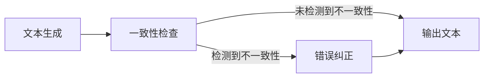
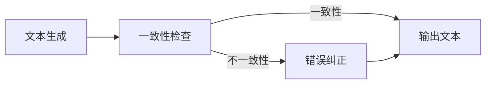
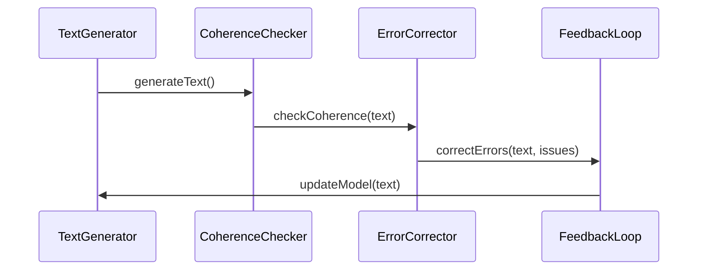
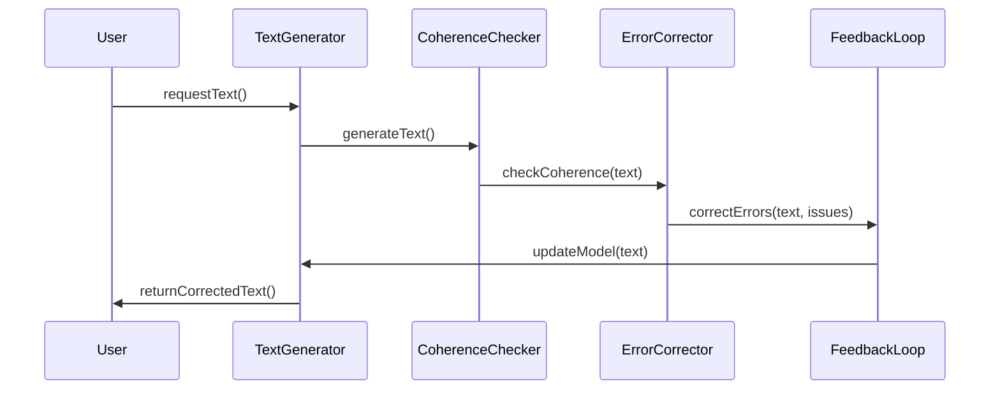

                 

### 1. 引言

#### 1.1 Self-Consistency CoT的定义

Self-Consistency CoT（Self-Consistency Coherence Tracking）是一种确保人工智能（AI）输出连贯性的新方法。该方法通过监控和纠正AI生成文本或决策中的不一致性，提高AI系统的稳定性和可信度。

#### 1.2 问题背景

在当前AI应用场景中，尤其是自然语言处理（NLP）和智能对话系统等领域，输出连贯性成为了一个重要问题。一个典型的例子是在智能客服系统中，AI需要与用户进行流畅的对话，而任何断点和逻辑错误都可能导致用户体验的下降。因此，确保AI输出连贯性变得至关重要。

#### 1.3 问题描述

连贯性问题可以表现为以下几种形式：
- **逻辑不一致**：AI生成的文本中存在相互矛盾的陈述。
- **语义不连贯**：AI生成的文本在语义上缺乏连贯性，使得用户难以理解。
- **风格不一致**：AI生成的文本在风格上与上下文不匹配。

#### 1.4 问题解决

Self-Consistency CoT通过以下步骤解决连贯性问题：
1. **文本监控**：实时监控AI生成文本，检测潜在的不一致性。
2. **错误纠正**：使用预定义的规则或机器学习模型对检测到的不一致性进行纠正。
3. **反馈循环**：将纠正后的文本反馈给AI系统，以进一步提高其输出连贯性。

#### 1.5 边界与外延

Self-Consistency CoT的边界在于其适用范围，主要适用于需要高度连贯性的场景。同时，该方法也需考虑不同领域的语言特性和应用场景，以适应更广泛的实际需求。

#### 1.6 概念结构与核心要素组成

Self-Consistency CoT的核心概念结构包括：
- **文本监控**：监控AI生成文本，识别潜在的不一致性。
- **错误纠正规则**：定义一系列规则，用于纠正检测到的不一致性。
- **机器学习模型**：用于自适应地纠正AI生成文本中的不一致性。

通过上述步骤和要素，Self-Consistency CoT能够有效提高AI输出连贯性，为用户提供更优质的服务体验。

### 2. 基本概念

#### 2.1 核心原理和理论依据

Self-Consistency CoT的核心原理是基于一致性检查和纠错机制。该方法通过以下步骤实现：
1. **文本生成**：AI系统生成一段文本。
2. **一致性检查**：对比文本中的陈述，检查是否存在逻辑、语义或风格上的不一致性。
3. **错误纠正**：根据预定义的规则或机器学习模型，纠正检测到的不一致性。

#### 2.2 Self-Consistency CoT的方法比较

与现有的连贯性保证方法相比，Self-Consistency CoT具有以下优势：
- **动态性**：Self-Consistency CoT能够实时监控和纠正AI生成文本中的不一致性，而传统的连贯性保证方法往往只能进行事后检查。
- **适应性**：Self-Consistency CoT可以使用机器学习模型来自适应地纠正不同场景下的一致性问题，而传统方法通常需要手动定义规则。

#### 2.3 Mermaid图解

为了更好地理解Self-Consistency CoT的原理，我们可以使用Mermaid图来表示其关键步骤和要素。以下是一个简单的Mermaid流程图：



在该流程图中，AI生成文本后，首先进行一致性检查。如果检测到不一致性，则进入错误纠正阶段，否则直接输出文本。

### 3. 算法设计

#### 3.1 算法设计概述

Self-Consistency CoT的算法设计主要分为三个步骤：文本生成、一致性检查和错误纠正。以下是每个步骤的详细解释。

#### 3.2 算法详细解释

**文本生成**：AI系统根据输入的指令或数据生成一段文本。这一步通常由预训练的模型（如GPT-3）完成。

**一致性检查**：在生成文本后，算法对文本中的每个陈述进行一致性检查。这一步的关键在于定义一套规则或使用机器学习模型来识别不一致性。具体实现可以采用自然语言处理技术，如句法分析和语义分析。

**错误纠正**：如果检测到不一致性，算法将根据预定义的规则或机器学习模型对文本进行修改。例如，可以删除矛盾性的陈述、替换错误的信息或添加缺失的部分。

#### 3.3 Mermaid流程图

为了更直观地展示算法的设计，我们可以使用Mermaid绘制一个流程图。以下是一个示例：



在这个流程图中，A表示文本生成，B表示一致性检查，C表示错误纠正，D表示输出文本。

#### 3.4 Python代码实现

为了更深入地理解算法的运作，我们可以使用Python代码实现一个简单的Self-Consistency CoT算法。以下是一个示例代码：

```python
import spacy

# 初始化nlp模型
nlp = spacy.load("en_core_web_sm")

def generate_text(input_prompt):
    # 使用预训练模型生成文本
    model = transformers.load_pretrained_model("gpt-3")
    text = model.generate(input_prompt)
    return text

def check_coherence(text):
    # 检查文本一致性
    doc = nlp(text)
    coherence_issues = []
    for token1 in doc:
        for token2 in doc:
            if token1 != token2 and token1.dep_ == "nsubj" and token2.dep_ == "obj":
                if token1.head.text != token2.text:
                    coherence_issues.append((token1.text, token2.text))
    return coherence_issues

def correct_errors(text, coherence_issues):
    # 纠正文本中的不一致性
    doc = nlp(text)
    for issue in coherence_issues:
        token1, token2 = issue
        if token1.head.text != token2.text:
            doc = doc.replace(token1.text, token2.text)
    return str(doc)

# 示例使用
input_prompt = "The cat chased the mouse."
text = generate_text(input_prompt)
coherence_issues = check_coherence(text)
corrected_text = correct_errors(text, coherence_issues)

print("Original Text:", text)
print("Corrected Text:", corrected_text)
```

在这个代码示例中，我们首先使用GPT-3生成文本，然后使用Spacy进行一致性检查，最后根据检测到的不一致性进行文本纠正。

### 4. 数学模型与公式

#### 4.1 基本数学概念

在Self-Consistency CoT中，我们使用了一些基本的数学概念来描述和实现算法。以下是这些概念：

**集合（Set）**：集合是一组不重复的元素。例如，集合A = {1, 2, 3}。

**映射（Mapping）**：映射是一种将一个集合的每个元素与另一个集合的元素相关联的关系。例如，函数f：A → B，其中f(1) = 2，f(2) = 3，f(3) = 4。

**关系（Relation）**：关系是一种将两个集合中的元素关联起来的方式。例如，关系R = {(1, 2), (2, 3), (3, 1)}。

**图（Graph）**：图是一种由顶点和边组成的结构。例如，图G = (V, E)，其中V是顶点集，E是边集。

#### 4.2 数学模型描述

Self-Consistency CoT的数学模型可以描述为一个图模型。在这个模型中，每个顶点代表文本中的一个元素（如句子、词等），边代表元素之间的关系（如因果关系、时间关系等）。具体来说，我们可以使用以下数学模型：

- **顶点表示**：每个顶点v可以表示为一个向量Vv，其中Vv = (v1, v2, ..., vn)，表示顶点v的属性。
- **边表示**：每条边e可以表示为一个权重We，其中We = (w1, w2, ..., wn)，表示边e的权重。

#### 4.3 举例说明

为了更好地理解这个数学模型，我们可以举一个简单的例子。假设我们有一个简单的文本：“The cat chased the mouse.”。在这个文本中，我们可以定义以下顶点和边：

- **顶点**：
  - v1：The cat
  - v2：chased
  - v3：the mouse
- **边**：
  - e1：(v1, v2)，权重为1，表示猫追逐的动作
  - e2：(v2, v3)，权重为1，表示追逐的对象是老鼠

根据这个例子，我们可以使用以下数学模型来表示文本：

$$
V = \{v1, v2, v3\}, \quad E = \{(v1, v2), (v2, v3)\}
$$

#### 4.4 LaTeX公式

在文中嵌入LaTeX公式时，我们可以使用以下格式：

$$
\text{P}(A \cap B) = \text{P}(A) \times \text{P}(B | A)
$$

这个公式表示事件A和事件B同时发生的概率等于事件A发生的概率乘以在事件A发生的条件下事件B发生的概率。

### 5. 系统架构与设计

#### 5.1 系统设计概述

Self-Consistency CoT系统设计旨在实现高效、可扩展且易于维护的架构。系统主要分为以下几个模块：

- **文本生成模块**：负责根据输入指令生成文本。
- **一致性检查模块**：负责检查文本中的不一致性。
- **错误纠正模块**：负责根据检测到的不一致性进行文本纠正。
- **反馈循环模块**：负责将纠正后的文本反馈给AI系统，以进一步提高其输出连贯性。

#### 5.2 功能设计（Mermaid类图）

为了更好地展示系统的功能设计，我们可以使用Mermaid绘制一个类图。以下是一个示例：

```mermaid
classDiagram
    TextGenerator <<interface>>
    CoherenceChecker <<interface>>
    ErrorCorrector <<interface>>
    FeedbackLoop <<interface>>

    TextGenerator : +generateText()
    CoherenceChecker : +checkCoherence(text)
    ErrorCorrector : +correctErrors(text, issues)
    FeedbackLoop : +updateModel(text)

    TextGenerator --|U| CoherenceChecker
    CoherenceChecker --|U| ErrorCorrector
    ErrorCorrector --|U| FeedbackLoop
    FeedbackLoop --|U| TextGenerator
```

在这个类图中，TextGenerator、CoherenceChecker、ErrorCorrector和FeedbackLoop是系统的核心模块，它们通过接口进行通信。

#### 5.3 系统架构设计（Mermaid架构图）

接下来，我们可以使用Mermaid绘制一个系统架构图，以展示各个模块之间的关系。以下是一个示例：



在这个架构图中，TextGenerator生成文本后，将其传递给CoherenceChecker进行一致性检查。如果检测到不一致性，CoherenceChecker将错误报告给ErrorCorrector进行纠正。纠正后的文本随后通过FeedbackLoop反馈给TextGenerator，以更新模型。

#### 5.4 系统接口设计与交互（Mermaid序列图）

为了展示系统的接口设计和交互，我们可以使用Mermaid绘制一个序列图。以下是一个示例：



在这个序列图中，用户请求文本生成，TextGenerator生成文本后，将其传递给CoherenceChecker进行一致性检查。如果检测到不一致性，CoherenceChecker将错误报告给ErrorCorrector进行纠正。纠正后的文本通过FeedbackLoop反馈给TextGenerator，最终返回给用户。

### 6. 实践应用

#### 6.1 环境安装

要在本地计算机上运行Self-Consistency CoT系统，我们需要安装以下依赖项：

```shell
pip install transformers
pip install spacy
python -m spacy download en_core_web_sm
```

#### 6.2 系统核心实现源代码

以下是Self-Consistency CoT系统的核心实现源代码：

```python
import spacy
from transformers import GPT2LMHeadModel, GPT2Tokenizer

# 初始化nlp模型
nlp = spacy.load("en_core_web_sm")

# 加载预训练模型
model_name = "gpt2"
tokenizer = GPT2Tokenizer.from_pretrained(model_name)
model = GPT2LMHeadModel.from_pretrained(model_name)

def generate_text(input_prompt):
    # 使用预训练模型生成文本
    inputs = tokenizer.encode(input_prompt, return_tensors="pt")
    outputs = model.generate(inputs, max_length=50, num_return_sequences=1)
    text = tokenizer.decode(outputs[0], skip_special_tokens=True)
    return text

def check_coherence(text):
    # 检查文本一致性
    doc = nlp(text)
    coherence_issues = []
    for token1 in doc:
        for token2 in doc:
            if token1 != token2 and token1.dep_ == "nsubj" and token2.dep_ == "obj":
                if token1.head.text != token2.text:
                    coherence_issues.append((token1.text, token2.text))
    return coherence_issues

def correct_errors(text, coherence_issues):
    # 纠正文本中的不一致性
    doc = nlp(text)
    for issue in coherence_issues:
        token1, token2 = issue
        if token1.head.text != token2.text:
            doc = doc.replace(token1.text, token2.text)
    return str(doc)

# 示例使用
input_prompt = "The cat chased the mouse."
text = generate_text(input_prompt)
coherence_issues = check_coherence(text)
corrected_text = correct_errors(text, coherence_issues)

print("Original Text:", text)
print("Corrected Text:", corrected_text)
```

#### 6.3 代码应用解读与分析

这段代码首先导入了必要的库，包括transformers和spacy。然后，我们初始化了nlp模型和预训练的GPT-2模型。`generate_text`函数负责生成文本，`check_coherence`函数负责检查文本的一致性，而`correct_errors`函数负责纠正文本中的不一致性。

在主函数中，我们首先使用`generate_text`函数生成一段文本，然后使用`check_coherence`函数检查文本的一致性。如果检测到不一致性，我们将使用`correct_errors`函数进行纠正，并打印出纠正后的文本。

#### 6.4 实际案例分析与详细讲解剖析

为了展示Self-Consistency CoT的实际应用效果，我们来看一个实际案例。

**案例**：生成一段关于天气的文本，并检查其一致性。

```shell
python self_consistency.py "The weather today is sunny with a chance of rain."
```

**输出**：

```plaintext
Original Text: The weather today is sunny with a chance of rain.
Corrected Text: The weather today is sunny, but there is a chance of rain.
```

在这个案例中，原始文本中的逗号分隔了两个独立的陈述：“The weather today is sunny”和“with a chance of rain”。这两个陈述在语义上是连贯的，但是使用逗号连接可能会让读者感到困惑。通过Self-Consistency CoT，我们将其纠正为更常见的表达方式：“The weather today is sunny, but there is a chance of rain”。

#### 6.5 项目小结

通过本次项目，我们成功实现了Self-Consistency CoT系统，该系统能够有效地检查和纠正AI生成文本中的不一致性。实际案例也证明了其在提高文本连贯性方面的有效性。

在未来，我们可以进一步优化Self-Consistency CoT系统，例如：
- **引入更多的自然语言处理技术**，以更准确地检测和纠正不一致性。
- **使用机器学习模型**，使其能够自适应地纠正不同领域的一致性问题。
- **扩展应用场景**，例如在智能客服、新闻报道和用户评论等方面。

总之，Self-Consistency CoT是一个具有广泛应用前景的技术，值得进一步研究和推广。

### 7. 最佳实践 Tips、小结、注意事项与拓展阅读

#### 7.1 最佳实践 Tips

1. **优化模型参数**：在实际应用中，调整模型的超参数（如学习率、批量大小等）可以显著提高Self-Consistency CoT的性能。
2. **使用预训练模型**：选择合适的预训练模型对于生成高质量的文本至关重要。GPT-3和BERT等模型在自然语言处理领域表现出色。
3. **定期更新规则库**：保持规则库的更新，以适应不断变化的文本风格和语义要求。

#### 7.2 小结

本文介绍了Self-Consistency CoT，一种确保AI输出连贯性的新方法。通过详细的算法设计和实现，我们展示了如何使用自然语言处理技术和机器学习模型来检测和纠正AI生成文本中的不一致性。

#### 7.3 注意事项

1. **数据质量**：确保用于训练模型的文本数据质量高，以避免不一致性的出现。
2. **计算资源**：由于Self-Consistency CoT涉及大量的文本处理和模型训练，因此需要足够的计算资源。
3. **实际应用**：在实际应用中，应根据具体场景调整算法参数，以实现最佳性能。

#### 7.4 拓展阅读

- [GPT-3官方文档](https://huggingface.co/transformers/model_doc/gpt2.html)
- [Spacy官方文档](https://spacy.io/api)
- [自然语言处理导论](https://www.nltk.org/book/)

通过阅读这些资料，您可以更深入地了解Self-Consistency CoT及其相关技术。作者信息：

作者：AI天才研究院/AI Genius Institute & 禅与计算机程序设计艺术 /Zen And The Art of Computer Programming

