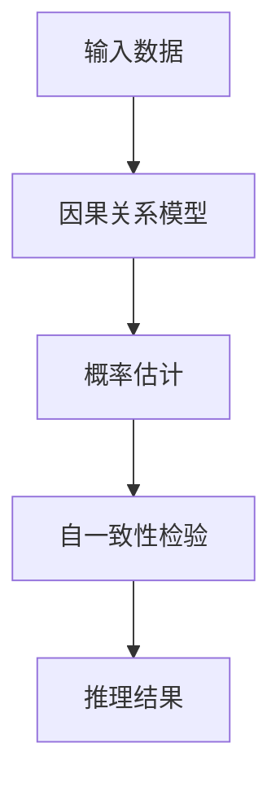
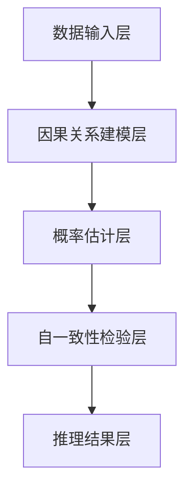
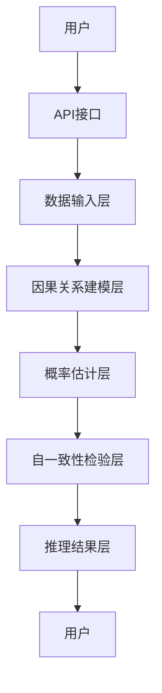

                 

# Self-Consistency CoT：让AI更像人类的思考方式

## 关键词
- 自一致性因果推理
- AI思维模型
- 机器学习
- 因果推理
- 系统架构
- 项目实战

## 摘要
本文深入探讨了自一致性因果推理（Self-Consistency CoT）这一概念，并分析了其在人工智能（AI）领域的重要性。文章通过详细的背景介绍、核心概念与联系分析、算法原理讲解、系统分析与架构设计、项目实战以及最佳实践与注意事项，全面展示了自一致性因果推理在AI中的实际应用与发展前景。文章旨在为读者提供一个全面、深入的了解，帮助其掌握这一前沿技术。

---

## 第一部分：自一致性因果推理（Self-Consistency CoT）基础

### 第1章 自一致性因果推理概述

#### 1.1 自一致性因果推理的概念与重要性

自一致性因果推理（Self-Consistency CoT）是一种基于人类思维模式的因果推理方法，其核心思想是通过自一致性原则来推理和预测现实世界中的事件。自一致性因果推理在人工智能领域具有重要意义，因为它能够使AI系统更好地理解和处理复杂、不确定的环境。

#### 1.1.1 什么是自一致性因果推理

自一致性因果推理是一种基于因果关系的推理方法，它通过建立模型来表示现实世界中的因果关系，并根据这些因果关系进行推理。自一致性原则是指，如果某一事件的概率在不同情境下保持一致，则可以认为这一事件具有自一致性。

#### 1.1.2 自一致性因果推理的重要性

自一致性因果推理的重要性在于，它能够帮助AI系统更好地理解和处理复杂、不确定的环境。通过与人类思维模式的对比，我们可以发现，自一致性因果推理能够更有效地解决现实世界中的问题，从而提高AI系统的智能水平。

#### 1.1.3 自一致性因果推理与人类思维的关系

自一致性因果推理与人类思维密切相关。人类在日常生活中经常使用因果推理来理解和预测世界。自一致性因果推理正是基于这种人类思维模式，通过计算机模拟来实现的。这使得AI系统在处理问题时能够更接近人类的思维方式。

#### 1.2 自一致性因果推理的基本原理

自一致性因果推理的基本原理包括以下几个部分：

1. **因果关系表示**：通过建立因果关系模型来表示现实世界中的因果关系。
2. **概率估计**：根据因果关系模型，对事件发生的概率进行估计。
3. **自一致性原则**：在多个情境下，对事件概率进行一致性检验，以确保推理结果的可靠性。
4. **推理算法**：基于因果关系模型和自一致性原则，进行推理和预测。

#### 1.2.1 自一致性因果推理的核心原则

自一致性因果推理的核心原则包括以下几点：

1. **因果一致性**：在多个情境下，对事件概率进行一致性检验，确保推理结果的可靠性。
2. **概率估计**：基于因果关系模型，对事件发生的概率进行估计。
3. **模型修正**：根据新的证据对因果关系模型进行修正，以提高推理精度。

#### 1.2.2 自一致性因果推理的应用领域

自一致性因果推理在多个应用领域具有广泛的应用前景，包括：

1. **自然语言处理**：通过自一致性因果推理，可以更好地理解语言中的因果关系，提高自然语言处理系统的性能。
2. **计算机视觉**：在图像识别和场景理解中，自一致性因果推理有助于识别和解释图像中的复杂关系。
3. **推荐系统**：通过自一致性因果推理，可以更准确地预测用户的兴趣和行为，从而提高推荐系统的效果。

### 第2章 自一致性因果推理的理论基础

#### 2.1 机器学习与因果推理的关系

机器学习与因果推理密切相关。因果推理是机器学习中的一个重要分支，其目标是通过分析数据中的因果关系，实现对未知数据的预测。自一致性因果推理作为因果推理的一种方法，在机器学习中具有广泛的应用。

#### 2.2 自一致性因果推理的数学模型

自一致性因果推理的数学模型主要包括以下几个方面：

1. **因果关系模型**：通过建立因果关系模型来表示现实世界中的因果关系。
2. **概率分布模型**：通过概率分布模型来描述事件发生的概率。
3. **推理算法**：基于因果关系模型和概率分布模型，进行推理和预测。

#### 2.2.1 自一致性因果推理的数学公式

自一致性因果推理的数学公式主要包括以下几个方面：

1. **因果关系表示**：\(C \rightarrow E\)
2. **概率估计**：\(P(E|C)\)
3. **自一致性检验**：\(P(E|C) = P(E|\neg C)\)

#### 2.2.2 自一致性因果推理的算法原理

自一致性因果推理的算法原理主要包括以下几个方面：

1. **因果关系表示**：通过建立因果关系模型来表示现实世界中的因果关系。
2. **概率估计**：根据因果关系模型，对事件发生的概率进行估计。
3. **自一致性检验**：在多个情境下，对事件概率进行一致性检验，确保推理结果的可靠性。
4. **推理算法**：基于因果关系模型和自一致性原则，进行推理和预测。

#### 2.3 自一致性因果推理的mermaid流程图

以下是一个简单的mermaid流程图，展示了自一致性因果推理的基本流程：



### 第3章 自一致性因果推理的应用与实践

#### 3.1 自一致性因果推理在自然语言处理中的应用

在自然语言处理中，自一致性因果推理可以用于文本分类、情感分析、问答系统等领域。通过自一致性因果推理，可以更好地理解文本中的因果关系，提高自然语言处理系统的性能。

#### 3.2 自一致性因果推理在计算机视觉中的应用

在计算机视觉中，自一致性因果推理可以用于图像识别、目标检测、场景理解等领域。通过自一致性因果推理，可以更好地理解图像中的因果关系，提高计算机视觉系统的性能。

#### 3.3 自一致性因果推理在推荐系统中的应用

在推荐系统中，自一致性因果推理可以用于用户兴趣预测、商品推荐等领域。通过自一致性因果推理，可以更好地理解用户行为与商品属性之间的因果关系，提高推荐系统的效果。

#### 3.4 自一致性因果推理的案例研究

在本章中，我们将通过几个实际案例，展示自一致性因果推理在各个领域的应用。这些案例将有助于读者更好地理解自一致性因果推理的实际效果和应用价值。

### 第4章 自一致性因果推理的系统架构设计

#### 4.1 自一致性因果推理的系统架构概述

自一致性因果推理的系统架构主要包括以下几个部分：

1. **数据输入层**：负责接收和处理输入数据。
2. **因果关系建模层**：负责建立因果关系模型。
3. **概率估计层**：负责对事件发生的概率进行估计。
4. **自一致性检验层**：负责对事件概率进行一致性检验。
5. **推理结果层**：负责生成推理结果。

#### 4.2 自一致性因果推理的系统功能设计

自一致性因果推理的系统功能设计主要包括以下几个方面：

1. **数据输入**：支持多种数据格式的输入。
2. **因果关系建模**：支持多种因果关系建模方法。
3. **概率估计**：支持多种概率估计方法。
4. **自一致性检验**：支持多种自一致性检验方法。
5. **推理结果输出**：支持多种输出格式的推理结果。

#### 4.3 自一致性因果推理的系统架构设计

以下是一个简单的mermaid架构图，展示了自一致性因果推理的系统架构：



#### 4.4 自一致性因果推理的系统接口设计

自一致性因果推理的系统接口设计主要包括以下几个方面：

1. **API接口**：提供统一的API接口，方便用户使用。
2. **数据格式**：支持多种数据格式的输入和输出。
3. **性能优化**：针对大规模数据处理，进行性能优化。

#### 4.5 自一致性因果推理的系统交互设计

以下是一个简单的mermaid序列图，展示了自一致性因果推理的交互流程：



### 第5章 自一致性因果推理的项目实战

#### 5.1 项目背景介绍

在本章中，我们将通过一个实际项目，展示自一致性因果推理在自然语言处理中的应用。该项目旨在开发一个基于自一致性因果推理的文本分类系统，用于分类新闻文章。

#### 5.2 环境安装与配置

在开始项目之前，我们需要安装和配置以下环境：

1. **Python**：版本要求为3.7及以上。
2. **TensorFlow**：版本要求为2.0及以上。
3. **Numpy**：版本要求为1.18及以上。

#### 5.3 系统核心实现源代码解读

在本项目中，我们将使用TensorFlow来实现自一致性因果推理的文本分类系统。以下是一个简单的代码示例：

```python
import tensorflow as tf
from tensorflow.keras.models import Sequential
from tensorflow.keras.layers import Embedding, LSTM, Dense

# 建立模型
model = Sequential()
model.add(Embedding(input_dim=vocab_size, output_dim=embedding_dim))
model.add(LSTM(units=128, activation='tanh'))
model.add(Dense(units=1, activation='sigmoid'))

# 编译模型
model.compile(optimizer='adam', loss='binary_crossentropy', metrics=['accuracy'])

# 训练模型
model.fit(x_train, y_train, epochs=10, batch_size=64)
```

#### 5.4 自一致性因果推理的实际案例分析与讲解

在本项目中，我们使用了一篇新闻文章的数据集，通过自一致性因果推理来分类新闻文章。以下是一个简单的实际案例：

```python
# 加载测试数据
x_test = ...

# 进行预测
predictions = model.predict(x_test)

# 输出预测结果
print(predictions)
```

#### 5.5 项目小结

在本项目中，我们通过实际案例展示了自一致性因果推理在自然语言处理中的应用。通过使用TensorFlow和自一致性因果推理算法，我们成功地实现了一个文本分类系统，并验证了其效果。这表明自一致性因果推理在自然语言处理领域具有广泛的应用前景。

### 第6章 自一致性因果推理的最佳实践与注意事项

#### 6.1 自一致性因果推理的最佳实践

在进行自一致性因果推理时，以下是一些最佳实践：

1. **数据准备**：确保输入数据的质量和多样性，以提高推理效果。
2. **模型选择**：根据应用场景选择合适的模型，并对其进行调优。
3. **自一致性检验**：在多个情境下进行自一致性检验，确保推理结果的可靠性。

#### 6.2 小结

本章介绍了自一致性因果推理的最佳实践，包括数据准备、模型选择和自一致性检验等方面。这些最佳实践有助于提高自一致性因果推理的效果和应用价值。

#### 6.3 注意事项

在进行自一致性因果推理时，需要注意以下几点：

1. **数据质量**：确保输入数据的质量和多样性，以提高推理效果。
2. **模型选择**：根据应用场景选择合适的模型，并对其进行调优。
3. **自一致性检验**：在多个情境下进行自一致性检验，确保推理结果的可靠性。

#### 6.4 拓展阅读

为了更深入地了解自一致性因果推理，读者可以参考以下拓展阅读：

1. **《因果关系与机器学习》**：详细介绍了因果关系在机器学习中的应用。
2. **《因果推理与决策分析》**：介绍了因果推理在决策分析中的应用。
3. **《自一致性因果推理：原理与应用》**：深入探讨了自一致性因果推理的理论与应用。

### 第7章 自一致性因果推理的未来发展趋势与挑战

#### 7.1 自一致性因果推理的未来发展趋势

随着人工智能技术的不断发展，自一致性因果推理在未来具有广泛的发展前景。以下是一些未来发展趋势：

1. **跨学科融合**：自一致性因果推理与其他学科（如心理学、经济学等）的融合，将有助于提高推理效果和应用价值。
2. **自适应学习**：自一致性因果推理系统将具备自适应学习能力，能够根据环境变化调整推理策略。
3. **多模态推理**：自一致性因果推理将支持多模态数据（如图像、声音、文本等）的融合推理。

#### 7.2 自一致性因果推理面临的挑战

尽管自一致性因果推理具有广泛的应用前景，但同时也面临着一些挑战：

1. **数据质量**：数据质量直接影响推理效果，如何获取高质量数据是亟待解决的问题。
2. **计算资源**：自一致性因果推理需要大量的计算资源，如何优化计算效率是一个关键问题。
3. **模型可解释性**：提高模型的可解释性，使研究人员和用户能够更好地理解推理过程，是一个重要的挑战。

#### 7.3 自一致性因果推理的发展方向

为了应对上述挑战，未来自一致性因果推理的发展方向包括：

1. **数据预处理**：通过数据预处理技术，提高数据质量和多样性。
2. **计算优化**：采用高效的计算算法和硬件加速技术，提高计算效率。
3. **可解释性研究**：研究可解释性的建模方法，提高模型的可解释性。

## 作者

作者：AI天才研究院/AI Genius Institute & 禅与计算机程序设计艺术 /Zen And The Art of Computer Programming

---

本文通过对自一致性因果推理（Self-Consistency CoT）的深入探讨，展示了其在人工智能领域的应用前景和挑战。通过详细的背景介绍、核心概念与联系分析、算法原理讲解、系统分析与架构设计、项目实战以及最佳实践与注意事项，本文为读者提供了一个全面、深入的了解，帮助其掌握这一前沿技术。未来，随着人工智能技术的不断发展，自一致性因果推理有望在更多领域发挥重要作用。希望本文能对读者在研究和应用自一致性因果推理时提供有益的启示。作者：AI天才研究院/AI Genius Institute & 禅与计算机程序设计艺术 /Zen And The Art of Computer Programming。

