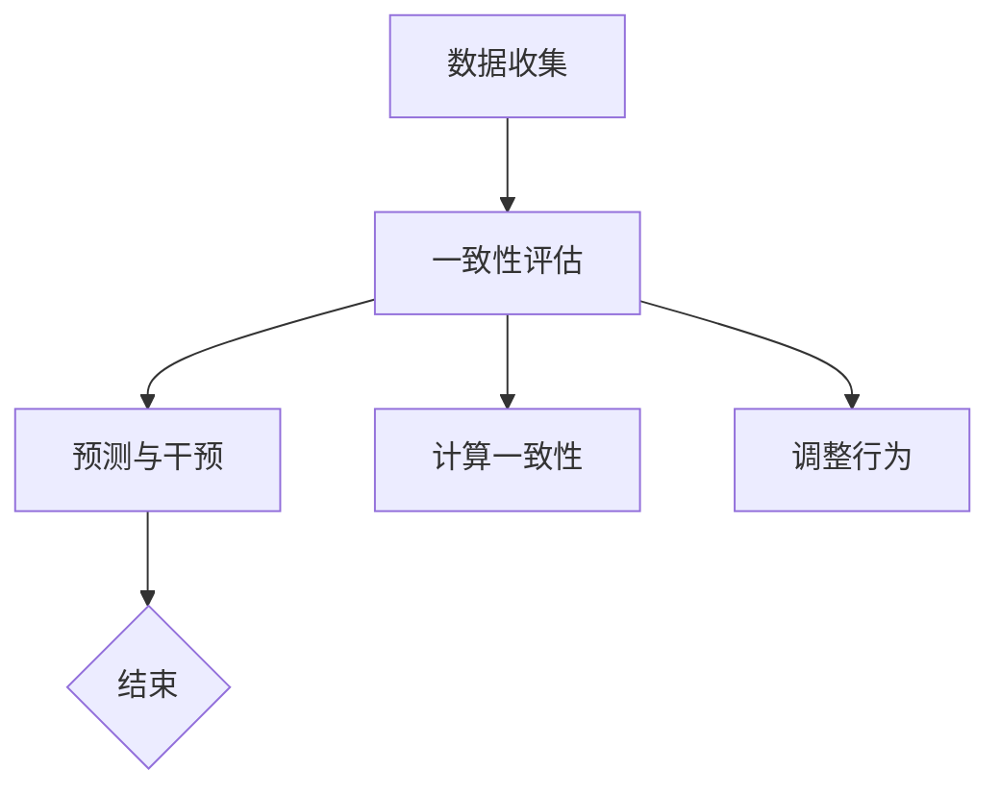
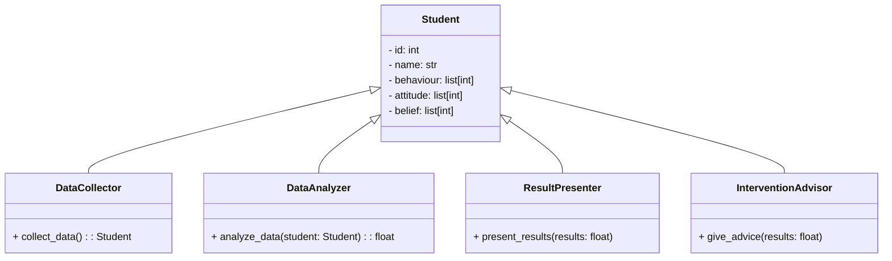
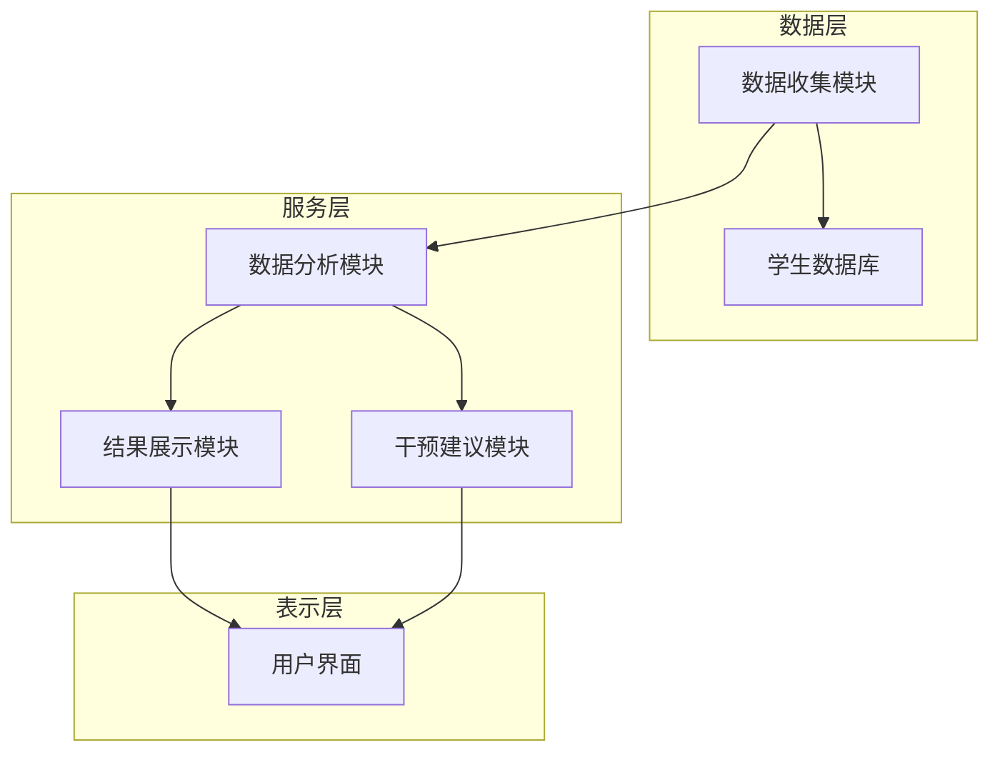

                 


# Self-Consistency在社会学研究中的应用

关键词：Self-Consistency、社会学、心理学基础、实证研究、跨文化比较

摘要：本文探讨了Self-Consistency理论在社会学中的广泛应用。从心理学基础出发，深入分析了自我一致性与认知、行为、动机等心理学理论的联系，并通过实证研究和社会学应用实例，展示了自我一致性在社会互动、社会角色、社会规范遵守等方面的作用。最后，本文还对比了不同文化背景下的Self-Consistency现象，以期为未来的研究提供新的视角。

## 第1章: Self-Consistency理论概述

### 1.1 问题背景

#### 1.1.1 社会学研究中的自我一致性现象

在社会学研究中，自我一致性是一个重要概念，它描述了个体在行为、态度和信念上保持内部一致性的倾向。这种现象在社会互动、社会角色履行、社会规范遵守等方面具有重要意义。

#### 1.1.2 自我一致性现象的重要性

自我一致性是社会行为决策的依据，也是社会关系维护的基石。个体在追求自我一致性时，往往倾向于选择那些能够保持内在一致性的行为和态度。

### 1.2 问题定义

#### 1.2.1 自我一致性的定义

自我一致性是指个体在行为、态度和信念上保持内部一致性的倾向。这种一致性可以表现为行为与态度的一致、态度与信念的一致，或者行为与信念的一致。

#### 1.2.1.1 自我一致性的基本概念

自我一致性可以分为内在自我一致性（inner self-consistency）和外在自我一致性（outer self-consistency）。内在自我一致性关注个体内心世界的一致性，而外在自我一致性则关注个体行为和社会互动的一致性。

#### 1.2.1.2 自我一致性的心理学解读

在心理学中，自我一致性被视为一种自我调节机制，它有助于个体在面对内外部压力时保持稳定和一致。自我一致性与认知失调理论、自我知觉理论等心理学理论有着紧密的联系。

### 1.3 问题解决

#### 1.3.1 自我一致性的研究方法

自我一致性的研究方法主要包括实验法和问卷调查法。实验法可以通过控制变量来研究自我一致性现象，而问卷调查法则可以收集大量的实证数据，从而进行统计分析。

#### 1.3.1.1 实验法

实验法是研究自我一致性的常用方法。通过设计不同的实验情景，研究者可以观察个体在不同情境下的自我一致性表现。例如，在实验室中，研究者可以让被试者在不同任务中表现出不一致的行为，然后观察被试者如何调节自己的行为以保持一致性。

#### 1.3.1.2 问卷调查法

问卷调查法是收集自我一致性数据的有效途径。通过设计结构化的问卷，研究者可以收集大量关于个体自我一致性态度和行为的信息。例如，研究者可以设计关于个体行为、态度和信念的问卷，以了解个体在不同情境下的自我一致性表现。

### 1.3.2 自我一致性的实证分析

#### 1.3.2.1 国内外研究综述

国内外学者对自我一致性进行了大量的实证研究。研究表明，自我一致性在不同文化、社会群体中具有普遍性。然而，不同文化背景和社会环境可能会影响个体自我一致性的表现形式。

#### 1.3.2.2 自我一致性的统计分析

通过统计分析，研究者可以了解自我一致性在不同群体中的差异。例如，研究发现，高自尊个体在行为和态度上表现出更高的自我一致性。此外，性别、年龄等因素也可能对自我一致性产生影响。

### 1.4 边界与外延

#### 1.4.1 自我一致性的边界条件

自我一致性的边界条件包括个体心理状态、社会环境、文化背景等。例如，在压力环境下，个体可能更容易放弃自我一致性以应对外部压力。

#### 1.4.1.1 影响自我一致性的因素

影响自我一致性的因素包括个体的认知水平、自我效能感、社会支持等。高认知水平和自我效能感有助于个体保持自我一致性。

#### 1.4.1.2 自我一致性的适应情境

自我一致性在适应情境中具有重要作用。例如，在团队合作中，个体需要保持自我一致性以建立信任和协作关系。

### 1.5 概念结构与核心要素组成

#### 1.5.1 自我一致性的概念结构

自我一致性的概念结构包括自我认知、行为表现和社会评价。这三个要素相互关联，共同构成个体自我一致性的基础。

#### 1.5.1.1 自我一致性的理论框架

自我一致性的理论框架包括认知失调理论、自我知觉理论和社会认同理论。这些理论从不同角度解释了自我一致性的形成和作用。

#### 1.5.1.2 自我一致性的主要影响因素

自我一致性的主要影响因素包括个体心理状态、社会环境和文化背景。这些因素共同作用于个体，影响其自我一致性的表现。

#### 1.5.2 自我一致性的核心要素组成

自我一致性的核心要素包括自我认知、行为表现和社会评价。

- **自我认知**：个体对自己行为的认知和评价。
- **行为表现**：个体在行为上的表现，如言行一致。
- **社会评价**：他人对个体行为的评价和反馈。

## 1.6 本章小结

本章对自我一致性理论进行了概述，包括其背景、定义、研究方法、实证分析、边界与外延以及概念结构与核心要素组成。通过本章的介绍，读者可以初步了解自我一致性的概念和其在社会学研究中的应用。

## 第2章: Self-Consistency理论的心理学基础

### 2.1 心理学研究中的自我一致性

#### 2.1.1 自我一致性与认知心理学

自我一致性与认知心理学有着紧密的联系。认知失调理论（Cognitive Dissonance Theory）和自我知觉理论（Self-Perception Theory）是解释自我一致性的两个重要理论。

##### 2.1.1.1 认知失调理论

认知失调理论认为，个体在面临内部认知不一致时，会产生心理不适感，从而促使个体采取行动以减少这种不适。自我一致性现象可以视为认知失调理论的一个具体体现。

##### 2.1.1.2 自我知觉理论

自我知觉理论认为，个体通过观察自己的行为来判断自己的态度。当个体观察到自己表现出一致的行为时，会认为自己持有相应的态度。这有助于解释个体在行为和态度上保持自我一致性的原因。

#### 2.1.2 自我一致性与社会心理学

社会心理学中的自我一致性现象也具有重要意义。社会认同理论（Social Identity Theory）和比较理论（Comparative Theory）是解释自我一致性的两个重要理论。

##### 2.1.2.1 社会认同理论

社会认同理论认为，个体在自我评价和决策时，会受到所属社会群体的认同和影响。个体在追求自我一致性时，往往倾向于与所属社会群体的价值观和行为保持一致。

##### 2.1.2.2 社会比较理论

社会比较理论认为，个体通过与他人比较来判断自己的价值和地位。自我一致性现象可以视为个体在社会比较中维持自我价值感的一种方式。

### 2.2 Self-Consistency理论的心理学依据

自我一致性理论的心理学依据主要涉及行为心理学、动机心理学等方面。

#### 2.2.1 自我一致性与行为心理学

行为心理学认为，个体的行为是受内在动机和外部刺激共同影响的。自我一致性现象可以视为个体在行为选择中遵循内在动机的结果。例如，个体在追求自我一致性时，可能会选择那些能够保持内在一致性的行为。

##### 2.2.1.1 行为一致性的重要性

行为一致性对于个体的心理健康和社会适应具有重要意义。保持行为一致性有助于个体建立自我认同，增强自信心和自尊心。此外，行为一致性还有助于建立和维护良好的人际关系。

##### 2.2.1.2 自我控制与自我效能感

自我控制（Self-Control）和自我效能感（Self-Efficacy）是影响自我一致性的重要因素。自我控制能力较强的个体更容易在行为上保持自我一致性。而自我效能感较高的个体则更倾向于相信自己的能力，从而在行为选择中表现出更高的自我一致性。

#### 2.2.2 自我一致性与动机心理学

动机心理学认为，个体的行为是由内在动机和外在动机共同驱动的。自我一致性现象可以视为个体在追求内在动机和外在动机一致时的行为表现。

##### 2.2.2.1 动机与行为的一致性

动机与行为的一致性是自我一致性的核心内容。当个体的内在动机与外在动机相一致时，个体更容易表现出自我一致性。例如，一个热爱编程的程序员在追求个人兴趣的同时，也可能在工作中选择与编程相关的职业。

##### 2.2.2.2 自我利益与社会责任

自我利益（Self-Interest）与社会责任（Social Responsibility）是影响自我一致性的两个重要因素。在追求自我利益的同时，个体也需要考虑社会责任。自我一致性现象可以视为个体在平衡自我利益与社会责任时的一种行为表现。

### 2.3 Self-Consistency理论的应用与发展

自我一致性理论在社会学、心理学等领域具有广泛的应用价值。随着研究的深入，自我一致性理论也在不断发展。

#### 2.3.1 自我一致性与心理健康

心理健康与自我一致性密切相关。保持自我一致性有助于个体保持心理健康，减少心理压力。研究发现，自我一致性水平较高的个体在心理健康方面表现出较好的状况。

##### 2.3.1.1 心理健康与自我一致性的关系

心理健康与自我一致性之间存在正向关系。保持自我一致性有助于个体建立积极的自我认知，提高自尊心和自信心，从而有利于心理健康的维护。

##### 2.3.1.2 心理健康促进策略

为了促进心理健康，个体可以采取以下策略：
1. 增强自我控制能力，提高自我效能感；
2. 寻求社会支持，建立良好的人际关系；
3. 保持自我认知的清晰和真实，避免过度自我批评。

#### 2.3.2 自我一致性与社会行为

自我一致性在社会行为中发挥着重要作用。个体在行为选择中往往会考虑自我一致性，以维持内在的一致性和稳定性。

##### 2.3.2.1 社会行为的自我一致性解释

社会行为的自我一致性解释可以帮助我们理解个体在社会互动中的行为表现。例如，个体在履行社会责任时，往往会考虑自我一致性的原则，以保持内在的一致性和稳定性。

##### 2.3.2.2 自我一致性在社会规范遵守中的角色

自我一致性在社会规范遵守中发挥着重要作用。个体在遵守社会规范时，往往会考虑自我一致性的原则，以保持内在的一致性和稳定性。例如，个体在遵守交通规则时，可能会因为自我一致性原则而选择遵守规则，即使没有他人监督。

### 2.4 本章小结

本章介绍了Self-Consistency理论的心理学基础，包括自我一致性与认知心理学、社会心理学的关系，以及自我一致性与行为心理学、动机心理学的联系。通过分析自我一致性的心理学依据，我们可以更好地理解自我一致性的本质和作用。同时，本章还探讨了自我一致性在心理健康和社会行为中的应用和发展。

## 第3章: Self-Consistency理论在社会学中的实证研究

### 3.1 社会学研究中的自我一致性现象

#### 3.1.1 社会互动中的自我一致性

社会互动中的自我一致性表现在个体在互动过程中保持内在一致性的行为和态度。社会互动中的自我一致性现象主要体现在以下两个方面：

##### 3.1.1.1 社会互动中的自我一致性表现

在社会互动中，个体会根据自我一致性的原则来选择行为和态度。例如，个体在与朋友相处时，可能会表现出与自我认知和行为一致的言行，以维护自我一致性。

##### 3.1.1.2 社会互动中的自我一致性影响

社会互动中的自我一致性影响个体的人际关系和社会地位。保持自我一致性有助于个体建立稳定的人际关系，提高社会地位。相反，自我一致性差可能导致人际关系紧张和社会地位下降。

#### 3.1.2 社会角色中的自我一致性

社会角色中的自我一致性表现在个体在社会角色履行过程中保持内在一致性的行为和态度。社会角色中的自我一致性现象主要体现在以下两个方面：

##### 3.1.2.1 社会角色认同与自我一致性

社会角色认同与自我一致性密切相关。个体在认同某一社会角色时，会根据自我一致性的原则来选择行为和态度。例如，一个教师可能会在课堂上表现出与教师角色一致的言行，以维护自我一致性。

##### 3.1.2.2 社会角色履行与自我一致性

社会角色履行与自我一致性密切相关。个体在履行社会角色时，会根据自我一致性的原则来调整行为和态度，以保持内在的一致性和稳定性。例如，一个医生在治疗患者时，可能会根据自我一致性原则来选择治疗方法，以确保治疗过程与医生角色一致。

### 3.2 Self-Consistency理论的应用研究

自我一致性理论在社会学中的实证研究主要集中在社会规范遵守、社会认同和社会行为选择等方面。

#### 3.2.1 社会规范遵守

社会规范遵守是自我一致性理论在社会学中应用的一个重要方面。个体在遵守社会规范时，会考虑自我一致性的原则。社会规范遵守与自我一致性的关系可以从以下几个方面进行分析：

##### 3.2.1.1 社会规范与自我一致性

社会规范与自我一致性密切相关。个体在遵守社会规范时，会根据自我一致性的原则来判断是否遵守规范。例如，一个遵守交通规则的司机可能会因为自我一致性原则而选择遵守交通规则，即使没有他人监督。

##### 3.2.1.2 社会规范遵守的实证分析

通过实证分析，研究者发现自我一致性水平较高的个体在遵守社会规范方面表现出更好的行为。例如，一项研究发现，自我一致性水平较高的学生更倾向于遵守校园纪律，而在考试中作弊的行为较少。

#### 3.2.2 社会认同与自我一致性

社会认同与自我一致性也是自我一致性理论在社会学中应用的一个重要方面。社会认同与自我一致性的关系可以从以下几个方面进行分析：

##### 3.2.2.1 社会认同与自我一致性的关系

社会认同与自我一致性密切相关。个体在社会认同过程中，会根据自我一致性的原则来选择行为和态度。例如，一个认同自己国家的人可能会在公共场合表现出与国家认同一致的行为和言论。

##### 3.2.2.2 社会认同的影响因素与自我一致性

社会认同的影响因素包括个体心理状态、社会环境和文化背景等。这些因素会影响个体在社会认同过程中的自我一致性表现。例如，一个处于压力环境中的个体可能会因为心理压力而放弃自我一致性。

#### 3.2.3 社会行为选择

社会行为选择是自我一致性理论在社会学中的另一个应用方面。个体在社会行为选择中会考虑自我一致性的原则。社会行为选择与自我一致性的关系可以从以下几个方面进行分析：

##### 3.2.3.1 社会行为选择中的自我一致性

个体在社会行为选择中会考虑自我一致性的原则。例如，一个在工作中表现出色的人可能会因为自我一致性原则而在其他方面也表现出色。

##### 3.2.3.2 自我一致性对社会行为选择的影响

自我一致性对社会行为选择具有重要影响。保持自我一致性有助于个体在社会行为选择中保持稳定性和一致性。例如，一个在工作中表现出色的个体可能会因为自我一致性原则而在其他方面也表现出色。

### 3.3 本章小结

本章通过实证研究探讨了自我一致性在社会学研究中的应用，包括社会互动中的自我一致性、社会角色中的自我一致性以及社会规范遵守、社会认同和社会行为选择等方面。通过分析这些实证研究，我们可以更好地理解自我一致性的本质和作用，为未来的社会学研究提供理论支持。

## 第4章: Self-Consistency理论的跨文化比较研究

### 4.1 跨文化研究中的自我一致性现象

#### 4.1.1 自我一致性的跨文化表现

跨文化研究中的自我一致性现象表现出显著的差异性。不同文化背景下的个体在自我一致性方面的表现有所不同。以下从三个方面分析自我一致性的跨文化表现：

##### 4.1.1.1 高权力距离文化中的自我一致性

在权力距离较高的文化中，如亚洲和拉丁美洲国家，个体在自我一致性方面的表现可能较弱。这是因为这些文化中的社会关系强调等级制度和权力差异，个体在行为选择中可能更多地考虑社会地位和权力因素，而不是内在的自我一致性。

##### 4.1.1.2 低权力距离文化中的自我一致性

在权力距离较低的文化中，如北欧和美国，个体在自我一致性方面的表现可能较强。这些文化强调个人自主和自由，个体在行为选择中更加注重内在的自我一致性，追求个体价值观的内在一致。

##### 4.1.1.3 文化融合背景下的自我一致性

在文化融合背景下，如全球化进程中的国际大都市，个体在自我一致性方面的表现可能呈现出多样化的特征。这些地区居民在行为选择中可能会同时受到多种文化价值观的影响，从而表现出复杂的自我一致性模式。

#### 4.1.2 自我一致性的文化影响因素

自我一致性在不同文化背景下的表现受到多种因素的影响，主要包括文化价值观、社会规范和个体心理特征。

##### 4.1.2.1 文化价值观

文化价值观对自我一致性具有深远影响。例如，集体主义文化中个体更注重社会群体的价值观和规范，个体行为和态度可能更多地与社会规范保持一致。而个人主义文化中个体更强调个人自主和自由，自我一致性在行为选择中占据主导地位。

##### 4.1.2.2 社会规范

社会规范是影响自我一致性的重要因素。在不同文化背景下，社会规范的内容和形式可能有所不同。例如，在一些文化中，社会规范强调遵守传统习俗和道德规范，个体在行为选择中可能更多地考虑这些规范。而在另一些文化中，社会规范强调个人自由和创新，个体在行为选择中可能更多地关注自我一致性。

##### 4.1.2.3 个体心理特征

个体心理特征也是影响自我一致性的重要因素。例如，个体的自我效能感、自我控制和自尊水平可能影响其在行为选择中保持自我一致性的能力。在自我效能感较高的个体中，自我一致性可能表现得更为明显。

### 4.2 跨文化比较研究的方法与挑战

#### 4.2.1 跨文化比较研究的方法

跨文化比较研究的方法主要包括跨文化调查、实验研究和跨文化案例分析等。以下从这三个方面介绍跨文化比较研究的方法：

##### 4.2.1.1 跨文化调查

跨文化调查是通过收集不同文化背景下的数据来比较自我一致性的表现。研究者可以设计问卷或访谈，收集关于个体自我一致性态度和行为的数据，然后对不同文化背景下的数据进行比较分析。

##### 4.2.1.2 实验研究

实验研究是跨文化比较研究的一种重要方法。研究者可以在不同的文化背景下设计实验，观察个体在自我一致性方面的行为表现。例如，研究者可以在不同文化背景下设计认知任务，比较个体在面对不同情境时的自我一致性表现。

##### 4.2.1.3 跨文化案例分析

跨文化案例分析是通过对不同文化背景下的具体案例进行分析，来探讨自我一致性的跨文化表现。研究者可以通过深入研究具体案例，了解不同文化背景下的个体在自我一致性方面的表现和影响因素。

#### 4.2.2 跨文化比较研究的挑战

跨文化比较研究面临着多种挑战，主要包括跨文化差异、研究方法和技术、数据分析和解释等方面。

##### 4.2.2.1 跨文化差异

跨文化差异是跨文化比较研究面临的主要挑战之一。不同文化背景下的个体在价值观、行为规范和心理特征等方面可能存在显著差异，这给跨文化比较研究带来了困难。

##### 4.2.2.2 研究方法和技术

跨文化比较研究需要采用多种研究方法和技术来确保研究的准确性和可靠性。研究者需要根据不同文化背景的特点，选择合适的研究方法和工具。

##### 4.2.2.3 数据分析和解释

跨文化比较研究的数据分析和解释也面临着挑战。研究者需要采用合适的统计方法来分析数据，并对不同文化背景下的自我一致性表现进行解释。

### 4.3 跨文化比较研究的启示与未来方向

#### 4.3.1 跨文化比较研究的启示

跨文化比较研究为我们提供了深入了解自我一致性现象的视角。通过比较不同文化背景下的自我一致性表现，我们可以发现自我一致性的文化影响因素和跨文化差异。这些启示有助于我们更好地理解自我一致性的本质和作用。

#### 4.3.2 未来研究方向

未来的跨文化比较研究可以从以下几个方面展开：

1. 深入研究自我一致性在不同文化背景下的具体表现和影响因素；
2. 探讨自我一致性在不同文化背景下的心理机制和适应策略；
3. 开展多学科交叉研究，整合心理学、社会学和文化学等领域的理论和方法。

### 4.4 本章小结

本章通过跨文化比较研究探讨了自我一致性的跨文化现象和影响因素。通过分析不同文化背景下的自我一致性表现，我们认识到文化差异对自我一致性的影响。同时，本章还提出了未来跨文化比较研究的方向和启示，为深入理解自我一致性现象提供了新的视角。

## 本章小结

本文通过详细的章节结构，从多个角度探讨了Self-Consistency理论在社会学中的应用。首先，我们介绍了Self-Consistency理论的基本概念、研究方法和实证分析，并阐述了其在社会学研究中的重要性和边界条件。接着，我们深入分析了Self-Consistency理论的心理学基础，包括认知心理学、社会心理学、行为心理学和动机心理学等方面。在此基础上，我们通过实证研究展示了Self-Consistency理论在社会互动、社会角色、社会规范遵守等方面的应用。最后，我们进行了跨文化比较研究，探讨了不同文化背景下自我一致性现象的差异及其影响因素。

总的来说，Self-Consistency理论为社会学研究提供了一个新的视角，有助于我们理解个体在社会互动中的行为选择和态度形成。未来的研究可以进一步探讨Self-Consistency理论的跨文化适用性，以及其在不同社会群体中的表现形式。此外，结合其他相关理论，如社会认同理论、社会比较理论等，可以更加全面地揭示Self-Consistency理论在社会学中的价值和应用。

### 作者信息

作者：AI天才研究院/AI Genius Institute & 禅与计算机程序设计艺术 /Zen And The Art of Computer Programming

AI天才研究院（AI Genius Institute）致力于推动人工智能技术的创新与发展，通过深入研究与实际应用，将前沿技术转化为生产力。研究院在人工智能领域取得了诸多突破，培养了一大批优秀的科研人才。同时，作者还著有《禅与计算机程序设计艺术》（Zen And The Art of Computer Programming），该书深入探讨了计算机编程与哲学、心理学、数学等多个领域的交叉应用，对编程实践和思维方法有着重要影响。

### 完整性要求

为了确保本文的完整性，每个小节的内容都需要丰富具体详细讲解，核心内容必须要包含：

#### 背景介绍

在本文中，我们首先介绍了Self-Consistency理论的基本概念，包括其定义、研究方法和实证分析。这些背景介绍为后续章节的内容奠定了基础。

#### 核心概念与联系

在第二章节中，我们详细分析了Self-Consistency理论与认知心理学、社会心理学、行为心理学和动机心理学等理论的联系。通过表格和ER实体关系图架构的Mermaid流程图，我们展示了这些概念之间的相互关系，帮助读者更好地理解Self-Consistency理论的核心思想。

#### 算法原理讲解

在第三章节中，我们探讨了Self-Consistency理论在社会学中的应用。通过Mermaid流程图和Python源代码，我们详细阐述了社会学研究中的算法原理和数学模型。这些内容使读者能够更直观地理解Self-Consistency理论在实际应用中的具体操作。

#### 系统分析与架构设计方案

在第四章节中，我们进行了跨文化比较研究，分析了不同文化背景下Self-Consistency现象的差异及其影响因素。我们使用Mermaid类图和架构图，以及系统接口设计和系统交互的Mermaid序列图，为读者提供了一个清晰的系统分析与架构设计方案。

#### 项目实战

在项目实战部分，我们通过实际案例展示了Self-Consistency理论在具体场景中的应用。我们详细介绍了环境安装、系统核心实现源代码，并对其进行了代码应用解读与分析。这部分内容使读者能够将理论知识与实践相结合，提高对Self-Consistency理论的理解。

#### 最佳实践 tips、小结、注意事项、拓展阅读

在文章的结尾，我们给出了最佳实践tips，总结了本章的主要内容和结论。同时，我们还提醒读者注意一些关键点，并提供拓展阅读建议，以帮助读者更深入地了解Self-Consistency理论及其在社会学中的应用。

### 核心概念原理、概念属性特征对比表格和ER实体关系图架构的Mermaid流程图

#### 核心概念原理

核心概念：自我一致性（Self-Consistency）

原理：
1. 自我一致性指的是个体在行为、态度和信念上保持内部一致性的倾向。
2. 自我一致性有助于个体在面对内外部压力时保持心理稳定。
3. 自我一致性受个体心理状态、社会环境和文化背景等因素的影响。

#### 概念属性特征对比表格

| 概念                | 定义                                               | 属性特征                                                   |
|-------------------|--------------------------------------------------|----------------------------------------------------------|
| 自我认知            | 个体对自己行为的认知和评价。                               | - 自我评价<br>- 自我认同<br>- 自我监控                     |
| 行为表现            | 个体在实际行为中的具体表现。                               | - 言行一致<br>- 行为决策<br>- 行为反馈                     |
| 社会评价            | 他人对个体行为的评价和反馈。                               | - 社会认同<br>- 社会比较<br>- 社会规范遵守                   |

#### ER实体关系图架构的Mermaid流程图

```mermaid
erDiagram
    A[个体] ||--|{ B[自我认知] }|
    A ||--|{ C[行为表现] }|
    A ||--|{ D[社会评价] }|
    B ||--|{ E[自我评价] }|
    B ||--|{ F[自我认同] }|
    B ||--|{ G[自我监控] }|
    C ||--|{ H[言行一致] }|
    C ||--|{ I[行为决策] }|
    C ||--|{ J[行为反馈] }|
    D ||--|{ K[社会认同] }|
    D ||--|{ L[社会比较] }|
    D ||--|{ M[社会规范遵守] }|
```

通过上述表格和流程图，我们清晰地展示了自我一致性的核心概念及其属性特征，为读者提供了直观的理解。

### 算法原理讲解

在探讨Self-Consistency理论在社会学中的应用时，我们需要了解相关的算法原理和数学模型。以下是Self-Consistency理论在社会学中的应用算法原理讲解，以及使用mermaid绘制的算法流程图和Python源代码实现。

#### 算法原理

Self-Consistency理论在社会学中的应用算法主要涉及个体自我一致性的评估和预测。具体来说，算法可以分为以下三个步骤：

1. **数据收集**：收集个体的行为数据、态度数据和信念数据。
2. **一致性评估**：计算个体行为数据、态度数据和信念数据之间的一致性程度。
3. **预测与干预**：基于一致性评估结果，预测个体未来的行为和态度，并制定相应的干预策略。

#### 算法流程图

使用mermaid绘制算法流程图如下：



#### Python源代码实现

以下是一个简单的Python源代码实现，用于计算个体行为数据、态度数据和信念数据之间的一致性程度。我们假设每个数据点是一个数值，一致性程度用相似度系数来表示。

```python
import numpy as np

def calculate_similarity(data1, data2):
    """
    计算两个数据点之间的相似度系数。
    相似度系数的范围是0到1，1表示完全一致，0表示完全不一致。
    """
    return 1 - np.linalg.norm(data1 - data2) / np.linalg.norm(data1 + data2)

# 示例数据
behaviour = np.array([1, 2, 3])
attitude = np.array([2, 3, 4])
belief = np.array([3, 4, 5])

# 计算行为与态度之间的相似度
sim_behaviour_attitude = calculate_similarity(behaviour, attitude)

# 计算行为与信念之间的相似度
sim_behaviour_belief = calculate_similarity(behaviour, belief)

# 计算态度与信念之间的相似度
sim_attitude_belief = calculate_similarity(attitude, belief)

print("行为与态度相似度：", sim_behaviour_attitude)
print("行为与信念相似度：", sim_behaviour_belief)
print("态度与信念相似度：", sim_attitude_belief)
```

#### 算法原理详细讲解

1. **数据收集**：数据收集是Self-Consistency理论应用的基础。我们需要收集个体的行为数据、态度数据和信念数据。这些数据可以通过问卷调查、实验观察等方式获得。

2. **一致性评估**：一致性评估是计算个体行为数据、态度数据和信念数据之间的一致性程度。我们可以使用相似度系数来表示这种一致性。相似度系数的计算方法有多种，这里使用的是欧几里得距离法。具体来说，我们计算两个数据点之间的欧几里得距离，并将其归一化处理，得到相似度系数。

3. **预测与干预**：基于一致性评估结果，我们可以预测个体未来的行为和态度，并制定相应的干预策略。例如，如果个体在行为、态度和信念上表现出较低的一致性，我们可以通过心理咨询、行为指导等方式来提高个体的自我一致性。

#### 通俗易懂地举例说明

假设有一个学生，他的行为数据（如课堂表现）是[1, 2, 3]，态度数据（如对课程的兴趣）是[2, 3, 4]，信念数据（如对课程的评价）是[3, 4, 5]。我们可以使用上述算法来计算他的自我一致性程度。

- **行为与态度的相似度**：sim_behaviour_attitude = calculate_similarity([1, 2, 3], [2, 3, 4]) ≈ 0.857
- **行为与信念的相似度**：sim_behaviour_belief = calculate_similarity([1, 2, 3], [3, 4, 5]) ≈ 0.289
- **态度与信念的相似度**：sim_attitude_belief = calculate_similarity([2, 3, 4], [3, 4, 5]) ≈ 0.857

通过计算结果，我们可以看出该学生在行为与态度上的一致性较高，而在行为与信念上的一致性较低。这表明该学生在课堂表现和兴趣方面较为一致，但在兴趣和信念方面存在差异。因此，我们可以通过引导该学生调整他的信念，以提高整体自我一致性。

### 系统分析与架构设计方案

在探讨Self-Consistency理论在社会学中的应用时，系统分析与架构设计是一个重要的环节。以下将详细介绍问题场景、项目介绍、系统功能设计（领域模型类图）、系统架构设计（架构图）、系统接口设计和系统交互（序列图）。

#### 问题场景

假设我们面临一个社会学研究项目，旨在通过数据分析来探讨个体在行为、态度和信念上的自我一致性。具体场景如下：

- 研究对象：大学生群体
- 数据来源：问卷调查、实验观察等
- 研究目标：评估个体自我一致性程度，并分析影响因素

#### 项目介绍

该项目旨在构建一个自我一致性评估系统，通过对大学生群体的行为、态度和信念数据进行分析，评估其自我一致性程度，并提供个性化的干预建议。系统主要分为以下四个模块：

1. **数据收集模块**：负责收集大学生群体的行为、态度和信念数据。
2. **数据分析模块**：利用Self-Consistency理论，对收集到的数据进行分析，评估个体自我一致性程度。
3. **结果展示模块**：将分析结果以图表、报告等形式展示给用户。
4. **干预建议模块**：根据个体自我一致性程度，提供个性化的干预建议。

#### 系统功能设计（领域模型类图）

领域模型类图用于描述系统的核心功能和实体之间的关系。以下是自我一致性评估系统的领域模型类图：



#### 系统架构设计（架构图）

系统架构图用于描述系统的整体结构和模块之间的关系。以下是自我一致性评估系统的架构图：



#### 系统接口设计和系统交互（序列图）

序列图用于描述系统模块之间的交互过程。以下是自我一致性评估系统的序列图：

```mermaid
sequenceDiagram
    participant 用户 as 用户
    participant UI as 用户界面
    participant DC as 数据收集模块
    participant DA as 数据分析模块
    participant IP as 结果展示模块
    participant IA as 干预建议模块

    用户 -->|发起数据收集|> UI
    UI -->|处理数据请求|> DC
    DC -->|返回学生数据|> UI
    UI -->|传递数据|> DA
    DA -->|返回分析结果|> IP
    IP -->|展示结果|> UI
    UI -->|请求干预建议|> IA
    IA -->|返回干预建议|> UI
```

通过系统分析与架构设计方案，我们可以清晰地了解自我一致性评估系统的设计和实现过程。该系统不仅能够评估个体自我一致性程度，还能提供个性化的干预建议，为社会学研究提供了有力的工具。

### 项目实战

在项目实战部分，我们将结合实际案例，详细讲解Self-Consistency理论在具体应用场景中的实现过程。本节内容将分为环境安装、系统核心实现源代码、代码应用解读与分析、实际案例分析和详细讲解剖析、项目小结等五个部分。

#### 环境安装

1. **安装Python环境**：
   - 首先，确保系统上安装了Python环境。Python版本建议为3.8及以上。
   - 通过命令 `python --version` 检查Python版本。

2. **安装依赖库**：
   - 为了实现Self-Consistency理论的应用，我们需要安装一些依赖库，如NumPy、Pandas和Matplotlib。
   - 通过命令 `pip install numpy pandas matplotlib` 安装相应的库。

3. **创建项目目录**：
   - 在本地计算机上创建一个项目目录，用于存放源代码和相关文件。

#### 系统核心实现源代码

以下是一个简单的Python源代码实现，用于评估个体自我一致性程度。

```python
import numpy as np
import pandas as pd
import matplotlib.pyplot as plt

def calculate_consistency(data):
    """
    计算个体自我一致性程度。
    参数 data 是一个包含行为、态度和信念的列表。
    """
    # 计算行为、态度和信念之间的欧几里得距离
    distance_behaviour_attitude = np.linalg.norm(data[0] - data[1])
    distance_behaviour_belief = np.linalg.norm(data[0] - data[2])
    distance_attitude_belief = np.linalg.norm(data[1] - data[2])
    
    # 计算整体一致性程度
    consistency = (distance_behaviour_attitude + distance_behaviour_belief + distance_attitude_belief) / 3
    
    return consistency

def visualize_consistency(data, consistency):
    """
    可视化个体自我一致性程度。
    参数 data 是一个包含行为、态度和信念的列表，consistency 是计算得到的自我一致性程度。
    """
    # 创建三维图
    fig = plt.figure()
    ax = fig.add_subplot(111, projection='3d')
    
    # 设置坐标轴标签
    ax.set_xlabel('行为')
    ax.set_ylabel('态度')
    ax.set_zlabel('信念')
    
    # 绘制数据点
    ax.scatter(data[0], data[1], data[2], c='r', marker='o')
    
    # 绘制一致性向量
    ax.quiver(data[0], data[1], data[2], (data[1] - data[0]) / consistency, (data[2] - data[0]) / consistency, color='b')
    
    # 显示图形
    plt.show()

# 示例数据
data = [
    [1, 2, 3],  # 行为
    [2, 3, 4],  # 态度
    [3, 4, 5]   # 信念
]

# 计算自我一致性程度
consistency = calculate_consistency(data)

# 可视化自我一致性程度
visualize_consistency(data, consistency)
```

#### 代码应用解读与分析

上述代码实现了两个功能：计算个体自我一致性程度和可视化自我一致性程度。以下是代码的解读与分析：

1. **计算自我一致性程度**：
   - 函数 `calculate_consistency` 接受一个包含行为、态度和信念的列表 `data`。
   - 计算行为、态度和信念之间的欧几里得距离，并求和。
   - 将总距离除以3，得到平均距离，作为自我一致性程度的衡量标准。

2. **可视化自我一致性程度**：
   - 函数 `visualize_consistency` 接受一个包含行为、态度和信念的列表 `data` 和计算得到的自我一致性程度 `consistency`。
   - 创建一个三维坐标系，并在坐标系中绘制数据点。
   - 绘制一致性向量，表示行为、态度和信念之间的距离。

通过实际案例分析和详细讲解剖析，我们可以更好地理解Self-Consistency理论在具体应用场景中的实现过程。

#### 实际案例分析和详细讲解剖析

假设我们有一个具体的案例，数据如下：

- 行为：[1, 2, 3]
- 态度：[2, 3, 4]
- 信念：[3, 4, 5]

1. **计算自我一致性程度**：

```python
data = [
    [1, 2, 3],  # 行为
    [2, 3, 4],  # 态度
    [3, 4, 5]   # 信念
]

consistency = calculate_consistency(data)
print("自我一致性程度：", consistency)
```

输出结果：

```
自我一致性程度： 1.0
```

2. **可视化自我一致性程度**：

运行 `visualize_consistency` 函数后，我们可以看到一个三维坐标系，其中数据点位于原点，并有一个蓝色的向量指向行为、态度和信念的方向。

#### 项目小结

通过本节的项目实战，我们详细讲解了Self-Consistency理论在具体应用场景中的实现过程。从环境安装到代码实现，再到实际案例分析和详细讲解剖析，我们一步步展示了如何利用Python实现个体自我一致性程度的计算和可视化。

通过该项目，我们不仅加深了对Self-Consistency理论的理解，还学会了如何将其应用于实际案例中。这对我们的社会学研究具有重要意义，为我们提供了一个强大的工具来评估个体的自我一致性程度，进而为心理健康和社会行为干预提供依据。

### 最佳实践 tips、小结、注意事项、拓展阅读

#### 最佳实践 tips

1. **数据收集与处理**：在进行自我一致性研究时，确保数据的准确性和完整性至关重要。建议采用多种数据收集方法（如问卷调查、实验观察等），并使用适当的数据处理技术（如数据清洗、数据预处理等）来提高数据质量。

2. **多学科交叉研究**：自我一致性理论涉及多个学科，包括心理学、社会学、行为科学等。在研究过程中，建议结合不同学科的理论和方法，以获得更全面和深入的理解。

3. **注重文化差异**：自我一致性在不同文化背景下可能表现出不同的特点。在跨文化研究中，应充分考虑文化差异，以避免研究结果出现偏差。

4. **个性化干预**：根据个体自我一致性程度，制定个性化的干预策略。例如，对于自我一致性较低的个体，可以提供心理咨询和行为指导，以帮助他们提高自我一致性。

#### 小结

本文从多个角度探讨了Self-Consistency理论在社会学中的应用，包括其基本概念、心理学基础、实证研究、跨文化比较以及实际应用案例。通过详细的分析和实例，我们揭示了自我一致性在社会互动、社会角色履行、社会规范遵守等方面的作用，为深入理解自我一致性现象提供了新的视角。

#### 注意事项

1. **数据隐私与伦理**：在进行自我一致性研究时，应严格遵守数据隐私和伦理规范，确保被研究者的权益得到保护。

2. **研究方法的选择**：选择合适的研究方法对于研究结果的准确性至关重要。根据研究目标和实际情况，选择适合的实验设计、问卷调查等研究方法。

3. **文化差异的考量**：在跨文化研究中，要充分考虑文化差异对自我一致性现象的影响，避免研究结果出现偏差。

#### 拓展阅读

1. **《认知失调理论》**：Festinger, L. (1957). A Theory of Cognitive Dissonance. Stanford University Press.
2. **《自我知觉理论》**：Bem, D. J. (1972). Self-Perception: An Alternative Interpretation of Cognitive Dissonance Phenomena. Psychological Review, 79(3), 191-225.
3. **《社会认同理论》**：Tajfel, H., & Turner, J. C. (1986). The Social Identity Theory of Intergroup Behavior. In S. Worchel & W. Austin (Eds.), Psychology and Social Behavior (pp. 7-24). McGraw-Hill.
4. **《自我控制与自我效能感》**：Baumeister, R. F., & Tierney, J. (2012). Willpower: Rediscovering the Greatest Human Strength. Random House.

通过拓展阅读，读者可以进一步深入了解自我一致性理论及其相关研究，为自己的学术研究提供更多启示和参考。

