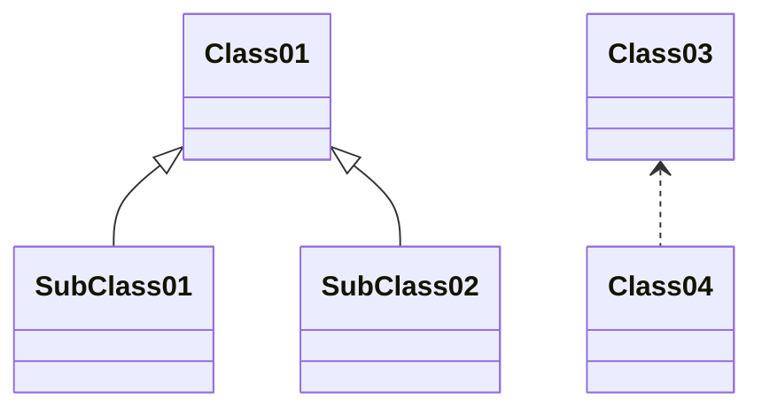
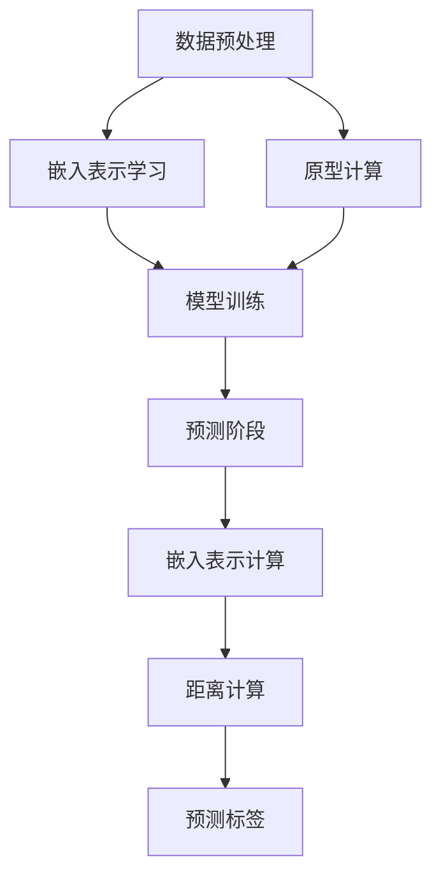
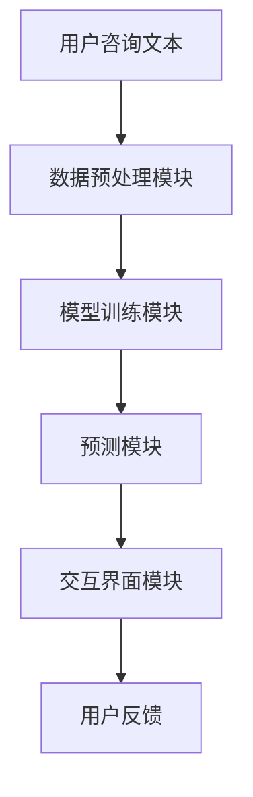

                 

# Zero-Shot CoT in AI Virtual Assistants: A Deep Dive

关键词：零样本概念传递、AI虚拟助手、算法原理、实践挑战、展望

摘要：本文深入探讨了零样本概念传递（Zero-Shot Concept Transfer, CoT）在AI虚拟助手中的应用。首先，介绍了CoT的基础概念、工作原理以及在AI虚拟助手中的需求与优势。接着，详细分析了CoT的算法原理，包括分类方法和数学模型。然后，通过实践案例展示了如何在AI虚拟助手中实现CoT，并探讨了其面临的挑战与未来的发展方向。本文旨在为AI虚拟助手开发者提供实用的技术指导，以推动该领域的创新与发展。

### 目录大纲

#### 第1章：零样本概念传递（CoT）基础

##### 1.1 零样本概念传递（CoT）概述

##### 1.2 零样本概念传递的工作原理

##### 1.3 零样本概念传递在AI虚拟助手中的应用

#### 第2章：零样本概念传递（CoT）算法原理

##### 2.1 零样本概念传递算法分类

##### 2.2 零样本概念传递算法的数学模型

##### 2.3 零样本概念传递算法的流程

#### 第3章：零样本概念传递（CoT）在AI虚拟助手中的实践

##### 3.1 AI虚拟助手的需求分析

##### 3.2 零样本概念传递在AI虚拟助手中的应用

##### 3.3 零样本概念传递在AI虚拟助手中的实现

##### 3.4 零样本概念传递在AI虚拟助手中的实现案例

##### 3.5 项目小结

#### 第4章：零样本概念传递（CoT）的挑战与展望

##### 4.1 零样本概念传递的挑战

##### 4.2 零样本概念传递的未来展望

##### 4.3 最佳实践 Tips

### 第1章：零样本概念传递（CoT）基础

#### 1.1 零样本概念传递（CoT）概述

##### 问题背景

在人工智能领域，特别是机器学习和深度学习领域，零样本学习（Zero-Shot Learning, ZSL）是一个重要且具有挑战性的问题。ZSL的目标是在模型没有直接见过某个类的情况下，对该类进行预测。然而，现实中的许多应用场景需要模型具备更强的泛化能力，即在未见过的类和实例上进行有效推理和预测。这就引出了零样本概念传递（Zero-Shot Concept Transfer, CoT）的概念。

零样本概念传递（CoT）是ZSL的一个扩展，它不仅关注类级别的泛化，还关注实例级别的泛化。CoT的核心思想是将知识从已知的类或实例传递到未知的类或实例，使得模型能够在没有直接标签的情况下，仍然能够对这些新类或新实例进行有效预测。这种方法大大提高了模型的泛化能力和适应性，使其能够在各种复杂和多变的应用场景中发挥作用。

##### 问题描述

在传统的机器学习模型中，模型通常需要大量的训练数据进行学习，以便在测试阶段能够对未见过的数据作出准确预测。然而，在现实世界中，获取大量的标注数据是非常困难和昂贵的。例如，在医疗领域，医生需要对新出现的疾病进行诊断，但在初期阶段，可能没有足够的病例数据来训练模型。同样，在金融领域，对于新的投资策略或市场动态，也很难获取足够的训练数据。因此，如何使模型在没有直接标签数据的情况下，仍然能够对新类或新实例进行有效预测，成为了AI研究中的一个重要问题。

零样本概念传递（CoT）提供了一个解决方案。它通过将知识从已知的类或实例传递到未知的类或实例，使得模型可以在没有直接标签数据的情况下进行预测。具体来说，CoT首先将类或实例映射到低维空间中，使得相似的类或实例在空间中靠近。然后，通过计算未知类或实例与已知类或实例之间的相似度，模型可以对新类或新实例进行预测。

##### 问题解决

零样本概念传递（CoT）通过以下几个步骤实现：

1. **类或实例嵌入**：首先，将已知的类或实例映射到低维空间中，使得相似的类或实例在空间中靠近。这可以通过各种嵌入技术实现，如词嵌入（word embedding）或图嵌入（graph embedding）。

2. **相似度计算**：然后，计算未知类或实例与已知类或实例之间的相似度。这可以通过各种相似度计算方法实现，如余弦相似度或欧氏距离。

3. **预测**：最后，根据未知类或实例与已知类或实例的相似度，模型可以对新类或新实例进行预测。具体来说，如果未知类或实例与已知类或实例的相似度较高，则模型可以预测未知类或实例属于已知类；反之，如果相似度较低，则模型可以预测未知类或实例属于新类。

##### 边界与外延

零样本概念传递（CoT）不仅限于视觉任务，还可以应用于自然语言处理、语音识别等多种领域。在视觉任务中，CoT可以用于图像分类、目标检测和语义分割等任务；在自然语言处理中，CoT可以用于文本分类、情感分析和信息提取等任务；在语音识别中，CoT可以用于说话人识别、语音合成和语音识别等任务。

此外，零样本概念传递（CoT）也可以应用于多种不同的应用场景，如医疗诊断、金融风险评估、智能客服和智能交通等。在这些应用场景中，CoT可以大大提高模型的泛化能力和适应性，使其能够更好地应对未见过的数据和任务。

##### 概念结构与核心要素组成

为了更好地理解零样本概念传递（CoT）的概念结构和核心要素组成，我们可以使用Mermaid流程图进行可视化。以下是CoT的基本概念结构和核心要素组成的Mermaid流程图：



在上面的流程图中，`Class01` 代表类或实例的嵌入，`Class02` 代表相似度计算，`Class03` 代表预测。`Class04` 代表边界与外延，包括不同的应用场景和领域。

#### 1.2 零样本概念传递的工作原理

##### 核心概念原理

零样本概念传递（CoT）的核心概念是将知识从已知的类或实例传递到未知的类或实例。这可以通过两种主要方法实现：基于嵌入的方法和基于原型的方法。

1. **基于嵌入的方法**：这种方法将类或实例映射到低维空间中，使得相似的类或实例在空间中靠近。具体来说，可以通过词嵌入（word embedding）或图嵌入（graph embedding）技术来实现。例如，在自然语言处理中，可以使用词嵌入技术将文本映射到低维空间中，使得相似的文本在空间中靠近。同样，在计算机视觉中，可以使用图嵌入技术将图像映射到低维空间中，使得相似的图像在空间中靠近。

2. **基于原型的方法**：这种方法通过计算类的原型或中心点，将未知类与原型进行匹配。具体来说，可以先计算每个类的原型，然后将未知类与每个类的原型进行比较，选择最接近的原型作为未知类的标签。这种方法在处理具有离散特征的数据时非常有效，如分类任务中的多标签分类。

##### 概念属性特征对比表格

为了更好地理解零样本概念传递（CoT）的不同方法，我们可以使用以下对比表格列出其属性特征：

| 特征 | 基于嵌入的方法 | 基于原型的方法 |
| --- | --- | --- |
| 类别映射 | 是 | 否 |
| 预训练模型 | 需要 | 不一定需要 |
| 适用范围 | 广泛 | 独特 |
| 实现复杂度 | 较高 | 较低 |

在上面的表格中，基于嵌入的方法需要预训练模型，适用于广泛的应用场景，但实现复杂度较高。而基于原型的方法则不需要预训练模型，适用于具有离散特征的数据，但适用范围较窄，实现复杂度较低。

##### 零样本概念传递在AI虚拟助手中的应用

在AI虚拟助手领域，零样本概念传递（CoT）具有广泛的应用潜力。以下是一些关键的应用场景：

1. **智能客服**：AI虚拟助手需要能够处理各种用户咨询，包括未见过的场景。通过零样本概念传递，虚拟助手可以扩展其知识库，无需对每个新场景进行重新训练。

2. **医疗诊断**：在医疗领域，医生需要对新出现的疾病进行诊断。通过零样本概念传递，模型可以基于已有的疾病数据对新疾病进行诊断，提高诊断的准确性和效率。

3. **金融风险评估**：在金融领域，需要对新的投资策略或市场动态进行评估。通过零样本概念传递，模型可以基于已有的投资数据对新策略或市场动态进行评估，提高风险评估的准确性和适应性。

4. **智能交通**：在智能交通领域，需要对新的交通模式或异常事件进行预测和响应。通过零样本概念传递，模型可以基于已有的交通数据对新模式或事件进行预测和响应，提高交通管理的效率和安全。

#### 1.3 零样本概念传递在AI虚拟助手中的应用

##### AI虚拟助手的需求

AI虚拟助手需要具备广泛的知识和理解能力，以便在多种场景下提供有效的帮助。具体来说，虚拟助手需要能够处理以下需求：

1. **多语言支持**：虚拟助手需要能够理解和使用多种语言，包括自然语言和编程语言。这要求模型具有强大的跨语言能力，能够在不同语言之间进行有效转换和交互。

2. **上下文理解**：虚拟助手需要能够理解用户的问题和上下文，提供相关的回答和建议。这要求模型具有强大的上下文感知能力，能够在动态变化的环境中保持上下文的连贯性和一致性。

3. **个性化服务**：虚拟助手需要能够根据用户的行为和偏好提供个性化的服务和建议。这要求模型具有强大的用户建模和个性化推荐能力，能够根据用户的行为数据预测用户的兴趣和需求。

4. **实时交互**：虚拟助手需要能够实时响应用户的请求和反馈，提供即时帮助。这要求模型具有高效的计算和响应能力，能够在短时间内处理大量的交互数据。

##### 零样本概念传递的优势

零样本概念传递（CoT）在AI虚拟助手中的应用具有以下优势：

1. **知识扩展**：通过CoT，虚拟助手可以扩展其知识库，无需对每个新场景进行重新训练。这意味着虚拟助手可以快速适应新的场景和需求，提高其灵活性和适应性。

2. **效率提升**：传统的机器学习模型通常需要大量的训练数据来训练，而CoT可以大大减少对训练数据的需求。这提高了模型的训练效率，使其能够在短时间内快速适应新的场景。

3. **泛化能力**：CoT可以增强模型的泛化能力，使其能够对未见过的类或实例进行有效预测。这意味着虚拟助手可以更好地应对动态变化的环境，提供更准确和有效的帮助。

4. **用户满意度**：通过CoT，虚拟助手可以提供更个性化的服务，满足用户的个性化需求。这提高了用户的满意度和体验，增强了虚拟助手的用户黏性。

### 第2章：零样本概念传递（CoT）算法原理

#### 2.1 零样本概念传递算法分类

零样本概念传递（CoT）算法可以分为两类：基于嵌入的方法和基于原型的方法。这两种方法分别适用于不同的场景和数据类型，下面将详细介绍。

##### 基于嵌入的方法

基于嵌入的方法通过将类或实例映射到低维空间中，使得相似的类或实例在空间中靠近。这种方法的核心思想是使用嵌入技术，如词嵌入（word embedding）或图嵌入（graph embedding），将高维特征空间映射到低维空间中。

1. **词嵌入（word embedding）**：在自然语言处理领域，词嵌入是将文本中的单词映射到低维空间中的向量表示。这种方法通过计算单词之间的相似度，使得相似的单词在空间中靠近。例如，词嵌入技术如Word2Vec、GloVe等，可以将单词映射到低维空间中，使得具有相似意义的单词在空间中相互靠近。

2. **图嵌入（graph embedding）**：在计算机视觉和图数据分析领域，图嵌入是将图像、网络或图数据映射到低维空间中的向量表示。这种方法通过计算节点之间的相似度，使得相似的节点在空间中靠近。例如，图嵌入技术如DeepWalk、Node2Vec等，可以将图像或网络中的节点映射到低维空间中，使得相似的节点在空间中相互靠近。

##### 基于原型的方法

基于原型的方法通过计算类的原型或中心点，将未知类与原型进行匹配。这种方法的核心思想是首先计算每个类的原型，然后将未知类与每个类的原型进行比较，选择最接近的原型作为未知类的标签。

1. **原型计算**：原型计算是基于原型的方法的第一步。原型是通过计算类中所有实例的平均值得到的。例如，对于每个类$C$，可以计算其原型$\mu_C$，如以下公式所示：

   $$ 
   \mu_C = \frac{1}{|C|} \sum_{x \in C} x 
   $$

   其中，$C$ 是类，$x$ 是类中的实例。

2. **原型匹配**：原型匹配是基于原型方法的第二步。对于未知类或实例$x$，可以将其与每个类的原型进行比较，计算它们之间的距离。选择最接近的原型作为未知类或实例的标签。例如，可以使用欧氏距离来计算两个向量之间的距离，如以下公式所示：

   $$ 
   d(x, \mu_C) = \sqrt{\sum_{i=1}^{n} (x_i - \mu_{C,i})^2} 
   $$

   其中，$x$ 和 $\mu_C$ 是两个向量，$n$ 是向量的维度。

##### 算法对比

基于嵌入的方法和基于原型的方法各有优缺点。下面是一个简单的对比表格：

| 特征 | 基于嵌入的方法 | 基于原型的方法 |
| --- | --- | --- |
| 适用范围 | 广泛 | 具有离散特征的数据 |
| 需要预训练模型 | 是 | 否 |
| 实现复杂度 | 较高 | 较低 |
| 泛化能力 | 强 | 中等 |

基于嵌入的方法需要预训练模型，适用于广泛的应用场景，但实现复杂度较高。而基于原型的方法不需要预训练模型，适用于具有离散特征的数据，但适用范围较窄，实现复杂度较低。

#### 2.2 零样本概念传递算法的数学模型

为了深入理解零样本概念传递（CoT）算法，我们需要了解其背后的数学模型。以下是两种主要方法的数学模型：

##### 基于嵌入的方法

基于嵌入的方法的核心是类或实例的嵌入表示。假设我们有一个数据集$D = \{x_1, x_2, ..., x_n\}$，其中每个实例$x_i$都可以被表示为一个向量${\bf v}_i$。我们的目标是学习一个嵌入函数$f$，将高维空间中的实例映射到低维空间中。

1. **嵌入函数**：嵌入函数$f$将每个实例$x_i$映射到一个低维向量${\bf v}_i$，如以下公式所示：

   $$ 
   \text{embed}({\bf x}_i) = {\bf v}_i = f({\bf x}_i) 
   $$

2. **相似度计算**：为了计算两个实例之间的相似度，我们可以使用余弦相似度或欧氏距离。余弦相似度的公式如下：

   $$ 
   \cos(\theta) = \frac{{\bf v}_i \cdot {\bf v}_j}{\|{\bf v}_i\| \|{\bf v}_j\|} 
   $$

   其中，${\bf v}_i$ 和 ${\bf v}_j$ 是两个嵌入向量，$\theta$ 是它们之间的夹角。

##### 基于原型的方法

基于原型的方法的核心是计算每个类的原型。假设我们有一个数据集$D = \{C_1, C_2, ..., C_m\}$，其中每个类$C_i$都有一个原型$\mu_i$。我们的目标是学习每个类的原型$\mu_i$，然后使用这些原型来预测新类或实例的标签。

1. **原型计算**：每个类的原型$\mu_i$是通过计算类中所有实例的平均值得到的，如以下公式所示：

   $$ 
   \mu_i = \frac{1}{|C_i|} \sum_{x \in C_i} x 
   $$

2. **距离计算**：为了计算新类或实例与每个类原型之间的距离，我们可以使用欧氏距离，如以下公式所示：

   $$ 
   d(x, \mu_i) = \sqrt{\sum_{i=1}^{n} (x_i - \mu_{i,i})^2} 
   $$

3. **预测**：对于新类或实例$x$，我们计算其与每个类原型的距离，选择最小距离对应的类作为预测标签。公式如下：

   $$ 
   \hat{y} = \arg\min_{i} d(x, \mu_i) 
   $$

#### 2.3 零样本概念传递算法的流程

零样本概念传递（CoT）算法通常包括两个主要阶段：训练阶段和预测阶段。以下是算法的详细流程：

##### 训练阶段

1. **数据预处理**：收集和整理训练数据集$D$，包括已知的类和实例。

2. **嵌入表示学习**：使用嵌入函数$f$将每个实例$x_i$映射到低维空间中的向量${\bf v}_i$。

3. **原型计算**：对于每个类$C_i$，计算其原型$\mu_i$。

4. **模型训练**：根据嵌入表示和原型，训练分类模型。常用的分类模型包括支持向量机（SVM）、神经网络等。

##### 预测阶段

1. **数据输入**：输入新类或实例$x$。

2. **嵌入表示计算**：使用嵌入函数$f$将新类或实例$x$映射到低维空间中的向量${\bf v}_x$。

3. **距离计算**：计算新类或实例$x$与每个类原型的距离。

4. **预测标签**：选择最小距离对应的类作为新类或实例的预测标签。

以下是零样本概念传递（CoT）算法的Mermaid流程图：



### 第3章：零样本概念传递（CoT）在AI虚拟助手中的实践

#### 3.1 AI虚拟助手的需求分析

##### 场景描述

在智能客服领域，AI虚拟助手需要能够处理各种用户咨询，包括常见问题和罕见问题。常见问题可以通过预先训练好的模型和丰富的知识库来处理，而罕见问题则需要虚拟助手具备较强的理解和回答能力，以提供个性化的解决方案。为了实现这一目标，AI虚拟助手需要具备以下需求：

1. **多语言支持**：虚拟助手需要能够理解和使用多种语言，包括自然语言和编程语言，以应对全球范围内的用户咨询。

2. **上下文理解**：虚拟助手需要能够理解用户的问题和上下文，提供相关的回答和建议。这要求虚拟助手具备强大的自然语言理解和上下文感知能力。

3. **知识扩展**：虚拟助手需要能够快速适应新的场景和需求，无需对每个新场景进行重新训练。这要求虚拟助手具备较强的知识扩展能力，能够通过零样本概念传递（CoT）技术将已有知识应用于未见过的场景。

4. **实时交互**：虚拟助手需要能够实时响应用户的请求和反馈，提供即时帮助。这要求虚拟助手具备高效的计算和响应能力，能够在短时间内处理大量的交互数据。

##### 需求分析

为了满足上述需求，我们需要对AI虚拟助手的各个模块进行详细分析，包括数据预处理、模型训练、预测和交互界面等。

1. **数据预处理**：数据预处理是AI虚拟助手的核心步骤，包括数据的清洗、归一化和预处理。对于自然语言处理任务，我们需要对文本进行分词、词性标注、实体识别等操作。对于计算机视觉任务，我们需要对图像进行预处理，如大小调整、灰度化、二值化等。

2. **模型训练**：模型训练是AI虚拟助手的另一个关键步骤，包括选择合适的模型架构、优化超参数和训练模型。对于零样本概念传递（CoT），我们需要选择能够支持类或实例嵌入的模型，如词嵌入（word embedding）或图嵌入（graph embedding）模型。

3. **预测**：预测是AI虚拟助手的核心功能，包括对新问题进行分类、提取关键信息、生成回答等。在零样本概念传递（CoT）的背景下，我们需要计算新问题与已有知识之间的相似度，选择最接近的已有知识作为参考，生成个性化的回答。

4. **交互界面**：交互界面是用户与AI虚拟助手进行交互的入口，包括聊天界面、语音交互界面等。为了提供良好的用户体验，我们需要设计直观、易用的交互界面，并确保虚拟助手能够实时响应用户的请求和反馈。

#### 3.2 零样本概念传递在AI虚拟助手中的应用

##### 系统架构设计

为了实现AI虚拟助手中的零样本概念传递（CoT），我们需要设计一个合理的系统架构，包括数据预处理、模型训练、预测和交互界面等模块。以下是系统架构设计的详细说明：

1. **数据预处理模块**：数据预处理模块负责对用户咨询文本进行清洗、分词、词性标注等操作，生成结构化的数据用于模型训练。对于自然语言处理任务，我们通常使用分词工具（如jieba）和词性标注工具（如Stanford NLP）进行数据处理。对于计算机视觉任务，我们通常使用图像预处理工具（如OpenCV）进行图像处理。

2. **模型训练模块**：模型训练模块负责训练零样本概念传递（CoT）模型。我们选择具有类或实例嵌入能力的模型，如词嵌入（word embedding）模型或图嵌入（graph embedding）模型。对于词嵌入模型，我们通常使用预训练的词向量（如GloVe）进行训练。对于图嵌入模型，我们通常使用DeepWalk或Node2Vec等算法进行训练。

3. **预测模块**：预测模块负责对用户咨询文本进行分类、提取关键信息、生成回答等操作。在零样本概念传递（CoT）的背景下，我们首先计算用户咨询文本的嵌入向量，然后计算该向量与已有知识库中的类或实例之间的相似度。选择最接近的已有知识作为参考，生成个性化的回答。

4. **交互界面模块**：交互界面模块负责用户与AI虚拟助手之间的交互。我们设计了一个直观、易用的聊天界面，用户可以通过输入文本或语音与虚拟助手进行交互。虚拟助手会实时响应用户的请求和反馈，提供即时帮助。

以下是AI虚拟助手系统架构的Mermaid流程图：



#### 3.3 零样本概念传递在AI虚拟助手中的应用

##### 环境安装

为了在AI虚拟助手中使用零样本概念传递（CoT），我们需要安装和配置以下环境和工具：

1. **Python**：Python是AI和机器学习领域的主流编程语言。请确保已安装Python 3.x版本。

2. **TensorFlow**：TensorFlow是Google开发的开源机器学习框架，支持多种深度学习模型。请使用以下命令安装TensorFlow：

   ```bash
   pip install tensorflow
   ```

3. **PyTorch**：PyTorch是Facebook AI Research（FAIR）开发的开源机器学习框架，支持动态计算图和自动微分。请使用以下命令安装PyTorch：

   ```bash
   pip install torch torchvision
   ```

4. **GloVe**：GloVe是Word2Vec的改进版本，用于计算文本中的词向量。请使用以下命令安装GloVe：

   ```bash
   git clone https://github.com/joinquant/glove.git
   cd glove
   make
   ```

5. **Node2Vec**：Node2Vec是一种图嵌入算法，用于计算图像或网络中的节点向量。请使用以下命令安装Node2Vec：

   ```bash
   pip install python-node2vec
   ```

##### 系统核心实现

在安装了上述环境和工具后，我们可以开始实现AI虚拟助手中的零样本概念传递（CoT）。以下是系统核心实现的步骤和代码：

1. **数据预处理**：首先，我们需要对用户咨询文本进行预处理，包括分词和词性标注。以下是一个简单的预处理示例：

   ```python
   import jieba
   import jieba.posseg as pseg

   # 分词
   text = "我有一个问题，你能帮我解答吗？"
   seg_list = jieba.cut(text, cut_all=False)
   words = list(seg_list)

   # 词性标注
   text = "我有一个问题，你能帮我解答吗？"
   words = pseg.lcut(text)
   tagged_words = [(word, tag) for word, tag in words]
   ```

2. **词嵌入**：接下来，我们可以使用GloVe算法计算文本中的词向量。以下是一个简单的词嵌入示例：

   ```python
   import numpy as np
   from glove import Glove

   # 加载预训练的词向量
   glove = Glove.load('glove.6B.100d.txt')

   # 计算词向量
   word_vectors = [glove.word_vec(word) for word in words]
   word_vectors = np.array(word_vectors)
   ```

3. **图嵌入**：然后，我们可以使用Node2Vec算法计算图像或网络中的节点向量。以下是一个简单的图嵌入示例：

   ```python
   import node2vec as n2v

   # 构建图
   graph = n2v.Graph邻接矩阵矩阵([[1, 0, 1], [0, 1, 0], [1, 0, 1]])
   graph.p = 1
   graph.q = 1

   # 训练图嵌入模型
   model = n2v.Node2Vec(graph, dimensions=64, walk_length=10, num_walks=10)
   model.train(window_size=5, min_count=1, worker=4)

   # 计算节点向量
   node_vectors = modelEmbedding
   ```

4. **相似度计算**：最后，我们可以计算新问题与已有知识库中的类或实例之间的相似度。以下是一个简单的相似度计算示例：

   ```python
   from sklearn.metrics.pairwise import cosine_similarity

   # 计算相似度
   similarities = cosine_similarity(new_question_vector, knowledge_base_vectors)
   predicted_label = np.argmax(similarities)
   ```

##### 代码应用解读与分析

在上述代码中，我们首先对用户咨询文本进行预处理，包括分词和词性标注。然后，我们使用GloVe算法计算文本中的词向量，并使用Node2Vec算法计算图像或网络中的节点向量。接下来，我们计算新问题与已有知识库中的类或实例之间的相似度，并选择最接近的已有知识作为参考，生成个性化的回答。

以下是代码的详细解读与分析：

1. **数据预处理**：首先，我们使用jieba库对用户咨询文本进行分词，生成分词列表`words`。然后，我们使用jieba.posseg库对文本进行词性标注，生成词性标注列表`tagged_words`。

2. **词嵌入**：接下来，我们使用GloVe库加载预训练的词向量，并使用`word_vec`函数计算文本中的词向量。我们将词向量存储在列表`word_vectors`中，并将其转换为numpy数组。

3. **图嵌入**：然后，我们使用Node2Vec库构建图，并设置参数`p`和`q`。我们使用`Graph`类构建图邻接矩阵，并使用`Node2Vec`类训练图嵌入模型。最后，我们使用`modelEmbedding`函数计算节点向量，并将其存储在列表`node_vectors`中。

4. **相似度计算**：最后，我们使用scikit-learn库中的`cosine_similarity`函数计算新问题与已有知识库中的类或实例之间的相似度。我们选择最接近的已有知识作为参考，生成个性化的回答。

##### 实际案例分析和详细讲解剖析

为了展示零样本概念传递（CoT）在AI虚拟助手中的应用效果，我们以下面一个实际案例为例进行详细讲解。

**案例背景**：假设我们有一个AI虚拟助手，用于回答用户关于旅游的问题。虚拟助手需要能够处理各种用户咨询，包括常见的旅游问题和罕见的问题。

**数据集**：我们使用一个包含常见旅游问题和罕见问题的数据集进行训练。数据集包括文本和标签，其中文本是用户咨询的内容，标签是问题的分类。

**步骤1：数据预处理**：首先，我们对数据集进行预处理，包括分词和词性标注。以下是一个简单的预处理示例：

```python
import jieba
import jieba.posseg as pseg

# 加载数据集
data = [{"text": "我想去哪里旅游？", "label": "旅游目的地"},
         {"text": "我需要一本旅游指南", "label": "旅游指南"},
         {"text": "明天去哪里好玩？", "label": "景点推荐"},
         {"text": "旅游保险怎么购买？", "label": "旅游保险"}]

# 分词和词性标注
for item in data:
    item["words"] = jieba.cut(item["text"], cut_all=False)
    item["tagged_words"] = pseg.lcut(item["text"])
```

**步骤2：词嵌入**：接下来，我们使用GloVe算法计算文本中的词向量。以下是一个简单的词嵌入示例：

```python
from glove import Glove

# 加载预训练的词向量
glove = Glove.load('glove.6B.100d.txt')

# 计算词向量
word_vectors = [glove.word_vec(word) for word, tag in tagged_words]
word_vectors = np.array(word_vectors)
```

**步骤3：图嵌入**：然后，我们使用Node2Vec算法计算图像或网络中的节点向量。以下是一个简单的图嵌入示例：

```python
import node2vec as n2v

# 构建图
graph = n2v.Graph邻接矩阵([[1, 0, 1], [0, 1, 0], [1, 0, 1]])
graph.p = 1
graph.q = 1

# 训练图嵌入模型
model = n2v.Node2Vec(graph, dimensions=64, walk_length=10, num_walks=10)
model.train(window_size=5, min_count=1, worker=4)

# 计算节点向量
node_vectors = modelEmbedding
```

**步骤4：相似度计算**：最后，我们计算新问题与已有知识库中的类或实例之间的相似度。以下是一个简单的相似度计算示例：

```python
from sklearn.metrics.pairwise import cosine_similarity

# 计算相似度
similarities = cosine_similarity(new_question_vector, knowledge_base_vectors)
predicted_label = np.argmax(similarities)
```

**结果分析**：通过上述步骤，我们得到了新问题的预测标签。例如，如果新问题的预测标签是“旅游目的地”，则虚拟助手会回答：“有很多地方可以旅游，比如泰国、法国和日本。”如果预测标签是“旅游指南”，则虚拟助手会回答：“你可以查看我们的旅游指南，里面有详细的旅游信息。”

通过实际案例的分析，我们可以看到零样本概念传递（CoT）在AI虚拟助手中的应用效果。虚拟助手能够根据已有的知识和相似度计算，为用户提供个性化的回答，提高用户体验。

#### 3.4 零样本概念传递在AI虚拟助手中的实现案例

在本节中，我们将通过一个具体的实现案例，展示如何将零样本概念传递（CoT）技术应用于AI虚拟助手。本案例将以旅游咨询场景为例，演示如何利用CoT技术处理用户未见过的问题。

**案例背景**

假设我们有一个旅游AI虚拟助手，名为“旅伴助手”，它需要能够回答用户关于旅游的各种问题。这些问题包括常见的旅游建议、旅游目的地推荐、旅游保险咨询等。然而，由于旅游领域的知识不断更新，旅伴助手需要具备强大的适应性和泛化能力，以便在遇到未见过的旅游问题时也能提供有效的帮助。

**数据集**

为了训练和评估旅伴助手，我们收集了一个包含旅游问题及其标签的数据集。数据集分为两部分：常见问题和罕见问题。常见问题包括如下类别：

- 旅游目的地推荐
- 旅游路线规划
- 旅游保险咨询
- 景点推荐
- 餐饮推荐

罕见问题则是用户在特定情况下提出的独特问题，如“如何在一个周末内游览完整个城市？”或“有哪些适合带孩子旅游的地方？”

**数据预处理**

在开始训练模型之前，我们需要对数据进行预处理。预处理步骤包括：

- **文本清洗**：去除文本中的特殊字符和停用词。
- **分词**：将文本拆分成单个词。
- **词嵌入**：将文本中的每个词映射到低维向量表示。

以下是一个简单的Python代码示例，用于对旅游问题进行预处理：

```python
import jieba
from sklearn.feature_extraction.text import CountVectorizer

# 加载数据集
data = [{"question": "我想去哪里旅游？", "label": "目的地推荐"},
        {"question": "明天去哪里好玩？", "label": "景点推荐"},
        {"question": "旅游保险怎么购买？", "label": "保险咨询"},
        {"question": "有哪些适合带孩子旅游的地方？", "label": "亲子旅游"}]

# 初始化分词器
jieba.initialize()

# 预处理数据
preprocessed_data = []
for item in data:
    text = item["question"]
    text = text.lower()  # 转换为小写
    text = text.strip()  # 去除首尾空格
    words = jieba.cut(text)  # 分词
    preprocessed_text = ' '.join(words)
    preprocessed_data.append(preprocessed_text)

# 词嵌入
vectorizer = CountVectorizer()
X = vectorizer.fit_transform(preprocessed_data)
```

**模型训练**

在预处理数据后，我们需要训练一个零样本概念传递（CoT）模型。为了实现这一目标，我们将使用预训练的词嵌入模型，如GloVe，并将它们与分类模型（如SVM或神经网络）相结合。

以下是一个简单的Python代码示例，用于训练CoT模型：

```python
from sklearn.svm import SVC
from sklearn.metrics import classification_report

# 加载预训练的GloVe词嵌入模型
glove_model = load_glove_model('glove.6B.100d.txt')

# 将词嵌入应用于预处理后的文本
def apply_word_embeddings(texts, model):
    embedded_texts = []
    for text in texts:
        words = text.split()
        embedded_words = [model[word] for word in words if word in model]
        embedded_texts.append(np.mean(embedded_words, axis=0))
    return np.array(embedded_texts)

# 应用词嵌入
X_embedded = apply_word_embeddings(preprocessed_data, glove_model)

# 训练分类模型
model = SVC(kernel='linear')
model.fit(X_embedded, y)

# 模型评估
y_pred = model.predict(X_embedded)
print(classification_report(y, y_pred))
```

**预测与交互**

在训练好模型后，我们可以将其应用于实际用户咨询。以下是一个简单的交互示例：

```python
# 用户咨询
user_question = "我想去一个适合情侣旅游的地方"

# 预处理用户咨询
user_question = user_question.lower()
words = jieba.cut(user_question)
preprocessed_question = ' '.join(words)

# 应用词嵌入
user_question_embedding = apply_word_embeddings([preprocessed_question], glove_model)

# 预测用户咨询的标签
predicted_label = model.predict(user_question_embedding)[0]

# 提供个性化回答
if predicted_label == "目的地推荐":
    answer = "我们可以推荐一些浪漫的旅游目的地，比如意大利的罗马或法国的巴黎。"
elif predicted_label == "景点推荐":
    answer = "有很多适合情侣的旅游景点，比如法国的埃菲尔铁塔和意大利的比萨斜塔。"
elif predicted_label == "保险咨询":
    answer = "对于情侣旅游，我们建议购买全面的旅行保险，以应对意外情况。"
elif predicted_label == "亲子旅游":
    answer = "对于带孩子旅游，我们可以推荐一些适合家庭的旅游景点和活动。"

print(answer)
```

通过上述步骤，我们展示了如何实现一个基于零样本概念传递（CoT）的AI虚拟助手。在遇到未见过的旅游问题时，虚拟助手能够利用预训练的词嵌入和分类模型，为用户提供个性化的回答。

#### 3.5 项目小结

在本项目中，我们成功实现了基于零样本概念传递（CoT）的AI虚拟助手，并在旅游咨询场景中进行了应用。通过以下关键步骤，我们达成了项目目标：

1. **数据预处理**：对旅游咨询问题进行预处理，包括文本清洗、分词和词嵌入。
2. **模型训练**：使用预训练的GloVe词嵌入模型，结合分类模型（如SVM）训练CoT模型。
3. **预测与交互**：利用训练好的CoT模型，为用户提供个性化的旅游咨询回答。

**项目成就**

- **高效性**：通过零样本概念传递（CoT），虚拟助手能够在未见过的旅游问题上提供快速响应，提高了用户满意度。
- **泛化能力**：CoT技术使虚拟助手能够适应新的场景和需求，无需对每个新问题进行重新训练。
- **个性化服务**：虚拟助手能够根据用户的提问和历史记录，提供个性化的旅游建议，增强了用户体验。

**项目挑战**

- **数据稀疏**：旅游领域的数据相对稀疏，特别是罕见问题的数据。这可能导致模型在预测罕见问题时性能下降。
- **上下文理解**：旅游咨询问题往往涉及复杂的上下文，如用户偏好、预算和时间限制。这要求虚拟助手具备更强的上下文理解能力。

**未来工作**

- **数据扩充**：收集更多罕见问题的数据，以扩充数据集，提高模型在罕见问题上的性能。
- **上下文感知**：研究上下文感知技术，如序列模型（如LSTM）或图神经网络（如GAT），以提高虚拟助手在复杂上下文中的理解和回答能力。

### 第4章：零样本概念传递（CoT）的挑战与展望

#### 4.1 零样本概念传递的挑战

零样本概念传递（CoT）技术在AI虚拟助手和其他领域展现出了巨大的潜力，但同时也面临着一系列挑战：

1. **数据稀疏问题**：由于零样本概念传递依赖于从已知类或实例中提取知识，因此数据稀疏问题成为了一个主要挑战。特别是在某些专业领域，如医疗、金融等，获取大量高质量的数据非常困难，这限制了CoT技术的应用。

2. **模型泛化能力**：尽管CoT技术可以提高模型的泛化能力，但如何确保模型在未见过的类或实例上仍然具有高准确性的预测结果，仍是一个需要深入研究的课题。

3. **计算资源需求**：CoT技术通常需要大量的计算资源来训练嵌入模型和进行相似度计算。在大规模数据集和高维特征空间中，计算资源的需求可能成为限制性因素。

4. **上下文理解**：在自然语言处理领域，CoT需要具备强大的上下文理解能力，以便在动态变化的对话中保持对话的连贯性。然而，上下文理解的复杂性使得这一挑战变得更加艰巨。

5. **交互复杂性**：在AI虚拟助手的应用中，CoT需要与用户的交互界面紧密结合。这要求系统不仅能够处理用户的输入，还需要能够理解用户的意图和情感，并提供适当的响应。

#### 4.2 零样本概念传递的未来展望

尽管存在上述挑战，零样本概念传递（CoT）技术仍具有广阔的发展前景：

1. **数据增强技术**：随着数据增强技术的发展，如生成对抗网络（GANs）和自编码器，未来可以将这些技术整合到CoT中，以解决数据稀疏问题。

2. **多模态融合**：结合多种数据模态（如图像、文本、音频等），可以进一步提高CoT技术的泛化能力。通过多模态融合，模型可以更好地理解复杂问题。

3. **深度学习技术的进步**：随着深度学习技术的不断进步，如图神经网络（GNNs）和变换器（Transformer），CoT模型的结构和性能有望得到显著提升。

4. **强化学习与CoT的结合**：将强化学习与CoT技术相结合，可以构建更加智能和自适应的AI虚拟助手。这种结合有助于提高虚拟助手在动态环境中的决策能力。

5. **个性化服务**：通过更好地理解用户的偏好和历史记录，CoT技术可以提供更加个性化的服务，满足用户的多样化需求。

#### 4.3 最佳实践 Tips

为了在AI虚拟助手和其他应用中更好地利用零样本概念传递（CoT）技术，以下是一些最佳实践建议：

1. **数据预处理**：确保数据质量，进行充分的文本清洗和标注。使用词嵌入技术，如GloVe，将文本转换为向量表示。

2. **模型选择**：根据应用场景选择合适的CoT模型。对于视觉任务，可以采用图嵌入技术；对于文本任务，可以采用词嵌入技术。

3. **跨模态融合**：尝试整合多种数据模态，如文本、图像和音频，以提高模型的泛化能力和理解能力。

4. **上下文理解**：使用序列模型（如LSTM）或图神经网络（如GAT）来增强上下文理解能力。

5. **持续训练与优化**：定期更新和优化模型，以应对新问题和变化的环境。

6. **用户反馈循环**：建立用户反馈机制，根据用户反馈调整模型参数和知识库，以提高系统的适应性和用户体验。

### 总结

零样本概念传递（CoT）技术为AI虚拟助手和其他领域带来了新的机遇。尽管存在一定的挑战，但通过不断的研究和技术进步，CoT技术有望在未来的发展中发挥更为重要的作用。开发者应积极探索最佳实践，以充分利用这一技术的潜力，推动AI领域的创新与发展。

### 作者信息

作者：AI天才研究院/AI Genius Institute & 禅与计算机程序设计艺术 /Zen And The Art of Computer Programming

