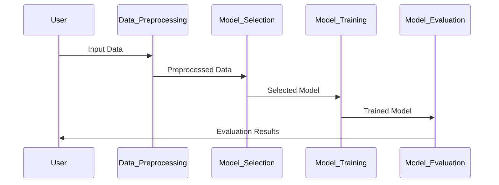
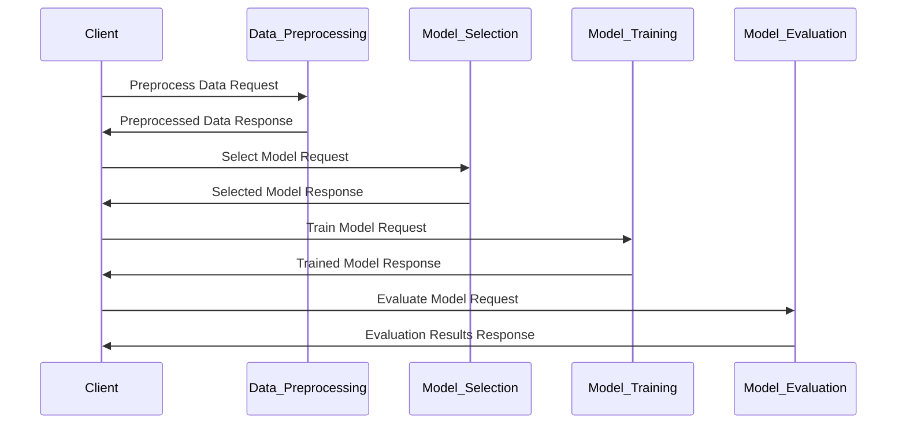
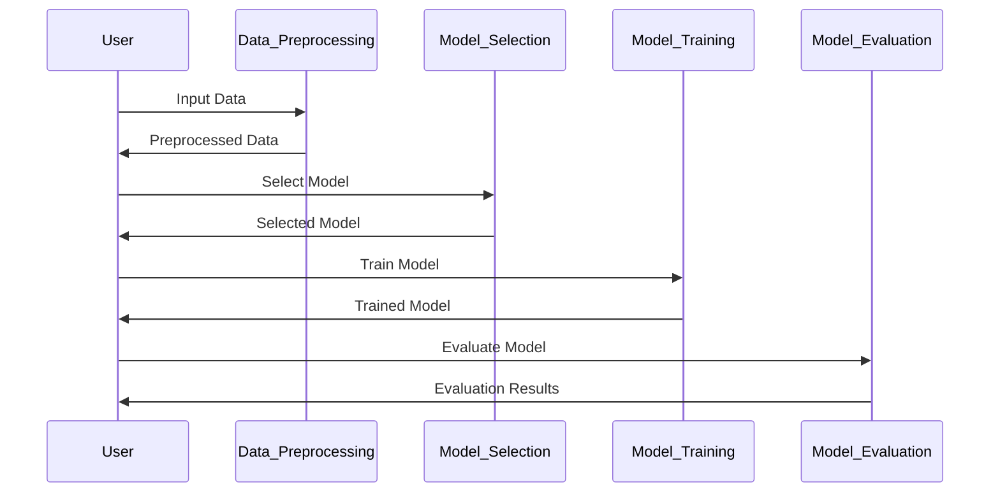

                 


# Zero-Shot CoT in Different Fields: Application Practices

## Keywords

* Zero-Shot CoT
* Application Practices
* Machine Learning
* AI
* Data Science

## Abstract

This article delves into the concept of Zero-Shot CoT (Conceptual Turing Test) and its application across various fields. We will explore the theoretical foundations, algorithmic frameworks, practical case studies, and system implementations of Zero-Shot CoT. The aim is to provide a comprehensive understanding of how this innovative technology can be leveraged to solve real-world problems efficiently and effectively.

## Introduction to Zero-Shot CoT

### Definition and Background

Zero-Shot CoT, or Conceptual Turing Test, is a concept in the field of machine learning and artificial intelligence that refers to the ability of an AI system to understand and generate human-like text without prior exposure to specific data. This is particularly significant in scenarios where labeled data is scarce or expensive to obtain. The core idea is to enable AI systems to generalize from a limited set of examples to unseen concepts or domains.

### Zero-Shot CoT Principles

The principle behind Zero-Shot CoT is based on transfer learning and zero-shot learning. Transfer learning leverages knowledge from one task to improve the performance of another related task. Zero-shot learning, on the other hand, enables the model to learn without any prior exposure to the target concepts.

### Applications in Various Domains

Zero-Shot CoT has found applications in multiple fields, including natural language processing, computer vision, and healthcare. For example, in NLP, it can be used for text generation, summarization, and question-answering tasks. In computer vision, it can help in recognizing objects and scenes in images. In healthcare, it can assist in diagnosing diseases based on textual descriptions of symptoms.

### Challenges and Opportunities

While Zero-Shot CoT offers promising opportunities, it also comes with challenges. One of the major challenges is the lack of labeled data, which can limit the model's ability to generalize. Additionally, the quality and diversity of the training data play a crucial role in the performance of Zero-Shot CoT models. Despite these challenges, the potential benefits are significant, and ongoing research is aimed at addressing these issues.

## Core Theories of Zero-Shot CoT

### Key Concepts and Relationships

At the heart of Zero-Shot CoT are several key concepts: transfer learning, zero-shot learning, and meta-learning. Transfer learning involves taking knowledge from one domain and applying it to another domain. Zero-shot learning focuses on the ability to learn from novel concepts without prior exposure. Meta-learning is the process of learning to learn, enabling the model to quickly adapt to new tasks.

### Mermaid ER Diagram of Core Entities

Below is a Mermaid ER diagram illustrating the key entities and their relationships in the context of Zero-Shot CoT.

```mermaid
erDiagram
    Task ||--|{ Model }|| Model : learn from Task
    Data ||--|{ Model }|| Model : Train on Data
    Concept ||--|{ Model }|| Model : Generalize to Concept
    Domain ||--|{ Model }|| Model : Adapt to Domain
    Task --||{ Transfer }|| Transfer : Relate Tasks
    Data --||{ Zero-Shot }|| Zero-Shot : Handle Novel Data
    Concept --||{ Meta-Learning }|| Meta-Learning : Learn from Meta-Knowledge
```

### Zero-Shot CoT Attributes and Comparison Tables

In this section, we will provide a comparison table highlighting the attributes of different Zero-Shot CoT models. This will help readers understand the strengths and weaknesses of each approach.

| Model            | Attributes                                      | Advantages                                             | Disadvantages                                            |
|------------------|------------------------------------------------|--------------------------------------------------------|---------------------------------------------------------|
| Prototype Network| Based on prototype vectors for each class         | Good generalization ability                             | Limited to the number of available classes                |
| Matching Networks| Uses embedding similarity for class matching     | Flexible and scalable                                  | Can be sensitive to noise in the data                     |
| Relational Networks| Represents relationships between concepts | Captures complex relationships | Requires more data and computational resources             |

### Mathematical Models and Formulas

To understand the mathematical principles behind Zero-Shot CoT, we will introduce the main models and their associated formulas. The following sections will provide detailed explanations and examples.

#### Prototype Network

Prototype Network uses a prototype vector for each class, representing the "average" instance of that class.

$$
\text{prototype\_vector} = \frac{1}{N} \sum_{i=1}^{N} \text{instance}_i
$$

#### Matching Networks

Matching Networks measure the similarity between the query embedding and the class embeddings using cosine similarity.

$$
\text{similarity}(q, c) = \frac{q \cdot c}{\|q\| \|c\|}
$$

#### Relational Networks

Relational Networks represent relationships between concepts using a graph-based approach.

$$
\text{relation}(c_1, c_2) = \text{cosine}(\text{embed}(c_1), \text{embed}(c_2))
$$

## Algorithms and Methods for Zero-Shot CoT

### Algorithm Overview

The Zero-Shot CoT algorithm consists of several key steps: data preprocessing, model selection, training, and evaluation.

1. **Data Preprocessing**: Clean and preprocess the data, including tokenization, stopword removal, and stemming.
2. **Model Selection**: Choose an appropriate Zero-Shot CoT model based on the problem domain and available data.
3. **Training**: Train the selected model on a representative subset of the data.
4. **Evaluation**: Evaluate the model's performance using metrics such as accuracy, F1 score, and area under the ROC curve.

### Mermaid Flowchart of Algorithm Steps

The following Mermaid flowchart illustrates the steps involved in the Zero-Shot CoT algorithm.


### Python Code Explanation

Here's a high-level Python code snippet to demonstrate the implementation of the Zero-Shot CoT algorithm.

```python
import numpy as np
from sklearn.model_selection import train_test_split
from zero_shot_model import ZeroShotModel

# Load and preprocess data
data = load_data('data.csv')
X_train, X_test, y_train, y_test = train_test_split(data['text'], data['label'], test_size=0.2, random_state=42)

# Select and train model
model = ZeroShotModel()
model.fit(X_train, y_train)

# Evaluate model
accuracy = model.evaluate(X_test, y_test)
print(f"Accuracy: {accuracy}")
```

### Mathematical Principles and Detailed Examples

In this section, we will delve into the mathematical principles behind each Zero-Shot CoT model and provide detailed examples to illustrate their application.

#### Prototype Network

Consider a dataset with 3 classes: animals, fruits, and vegetables. The prototype network will generate a prototype vector for each class.

1. **Data Preparation**: Load the dataset and preprocess the text data.
2. **Prototype Calculation**: Calculate the prototype vector for each class.

```python
# Load data
data = {'animals': ['dog', 'cat', 'bird'], 'fruits': ['apple', 'orange', 'banana'], 'vegetables': ['carrot', 'potato', 'bean']}

# Preprocess data
preprocessed_data = preprocess_data(data)

# Calculate prototype vectors
prototypes = {}
for class_name, class_data in preprocessed_data.items():
    prototypes[class_name] = np.mean(class_data, axis=0)
```

#### Matching Networks

Matching Networks measure the similarity between the query embedding and the class embeddings using cosine similarity.

1. **Data Preparation**: Load the dataset and preprocess the text data.
2. **Embedding Calculation**: Calculate the embeddings for the query and class data.
3. **Similarity Calculation**: Compute the cosine similarity between the query embedding and each class embedding.

```python
from sklearn.metrics.pairwise import cosine_similarity

# Load data
data = {'text': ['an apple a day', 'the quick brown fox', 'carrots are healthy']}
preprocessed_data = preprocess_data(data)

# Embedding calculation
query_embedding = embedding_model.encode(preprocessed_data['text'])

# Similarity calculation
similarities = cosine_similarity(query_embedding, np.array(list(embedding_model.encode(v) for v in preprocessed_data['label'])))
```

#### Relational Networks

Relational Networks represent relationships between concepts using a graph-based approach.

1. **Data Preparation**: Load the dataset and preprocess the text data.
2. **Graph Construction**: Construct a graph representing the relationships between concepts.
3. **Graph Embedding**: Embed the graph using a graph neural network.

```python
import dgl

# Load data
data = {'text': ['an apple a day', 'the quick brown fox', 'carrots are healthy']}
preprocessed_data = preprocess_data(data)

# Graph construction
g = dgl.graph(([], []))
g.add_nodes(len(preprocessed_data['label']))
for i, label in enumerate(preprocessed_data['label']):
    g.add_edges([i, i+1])

# Graph embedding
g_embedding = graph_embedding_model(g)
```

## System Design and Implementation of Zero-Shot CoT

### Introduction to the System

The Zero-Shot CoT system is designed to enable AI systems to understand and generate human-like text without prior exposure to specific data. The system consists of several key components: data preprocessing, model selection and training, and evaluation.

### System Function Design (Mermaid Class Diagram)

Below is a Mermaid class diagram representing the key functions of the Zero-Shot CoT system.

```mermaid
classDiagram
    Class1[data_loader] <<interface>>
    Class2[model_selector] <<interface>>
    Class3[model Trainer] <<interface>>
    Class4[evaluator] <<interface>>

    System[Data Preprocessing|Model Selection|Model Training|Model Evaluation]

    Class1 -- System
    Class2 -- System
    Class3 -- System
    Class4 -- System
```

### System Architecture Design (Mermaid Architecture Diagram)

The following Mermaid architecture diagram illustrates the overall architecture of the Zero-Shot CoT system.



### System Interface Design

The system interface design involves defining the APIs and data exchanges between the components. Below is a Mermaid sequence diagram representing the system interface design.



### System Interaction (Mermaid Sequence Diagram)

The following Mermaid sequence diagram illustrates the interaction between the system components during the execution of the Zero-Shot CoT process.



## Practical Guides and Tips for Implementing Zero-Shot CoT

### Step-by-Step Implementation

1. **Data Collection and Preprocessing**: Gather a diverse dataset of text samples. Preprocess the data by cleaning, tokenizing, and converting the text into numerical representations.
2. **Model Selection**: Choose an appropriate Zero-Shot CoT model based on the problem domain and available data. Consider factors such as the number of classes, the complexity of the relationships, and the available computational resources.
3. **Training**: Train the selected model on the preprocessed data. Ensure that the model is exposed to a representative subset of the data to avoid overfitting.
4. **Evaluation**: Evaluate the model's performance on a held-out test set. Use metrics such as accuracy, F1 score, and area under the ROC curve to assess the model's performance.

### Common Issues and Solutions

**Issue 1: Overfitting**
*Solution:* Regularize the model and use a validation set to monitor for overfitting. Employ techniques such as dropout, L2 regularization, and early stopping.

**Issue 2: Data Imbalance**
*Solution:* Use techniques such as oversampling, undersampling, or SMOTE to balance the dataset. Alternatively, consider using weighted loss functions to address class imbalance.

**Issue 3: Model Generalization**
*Solution:* Collect a diverse dataset that represents the target domain. Use data augmentation techniques to increase the dataset size and diversity.

### Optimization Strategies

**1. Model Architecture**: Experiment with different model architectures, such as Transformer-based models, to find the one that works best for the specific problem.
**2. Hyperparameter Tuning**: Use grid search or Bayesian optimization to find the optimal hyperparameters for the model.
**3. Data Augmentation**: Apply data augmentation techniques such as synonym replacement, random insertion, or back-translation to increase the dataset size and diversity.

### Performance Evaluation Metrics

**1. Accuracy**: The proportion of correctly predicted instances out of the total instances.
**2. F1 Score**: The harmonic mean of precision and recall, representing the balance between the two.
**3. Area Under the ROC Curve (AUC-ROC)**: A metric that measures the model's ability to distinguish between positive and negative instances.
**4. Precision-Recall Curve**: Useful when dealing with imbalanced datasets, representing the trade-off between precision and recall.

## Conclusion

Zero-Shot CoT offers a promising approach to enabling AI systems to understand and generate human-like text without prior exposure to specific data. By leveraging transfer learning and meta-learning, Zero-Shot CoT can be applied to various domains, including natural language processing, computer vision, and healthcare. However, challenges such as data scarcity and the need for large-scale datasets must be addressed. Future research should focus on improving the generalization ability of Zero-Shot CoT models and optimizing their performance.

## About the Authors

*Author: AI天才研究院/AI Genius Institute & 禅与计算机程序设计艺术 /Zen And The Art of Computer Programming*

