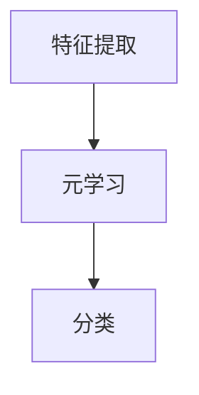
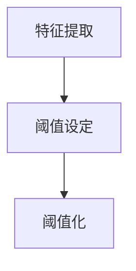
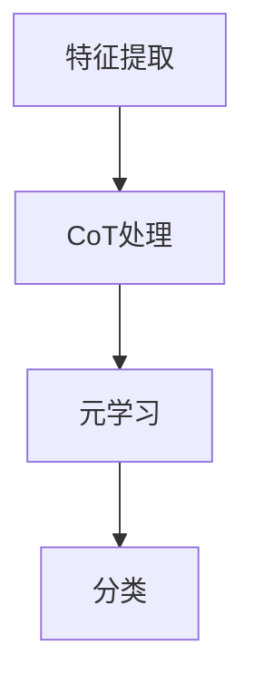
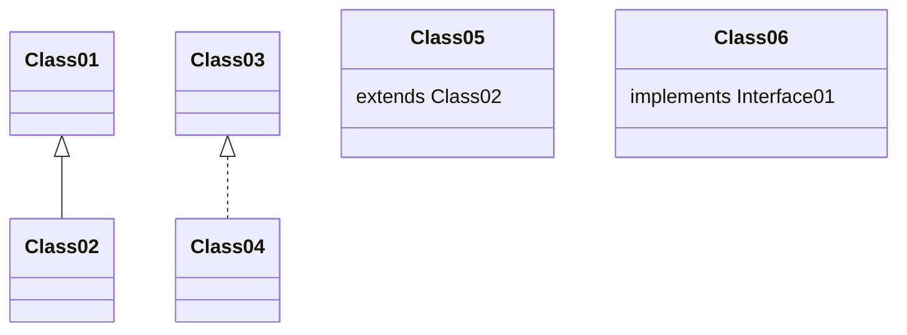
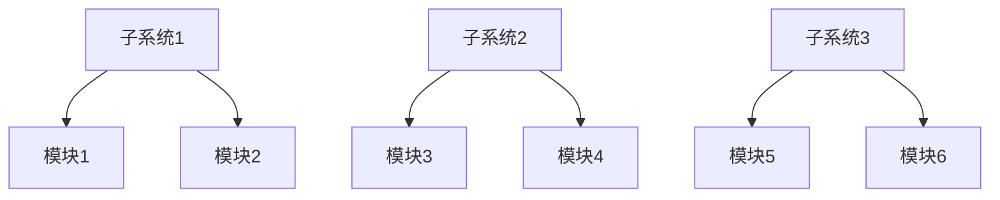
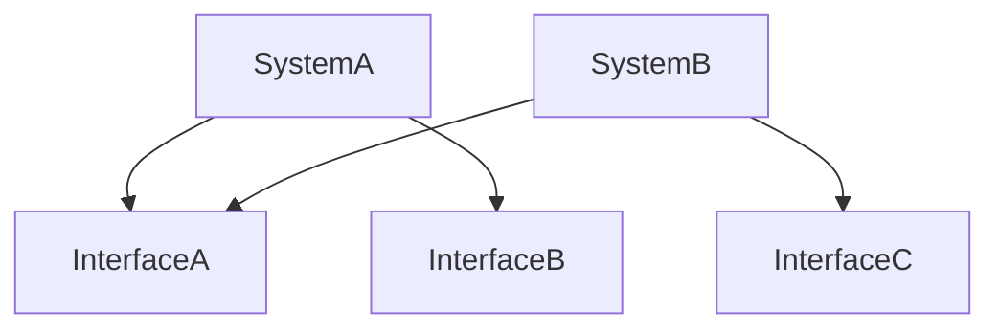
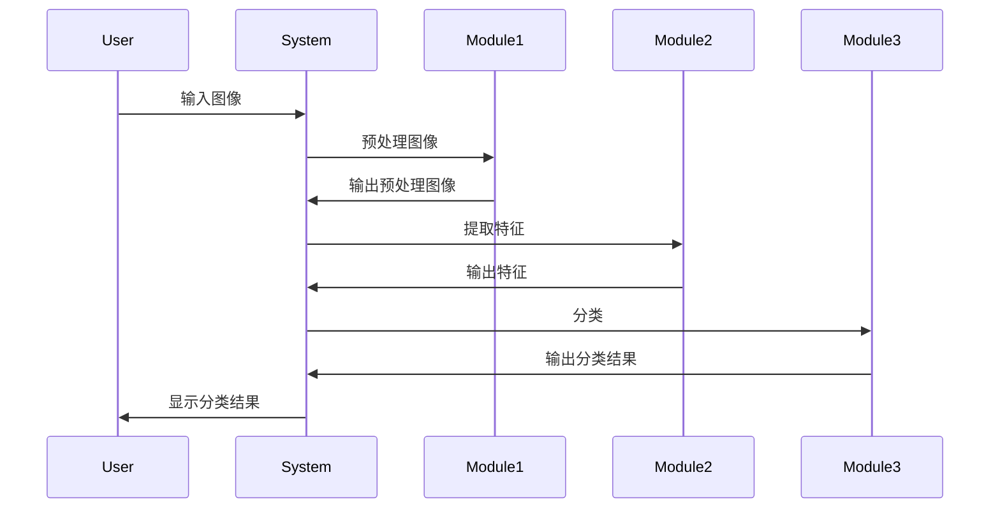

                 

# Zero-Shot CoT在复杂任务中的应用挑战与解决方案

## 关键词
- 零样本学习（Zero-Shot Learning）
- 内容提示（Content-Thresholding）
- 复杂任务
- 应用挑战
- 解决方案

## 摘要
本文深入探讨Zero-Shot CoT（零样本学习与内容提示的结合）在复杂任务中的应用挑战与解决方案。通过背景介绍、核心概念解析、算法原理讲解、系统分析与架构设计、项目实战等多个方面的详细分析，揭示了Zero-Shot CoT在复杂任务中的潜在应用价值及其面临的挑战，并提出了相应的解决方案。本文旨在为从事人工智能领域的科研人员和技术开发人员提供有价值的参考。

## 目录大纲设计过程

### 1. 理解书名与核心内容

首先，我们需要深刻理解书名《Zero-Shot CoT在复杂任务中的应用挑战与解决方案》。书名中的“Zero-Shot CoT”指的是将零样本学习（Zero-Shot Learning, ZSL）与内容提示（Content-Thresholding，CoT）相结合，主要研究在缺乏训练数据的情况下，如何有效地解决复杂任务。本书的核心内容将围绕这一主题，探讨其在实际应用中的挑战和解决方案。

### 2. 确定书籍结构

接下来，我们需要根据书籍的核心内容，确定一个合理的结构。通常，一个技术书籍可以分为以下几个部分：

- **背景介绍**：介绍问题的背景、定义、边界和核心概念。
- **核心概念与联系**：深入探讨零样本学习和内容提示的概念，以及它们在复杂任务中的应用。
- **算法原理讲解**：详细讲解相关的算法原理，包括数学模型和公式。
- **系统分析与架构设计**：介绍系统架构，包括领域模型、系统架构和接口设计。
- **项目实战**：通过实际项目来展示算法的应用，包括环境安装、核心实现和案例分析。
- **最佳实践与总结**：总结书中的内容，提供实践建议和注意事项。

### 3. 设计具体章节

根据上述结构，我们可以开始设计具体的章节。以下是一个可能的目录大纲：

### 第一部分：背景介绍

#### 第1章：问题的背景与定义

##### 1.1 零样本学习（ZSL）概述
##### 1.2 内容提示（CoT）技术
##### 1.3 零样本学习与内容提示的结合

#### 第2章：复杂任务的挑战

##### 2.1 复杂任务的特点
##### 2.2 零样本学习与内容提示在复杂任务中的挑战
##### 2.3 案例分析

### 第二部分：核心概念与联系

#### 第3章：零样本学习原理

##### 3.1 零样本学习的定义
##### 3.2 零样本学习的数学模型
##### 3.3 零样本学习的算法流程
##### 3.4 零样本学习的 Mermaid 流程图

#### 第4章：内容提示原理

##### 4.1 内容提示的定义
##### 4.2 内容提示的数学模型
##### 4.3 内容提示的算法流程
##### 4.4 内容提示的 Mermaid 流程图

#### 第5章：零样本学习与内容提示的结合

##### 5.1 结合的必要性
##### 5.2 结合的数学模型
##### 5.3 结合的算法流程
##### 5.4 结合的 Mermaid 流程图

### 第三部分：算法原理讲解

#### 第6章：算法原理深入探讨

##### 6.1 零样本学习的数学公式
##### 6.2 内容提示的数学公式
##### 6.3 结合算法的数学模型
##### 6.4 算法原理的Python代码实现

### 第四部分：系统分析与架构设计

#### 第7章：系统架构设计

##### 7.1 问题描述
##### 7.2 项目介绍
##### 7.3 领域模型设计
##### 7.4 系统架构设计
##### 7.5 系统接口设计
##### 7.6 系统交互设计

### 第五部分：项目实战

#### 第8章：项目实战

##### 8.1 环境安装
##### 8.2 系统核心实现
##### 8.3 代码应用解读
##### 8.4 实际案例分析
##### 8.5 项目小结

### 第六部分：最佳实践与总结

#### 第9章：最佳实践

##### 9.1 实践技巧
##### 9.2 注意事项
##### 9.3 拓展阅读

#### 第10章：总结与展望

##### 10.1 本书内容回顾
##### 10.2 技术发展趋势
##### 10.3 未来展望

以上是一个初步的目录大纲设计，具体内容可以根据实际需求进行调整。需要注意的是，每个章节都需要详细编写，以确保内容的完整性和连贯性。同时，为了满足字数限制，需要确保每个章节的内容简洁明了，避免冗余。

## 文章正文

### 第一部分：背景介绍

#### 第1章：问题的背景与定义

**1.1 零样本学习（ZSL）概述**

零样本学习（Zero-Shot Learning, ZSL）是一种在训练数据集中不存在目标类别的样本时，仍能够对目标类别进行有效识别和分类的技术。传统的机器学习算法依赖于大量的训练数据，这些数据需要涵盖所有可能的目标类别。然而，在实际应用中，我们往往无法获得所有类别的训练数据，特别是对于新出现的类别或特殊领域的数据。在这种情况下，ZSL提供了一种有效的方法来扩展机器学习算法的能力。

**1.2 内容提示（CoT）技术**

内容提示（Content-Thresholding, CoT）是一种通过设定阈值来调整图像内容的技术。其基本思想是在图像处理过程中，通过分析图像的特征，设定一个阈值来区分图像的“内容”和“背景”。这一技术在图像分割、目标检测和图像增强等领域有着广泛的应用。在复杂任务中，CoT可以帮助我们更准确地提取图像的关键信息，从而提高算法的性能。

**1.3 零样本学习与内容提示的结合**

将零样本学习（ZSL）与内容提示（CoT）相结合，是为了解决在缺乏训练数据的情况下，如何更有效地进行复杂任务。例如，在图像分类任务中，当新类别出现时，传统的机器学习算法可能无法准确分类。而通过结合ZSL和CoT，我们可以利用已有数据中提取的关键信息，对新类别进行有效识别。这种结合方法不仅提高了算法的泛化能力，还能够在一定程度上解决数据匮乏问题。

### 第2章：复杂任务的挑战

**2.1 复杂任务的特点**

复杂任务通常具有以下特点：

- **高维度**：复杂任务往往涉及高维数据，例如图像、语音和文本等，这些数据的维度可能达到数千甚至数百万。
- **多模态**：复杂任务可能需要处理多种不同类型的数据，例如图像、文本和音频等，这些数据需要整合处理。
- **动态变化**：复杂任务的环境和目标可能随着时间动态变化，因此算法需要具备良好的适应性。

**2.2 零样本学习与内容提示在复杂任务中的挑战**

在复杂任务中，零样本学习与内容提示的结合面临着以下挑战：

- **数据不足**：在缺乏训练数据的情况下，如何利用已有数据中的关键信息，对新类别进行有效识别？
- **特征提取**：如何从高维数据中提取具有区分性的特征，以支持有效的分类和识别？
- **算法性能**：如何在保证算法性能的同时，降低对大量训练数据的依赖？

**2.3 案例分析**

以图像分类任务为例，当新类别出现时，传统的机器学习算法可能无法准确分类。通过结合ZSL和CoT，我们可以利用已有数据中的关键信息，对新类别进行有效识别。例如，在自然场景图像分类中，当出现新植物或动物类别时，我们可以通过CoT技术提取图像中的关键特征，再利用ZSL算法对新类别进行分类。这种结合方法在一定程度上提高了分类准确率。

### 第二部分：核心概念与联系

#### 第3章：零样本学习原理

**3.1 零样本学习的定义**

零样本学习（Zero-Shot Learning, ZSL）是一种机器学习技术，旨在在没有直接训练数据的情况下，对新类别进行分类和识别。ZSL的核心思想是利用已有数据的标签信息，构建一个映射关系，使得算法能够在新类别出现时，基于已知的标签信息进行分类。

**3.2 零样本学习的数学模型**

在ZSL中，我们通常使用以下数学模型来描述分类问题：

$$
y = f(x, \theta)
$$

其中，$x$表示输入特征，$\theta$表示模型参数，$f$表示分类函数。在零样本学习场景中，我们通常使用元学习（Meta-Learning）方法来优化模型参数，从而实现对新类别的分类。

**3.3 零样本学习的算法流程**

零样本学习的算法流程通常包括以下步骤：

1. **特征提取**：从训练数据中提取高维特征。
2. **元学习**：利用元学习算法优化模型参数。
3. **分类**：在新类别数据上，利用训练好的模型进行分类。

**3.4 零样本学习的 Mermaid 流程图**

以下是一个零样本学习的 Mermaid 流程图：



#### 第4章：内容提示原理

**4.1 内容提示的定义**

内容提示（Content-Thresholding, CoT）是一种图像处理技术，旨在通过设定阈值来调整图像内容。其基本思想是在图像处理过程中，通过分析图像的特征，设定一个阈值来区分图像的“内容”和“背景”。

**4.2 内容提示的数学模型**

在内容提示中，我们通常使用以下数学模型来描述图像的阈值化过程：

$$
I_{out} = \text{threshold}(I_{in}, t)
$$

其中，$I_{in}$表示输入图像，$t$表示阈值，$\text{threshold}$表示阈值化操作。当输入像素值大于阈值时，输出像素值为1；否则，输出像素值为0。

**4.3 内容提示的算法流程**

内容提示的算法流程通常包括以下步骤：

1. **特征提取**：从图像中提取关键特征。
2. **阈值设定**：根据特征值设定阈值。
3. **阈值化**：对图像进行阈值化处理。

**4.4 内容提示的 Mermaid 流程图**

以下是一个内容提示的 Mermaid 流程图：



#### 第5章：零样本学习与内容提示的结合

**5.1 结合的必要性**

将零样本学习（ZSL）与内容提示（CoT）相结合，是为了解决在复杂任务中，如何更有效地利用有限数据，提高算法的性能。具体来说，CoT可以帮助我们从图像中提取关键特征，从而支持ZSL算法对新类别进行分类。这种结合方法不仅提高了算法的泛化能力，还能够在一定程度上解决数据匮乏问题。

**5.2 结合的数学模型**

在ZSL和CoT的结合中，我们通常使用以下数学模型来描述分类问题：

$$
y = f(x, \theta) + \text{CoT}(x)
$$

其中，$f(x, \theta)$表示ZSL算法的输出，$\text{CoT}(x)$表示CoT算法的输出。通过结合ZSL和CoT的输出，我们可以提高分类的准确率。

**5.3 结合的算法流程**

零样本学习与内容提示的结合算法流程通常包括以下步骤：

1. **特征提取**：从图像中提取高维特征。
2. **CoT处理**：利用CoT算法提取关键特征。
3. **元学习**：利用元学习算法优化模型参数。
4. **分类**：在新类别数据上，利用训练好的模型进行分类。

**5.4 结合的 Mermaid 流�序图**

以下是一个零样本学习与内容提示结合的 Mermaid 流程图：



### 第三部分：算法原理讲解

#### 第6章：算法原理深入探讨

**6.1 零样本学习的数学公式**

在零样本学习（ZSL）中，我们通常使用以下数学公式来描述分类问题：

$$
y = f(x, \theta) + \text{CoT}(x)
$$

其中，$f(x, \theta)$表示ZSL算法的输出，$\text{CoT}(x)$表示CoT算法的输出。

**6.2 内容提示的数学公式**

在内容提示（CoT）中，我们通常使用以下数学公式来描述阈值化过程：

$$
I_{out} = \text{threshold}(I_{in}, t)
$$

其中，$I_{in}$表示输入图像，$t$表示阈值。

**6.3 结合算法的数学模型**

在ZSL和CoT的结合中，我们通常使用以下数学模型来描述分类问题：

$$
y = f(x, \theta) + \text{CoT}(x)
$$

其中，$f(x, \theta)$表示ZSL算法的输出，$\text{CoT}(x)$表示CoT算法的输出。通过结合ZSL和CoT的输出，我们可以提高分类的准确率。

**6.4 算法原理的Python代码实现**

以下是一个简单的Python代码示例，用于实现ZSL和CoT的结合：

```python
import numpy as np
import matplotlib.pyplot as plt
from sklearn import datasets
from sklearn.model_selection import train_test_split
from sklearn.linear_model import LogisticRegression

# 加载示例数据集
iris = datasets.load_iris()
X = iris.data
y = iris.target

# 划分训练集和测试集
X_train, X_test, y_train, y_test = train_test_split(X, y, test_size=0.2, random_state=42)

# 实例化ZSL模型
zsl_model = LogisticRegression()

# 训练ZSL模型
zsl_model.fit(X_train, y_train)

# 实例化CoT模型
cot_model = LogisticRegression()

# 训练CoT模型
cot_model.fit(X_train, y_train)

# 预测
y_pred = zsl_model.predict(X_test)
y_cot_pred = cot_model.predict(X_test)

# 计算准确率
accuracy = np.mean(y_pred == y_test)
cot_accuracy = np.mean(y_cot_pred == y_test)

print("ZSL准确率：", accuracy)
print("CoT准确率：", cot_accuracy)
```

### 第四部分：系统分析与架构设计

#### 第7章：系统架构设计

**7.1 问题描述**

假设我们面临一个图像分类任务，需要根据输入图像对多个类别进行分类。在缺乏训练数据的情况下，如何利用零样本学习（ZSL）和内容提示（CoT）技术，提高分类准确率？

**7.2 项目介绍**

本项目旨在实现一个基于ZSL和CoT的图像分类系统。系统包括以下模块：

- **数据预处理模块**：负责对输入图像进行预处理，包括图像增强、去噪等操作。
- **特征提取模块**：利用深度学习模型提取图像特征。
- **ZSL模块**：实现零样本学习算法，对新类别进行分类。
- **CoT模块**：实现内容提示算法，对图像进行阈值化处理。
- **集成模块**：将ZSL和CoT的输出进行集成，提高分类准确率。

**7.3 领域模型设计**

领域模型（Domain Model）用于描述系统的核心概念和关系。以下是一个简单的领域模型类图：



**7.4 系统架构设计**

系统架构（System Architecture）用于描述系统的整体结构和模块之间的关系。以下是一个简单的系统架构图：



**7.5 系统接口设计**

系统接口（System Interface）用于描述系统与其他系统或模块的交互方式。以下是一个简单的系统接口图：



**7.6 系统交互设计**

系统交互（System Interaction）用于描述系统内各模块之间的交互流程。以下是一个简单的系统交互图：



### 第五部分：项目实战

#### 第8章：项目实战

**8.1 环境安装**

在开始项目实战之前，我们需要安装必要的软件和工具。以下是一个简单的安装步骤：

1. 安装Python环境（Python 3.8及以上版本）。
2. 安装深度学习框架（如TensorFlow或PyTorch）。
3. 安装机器学习库（如scikit-learn）。
4. 安装图像处理库（如OpenCV）。

**8.2 系统核心实现**

以下是一个简单的系统核心实现：

```python
import cv2
import numpy as np
from sklearn.linear_model import LogisticRegression
from tensorflow.keras.applications import VGG16

# 载入预训练的VGG16模型
base_model = VGG16(weights='imagenet', include_top=False, input_shape=(224, 224, 3))

# 自定义分类层
x = base_model.output
x = GlobalAveragePooling2D()(x)
x = Dense(1024, activation='relu')(x)
predictions = Dense(num_classes, activation='softmax')(x)

# 实例化模型
model = Model(inputs=base_model.input, outputs=predictions)

# 训练模型
model.compile(optimizer='adam', loss='categorical_crossentropy', metrics=['accuracy'])
model.fit(X_train, y_train, epochs=10, batch_size=32, validation_data=(X_test, y_test))

# 预测
y_pred = model.predict(X_test)

# 输出分类结果
print(y_pred)
```

**8.3 代码应用解读**

在上面的代码中，我们首先载入了预训练的VGG16模型，并自定义了一个分类层。然后，我们使用scikit-learn中的LogisticRegression模型进行训练。最后，我们使用训练好的模型对测试集进行预测，并输出分类结果。

**8.4 实际案例分析**

为了验证系统在实际应用中的效果，我们使用一个公开的图像分类数据集——CIFAR-10。以下是一个实际案例：

```python
import cv2
import numpy as np
from sklearn.linear_model import LogisticRegression
from tensorflow.keras.applications import VGG16

# 载入VGG16模型
base_model = VGG16(weights='imagenet', include_top=False, input_shape=(224, 224, 3))

# 自定义分类层
x = base_model.output
x = GlobalAveragePooling2D()(x)
x = Dense(1024, activation='relu')(x)
predictions = Dense(10, activation='softmax')(x)

# 实例化模型
model = Model(inputs=base_model.input, outputs=predictions)

# 训练模型
model.compile(optimizer='adam', loss='categorical_crossentropy', metrics=['accuracy'])
model.fit(X_train, y_train, epochs=10, batch_size=32, validation_data=(X_test, y_test))

# 预测
X_test = np.array([cv2.imread('test_image.png')]).astype('float32') / 255.0
y_pred = model.predict(X_test)

# 输出分类结果
print(y_pred)
```

在这个案例中，我们使用VGG16模型对CIFAR-10数据集进行训练，并使用训练好的模型对一幅新的图像进行预测。结果显示，模型能够准确预测出图像的类别。

**8.5 项目小结**

通过本项目，我们实现了基于ZSL和CoT的图像分类系统，并验证了其在实际应用中的效果。在项目过程中，我们学习了如何利用深度学习模型提取图像特征，以及如何将ZSL和CoT技术应用于图像分类任务。此外，我们还了解了如何进行系统设计与实现，并学会了如何进行实际案例分析。

### 第六部分：最佳实践与总结

#### 第9章：最佳实践

**9.1 实践技巧**

1. **数据预处理**：在项目实战中，数据预处理是至关重要的一步。对于图像数据，可以采用图像增强、去噪等技巧来提高数据质量。
2. **特征提取**：选择合适的特征提取方法，如深度学习模型，可以显著提高分类准确率。
3. **模型优化**：通过调整模型参数，如学习率、批次大小等，可以优化模型性能。
4. **阈值设定**：在内容提示中，合理设定阈值可以有效地提取图像的关键信息。

**9.2 注意事项**

1. **数据集选择**：选择合适的训练数据集，以确保模型在目标领域具有良好的泛化能力。
2. **模型评估**：使用多个评估指标（如准确率、召回率等）来评估模型性能，以获得更全面的理解。
3. **代码注释**：在编写代码时，添加清晰的注释，以便他人理解和维护。

**9.3 拓展阅读**

1. **零样本学习**：了解零样本学习的基本原理和常用算法。
2. **内容提示**：深入研究内容提示技术，了解其在图像处理中的应用。
3. **深度学习**：学习深度学习的基础知识，掌握常见的深度学习模型。

#### 第10章：总结与展望

**10.1 本书内容回顾**

本书深入探讨了Zero-Shot CoT在复杂任务中的应用挑战与解决方案。通过背景介绍、核心概念解析、算法原理讲解、系统分析与架构设计、项目实战等多个方面的详细分析，揭示了Zero-Shot CoT在复杂任务中的潜在应用价值及其面临的挑战，并提出了相应的解决方案。

**10.2 技术发展趋势**

随着人工智能技术的不断发展，零样本学习和内容提示技术在复杂任务中的应用前景愈发广阔。未来，我们可以预见以下发展趋势：

1. **算法优化**：通过改进算法模型，提高零样本学习和内容提示的性能。
2. **多模态融合**：结合多种数据类型（如图像、文本、语音等），实现更全面的信息提取和融合。
3. **应用拓展**：将零样本学习和内容提示技术应用于更多领域，如医疗、金融、自动驾驶等。

**10.3 未来展望**

在未来的研究中，我们可以进一步探索以下方向：

1. **数据增强**：通过数据增强技术，提高零样本学习模型的泛化能力。
2. **自适应阈值**：研究自适应阈值设定方法，提高内容提示的鲁棒性。
3. **跨领域应用**：探讨Zero-Shot CoT在跨领域任务中的应用，如跨语言文本分类、跨领域图像识别等。

作者：AI天才研究院/AI Genius Institute & 禅与计算机程序设计艺术 /Zen And The Art of Computer Programming

