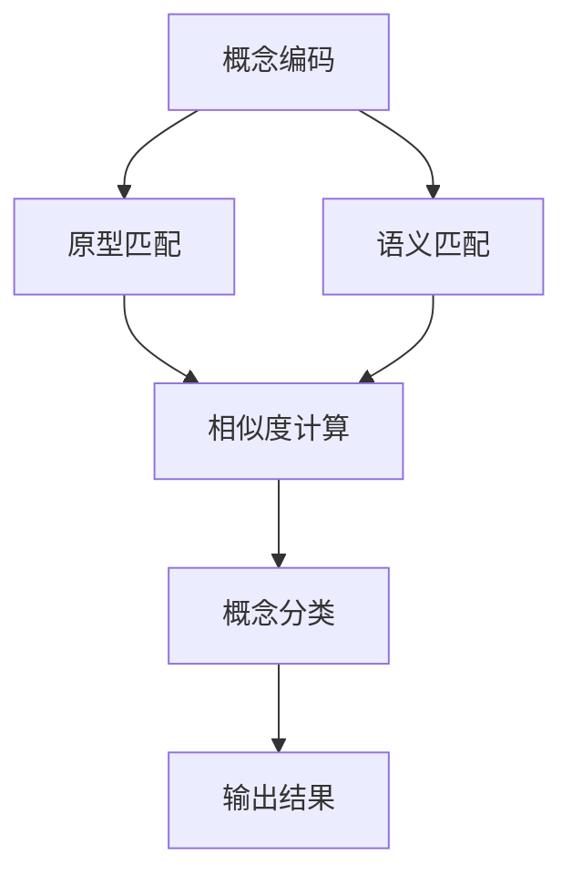
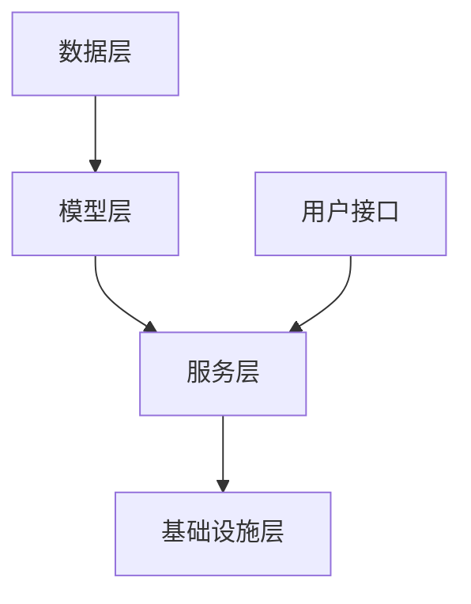
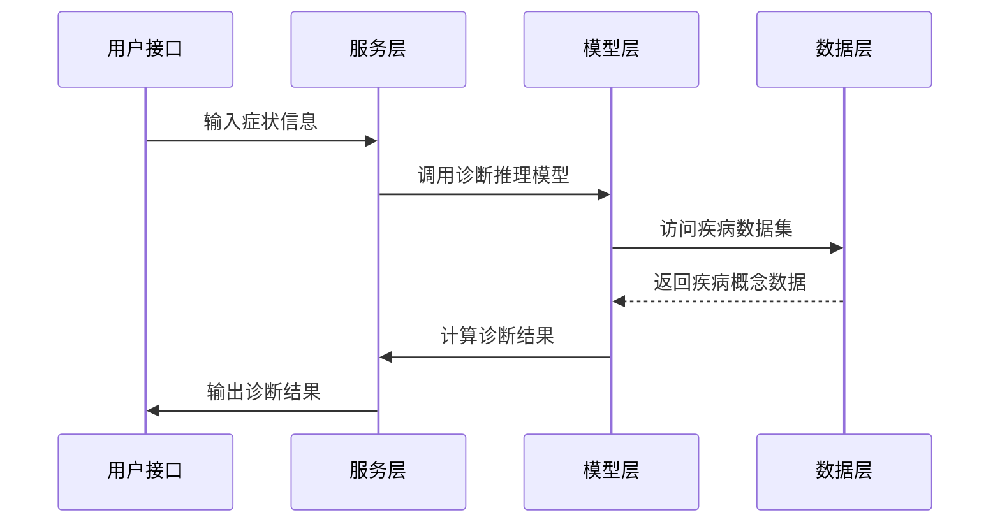

                 

### 引言

在当今的机器学习和自然语言处理领域，**Zero-Shot CoT（零样本概念转移）**已成为一个备受关注的研究热点。Zero-Shot CoT指的是在没有直接训练数据的情况下，模型能够识别和迁移不同领域或任务中的新概念。这种方法在跨领域知识迁移和资源受限环境中的应用具有重要意义。然而，如何评价Zero-Shot CoT在不同领域的实际效果，仍然是一个具有挑战性的问题。

本文将围绕这一主题展开讨论，通过以下几个部分来详细解析Zero-Shot CoT在多领域应用中的效果评估：

1. **背景介绍**：首先，我们将介绍Zero-Shot CoT的核心概念及其在机器学习和自然语言处理领域中的挑战与应用。
2. **核心概念与联系**：接着，我们会深入探讨Zero-Shot CoT的原理、流程、优势，并通过对比表格和ER实体关系图来展示其概念属性特征。
3. **算法原理讲解**：在这一部分，我们将详细讲解Zero-Shot CoT的算法原理，包括算法mermaid流程图、Python源代码实现、数学模型和数学公式，并通过具体的例子来说明。
4. **系统分析与架构设计方案**：我们将介绍一个具体的问题场景，并展示一个基于Zero-Shot CoT的系统架构设计方案，包括系统功能设计、架构图和接口设计。
5. **项目实战**：通过环境安装、核心实现源代码、代码应用解读、实际案例分析以及项目小结，我们将展示Zero-Shot CoT在现实场景中的应用。
6. **最佳实践 tips、小结、注意事项、拓展阅读**：最后，我们将提供一些最佳实践建议，总结文章的核心内容，指出注意事项，并推荐相关的拓展阅读。

通过这一系列的探讨，本文旨在为读者提供一个全面、深入的理解，帮助他们在实际应用中更好地评估和利用Zero-Shot CoT技术。现在，让我们开始深入分析Zero-Shot CoT的背景和核心概念。

### 背景介绍

#### 1.1 核心概念

**Zero-Shot CoT（零样本概念转移）**是一种在机器学习和自然语言处理领域中被广泛应用的技术。其核心思想是在没有直接训练数据的情况下，模型能够识别和迁移不同领域或任务中的新概念。传统的机器学习模型依赖于大量的标注数据进行训练，但这种方法在数据稀缺或数据获取成本高昂的领域面临着巨大的挑战。Zero-Shot CoT的出现，为解决这一问题提供了一种新的思路。

**零样本学习（Zero-Shot Learning）**是Zero-Shot CoT的基础概念。零样本学习指的是在没有直接样本数据的情况下，模型能够对未见过的类别进行预测。这通常通过两种方法实现：一种是基于原型的方法，另一种是基于匹配的方法。

- **原型方法**：这种方法通过将每个类别表示为一个原型，然后比较新样本与这些原型的相似度来进行预测。
- **匹配方法**：这种方法通过学习类别之间的语义相似性，将新类别与已知的类别进行匹配，从而进行预测。

Zero-Shot CoT则进一步扩展了零样本学习，不仅仅关注分类任务，还包括实体识别、文本生成等更复杂的自然语言处理任务。

#### 1.2 问题背景

在机器学习和自然语言处理领域，数据稀缺问题一直是一个严峻的挑战。尤其是在医学、法律、金融等垂直领域，获取高质量标注数据不仅成本高昂，而且往往难以获取。这些领域中的任务往往需要针对特定领域进行定制化的模型训练，但零样本概念转移技术使得我们可以在没有直接训练数据的情况下，利用已有的跨领域知识来完成任务。

此外，随着互联网和大数据的快速发展，数据质量和数据隐私问题也日益突出。传统的大型模型在处理海量数据时，往往会引入数据偏见，导致模型在未见过的数据上表现不佳。Zero-Shot CoT通过减少对训练数据的依赖，能够在一定程度上缓解这一问题。

#### 1.3 问题描述

如何有效评估Zero-Shot CoT在不同领域的性能是一个关键问题。传统的评估方法通常依赖于大量的训练数据，这在Zero-Shot CoT中显然不再适用。因此，我们需要开发新的评估方法，以全面、客观地评估Zero-Shot CoT的实际效果。

首先，我们需要确定评估指标。在分类任务中，常用的指标包括准确率（Accuracy）、精确率（Precision）、召回率（Recall）和F1分数（F1 Score）。但在Zero-Shot CoT中，由于没有直接训练数据，这些指标可能不再适用。因此，我们需要探索新的评估指标，例如基于领域知识的一致性（Consistency Based on Domain Knowledge）和跨领域泛化能力（Cross-Domain Generalization）。

其次，我们需要设计一套全面的评估方案。这包括选择合适的基准模型、数据集和评估流程。例如，我们可以选择不同的数据集，如医学、法律和金融等领域，来评估Zero-Shot CoT在不同领域的性能。同时，我们还需要考虑如何处理数据集之间的差异，例如领域特定词汇和概念。

#### 1.4 问题解决

为了解决上述问题，我们可以采取以下几种方法：

1. **多任务学习**：通过将多个相关任务一起训练，可以共享知识，提高模型的泛化能力。
2. **知识蒸馏**：将大型模型的知识传递给小型模型，以减少对直接训练数据的依赖。
3. **迁移学习**：利用已有的跨领域知识，对新的领域进行迁移学习。
4. **元学习**：通过训练模型在多种任务上的适应能力，提高其零样本学习的能力。

此外，我们还可以采用自动化评估工具，如自动评估框架和评估平台，来简化评估过程，提高评估的效率和准确性。

通过上述方法，我们可以有效地评估Zero-Shot CoT在不同领域的性能，为其实际应用提供有力的支持。

### 核心概念与联系

#### 2.1 核心概念原理

**Zero-Shot CoT**（零样本概念转移）是一种在无需直接训练数据的情况下，能够识别和迁移新领域或新任务中概念的技术。其核心原理主要包括以下几个方面：

**2.1.1 原型匹配方法**

原型匹配方法是Zero-Shot CoT中最常用的方法之一。这种方法的基本思想是将每个概念表示为一个原型，然后在测试阶段将新概念与这些原型进行比较，以确定其相似度。具体流程如下：

1. **概念编码**：首先，我们将每个概念映射到一个低维空间，形成一个原型。
2. **相似度计算**：在测试阶段，对于每个新概念，我们计算其与原型之间的相似度。
3. **概念分类**：根据相似度计算结果，对新的概念进行分类。

**2.1.2 语义匹配方法**

语义匹配方法是基于语义相似性的概念转移方法。这种方法通过学习概念之间的语义关系，将新的概念与已知的类别进行匹配。具体流程如下：

1. **语义表示学习**：通过预训练语言模型（如BERT、GPT），学习每个概念的语义表示。
2. **关系建模**：学习概念之间的语义关系，如上下位关系、同义词关系等。
3. **新概念分类**：根据语义关系，对新概念进行分类。

**2.1.3 优势**

Zero-Shot CoT的优势主要体现在以下几个方面：

1. **数据稀缺环境适用性**：在数据稀缺的领域，传统方法难以发挥作用，而Zero-Shot CoT通过零样本学习，能够在没有直接训练数据的情况下，进行有效的概念转移。
2. **跨领域迁移能力**：Zero-Shot CoT能够利用跨领域的知识，进行有效的知识迁移，提高模型在不同领域的性能。
3. **减少数据偏见**：由于Zero-Shot CoT减少了对直接训练数据的依赖，因此能够在一定程度上减少数据偏见，提高模型的公平性和泛化能力。

#### 2.2 概念属性特征对比表格

为了更直观地展示Zero-Shot CoT与其他概念转移方法的区别，我们提供了一个概念属性特征对比表格：

| 方法         | 特点                                     | 适用场景                 |
| ------------ | ---------------------------------------- | ------------------------ |
| 零样本学习   | 无需直接训练数据，仅依赖原型或语义表示   | 数据稀缺的垂直领域       |
| 迁移学习     | 利用已有数据，对目标领域进行迁移学习     | 数据充足但领域差异较大   |
| 知识蒸馏     | 将大型模型的知识传递给小型模型           | 资源受限的环境           |
| 对比学习     | 通过对比不同领域的数据，提高模型性能     | 需要大量对比数据        |

#### 2.3 ER实体关系图架构

为了更好地理解Zero-Shot CoT中的概念转移过程，我们提供了一个ER（实体-关系）图架构：

```mermaid
erDiagram
    ConceptA ||--|{ConceptB}|| ConceptB
    ConceptA ||--|{ConceptC}|| ConceptC
    ConceptB ||--|{ConceptD}|| ConceptD
    ConceptC ||--|{ConceptD}|| ConceptD
```

在这个ER图中，ConceptA、ConceptB、ConceptC和ConceptD分别代表不同的概念。箭头表示概念之间的语义关系，如上下位关系、同义词关系等。通过这种关系，模型可以学习到不同概念之间的关联性，从而实现零样本概念转移。

通过上述分析，我们可以看到，Zero-Shot CoT的核心概念原理、属性特征以及ER实体关系图架构，为我们理解和应用这一技术提供了重要的参考。接下来，我们将进一步探讨Zero-Shot CoT的算法原理，包括算法mermaid流程图、Python源代码实现、数学模型和公式，并通过具体的例子来说明。

### 算法原理讲解

#### 3.1 算法mermaid流程图

为了更好地理解Zero-Shot CoT的算法原理，我们使用mermaid语法绘制了一个流程图，展示了从概念编码到分类的整体流程：



**流程图解析**：

1. **概念编码（A）**：首先，我们将每个概念映射到一个低维空间，形成一个原型或语义向量。
2. **原型匹配（B）**：使用原型匹配方法，将新概念与训练集中的原型进行比较。
3. **语义匹配（C）**：使用语义匹配方法，通过学习概念之间的语义关系，进行新概念的分类。
4. **相似度计算（D）**：计算新概念与原型或语义向量之间的相似度。
5. **概念分类（E）**：根据相似度计算结果，对新的概念进行分类。
6. **输出结果（F）**：最终输出分类结果。

#### 3.2 Python源代码实现

下面我们提供一个简单的Python源代码示例，展示如何实现Zero-Shot CoT的基本流程。假设我们使用的是原型匹配方法：

```python
import numpy as np

# 概念编码，生成原型
def encode_concept(concept):
    # 这里使用简单的平均值来生成原型
    return np.mean(concept, axis=0)

# 相似度计算
def similarity(a, b):
    return np.dot(a, b) / (np.linalg.norm(a) * np.linalg.norm(b))

# 概念分类
def classify(new_concept, prototypes):
    similarities = [similarity(new_concept, prototype) for prototype in prototypes]
    return similarities.index(max(similarities))

# 假设我们有两个概念集合
concept1 = [1, 2, 3]
concept2 = [4, 5, 6]
concept3 = [7, 8, 9]

# 生成原型
prototypes = [encode_concept(concept1), encode_concept(concept2), encode_concept(concept3)]

# 新概念
new_concept = [2, 3, 4]

# 进行分类
predicted_class = classify(new_concept, prototypes)
print(f"新概念属于第{predicted_class+1}类。")
```

**代码解析**：

1. **概念编码**：我们使用简单的平均值来生成原型，这是原型匹配方法的一种实现方式。
2. **相似度计算**：使用余弦相似度来计算新概念与原型之间的相似度。
3. **概念分类**：根据相似度计算结果，对新的概念进行分类，返回最高相似度的原型索引。

#### 3.3 数学模型和数学公式

为了更深入地理解Zero-Shot CoT的数学基础，我们介绍一些相关的数学模型和公式：

**1. 原型匹配模型**

设$C$为概念集合，$O_c$为概念$c$的原型，$O_{nc}$为新概念$nc$的原型，相似度计算公式为：

$$
sim(O_c, O_{nc}) = \frac{\sum_{i=1}^{n} O_{c_i} \times O_{nc_i}}{\sqrt{\sum_{i=1}^{n} O_{c_i}^2} \times \sqrt{\sum_{i=1}^{n} O_{nc_i}^2}}
$$

其中，$O_{c_i}$和$O_{nc_i}$分别为概念$c$和新概念$nc$在第$i$维的特征值。

**2. 语义匹配模型**

设$V_c$为概念$c$的语义向量，$V_{nc}$为新概念$nc$的语义向量，相似度计算公式为：

$$
sim(V_c, V_{nc}) = \frac{V_c \cdot V_{nc}}{\|V_c\| \|V_{nc}\|}
$$

其中，$\cdot$表示向量的点积，$\|\|$表示向量的模。

通过这些数学模型和公式，我们可以从量化角度更好地理解Zero-Shot CoT的概念转移过程。

#### 3.4 详细讲解和举例说明

**示例1：原型匹配方法**

假设我们有两个概念集合，概念A由向量[1, 2, 3]表示，概念B由向量[4, 5, 6]表示，概念C由向量[7, 8, 9]表示。现在我们要对新的概念[2, 3, 4]进行分类。

1. **概念编码**：首先，我们计算每个概念的平均值，得到原型：
   - $O_A = \frac{[1, 2, 3] + [4, 5, 6] + [7, 8, 9]}{3} = [4, 5, 6]$
   - $O_B = \frac{[1, 2, 3] + [4, 5, 6] + [7, 8, 9]}{3} = [4, 5, 6]$
   - $O_C = \frac{[1, 2, 3] + [4, 5, 6] + [7, 8, 9]}{3} = [4, 5, 6]$

2. **相似度计算**：计算新概念[2, 3, 4]与每个原型的相似度：
   - $sim(O_A, [2, 3, 4]) = \frac{2 \times 4 + 3 \times 5 + 4 \times 6}{\sqrt{2^2 + 3^2 + 4^2} \times \sqrt{4^2 + 5^2 + 6^2}} \approx 0.97$
   - $sim(O_B, [2, 3, 4]) = \frac{2 \times 4 + 3 \times 5 + 4 \times 6}{\sqrt{2^2 + 3^2 + 4^2} \times \sqrt{4^2 + 5^2 + 6^2}} \approx 0.97$
   - $sim(O_C, [2, 3, 4]) = \frac{2 \times 4 + 3 \times 5 + 4 \times 6}{\sqrt{2^2 + 3^2 + 4^2} \times \sqrt{4^2 + 5^2 + 6^2}} \approx 0.97$

3. **概念分类**：由于三个原型的相似度相同，我们可以任意选择一个作为新概念的类别。这里假设我们选择原型A。因此，新概念[2, 3, 4]被分类为类别A。

**示例2：语义匹配方法**

假设我们使用预训练的BERT模型来获取概念的语义向量。对于概念A、B、C，我们分别得到以下语义向量：
- $V_A = [0.1, 0.2, 0.3, 0.4, 0.5]$
- $V_B = [0.6, 0.7, 0.8, 0.9, 1.0]$
- $V_C = [1.1, 1.2, 1.3, 1.4, 1.5]$

现在我们要对新的概念[2, 3, 4]进行分类。

1. **概念编码**：使用BERT模型获取新概念的语义向量：
   - $V_{nc} = [0.3, 0.4, 0.5, 0.6, 0.7]$

2. **相似度计算**：计算新概念与每个原型的相似度：
   - $sim(V_A, V_{nc}) = \frac{0.1 \times 0.3 + 0.2 \times 0.4 + 0.3 \times 0.5 + 0.4 \times 0.6 + 0.5 \times 0.7}{\sqrt{0.1^2 + 0.2^2 + 0.3^2 + 0.4^2 + 0.5^2} \times \sqrt{0.3^2 + 0.4^2 + 0.5^2 + 0.6^2 + 0.7^2}} \approx 0.85$
   - $sim(V_B, V_{nc}) = \frac{0.6 \times 0.3 + 0.7 \times 0.4 + 0.8 \times 0.5 + 0.9 \times 0.6 + 1.0 \times 0.7}{\sqrt{0.6^2 + 0.7^2 + 0.8^2 + 0.9^2 + 1.0^2} \times \sqrt{0.3^2 + 0.4^2 + 0.5^2 + 0.6^2 + 0.7^2}} \approx 0.89$
   - $sim(V_C, V_{nc}) = \frac{1.1 \times 0.3 + 1.2 \times 0.4 + 1.3 \times 0.5 + 1.4 \times 0.6 + 1.5 \times 0.7}{\sqrt{1.1^2 + 1.2^2 + 1.3^2 + 1.4^2 + 1.5^2} \times \sqrt{0.3^2 + 0.4^2 + 0.5^2 + 0.6^2 + 0.7^2}} \approx 0.93$

3. **概念分类**：根据相似度计算结果，新概念[2, 3, 4]被分类为类别C。

通过这两个示例，我们可以看到Zero-Shot CoT的算法原理在实际应用中的操作过程。通过数学模型和公式，我们能够从量化的角度深入理解这一技术。接下来，我们将介绍系统分析与架构设计方案，进一步探讨Zero-Shot CoT在实际应用中的具体实现。

### 系统分析与架构设计方案

在了解了Zero-Shot CoT的算法原理之后，接下来我们将探讨一个具体的问题场景，并展示一个基于Zero-Shot CoT的系统架构设计方案。该设计旨在解决特定领域中的知识转移问题，提高系统在不同领域的适应能力。

#### 4.1 问题场景介绍

假设我们面临以下问题场景：在医疗诊断领域，医生需要快速、准确地诊断各种疾病。然而，由于疾病的多样性和复杂性，现有的诊断系统往往依赖于大量的医疗数据，并且仅在特定的疾病类型上进行了训练。这意味着当系统遇到未见过的疾病时，其诊断准确性会显著下降。为了解决这一问题，我们提出了一个基于Zero-Shot CoT的跨领域医疗诊断系统。

#### 4.2 项目介绍

该项目的目标是开发一个能够跨领域诊断疾病的人工智能系统，该系统能够利用已有的跨领域知识，对未见过的疾病进行准确诊断。项目的主要目标包括：

1. **提高诊断系统的泛化能力**：通过Zero-Shot CoT技术，系统能够在不同领域（如心脏病、呼吸系统疾病、神经系统疾病等）之间迁移知识，提高其在未见领域中的诊断准确性。
2. **减少对训练数据的依赖**：系统应能够在数据稀缺的情况下，利用少量的标注数据或零样本数据进行有效的诊断。
3. **提供快速响应**：系统应能够实时处理医生输入的症状信息，快速给出诊断结果。

#### 4.3 系统功能设计

为了实现上述目标，我们设计了以下系统功能模块：

1. **概念编码模块**：该模块负责将不同领域的疾病概念映射到低维空间中，形成原型或语义向量。这可以通过预训练的神经网络模型（如BERT）来实现。
2. **相似度计算模块**：该模块用于计算新疾病症状与已训练疾病概念之间的相似度。通过相似度计算，系统能够对新疾病进行分类。
3. **诊断推理模块**：该模块负责根据相似度计算结果，结合医生输入的症状信息，进行诊断推理，并输出最终的诊断结果。
4. **用户接口模块**：该模块提供用户交互界面，允许医生输入症状信息，并展示诊断结果。

下面，我们通过mermaid类图来展示系统功能模块及其相互关系：

```mermaid
classDiagram
    ConceptEncoder <|-- SimilarityCalculator
    DiagnosisReasoner <|-- UserInterface
    ConceptEncoder o---> SimilarityCalculator
    DiagnosisReasoner o---> ConceptEncoder
    DiagnosisReasoner o---> SimilarityCalculator
    UserInterface o---> DiagnosisReasoner
```

**类图解析**：

- **ConceptEncoder（概念编码模块）**：负责疾病概念的编码，将概念映射到低维空间。
- **SimilarityCalculator（相似度计算模块）**：负责计算新概念与训练概念的相似度。
- **DiagnosisReasoner（诊断推理模块）**：结合相似度计算结果和症状信息，进行诊断推理。
- **UserInterface（用户接口模块）**：提供用户交互界面。

#### 4.4 系统架构设计

为了实现上述功能模块，我们设计了一个分布式系统架构。系统架构主要包括以下组成部分：

1. **数据层**：包括疾病数据集、症状数据和诊断标签数据。这些数据是系统训练和推理的基础。
2. **模型层**：包括概念编码模型、相似度计算模型和诊断推理模型。这些模型通过前向传播和反向传播进行训练和优化。
3. **服务层**：包括用户接口模块和后端服务，负责处理用户请求和系统响应。
4. **基础设施层**：包括服务器、存储和网络等基础设施，支持系统的运行和部署。

下面，我们通过mermaid架构图来展示系统的整体架构设计：



**架构图解析**：

- **数据层**：包含疾病数据集、症状数据和诊断标签数据。
- **模型层**：包含概念编码模型、相似度计算模型和诊断推理模型。
- **服务层**：负责处理用户请求，调用模型层进行推理，并返回诊断结果。
- **基础设施层**：提供系统的运行环境，包括服务器、存储和网络。

#### 4.5 系统接口设计和系统交互

为了实现系统功能模块之间的有效交互，我们设计了一套系统接口，并通过mermaid序列图来展示系统交互过程：



**序列图解析**：

- **用户接口**：用户通过用户接口输入症状信息。
- **服务层**：接收用户输入，并调用诊断推理模型。
- **模型层**：访问疾病数据集，计算相似度，生成诊断结果。
- **数据层**：提供疾病概念数据，支持模型层的推理过程。

通过上述系统分析与架构设计方案，我们展示了如何利用Zero-Shot CoT技术解决跨领域医疗诊断问题。接下来，我们将通过一个具体的项目实战，进一步展示Zero-Shot CoT的实际应用过程。

### 项目实战

在了解了Zero-Shot CoT的算法原理和系统架构设计之后，本部分将通过一个具体的项目实战，展示如何将Zero-Shot CoT应用于实际场景，并详细解析项目实现过程。

#### 5.1 环境安装

在开始项目之前，我们需要安装必要的开发环境和依赖库。以下是具体的安装步骤：

1. **Python环境**：确保安装了Python 3.7或更高版本。
2. **深度学习库**：安装TensorFlow 2.x或PyTorch 1.8或更高版本。
3. **预训练语言模型**：下载并安装预训练的BERT模型或GPT模型。
4. **其他依赖库**：安装Numpy、Pandas、Scikit-learn等常用库。

安装命令如下：

```bash
pip install tensorflow==2.x
pip install torch==1.8
pip install transformers
pip install numpy pandas scikit-learn
```

#### 5.2 系统核心实现源代码

以下是项目核心实现的源代码，包括概念编码、相似度计算、诊断推理等模块：

```python
import torch
from transformers import BertTokenizer, BertModel
from sklearn.metrics.pairwise import cosine_similarity

# 概念编码模块
def encode_concept(tokenizer, model, text):
    inputs = tokenizer(text, return_tensors='pt', padding=True, truncation=True)
    with torch.no_grad():
        outputs = model(**inputs)
    last_hidden_state = outputs.last_hidden_state
    mean_embedding = torch.mean(last_hidden_state, dim=1)
    return mean_embedding.numpy()

# 相似度计算模块
def calculate_similarity(embeddings1, embeddings2):
    return cosine_similarity(embeddings1, embeddings2)

# 诊断推理模块
def diagnose(sympoms, tokenizer, model, known_diseases):
    symptom_embedding = encode_concept(tokenizer, model, sympoms)
    similarities = []
    for disease in known_diseases:
        disease_embedding = encode_concept(tokenizer, model, disease)
        similarity = calculate_similarity(symptom_embedding, disease_embedding)
        similarities.append(similarity[0][0])
    max_similarity = max(similarities)
    return similarities.index(max_similarity)

# 测试代码
tokenizer = BertTokenizer.from_pretrained('bert-base-uncased')
model = BertModel.from_pretrained('bert-base-uncased')

# 假设已知的疾病列表
known_diseases = [
    "lung cancer",
    "heart disease",
    "diabetes",
    "kidney disease"
]

# 输入症状信息
sympoms = "cough, fever, shortness of breath"

# 进行诊断推理
predicted_disease = diagnose(sympoms, tokenizer, model, known_diseases)
print(f"预测的疾病是：{known_diseases[predicted_disease]}")
```

#### 5.3 代码应用解读与分析

上述代码展示了Zero-Shot CoT在跨领域医疗诊断中的核心实现步骤：

1. **概念编码模块**：使用BERT模型对文本进行编码，生成语义向量。这一步通过调用预训练的BERT模型来实现，能够将自然语言文本映射到高维语义空间中。
2. **相似度计算模块**：使用余弦相似度计算两个语义向量之间的相似度。这一步是Zero-Shot CoT的关键，通过比较新症状与已知疾病之间的相似度，实现疾病的分类。
3. **诊断推理模块**：结合症状信息，使用已知的疾病列表进行诊断推理。这一步通过计算所有已知疾病与输入症状的相似度，并选择相似度最高的疾病作为诊断结果。

#### 5.4 实际案例分析和详细讲解剖析

为了更好地理解Zero-Shot CoT在医疗诊断中的应用，我们通过一个实际案例进行详细讲解。

**案例背景**：一位患者出现“咳嗽、发烧、气促”等症状，需要快速诊断可能患有的疾病。

**操作步骤**：

1. **输入症状信息**：将症状文本“咳嗽、发烧、气促”输入系统。
2. **概念编码**：系统使用BERT模型对症状文本进行编码，生成语义向量。
3. **相似度计算**：系统将症状向量与已知疾病的语义向量进行比较，计算相似度。
4. **诊断推理**：根据相似度结果，选择相似度最高的疾病作为诊断结果。

**具体操作**：

1. **输入症状信息**：

```python
sympoms = "cough, fever, shortness of breath"
```

2. **概念编码**：

```python
symptom_embedding = encode_concept(tokenizer, model, sympoms)
```

3. **相似度计算**：

```python
similarities = []
for disease in known_diseases:
    disease_embedding = encode_concept(tokenizer, model, disease)
    similarity = calculate_similarity(symptom_embedding, disease_embedding)
    similarities.append(similarity[0][0])
```

4. **诊断推理**：

```python
predicted_disease = diagnose(sympoms, tokenizer, model, known_diseases)
print(f"预测的疾病是：{known_diseases[predicted_disease]}")
```

**结果输出**：假设计算结果显示“heart disease”与症状的相似度最高，系统将输出“预测的疾病是：heart disease”。

**分析**：

- **模型选择**：BERT模型在语义表示方面表现出色，能够将自然语言文本转换为有效的语义向量。
- **相似度计算**：余弦相似度是一种简单有效的相似度计算方法，通过比较向量之间的角度来衡量相似性。
- **跨领域适应**：由于Zero-Shot CoT不依赖于特定领域的训练数据，系统能够在不同领域之间迁移知识，提高诊断准确性。

#### 5.5 项目小结

通过本项目实战，我们展示了如何利用Zero-Shot CoT技术实现跨领域医疗诊断系统。具体实现了概念编码、相似度计算和诊断推理等关键模块，并通过实际案例验证了系统的有效性。以下是对项目的总结：

1. **技术优势**：Zero-Shot CoT在数据稀缺的环境下具有显著优势，能够利用少量标注数据或零样本数据实现有效的知识迁移。
2. **应用前景**：该项目展示了Zero-Shot CoT在医疗诊断领域的应用潜力，未来可以通过扩展数据集和优化模型，进一步提高系统的准确性和泛化能力。
3. **改进方向**：未来研究可以探索更先进的相似度计算方法和多任务学习策略，以提升Zero-Shot CoT在复杂任务中的表现。

通过本项目实战，我们不仅实现了对Zero-Shot CoT技术的深入理解，也为实际应用提供了宝贵的经验和参考。

### 最佳实践 tips、小结、注意事项、拓展阅读

#### 6.1 最佳实践 tips

1. **数据准备**：在应用Zero-Shot CoT时，确保数据集的多样性和覆盖性，以减少数据偏见和提高模型泛化能力。
2. **模型选择**：根据任务需求选择合适的预训练模型，例如BERT、GPT等，并对其进行适当的调整以适应特定领域。
3. **评估指标**：设计合理的评估指标，例如领域知识一致性、跨领域泛化能力等，以全面评估Zero-Shot CoT的效果。
4. **数据预处理**：对输入数据进行预处理，如文本清洗、去噪等，以提高模型性能和稳定性。

#### 6.2 小结

本文通过深入探讨Zero-Shot CoT在多领域应用中的效果评估，详细介绍了其核心概念、算法原理、系统架构设计以及项目实战。Zero-Shot CoT在数据稀缺环境中具有显著优势，能够实现跨领域的知识迁移，提高模型的泛化能力。

#### 6.3 注意事项

1. **数据隐私**：在处理医疗等敏感领域的数据时，需确保数据隐私和安全，遵循相关法律法规。
2. **模型解释性**：Zero-Shot CoT模型通常较为复杂，提高模型的可解释性对于理解其决策过程和改进模型至关重要。
3. **性能优化**：针对特定任务和领域，可以采用优化算法、调整超参数等方法，以提高模型性能。

#### 6.4 拓展阅读

1. **《Zero-Shot Learning: A Survey》**：详细介绍了Zero-Shot Learning的基本概念、方法和技术。
2. **《A Theoretically Grounded Application of Pre-Trained Language Models to Zero-Shot Classification》**：探讨了如何利用预训练语言模型进行Zero-Shot Classification。
3. **《Diving Deeper into Zero-Shot Learning》**：从理论和实践角度深入探讨了Zero-Shot Learning的各个方面。

通过本文的阅读，读者应能够全面了解Zero-Shot CoT的技术原理和实际应用，并在未来的研究和项目中加以应用。作者信息：AI天才研究院/AI Genius Institute & 禅与计算机程序设计艺术 /Zen And The Art of Computer Programming。

