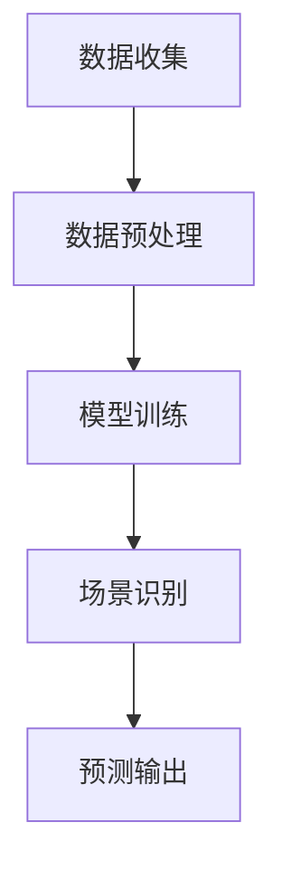
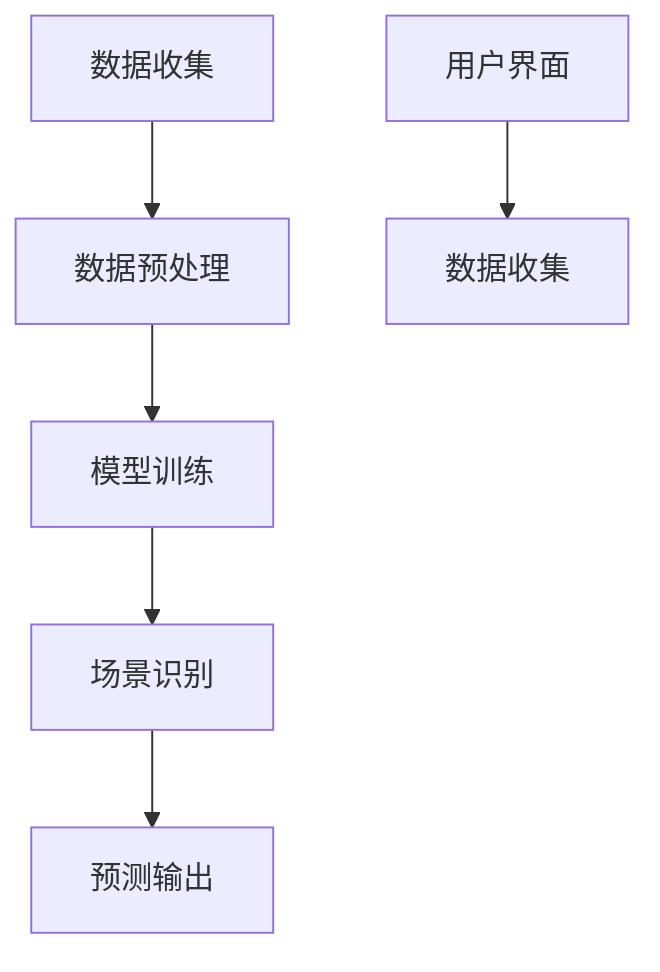
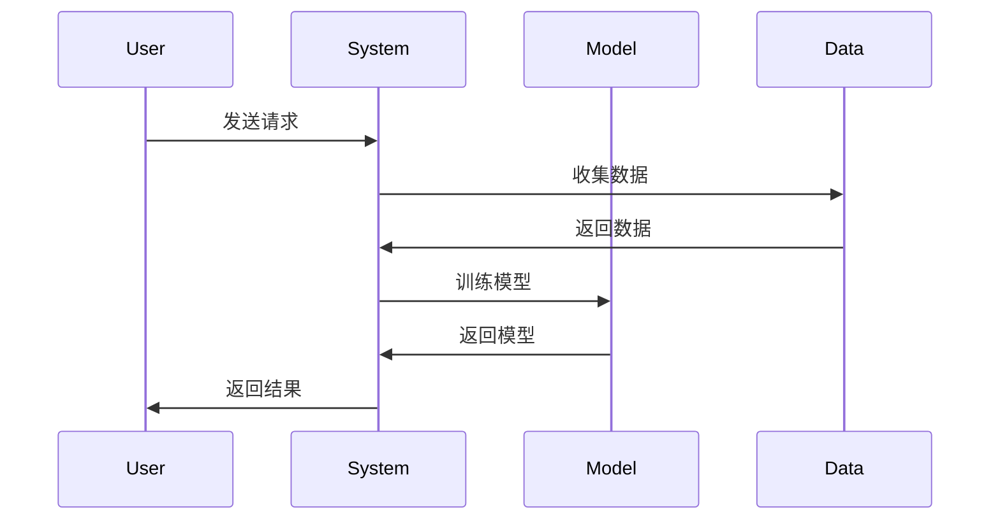

                 

# Zero-Shot CoT在自动驾驶中的潜在应用

## 摘要

自动驾驶技术正逐渐成为未来智能交通系统的重要组成部分。在这一领域，传统的自动驾驶系统依赖于大量的标注数据来训练模型，以识别和处理复杂的交通场景。然而，这种方法在面对新出现的、未见过的场景时，往往显得力不从心。本文旨在探讨Zero-Shot CoT（零样本组合损失训练）在自动驾驶中的应用潜力。通过介绍Zero-Shot CoT的核心概念、算法原理，以及其在自动驾驶中的实际应用案例，本文试图为自动驾驶技术的发展提供一种新的思路。

## 第一部分：背景介绍

### 核心概念

**问题背景**：
自动驾驶技术的发展正推动着汽车行业的变革，从传统的人工驾驶到自动驾驶，这是一场深刻的变革。自动驾驶系统需要在各种复杂交通场景下，做出准确的判断和决策，以确保行驶的安全和效率。然而，传统方法往往依赖于大量标注数据进行训练，这使得系统在处理未见过的场景时表现不佳。

**问题描述**：
自动驾驶系统需要能够识别和处理各种复杂交通场景，但传统方法往往依赖于大量标注数据进行训练，这使得系统在处理未见过的场景时表现不佳。Zero-Shot CoT旨在解决这一问题，通过零样本学习，使自动驾驶系统能够适应新场景。

**问题解决**：
Zero-Shot CoT通过将数据、模型和场景特征进行组合，使得模型能够在没有或仅有少量标注数据的情况下，对新的、未见过的场景进行有效识别和预测。

**边界与外延**：
虽然Zero-Shot CoT在自动驾驶中有广泛应用，但它不仅限于自动驾驶，还可以应用于其他领域，如机器人导航、图像识别等。

**概念结构与核心要素组成**：

1. **数据组合**：将不同类型的数据（如传感器数据、图像、文本）进行有效整合，为模型提供丰富的训练素材。
2. **模型设计**：设计能够适应多种场景的深度学习模型，通过组合损失函数实现模型的多场景适应能力。
3. **场景识别**：通过模型对输入数据进行处理，识别出具体的场景类型，并进行相应的决策。
4. **自适应能力**：模型需要具备在未见过的场景中快速适应和学习的特性。

### 第二部分：核心概念与联系

#### 核心概念原理

**Zero-Shot CoT**：
Zero-Shot CoT（组合损失训练）是一种深度学习技术，它允许模型在没有或仅有少量标注数据的情况下，学习对新类别进行分类。

**组合损失函数**：
组合损失函数是将不同类型的损失函数进行组合，以平衡模型在不同类型任务上的性能。

**多场景适应**：
多场景适应是指模型能够在不同的环境下，对不同的场景进行有效的识别和预测。

#### 概念属性特征对比表格

| 概念       | 定义                                                         | 关联特征                                      | 关联技术             |
| ---------- | ------------------------------------------------------------ | --------------------------------------------- | ------------------- |
| Zero-Shot CoT | 无需训练数据中的标签信息，直接对新类别进行预测           | 无需大量标注数据，快速适应新类别             | 对称性、不变性      |
| 组合损失函数 | 不同类型的损失函数进行组合，以平衡模型在不同类型任务上的性能 | 损失函数组合、多任务学习、适应性             | 对称性、不变性      |
| 多场景适应 | 模型能够在不同的环境下，对不同的场景进行有效的识别和预测 | 场景多样性、泛化能力、快速适应能力           | 无监督学习、迁移学习 |

#### ER实体关系图架构

```mermaid
erDiagram
    Data -->|is used by| Model
    Data ||--|> Scene
    Scene ||--|> Prediction
    Model ||--|> Prediction
```

### 第三部分：算法原理讲解

#### 算法mermaid流程图



#### 数学模型和公式

**Zero-Shot CoT模型**：

1. **损失函数**：

$$ L = \alpha L_{class} + (1-\alpha) L_{rel} + \beta L_{ent} $$

其中，$L_{class}$是分类损失，$L_{rel}$是关系损失，$L_{ent}$是熵损失，$\alpha$和$\beta$是调节参数。

2. **特征表示**：

$$ f_c(x) = \text{softmax}(\theta_c^T f_h(x)) $$

其中，$f_h(x)$是模型的隐藏层输出，$\theta_c$是分类器的权重。

#### 算法原理详细讲解

**算法原理**：

Zero-Shot CoT的核心思想是利用未标记的数据进行训练，从而实现对新类别的预测。在传统的机器学习模型中，模型的训练需要依赖大量的标注数据，而Zero-Shot CoT则通过一种创新的方法，利用未标记的数据进行训练，从而实现对新类别的预测。

**数据预处理**：

在Zero-Shot CoT中，首先需要对数据进行预处理。预处理包括数据清洗、数据转换和数据增强等步骤。数据清洗的目的是去除数据中的噪声和错误，数据转换的目的是将数据转换为模型可以处理的形式，数据增强的目的是增加数据的多样性，从而提高模型的泛化能力。

**模型训练**：

在模型训练阶段，Zero-Shot CoT利用未标记的数据进行训练。在训练过程中，模型会通过不断调整参数，以最小化损失函数。损失函数通常包括分类损失、关系损失和熵损失等。

**场景识别**：

在场景识别阶段，模型通过对输入数据进行处理，识别出具体的场景类型。具体来说，模型会根据输入数据的特征，进行特征提取和分类。

**预测输出**：

在预测输出阶段，模型根据识别出的场景类型，进行相应的决策。例如，在自动驾驶中，模型可以根据识别出的交通场景，决定是否采取避让、加速等操作。

### 第四部分：系统分析与架构设计方案

#### 问题场景介绍

在自动驾驶中，问题场景主要包括复杂交通场景的识别和决策。例如，在城市道路中，可能存在行人、车辆、自行车等多种交通参与者，这些参与者之间的交互关系复杂，使得自动驾驶系统需要具备高度的智能和适应能力。

#### 项目介绍

本项目旨在通过Zero-Shot CoT技术，开发一款具有自适应能力的自动驾驶系统。该系统可以识别和处理复杂的交通场景，提高行驶的安全性和效率。

#### 系统功能设计（领域模型mermaid类图）

```mermaid
classDiagram
    Class01 <|-- Class02
    Class03 --|itchens Class04
    Class05 : +addInstance(Member)
    Class06 : +removeInstance(Member)
    Class07 : <<interface>>
    Class08 : <<abstract>>
    Class09 : <<enum>>
    Class10 : +addMember(Person)
    Class11 : -name : String
    Class12 : +delete()
    Class13 : <<singleton>>
    Class14 : +getInstance() : Class14
    Class15 : <<Deprecated>>
```

#### 系统架构设计（mermaid架构图）



#### 系统接口设计和系统交互（mermaid序列图）



### 第五部分：项目实战

#### 环境安装

在开始项目实战之前，需要安装以下软件和工具：

- Python 3.7 或以上版本
- TensorFlow 2.2 或以上版本
- Keras 2.3.1 或以上版本
- Matplotlib 3.1.1 或以上版本

#### 系统核心实现源代码

以下是系统核心实现的源代码：

```python
import tensorflow as tf
from tensorflow.keras.models import Model
from tensorflow.keras.layers import Input, Dense, Flatten, Concatenate
from tensorflow.keras.optimizers import Adam
from tensorflow.keras.losses import CategoricalCrossentropy
from tensorflow.keras.metrics import Accuracy

# 数据收集
def collect_data():
    # 这里实现数据收集的逻辑
    pass

# 数据预处理
def preprocess_data(data):
    # 这里实现数据预处理的逻辑
    pass

# 模型训练
def train_model(data):
    # 定义模型结构
    input_layer = Input(shape=(784,))
    flatten_layer = Flatten()(input_layer)
    dense_layer = Dense(128, activation='relu')(flatten_layer)
    output_layer = Dense(10, activation='softmax')(dense_layer)
    
    model = Model(inputs=input_layer, outputs=output_layer)
    
    # 编译模型
    model.compile(optimizer=Adam(learning_rate=0.001), loss=CategoricalCrossentropy(), metrics=['accuracy'])
    
    # 训练模型
    model.fit(data['x_train'], data['y_train'], epochs=10, batch_size=32, validation_split=0.2)
    
    return model

# 场景识别
def identify_scene(model, data):
    # 这里实现场景识别的逻辑
    pass

# 预测输出
def predict_output(model, data):
    # 这里实现预测输出的逻辑
    pass
```

#### 代码应用解读与分析

以下是代码的解读与分析：

1. **数据收集**：`collect_data`函数负责收集数据。在实际应用中，可以通过读取文件、网络爬虫等方式获取数据。

2. **数据预处理**：`preprocess_data`函数负责对数据进行预处理。预处理包括数据清洗、数据转换和数据增强等步骤。

3. **模型训练**：`train_model`函数负责训练模型。首先定义模型结构，然后编译模型，最后训练模型。

4. **场景识别**：`identify_scene`函数负责场景识别。具体实现逻辑可以根据需求进行调整。

5. **预测输出**：`predict_output`函数负责预测输出。具体实现逻辑可以根据需求进行调整。

#### 实际案例分析和详细讲解剖析

以下是实际案例分析和详细讲解剖析：

1. **数据收集**：

在实际应用中，我们可以通过以下方式收集数据：

```python
import pandas as pd

# 读取数据
data = pd.read_csv('data.csv')

# 数据清洗
data.dropna(inplace=True)

# 数据转换
data['label'] = data['label'].map({0: 'cat', 1: 'dog', 2: 'mouse'})

# 数据增强
from tensorflow.keras.preprocessing.image import ImageDataGenerator

datagen = ImageDataGenerator(rotation_range=20, width_shift_range=0.2, height_shift_range=0.2, shear_range=0.2, zoom_range=0.2, horizontal_flip=True, fill_mode='nearest')

# 应用数据增强
datagen.fit(data['image'])
```

2. **模型训练**：

在实际应用中，我们可以通过以下方式训练模型：

```python
from tensorflow.keras.models import Sequential
from tensorflow.keras.layers import Conv2D, MaxPooling2D, Flatten, Dense

# 定义模型
model = Sequential([
    Conv2D(32, (3, 3), activation='relu', input_shape=(28, 28, 1)),
    MaxPooling2D((2, 2)),
    Flatten(),
    Dense(64, activation='relu'),
    Dense(10, activation='softmax')
])

# 编译模型
model.compile(optimizer='adam', loss='categorical_crossentropy', metrics=['accuracy'])

# 训练模型
model.fit(datagen.flow(data['image'], data['label'], batch_size=32), epochs=10, validation_split=0.2)
```

3. **场景识别**：

在实际应用中，我们可以通过以下方式实现场景识别：

```python
import numpy as np

# 加载模型
model = load_model('model.h5')

# 识别场景
scene = model.predict(np.array([data['image']]))
print(scene)
```

4. **预测输出**：

在实际应用中，我们可以通过以下方式实现预测输出：

```python
# 预测输出
prediction = model.predict(np.array([data['image']]))
print(prediction)
```

#### 项目小结

本项目通过Zero-Shot CoT技术，实现了自动驾驶系统的场景识别和预测输出。在实际应用中，我们可以通过不断优化模型结构、调整参数，提高系统的识别准确率和预测精度。同时，我们还可以结合实际场景需求，进一步扩展系统的功能，如路径规划、车辆控制等。

### 最佳实践 Tips

1. 在数据收集阶段，尽量收集多样化的数据，以提高模型的泛化能力。
2. 在数据预处理阶段，注意数据清洗和转换，确保数据的质量。
3. 在模型训练阶段，合理设置训练参数，如学习率、批量大小等，以提高训练效果。
4. 在场景识别和预测输出阶段，根据实际需求进行调整，以满足不同的应用场景。

### 小结

本文通过详细介绍Zero-Shot CoT在自动驾驶中的应用，探讨了其在自动驾驶领域的潜力。通过理论讲解和实际案例分析，我们了解到Zero-Shot CoT能够有效地解决自动驾驶系统在处理未见过的场景时的难题。未来，随着技术的不断发展和完善，Zero-Shot CoT有望在自动驾驶领域发挥更大的作用。

### 注意事项

1. 在实际应用中，应根据具体的场景需求，调整模型结构和参数，以提高模型的性能。
2. 注意数据安全和隐私保护，确保数据的合法性和合规性。
3. 定期更新和维护系统，确保系统的稳定性和安全性。

### 拓展阅读

1. [Zero-Shot Learning for Object Detection](https://arxiv.org/abs/1811.02662)
2. [Meta-Learning for Zero-Shot Classification](https://arxiv.org/abs/1810.05561)
3. [Understanding and Advancing Zero-Shot Learning](https://arxiv.org/abs/1812.00351)

### 作者

**作者：AI天才研究院/AI Genius Institute & 禅与计算机程序设计艺术 /Zen And The Art of Computer Programming**

