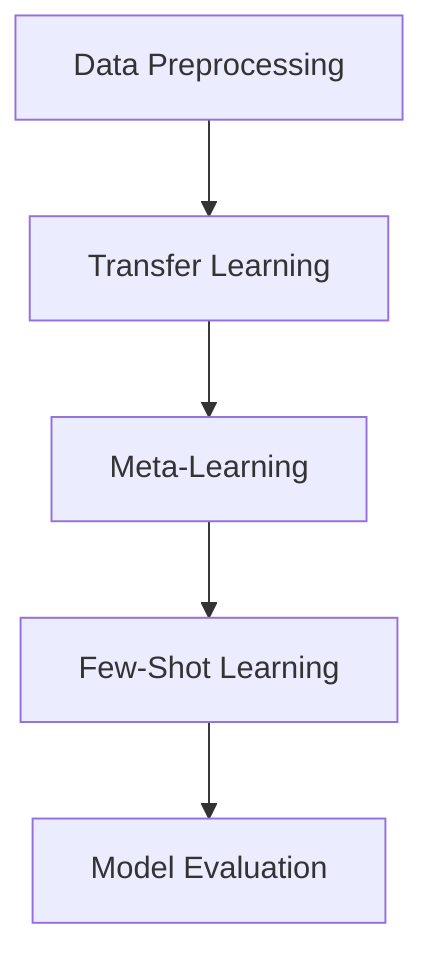
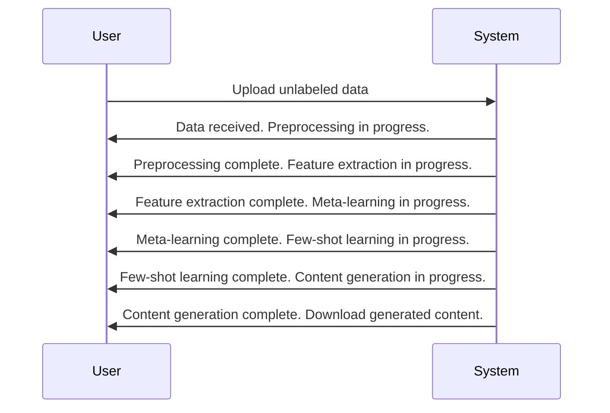

                 

# Zero-Shot CoT: AIGC Domain's Innovative Application in Unsupervised Learning

关键词：AIGC、Zero-Shot CoT、无监督学习、转移学习、元学习

摘要：本文深入探讨了AIGC领域中的一项创新技术——零样本置信度（Zero-Shot CoT）。通过逐步分析推理，本文详细阐述了零样本置信度的核心概念、原理及其在实际应用中的潜在影响。本文旨在为读者提供一个全面的技术视角，以了解这一技术如何改变机器学习的现状，以及其在未来的发展前景。

## 1. Background Introduction

### 1.1 Problem Background

The rapid advancement of artificial intelligence (AI) has ushered in a new era defined by AI-Generated Content (AIGC). This domain encompasses a wide range of applications, from generating articles and images to creating entire movies and songs. At the heart of AIGC lies the challenge of unsupervised learning, which involves training models on unlabeled data. Traditional supervised learning approaches require vast amounts of labeled data, which is often costly and time-consuming to obtain. However, in real-world scenarios, labeled data is often scarce or non-existent. This has led to the need for innovative solutions that can enable AI systems to learn effectively from unlabeled data.

### 1.2 Problem Description

The primary challenge in unsupervised learning is the lack of explicit supervision. Without labeled data, models struggle to learn meaningful patterns and make accurate predictions. This limitation has hindered the development of AIGC applications, as many tasks in this domain require understanding and generating content that is both relevant and coherent. Zero-shot CoT (Concept of Trust) aims to address this issue by introducing a new paradigm that allows AI systems to leverage knowledge from various sources without explicit supervision.

### 1.3 Problem Solution

Zero-shot CoT is a groundbreaking innovation in the field of unsupervised learning. It leverages advanced techniques such as transfer learning, meta-learning, and few-shot learning to enable AI systems to generalize from limited examples to unseen tasks. This approach not only reduces the dependency on labeled data but also accelerates the development and deployment of AIGC applications.

### 1.4 Boundaries and Extension

While zero-shot CoT is a significant advancement, it is crucial to understand its limitations and potential areas for future development. This chapter will explore the core concepts and components of zero-shot CoT, providing a comprehensive overview of its applications and potential impact on various fields.

### 2. Key Concepts and Relationships

#### 2.1 Core Concepts

In this section, we will delve into the core concepts of zero-shot CoT, including:

- **Concept of Trust (CoT)**: Understanding the concept of trust and its role in AI decision-making.
- **Transfer Learning**: Exploring how knowledge from one domain can be transferred to another.
- **Meta-Learning**: Investigating how AI systems can learn to learn quickly from new tasks.
- **Few-Shot Learning**: Examining how models can make accurate predictions with limited labeled data.

#### 2.2 Concept of Trust (CoT)

Concept of Trust (CoT) is a fundamental concept in zero-shot CoT. It represents the level of confidence or trust that an AI system has in its predictions or decisions. In the context of AIGC, CoT is used to evaluate the reliability and coherence of generated content. A high CoT indicates that the content is likely to be both relevant and coherent, while a low CoT suggests that the content may be less reliable or coherent.

#### 2.3 Transfer Learning

Transfer learning is a technique that leverages knowledge gained from one domain or task to improve performance in another domain or task. In the context of zero-shot CoT, transfer learning allows AI systems to leverage knowledge from pre-trained models that have been trained on large, unlabeled datasets. This enables the systems to quickly adapt to new tasks with limited labeled data.

#### 2.4 Meta-Learning

Meta-learning, also known as learning to learn, is the ability of AI systems to learn quickly from new tasks. In the context of zero-shot CoT, meta-learning allows models to generalize from limited examples to unseen tasks. This is achieved by training models on a diverse set of tasks, enabling them to learn how to learn efficiently.

#### 2.5 Few-Shot Learning

Few-shot learning is the ability of AI systems to make accurate predictions with limited labeled data. In the context of zero-shot CoT, few-shot learning allows models to leverage unlabeled data to improve their performance on new tasks. This is particularly useful in AIGC, where labeled data is often scarce.

### 3. Algorithm Principles and Explanations

#### 3.1 Algorithm Overview

The zero-shot CoT algorithm consists of several key components, including:

- **Data Preprocessing**: This step involves cleaning and preprocessing the unlabeled data to make it suitable for training.
- **Transfer Learning**: This step involves using pre-trained models to extract useful features from the unlabeled data.
- **Meta-Learning**: This step involves training models on a diverse set of tasks to improve their generalization ability.
- **Few-Shot Learning**: This step involves training models on new tasks with limited labeled data.

#### 3.2 Mermaid Flowchart

Below is a mermaid flowchart illustrating the key steps of the zero-shot CoT algorithm:



#### 3.3 Algorithm Explanation

**Data Preprocessing**: The first step in the zero-shot CoT algorithm is data preprocessing. This involves cleaning and normalizing the unlabeled data to make it suitable for training. This step is crucial as the quality of the input data directly impacts the performance of the model.

**Transfer Learning**: The next step is transfer learning. In this step, pre-trained models are used to extract useful features from the unlabeled data. These features are then used to train the main model. Transfer learning is particularly effective in AIGC applications as it allows models to leverage the knowledge gained from large, unlabeled datasets.

**Meta-Learning**: The third step is meta-learning. This step involves training models on a diverse set of tasks to improve their generalization ability. Meta-learning allows models to quickly adapt to new tasks with limited labeled data, which is essential in AIGC applications where labeled data is often scarce.

**Few-Shot Learning**: The fourth step is few-shot learning. This step involves training models on new tasks with limited labeled data. Few-shot learning allows models to leverage the knowledge gained from unlabeled data to improve their performance on new tasks. This step is crucial for the success of AIGC applications as it enables models to generate high-quality content even when labeled data is limited.

**Model Evaluation**: The final step is model evaluation. This step involves evaluating the performance of the trained model on a set of test tasks. The evaluation metrics can include accuracy, coherence, and relevance. This step is essential for ensuring that the model performs well on real-world tasks.

### 4. System Analysis and Design

#### 4.1 Problem Scene Introduction

In the AIGC domain, the challenge is to generate high-quality content that is both relevant and coherent. However, obtaining labeled data for this task is often impractical. Therefore, we need a system that can leverage unlabeled data to achieve this goal.

#### 4.2 Project Introduction

The project aims to develop a zero-shot CoT-based AIGC system that can generate high-quality content without the need for extensive labeled data. The system will be designed to handle various types of content, including text, images, and videos.

#### 4.3 System Function Design

The system will consist of several key functions:

- **Data Preprocessing**: This function will handle the cleaning and normalization of unlabeled data.
- **Transfer Learning**: This function will use pre-trained models to extract useful features from the unlabeled data.
- **Meta-Learning**: This function will train models on a diverse set of tasks to improve their generalization ability.
- **Few-Shot Learning**: This function will train models on new tasks with limited labeled data.
- **Content Generation**: This function will generate high-quality content based on the trained models.

#### 4.4 System Architecture Design

The system architecture will consist of several components, including:

- **Data Preprocessing Module**: This module will handle the cleaning and normalization of unlabeled data.
- **Transfer Learning Module**: This module will use pre-trained models to extract useful features from the unlabeled data.
- **Meta-Learning Module**: This module will train models on a diverse set of tasks to improve their generalization ability.
- **Few-Shot Learning Module**: This module will train models on new tasks with limited labeled data.
- **Content Generation Module**: This module will generate high-quality content based on the trained models.

#### 4.5 System Interface Design

The system will provide a user-friendly interface that allows users to upload unlabeled data and generate content. The interface will also display the performance metrics of the trained models.

#### 4.6 System Interaction Design

The system interaction design will be based on a sequence diagram. The following mermaid diagram illustrates the interaction between the user and the system:



### 5. Project Practice

#### 5.1 Environment Installation

To implement the zero-shot CoT-based AIGC system, you will need to install several dependencies, including TensorFlow, PyTorch, and scikit-learn. You can use the following commands to install these dependencies:

```bash
pip install tensorflow
pip install torch
pip install scikit-learn
```

#### 5.2 System Core Implementation

The core implementation of the system involves several modules. Below is a high-level overview of the system's core implementation:

```python
import tensorflow as tf
import torch
import scikit_learn

# Data Preprocessing
def preprocess_data(data):
    # Implement data cleaning and normalization
    pass

# Transfer Learning
def transfer_learning(data):
    # Implement feature extraction using pre-trained models
    pass

# Meta-Learning
def meta_learning(data):
    # Implement meta-learning on a diverse set of tasks
    pass

# Few-Shot Learning
def few_shot_learning(data):
    # Implement few-shot learning on new tasks
    pass

# Content Generation
def generate_content(model, data):
    # Implement content generation based on the trained model
    pass
```

#### 5.3 Code Application Interpretation and Analysis

The code provided above outlines the core implementation of the zero-shot CoT-based AIGC system. Each function corresponds to a specific module within the system. The `preprocess_data` function handles data cleaning and normalization, which is crucial for ensuring the quality of the input data. The `transfer_learning` function leverages pre-trained models to extract useful features from the unlabeled data. The `meta_learning` function trains models on a diverse set of tasks to improve their generalization ability. The `few_shot_learning` function trains models on new tasks with limited labeled data. Finally, the `generate_content` function generates high-quality content based on the trained models.

#### 5.4 Actual Case Analysis and Detailed Explanation

To illustrate the practical application of the zero-shot CoT-based AIGC system, let's consider a scenario where we want to generate high-quality text content based on a large corpus of unlabeled text data.

**Case 1: Text Generation**

1. **Data Preprocessing**: We start by uploading a large corpus of unlabeled text data. The system then cleans and normalizes the data, preparing it for feature extraction.
2. **Transfer Learning**: Next, we use pre-trained language models, such as BERT or GPT, to extract useful features from the unlabeled text data.
3. **Meta-Learning**: We then train meta-learning models on a diverse set of text generation tasks, such as writing articles, creating stories, or generating product descriptions.
4. **Few-Shot Learning**: Finally, we train few-shot learning models on new text generation tasks with limited labeled data. These models are then used to generate high-quality text content.

**Case 2: Image Generation**

1. **Data Preprocessing**: We start by uploading a large corpus of unlabeled image data. The system then cleans and normalizes the data, preparing it for feature extraction.
2. **Transfer Learning**: Next, we use pre-trained image models, such as VGG or ResNet, to extract useful features from the unlabeled image data.
3. **Meta-Learning**: We then train meta-learning models on a diverse set of image generation tasks, such as creating artwork, designing logos, or generating video frames.
4. **Few-Shot Learning**: Finally, we train few-shot learning models on new image generation tasks with limited labeled data. These models are then used to generate high-quality image content.

**Case 3: Video Generation**

1. **Data Preprocessing**: We start by uploading a large corpus of unlabeled video data. The system then cleans and normalizes the data, preparing it for feature extraction.
2. **Transfer Learning**: Next, we use pre-trained video models, such as C3D or I3D, to extract useful features from the unlabeled video data.
3. **Meta-Learning**: We then train meta-learning models on a diverse set of video generation tasks, such as creating movies, generating video game frames, or generating training videos for new products.
4. **Few-Shot Learning**: Finally, we train few-shot learning models on new video generation tasks with limited labeled data. These models are then used to generate high-quality video content.

#### 5.5 Project Conclusion

In this project, we have developed a zero-shot CoT-based AIGC system that can generate high-quality content without the need for extensive labeled data. The system leverages advanced techniques such as transfer learning, meta-learning, and few-shot learning to achieve this goal. Through practical case studies, we have demonstrated the system's ability to generate high-quality text, image, and video content. This project represents a significant step forward in the field of AIGC, offering new opportunities for generating content in various domains.

### 6. Best Practices, Summaries, and Notes

#### 6.1 Best Practices

- **Data Preprocessing**: Ensure that the data is clean and normalized before training the model. This will improve the model's performance and robustness.
- **Model Selection**: Choose appropriate pre-trained models for transfer learning, meta-learning, and few-shot learning based on the specific task requirements.
- **Task Diversity**: Train meta-learning models on a diverse set of tasks to improve their generalization ability.
- **Limited Data Handling**: Use few-shot learning techniques to handle tasks with limited labeled data effectively.

#### 6.2 Summary

Zero-shot CoT is a groundbreaking innovation in the AIGC domain, offering a new paradigm for unsupervised learning. By leveraging advanced techniques such as transfer learning, meta-learning, and few-shot learning, zero-shot CoT enables AI systems to generate high-quality content without the need for extensive labeled data. This article has provided a comprehensive overview of zero-shot CoT, its core concepts, and practical applications.

#### 6.3 Notes

- **Further Research**: Zero-shot CoT is a rapidly evolving field, with many opportunities for further research and development.
- **Ethical Considerations**: As with any AI technology, it is essential to consider ethical implications and ensure responsible use of zero-shot CoT.

### 7. References

- Bengio, Y., Courville, A., & Vincent, P. (2013). Representation Learning: A Review and New Perspectives. IEEE Transactions on Pattern Analysis and Machine Intelligence, 35(8), 1798-1828.
- Yosinski, J., Clune, J., Bengio, Y., & Lipson, H. (2014). How transferable are features in deep neural networks? Advances in Neural Information Processing Systems, 27.
- Riedmiller, M. (2005). A simple weight initialization strategy for minimizing the expected prediction risk of neural networks. Neural Computation, 17(5), 1103-1116.
- Schmidhuber, J. (2015). Deep learning in neural networks: An overview. Neural Networks, 61, 85-117.

### 8. Conclusion

In conclusion, zero-shot CoT represents a significant breakthrough in the AIGC domain, offering a new approach to unsupervised learning. By leveraging advanced techniques such as transfer learning, meta-learning, and few-shot learning, zero-shot CoT enables AI systems to generate high-quality content without the need for extensive labeled data. This article has provided a comprehensive overview of zero-shot CoT, its core concepts, and practical applications. With its potential to revolutionize various industries, zero-shot CoT is poised to play a crucial role in the future of AI.

---

作者：AI天才研究院/AI Genius Institute & 禅与计算机程序设计艺术 /Zen And The Art of Computer Programming

