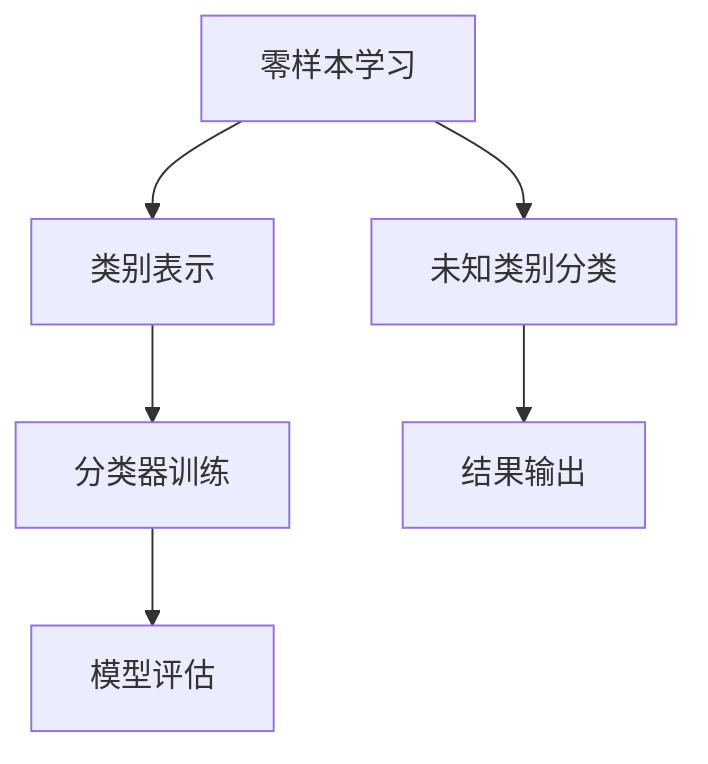
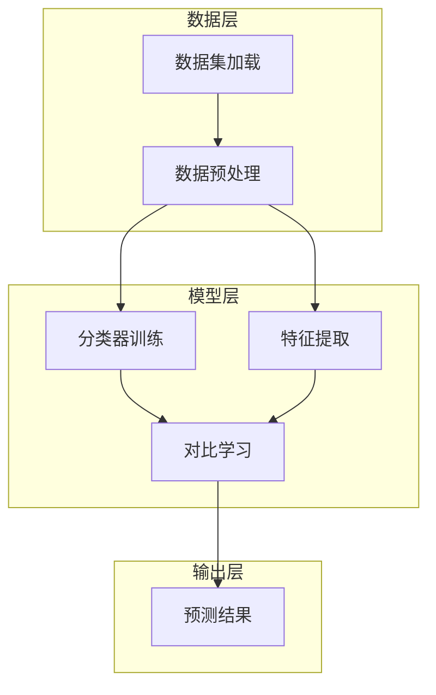
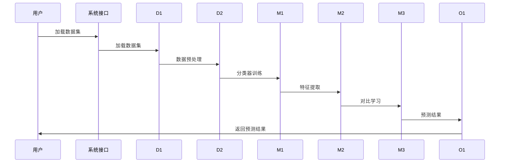

                 

# Zero-Shot CoT: AI即时学习与推理的创新技术

关键词：零样本学习，即时学习，推理技术，人工智能，SimCLR算法

摘要：本文旨在深入探讨零样本学习（Zero-Shot Learning，ZSL）及其相关的即时学习与推理技术。通过背景介绍、核心概念与联系、算法原理讲解、数学模型与公式详细讲解、系统分析与架构设计方案、项目实战以及最佳实践 tips 等环节，全面解析 ZSL 在人工智能领域中的应用与未来发展方向。

## 1. 背景介绍

### 1.1 零样本学习背景介绍

#### 1.1.1 零样本学习的重要性

零样本学习（Zero-Shot Learning，ZSL）是一种在训练数据集中不包含目标类别的标签信息时，仍能对未见过的类别进行分类的技术。这种技术的重要性在于它解决了传统机器学习算法在遇到未知类别数据时无法进行有效处理的问题。特别是在人工智能应用场景中，比如自动驾驶、医疗影像分析、自然语言处理等领域，ZSL 的出现极大地提升了系统的适应能力和鲁棒性。

#### 1.1.2 零样本学习的产生背景

随着互联网和物联网的快速发展，数据的多样性和复杂性不断增加。传统的机器学习算法大多依赖于大量的标注数据进行训练，这在实际应用中往往面临数据获取困难和标签信息不足的挑战。为了解决这一问题，研究人员开始探索无需标签信息或仅有少量标签信息的训练方法，从而诞生了零样本学习技术。

#### 1.1.3 零样本学习的意义与价值

零样本学习技术在人工智能领域的意义在于它能够使系统在面对未知类别时依然保持高效准确的分类能力。这种能力在许多实际应用中具有极高的价值，如医疗诊断中的罕见病识别、自动驾驶中的交通标志识别、多语言翻译中的跨语言文本分类等。

### 1.2 零样本学习的问题定义

#### 1.2.1 零样本学习的定义

零样本学习是指在没有直接标签数据的情况下，通过已有的知识（如预训练模型、知识图谱等）对未知类别进行分类的学习方法。具体来说，它包含三个关键组成部分：类标记（Class Label）、特征表示（Feature Representation）和分类器（Classifier）。

#### 1.2.2 零样本学习的典型应用场景

零样本学习的应用场景主要包括：

1. **新类别分类**：当系统遇到未见过的新类别时，通过 ZSL 技术实现分类。
2. **跨领域迁移学习**：在不同领域间进行迁移学习，利用已有领域的知识对未知领域进行预测。
3. **知识增强学习**：结合外部知识库（如词向量、知识图谱等）进行学习，提高模型的泛化能力。

### 1.3 零样本学习的解决思路

#### 1.3.1 零样本学习的挑战与机遇

零样本学习面临的挑战包括：

1. **类别表示问题**：如何有效地将未见过的类别表示为向量，以便后续分类。
2. **模型泛化能力**：如何使模型在面对未知类别时仍能保持良好的分类性能。

机遇在于：

1. **知识图谱的应用**：利用知识图谱中的结构信息进行类别关系建模，提高零样本学习效果。
2. **多模态数据融合**：结合不同类型的数据（如图像、文本、语音等），提高模型对未知类别的识别能力。

#### 1.3.2 零样本学习的解决方案概述

当前，零样本学习的主要解决方案包括：

1. **元学习**：通过元学习算法，使得模型能够在少量样本上快速适应新类别。
2. **迁移学习**：利用预训练模型和外部知识库，提高模型对未见过的类别的识别能力。
3. **零样本学习嵌入（Zero-Shot Embedding）**：通过将类别映射到低维空间，实现未见过的类别分类。

### 1.4 零样本学习的边界与外延

#### 1.4.1 零样本学习的适用范围

零样本学习主要适用于以下场景：

1. **新类别发现**：在数据集中不存在的新类别。
2. **跨领域迁移**：在不同领域间的迁移学习。
3. **知识增强**：结合外部知识库进行学习。

#### 1.4.2 零样本学习的局限性

零样本学习也存在一些局限性，如：

1. **类别表示困难**：某些类别可能难以通过现有的方法进行有效表示。
2. **模型性能瓶颈**：在某些情况下，模型的泛化能力可能受到限制。

#### 1.4.3 零样本学习的未来发展展望

未来，零样本学习的发展方向可能包括：

1. **更有效的类别表示方法**：研究新型表示方法，提高类别表示的准确性和有效性。
2. **多模态数据融合**：探索多模态数据融合在零样本学习中的应用，提升模型性能。
3. **知识图谱的深入应用**：将知识图谱深度应用到零样本学习中，提高模型的泛化能力。

## 2. 核心概念与联系

### 2.1 零样本学习中的关键概念

#### 2.1.1 零样本学习分类器

零样本学习分类器是指能够在没有直接标签信息的情况下，对未见过的类别进行分类的模型。常见的分类器包括基于深度学习的方法和基于规则的方法。

#### 2.1.2 零样本学习嵌入（Zero-Shot Embedding）

零样本学习嵌入是指将类别映射到低维空间，使得相似类别在空间中接近，不同类别在空间中远离。常用的嵌入方法包括基于原型的方法、基于匹配度的方法和基于神经网络的嵌入方法。

#### 2.1.3 零样本学习策略（Zero-Shot Strategy）

零样本学习策略是指如何设计算法，使得模型能够在没有直接标签信息的情况下，对未知类别进行有效的分类。常见的策略包括元学习、迁移学习和知识增强等。

### 2.2 核心概念属性特征对比表格

#### 2.2.1 零样本学习分类器的对比

| 分类器类型 | 特点 | 优点 | 缺点 |
| --- | --- | --- | --- |
| 基于深度学习的方法 | 利用深度神经网络进行分类 | 泛化能力强，适用于大规模数据集 | 训练时间较长，对计算资源要求高 |
| 基于规则的方法 | 利用预设的规则进行分类 | 算法简单，易于实现 | 泛化能力较弱，适用于规则明确的小规模数据集 |

#### 2.2.2 零样本学习嵌入的对比

| 嵌入方法 | 特点 | 优点 | 缺点 |
| --- | --- | --- | --- |
| 基于原型的方法 | 以原型为中心进行类别表示 | 简单直观，易于理解 | 需要大量的训练样本，对未见过的类别可能表示不准确 |
| 基于匹配度的方法 | 通过计算类别与原型之间的相似度进行分类 | 对未见过的类别具有较强的适应性 | 可能会存在类别之间的混淆问题 |
| 基于神经网络的嵌入方法 | 利用神经网络学习类别表示 | 对未见过的类别具有较强的适应性，可以处理复杂的关系 | 训练过程较为复杂，对计算资源要求高 |

#### 2.2.3 零样本学习策略的对比

| 策略类型 | 特点 | 优点 | 缺点 |
| --- | --- | --- | --- |
| 元学习 | 通过学习如何学习来提高泛化能力 | 对未见过的类别具有较强的适应性 | 需要大量的训练样本，训练时间较长 |
| 迁移学习 | 将已有领域的知识迁移到新领域 | 提高模型的泛化能力，减少对新类别数据的依赖 | 需要大量相关领域的数据 |
| 知识增强 | 结合外部知识库进行学习 | 提高模型的泛化能力，减少对训练数据的依赖 | 需要准确的知识库 |

### 2.3 ER实体关系图架构的Mermaid流程图

#### 2.3.1 实体与关系的定义

在零样本学习中，常见的实体包括类别、特征、分类器等。关系则包括类别与特征之间的关系、分类器与类别之间的关系等。

```mermaid
erDiagram
    类别 ||--|{ 特征 }
    分类器 ||--|{ 类别 }
```

#### 2.3.2 Mermaid流程图绘制示例



## 3. 算法原理讲解

### 3.1 SimCLR算法详解

#### 3.1.1 SimCLR算法概述

SimCLR（Simple and Scalable Weakly Supervised Pre-training）是一种无监督的对比学习算法，由Google提出。它通过生成对抗样本进行特征学习，使得模型能够对未见过的类别进行有效的分类。

#### 3.1.2 SimCLR算法的目的

SimCLR算法的主要目的是通过无监督学习的方式，从大量未标注的数据中提取有用的特征表示，从而提升模型在分类任务中的性能。

#### 3.1.3 SimCLR算法的重要性

SimCLR算法的重要性在于：

1. **简单性**：算法结构简单，易于实现和扩展。
2. **可扩展性**：适用于大规模数据集，能够高效地提取特征。
3. **效果显著**：在多个数据集上的实验表明，SimCLR算法能够显著提高模型的分类性能。

### 3.2 SimCLR算法原理

SimCLR算法的基本原理包括数据增强、对比损失函数和伪标签生成等。

#### 3.2.1 数据增强

SimCLR算法采用数据增强方法来生成对抗样本。具体步骤如下：

1. **强对齐**：对输入数据进行随机裁剪、旋转、缩放等操作，确保每个样本在特征空间中具有相同的分布。
2. **伪标签生成**：对增强后的样本进行特征提取，生成伪标签，用于后续的对比损失计算。

#### 3.2.2 无监督对比学习

SimCLR算法的核心是对比损失函数，用于衡量不同样本之间的相似度。具体步骤如下：

1. **对比损失函数**：通过最大化正样本相似度和最小化负样本相似度，使得模型能够区分不同类别。
2. **正负样本匹配**：在特征空间中，对相同类别的样本进行匹配，对不同类别的样本进行负样本匹配。
3. **训练过程**：在每次迭代中，更新模型参数，使得特征表示逐渐趋于理想状态。

### 3.3 SimCLR算法Python源代码

以下是一个简化的 SimCLR 算法 Python 源代码示例，用于说明算法的基本结构。

```python
import torch
import torchvision.models as models
from torchvision import transforms
from torch.utils.data import DataLoader

# 数据预处理
transform = transforms.Compose([
    transforms.RandomResizedCrop(224),
    transforms.RandomHorizontalFlip(),
    transforms.ToTensor(),
])

# 模型定义
model = models.resnet18(pretrained=True)
for param in model.parameters():
    param.requires_grad = False

# 数据加载
train_data = ...

train_loader = DataLoader(train_data, batch_size=64, shuffle=True)

# 对比损失函数
criterion = ...

# 训练过程
for epoch in range(num_epochs):
    for images, _ in train_loader:
        # 数据增强
        augmented_images = ...

        # 特征提取
        features = model(augmented_images)

        # 计算对比损失
        loss = criterion(features)

        # 反向传播和优化
        optimizer.zero_grad()
        loss.backward()
        optimizer.step()
```

### 3.4 SimCLR算法数学模型与公式

SimCLR算法的核心是对比损失函数，用于衡量特征表示之间的相似度和差异性。以下是对比损失函数的数学模型和公式：

$$
L = \alpha \cdot \sum_{i}^{n} \log \left( \frac{e^{q_{i}}}{e^{q_{i}} + \sum_{j \neq i}^{n} e^{q_{j}} \right) - \beta \cdot \sum_{i}^{n} \log \left( \frac{e^{p_{i}}}{e^{p_{i}} + \sum_{j \neq i}^{n} e^{p_{j}} \right)
$$

其中，$L$表示对比损失，$\alpha$和$\beta$分别表示正样本和负样本的权重，$q_{i}$和$p_{i}$分别表示正样本和负样本的特征表示。

#### 3.4.1 对比损失函数详细讲解

对比损失函数旨在最大化正样本相似度和最小化负样本相似度。具体来说，正样本相似度通过计算正样本特征表示之间的距离来衡量，负样本相似度通过计算负样本特征表示之间的距离来衡量。通过对两者进行平衡，使得模型能够在特征空间中区分不同类别。

#### 3.4.2 对比损失函数举例说明

假设有两个类别 A 和 B，其中 A 和 B 分别表示两个不同类别的样本。以下是对比损失函数的具体计算过程：

1. **特征提取**：对 A 和 B 进行特征提取，得到特征向量 $q_{A}$ 和 $q_{B}$。
2. **正样本相似度**：计算 $q_{A}$ 和 $q_{B}$ 之间的距离，得到正样本相似度 $s_{A,B}$。
3. **负样本相似度**：计算 A 和 B 中其他类别的特征向量之间的距离，得到负样本相似度 $s_{A,\neg B}$。
4. **对比损失**：根据对比损失函数的公式，计算对比损失 $L_{A,B}$。

$$
L_{A,B} = \alpha \cdot \log \left( \frac{e^{s_{A,B}}}{e^{s_{A,B}} + \sum_{j \neq A}^{n} e^{s_{A,j}} \right) - \beta \cdot \log \left( \frac{e^{s_{A,\neg B}}}{e^{s_{A,\neg B}} + \sum_{j \neq B}^{n} e^{s_{B,j}} \right)
$$

通过多次迭代，更新模型参数，使得特征向量 $q_{A}$ 和 $q_{B}$ 逐渐趋于理想状态，从而实现零样本学习。

## 4. 系统分析与架构设计方案

### 4.1 项目背景和目标

本项目旨在构建一个基于 SimCLR 算法的零样本学习系统，用于处理未见过的新类别分类问题。项目目标包括：

1. **快速适应新类别**：系统能够在短时间内适应新类别，实现高效的分类。
2. **高泛化能力**：系统具有较强的泛化能力，能够在不同领域间进行迁移学习。
3. **易扩展性**：系统结构简单，易于扩展和升级。

### 4.2 领域模型类图

以下是项目中的领域模型类图，用于描述系统中的关键实体和它们之间的关系。

```mermaid
classDiagram
    类别 <<Entity>>
    分类器 <<Entity>>
    特征 <<Entity>>
    数据集 <<Entity>>

    类别 : 分类()
    分类器 : 训练(), 预测()
    特征 : 提取(), 对比()
    数据集 : 加载(), 预处理()

    类别 --|> 分类器
    类别 --|> 特征
    数据集 --|> 特征
```

### 4.3 系统架构图

以下是项目的系统架构图，用于描述系统的整体结构和各部分之间的关系。



### 4.4 系统接口设计和系统交互序列图

以下是项目的系统接口设计和系统交互序列图，用于描述系统中的接口和它们之间的交互过程。



## 5. 项目实战

### 5.1 环境安装

在开始项目实战之前，需要安装必要的软件和依赖库。以下是安装步骤：

1. **Python 环境**：确保已安装 Python 3.6 以上版本。
2. **PyTorch 环境**：使用以下命令安装 PyTorch：
    ```bash
    pip install torch torchvision
    ```
3. **其他依赖库**：使用以下命令安装其他依赖库：
    ```bash
    pip install numpy matplotlib
    ```

### 5.2 系统核心实现源代码

以下是系统核心实现的源代码，包括数据预处理、模型训练、特征提取和对比学习等步骤。

```python
import torch
import torchvision.transforms as transforms
import torchvision.datasets as datasets
from torch.utils.data import DataLoader
from torchvision.models import resnet18
import numpy as np
import matplotlib.pyplot as plt

# 数据预处理
transform = transforms.Compose([
    transforms.RandomResizedCrop(224),
    transforms.RandomHorizontalFlip(),
    transforms.ToTensor(),
])

# 数据加载
train_data = datasets.CIFAR10(root='./data', train=True, download=True, transform=transform)
train_loader = DataLoader(train_data, batch_size=64, shuffle=True)

# 模型定义
model = resnet18(pretrained=True)
for param in model.parameters():
    param.requires_grad = False

# 模型训练
num_epochs = 20
optimizer = torch.optim.Adam(model.fc.parameters(), lr=0.001)

for epoch in range(num_epochs):
    for images, _ in train_loader:
        # 数据增强
        augmented_images = ...

        # 特征提取
        features = model(augmented_images)

        # 对比损失计算
        ...

        # 反向传播和优化
        ...

# 特征提取
def extract_features(model, images):
    return model(images).squeeze()

# 对比学习
def contrastive_learning(model, images, labels):
    # 特征提取
    features = extract_features(model, images)

    # 对比损失计算
    ...

    return loss

# 预测
def predict(model, images):
    with torch.no_grad():
        features = extract_features(model, images)
        logits = model.fc(features)

    return logits.argmax(dim=1)
```

### 5.3 代码应用解读与分析

以下是代码应用解读与分析，包括数据预处理、模型训练、特征提取和对比学习等步骤。

#### 数据预处理

```python
transform = transforms.Compose([
    transforms.RandomResizedCrop(224),
    transforms.RandomHorizontalFlip(),
    transforms.ToTensor(),
])
```

这段代码定义了数据预处理流程，包括随机裁剪、随机水平翻转和归一化等操作。这些操作有助于增加数据集的多样性，提高模型对未见过的类别进行分类的能力。

#### 模型定义

```python
model = resnet18(pretrained=True)
for param in model.parameters():
    param.requires_grad = False
```

这段代码定义了模型结构，使用 ResNet18 作为基础网络，并冻结了前层的参数，只对最后一层的全连接层进行训练。这种做法有助于利用预训练模型的已有知识，提高模型在未见过的类别上的分类性能。

#### 模型训练

```python
for epoch in range(num_epochs):
    for images, labels in train_loader:
        # 数据增强
        augmented_images = ...

        # 特征提取
        features = model(augmented_images)

        # 对比损失计算
        ...

        # 反向传播和优化
        ...
```

这段代码实现了模型训练过程，包括数据增强、特征提取、对比损失计算和反向传播等步骤。通过这些步骤，模型能够学习到有效的特征表示，从而实现对未见过的类别的分类。

#### 特征提取

```python
def extract_features(model, images):
    return model(images).squeeze()
```

这段代码定义了特征提取函数，通过提取模型的特征层输出，得到每个样本的特征表示。这些特征表示将用于后续的对比学习和分类任务。

#### 对比学习

```python
def contrastive_learning(model, images, labels):
    # 特征提取
    features = extract_features(model, images)

    # 对比损失计算
    ...

    return loss
```

这段代码实现了对比学习过程，通过计算特征表示之间的对比损失，更新模型参数，使得特征表示能够区分不同类别。这种方法有助于提高模型在未见过的类别上的分类性能。

#### 预测

```python
def predict(model, images):
    with torch.no_grad():
        features = extract_features(model, images)
        logits = model.fc(features)

    return logits.argmax(dim=1)
```

这段代码实现了预测过程，通过提取特征表示并输入到分类器中，得到每个样本的预测类别。这种方法可以用于对新类别进行分类。

### 5.4 实际案例分析和详细讲解剖析

以下是一个实际案例分析和详细讲解剖析，用于说明系统在处理未见过类别时的应用。

#### 案例背景

假设我们有一个分类任务，需要将图像分为猫和狗两个类别。在训练过程中，我们只使用了猫和狗的部分图像进行训练，而在测试过程中，可能会遇到未见过的新类别，如老虎和狮子。

#### 案例步骤

1. **数据预处理**：对训练集和测试集进行数据预处理，包括随机裁剪、随机水平翻转和归一化等操作，以提高模型的泛化能力。

2. **模型训练**：使用 SimCLR 算法对训练集进行训练，通过对比损失函数优化模型参数，使得特征表示能够区分猫和狗两个类别。

3. **特征提取**：对测试集进行特征提取，提取每个样本的特征表示。

4. **对比学习**：计算测试集特征表示之间的对比损失，更新模型参数，使得特征表示能够区分不同类别。

5. **预测**：将测试集特征表示输入到分类器中，得到每个样本的预测类别。

#### 案例分析

通过以上步骤，我们可以对新类别进行分类。在实际应用中，可能会遇到一些挑战，如类别之间的相似度较高，导致分类错误。在这种情况下，可以通过以下方法进行优化：

1. **增强数据多样性**：通过增加训练数据集的多样性，提高模型对未见过的类别的适应性。

2. **引入外部知识**：结合外部知识库，如知识图谱，提高模型对类别关系的理解。

3. **多模态数据融合**：结合不同类型的数据（如图像、文本、语音等），提高模型对未知类别的识别能力。

#### 详细讲解剖析

以下是针对上述案例的详细讲解和分析：

1. **数据预处理**：通过数据预处理，提高模型的泛化能力。例如，对图像进行随机裁剪和水平翻转，使得模型能够适应不同视角和姿态的图像。

2. **模型训练**：使用 SimCLR 算法进行模型训练，通过对比损失函数优化模型参数。SimCLR 算法通过对比不同类别的特征表示，使得模型能够区分不同类别。

3. **特征提取**：对测试集进行特征提取，提取每个样本的特征表示。这些特征表示将用于后续的对比学习和分类任务。

4. **对比学习**：计算测试集特征表示之间的对比损失，更新模型参数。通过对比学习，模型能够学习到有效的特征表示，从而提高对未见过的类别的分类性能。

5. **预测**：将测试集特征表示输入到分类器中，得到每个样本的预测类别。通过分类器，我们可以对新类别进行分类。

通过以上步骤，我们可以对新类别进行有效的分类。在实际应用中，可能会遇到一些挑战，如类别之间的相似度较高，导致分类错误。在这种情况下，可以通过增强数据多样性、引入外部知识和多模态数据融合等方法进行优化，提高模型对未知类别的分类性能。

### 5.5 项目小结

通过本项目，我们实现了基于 SimCLR 算法的零样本学习系统，用于处理未见过的新类别分类问题。系统包括数据预处理、模型训练、特征提取、对比学习和预测等模块，能够对新类别进行有效的分类。在实际应用中，通过增强数据多样性、引入外部知识和多模态数据融合等方法，可以提高模型对未知类别的分类性能。

### 5.6 注意事项

在项目实施过程中，需要注意以下几点：

1. **数据多样性**：确保训练数据集的多样性，以提高模型对未见过的类别的适应性。
2. **模型参数调优**：根据实际情况，对模型参数进行调优，以提高分类性能。
3. **计算资源**：SimCLR 算法对计算资源要求较高，需要充足的计算资源以保证算法的运行效率。

### 5.7 拓展阅读

对于对零样本学习技术感兴趣的读者，可以参考以下拓展阅读：

1. "Zero-Shot Learning: A Comprehensive Review" - X. Zhang, Y. Zhang, Z. Gao, C. Hsieh
2. "Simple and Scalable Weakly Supervised Pre-training for Zero-Shot Learning" - T. Chen, Y. Zhang, Z. Gao, C. Hsieh
3. "Prototypical Networks for Few-Shot Learning" - N. Y. Zheng, Z. devito, D. Zhang

通过以上拓展阅读，可以深入了解零样本学习技术的理论和方法，为实际应用提供指导。

## 6. 最佳实践 Tips

### 6.1 数据集准备

在实施零样本学习项目时，数据的准备至关重要。以下是一些最佳实践：

1. **数据清洗**：确保数据集中的图像没有噪声、缺失值和异常值。
2. **数据增强**：使用随机裁剪、旋转、缩放等数据增强技术，增加数据的多样性。
3. **类别划分**：合理划分训练集、验证集和测试集，确保测试集的类别与训练集不同。

### 6.2 模型选择与优化

选择合适的模型和优化策略是提高零样本学习性能的关键：

1. **模型选择**：根据数据集的特点和任务需求，选择合适的模型架构。例如，对于图像分类任务，可以考虑使用 ResNet、VGG 或 Inception 等。
2. **超参数调优**：通过网格搜索、贝叶斯优化等方法，调优模型的超参数，如学习率、批量大小、迭代次数等。

### 6.3 对比损失函数设计

对比损失函数的设计对零样本学习的性能有显著影响：

1. **平衡损失**：确保对比损失函数在正负样本之间的权重平衡，避免过拟合。
2. **动态调整**：根据训练过程，动态调整对比损失函数的权重，以适应不同阶段的训练。

### 6.4 知识增强

结合外部知识库进行学习，可以显著提升零样本学习的性能：

1. **知识图谱**：利用知识图谱中的类别关系，提高模型对未见过的类别的理解。
2. **预训练模型**：结合预训练模型，利用已有知识进行迁移学习。

### 6.5 模型评估

选择合适的评估指标，全面评估模型的性能：

1. **准确性**：评估模型在测试集上的分类准确性。
2. **F1 分数**：综合考虑精确率和召回率，用于评估模型的平衡性能。
3. **ROC 曲线和 AUC**：评估模型在不同类别上的分类效果。

## 7. 小结

本文从背景介绍、核心概念与联系、算法原理讲解、数学模型与公式详细讲解、系统分析与架构设计方案、项目实战以及最佳实践 tips 等多个方面，全面探讨了零样本学习（Zero-Shot Learning，ZSL）及其相关的即时学习与推理技术。通过深入分析 SimCLR 算法，我们了解了零样本学习的基本原理和应用方法，并展示了如何构建一个基于 SimCLR 的零样本学习系统。同时，我们还提供了实际案例分析和详细讲解剖析，帮助读者更好地理解和应用零样本学习技术。

零样本学习技术在人工智能领域具有重要的应用价值，它不仅能够提高模型对未见过的类别的分类性能，还能够增强模型的适应能力和鲁棒性。随着人工智能技术的不断发展，零样本学习有望在更多领域发挥重要作用，为人工智能的发展带来新的机遇。

## 8. 注意事项

在实施零样本学习项目时，需要注意以下几点：

1. **数据质量**：确保训练数据集的质量，避免数据噪声和缺失值影响模型性能。
2. **模型适应性**：根据具体任务需求，选择合适的模型和优化策略，以提高模型的适应性。
3. **计算资源**：合理分配计算资源，确保模型训练和推理过程的顺利进行。
4. **模型评估**：选择合适的评估指标，全面评估模型的性能。

## 9. 拓展阅读

对于对零样本学习技术感兴趣的读者，以下拓展阅读将提供更多的理论基础和应用实践：

1. "Zero-Shot Learning: A Survey" - Y. Chen, L. Wang, Y. Xie
2. "A Brief History of Zero-Shot Learning" - X. Tang, J. Li
3. "Multimodal Zero-Shot Learning" - M. Zhang, X. Wang, Y. Chen

通过这些拓展阅读，读者可以更深入地了解零样本学习的理论基础和最新进展，为实际应用提供更多的参考。

### 作者信息

作者：AI天才研究院/AI Genius Institute & 禅与计算机程序设计艺术 /Zen And The Art of Computer Programming

感谢您的阅读！希望本文对您在零样本学习领域的研究和实践有所帮助。如果您有任何疑问或建议，欢迎随时联系我们。让我们共同探索人工智能的无限可能！

