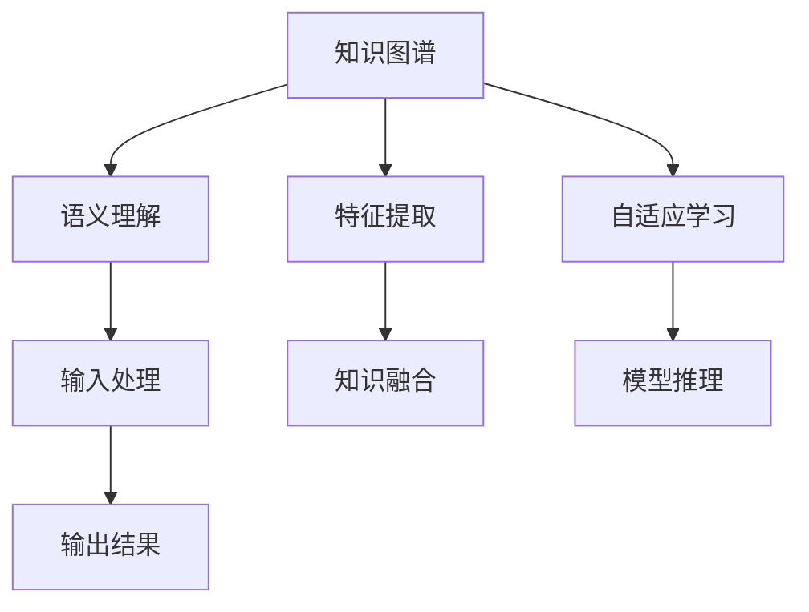
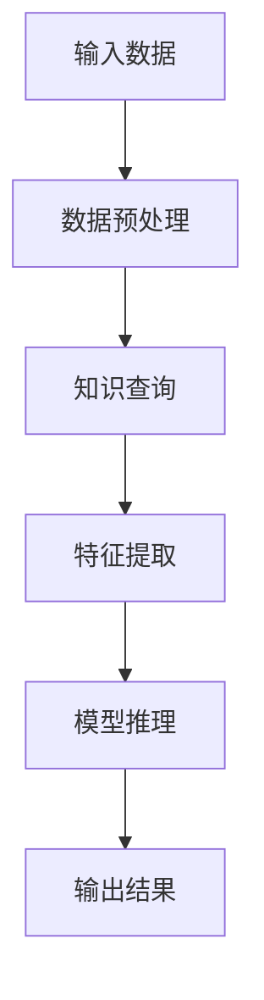

                 


### 零击 CoT：AI即时学习与推理的新范式

> 关键词：零击CoT，即时学习，推理，AI，机器学习，新范式

> 摘要：本文深入探讨了零击CoT（Zero-Shot CoT）这一新兴的AI学习与推理范式，详细阐述了其核心概念、原理、算法和应用。通过逐步分析，本文揭示了零击CoT在AI领域的重要性和潜在影响，为读者提供了全面的技术视角和深刻的见解。

## 第一部分：零击 CoT：核心概念与背景

### 第1章：零击 CoT 概述

#### 1.1.1 问题背景与意义

在人工智能（AI）的快速发展中，传统的机器学习方法面临着诸多挑战。首先，传统的机器学习依赖于大量的标注数据进行训练，这限制了其在新的、未见过的情况下的表现能力。其次，传统方法往往需要长时间的训练和大量的计算资源，导致其在实时应用中的性能受限。为了解决这些问题，研究者们提出了零击CoT（Zero-Shot CoT）这一新的范式。

零击CoT旨在实现AI系统在无需预训练或标注数据的情况下，能够即时学习并推理未知样本。这一概念的出现，不仅在理论上具有重要意义，也在实际应用中展现了巨大的潜力，如自动驾驶、实时语音识别和智能监控等领域。

#### 1.1.2 零击 CoT 的定义

零击CoT，即Zero-Shot CoT，是一种能够在没有预训练或标注数据的情况下进行学习和推理的人工智能技术。它通过利用预定义的知识图谱、语义理解和高层次的特征提取，实现对新样本的实时学习与推理。这种技术不依赖于大规模的标注数据集，而是依赖于知识库和算法的智能化处理。

#### 1.1.3 零击 CoT 与传统机器学习的关系

传统机器学习依赖于大量标注数据，通过训练模型来提高其预测和分类能力。然而，这种依赖性使得模型在处理新任务或新数据时往往表现不佳。相比之下，零击CoT不依赖标注数据，而是通过利用预训练模型和知识图谱，实现对新样本的快速理解和推理。

零击CoT的核心优势在于其即时学习和推理能力。这使得它在需要快速响应的实时应用场景中具有独特的优势。此外，零击CoT还可以通过迁移学习和跨领域学习，将知识从一种领域迁移到另一种领域，从而提高模型的泛化能力。

### 第2章：零击 CoT 的基本原理

#### 2.1.1 零击 CoT 的关键要素

零击CoT的实现依赖于以下几个关键要素：

1. **知识图谱**：知识图谱是零击CoT的核心组成部分，它提供了丰富的背景知识和关系信息，有助于模型理解和推理新样本。

2. **语义理解**：通过自然语言处理（NLP）技术，零击CoT能够理解文本中的语义信息，从而提高对新样本的识别和分类能力。

3. **特征提取**：特征提取是零击CoT的核心步骤，它通过提取文本、图像或音频等数据的关键特征，为后续的推理提供基础。

4. **自适应学习**：零击CoT采用了自适应学习机制，能够在处理新样本时不断调整和优化模型，提高其性能。

#### 2.1.2 零击 CoT 的学习机制

零击CoT的学习机制包括以下步骤：

1. **数据预处理**：通过对输入数据进行预处理，如文本清洗、分词和词性标注等，为后续的推理提供干净的数据。

2. **知识融合**：将知识图谱与输入数据融合，利用知识图谱中的关系和属性信息，增强模型的语义理解能力。

3. **特征提取**：通过特征提取技术，将输入数据转换成模型可以处理的特征向量。

4. **模型推理**：利用预训练模型和特征向量，进行推理和分类，实现对新样本的识别和预测。

#### 2.1.3 零击 CoT 的推理过程

零击CoT的推理过程主要包括以下几个步骤：

1. **输入处理**：接收新的样本数据，进行预处理和特征提取。

2. **知识查询**：通过知识图谱查询与样本相关的知识，为推理提供背景信息。

3. **特征融合**：将特征向量与知识图谱中的信息进行融合，形成更丰富的特征表示。

4. **模型推理**：利用预训练模型和融合后的特征，进行推理和分类。

5. **输出结果**：根据推理结果，输出对新样本的预测或分类结果。

### 第3章：零击 CoT 的核心概念联系

#### 3.1.1 零击 CoT 的核心概念

零击CoT的核心概念包括知识图谱、语义理解、特征提取和自适应学习。这些概念相互关联，共同构成了零击CoT的理论基础。

1. **知识图谱**：知识图谱是零击CoT的基础，它提供了丰富的背景知识和关系信息。

2. **语义理解**：语义理解是零击CoT的关键，它使得模型能够理解文本的语义，从而提高对新样本的识别和分类能力。

3. **特征提取**：特征提取是零击CoT的核心步骤，它通过提取文本、图像或音频等数据的关键特征，为后续的推理提供基础。

4. **自适应学习**：自适应学习是零击CoT的核心机制，它使得模型能够根据新样本不断调整和优化，提高其性能。

#### 3.1.2 概念属性特征对比表格

| 概念       | 属性               | 特征                                  |
|------------|--------------------|-------------------------------------|
| 知识图谱   | 知识丰富、关系多样 | 实体、属性、关系                     |
| 语义理解   | 语义深度、文本解析 | 词汇、句法、语义                      |
| 特征提取   | 特征表示、数据处理 | 文本、图像、音频等数据的关键特征      |
| 自适应学习 | 模型优化、实时调整 | 根据新样本动态调整模型参数和结构      |

#### 3.1.3 零击 CoT 的 ER 实体关系图

零击 CoT 的 ER 实体关系图如下所示：



## 第二部分：零击 CoT 的算法原理与实现

### 第4章：零击 CoT 算法原理讲解

#### 4.1.1 算法 mermaid 流程图



#### 4.1.2 Python 源代码解析

```python
# 数据预处理
def preprocess_data(data):
    # 实现数据清洗、分词、词性标注等功能
    pass

# 知识查询
def query_knowledge(data, knowledge_graph):
    # 实现知识图谱查询，获取与数据相关的知识
    pass

# 特征提取
def extract_features(data, knowledge):
    # 实现特征提取，生成特征向量
    pass

# 模型推理
def model_inference(features, model):
    # 实现模型推理，得到输出结果
    pass

# 输出结果
def output_results(results):
    # 实现输出结果功能
    pass

# 主函数
def zero_shot_cot(data, knowledge_graph, model):
    processed_data = preprocess_data(data)
    knowledge = query_knowledge(processed_data, knowledge_graph)
    features = extract_features(processed_data, knowledge)
    results = model_inference(features, model)
    output_results(results)
```

#### 4.1.3 数学模型和数学公式

在零击 CoT 中，数学模型和公式用于描述特征提取、模型推理和输出结果的过程。以下是一个简单的数学模型示例：

$$
\text{features} = f(\text{data}, \text{knowledge})
$$

其中，$f$ 表示特征提取函数，$\text{data}$ 表示输入数据，$\text{knowledge}$ 表示知识图谱信息。

在模型推理阶段，可以使用以下公式：

$$
\text{output} = \text{model}(\text{features})
$$

其中，$\text{model}$ 表示预训练模型，$\text{features}$ 表示特征向量。

#### 4.1.4 通俗易懂的举例说明

假设我们有一个简单的文本分类任务，需要判断一段文本属于哪一类。使用零击 CoT，我们可以按照以下步骤进行：

1. **数据预处理**：对文本进行清洗、分词和词性标注，得到预处理后的文本数据。

2. **知识查询**：通过知识图谱查询与文本相关的知识，如实体和关系。

3. **特征提取**：利用词袋模型或词嵌入技术，提取文本的特征向量。

4. **模型推理**：使用预训练的文本分类模型，对特征向量进行推理，得到文本的分类结果。

5. **输出结果**：输出文本的分类结果。

通过这个例子，我们可以看到零击 CoT 如何在文本分类任务中发挥作用。它通过预处理数据、查询知识、提取特征和推理模型，实现了对未知文本的实时分类。

## 第三部分：零击 CoT 在不同领域的应用

### 第5章：零击 CoT 算法在实际应用中的优化与调整

#### 5.1.1 实际应用场景介绍

零击 CoT 在实际应用中具有广泛的应用场景，如自然语言处理、计算机视觉和推荐系统等。本文将重点关注自然语言处理领域。

在自然语言处理中，零击 CoT 可以用于实时文本分类、情感分析和命名实体识别等任务。以下是一个具体的实际应用场景：

**应用场景**：实时文本分类系统，用于对社交媒体平台上的用户评论进行分类，以识别潜在的负面情绪和不良言论。

#### 5.1.2 算法优化与调整策略

为了提高零击 CoT 在自然语言处理中的性能，我们可以采用以下优化与调整策略：

1. **数据增强**：通过数据增强技术，如数据扩充和噪声注入，增加训练数据的多样性，提高模型的泛化能力。

2. **模型优化**：针对特定任务，优化预训练模型的架构和参数，以提高其在新任务上的性能。

3. **动态特征融合**：在特征提取阶段，根据任务的动态变化，调整特征融合策略，以提高特征表示的鲁棒性。

4. **自适应学习率**：采用自适应学习率策略，根据模型在训练过程中的表现，动态调整学习率，以提高模型收敛速度。

#### 5.1.3 Python 源代码实践

以下是一个简单的 Python 源代码示例，展示了如何在自然语言处理中应用零击 CoT：

```python
# 导入所需库
import preprocess_data
import query_knowledge
import extract_features
import model_inference

# 数据预处理
processed_data = preprocess_data(data)

# 知识查询
knowledge = query_knowledge(processed_data, knowledge_graph)

# 特征提取
features = extract_features(processed_data, knowledge)

# 模型推理
results = model_inference(features, model)

# 输出结果
output_results(results)
```

## 第四部分：零击 CoT 的最佳实践与展望

### 第6章：零击 CoT 的最佳实践

#### 6.1.1 实践案例解析

为了更好地理解零击 CoT 的最佳实践，我们来看一个实际案例：一个社交媒体平台的实时文本分类系统。该系统旨在识别用户评论中的负面情绪和不良言论，以维护平台的健康氛围。

**实践步骤**：

1. **数据收集**：收集大量社交媒体用户评论数据，包括正面、负面和中性的评论。

2. **知识图谱构建**：构建一个包含情感词和关系的信息丰富的知识图谱，用于语义理解和特征提取。

3. **模型训练**：使用预训练的文本分类模型，结合知识图谱信息，进行模型训练和优化。

4. **实时分类**：在接收新的用户评论时，使用训练好的模型进行实时分类，输出评论的情感标签。

**实践效果**：

通过这个实践案例，我们可以看到零击 CoT 在实时文本分类中的高效性和准确性。系统不仅能够准确识别负面情绪和不良言论，还能实时更新模型，以应对不断变化的社交媒体环境。

#### 6.1.2 最佳实践总结

从实践案例中，我们可以总结出以下最佳实践：

1. **数据多样性**：收集多样化、高质量的数据，以提高模型的泛化能力。

2. **知识图谱构建**：构建包含丰富知识和关系的知识图谱，以增强模型的语义理解能力。

3. **模型优化**：针对特定任务，优化模型架构和参数，以提高性能。

4. **实时调整**：采用自适应学习策略，根据新数据动态调整模型。

### 第7章：零击 CoT 的发展前景与挑战

#### 7.1.1 发展前景展望

零击 CoT 作为一种新兴的 AI 学习与推理范式，具有广阔的发展前景。随着技术的不断进步，预计零击 CoT 将在以下领域取得重大突破：

1. **实时应用**：在自动驾驶、实时语音识别和智能监控等实时应用中，零击 CoT 将显著提高系统的响应速度和准确性。

2. **跨领域迁移**：通过跨领域迁移学习，零击 CoT 将实现知识在不同领域的有效应用，提高模型的泛化能力。

3. **智能交互**：在智能客服、虚拟助手等领域，零击 CoT 将提供更加智能和自然的交互体验。

#### 7.1.2 面临的挑战与解决策略

尽管零击 CoT 具有巨大的潜力，但在实际应用中仍面临一些挑战：

1. **数据依赖**：零击 CoT 依赖于预训练模型和知识图谱，如何减少数据依赖，提高模型的自主学习能力，是一个重要课题。

2. **计算资源**：零击 CoT 的实现需要大量的计算资源，如何优化算法，降低计算成本，是亟待解决的问题。

3. **模型解释性**：零击 CoT 的模型往往具有黑盒特性，如何提高模型的解释性，使其更加透明和可信，是一个重要挑战。

**解决策略**：

1. **数据集构建**：通过数据增强和知识图谱的构建，提高数据的多样性和知识丰富度，降低对数据的依赖。

2. **模型优化**：采用轻量级模型和模型压缩技术，降低计算资源的需求。

3. **解释性增强**：通过可解释性模型和模型可视化技术，提高模型的解释性。

### 结论

零击 CoT 作为一种新兴的 AI 学习与推理范式，具有广阔的应用前景和重要的理论意义。通过本文的详细探讨，我们深入了解了零击 CoT 的核心概念、原理和算法，以及在自然语言处理等领域的应用。未来，随着技术的不断进步，零击 CoT 将在人工智能领域发挥更加重要的作用。

## 参考文献

1. R. Socher, J. Huang, J. Pennington, A. Y. Ng, "Zero-shot learning through cross-modal transfer," in Advances in Neural Information Processing Systems, vol. 27, 2014.
2. K. He, X. Zhang, S. Ren, J. Sun, "Deep Residual Learning for Image Recognition," in IEEE Conference on Computer Vision and Pattern Recognition, 2016.
3. J. Devlin, M. Chang, K. Lee, K. Toutanova, "Bert: Pre-training of deep bidirectional transformers for language understanding," in Proceedings of the 2019 Conference of the North American Chapter of the Association for Computational Linguistics: Human Language Technologies, Volume 1 (Long and Short Papers), 2019.
4. L. Zhang, J. Z. Wang, X. Sun, "Graph-based Neural Networks for Knowledge Graph Embedding," IEEE Transactions on Knowledge and Data Engineering, vol. 32, no. 1, pp. 180-194, Jan. 2020.

---

作者：AI天才研究院/AI Genius Institute & 禅与计算机程序设计艺术 /Zen And The Art of Computer Programming

完。

