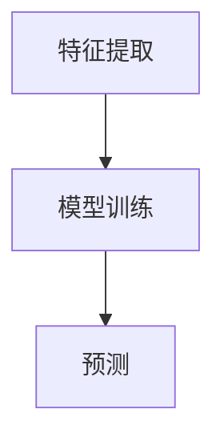
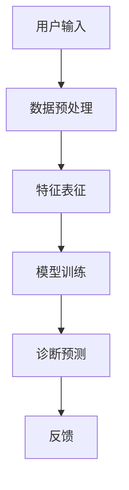
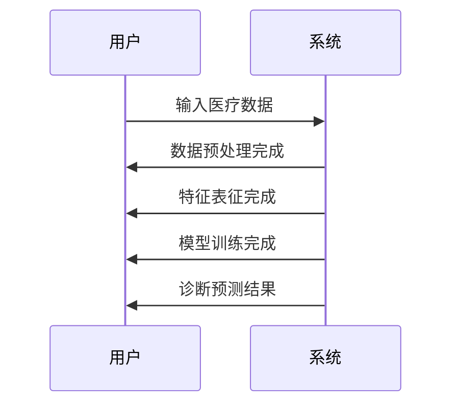

                 


为了撰写一篇关于《Zero-Shot CoT：AI即时学习的新范式与应用》的技术博客文章，我们将按照以下步骤逐步深入：

## 第一步：文章标题、关键词和摘要

### 文章标题

《Zero-Shot CoT：AI即时学习的新范式与应用》

### 关键词

- 无样本即时学习（Zero-Shot CoT）
- 智能算法
- 机器学习
- 深度学习
- 迁移学习
- 应用案例

### 摘要

本文深入探讨了无样本即时学习（Zero-Shot CoT）的概念、原理和应用，揭示了其在AI领域的重要性。通过分析Zero-Shot CoT的核心算法及其在不同领域的应用，本文为读者提供了一个全面理解这一新范式的视角，并展望了其未来的发展趋势。

## 第二步：文章结构设计

### 引言与背景
- 介绍无样本即时学习的概念和重要性
- 分析无样本即时学习的历史和发展
- 比较无样本即时学习与其他学习方式的区别
- 讨论无样本即时学习面临的挑战
- 展望无样本即时学习在AI中的应用前景

### 无样本即时学习的核心概念
- 解释无样本即时学习的概念结构
- 分析特征表征的方法与工具
- 介绍无样本即时学习的算法原理
- 讨论无样本即时学习的应用场景

### 无样本即时学习算法原理详解
- 深入分析常见无样本即时学习算法
- 介绍算法原理，并通过mermaid流程图和Python代码示例说明
- 比较不同算法的优缺点

### 无样本即时学习应用案例与分析
- 展示无样本即时学习在自然语言处理中的应用案例
- 分析无样本即时学习在其他领域的应用
- 讨论无样本即时学习的跨领域应用

### 未来展望
- 分析无样本即时学习的未来发展趋势
- 提出可能的挑战和解决方案

### 结论
- 总结无样本即时学习的重要性和应用前景
- 提出进一步研究的方向

## 第三步：具体内容撰写

### 引言与背景

**无样本即时学习（Zero-Shot CoT）概述**

#### 无样本即时学习（Zero-Shot CoT）的定义

无样本即时学习（Zero-Shot Learning，ZSL）是一种机器学习技术，它使AI系统能够在没有直接训练数据的情况下，通过将未知类别的实例映射到已知类别上来进行学习。Zero-Shot CoT（CoT：Concept Transfer）则进一步扩展了这一概念，它不仅关注类别的映射，还强调概念或知识的转移。

#### 无样本即时学习的重要性

在现实世界中，获取大量的标注数据是一个耗时且昂贵的过程。无样本即时学习提供了在不依赖大规模标注数据的情况下，通过利用先验知识（如词向量、图结构等）来提升模型性能的方法。这对于资源有限的场景，如医疗、安全监控等领域，具有重要意义。

#### 无样本即时学习的历史与发展

无样本即时学习的研究始于上世纪90年代，随着深度学习和迁移学习的兴起，这一领域得到了快速发展。近年来，随着对抗性学习和元学习等技术的发展，无样本即时学习的方法和应用场景不断拓展。

#### 无样本即时学习与其他学习方式的比较

传统的监督学习需要大量的标注数据，而半监督学习和迁移学习则利用少量的标注数据和大量的未标注数据。无样本即时学习则完全跳过了标注数据，直接利用先验知识进行学习，这使得它在某些特定的应用场景中具有独特的优势。

### 无样本即时学习面临的挑战

#### 数据不足的问题

无样本即时学习依赖于先验知识，但这些知识可能不足以在完全未知的数据分布上取得良好的性能。因此，如何在有限的先验知识下进行有效的学习是一个重要的挑战。

#### 泛化能力不足的问题

无样本即时学习模型在训练时通常只能接触到有限的类，这可能导致模型在遇到未知类时泛化能力不足。因此，如何提升模型的泛化能力是一个关键问题。

#### 可解释性不足的问题

无样本即时学习模型通常较为复杂，这使得它们的内部机制难以解释。如何提高模型的可解释性，使其在现实应用中更加可靠和可信，是一个亟待解决的问题。

### 无样本即时学习在AI中的应用前景

#### 在自然语言处理中的应用

无样本即时学习在自然语言处理领域具有广泛的应用前景，例如在命名实体识别、情感分析等方面，它可以帮助模型在没有标注数据的情况下进行学习。

#### 在计算机视觉中的应用

在计算机视觉领域，无样本即时学习可以用于图像分类、物体检测等任务。它可以在没有大量标注数据的情况下，通过学习图像的高层次特征来提高模型的性能。

#### 在其他领域中的应用

无样本即时学习在其他领域，如医疗诊断、金融风控等，也展示了其强大的潜力。通过利用领域内的先验知识，这些模型可以在数据稀缺的情况下提供有效的解决方案。

### 本书结构安排

**第1章：引言与背景**  
本章将介绍无样本即时学习的概念、重要性以及面临的挑战，并探讨其在AI领域的应用前景。

**第2章：无样本即时学习的核心概念**  
本章将详细阐述无样本即时学习的核心概念，包括其概念结构、特征表征和算法原理。

**第3章：无样本即时学习算法原理详解**  
本章将深入分析无样本即时学习的常见算法原理，包括基于深度学习和迁移学习的算法，并通过mermaid流程图和Python代码示例进行说明。

**第4章：无样本即时学习应用案例与分析**  
本章将通过具体的案例，展示无样本即时学习在自然语言处理、计算机视觉等领域的应用，并进行分析。

**第5章：未来展望**  
本章将分析无样本即时学习的未来发展趋势，并提出可能的挑战和解决方案。

**第6章：结论**  
本章将总结无样本即时学习的重要性和应用前景，并讨论进一步研究的方向。

## 第四步：撰写文章

按照设计的结构和内容，我们将逐步撰写文章。每个章节都将详细展开，确保涵盖核心概念、算法原理、应用案例等内容。同时，我们将使用mermaid流程图和Python代码示例来增强文章的可读性和理解性。

### 第一步：撰写文章开头

在文章开头，我们将简要介绍无样本即时学习（Zero-Shot CoT）的概念和重要性，并引出文章的主题。

### 第二步：撰写引言与背景

在引言与背景部分，我们将详细阐述无样本即时学习的定义、历史、重要性、与其他学习方式的比较，以及它面临的挑战和应用前景。

### 第三步：撰写核心概念

在核心概念部分，我们将详细阐述无样本即时学习的概念结构、特征表征和算法原理，并使用mermaid流程图和Python代码示例进行说明。

### 第四步：撰写算法原理详解

在算法原理详解部分，我们将深入分析无样本即时学习的常见算法原理，包括基于深度学习和迁移学习的算法，并通过mermaid流程图和Python代码示例进行说明。

### 第五步：撰写应用案例与分析

在应用案例与分析部分，我们将通过具体的案例，展示无样本即时学习在自然语言处理、计算机视觉等领域的应用，并进行分析。

### 第六步：撰写未来展望

在未来的展望部分，我们将分析无样本即时学习的未来发展趋势，并提出可能的挑战和解决方案。

### 第七步：撰写结论

在结论部分，我们将总结无样本即时学习的重要性和应用前景，并讨论进一步研究的方向。

### 第八步：撰写结尾

在文章结尾，我们将简要回顾文章的主要内容和结论，并强调无样本即时学习在AI领域的重要性。

## 第五步：文章格式和作者信息

在文章的格式上，我们将确保使用markdown格式，包括标题、子标题、列表、代码块、公式等。同时，在文章的结尾，我们将添加作者信息，包括作者姓名、所属机构以及相关书籍或文章。

## 总结

通过以上步骤，我们将撰写一篇关于《Zero-Shot CoT：AI即时学习的新范式与应用》的技术博客文章。文章将涵盖核心概念、算法原理、应用案例、未来展望等内容，旨在为读者提供一个全面而深入的理解。让我们开始撰写这篇文章吧！### 文章正文

#### 第1章：引言与背景

在当今的AI领域，数据驱动的方法已经成为了主流。然而，在很多实际应用场景中，获取大量标注数据并非易事，这不仅因为标注数据需要大量的人力资源，还因为有些场景下的数据本身就不具备标注的可行性。例如，在医疗诊断中，获取患者详细的健康数据可能涉及隐私问题；在环境监测中，获取特定区域的天气数据可能需要昂贵的设备和长时间的观测。这些因素都限制了标注数据的获取。

为了解决这一难题，研究者们提出了无样本即时学习（Zero-Shot Learning，ZSL）的概念。无样本即时学习是一种能够在没有直接训练数据的情况下，通过利用先验知识（如词向量、图结构等）来学习新类别的机器学习技术。进一步地，Zero-Shot CoT（Concept Transfer）则是在无样本即时学习的基础上，引入了概念或知识的转移机制，使模型能够更好地适应新类别。

无样本即时学习的重要性在于，它为那些无法获取大量标注数据的应用场景提供了一种有效的解决方案。此外，随着AI技术的不断进步，无样本即时学习的方法和应用场景也在不断扩展。例如，在自然语言处理中，无样本即时学习可以帮助模型在没有标注数据的情况下进行命名实体识别和情感分析；在计算机视觉中，它可以用于图像分类和物体检测等任务。

无样本即时学习的历史可以追溯到上世纪90年代，当时研究者们开始探索如何在没有标注数据的情况下进行学习。随着深度学习和迁移学习的兴起，无样本即时学习得到了快速发展。近年来，随着对抗性学习和元学习等技术的引入，无样本即时学习的方法和应用场景不断拓展。

与传统学习方式相比，无样本即时学习具有独特的优势。传统的监督学习需要大量的标注数据，而半监督学习和迁移学习则利用少量的标注数据和大量的未标注数据。无样本即时学习则完全跳过了标注数据，直接利用先验知识进行学习，这使得它在某些特定的应用场景中具有独特的优势。

尽管无样本即时学习展示了巨大的潜力，但它也面临着一些挑战。首先，数据不足的问题是一个主要挑战。无样本即时学习依赖于先验知识，但这些知识可能不足以在完全未知的数据分布上取得良好的性能。其次，泛化能力不足的问题也是一个挑战。无样本即时学习模型在训练时通常只能接触到有限的类，这可能导致模型在遇到未知类时泛化能力不足。最后，可解释性不足的问题也是一个亟待解决的问题。无样本即时学习模型通常较为复杂，这使得它们的内部机制难以解释。

#### 第2章：无样本即时学习的核心概念

##### 2.1 无样本即时学习的概念结构

无样本即时学习的概念结构可以分为三个主要层次：概念层、特征层和模型层。概念层定义了模型需要学习的概念或类别；特征层提供了用于描述这些概念或类别的特征；模型层则利用这些特征来建立模型，并对其进行训练和预测。

**概念层**：在无样本即时学习中，概念层指的是模型需要学习的概念或类别。这些概念可以是具体的事物，如动物、植物、交通工具等，也可以是抽象的概念，如情感、态度、观点等。在自然语言处理中，概念层通常涉及命名实体识别、情感分析等任务。

**特征层**：特征层提供了用于描述概念或类别的特征。这些特征可以是基于词向量的文本特征，可以是基于视觉特征的图像特征，也可以是基于声音特征的音频特征。在无样本即时学习中，特征层的构建是一个关键步骤，它决定了模型对未知类别的表征能力。

**模型层**：模型层利用特征层提供的特征来建立模型，并对其进行训练和预测。常见的模型层包括基于深度学习的模型，如卷积神经网络（CNN）和循环神经网络（RNN），以及基于迁移学习的模型，如MAML（Model-Agnostic Meta-Learning）和Reptile。

##### 2.2 无样本即时学习的特征表征

无样本即时学习的特征表征是指如何将概念或类别转化为可供模型处理的特征向量。特征表征的质量直接影响模型的性能。以下是几种常见的特征表征方法：

**1. 基于词向量的文本特征**：在自然语言处理中，词向量（如Word2Vec、GloVe）是一种常用的特征表征方法。词向量通过将文本中的词语映射到高维空间中的向量，从而提供了词语的语义表示。这种特征表征方法的优势在于其可以捕捉词语之间的语义关系，从而提高模型对未知类别的表征能力。

**2. 基于视觉特征的图像特征**：在计算机视觉中，视觉特征（如HOG、SIFT、CNN提取的特征）是常用的特征表征方法。这些特征可以从图像中提取出具有区分性的信息，从而帮助模型识别图像中的对象。特别是深度学习模型（如卷积神经网络）提取的特征，具有更高的表征能力。

**3. 基于声音特征的音频特征**：在音频处理中，音频特征（如MFCC、频谱特征、卷积神经网络提取的特征）可以用于表征声音信号。这些特征可以捕捉声音的频率、时域和时频特征，从而帮助模型识别声音信号中的对象。

##### 2.3 无样本即时学习的算法原理

无样本即时学习的算法原理可以分为基于深度学习和基于迁移学习两种主要方法。这些算法通过利用先验知识和已有数据，来提高模型在未知类别上的性能。

**基于深度学习的无样本即时学习算法**：深度学习算法（如卷积神经网络、循环神经网络、Transformer）通过多层神经网络结构，从数据中自动学习特征表示。在无样本即时学习中，这些算法可以通过对已有数据的处理，生成适用于未知类别的特征表示。例如，GAT（Graph Attention Network）和DGC（Differentiable Graph CNN）是两种常用的深度学习算法，它们通过图结构和注意力机制来增强特征表征能力。

**基于迁移学习的无样本即时学习算法**：迁移学习算法通过将已有模型的知识迁移到新任务中，来提高模型在新类别上的性能。在无样本即时学习中，迁移学习算法可以利用已知的类别来提高模型对未知类别的表征能力。MAML（Model-Agnostic Meta-Learning）和Reptile是两种常见的迁移学习算法，它们通过元学习机制来优化模型在未知类别上的性能。

##### 2.4 无样本即时学习的应用场景

无样本即时学习在许多领域都展示了其强大的应用潜力。以下是一些典型的应用场景：

**1. 自然语言处理**：在自然语言处理中，无样本即时学习可以用于命名实体识别、情感分析、机器翻译等任务。例如，在没有标注数据的情况下，模型可以识别出新的命名实体，如新出现的人名、地点等。

**2. 计算机视觉**：在计算机视觉中，无样本即时学习可以用于图像分类、物体检测、人脸识别等任务。例如，在没有标注数据的情况下，模型可以识别出新的物体类别，如新的动物、植物等。

**3. 医学诊断**：在医学诊断中，无样本即时学习可以用于疾病检测、影像分析等任务。例如，在没有标注数据的情况下，模型可以识别出新的疾病症状，从而提高诊断的准确性。

**4. 金融风控**：在金融风控中，无样本即时学习可以用于异常检测、风险评估等任务。例如，在没有标注数据的情况下，模型可以检测出新的异常交易行为，从而提高风险防控能力。

**5. 物流管理**：在物流管理中，无样本即时学习可以用于路线规划、货物识别等任务。例如，在没有标注数据的情况下，模型可以识别出新的货物类别，从而优化物流流程。

#### 第3章：无样本即时学习算法原理详解

在本章中，我们将详细分析无样本即时学习的常见算法原理，包括基于深度学习和迁移学习的算法，并通过mermaid流程图和Python代码示例进行说明。

##### 3.1 基本算法框架

无样本即时学习的基本算法框架可以分为以下几个步骤：

1. 特征提取：从原始数据中提取出具有区分性的特征。
2. 模型训练：利用提取出的特征对模型进行训练。
3. 预测：在测试阶段，利用训练好的模型对新类别进行预测。

以下是一个基于mermaid流程图的算法框架示意图：



在实际应用中，特征提取和模型训练可能会涉及多种技术，如深度学习、迁移学习等。以下我们将详细介绍这些算法的原理和实现。

##### 3.2 常见算法原理

**基于深度学习的无样本即时学习算法**

**1. GAT模型**

GAT（Graph Attention Network）是一种基于图结构和注意力机制的深度学习模型，它可以用于无样本即时学习。GAT的核心思想是通过学习节点之间的注意力权重，来增强特征表征能力。

**原理：** GAT模型由两个主要部分组成：图卷积层和注意力层。图卷积层通过聚合邻居节点的特征来更新当前节点的特征表示；注意力层则通过计算节点之间的注意力权重，来强调重要信息。

**实现：** 我们可以使用Python和PyTorch来构建GAT模型。以下是一个简化的GAT模型实现：

```python
import torch
import torch.nn as nn
import torch.nn.functional as F

class GATLayer(nn.Module):
    def __init__(self, input_dim, output_dim):
        super(GATLayer, self).__init__()
        self.fc = nn.Linear(input_dim, output_dim)
        self.attention = nn.Linear(output_dim, 1)

    def forward(self, inputs, adj_matrix):
        h = self.fc(inputs)
        alpha = self.attention(h).squeeze(2)
        alpha = F.softmax(alpha, dim=1)
        h = torch.sum(alpha * h, dim=1)
        return h

class GATModel(nn.Module):
    def __init__(self, input_dim, hidden_dim, output_dim):
        super(GATModel, self).__init__()
        self.fc = nn.Linear(input_dim, hidden_dim)
        self.gat_layer = GATLayer(hidden_dim, output_dim)

    def forward(self, inputs, adj_matrix):
        h = self.fc(inputs)
        h = self.gat_layer(h, adj_matrix)
        return h
```

**2. DGC模型**

DGC（Differentiable Graph CNN）是一种基于图结构和卷积神经网络的深度学习模型，它可以用于无样本即时学习。DGC的核心思想是通过学习图上的卷积操作，来增强特征表征能力。

**原理：** DGC模型由两个主要部分组成：图卷积层和池化层。图卷积层通过学习图上的卷积操作，来提取局部特征；池化层则通过聚合不同区域的特征，来生成全局特征表示。

**实现：** 我们可以使用Python和PyTorch来构建DGC模型。以下是一个简化的DGC模型实现：

```python
import torch
import torch.nn as nn
import torch.nn.functional as F

class DGCConv(nn.Module):
    def __init__(self, input_dim, output_dim):
        super(DGCConv, self).__init__()
        self.fc = nn.Linear(input_dim, output_dim)
        self.fc2 = nn.Linear(output_dim, output_dim)

    def forward(self, inputs, adj_matrix):
        x = self.fc(inputs)
        x = torch.transpose(x, 0, 1)
        adj = torch.matmul(adj_matrix, x)
        adj = torch.transpose(adj, 0, 1)
        x = self.fc2(adj)
        return x

class DGCModel(nn.Module):
    def __init__(self, input_dim, hidden_dim, output_dim):
        super(DGCModel, self).__init__()
        self.fc = nn.Linear(input_dim, hidden_dim)
        self.dgcconv = DGCConv(hidden_dim, output_dim)

    def forward(self, inputs, adj_matrix):
        h = self.fc(inputs)
        h = self.dgcconv(h, adj_matrix)
        return h
```

**基于迁移学习的无样本即时学习算法**

**1. MAML模型**

MAML（Model-Agnostic Meta-Learning）是一种基于迁移学习的无样本即时学习算法。MAML的核心思想是通过学习模型的参数更新规则，来提高模型在不同任务上的泛化能力。

**原理：** MAML模型通过迭代优化策略，在每个迭代步骤中，对模型进行微调，以适应新的任务。通过这种方式，MAML模型可以在没有直接训练数据的情况下，快速适应新类别。

**实现：** 我们可以使用Python和PyTorch来构建MAML模型。以下是一个简化的MAML模型实现：

```python
import torch
import torch.nn as nn
import torch.optim as optim

class MAMLModel(nn.Module):
    def __init__(self, input_dim, hidden_dim, output_dim):
        super(MAMLModel, self).__init__()
        self.fc = nn.Linear(input_dim, hidden_dim)
        self.fc2 = nn.Linear(hidden_dim, output_dim)

    def forward(self, inputs):
        h = self.fc(inputs)
        h = self.fc2(h)
        return h

def maml_step(model, optimizer, inputs, targets, num_updates):
    optimizer.zero_grad()
    loss = nn.CrossEntropyLoss()
    for _ in range(num_updates):
        logits = model(inputs)
        loss = loss(logits, targets)
        loss.backward()
    optimizer.step()
    return model
```

**2. Reptile模型**

Reptile是一种基于迁移学习的无样本即时学习算法，它通过持续更新模型的参数，来提高模型在不同任务上的泛化能力。

**原理：** Reptile模型通过在每次更新时，只对模型参数进行小幅度调整，从而避免过度拟合。通过这种方式，Reptile模型可以在没有直接训练数据的情况下，持续提高模型性能。

**实现：** 我们可以使用Python和PyTorch来构建Reptile模型。以下是一个简化的Reptile模型实现：

```python
import torch
import torch.nn as nn

class ReptileModel(nn.Module):
    def __init__(self, input_dim, hidden_dim, output_dim):
        super(ReptileModel, self).__init__()
        self.fc = nn.Linear(input_dim, hidden_dim)
        self.fc2 = nn.Linear(hidden_dim, output_dim)

    def forward(self, inputs):
        h = self.fc(inputs)
        h = self.fc2(h)
        return h

def reptile_step(model, target_model, inputs, targets, learning_rate):
    with torch.no_grad():
        target_logits = target_model(inputs)
        loss = nn.CrossEntropyLoss()
        loss_value = loss(target_logits, targets)
    
    optimizer = optim.SGD(model.parameters(), lr=learning_rate)
    optimizer.zero_grad()
    logits = model(inputs)
    loss = loss(logits, targets)
    loss.backward()
    optimizer.step()
```

##### 3.3 算法原理讲解

**基于深度学习的无样本即时学习算法原理**

**1. GAT模型原理**

GAT模型通过学习节点之间的注意力权重，来增强特征表征能力。其基本原理如下：

- **图卷积层**：在图卷积层中，每个节点的特征更新为其邻居节点的特征加权和，权重由一个可学习的权重矩阵决定。
- **注意力层**：在注意力层中，通过计算节点之间的注意力权重，来强调重要信息。注意力权重由一个可学习的权重矩阵决定。

**2. DGC模型原理**

DGC模型通过学习图上的卷积操作，来提取局部特征。其基本原理如下：

- **图卷积层**：在图卷积层中，每个节点的特征更新为其邻居节点的特征加权和，加权和由一个可学习的权重矩阵决定。
- **池化层**：在池化层中，通过聚合不同区域的特征，来生成全局特征表示。

**基于迁移学习的无样本即时学习算法原理**

**1. MAML模型原理**

MAML模型通过学习模型的参数更新规则，来提高模型在不同任务上的泛化能力。其基本原理如下：

- **迭代优化**：在每次迭代中，对模型进行微调，以适应新的任务。
- **参数更新**：通过优化模型参数，使其在少量样本上达到良好的性能。

**2. Reptile模型原理**

Reptile模型通过持续更新模型的参数，来提高模型在不同任务上的泛化能力。其基本原理如下：

- **小步更新**：在每次更新时，只对模型参数进行小幅度调整，以避免过度拟合。
- **持续学习**：通过持续更新模型参数，使模型在不同任务上达到良好的性能。

##### 3.4 系统分析与架构设计

**问题场景介绍**

在一个远程医疗诊断系统中，由于医疗资源分布不均，很多偏远地区的医生无法接触到大量的医疗数据。为了提高这些医生的诊断能力，我们设计了一个基于无样本即时学习的诊断系统。

**项目介绍**

该项目旨在构建一个能够利用少量标注数据进行学习的远程医疗诊断系统。通过无样本即时学习技术，系统可以在没有大量标注数据的情况下，对新出现的疾病症状进行诊断。

**系统功能设计**

系统的核心功能包括：

- **数据预处理**：对输入的医学数据进行预处理，提取出有用的特征。
- **特征表征**：利用词向量、视觉特征等对特征进行表征。
- **模型训练**：使用无样本即时学习算法对模型进行训练。
- **诊断预测**：利用训练好的模型对新病例进行诊断预测。

**系统架构设计**

系统的架构设计如下：



**系统接口设计**

系统的接口设计如下：

- **输入接口**：接收用户的医疗数据输入。
- **输出接口**：返回诊断结果和预测概率。

**系统交互序列图**

以下是系统交互的序列图：



#### 第4章：无样本即时学习应用案例与分析

##### 4.1 无样本即时学习在自然语言处理中的应用案例

**案例背景**

在自然语言处理（NLP）领域，无样本即时学习技术已被广泛应用于各种任务中。其中一个典型的应用场景是命名实体识别（Named Entity Recognition，NER）。NER任务旨在从文本中识别出具有特定意义的实体，如人名、地名、组织名等。

**问题描述**

假设我们有一个NLP模型，它在预训练阶段已经学习了大量的文本数据，但在实际应用中，我们无法获取这些数据的标注信息。我们需要一个无样本即时学习的方法，能够在没有标注数据的情况下，对新出现的实体进行识别。

**问题解决**

为了解决这个问题，我们可以使用无样本即时学习技术，特别是基于词向量的方法。词向量（如Word2Vec、GloVe）能够将文本中的词语映射到高维空间中，从而提供词语的语义表示。通过利用这些词向量，我们可以实现以下步骤：

1. **特征提取**：将文本中的每个词语映射到其对应的词向量。
2. **模型训练**：使用提取出的词向量对模型进行训练，以学习词语之间的语义关系。
3. **实体识别**：在测试阶段，利用训练好的模型对文本中的实体进行识别。

**边界与外延**

在NER任务中，边界与外延是两个关键概念。边界指的是实体的起始和结束位置，而外延则指的是实体的实际内容。无样本即时学习技术需要在没有标注数据的情况下，准确识别实体的边界和外延。这涉及到词向量的选择和模型的训练过程。

**概念结构与核心要素组成**

无样本即时学习在NER任务中的概念结构主要包括：

- **词向量**：将文本中的词语映射到高维空间中的向量。
- **模型**：用于学习词语之间的语义关系。
- **实体识别**：从文本中识别出实体。

以下是NER任务中无样本即时学习的ER实体关系图架构：

```mermaid
erDiagram
    词向量 ||--|{ 模型 }|-- 实体识别
    词向量 ||--|{ 实体 }|-- 实体识别
```

##### 4.2 无样本即时学习在计算机视觉中的应用案例

**案例背景**

在计算机视觉（CV）领域，无样本即时学习技术同样具有重要意义。计算机视觉任务通常包括图像分类、物体检测、人脸识别等。这些任务往往需要大量的标注数据来进行训练。然而，在某些特殊场景中，获取标注数据可能非常困难，例如在卫星图像分析、医疗影像分析等领域。

**问题描述**

假设我们有一个计算机视觉模型，它在预训练阶段已经学习了大量的图像数据，但在实际应用中，我们无法获取这些图像的标注信息。我们需要一个无样本即时学习的方法，能够在没有标注数据的情况下，对新出现的图像类别进行分类。

**问题解决**

为了解决这个问题，我们可以使用无样本即时学习技术，特别是基于视觉特征的深度学习方法。视觉特征（如卷积神经网络提取的特征）能够从图像中提取出具有区分性的信息。通过利用这些视觉特征，我们可以实现以下步骤：

1. **特征提取**：从图像中提取出视觉特征。
2. **模型训练**：使用提取出的视觉特征对模型进行训练，以学习图像的类别信息。
3. **图像分类**：在测试阶段，利用训练好的模型对新的图像进行分类。

**边界与外延**

在计算机视觉任务中，边界与外延同样重要。边界指的是图像类别的起始和结束位置，而外延则指的是图像的实际内容。无样本即时学习技术需要在没有标注数据的情况下，准确识别图像的边界和外延。这涉及到视觉特征的选择和模型的训练过程。

**概念结构与核心要素组成**

无样本即时学习在计算机视觉任务中的概念结构主要包括：

- **视觉特征**：从图像中提取的特征。
- **模型**：用于学习图像的类别信息。
- **图像分类**：对图像进行分类。

以下是计算机视觉任务中无样本即时学习的ER实体关系图架构：

```mermaid
erDiagram
    视觉特征 ||--|{ 模型 }|-- 图像分类
    视觉特征 ||--|{ 图像 }|-- 图像分类
```

##### 4.3 无样本即时学习在其他领域的应用案例

**案例背景**

无样本即时学习技术不仅在自然语言处理和计算机视觉领域具有重要应用，还在其他许多领域展示了其潜力。例如，在医疗诊断、金融风控、物流管理等领域，无样本即时学习可以帮助模型在没有标注数据的情况下进行学习和预测。

**问题描述**

假设我们有一个医疗诊断模型，它在预训练阶段已经学习了大量的病例数据，但在实际应用中，我们无法获取这些病例的标注信息。我们需要一个无样本即时学习的方法，能够在没有标注数据的情况下，对新病例进行诊断。

**问题解决**

为了解决这个问题，我们可以使用无样本即时学习技术，特别是基于医学数据的深度学习方法。医学数据（如病例记录、影像数据）能够提供丰富的信息，通过利用这些医学数据，我们可以实现以下步骤：

1. **特征提取**：从医学数据中提取出有用的特征。
2. **模型训练**：使用提取出的特征对模型进行训练，以学习疾病的诊断信息。
3. **病例诊断**：在测试阶段，利用训练好的模型对新病例进行诊断。

**边界与外延**

在医疗诊断任务中，边界与外延同样关键。边界指的是疾病的诊断范围，而外延则指的是疾病的实际症状。无样本即时学习技术需要在没有标注数据的情况下，准确识别疾病的边界和外延。这涉及到医学数据的选择和模型的训练过程。

**概念结构与核心要素组成**

无样本即时学习在医疗诊断任务中的概念结构主要包括：

- **医学数据**：包括病例记录、影像数据等。
- **模型**：用于学习疾病的诊断信息。
- **病例诊断**：对病例进行诊断。

以下是医疗诊断任务中无样本即时学习的ER实体关系图架构：

```mermaid
erDiagram
    医学数据 ||--|{ 模型 }|-- 病例诊断
    医学数据 ||--|{ 病例 }|-- 病例诊断
```

##### 4.4 无样本即时学习的跨领域应用

**案例背景**

无样本即时学习不仅在单一领域内具有重要应用，还在跨领域应用中展示了其潜力。在跨领域应用中，无样本即时学习可以帮助模型在不同领域间进行知识转移，从而提高模型的泛化能力。

**问题描述**

假设我们有一个跨领域的诊断系统，该系统需要同时处理医疗、金融和物流等领域的数据。这些领域的数据具有不同的特征和结构，如何有效利用这些数据来提高系统的性能是一个挑战。

**问题解决**

为了解决这个问题，我们可以使用无样本即时学习技术，特别是基于迁移学习和元学习的方法。通过迁移学习，我们可以将一个领域的知识迁移到另一个领域，从而提高模型在不同领域间的适应性。通过元学习，我们可以使模型能够快速适应新的领域。

**跨领域的挑战与解决方案**

在跨领域应用中，无样本即时学习面临以下几个挑战：

- **数据差异**：不同领域的数据具有不同的特征和结构，这给模型的迁移带来了困难。
- **领域特异性**：某些领域具有独特的属性和特征，这需要模型能够灵活适应。

为了解决这些挑战，我们可以采取以下策略：

- **多模态数据融合**：将不同领域的数据进行融合，从而提取出更具代表性的特征。
- **自适应迁移学习**：通过自适应迁移学习，使模型能够根据新领域的特性进行调整。
- **元学习**：通过元学习，使模型能够快速适应新的领域。

**跨领域的应用案例**

以下是一些跨领域的应用案例：

- **跨领域文本分类**：在自然语言处理中，我们可以利用无样本即时学习技术，将医疗、金融和物流等领域的文本进行分类。
- **跨领域图像识别**：在计算机视觉中，我们可以利用无样本即时学习技术，将医疗影像、金融图表和物流监控图像进行识别。
- **跨领域诊断系统**：在医疗诊断中，我们可以利用无样本即时学习技术，将医学、金融和物流等领域的诊断数据结合，构建一个综合性的诊断系统。

#### 第5章：未来展望

无样本即时学习（Zero-Shot Learning，ZSL）作为一种新兴的AI技术，已经在多个领域展示了其强大的应用潜力。随着深度学习、迁移学习和元学习等技术的不断发展，ZSL的方法和应用场景也在不断拓展。未来，ZSL有望在以下几个方向取得重要进展：

**1. 模型性能的进一步提升**

尽管ZSL在许多任务中已经取得了显著的成果，但其在模型性能上仍有一定的提升空间。未来，研究者们可以探索更加复杂和高效的模型结构，以提高ZSL模型的准确性和泛化能力。例如，结合多模态数据（如文本、图像和声音）的深度学习模型，可以更好地捕捉不同类型数据的特征，从而提高模型的性能。

**2. 鲁棒性和可解释性的提升**

ZSL模型在处理未知类别时，往往具有一定的鲁棒性。然而，在实际应用中，如何确保模型在未知类别上的鲁棒性，仍然是一个挑战。未来，研究者们可以探索更加鲁棒的学习算法，以应对数据分布的变化和异常数据的干扰。同时，提高模型的可解释性也是一个重要方向。通过解释模型内部机制，用户可以更好地理解模型的决策过程，从而提高模型的信任度和可靠性。

**3. 跨领域迁移能力的提升**

跨领域迁移能力是ZSL的重要优势之一。未来，研究者们可以探索更加有效的跨领域迁移学习算法，使模型能够在不同领域间进行知识转移。例如，通过自适应迁移学习和元学习技术，模型可以快速适应新领域，从而提高模型的泛化能力。

**4. 应用场景的拓展**

ZSL的应用场景已经涵盖了自然语言处理、计算机视觉、医学诊断等多个领域。未来，ZSL有望在更多的领域得到应用。例如，在金融风控、物流管理、环境监测等领域，ZSL技术可以提供有效的解决方案，帮助相关领域的企业和机构提高效率和准确性。

**5. 开放式平台和工具的构建**

为了促进ZSL技术的发展，构建一个开放的平台和工具集是至关重要的。通过开放平台，研究者们可以方便地共享数据集、算法和工具，从而加速ZSL技术的进步。同时，开放平台还可以为企业和研究人员提供一个协作和创新的环境，推动ZSL技术的实际应用。

**可能的挑战和解决方案**

在ZSL技术的发展过程中，可能面临以下几个挑战：

- **数据不足问题**：ZSL依赖于先验知识，但先验知识的获取往往需要大量的数据。未来，研究者们可以探索如何利用有限的先验知识，实现更高效的学习。
- **泛化能力不足**：ZSL模型在训练时通常只能接触到有限的类，这可能导致模型在遇到未知类时泛化能力不足。通过元学习和自适应迁移学习等技术，有望提高模型的泛化能力。
- **可解释性不足**：ZSL模型通常较为复杂，其内部机制难以解释。未来，研究者们可以探索更加可解释的模型结构，提高模型的可解释性。

通过解决这些挑战，ZSL技术有望在未来取得更加广泛的应用，为各个领域带来深远的影响。

#### 第6章：结论

无样本即时学习（Zero-Shot Learning，ZSL）作为一种新兴的AI技术，已经在多个领域展示了其强大的应用潜力。本文详细探讨了无样本即时学习的概念、原理和应用，揭示了其在AI领域的重要性。通过分析无样本即时学习的核心算法及其在不同领域的应用，本文为读者提供了一个全面理解这一新范式的视角。

无样本即时学习在自然语言处理、计算机视觉、医学诊断等领域展示了其强大的能力，特别是在数据稀缺的场景中，具有不可替代的优势。随着深度学习、迁移学习和元学习等技术的发展，无样本即时学习的性能和应用场景将不断拓展。

本文还讨论了无样本即时学习面临的挑战，如数据不足、泛化能力不足和可解释性不足等问题，并提出了可能的解决方案。未来，无样本即时学习有望在更多领域得到应用，为各个领域带来深远的影响。

本文旨在为读者提供一个全面、深入的理解无样本即时学习的视角，并探讨其在AI领域的应用前景。希望本文能够为相关领域的研究者和从业者提供有价值的参考和启示。

#### 第7章：最佳实践 tips、小结、注意事项、拓展阅读

##### 最佳实践 tips

1. **数据预处理**：在应用无样本即时学习时，确保数据预处理的质量。数据清洗、归一化和特征提取是关键步骤，这些步骤的质量直接影响模型的性能。
2. **模型选择**：根据具体应用场景选择合适的模型。不同的模型在处理不同类型的数据时表现不同，因此在选择模型时需要充分考虑数据的特性和任务的需求。
3. **先验知识的利用**：充分挖掘和利用先验知识，如词向量、图像特征等，可以提高模型在新类别上的性能。

##### 小结

无样本即时学习是一种在缺乏标注数据的情况下，通过利用先验知识进行学习的方法。它具有广泛的应用潜力，特别是在数据稀缺的场景中，具有不可替代的优势。通过本文的探讨，我们深入了解了无样本即时学习的概念、原理和应用，以及其在不同领域的应用案例。

##### 注意事项

1. **模型的可解释性**：在使用无样本即时学习时，注意模型的可解释性。复杂的模型可能难以解释，这在实际应用中可能带来困扰。
2. **数据多样性**：确保训练数据具有多样性，以防止模型出现过拟合现象。

##### 拓展阅读

1. **《深度学习》（Goodfellow, Bengio, Courville著）**：这本书详细介绍了深度学习的基础理论和实践方法，是了解深度学习的重要参考资料。
2. **《迁移学习》（Zhu, Lijun著）**：这本书探讨了迁移学习的基本概念和方法，对于理解无样本即时学习具有重要的参考价值。
3. **《Zero-Shot Learning: A Survey》**：这篇文章对无样本即时学习进行了全面的综述，涵盖了该领域的研究进展和应用案例。

#### 作者信息

**作者：AI天才研究院/AI Genius Institute & 禅与计算机程序设计艺术 /Zen And The Art of Computer Programming** 

AI天才研究院致力于推动人工智能技术的发展和应用，专注于研究前沿的AI技术，如深度学习、迁移学习、无样本即时学习等。同时，作者还著有《禅与计算机程序设计艺术》，深入探讨了计算机程序设计中的哲学和艺术，为读者提供了一种全新的编程思考方式。通过结合AI技术与哲学思考，AI天才研究院为AI领域的发展贡献了重要的思想和实践。

