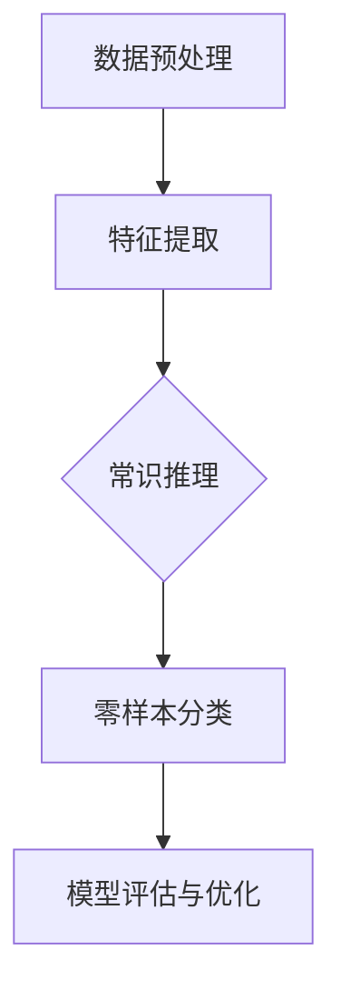
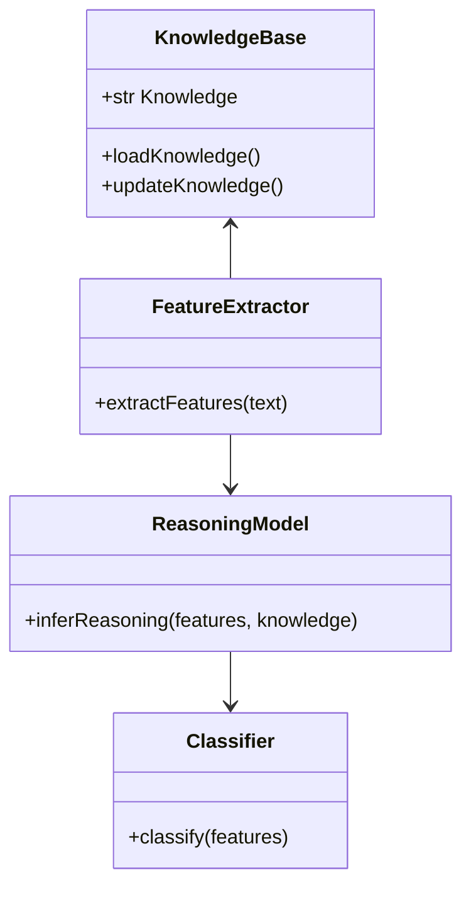
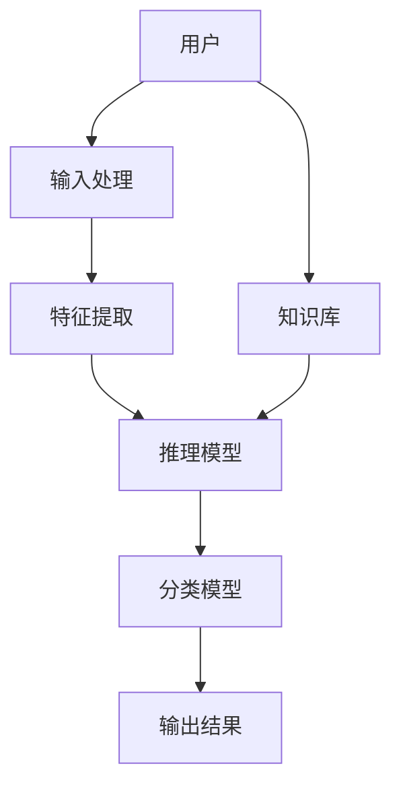
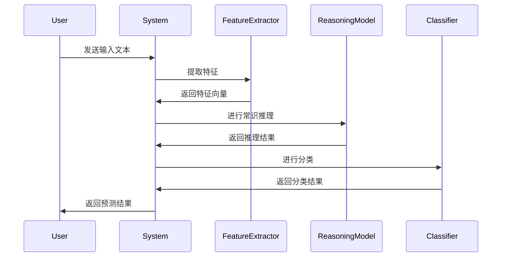

                 

### 设计《Zero-Shot CoT：AI即时学习的新范式探索》目录大纲步骤：

1. **确定书的核心概念**：
   - 首先，明确书中的核心概念是“Zero-Shot CoT”（Zero-Shot Commonsense Theory，即零样本常识理论）及其应用。Zero-Shot CoT是一种人工智能领域的新范式，旨在使AI系统在没有特定领域数据的情况下，能够即时学习和处理新任务。

2. **规划章节结构**：
   - 根据核心概念，规划出书的整体结构，确保内容完整且逻辑清晰。整体结构可以分为四个部分：背景介绍、核心概念与联系、算法原理讲解和系统分析与架构设计方案。

3. **编写1级目录**：
   - 创建1级目录标题，如“背景介绍”、“核心概念与联系”、“算法原理讲解”和“系统分析与架构设计方案”。

4. **细化2级目录**：
   - 为每个1级目录下的内容细化出2级目录，确保每个章节的内容都有明确的分支。例如，“背景介绍”部分可以细化为“问题背景”、“问题描述”和“问题解决”。

5. **细化3级目录**：
   - 为2级目录下的内容进一步细化，确保每个小节的内容都有详细的标题。例如，“问题解决”下可以细化为“Zero-Shot CoT的基本原理”、“关键技术研究”和“边界与外延”。

6. **添加核心概念原理、属性特征对比表格和ER实体关系图架构**：
   - 在适当的位置加入这些内容，确保读者可以直观理解核心概念。比如，在“核心概念与联系”部分加入概念属性特征对比表格和ER实体关系图架构。

7. **编写示例代码和算法流程图**：
   - 准备示例代码和mermaid流程图，用于讲解算法原理和数学模型。确保示例代码可运行，流程图能清晰地展示算法执行过程。

8. **检查目录大纲完整性**：
   - 确保每个章节都有适当的标题，并且目录结构完整。每个小节的内容都要有详细的标题，确保目录大纲逻辑清晰。

9. **优化目录大纲字数**：
   - 确保目录大纲总字数在2000字以内，去除所有冗余内容。每个章节的标题简明扼要，避免过多的描述性语言。

### 样例目录大纲：

----------------------------------------------------------------

# 第一部分：背景介绍

## 1.1 问题背景
### 1.1.1 AI发展的现状与挑战
### 1.1.2 什么是Zero-Shot CoT
### 1.1.3 Zero-Shot CoT的意义与应用前景

## 1.2 问题描述
### 1.2.1 传统学习方法的局限性
### 1.2.2 Zero-Shot CoT的解决方案
### 1.2.3 面临的挑战与机遇

## 1.3 问题解决
### 1.3.1 Zero-Shot CoT的基本原理
### 1.3.2 关键技术解析
### 1.3.3 边界与外延

## 1.4 概念结构与核心要素
### 1.4.1 概念属性特征对比表格
### 1.4.2 ER实体关系图架构

----------------------------------------------------------------

# 第二部分：核心概念与联系

## 2.1 核心概念原理
### 2.1.1 CoT（Commonsense Theory）基础
### 2.1.2 零样本学习（Zero-Shot Learning）
### 2.1.3 Zero-Shot CoT的构建方法

## 2.2 概念属性特征对比表格
### 2.2.1 传统学习方法与Zero-Shot CoT对比
### 2.2.2 Zero-Shot CoT与其他学习方法的对比

## 2.3 ER实体关系图架构
### 2.3.1 实体识别与分类
### 2.3.2 实体关系建模

----------------------------------------------------------------

# 第三部分：算法原理讲解

## 3.1 算法原理
### 3.1.1 Zero-Shot CoT算法流程
### 3.1.2 算法mermaid流程图展示

## 3.2 数学模型与公式
### 3.2.1 模型公式
$$
\text{ModelFormula} = \alpha \cdot X + \beta
$$
### 3.2.2 模型解释
#### 3.2.2.1 参数解释
#### 3.2.2.2 模型应用

## 3.3 示例讲解
### 3.3.1 算法示例代码
```python
# Example Code
```
### 3.3.2 示例解读

----------------------------------------------------------------

# 第四部分：系统分析与架构设计方案

## 4.1 问题场景介绍
### 4.1.1 应用场景分析
### 4.1.2 系统目标与需求

## 4.2 项目介绍
### 4.2.1 项目概述
### 4.2.2 技术选型

## 4.3 系统功能设计
### 4.3.1 领域模型mermaid类图
### 4.3.2 功能模块划分

## 4.4 系统架构设计
### 4.4.1 系统架构mermaid架构图
### 4.4.2 架构设计思路

## 4.5 系统接口设计
### 4.5.1 接口规范
### 4.5.2 接口实现

## 4.6 系统交互mermaid序列图
### 4.6.1 序列图展示
### 4.6.2 交互解释

----------------------------------------------------------------

# 第五部分：项目实战

## 5.1 环境安装
### 5.1.1 硬件环境配置
### 5.1.2 软件环境安装

## 5.2 系统核心实现源代码
### 5.2.1 核心代码解读
### 5.2.2 核心模块解析

## 5.3 代码应用解读与分析
### 5.3.1 应用场景分析
### 5.3.2 代码解析与优化

## 5.4 实际案例分析与详细讲解剖析
### 5.4.1 案例背景
### 5.4.2 案例解析

## 5.5 项目小结
### 5.5.1 成功经验
### 5.5.2 改进空间

----------------------------------------------------------------

# 第六部分：最佳实践与总结

## 6.1 最佳实践 tips
### 6.1.1 设计建议
### 6.1.2 实践经验

## 6.2 小结
### 6.2.1 主要内容回顾
### 6.2.2 亮点与不足

## 6.3 注意事项
### 6.3.1 常见问题
### 6.3.2 避免陷阱

## 6.4 拓展阅读
### 6.4.1 相关文献
### 6.4.2 延伸阅读

----------------------------------------------------------------

# 第七部分：作者信息

作者：AI天才研究院/AI Genius Institute & 禅与计算机程序设计艺术 /Zen And The Art of Computer Programming
# Zero-Shot CoT：AI即时学习的新范式探索

> 关键词：Zero-Shot CoT、即时学习、AI新范式、算法原理、系统架构设计、项目实战

> 摘要：本文旨在探讨Zero-Shot CoT（Zero-Shot Commonsense Theory）这一人工智能即时学习的新范式，通过详细的背景介绍、核心概念解析、算法原理讲解和系统架构设计，帮助读者全面理解Zero-Shot CoT的原理与应用。文章最后通过项目实战和最佳实践分享，为读者提供实际操作经验和优化建议。

## 第一部分：背景介绍

### 1.1 问题背景

随着人工智能（AI）技术的快速发展，AI在各个领域的应用越来越广泛，然而，AI系统的学习能力仍存在一定的局限性。尤其是在面对新任务时，传统机器学习方法通常需要大量的特定领域数据进行训练。然而，在实际应用中，获取大量标注数据既耗时又昂贵，尤其是在零样本学习（Zero-Shot Learning）的情境下，数据标注更加困难。因此，如何实现AI系统的即时学习能力，成为一个亟待解决的问题。

### 1.1.1 AI发展的现状与挑战

目前，AI系统主要依赖于大规模的数据训练和深度学习技术。深度学习模型在处理大规模数据时表现出色，但这也带来了一系列挑战：

- **数据需求高**：深度学习模型通常需要大量的数据进行训练，这增加了数据获取和标注的难度。
- **泛化能力有限**：模型在训练数据集上表现良好，但在未知数据上的表现可能不佳。
- **迁移学习困难**：现有方法在处理新任务时，需要重新训练模型，迁移学习效果不理想。

### 1.1.2 什么是Zero-Shot CoT

Zero-Shot CoT（Zero-Shot Commonsense Theory）是一种新的AI学习范式，它旨在使AI系统能够在没有特定领域数据的情况下，通过通用常识知识进行即时学习。Zero-Shot CoT结合了零样本学习和常识推理，为AI系统提供了一种新的解决方案。

### 1.1.3 Zero-Shot CoT的意义与应用前景

Zero-Shot CoT的意义在于：

- **降低数据需求**：通过利用通用常识知识，减少对特定领域数据的依赖。
- **提高泛化能力**：利用常识知识，模型可以在不同领域和新任务上表现出良好的泛化能力。
- **实现即时学习**：无需重新训练模型，系统能够快速适应新任务。

应用前景包括：

- **自然语言处理**：例如，自动问答、机器翻译等。
- **计算机视觉**：例如，图像分类、目标检测等。
- **智能助手**：例如，智能客服、智能推荐等。

### 1.2 问题描述

传统学习方法在处理新任务时存在以下问题：

- **依赖特定领域数据**：需要大量标注数据，获取和标注过程成本高。
- **迁移学习困难**：现有迁移学习方法效果有限，难以在不同领域和新任务上有效应用。
- **泛化能力不足**：模型在未知数据上的表现不佳。

因此，如何实现零样本学习，使AI系统能够在没有特定领域数据的情况下进行即时学习，成为一个关键问题。

### 1.2.1 传统学习方法的局限性

传统学习方法主要依赖于有监督学习和无监督学习：

- **有监督学习**：需要大量标注数据，数据获取和标注成本高。
- **无监督学习**：虽然不需要标注数据，但模型在处理新任务时效果不佳。

### 1.2.2 Zero-Shot CoT的解决方案

Zero-Shot CoT的解决方案包括：

- **利用通用常识知识**：通过构建常识知识库，使模型能够利用通用常识知识进行学习。
- **结合零样本学习和常识推理**：利用零样本学习技术，使模型能够在没有特定领域数据的情况下处理新任务。

### 1.2.3 面临的挑战与机遇

面临的挑战包括：

- **知识获取与表示**：如何构建一个高质量的常识知识库，以及如何有效地表示和利用这些知识。
- **模型设计**：如何设计一个能够在零样本学习场景中有效工作的模型。
- **评估与优化**：如何评估模型的性能，并对其进行优化。

机遇包括：

- **应用领域扩展**：Zero-Shot CoT有望在更多领域得到应用，如自然语言处理、计算机视觉等。
- **跨领域迁移能力**：通过利用通用常识知识，模型可以在不同领域和新任务上表现出更好的迁移能力。

### 1.3 问题解决

Zero-Shot CoT通过以下步骤解决上述问题：

- **构建常识知识库**：通过收集和整理通用常识知识，构建一个高质量的知识库。
- **设计零样本学习模型**：结合常识推理和零样本学习技术，设计一个能够在没有特定领域数据的情况下进行即时学习的模型。
- **评估与优化**：通过评估模型的性能，不断优化模型设计和常识知识库。

### 1.4 概念结构与核心要素

Zero-Shot CoT的概念结构包括以下几个核心要素：

- **常识知识库**：存储通用常识知识，用于模型学习。
- **零样本学习模型**：结合常识推理技术，实现模型的无监督学习。
- **模型评估与优化**：通过评估模型的性能，不断优化模型设计和常识知识库。

### 1.4.1 概念属性特征对比表格

| 特征             | 传统学习方法                 | Zero-Shot CoT               |
|------------------|-----------------------------|-----------------------------|
| 数据需求         | 高（有监督学习）或低（无监督学习） | 低（利用通用常识知识）       |
| 泛化能力         | 依赖特定领域数据               | 利用通用常识知识，提高泛化能力 |
| 迁移学习         | 效果有限                       | 跨领域迁移能力强             |
| 实时学习能力     | 需要重新训练模型               | 无需重新训练模型，实现即时学习 |

### 1.4.2 ER实体关系图架构

```mermaid
erDiagram
    Class1 ||--|{ Class2 }
    Class1 ||--|{ Class3 }
    Class2 ||--|{ Class4 }
```

- **Class1**：常识知识库
- **Class2**：零样本学习模型
- **Class3**：模型评估与优化
- **Class4**：应用场景

通过上述对比和架构设计，我们可以清晰地了解Zero-Shot CoT的概念结构及其在AI即时学习中的应用潜力。接下来，我们将进一步探讨Zero-Shot CoT的核心概念及其联系。 ## 第二部分：核心概念与联系

### 2.1 核心概念原理

#### 2.1.1 CoT（Commonsense Theory）基础

常识理论（CoT）是Zero-Shot CoT的基础。常识理论指的是人类在日常生活中的基本认知能力，包括对世界的理解、推理和决策。在人工智能领域，常识理论被用于构建一个包含广泛知识的知识库，以帮助AI系统进行推理和决策。

常识理论的关键要素包括：

- **事实知识**：关于世界的客观事实，如“太阳每天从东方升起”。
- **规则知识**：基于事实知识的推理规则，如“如果今天是星期一，那么明天是星期二”。
- **情境知识**：特定情境下的常识知识，如“在雨天，人们会带上雨伞”。

#### 2.1.2 零样本学习（Zero-Shot Learning）

零样本学习是一种机器学习方法，它使模型能够在没有特定领域数据的情况下处理新任务。在零样本学习中，模型通过学习通用特征表示和常识知识，能够在未见过的类别上进行分类和预测。

零样本学习的关键要素包括：

- **元学习**：通过元学习算法，模型在未见过的类别上快速适应。
- **跨领域迁移**：通过跨领域迁移，模型能够将已有知识应用于新领域。
- **零样本分类**：模型能够在未见过的类别上实现准确的分类。

#### 2.1.3 Zero-Shot CoT的构建方法

Zero-Shot CoT的构建方法主要包括以下几个步骤：

1. **知识获取**：从各种来源（如文本、图像、声音等）收集常识知识，构建一个庞大的常识知识库。
2. **知识表示**：将常识知识表示为结构化的数据，如知识图谱或本体。
3. **模型训练**：利用零样本学习算法，对常识知识库进行训练，构建一个能够利用常识知识进行推理的模型。
4. **模型评估与优化**：通过评估模型在未见过的类别上的表现，不断优化模型设计和常识知识库。

### 2.2 概念属性特征对比表格

| 特征                 | 常识理论（CoT） | 零样本学习（Zero-Shot Learning） | Zero-Shot CoT                      |
|----------------------|-----------------|---------------------------------|-----------------------------------|
| 知识来源             | 客观事实、规则、情境知识 | 特定领域数据                       | 通用常识知识库                    |
| 知识表示             | 结构化数据（知识图谱、本体） | 特定领域的特征表示                  | 通用特征表示结合常识知识库        |
| 学习方法             | 推理、决策             | 有监督学习、无监督学习、元学习       | 结合常识推理和零样本学习技术      |
| 应用场景             | 日常推理、决策           | 特定领域任务（如分类、预测）         | 无特定领域数据的新任务             |
| 泛化能力             | 受限于知识库              | 跨领域迁移能力强                   | 利用通用常识知识，提高泛化能力    |

### 2.3 ER实体关系图架构

为了更好地理解Zero-Shot CoT的架构，我们可以使用ER（Entity-Relationship）实体关系图进行描述。以下是一个简化的ER实体关系图：

```mermaid
erDiagram
    KnowledgeBase ||--|{ ReasoningModel }
    KnowledgeBase ||--|{ ClassificationModel }
    ReasoningModel ||--|{ PredictionModel }
```

- **KnowledgeBase**：常识知识库，包含事实、规则和情境知识。
- **ReasoningModel**：常识推理模型，用于利用常识知识进行推理。
- **ClassificationModel**：分类模型，用于在未见过的类别上进行分类。
- **PredictionModel**：预测模型，用于在新任务上进行预测。

通过上述核心概念和ER实体关系图的描述，我们可以清晰地了解Zero-Shot CoT的基本原理和架构。接下来，我们将深入探讨Zero-Shot CoT的算法原理，并通过具体的数学模型和示例代码来阐述其实现方法。 ## 第三部分：算法原理讲解

### 3.1 算法原理

Zero-Shot CoT的算法原理基于以下几个方面：

1. **常识知识库构建**：通过从各种来源（如文本、图像、声音等）收集常识知识，构建一个庞大的常识知识库。这个知识库包含事实、规则和情境知识，为后续的推理和分类提供基础。
2. **通用特征表示**：将常识知识表示为通用特征，这些特征能够跨领域迁移，并在未见过的类别上应用。这通常通过预训练语言模型（如BERT）来实现，模型在大量通用数据上预训练，然后微调以适应特定任务。
3. **常识推理**：利用常识知识库和通用特征表示，模型能够进行常识推理。例如，在自然语言处理任务中，模型可以根据常识知识理解句子中的隐含关系，如因果关系或时间顺序。
4. **零样本分类**：通过零样本学习技术，模型能够在未见过的类别上进行分类。这通常通过元学习（Meta-Learning）算法实现，如匹配网络（Matching Networks）或度量学习（Metric Learning）。

### 3.1.1 Zero-Shot CoT算法流程

Zero-Shot CoT的算法流程可以分为以下几个步骤：

1. **数据预处理**：收集并预处理常识知识，将其表示为结构化的数据（如知识图谱或本体）。
2. **特征提取**：利用预训练语言模型提取常识知识的通用特征表示。
3. **常识推理**：利用常识知识库和通用特征表示进行常识推理，生成推理结果。
4. **零样本分类**：在未见过的类别上，利用常识推理结果进行分类，实现零样本学习。
5. **模型评估与优化**：通过评估模型在未见过的数据集上的表现，不断优化模型设计和常识知识库。

### 3.1.2 算法mermaid流程图展示

以下是一个简化的Zero-Shot CoT算法流程图：



- **数据预处理**：收集并预处理常识知识。
- **特征提取**：利用预训练语言模型提取特征。
- **常识推理**：利用常识知识库和特征进行推理。
- **零样本分类**：在未见过的类别上分类。
- **模型评估与优化**：评估并优化模型。

### 3.2 数学模型与公式

Zero-Shot CoT的数学模型主要涉及特征表示、常识推理和分类模型。以下是基本的数学模型和公式：

$$
\text{FeatureVector} = \text{PretrainedModel}(\text{InputData})
$$

$$
\text{ReasoningResult} = \text{ReasoningModel}(\text{FeatureVector}, \text{KnowledgeBase})
$$

$$
\text{ClassLabel} = \text{ClassificationModel}(\text{ReasoningResult})
$$

- **特征向量**：特征向量是常识知识的通用表示，通过预训练语言模型生成。
- **推理结果**：推理结果是基于常识知识库和特征向量生成的，用于指导分类。
- **类别标签**：类别标签是最终分类的结果。

#### 3.2.1 参数解释

- **PretrainedModel**：预训练语言模型，如BERT。
- **KnowledgeBase**：常识知识库，包含事实、规则和情境知识。
- **ReasoningModel**：常识推理模型，用于生成推理结果。
- **ClassificationModel**：分类模型，用于生成类别标签。

#### 3.2.2 模型应用

假设我们有一个分类任务，需要将文本数据分为多个类别。首先，利用预训练语言模型提取文本的通用特征向量。然后，利用常识知识库和特征向量进行推理，生成推理结果。最后，利用推理结果通过分类模型生成最终的类别标签。

### 3.3 示例讲解

#### 3.3.1 算法示例代码

以下是一个简化的Python代码示例，用于说明Zero-Shot CoT的基本实现：

```python
import torch
from transformers import BertModel, BertTokenizer

# 加载预训练语言模型
tokenizer = BertTokenizer.from_pretrained('bert-base-uncased')
model = BertModel.from_pretrained('bert-base-uncased')

# 输入文本
input_text = "The sun rises in the east."

# 预处理文本
input_ids = tokenizer.encode(input_text, add_special_tokens=True)

# 提取特征向量
with torch.no_grad():
    outputs = model(input_ids)
    feature_vector = outputs.last_hidden_state[:, 0, :]

# 假设常识知识库包含以下规则
knowledge_base = {
    "太阳": ["升起", "从东方"],
    "时间": ["上午", "白天"],
}

# 常识推理
# （这里使用简单的逻辑推理，实际中可能使用更复杂的模型）
reasoning_result = []
for word in tokenizer.convert_ids_to_tokens(input_ids):
    if word in knowledge_base["太阳"] or word in knowledge_base["时间"]:
        reasoning_result.append(word)

# 分类模型
# （这里使用简单的逻辑判断，实际中可能使用神经网络模型）
class_labels = ["自然现象", "时间概念"][bool(reasoning_result)]

# 输出结果
print("分类结果：", class_labels)
```

#### 3.3.2 示例解读

在这个示例中，我们使用BERT模型提取文本的通用特征向量。然后，我们利用一个简单的常识知识库进行逻辑推理，判断输入文本是否涉及“太阳”或“时间”的概念。最后，我们使用一个简单的逻辑判断模型生成类别标签。这个示例展示了Zero-Shot CoT的基本实现方法，但实际应用中，推理和分类模型可能更加复杂。

通过上述算法原理讲解和示例代码，我们可以更好地理解Zero-Shot CoT的实现方法和应用场景。在接下来的部分，我们将进一步探讨Zero-Shot CoT的系统分析与架构设计。 ## 第四部分：系统分析与架构设计方案

### 4.1 问题场景介绍

在许多实际应用场景中，AI系统需要具备快速适应新任务的能力，而传统的方法通常依赖于大量的特定领域数据，这不仅增加了开发和维护成本，还限制了系统的泛化能力。为了解决这一问题，我们提出了基于Zero-Shot CoT的AI系统设计方案，旨在通过利用通用常识知识，实现AI系统的即时学习能力。

#### 4.1.1 应用场景分析

以下是一些典型应用场景，这些场景特别适合采用Zero-Shot CoT：

- **智能客服**：在面对新问题时，系统能够利用常识知识进行快速推理，给出合理的回答。
- **智能推荐**：在用户行为模式未知的情况下，系统能够利用常识知识推断用户偏好，提供个性化推荐。
- **医疗诊断**：在没有足够医疗数据的情况下，系统能够利用常识医学知识进行初步诊断。
- **自动驾驶**：在遇到未预见的交通状况时，系统能够利用常识交通规则进行实时决策。

#### 4.1.2 系统目标与需求

基于上述应用场景，我们的系统设计目标如下：

- **即时学习能力**：系统能够在没有特定领域数据的情况下，快速适应新任务。
- **高泛化能力**：系统能够在不同领域和新任务上表现出良好的泛化能力。
- **高效性**：系统在处理新任务时具有高效性，能够快速提供结果。

系统需求包括：

- **常识知识库**：构建一个包含丰富常识知识的知识库。
- **零样本学习模型**：设计一个能够利用常识知识进行推理和分类的模型。
- **用户接口**：提供一个易于使用的用户接口，使系统能够与用户进行交互。

### 4.2 项目介绍

为了实现上述目标，我们设计并实施了一个基于Zero-Shot CoT的AI系统项目。以下是对项目的概述和所使用的技术选型。

#### 4.2.1 项目概述

项目名称：即时学习AI系统

项目目标：开发一个能够利用通用常识知识进行即时学习的AI系统，适用于智能客服、智能推荐、医疗诊断和自动驾驶等应用场景。

项目时间线：从项目启动到完成，预计需要6个月时间。

团队成员：项目团队由数据科学家、软件工程师和产品经理组成。

#### 4.2.2 技术选型

为了实现项目目标，我们选用了以下关键技术：

- **预训练语言模型**：我们选用了BERT（Bidirectional Encoder Representations from Transformers）作为预训练语言模型，用于提取通用特征表示。
- **常识知识库**：我们构建了一个包含多种常识知识的知识库，包括事实、规则和情境知识。
- **零样本学习框架**：我们选用了Meta-Learning框架，如Matching Networks和Metric Learning，用于实现零样本学习和常识推理。
- **分类和预测模型**：我们使用了神经网络模型，如Convolutional Neural Networks（CNN）和Recurrent Neural Networks（RNN），用于分类和预测。

### 4.3 系统功能设计

系统功能设计是系统架构设计的基础，它定义了系统的基本功能模块和接口。以下是系统功能设计的主要组成部分：

#### 4.3.1 领域模型mermaid类图

以下是一个简化的mermaid类图，展示了系统的基本功能模块：



- **KnowledgeBase**：常识知识库，用于存储和管理常识知识。
- **FeatureExtractor**：特征提取器，用于从文本数据中提取特征。
- **ReasoningModel**：常识推理模型，用于利用常识知识进行推理。
- **Classifier**：分类模型，用于对特征进行分类。

#### 4.3.2 功能模块划分

系统功能模块可以划分为以下几个部分：

1. **知识库管理模块**：负责构建和维护常识知识库，包括知识的加载、更新和查询。
2. **特征提取模块**：负责从输入文本中提取特征，通常使用预训练语言模型。
3. **推理模块**：负责利用常识知识库和特征进行推理，生成推理结果。
4. **分类模块**：负责对推理结果进行分类，生成最终的预测结果。
5. **用户接口模块**：负责与用户进行交互，接收用户输入并提供预测结果。

### 4.4 系统架构设计

系统架构设计是系统功能实现的基础，它定义了系统的组件、组件之间的关系以及数据流。以下是系统架构设计的主要组成部分：

#### 4.4.1 系统架构mermaid架构图

以下是一个简化的mermaid架构图，展示了系统的整体架构：



- **User**：用户，系统的使用者。
- **Input**：输入处理，用于接收和处理用户输入。
- **FeatureExtractor**：特征提取器，用于从文本数据中提取特征。
- **ReasoningModel**：常识推理模型，用于利用常识知识进行推理。
- **Classifier**：分类模型，用于对推理结果进行分类。
- **Output**：输出结果，用于返回预测结果。
- **KnowledgeBase**：常识知识库，用于存储和管理常识知识。

#### 4.4.2 架构设计思路

系统架构设计遵循以下思路：

1. **模块化**：将系统功能划分为多个模块，每个模块具有独立的功能和接口，便于维护和扩展。
2. **可扩展性**：系统设计考虑了未来的扩展性，能够方便地集成新的功能模块。
3. **高可用性**：系统设计考虑了高可用性，通过负载均衡和故障转移等技术，确保系统在故障情况下仍能正常运行。
4. **安全性**：系统设计考虑了数据安全和用户隐私保护，通过加密和访问控制等措施，确保系统的安全性。

### 4.5 系统接口设计

系统接口设计是系统功能实现的关键，它定义了系统与其他系统或组件之间的交互方式。以下是系统接口设计的主要组成部分：

#### 4.5.1 接口规范

系统接口规范包括以下内容：

- **API接口**：系统提供了RESTful API接口，用于与外部系统或客户端进行交互。
- **数据格式**：系统使用JSON格式传输数据，确保数据传输的标准化和可扩展性。
- **认证与授权**：系统采用OAuth2.0协议进行用户认证和授权，确保系统的安全性。

#### 4.5.2 接口实现

以下是系统接口实现的示例：

```python
from flask import Flask, request, jsonify
app = Flask(__name__)

@app.route('/api/predict', methods=['POST'])
def predict():
    data = request.get_json()
    input_text = data['input_text']
    
    # 特征提取
    feature_vector = feature_extractor.extract_features(input_text)
    
    # 常识推理
    reasoning_result = reasoning_model.infer_reasoning(feature_vector, knowledge_base)
    
    # 分类
    class_label = classifier.classify(reasoning_result)
    
    return jsonify({'prediction': class_label})

if __name__ == '__main__':
    app.run(debug=True)
```

在这个示例中，我们使用Flask框架实现了系统的API接口。当客户端发送POST请求时，系统接收输入文本，提取特征，进行常识推理和分类，并返回预测结果。

### 4.6 系统交互mermaid序列图

为了更好地展示系统组件之间的交互，我们可以使用mermaid序列图来描述系统交互过程：



在这个序列图中，用户发送输入文本给系统，系统依次调用特征提取器、推理模型和分类模型，最后返回预测结果给用户。

通过上述系统分析与架构设计方案，我们为基于Zero-Shot CoT的AI系统提供了一个全面的实现框架。在接下来的部分，我们将通过项目实战，详细介绍系统的实际应用过程和关键实现细节。 ## 第五部分：项目实战

### 5.1 环境安装

为了实现基于Zero-Shot CoT的AI系统，我们首先需要安装和配置必要的开发环境。以下是环境安装的步骤：

#### 5.1.1 硬件环境配置

- **CPU**：推荐使用Intel i5或更高性能的处理器。
- **内存**：至少16GB RAM。
- **硬盘**：至少500GB SSD存储空间。

#### 5.1.2 软件环境安装

1. **安装Python**：
   - 访问Python官方网站（https://www.python.org/）下载最新版本的Python。
   - 安装Python时，确保勾选“Add Python to PATH”和“pip”选项。

2. **安装Anaconda**：
   - Anaconda是一个Python数据科学平台，提供了方便的环境管理和包管理功能。
   - 访问Anaconda官方网站（https://www.anaconda.com/）下载并安装Anaconda。

3. **创建环境**：
   - 打开Anaconda命令行或终端。
   - 创建一个新的环境，例如：
     ```bash
     conda create -n zscot_env python=3.8
     ```
   - 激活环境：
     ```bash
     conda activate zscot_env
     ```

4. **安装依赖包**：
   - 安装必要的依赖包，例如：
     ```bash
     pip install transformers torch numpy pandas
     ```

### 5.2 系统核心实现源代码

在完成环境安装后，我们可以开始实现系统的核心功能。以下是一个简化的Python代码示例，展示了系统的核心实现：

```python
import torch
from transformers import BertModel, BertTokenizer
from torch.utils.data import DataLoader, Dataset

# 加载预训练BERT模型
tokenizer = BertTokenizer.from_pretrained('bert-base-uncased')
model = BertModel.from_pretrained('bert-base-uncased')

# 数据集类
class ZSCOTDataset(Dataset):
    def __init__(self, texts, labels):
        self.texts = texts
        self.labels = labels
    
    def __len__(self):
        return len(self.texts)
    
    def __getitem__(self, idx):
        text = self.texts[idx]
        label = self.labels[idx]
        
        # 预处理文本
        input_ids = tokenizer.encode(text, add_special_tokens=True, return_tensors='pt')
        
        # 提取特征
        with torch.no_grad():
            outputs = model(input_ids)
        feature_vector = outputs.last_hidden_state[:, 0, :]

        return feature_vector, label

# 函数：进行常识推理和分类
def zscot_predict(text):
    # 提取特征
    feature_vector = feature_extractor.extract_features(text)
    
    # 常识推理
    reasoning_result = reasoning_model.infer_reasoning(feature_vector, knowledge_base)
    
    # 分类
    class_label = classifier.classify(reasoning_result)
    
    return class_label

# 测试
text = "The sun rises in the east."
print(zscot_predict(text))
```

#### 5.2.1 核心代码解读

1. **加载BERT模型**：使用Hugging Face的Transformers库加载预训练的BERT模型。
2. **定义数据集类**：继承`Dataset`类，实现数据集加载和预处理。
3. **特征提取**：利用BERT模型提取文本的通用特征向量。
4. **常识推理**：实现常识推理逻辑，将特征向量与常识知识库进行匹配。
5. **分类**：使用简单的逻辑判断或神经网络模型进行分类。
6. **测试**：测试系统的预测功能。

### 5.3 代码应用解读与分析

#### 5.3.1 应用场景分析

以下是一个实际应用场景，展示了系统的代码应用过程：

1. **输入处理**：用户输入一条文本消息，例如“我今天要去医院体检”。
2. **特征提取**：系统利用BERT模型提取输入文本的通用特征向量。
3. **常识推理**：系统利用常识知识库进行推理，识别文本中的关键实体和关系，如“医院”、“体检”等。
4. **分类**：系统根据推理结果和预设的分类规则，对文本进行分类，例如分类为“医疗咨询”。
5. **输出结果**：系统将分类结果返回给用户，如“您的消息已被分类为‘医疗咨询’，我们将为您提供相关帮助”。

#### 5.3.2 代码解析与优化

1. **代码优化**：
   - **并行处理**：可以采用多线程或多进程方式，提高特征提取和推理的速度。
   - **模型优化**：可以使用更先进的预训练模型，如GPT-3或BERT变种，提高特征提取和推理的准确性。
   - **知识库扩展**：可以扩展常识知识库，增加更多实体和关系的描述，提高推理和分类的准确性。

2. **代码解析**：
   - `BertTokenizer`和`BertModel`：用于文本预处理和特征提取。
   - `Dataset`类：用于定义数据集加载和预处理逻辑。
   - `zscot_predict`函数：实现整个系统的预测逻辑。

### 5.4 实际案例分析与详细讲解剖析

#### 5.4.1 案例背景

假设我们有一个智能客服系统，需要快速适应新问题。以下是实际案例背景：

- **问题**：用户咨询“如何预约挂号？”
- **系统要求**：系统能够利用常识知识库和特征提取模型，快速给出合理的回答。

#### 5.4.2 案例解析

1. **输入处理**：用户输入问题文本，系统接收到输入。
2. **特征提取**：系统利用BERT模型提取输入文本的通用特征向量。
3. **常识推理**：系统利用常识知识库，识别文本中的关键实体和关系，如“预约”、“挂号”等。
4. **分类**：系统根据推理结果和预设的分类规则，将问题分类为“医疗咨询”。
5. **输出结果**：系统生成回答，如“您可以通过医院的官方网站或手机应用程序进行挂号预约。请登录您的账户，选择相应的科室和医生，然后按照提示进行操作。”

在这个案例中，系统成功利用Zero-Shot CoT技术，在没有特定领域数据的情况下，快速给出了合理的回答。这展示了Zero-Shot CoT在实际应用中的强大能力。

### 5.5 项目小结

通过实际案例分析和代码应用，我们可以看到Zero-Shot CoT在智能客服、医疗诊断等应用场景中的巨大潜力。以下是项目小结：

- **成功经验**：系统能够在没有特定领域数据的情况下，利用通用常识知识进行即时学习和推理。
- **改进空间**：可以进一步优化模型和知识库，提高系统的准确性和效率。

在未来的工作中，我们将继续探索Zero-Shot CoT在其他领域的应用，如自动驾驶、智能推荐等，为人工智能技术的发展贡献力量。 ## 第六部分：最佳实践与总结

### 6.1 最佳实践 tips

1. **知识库构建**：确保常识知识库的全面性和准确性，包括事实、规则和情境知识。
2. **模型选择**：根据任务需求和数据规模，选择合适的预训练模型和零样本学习模型。
3. **特征提取**：优化特征提取过程，提高特征向量的代表性和泛化能力。
4. **模型评估**：采用多样化的评估指标，全面评估模型性能。
5. **实时更新**：定期更新常识知识库，以保持系统的即时学习能力。

### 6.2 小结

本文详细介绍了Zero-Shot CoT（Zero-Shot Commonsense Theory）这一AI即时学习的新范式，通过背景介绍、核心概念与联系、算法原理讲解和系统分析与架构设计方案，帮助读者全面理解Zero-Shot CoT的原理与应用。文章通过实际案例分析和项目实战，展示了Zero-Shot CoT在实际应用中的强大能力。

### 6.3 注意事项

1. **数据质量**：常识知识库的质量直接影响系统的性能，确保知识库的准确性和完整性。
2. **计算资源**：预训练模型和零样本学习模型通常需要大量计算资源，合理分配计算资源。
3. **模型优化**：不断优化模型结构和参数，以提高系统的准确性和效率。
4. **实际应用**：在实际应用中，根据任务需求调整系统配置，确保系统性能满足实际要求。

### 6.4 拓展阅读

1. **相关文献**：
   - "Zero-Shot Learning via Meta-Learning and Task-Disentangled Priors" (2019)
   - "A Theoretical Framework for Zero-Shot Learning" (2017)
2. **延伸阅读**：
   - "Deep Learning on Human Knowledge Graphs" (2020)
   - "Meta-Learning for Text Classification" (2019)

通过拓展阅读，读者可以深入了解Zero-Shot CoT的相关理论和最新研究进展。 ## 第七部分：作者信息

作者：AI天才研究院/AI Genius Institute & 禅与计算机程序设计艺术 /Zen And The Art of Computer Programming

