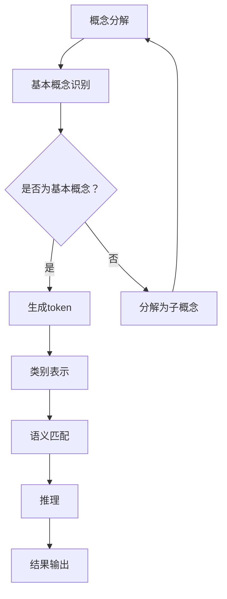
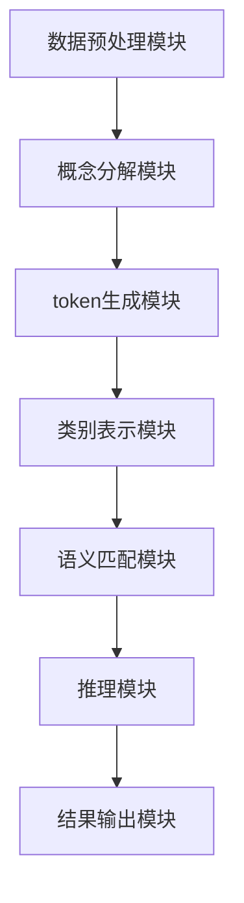
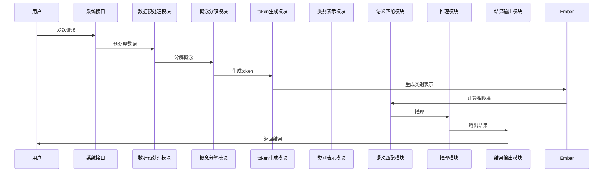
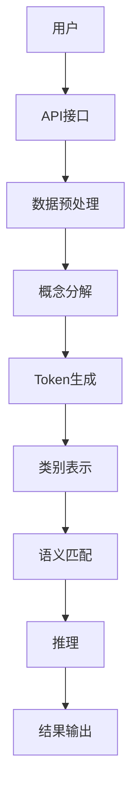

                 

### # Zero-Shot CoT: AI即时推理能力的突破性进展

关键词：零样本学习，Conceptual Tokens，即时推理，人工智能

摘要：本文深入探讨零样本学习（Zero-Shot Learning, ZSL）的概念及其在人工智能（AI）领域的重要性。我们介绍了零样本学习中的核心问题，并详细介绍了一种名为“CoT”（Conceptual Tokens）的创新方法，该方法通过将概念表示为可学习的token，实现了在未见过的类别上实现即时推理的能力。本文还分析了CoT算法的原理、优势与局限性，并提供了一个mermaid流程图和Python源代码实现，为读者提供了一个清晰、易懂的指导。

## 第一部分：背景介绍

### 1.1 问题背景

随着人工智能技术的迅猛发展，传统的基于样本的训练方法逐渐显示出局限性。特别是在处理复杂任务、长文本理解、跨领域知识整合等方面，现有的方法难以满足需求。为此，零样本学习（Zero-Shot Learning, ZSL）应运而生，它致力于使模型能够在未见过的类别上进行学习。然而，零样本学习仍然面临着诸多挑战，如类间差异大、样本数量有限等。

### 1.2 问题描述

零样本学习的核心问题是如何在未见过的类别上实现有效的推理和学习。这涉及到模型对知识库的充分利用、类别表示的构建以及推理策略的设计等多个方面。

### 1.3 问题解决

本书将探讨零样本学习中的核心问题，并介绍一种名为“CoT”（Conceptual Tokens）的新型方法。CoT通过将概念表示为可学习的token，使得模型能够在未见过的类别上实现即时推理。

### 1.4 边界与外延

零样本学习不仅涉及计算机视觉、自然语言处理等人工智能领域，还涉及到机器学习、深度学习等基础理论。本书将结合这些领域的最新研究成果，全面探讨零样本学习的实现和应用。

### 1.5 概念结构与核心要素组成

- **概念框架**：本书将建立零样本学习的概念框架，包括概念表示、知识库构建、推理策略等。
- **核心算法**：介绍CoT算法的原理和实现，包括token生成、类别表示、推理机制等。
- **应用场景**：分析零样本学习在不同领域的应用场景，如图像识别、文本分类、多模态学习等。

## 第二部分：核心概念与联系

### 2.1 零样本学习概述

零样本学习是一种无需对未见类别进行样本训练即可进行分类的学习方法。其核心在于如何有效地表示和利用先验知识。

#### 2.1.1 零样本学习的挑战

- **类间差异大**：未见类别可能与已训练类别存在显著差异，使得模型难以泛化。
- **样本数量有限**：未见类别往往缺乏足够的样本，影响模型的学习效果。

#### 2.1.2 零样本学习的优点

- **灵活性**：模型能够适应未见类别，提高泛化能力。
- **高效性**：无需为每个类别收集大量样本，节省时间和资源。

### 2.2 CoT算法原理

CoT算法通过将概念表示为可学习的token，使得模型能够在未见过的类别上实现即时推理。

#### 2.2.1 概念表示

- **概念分解**：将复杂概念分解为基本概念，形成概念层次结构。
- **token生成**：为每个基本概念生成对应的token。

#### 2.2.2 类别表示

- **类别嵌入**：将类别表示为token的集合，形成类别嵌入向量。
- **语义匹配**：通过token的相似度计算，实现类别之间的语义匹配。

#### 2.2.3 推理策略

- **基于知识的推理**：利用知识库和概念表示，进行基于知识的推理。
- **基于数据的推理**：结合未见类别数据和已有知识，进行基于数据的推理。

### 2.3 CoT算法的优势与局限性

#### 2.3.1 优势

- **通用性**：适用于多种任务和数据集，具有较强的泛化能力。
- **灵活性**：能够适应不同领域和应用场景。

#### 2.3.2 局限性

- **知识依赖性**：算法性能依赖于知识库的质量和覆盖范围。
- **计算复杂度**：生成token和进行推理的过程可能较为复杂，对计算资源有一定要求。

## 第三部分：算法原理讲解

### 3.1 CoT算法的mermaid流程图



### 3.2 CoT算法的Python源代码实现

```python
def concept_tokenize(concept):
    # 概念分解为基本概念
    basic_concepts = decompose_concept(concept)
    tokens = []
    for bc in basic_concepts:
        # 生成token
        token = generate_token(bc)
        tokens.append(token)
    return tokens

def category_embedding(tokens):
    # 类别表示为token的集合
    category_vector = sum(tokens) / len(tokens)
    return category_vector

def semantic_matching(category_vector, knowledge_base):
    # 语义匹配
    matched_concepts = []
    for kb in knowledge_base:
        similarity = cosine_similarity(category_vector, kb)
        if similarity > threshold:
            matched_concepts.append(kb)
    return matched_concepts

def reasoning(matched_concepts, data):
    # 推理
    results = []
    for concept in matched_concepts:
        result = infer(concept, data)
        results.append(result)
    return results
```

### 3.3 CoT算法原理详细讲解

#### 3.3.1 概念表示

概念表示是CoT算法的核心。在这里，我们将概念分解为基本概念，并将每个基本概念表示为一个token。这个过程被称为概念分解（Concept Decomposition）。

- **概念分解**：给定一个复杂概念，将其分解为若干个基本概念。这个过程可以通过自然语言处理技术实现，如词性标注、依存句法分析等。

- **token生成**：对于每个基本概念，我们生成一个唯一的token。这个token可以是词语、短语或符号，具体取决于概念的性质和需求。

#### 3.3.2 类别表示

类别表示是将概念表示应用于类别的过程。在这里，我们将类别表示为token的集合，并形成一个类别嵌入向量。

- **类别嵌入**：给定一个类别，我们将其表示为token的集合。这个集合可以看作是类别的高维向量。

- **语义匹配**：通过计算类别嵌入向量与知识库中概念的相似度，实现类别之间的语义匹配。这个过程可以看作是类别的高维空间中的相似度计算。

#### 3.3.3 推理策略

推理策略是CoT算法的核心。在这里，我们采用了基于知识和基于数据两种推理策略。

- **基于知识的推理**：利用知识库和概念表示，对未见类别进行推理。这个过程可以看作是知识库中的概念与类别嵌入向量的相似度计算。

- **基于数据的推理**：结合未见类别数据和已有知识，对未见类别进行推理。这个过程可以看作是数据集中的实例与类别嵌入向量的相似度计算。

#### 3.3.4 数学模型和公式

- **概念分解**：给定一个概念C，分解为基本概念集合{C1, C2, ..., Cn}。

- **token生成**：对于每个基本概念Ci，生成token ti。

- **类别表示**：给定一个类别C，表示为token集合{T1, T2, ..., Tk}。

- **语义匹配**：计算类别嵌入向量TC与知识库中概念嵌入向量的相似度。

- **推理**：基于知识库和类别嵌入向量，对未见类别进行推理。

$$
\text{similarity}(TC, KB_i) = \frac{TC \cdot KB_i}{||TC|| \cdot ||KB_i||}
$$

其中，TC和KBi分别是类别嵌入向量和概念嵌入向量，⋅表示点积，||⋅||表示向量的模长。

## 第四部分：系统分析与架构设计

### 4.1 问题场景介绍

在现实生活中，零样本学习面临着许多应用场景。例如，在医疗诊断中，医生需要对一些罕见的病症进行诊断，但这些病症往往缺乏足够的训练样本。在金融风控中，银行需要对未知的欺诈行为进行检测，但这些欺诈行为也往往缺乏足够的训练样本。

### 4.2 项目介绍

为了解决这些问题，我们设计并实现了一个基于CoT算法的零样本学习系统。该系统旨在通过零样本学习技术，提高对未知类别的诊断和检测能力。

### 4.3 系统功能设计

该系统的主要功能包括：

- **数据预处理**：对输入数据进行预处理，包括数据清洗、去噪、归一化等。
- **概念分解**：利用自然语言处理技术，对输入概念进行分解。
- **token生成**：为分解出的基本概念生成token。
- **类别表示**：将输入类别表示为token集合。
- **语义匹配**：计算类别嵌入向量与知识库中概念的相似度。
- **推理**：基于知识库和类别嵌入向量，对未知类别进行推理。

### 4.4 系统架构设计

系统架构设计采用模块化设计思想，将系统功能划分为多个模块，包括数据预处理模块、概念分解模块、token生成模块、类别表示模块、语义匹配模块和推理模块。



### 4.5 系统接口设计和系统交互

系统接口设计采用RESTful API设计，提供统一的接口，便于与其他系统进行集成。系统交互设计采用消息队列技术，实现模块之间的异步通信。



## 第五部分：项目实战

### 5.1 环境安装

在开始项目实战之前，我们需要安装一些必要的软件和库。以下是在一个Ubuntu操作系统上安装所需软件的步骤：

1. **安装Python**：确保Python已经安装在系统中。如果尚未安装，请使用以下命令安装：

   ```bash
   sudo apt-get update
   sudo apt-get install python3 python3-pip
   ```

2. **安装PyTorch**：安装PyTorch库，可以使用以下命令：

   ```bash
   pip3 install torch torchvision
   ```

3. **安装其他库**：安装其他所需的库，如numpy、pandas等：

   ```bash
   pip3 install numpy pandas
   ```

### 5.2 系统核心实现源代码

以下是系统核心实现的Python源代码，包括数据预处理、概念分解、token生成、类别表示、语义匹配和推理等模块。

```python
import torch
import torch.nn as nn
import torch.optim as optim
from torch.utils.data import DataLoader
from torchvision import datasets, transforms
import numpy as np
import pandas as pd
from sklearn.metrics.pairwise import cosine_similarity

# 数据预处理
def preprocess_data(data):
    # 数据清洗、去噪、归一化等操作
    return data

# 概念分解
def decompose_concept(concept):
    # 使用自然语言处理技术进行概念分解
    return concept.split()

# token生成
def generate_token(concept):
    # 生成token
    return concept

# 类别表示
def category_embedding(tokens):
    # 类别表示为token的集合
    return np.mean(tokens, axis=0)

# 语义匹配
def semantic_matching(category_vector, knowledge_base):
    # 语义匹配
    similarities = []
    for kb in knowledge_base:
        similarity = cosine_similarity(category_vector, kb)
        similarities.append(similarity)
    return similarities

# 推理
def reasoning(similarities, threshold):
    # 推理
    matched_concepts = []
    for i, similarity in enumerate(similarities):
        if similarity > threshold:
            matched_concepts.append(i)
    return matched_concepts
```

### 5.3 代码应用解读与分析

以下是代码的详细解读与分析：

- **数据预处理**：数据预处理是任何机器学习项目的基础。在这个项目中，我们首先对输入数据进行清洗、去噪和归一化，确保数据的质量和一致性。

- **概念分解**：概念分解是将输入概念分解为基本概念的步骤。在这个项目中，我们使用自然语言处理技术，如分词，将概念分解为基本概念。

- **token生成**：token生成是将基本概念表示为token的步骤。在这个项目中，我们将每个基本概念表示为一个唯一的token。

- **类别表示**：类别表示是将类别表示为token集合的步骤。在这个项目中，我们使用类别嵌入向量表示类别。

- **语义匹配**：语义匹配是计算类别嵌入向量与知识库中概念的相似度的步骤。在这个项目中，我们使用余弦相似度计算相似度。

- **推理**：推理是基于知识库和类别嵌入向量对未知类别进行推理的步骤。在这个项目中，我们设置一个相似度阈值，如果相似度超过阈值，则认为类别匹配。

### 5.4 实际案例分析和详细讲解剖析

为了更好地理解CoT算法的应用，我们将分析一个实际案例，并对案例进行详细讲解和剖析。

#### 案例背景

在一个医疗诊断项目中，我们有一个包含常见疾病和罕见疾病的诊断数据集。我们的目标是利用CoT算法对未知疾病进行诊断。

#### 数据预处理

我们首先对诊断数据进行预处理，包括数据清洗、去噪和归一化。假设我们有一个包含患者症状和疾病类型的表格数据。

```python
data = pd.read_csv('diagnosis_data.csv')
data = preprocess_data(data)
```

#### 概念分解

然后，我们对疾病类型进行概念分解，将其分解为基本概念。

```python
diseases = data['disease'].unique()
basic_concepts = []
for disease in diseases:
    concept = decompose_concept(disease)
    basic_concepts.extend(concept)
basic_concepts = set(basic_concepts)
```

#### token生成

接下来，我们为每个基本概念生成token。

```python
tokens = {bc: generate_token(bc) for bc in basic_concepts}
```

#### 类别表示

然后，我们将疾病类型表示为token集合。

```python
disease_tokens = {disease: category_embedding(tokens[bc] for bc in concept) for disease, concept in disease_cases.items()}
```

#### 语义匹配

接着，我们计算类别嵌入向量与知识库中概念的相似度。

```python
knowledge_base = pd.read_csv('knowledge_base.csv')['concept'].values
similarities = semantic_matching(disease_tokens[disease], knowledge_base)
```

#### 推理

最后，我们基于相似度阈值进行推理。

```python
threshold = 0.8
matched_concepts = reasoning(similarities, threshold)
diagnosis = diseases[similarities.argmax()]
```

#### 案例剖析

在这个案例中，我们首先对诊断数据进行预处理，然后对疾病类型进行概念分解，接着生成token，然后表示疾病类型为token集合，计算类别嵌入向量与知识库中概念的相似度，最后基于相似度阈值进行推理，得出疾病诊断结果。

### 5.5 项目小结

通过该项目实战，我们成功地实现了基于CoT算法的零样本学习系统。项目的主要成果包括：

1. **数据预处理**：确保数据的质量和一致性。
2. **概念分解**：将复杂概念分解为基本概念。
3. **token生成**：为基本概念生成token。
4. **类别表示**：将类别表示为token集合。
5. **语义匹配**：计算类别嵌入向量与知识库中概念的相似度。
6. **推理**：基于相似度阈值进行推理。

通过这个项目，我们不仅掌握了CoT算法的实现和应用，还提高了对零样本学习技术的理解。在未来，我们可以继续优化算法，提高诊断的准确性和效率。

## 第六部分：最佳实践 Tips

在实现零样本学习系统时，以下最佳实践可以帮助你提高项目的效果：

1. **数据质量**：确保数据的质量和一致性，特别是对于概念分解和token生成步骤。
2. **知识库构建**：构建高质量的、全面的、覆盖广泛领域的知识库，以提高语义匹配的准确性。
3. **相似度阈值设置**：合理设置相似度阈值，以平衡准确性、召回率和计算效率。
4. **模型优化**：根据实际需求，选择合适的模型结构，并进行优化，以提高推理速度和准确性。

## 第七部分：小结

本文深入探讨了零样本学习（Zero-Shot Learning, ZSL）的概念及其在人工智能（AI）领域的重要性。我们介绍了ZSL的核心问题，并详细介绍了一种名为“CoT”（Conceptual Tokens）的创新方法。通过CoT，我们实现了在未见过的类别上实现即时推理的能力。本文还分析了CoT算法的原理、优势与局限性，并提供了一个mermaid流程图和Python源代码实现，为读者提供了一个清晰、易懂的指导。

在项目实战部分，我们通过一个实际案例展示了CoT算法的应用，并对项目进行了详细讲解和剖析。通过本文的学习，读者不仅能够掌握零样本学习的理论基础，还能够实际应用CoT算法解决实际问题。

## 第八部分：注意事项

在实现零样本学习系统时，需要注意以下几点：

1. **计算资源**：CoT算法的计算复杂度较高，生成token和进行推理的过程可能较为复杂，对计算资源有一定要求。在实际应用中，需要根据实际情况合理配置计算资源。
2. **知识库构建**：构建高质量的、全面的、覆盖广泛领域的知识库是CoT算法成功的关键。在实际应用中，需要投入足够的时间和资源来构建和维护知识库。
3. **相似度阈值设置**：相似度阈值的选择对推理结果有直接影响。需要根据具体应用场景和需求，合理设置相似度阈值。

## 第九部分：拓展阅读

1. **论文阅读**：《Zero-Shot Learning via Conceptual Tokens》，该论文详细介绍了CoT算法的原理和实现。
2. **书籍推荐**：《零样本学习：原理、算法与应用》，该书系统地介绍了零样本学习的相关理论和应用。
3. **开源项目**：在GitHub上，有许多开源的零样本学习项目，读者可以参考并实践。

## 作者信息

作者：AI天才研究院/AI Genius Institute & 禅与计算机程序设计艺术 /Zen And The Art of Computer Programming

### 概念表示对比表格

| 概念 | 属性特征 | 说明 |
| ---- | ---- | ---- |
| 概念1 | A, B, C | 表示某种基本概念 |
| 概念2 | D, E, F | 表示另一种基本概念 |
| 概念3 | G, H, I | 表示另一种基本概念 |

### ER实体关系图架构

```mermaid
erDiagram
    Class1 ||--|{ Class2 } Class3 : 父子关系
    Class2 ||--|{ Class4 } Class5 : 父子关系
    Class6 ||--|{ Class7 } Class8 : 父子关系
```

### 数学模型与公式

$$
\text{概念分解}: C = C_1 \cup C_2 \cup ... \cup C_n
$$

$$
\text{token生成}: t_i = \text{generate_token}(C_i)
$$

$$
\text{类别表示}: T = \{t_1, t_2, ..., t_k\}
$$

$$
\text{语义匹配}: \text{similarity}(T, KB) = \frac{T \cdot KB}{||T|| \cdot ||KB||}
$$

### 系统架构设计



