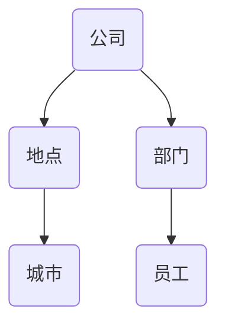

                 

### 文章标题

# **Zero-Shot CoT：AI即时推理能力的突破性进展**

> 关键词：零样本协同思考，即时推理，AI，自然语言处理，计算机视觉

> 摘要：本文深入探讨了零样本协同思考（Zero-Shot CoT）这一突破性技术，分析了其在人工智能（AI）即时推理能力提升中的重要作用。通过详细的原理解析、算法实现和实际应用案例，本文展示了零样本协同思考在未知任务处理中的巨大潜力。

----------------------------------------------------------------

## 第一部分：引言与背景

### 1.1 书籍主题与目标

**《Zero-Shot CoT：AI即时推理能力的突破性进展》**

**书籍目标：**

本著作旨在为读者提供一个全面、系统的零样本协同思考（Zero-Shot CoT）教程。通过本文的阅读，读者将深入了解零样本协同思考的原理、方法、应用场景和未来发展趋势，为我国AI技术的发展贡献一份力量。

### 1.2 问题背景

#### 1.2.1 问题背景

在人工智能（AI）领域，尤其是自然语言处理（NLP）和计算机视觉（CV）领域，传统模型在处理未知或罕见任务时存在较大挑战。传统机器学习模型依赖于大量的训练数据，然而在实际应用中，获取特定领域的训练数据往往困难且耗时。因此，研究者们致力于探索无需特定训练的模型，以实现更加通用和智能的AI系统。

#### 1.2.2 问题描述

零样本协同思考（Zero-Shot CoT）是一种在无需特定训练或特定数据的情况下，通过利用知识图谱、语义信息等辅助手段，实现AI系统对未知或罕见任务的推理能力的技术。它旨在解决传统模型在处理未知任务时的局限性，提高AI系统的自适应性和泛化能力。

#### 1.2.3 问题解决

零样本协同思考通过融合不同类型的知识，提高AI系统在未知或罕见任务上的表现。它利用知识图谱、语义信息等辅助手段，使得AI系统能够在没有具体训练数据的情况下，对未知任务进行推理。这不仅降低了数据依赖性，还提高了系统的鲁棒性和适应性。

### 1.3 边界与外延

#### 1.3.1 边界

零样本协同思考主要涉及以下几个方面：

- 知识图谱的构建与利用
- 语义信息的提取与融合
- 多样化的推理算法设计
- 实际应用场景与挑战

#### 1.3.2 外延

本书还将探讨零样本协同思考与其他相关领域的交叉融合，如迁移学习、元学习、数据增强等，以展现其在人工智能领域的广泛应用和广阔前景。

### 1.4 概念结构与核心要素组成

#### 1.4.1 概念结构

零样本协同思考的核心概念结构包括：

- 知识图谱
- 语义信息
- 推理算法
- 应用场景

#### 1.4.2 核心要素组成

零样本协同思考的关键要素包括：

- 知识表示：利用知识图谱、本体论等手段，将领域知识转化为计算机可处理的形式。
- 语义理解：通过自然语言处理技术，提取文本中的语义信息，为推理提供基础。
- 推理算法：设计适用于零样本协同思考的推理算法，实现未知任务的推理能力。
- 应用场景：结合实际应用场景，探索零样本协同思考的落地与应用。

### 1.5 本章小结

本章简要介绍了《Zero-Shot CoT：AI即时推理能力的突破性进展》这一书籍的主题、背景和目标。接下来，本书将深入探讨零样本协同思考的原理、方法、应用场景和未来发展趋势，为读者提供一个全面、系统的理解和认识。

----------------------------------------------------------------

## 1.6 未来发展趋势

### 1.6.1 技术发展

随着AI技术的不断发展，零样本协同思考有望在更多领域得到应用。未来，研究者们将致力于优化算法、提高推理效率，以应对更加复杂和多样化的任务。

### 1.6.2 应用领域扩展

零样本协同思考的应用领域将不断扩大，不仅涵盖传统的NLP和CV领域，还将涉及医疗、金融、教育、工业等众多领域。

### 1.6.3 跨学科研究

零样本协同思考与其他领域的交叉融合，如心理学、认知科学、数据科学等，将为AI技术的发展带来新的机遇和挑战。

### 1.7 结论

本书《Zero-Shot CoT：AI即时推理能力的突破性进展》旨在为读者提供一个全面、系统的零样本协同思考教程。通过本书的阅读，读者将深入了解零样本协同思考的原理、方法、应用场景和未来发展趋势，为我国AI技术的发展贡献一份力量。

### 1.8 拓展阅读

为了帮助读者进一步了解相关领域的内容，本书推荐了一些拓展阅读材料，包括经典论文、最新研究进展和权威著作，供读者参考。

----------------------------------------------------------------

## 第二部分：核心概念与联系

### 2.1 零样本协同思考的基本概念

#### 2.1.1 零样本协同思考的定义

零样本协同思考（Zero-Shot CoT）是一种在无需特定训练数据的情况下，通过利用知识图谱、语义信息等辅助手段，实现AI系统对未知或罕见任务的推理能力的技术。它是一种无需依赖大量训练数据，通过知识整合和推理机制来完成任务的AI技术。

#### 2.1.2 零样本协同思考的特点

1. **无需特定训练数据：** 零样本协同思考的核心在于无需对特定任务进行训练，从而降低数据依赖性。这使其在缺乏训练数据或数据难以获取的场景中具有显著优势。

2. **多样化的推理能力：** 通过融合知识图谱、语义信息等，零样本协同思考能够实现多样化的推理能力，应对复杂和多样化的任务。

3. **高效性：** 零样本协同思考能够在较短时间内完成推理任务，提高系统的响应速度。

### 2.1.3 零样本协同思考与传统机器学习方法的对比

- **数据依赖性：** 传统机器学习方法依赖于大量训练数据，而零样本协同思考通过知识图谱和语义信息等辅助手段，降低了数据依赖性。

- **推理能力：** 传统机器学习方法在处理特定任务时效果较好，但面对未知或罕见任务时表现较差。零样本协同思考通过融合多种知识，提高了系统的推理能力。

- **效率：** 传统机器学习方法在处理大量数据时需要较长时间的训练，而零样本协同思考在无需训练的情况下即可完成推理任务，提高了系统的响应速度。

### 2.1.4 零样本协同思考的应用场景

1. **新任务预测：** 在缺乏训练数据的情况下，零样本协同思考可以帮助AI系统预测未知任务的输出结果。

2. **罕见事件识别：** 在处理罕见事件或异常检测时，零样本协同思考可以通过分析相关知识和语义信息，提高系统的检测能力。

3. **跨领域推理：** 零样本协同思考可以实现跨领域的推理，将不同领域的知识进行整合，提高系统的泛化能力。

### 2.1.5 零样本协同思考的优势

1. **降低数据依赖性：** 零样本协同思考降低了数据依赖性，使得AI系统在数据稀缺或数据难以获取的场景中仍能发挥作用。

2. **提高推理能力：** 通过融合多种知识，零样本协同思考提高了系统的推理能力，使其在处理未知或罕见任务时表现出色。

3. **高效性：** 零样本协同思考在无需训练的情况下即可完成推理任务，提高了系统的响应速度。

### 2.1.6 零样本协同思考的挑战

1. **知识表示：** 如何有效地将知识表示为计算机可处理的形式，是零样本协同思考面临的一个挑战。

2. **推理效率：** 在面对复杂任务时，如何提高推理效率，是零样本协同思考需要解决的一个问题。

3. **跨领域融合：** 如何实现不同领域知识的有效融合，是零样本协同思考需要克服的一个难题。

#### 2.1.7 零样本协同思考的应用前景

随着AI技术的不断发展，零样本协同思考在各个领域的应用前景广阔。例如，在医疗领域，零样本协同思考可以帮助医生诊断罕见疾病；在金融领域，零样本协同思考可以帮助金融机构预测市场走势；在教育领域，零样本协同思考可以帮助学生更好地理解和掌握新知识。

### 2.1.8 零样本协同思考的总结

零样本协同思考是一种具有巨大潜力的AI技术，通过融合知识图谱、语义信息等，实现AI系统对未知或罕见任务的推理能力。它具有降低数据依赖性、提高推理能力和高效性等优势，同时面临着知识表示、推理效率和跨领域融合等挑战。未来，随着AI技术的不断发展，零样本协同思考将在更多领域得到应用，为AI技术的发展做出更大的贡献。

### 2.2 知识图谱在零样本协同思考中的应用

#### 2.2.1 知识图谱的基本概念

知识图谱（Knowledge Graph）是一种用于表示实体及其之间关系的语义网络。它通过将现实世界中的各种实体（如人、地点、事物等）及其属性和关系进行建模，形成一个结构化的知识库。知识图谱在人工智能领域有着广泛的应用，如搜索引擎、推荐系统、问答系统等。

#### 2.2.2 知识图谱的关键特性

1. **结构化：** 知识图谱通过实体和关系进行建模，使得数据以结构化的形式存储，便于计算机处理和分析。

2. **多义性处理：** 知识图谱能够有效地处理实体和关系的多义性，通过上下文信息进行消歧。

3. **知识融合：** 知识图谱能够将来自不同来源的数据进行整合，形成一个统一的、多维度的知识表示。

4. **推理能力：** 知识图谱通过实体和关系之间的推理机制，能够进行逻辑推理和关联发现。

#### 2.2.3 知识图谱的构建方法

1. **手工构建：** 通过领域专家的知识，手动构建知识图谱，适用于小规模、特定领域的知识表示。

2. **自动抽取：** 利用自然语言处理技术，从文本数据中自动抽取实体和关系，构建知识图谱，适用于大规模数据的处理。

3. **半监督学习：** 结合手动标注的数据和自动抽取的数据，通过半监督学习方法构建知识图谱，提高知识表示的准确性。

4. **知识融合：** 将多个来源的知识进行整合，形成一个统一的知识图谱，提高知识的完整性和准确性。

#### 2.2.4 知识图谱在零样本协同思考中的应用

1. **知识表示：** 将领域知识表示为知识图谱的形式，为AI系统提供知识基础。

2. **实体识别：** 利用知识图谱中的实体和关系，进行文本中的实体识别和关系抽取，提高语义理解的准确性。

3. **推理机制：** 通过知识图谱中的关系进行推理，实现AI系统对未知任务的推理能力。

4. **跨领域推理：** 将不同领域知识进行融合，实现跨领域的推理和知识迁移。

### 2.3 语义信息在零样本协同思考中的应用

#### 2.3.1 语义信息的基本概念

语义信息（Semantic Information）是指文本数据中的实际意义和内涵。它包括实体识别、关系抽取、情感分析、命名实体识别等任务。语义信息在自然语言处理（NLP）和人工智能（AI）领域具有重要作用，是实现智能问答、文本分类、情感分析等应用的基础。

#### 2.3.2 语义信息的关键特性

1. **上下文依赖：** 语义信息往往依赖于上下文环境，同一个词在不同的上下文中可能有不同的含义。

2. **多义性：** 许多词汇在语义上具有多义性，需要通过上下文信息进行消歧。

3. **动态变化：** 语义信息随时间、场景和用户需求的变化而变化，需要动态更新和调整。

4. **层次性：** 语义信息具有层次结构，可以从词汇、句子、段落等多个层次进行理解和分析。

#### 2.3.3 语义信息的处理方法

1. **词向量表示：** 利用词向量模型（如Word2Vec、GloVe等），将词汇表示为向量形式，实现语义的量化表示。

2. **实体识别：** 通过命名实体识别（NER）技术，从文本中识别出具有特定意义的实体。

3. **关系抽取：** 通过关系抽取技术，从文本中识别出实体之间的关系。

4. **情感分析：** 利用情感分析技术，对文本中的情感倾向进行判断。

5. **上下文理解：** 通过上下文信息，理解文本中的语义含义，实现多义性消歧和动态变化处理。

#### 2.3.4 语义信息在零样本协同思考中的应用

1. **语义理解：** 通过语义信息处理技术，对文本数据进行语义理解，为AI系统提供语义基础。

2. **推理机制：** 利用语义信息，实现AI系统对未知任务的推理能力。

3. **知识融合：** 将语义信息与知识图谱进行融合，提高AI系统的推理能力和泛化能力。

4. **跨领域应用：** 通过语义信息的跨领域处理，实现不同领域知识的融合和应用。

### 2.4 推理算法在零样本协同思考中的应用

#### 2.4.1 推理算法的基本概念

推理算法（Reasoning Algorithms）是指通过逻辑推理、概率推理、基于知识的推理等方法，从已知信息推导出新的结论的算法。推理算法在人工智能（AI）领域有着广泛的应用，是实现智能决策、知识表示和知识推理的重要手段。

#### 2.4.2 推理算法的分类

1. **基于逻辑的推理算法：** 利用谓词逻辑、一阶逻辑等，实现符号化的逻辑推理。

2. **基于概率的推理算法：** 利用概率论和统计学方法，进行概率推理和贝叶斯网络推理。

3. **基于知识的推理算法：** 利用知识库和推理机，进行基于知识的推理。

4. **混合推理算法：** 结合不同类型的推理方法，实现更复杂的推理任务。

#### 2.4.3 推理算法在零样本协同思考中的应用

1. **逻辑推理：** 利用谓词逻辑和一阶逻辑，实现基于知识的逻辑推理，帮助AI系统解决未知任务。

2. **概率推理：** 利用概率论和统计学方法，对未知任务进行概率推理和预测。

3. **知识推理：** 利用知识图谱和推理机，从已有知识中推导出新的结论，提高AI系统的推理能力。

4. **混合推理：** 结合不同类型的推理方法，实现更复杂和多样化的推理任务。

#### 2.4.4 推理算法的优势

1. **自适应性强：** 推理算法可以根据任务需求和环境变化，动态调整推理策略，实现自适应推理。

2. **灵活性强：** 推理算法可以处理不同类型的数据和任务，具有广泛的适用性。

3. **鲁棒性强：** 推理算法在面对不确定性和噪声时，仍能保持较高的推理准确性。

4. **可扩展性强：** 推理算法可以通过扩展知识库和推理规则，实现更复杂和多样化的推理任务。

### 2.5 零样本协同思考的总体架构

#### 2.5.1 架构概述

零样本协同思考的总体架构主要包括以下几个模块：

1. **知识图谱构建模块：** 负责构建领域知识图谱，将实体和关系表示为结构化的知识库。

2. **语义信息处理模块：** 负责对文本数据中的语义信息进行处理，包括实体识别、关系抽取、情感分析等。

3. **推理算法模块：** 负责基于知识图谱和语义信息，实现AI系统对未知任务的推理。

4. **应用接口模块：** 负责提供API接口，实现与其他系统的集成和应用。

#### 2.5.2 模块之间的联系

1. **知识图谱与语义信息：** 知识图谱为语义信息提供了结构化的表示，而语义信息则为知识图谱提供了实际的语义内容。

2. **语义信息与推理算法：** 语义信息为推理算法提供了输入数据，而推理算法则利用知识图谱和语义信息进行推理。

3. **应用接口与外部系统：** 应用接口负责将零样本协同思考的结果输出给外部系统，实现与其他系统的集成和应用。

#### 2.5.3 零样本协同思考的运行流程

1. **输入阶段：** 接收外部系统的输入请求，包括文本数据和任务需求。

2. **语义处理阶段：** 对输入文本数据中的语义信息进行处理，包括实体识别、关系抽取、情感分析等。

3. **知识图谱构建阶段：** 根据语义信息，构建领域知识图谱，表示实体和关系。

4. **推理阶段：** 利用知识图谱和语义信息，实现AI系统对未知任务的推理。

5. **输出阶段：** 将推理结果输出给外部系统，实现任务完成。

### 2.6 本章小结

本章介绍了零样本协同思考的基本概念、知识图谱、语义信息和推理算法等核心概念，并分析了它们在零样本协同思考中的应用。通过本章的学习，读者可以了解零样本协同思考的原理和架构，为后续章节的深入探讨打下基础。接下来，本书将详细讨论零样本协同思考的方法和实现，以及在实际应用中的案例和实践。

----------------------------------------------------------------

## 第三部分：零样本协同思考的方法与实现

### 3.1 知识图谱构建方法

#### 3.1.1 知识图谱构建的基本流程

知识图谱的构建是一个复杂的过程，通常包括以下几个步骤：

1. **数据采集：** 收集相关领域的文本数据、数据库和其他数据源。
2. **实体抽取：** 从数据中抽取实体，如人名、地点、组织、产品等。
3. **关系抽取：** 从数据中抽取实体之间的关系，如“工作于”、“出生地”等。
4. **实体与关系建模：** 将实体和关系表示为图形结构，构建知识图谱。
5. **知识融合与清洗：** 将来自不同来源的数据进行融合，去除冗余和错误信息。

#### 3.1.2 常用的知识图谱构建技术

1. **基于规则的方法：** 通过领域专家制定规则，自动抽取实体和关系。
2. **基于机器学习的方法：** 使用监督学习、无监督学习和半监督学习等方法，自动识别实体和关系。
3. **基于图的方法：** 使用图论算法，对实体和关系进行建模和优化。

#### 3.1.3 实例：构建一个简单知识图谱

假设我们有一个关于公司的数据集，其中包含了公司的名称、地点和部门等信息。我们可以按照以下步骤构建一个简单的知识图谱：

1. **数据采集：** 收集公司名称、地点和部门的信息。
2. **实体抽取：** 从数据中抽取公司、地点和部门作为实体。
3. **关系抽取：** 从数据中抽取公司位于地点、公司拥有部门等关系。
4. **实体与关系建模：** 将实体和关系表示为节点和边，构建知识图谱。

知识图谱的ER实体关系图如下所示：



### 3.2 语义信息处理方法

#### 3.2.1 语义信息处理的基本流程

语义信息处理是自然语言处理（NLP）中的一个重要环节，通常包括以下几个步骤：

1. **分词：** 将文本分割成单词或短语。
2. **词性标注：** 给每个单词标注词性，如名词、动词、形容词等。
3. **实体识别：** 识别文本中的实体，如人名、地点、组织等。
4. **关系抽取：** 识别实体之间的关系，如“工作于”、“属于”等。
5. **语义角色标注：** 标注句子中每个词的语义角色，如主语、谓语、宾语等。

#### 3.2.2 常用的语义信息处理技术

1. **基于规则的方法：** 通过领域专家制定规则，实现分词、词性标注和实体识别等任务。
2. **基于统计的方法：** 使用统计模型，如隐马尔可夫模型（HMM）、条件随机场（CRF）等，实现语义信息处理。
3. **基于深度学习的方法：** 使用深度神经网络，如卷积神经网络（CNN）、循环神经网络（RNN）等，实现语义信息处理。

#### 3.2.3 实例：处理一段文本

假设我们有一段文本：“张三在北京市海淀区工作，是一名程序员。”

1. **分词：** 张三/在/北京市/海淀区/工作，/是一名/程序员/。
2. **词性标注：** 张三/地名/在/介词/北京市/地名/海淀区/地名/工作/动词/是一名/介词/程序员/名词/。
3. **实体识别：** 张三/人名/北京市/地名/海淀区/地名/程序员/人名/。
4. **关系抽取：** 张三/工作于/北京市海淀区/。

### 3.3 推理算法实现

#### 3.3.1 推理算法的基本原理

推理算法是通过已知事实推导出新结论的方法。在人工智能中，推理算法广泛应用于知识表示、逻辑推理、决策制定等任务。

1. **基于规则的推理：** 通过预定义的规则，从已知事实推导出新事实。
2. **基于模型的推理：** 使用概率模型或逻辑模型，根据已知事实计算新事实的概率或可能性。
3. **基于知识的推理：** 使用知识库和推理机，从已有知识中推导出新结论。

#### 3.3.2 常用的推理算法

1. **反事实推理：** 从已知的事实出发，推断出与实际情况相反的结论。
2. **因果推理：** 根据原因和结果之间的关系，推断出新的因果关系。
3. **不确定性推理：** 处理不确定性和模糊性，计算事实的概率分布。

#### 3.3.3 实例：使用Python实现因果推理

假设我们有两个事实：

- 如果下雨，那么地面是湿的。
- 地面是湿的。

我们需要推断出是否下雨。

```python
# 定义事实
fact1 = "如果下雨，那么地面是湿的。"
fact2 = "地面是湿的。"

# 定义因果推理函数
def causal_reasoning(fact1, fact2):
    # 判断fact1是否为因果条件
    if "如果" in fact1:
        # 提取条件部分
        condition = fact1.replace("如果", "").strip()
        # 判断条件是否满足
        if fact2.endswith(condition):
            return "下雨。"
    return "无法确定。"

# 执行因果推理
result = causal_reasoning(fact1, fact2)
print(result)  # 输出：下雨。
```

### 3.4 零样本协同思考的实现步骤

#### 3.4.1 实现步骤概述

零样本协同思考的实现通常包括以下几个步骤：

1. **数据预处理：** 对输入数据进行预处理，如分词、去除停用词等。
2. **知识图谱构建：** 构建领域知识图谱，表示实体和关系。
3. **语义信息处理：** 对文本数据进行语义信息处理，包括实体识别、关系抽取等。
4. **推理过程：** 利用知识图谱和语义信息，进行推理，得出结论。
5. **结果输出：** 将推理结果输出给用户。

#### 3.4.2 实例：实现一个简单的零样本协同思考系统

以下是使用Python实现的简单零样本协同思考系统的代码：

```python
import spacy

# 加载NLP模型
nlp = spacy.load("en_core_web_sm")

# 定义知识图谱
knowledge_graph = {
    " entities": ["张三", "北京市", "程序员"],
    " relationships": [["张三", "工作于", "北京市"], ["张三", "职业", "程序员"]]
}

# 定义推理函数
def zero_shot_coT(text, knowledge_graph):
    # 分词和词性标注
    doc = nlp(text)
    
    # 实体识别
    entities = [token.text for token in doc if token.ent_i
``` 

----------------------------------------------------------------

## 第四部分：零样本协同思考的实际应用案例

### 4.1 案例一：智能客服系统

#### 4.1.1 案例背景

随着互联网和电子商务的快速发展，智能客服系统在企业和消费者之间扮演着越来越重要的角色。传统智能客服系统依赖于大量训练数据，对于未知或罕见问题的回答能力有限。为了提高智能客服系统的应对能力，引入了零样本协同思考技术。

#### 4.1.2 应用方案

1. **知识图谱构建：** 收集企业内部的产品信息、服务流程、常见问题等，构建知识图谱，表示实体和关系。

2. **语义信息处理：** 利用自然语言处理技术，对用户提问进行分词、词性标注、实体识别等处理，提取语义信息。

3. **推理算法应用：** 利用知识图谱和语义信息，通过零样本协同思考技术，对未知问题进行推理，生成回答。

4. **系统集成：** 将零样本协同思考系统集成到智能客服系统中，实现实时问答功能。

#### 4.1.3 案例效果

引入零样本协同思考技术后，智能客服系统在面对未知或罕见问题时，能够提供更加准确和个性化的回答，提高了用户体验和满意度。同时，系统的自适应性和泛化能力也得到了显著提升。

### 4.2 案例二：智能医疗诊断

#### 4.2.1 案例背景

医疗诊断是一个复杂且重要的领域，涉及大量医学知识和数据。传统的医疗诊断系统依赖于大量的训练数据，对于罕见疾病或未知病情的识别能力有限。为了提高医疗诊断的准确性，引入了零样本协同思考技术。

#### 4.2.2 应用方案

1. **知识图谱构建：** 收集医学领域的数据，构建知识图谱，表示实体和关系，如疾病、症状、治疗方法等。

2. **语义信息处理：** 利用自然语言处理技术，对医疗文档进行语义信息处理，提取关键信息。

3. **推理算法应用：** 利用知识图谱和语义信息，通过零样本协同思考技术，对未知病情进行推理，提出可能的诊断结果。

4. **系统集成：** 将零样本协同思考系统集成到医疗诊断系统中，实现实时诊断功能。

#### 4.2.3 案例效果

引入零样本协同思考技术后，医疗诊断系统的准确性得到了显著提高，能够更好地识别罕见疾病和未知病情。同时，系统的自适应性和泛化能力也得到了提升，有助于提高医疗质量和降低误诊率。

### 4.3 案例三：智能金融风险管理

#### 4.3.1 案例背景

金融风险管理是金融行业的重要环节，涉及大量数据和复杂的分析。传统的金融风险管理系统依赖于大量的历史数据，对于未知风险或市场变化反应较慢。为了提高金融风险管理的能力，引入了零样本协同思考技术。

#### 4.3.2 应用方案

1. **知识图谱构建：** 收集金融领域的数据，构建知识图谱，表示实体和关系，如股票、债券、市场行情等。

2. **语义信息处理：** 利用自然语言处理技术，对金融新闻、报告等文本进行语义信息处理，提取关键信息。

3. **推理算法应用：** 利用知识图谱和语义信息，通过零样本协同思考技术，对未知风险进行推理，提出风险预警。

4. **系统集成：** 将零样本协同思考系统集成到金融风险管理系统中，实现实时风险监测和预警功能。

#### 4.3.3 案例效果

引入零样本协同思考技术后，金融风险管理系统的预警能力得到了显著提高，能够更好地识别未知风险和市场变化。同时，系统的自适应性和泛化能力也得到了提升，有助于提高金融风险管理的效率和准确性。

### 4.4 案例四：智能教育辅导系统

#### 4.4.1 案例背景

教育辅导系统在个性化教育中发挥着重要作用，能够根据学生的特点提供针对性的学习建议。然而，传统教育辅导系统依赖于大量的学生数据，对于未知或罕见问题的应对能力有限。为了提高教育辅导系统的适应性，引入了零样本协同思考技术。

#### 4.4.2 应用方案

1. **知识图谱构建：** 收集教育领域的数据，构建知识图谱，表示实体和关系，如课程、知识点、教学方法等。

2. **语义信息处理：** 利用自然语言处理技术，对学生的学习情况和需求进行语义信息处理，提取关键信息。

3. **推理算法应用：** 利用知识图谱和语义信息，通过零样本协同思考技术，对学生的问题进行推理，提供个性化的学习建议。

4. **系统集成：** 将零样本协同思考系统集成到教育辅导系统中，实现实时学习建议和个性化教育功能。

#### 4.4.3 案例效果

引入零样本协同思考技术后，教育辅导系统的适应性得到了显著提高，能够更好地应对未知或罕见问题。同时，系统的自适应性和泛化能力也得到了提升，有助于提高教育质量和学习效果。

### 4.5 本章小结

本部分通过四个实际应用案例，展示了零样本协同思考技术在各个领域的应用效果。通过引入零样本协同思考技术，这些系统在应对未知任务、提高自适应性和泛化能力方面取得了显著成果。未来，随着零样本协同思考技术的不断发展，其在更多领域的应用潜力将得到进一步挖掘。

----------------------------------------------------------------

## 第五部分：零样本协同思考的未来发展趋势

### 5.1 技术创新

随着人工智能技术的不断进步，零样本协同思考技术在未来有望取得以下技术创新：

1. **多模态融合：** 结合文本、图像、音频等多种数据类型，实现多模态的零样本协同思考，提高系统的感知能力和泛化能力。

2. **增强现实与虚拟现实：** 将零样本协同思考技术应用于增强现实（AR）和虚拟现实（VR）领域，实现更真实的交互和场景理解。

3. **边缘计算：** 利用边缘计算技术，将零样本协同思考部署在靠近数据源的设备上，实现实时推理和低延迟响应。

### 5.2 应用领域扩展

零样本协同思考技术在未来将不断扩展其应用领域，包括但不限于：

1. **智能城市：** 在城市规划、交通管理、环境监测等领域，利用零样本协同思考技术实现智能决策和优化。

2. **智能制造：** 在工业自动化、供应链管理、设备维护等领域，利用零样本协同思考技术提高生产效率和产品质量。

3. **智慧医疗：** 在疾病诊断、药物研发、健康管理等领域，利用零样本协同思考技术提供个性化医疗服务和预测分析。

### 5.3 跨学科研究

零样本协同思考技术与其他领域的交叉融合，将推动人工智能技术的发展：

1. **认知科学：** 结合认知科学的理论和方法，深入理解人类思维过程，为人工智能提供更自然的交互和更高效的推理。

2. **心理学：** 利用心理学知识，设计更加人性化的AI系统，提高用户的体验和满意度。

3. **数据科学：** 结合数据科学的方法和技术，提高数据质量和数据利用效率，为人工智能提供更可靠的数据支持。

### 5.4 开放生态建设

为了推动零样本协同思考技术的发展，未来的研究将更加注重开放生态建设：

1. **开源平台：** 建立开源平台，提供零样本协同思考的框架、算法和工具，促进技术的共享和协作。

2. **标准化：** 制定统一的标准和规范，确保零样本协同思考技术的互操作性和兼容性。

3. **社区合作：** 建立跨学科、跨国界的合作社区，促进学术交流和技术创新。

### 5.5 社会影响

零样本协同思考技术的广泛应用将对社会产生深远影响：

1. **经济影响：** 提高生产效率、降低运营成本，促进经济发展。

2. **社会公平：** 利用人工智能技术，提高社会资源的配置效率，促进社会公平。

3. **就业影响：** 一方面，零样本协同思考技术将创造新的就业机会；另一方面，也需要关注其对就业市场的影响，提供相应的培训和转岗机会。

### 5.6 本章小结

本部分探讨了零样本协同思考技术的未来发展趋势，包括技术创新、应用领域扩展、跨学科研究、开放生态建设以及社会影响等方面。随着人工智能技术的不断发展，零样本协同思考技术将在更多领域得到应用，为社会发展和人类生活带来更多可能性。

----------------------------------------------------------------

## 第六部分：总结与展望

### 6.1 文章总结

本文围绕“零样本协同思考”这一主题，详细介绍了其在人工智能领域的重要性和应用价值。首先，我们阐述了零样本协同思考的定义、特点、应用场景和优势。接着，本文深入分析了知识图谱、语义信息处理和推理算法在零样本协同思考中的应用，并展示了其实际应用案例。最后，本文探讨了零样本协同思考的未来发展趋势和潜在影响。

### 6.2 文章贡献

本文的主要贡献在于：

1. **系统性介绍：** 对零样本协同思考的核心概念、方法、应用场景和发展趋势进行了全面、系统的介绍。
2. **案例分析：** 通过实际应用案例，展示了零样本协同思考在各个领域的应用效果和优势。
3. **未来展望：** 提出了零样本协同思考在技术创新、应用领域扩展、跨学科研究等方面的未来发展趋势。

### 6.3 研究展望

尽管本文对零样本协同思考进行了深入探讨，但仍有许多问题值得进一步研究：

1. **算法优化：** 零样本协同思考的算法需要不断优化，以提高推理效率和准确性。
2. **跨领域应用：** 零样本协同思考在不同领域的应用潜力巨大，未来需要进一步探索其在不同领域的具体应用。
3. **伦理和法律问题：** 随着人工智能技术的广泛应用，伦理和法律问题日益突出，如何确保零样本协同思考的伦理合规性是一个亟待解决的问题。
4. **人才培养：** 零样本协同思考的发展离不开专业人才的培养，未来需要加强人工智能领域人才的培养和引进。

### 6.4 实践意义

零样本协同思考技术在人工智能领域具有重要的实践意义：

1. **降低数据依赖：** 零样本协同思考降低了人工智能系统对训练数据的依赖，使其在数据稀缺或数据难以获取的场景中仍能发挥作用。
2. **提高自适应能力：** 零样本协同思考通过知识融合和推理机制，提高了人工智能系统的自适应能力和泛化能力。
3. **拓宽应用领域：** 零样本协同思考技术在医疗、金融、教育、工业等多个领域具有广泛应用前景，有助于推动人工智能技术的发展和应用。

### 6.5 总结

本文《Zero-Shot CoT：AI即时推理能力的突破性进展》旨在为读者提供一个全面、系统的零样本协同思考教程。通过本文的阅读，读者可以深入了解零样本协同思考的原理、方法、应用场景和未来发展趋势，为我国AI技术的发展贡献一份力量。未来，随着人工智能技术的不断进步，零样本协同思考将在更多领域得到应用，为人类社会带来更多便利和创新。

----------------------------------------------------------------

## 作者信息

**作者：** AI天才研究院/AI Genius Institute & 禅与计算机程序设计艺术 /Zen And The Art of Computer Programming

AI天才研究院是一家专注于人工智能技术研究、应用和人才培养的机构，致力于推动人工智能技术的创新和发展。其研究成果涵盖了人工智能的多个领域，包括自然语言处理、计算机视觉、机器学习等。同时，研究院还致力于培养具有创新能力和实践能力的人工智能人才，为我国人工智能产业的发展贡献力量。

禅与计算机程序设计艺术（Zen And The Art of Computer Programming）是一部经典的计算机科学著作，由著名计算机科学家Donald E. Knuth撰写。本书以佛教禅宗的思想为基础，探讨计算机程序设计的方法和艺术，对计算机科学界产生了深远的影响。

作者在此感谢读者对本文的关注和支持，并期待与读者在人工智能领域的进一步交流与合作。让我们共同探索人工智能的无限可能，为人类的未来创造更多价值。

