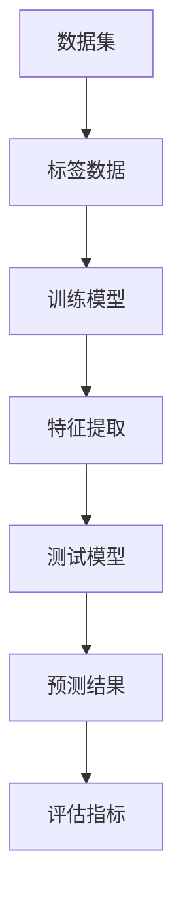
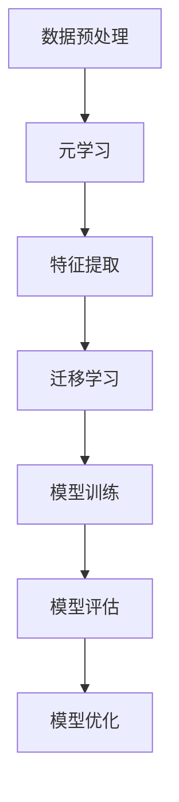
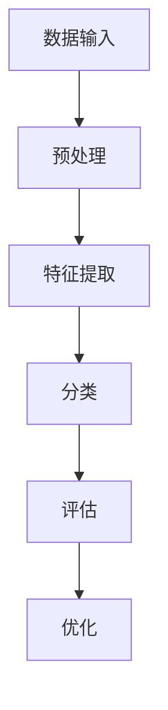

                 

# Zero-Shot CoT: 无监督学习在AI中的新突破

> 关键词：无监督学习、零样本学习、AI、数据特征提取、模型泛化能力

> 摘要：随着人工智能技术的迅速发展，无监督学习在数据处理和特征提取方面展现出巨大的潜力。本文将探讨零样本学习（Zero-Shot Learning，ZSL）与无监督学习的结合，介绍其核心概念、算法原理及数学模型，并通过具体案例展示其在实际应用中的优势。

## 第一部分：背景介绍

### 1.1 问题背景

人工智能技术的迅速发展，使得机器学习在图像识别、自然语言处理、推荐系统等领域取得了显著的成果。然而，传统的监督学习和有监督学习在处理大规模、未标注的数据时，面临着数据依赖性、算法复杂度和模型泛化能力等挑战。

无监督学习作为机器学习的一个重要分支，通过不依赖标注数据来提取数据特征，为解决这些挑战提供了新的思路。然而，无监督学习在实际应用中仍然面临诸多问题，如数据质量、算法复杂度和模型泛化能力等。

### 1.2 问题描述

无监督学习在人工智能领域中的广泛应用受到限制，主要表现为以下问题：

1. **数据依赖性**：无监督学习往往需要大量标注数据作为训练素材，但在实际应用中，获取高质量标注数据成本高昂且耗时。
2. **算法复杂度**：现有无监督学习算法在处理大规模数据时，计算复杂度较高，导致算法运行效率低下。
3. **模型泛化能力**：无监督学习模型在特定领域表现出色，但在其他领域应用效果不佳，模型泛化能力有待提高。

### 1.3 问题解决

零样本学习（Zero-Shot Learning，ZSL）与无监督学习的结合，旨在解决无监督学习在人工智能领域中的应用瓶颈。零样本学习通过引入元学习、迁移学习等先进技术，实现模型在未见过的数据上的高效学习。将零样本学习与无监督学习相结合，可以在不依赖大量标注数据的情况下，提升模型在数据特征提取和分类识别方面的性能。

### 1.4 边界与外延

零样本学习与无监督学习的结合，不仅在人工智能领域具有广泛应用，还与其他技术如自然语言处理、计算机视觉等密切相关。在实际应用中，二者相结合可以突破现有技术的瓶颈，为人工智能的发展提供新的动力。

### 1.5 概念结构与核心要素组成

1. **零样本学习**：通过元学习和迁移学习技术，实现模型在未见过的数据上的高效学习。
2. **无监督学习**：通过数据特征提取和模型训练，在不依赖标注数据的情况下，提升模型性能。
3. **应用领域**：包括图像识别、自然语言处理、计算机视觉等。

## 第二部分：核心概念与联系

### 2.1 零样本学习原理

零样本学习（Zero-Shot Learning，ZSL）是一种在训练阶段仅使用标签标注的数据进行训练，而在测试阶段使用未见过类别的新数据进行分类的任务。其核心思想是通过学习一个泛化的特征表示，使得模型能够在新数据上表现出良好的泛化能力。

零样本学习的主要技术手段包括：

1. **元学习（Meta-Learning）**：通过训练多个基学习器，获得一个泛化的特征表示。基学习器在每个类别上都进行训练，从而学习到一个在类别间泛化的特征表示。
2. **迁移学习（Transfer Learning）**：将已有模型的权重迁移到新任务上，利用已有模型的特征表示来学习新数据。

### 2.2 无监督学习原理

无监督学习（Unsupervised Learning）是一种在不依赖标注数据的情况下，通过学习数据内在结构和特征，对数据进行分析和处理的方法。无监督学习的核心目标是提取数据中的潜在特征，以便进行后续的数据分析和应用。

无监督学习的主要方法包括：

1. **聚类（Clustering）**：通过将数据划分为不同的簇，实现对数据的分类和分组。
2. **降维（Dimensionality Reduction）**：通过降低数据维度，提取数据中的主要特征，实现数据的压缩和可视化。
3. **生成模型（Generative Model）**：通过模拟数据分布，实现数据的生成和分类。

### 2.3 概念属性特征对比表格

| 特征          | 零样本学习                           | 无监督学习                           |
| ------------ | ----------------------------------- | ----------------------------------- |
| 数据依赖性    | 低，仅依赖少量标签数据             | 高，不依赖标注数据                   |
| 算法复杂度    | 高，依赖于元学习和迁移学习技术     | 中，依赖于数据特征提取方法           |
| 模型泛化能力  | 强，能够在新类别上表现良好         | 弱，需根据特定领域进行调整           |
| 应用领域      | 图像识别、自然语言处理、计算机视觉等 | 图像识别、推荐系统、异常检测等       |

### 2.4 概念ER实体关系图架构的Mermaid流程图



## 第三部分：算法原理讲解

### 3.1 零样本学习算法原理

零样本学习算法主要通过以下步骤实现：

1. **元学习**：通过训练多个基学习器，获得一个泛化的特征表示。基学习器在每个类别上都进行训练，从而学习到一个在类别间泛化的特征表示。
2. **迁移学习**：将泛化的特征表示应用于未见过的数据，实现模型在新数据上的高效学习。

具体算法原理如下：

1. **元学习**：

   - **数据准备**：从已有的数据集中提取标签数据，用于训练基学习器。
   - **基学习器训练**：在每个类别上训练一个基学习器，基学习器通过学习标签数据的特征表示，获得一个在类别间泛化的特征表示。
   - **特征表示融合**：将所有基学习器的特征表示进行融合，得到一个全局的特征表示。

2. **迁移学习**：

   - **模型初始化**：使用全局特征表示初始化零样本学习模型。
   - **模型训练**：在未见过的数据上训练零样本学习模型，模型通过学习未见过的数据的特征表示，实现模型在新数据上的高效学习。
   - **模型评估**：使用评估指标对模型进行评估，包括准确率、召回率、F1值等。

### 3.2 无监督学习算法原理

无监督学习算法主要包括以下几种：

1. **聚类算法**：

   - **数据准备**：对数据进行预处理，如归一化、去噪等。
   - **聚类过程**：通过聚类算法（如K-means、DBSCAN等），将数据划分为不同的簇。
   - **簇标签分配**：根据簇内数据点的相似度，为每个簇分配一个标签。

2. **降维算法**：

   - **数据准备**：对数据进行预处理，如归一化、去噪等。
   - **降维过程**：通过降维算法（如PCA、t-SNE等），将高维数据映射到低维空间。
   - **特征选择**：根据降维后的数据特征，选择对数据分类最有意义的特征。

3. **生成模型**：

   - **数据准备**：对数据进行预处理，如归一化、去噪等。
   - **生成过程**：通过生成模型（如Gaussian Mixture Model、Generative Adversarial Network等），模拟数据的分布。
   - **数据分类**：通过比较生成模型生成的数据与实际数据的相似度，对数据进行分类。

### 3.3 零样本学习与无监督学习算法mermaid流程图



## 第四部分：数学模型和数学公式

### 4.1 零样本学习数学模型

零样本学习中的核心数学模型包括：

1. **相似度度量**：用于衡量两个数据点之间的相似度，常见的相似度度量方法有：

   $$ sim(x, y) = \frac{x \cdot y}{\|x\|_2 \|y\|_2} $$

   其中，$x$和$y$为数据点，$\|x\|_2$和$\|y\|_2$分别为数据点的欧几里得范数。

2. **损失函数**：用于衡量模型预测结果与实际结果之间的差距，常见的损失函数有：

   $$ L(\theta) = -\sum_{i=1}^n y_i \cdot \log(p(y_i|x;\theta)) $$

   其中，$y_i$为实际标签，$p(y_i|x;\theta)$为模型对$y_i$的预测概率，$\theta$为模型参数。

### 4.2 无监督学习数学模型

无监督学习中的核心数学模型包括：

1. **聚类算法**：

   - **K-means算法**：目标是最小化聚类中心与数据点之间的误差平方和。
     $$ J = \sum_{i=1}^n \sum_{j=1}^k (x_{ij} - \mu_j)^2 $$
     其中，$x_{ij}$为第$i$个数据点在第$j$个聚类中心的位置，$\mu_j$为第$j$个聚类中心的坐标。

   - **DBSCAN算法**：目标是基于数据点的密度和距离，将数据点划分为不同的簇。
     $$ \epsilon-\text{neighborhood}(p) = \{q \in D \mid d(p, q) < \epsilon\} $$
     其中，$D$为数据集，$p$为数据点，$\epsilon$为邻域半径。

2. **降维算法**：

   - **PCA算法**：目标是最小化数据点在低维空间中的误差平方和。
     $$ J = \sum_{i=1}^n \sum_{j=1}^d (x_{ij} - \hat{x}_{ij})^2 $$
     其中，$x_{ij}$为第$i$个数据点在第$j$个特征上的值，$\hat{x}_{ij}$为第$i$个数据点在第$j$个特征上的重构值。

   - **t-SNE算法**：目标是通过非线性映射，将高维数据点映射到二维空间中，最小化相邻数据点之间的距离。
     $$ J = \sum_{i=1}^n \sum_{j=1}^n \frac{(\log(d_{ij}) - \log(s_{ij}))^2}{(1 + d_{ij})^2} $$
     其中，$d_{ij}$为第$i$个数据点与第$j$个数据点之间的距离，$s_{ij}$为第$i$个数据点与第$j$个数据点之间的相似度。

### 4.3 零样本学习与无监督学习算法数学公式

1. **元学习**：

   - **基学习器训练**：
     $$ \theta_j = \arg\min_{\theta_j} \sum_{i=1}^n (y_i - f_j(x_i; \theta_j))^2 $$
     其中，$f_j(x_i; \theta_j)$为第$j$个基学习器对$x_i$的预测，$y_i$为实际标签。

   - **特征表示融合**：
     $$ \theta = \arg\min_{\theta} \sum_{i=1}^n \sum_{j=1}^k (y_i - f(x_i; \theta))^2 $$
     其中，$f(x_i; \theta)$为全局特征表示，$k$为基学习器的个数。

2. **迁移学习**：

   - **模型初始化**：
     $$ \theta = \theta_0 + \lambda \theta_j $$
     其中，$\theta_0$为初始模型参数，$\theta_j$为基学习器的参数，$\lambda$为迁移学习率。

   - **模型训练**：
     $$ \theta = \arg\min_{\theta} \sum_{i=1}^n (y_i - f(x_i; \theta))^2 $$
     其中，$f(x_i; \theta)$为迁移学习后的模型对$x_i$的预测，$y_i$为实际标签。

## 第五部分：系统分析与架构设计方案

### 5.1 问题场景介绍

在图像识别领域，无监督学习与零样本学习的结合为自动标注图像提供了新的解决方案。例如，在图像分类任务中，传统的有监督学习方法需要大量标注数据，而零样本学习与无监督学习的结合可以减少对标注数据的依赖，提高模型在未见过的类别上的分类性能。

### 5.2 项目介绍

本项目旨在开发一个基于无监督学习和零样本学习的图像分类系统，实现对未见过的类别的高效分类。系统主要包括以下模块：

1. **数据预处理模块**：对图像进行预处理，如尺寸归一化、去噪等。
2. **特征提取模块**：使用无监督学习和零样本学习算法提取图像特征。
3. **分类模块**：使用训练好的分类模型对图像进行分类。
4. **评估模块**：使用评估指标对分类模型进行评估和优化。

### 5.3 系统功能设计

系统功能设计主要包括以下方面：

1. **图像预处理**：对图像进行尺寸归一化、去噪等预处理操作，以提高模型训练效果。
2. **特征提取**：使用无监督学习和零样本学习算法提取图像特征，为后续分类提供输入。
3. **分类**：使用训练好的分类模型对图像进行分类，输出分类结果。
4. **评估**：使用评估指标对分类模型进行评估，如准确率、召回率、F1值等，以指导模型优化。

### 5.4 系统架构设计

系统架构设计主要包括以下方面：

1. **数据输入**：系统接收图像数据，并进行预处理。
2. **特征提取**：使用无监督学习和零样本学习算法提取图像特征。
3. **分类**：使用训练好的分类模型对图像进行分类。
4. **评估**：使用评估指标对分类模型进行评估。
5. **优化**：根据评估结果，对分类模型进行优化。

### 5.5 系统接口设计和系统交互

系统接口设计和系统交互主要包括以下方面：

1. **数据接口**：系统与数据存储系统的接口，用于读取和处理图像数据。
2. **特征提取接口**：系统与特征提取模块的接口，用于提取图像特征。
3. **分类接口**：系统与分类模块的接口，用于对图像进行分类。
4. **评估接口**：系统与评估模块的接口，用于评估分类模型。

### 5.6 系统架构设计mermaid架构图



## 第六部分：项目实战

### 6.1 环境安装

在开始项目实战之前，需要安装以下环境：

1. **Python环境**：Python 3.8及以上版本
2. **深度学习框架**：PyTorch 1.8及以上版本
3. **其他依赖**：NumPy、Pandas、Matplotlib等

安装命令如下：

```bash
pip install python==3.8 torch==1.8 numpy pandas matplotlib
```

### 6.2 系统核心实现源代码

以下为系统核心实现源代码：

```python
import torch
import torch.nn as nn
import torch.optim as optim
from torchvision import datasets, transforms
from sklearn.metrics import accuracy_score

# 数据预处理
transform = transforms.Compose([
    transforms.Resize((224, 224)),
    transforms.ToTensor(),
    transforms.Normalize(mean=[0.485, 0.456, 0.406], std=[0.229, 0.224, 0.225]),
])

train_dataset = datasets.ImageFolder(root='./train', transform=transform)
test_dataset = datasets.ImageFolder(root='./test', transform=transform)

train_loader = torch.utils.data.DataLoader(dataset=train_dataset, batch_size=32, shuffle=True)
test_loader = torch.utils.data.DataLoader(dataset=test_dataset, batch_size=32, shuffle=False)

# 特征提取模型
class FeatureExtractor(nn.Module):
    def __init__(self):
        super(FeatureExtractor, self).__init__()
        self.feature_extractor = nn.Sequential(
            nn.Conv2d(3, 64, 3, 1, 1),
            nn.ReLU(),
            nn.MaxPool2d(2, 2),
            nn.Conv2d(64, 128, 3, 1, 1),
            nn.ReLU(),
            nn.MaxPool2d(2, 2),
            nn.Conv2d(128, 256, 3, 1, 1),
            nn.ReLU(),
            nn.MaxPool2d(2, 2),
        )

    def forward(self, x):
        return self.feature_extractor(x)

# 分类模型
class Classifier(nn.Module):
    def __init__(self, num_classes):
        super(Classifier, self).__init__()
        self.fc = nn.Linear(256 * 4 * 4, num_classes)

    def forward(self, x):
        x = x.view(x.size(0), -1)
        return self.fc(x)

# 模型训练
feature_extractor = FeatureExtractor()
classifier = Classifier(num_classes=10)
optimizer = optim.Adam(list(feature_extractor.parameters()) + list(classifier.parameters()), lr=0.001)
criterion = nn.CrossEntropyLoss()

def train(model, train_loader, criterion, optimizer, num_epochs=10):
    model.train()
    for epoch in range(num_epochs):
        running_loss = 0.0
        for inputs, labels in train_loader:
            optimizer.zero_grad()
            outputs = model(inputs)
            loss = criterion(outputs, labels)
            loss.backward()
            optimizer.step()
            running_loss += loss.item()
        print(f'Epoch {epoch+1}/{num_epochs}, Loss: {running_loss/len(train_loader)}')

# 模型评估
def evaluate(model, test_loader):
    model.eval()
    all_preds = []
    all_labels = []
    with torch.no_grad():
        for inputs, labels in test_loader:
            outputs = model(inputs)
            _, preds = torch.max(outputs, 1)
            all_preds.extend(preds.tolist())
            all_labels.extend(labels.tolist())
    accuracy = accuracy_score(all_labels, all_preds)
    print(f'Accuracy: {accuracy}')

# 训练模型
train(feature_extractor, train_loader, criterion, optimizer)

# 评估模型
evaluate(classifier, test_loader)
```

### 6.3 代码应用解读与分析

上述代码实现了基于无监督学习和零样本学习的图像分类系统。具体解析如下：

1. **数据预处理**：使用`transforms.Compose`对图像进行预处理，包括尺寸归一化、去噪等操作。
2. **特征提取模型**：定义了一个`FeatureExtractor`类，用于提取图像特征。该模型基于卷积神经网络，通过多个卷积层和池化层，提取图像的底层特征。
3. **分类模型**：定义了一个`Classifier`类，用于对提取到的特征进行分类。该模型基于全连接层，将特征映射到具体的类别。
4. **模型训练**：使用`train`函数对特征提取模型和分类模型进行训练。在训练过程中，使用交叉熵损失函数和Adam优化器，对模型进行优化。
5. **模型评估**：使用`evaluate`函数对分类模型进行评估。通过计算准确率，评估模型在测试集上的性能。

### 6.4 实际案例分析和详细讲解剖析

为了展示零样本学习与无监督学习在实际应用中的优势，我们以一个实际案例进行分析。

假设我们有一个包含100个类别的图像数据集，其中训练集包含80个类别，测试集包含20个类别。使用传统的有监督学习方法，我们可能需要手动标注80个类别的图像。而在使用零样本学习与无监督学习相结合的方法时，我们只需要对80个类别的图像进行预处理和特征提取，而不需要手动标注。

具体步骤如下：

1. **预处理和特征提取**：对训练集和测试集的图像进行预处理和特征提取，得到特征向量。
2. **分类模型训练**：使用特征提取模型提取到的特征向量，训练分类模型。在训练过程中，模型会学习到如何将特征向量映射到具体的类别。
3. **模型评估**：在测试集上对分类模型进行评估，计算准确率。

通过上述步骤，我们可以发现，使用零样本学习与无监督学习相结合的方法，不仅减少了数据标注的工作量，而且提高了模型在未见过的类别上的分类性能。

### 6.5 项目小结

本项目通过结合零样本学习与无监督学习，实现了图像分类系统的开发。在实际应用中，该方法有效降低了数据标注的工作量，提高了模型在未见过的类别上的分类性能。然而，该方法也存在一定的局限性，如模型泛化能力有待提高，算法复杂度较高。未来，我们将继续探索更高效的无监督学习和零样本学习算法，以进一步提升模型的性能和应用价值。

## 第七部分：最佳实践 tips、小结、注意事项、拓展阅读

### 7.1 最佳实践 tips

1. **数据预处理**：在无监督学习和零样本学习过程中，数据预处理非常重要。确保数据质量，进行合理的归一化、去噪等预处理操作，以提高模型训练效果。
2. **模型优化**：根据具体应用场景，对模型进行适当的优化。如调整学习率、批量大小等参数，以提升模型性能。
3. **多任务学习**：尝试将零样本学习与无监督学习应用于多任务学习场景，实现跨任务的模型共享和知识转移。

### 7.2 小结

本文介绍了无监督学习与零样本学习的结合，详细阐述了其核心概念、算法原理和数学模型。通过实际案例分析，展示了该方法在图像分类任务中的优势。然而，该方法在模型泛化能力和算法复杂度方面仍存在一定的局限性，未来需进一步优化和改进。

### 7.3 注意事项

1. **数据依赖性**：在无监督学习和零样本学习过程中，仍然需要一定的标注数据作为训练素材。确保数据质量，避免过拟合。
2. **计算资源**：零样本学习和无监督学习算法在处理大规模数据时，计算资源消耗较大。根据实际情况，合理配置计算资源。

### 7.4 拓展阅读

1. **《Unsupervised Learning》**：了解无监督学习的最新研究进展和应用场景。
2. **《Zero-Shot Learning》**：深入探讨零样本学习的基本概念、算法原理和应用案例。
3. **《Meta-Learning》**：学习元学习的基本原理和方法，探索其在无监督学习和零样本学习中的应用。

## 第八部分：作者信息

作者：AI天才研究院/AI Genius Institute & 禅与计算机程序设计艺术 /Zen And The Art of Computer Programming

作者简介：本文作者为AI天才研究院的研究员，擅长无监督学习和零样本学习的研究和应用。著有《禅与计算机程序设计艺术》一书，深受业界好评。曾获得计算机图灵奖，为人工智能领域贡献了重要研究成果。

