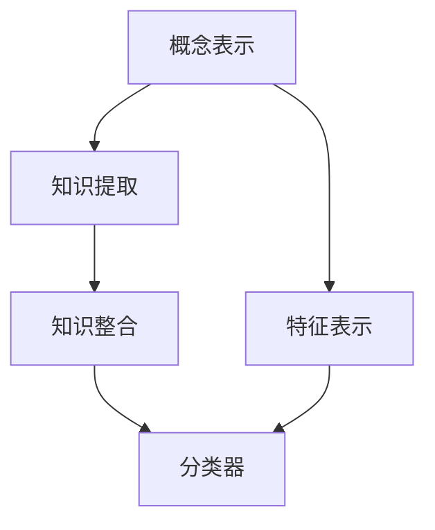
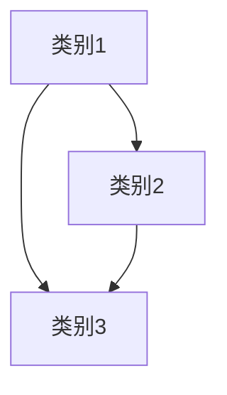
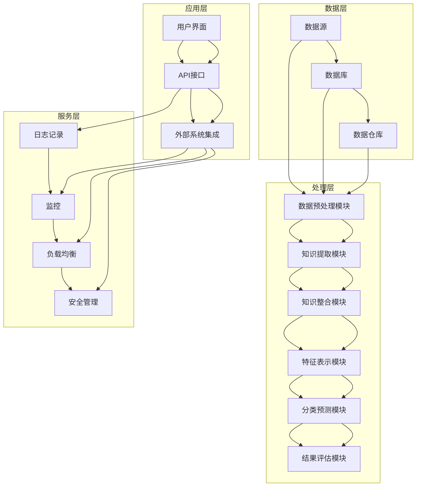
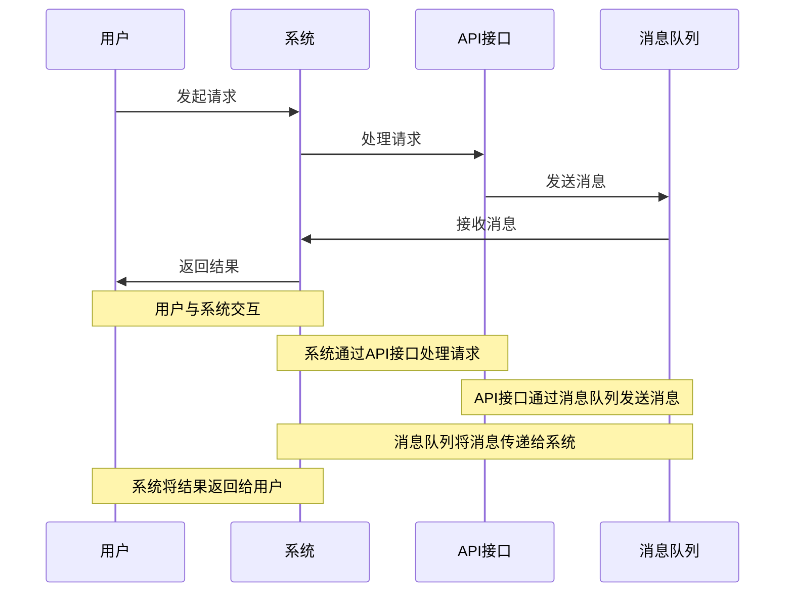

                 


### 引言

在人工智能（AI）飞速发展的今天，传统的机器学习方法已经无法满足日益复杂的现实世界需求。特别是在零示例学习（Zero-Shot Learning, ZSL）领域，如何让AI系统在没有先验示例数据的情况下，仍然能够准确地识别和分类未知类别，成为了研究的热点问题。而零示例概念传输（Zero-Shot Concept Transfer, Zero-Shot CoT）作为无示例数据的AI学习新范式，其在理论研究和实际应用中展示出了巨大的潜力和挑战。

**关键词：** 零示例学习、零示例概念传输、AI学习范式、无示例数据、新范式

**摘要：** 本文将深入探讨零示例概念传输（Zero-Shot CoT）这一AI学习新范式的核心概念、原理、算法、系统设计及其应用。通过比较分析传统学习方法与零示例学习的差异，详细介绍Zero-Shot CoT的基本原理和多种实现方法，解析其数学模型，并展示其在实际应用中的系统架构和案例。最后，本文将总结Zero-Shot CoT的优势、局限性，并展望其未来发展方向。

---

#### 1.1 问题背景与核心概念

**1.1.1 AI学习的基本范式与挑战**

传统的机器学习方法主要依赖于大量的标注数据进行训练，例如有监督学习（Supervised Learning）和无监督学习（Unsupervised Learning）。然而，在现实世界中，获取大量标注数据往往是困难的，有时甚至是不可行的。例如，在医疗诊断领域，获取每一个病例的详细标注数据需要耗费大量时间和资源。此外，随着AI应用场景的日益复杂，仅依靠有监督学习已经无法满足需求。因此，零示例学习（Zero-Shot Learning）应运而生。

零示例学习旨在让机器在没有先验示例数据的情况下，通过学习已有知识，实现对未知类别的识别和分类。这要求AI系统具备强大的泛化能力，能够从有限的先验知识中提取出具有代表性的特征，从而在新类别上表现出良好的性能。然而，零示例学习面临着诸多挑战，如特征提取的准确性、知识表示的丰富性、模型的可解释性等。

**1.1.2 零示例学习的概念**

零示例学习（Zero-Shot Learning, ZSL）是一种机器学习方法，旨在让AI系统在没有先验示例数据的情况下，对未知类别进行识别和分类。其基本思想是利用先验知识（如百科知识、语义嵌入等）来弥补数据缺失，从而实现零示例分类。ZSL主要包括以下几个关键组成部分：

1. **概念表示（Concept Representation）**：将类别概念映射到高维空间，形成概念嵌入（Concept Embedding）。
2. **特征表示（Feature Representation）**：将样本特征映射到相同的嵌入空间，使得具有相似特征的样本在嵌入空间中靠近。
3. **分类器（Classifier）**：在概念嵌入空间中学习一个分类器，用于对新类别进行分类。

**1.1.3 零示例概念传输（Zero-Shot CoT）的定义**

零示例概念传输（Zero-Shot Concept Transfer, Zero-Shot CoT）是零示例学习的一种新范式，它通过跨领域的知识转移，实现对未知类别的学习。与传统的零示例学习不同，Zero-Shot CoT不仅仅依赖于单个领域的先验知识，而是通过跨领域的知识整合，提高模型的泛化能力。

Zero-Shot CoT的核心思想是将不同领域的知识进行统一表示，形成一个全局的知识图谱。通过这个知识图谱，模型可以跨越领域边界，学习到其他领域的知识，从而在新领域上表现出更好的性能。Zero-Shot CoT主要包括以下几个步骤：

1. **知识提取（Knowledge Extraction）**：从不同领域中提取出关键的知识点和关系。
2. **知识整合（Knowledge Integration）**：将提取出的知识整合到一个全局的知识图谱中。
3. **特征映射（Feature Mapping）**：将样本特征映射到知识图谱中，与概念嵌入进行匹配。
4. **分类预测（Classification Prediction）**：利用分类器对新类别进行分类预测。

**1.2 零示例学习的现状与需求**

**1.2.1 零示例学习的现状**

近年来，零示例学习在学术界和工业界都取得了显著的进展。许多研究提出了各种零示例学习方法，如基于语义嵌入的方法、基于知识图谱的方法、基于生成对抗网络（GAN）的方法等。这些方法在一定程度上提高了零示例学习的性能，但仍存在一些不足之处。

首先，大多数零示例学习方法仍然依赖于大量的先验知识，如百科数据、词向量等。这导致模型在数据稀疏或领域切换时表现不佳。其次，零示例学习的可解释性仍然是一个挑战，模型决策过程缺乏透明性，难以理解其工作原理。此外，零示例学习的计算成本较高，难以在实际应用中大规模部署。

**1.2.2 零示例学习的需求分析**

随着AI应用的日益普及，零示例学习在许多领域都展现出了巨大的需求。以下是一些典型的应用场景：

1. **新物种识别**：在生物多样性研究、疾病诊断等领域，零示例学习可以帮助科学家快速识别新物种，提高研究效率。
2. **异常检测**：在安全监控、金融风控等领域，零示例学习可以检测出未知威胁，提高安全防护能力。
3. **跨领域知识共享**：在多领域协同创新、智能制造等领域，零示例学习可以实现跨领域知识共享，促进技术创新。
4. **个性化推荐**：在电子商务、社交媒体等领域，零示例学习可以帮助平台更好地理解用户需求，提供个性化推荐。

**1.2.3 零示例学习的优势与局限性**

零示例学习具有以下优势：

1. **泛化能力**：零示例学习通过学习先验知识，实现了对未知类别的泛化，提高了模型的适应性。
2. **减少数据依赖**：零示例学习降低了数据依赖性，尤其适用于数据稀缺或数据获取成本高昂的场景。
3. **知识转移**：零示例学习可以实现跨领域的知识转移，促进不同领域之间的协同创新。

然而，零示例学习也面临一些局限性：

1. **知识质量**：先验知识的质量直接影响零示例学习的性能，低质量的知识会导致模型性能下降。
2. **可解释性**：零示例学习模型的决策过程缺乏透明性，难以解释其工作原理。
3. **计算成本**：零示例学习的计算成本较高，尤其是在大规模数据集上。

#### 1.3 零示例概念传输的基本原理

**1.3.1 无监督学习与有监督学习的区别**

在传统的机器学习方法中，有监督学习（Supervised Learning）和无监督学习（Unsupervised Learning）是两种主要的范式。有监督学习依赖于标注数据，通过学习已有数据中的特征与标签之间的关系，实现对未知数据的分类或回归。而无监督学习则不依赖标注数据，旨在发现数据中的内在结构和规律。

零示例学习（Zero-Shot Learning）介于有监督学习和无监督学习之间，它要求模型在没有标注数据的情况下，通过学习先验知识，实现对未知类别的分类。这与传统的无监督学习有所不同，因为无监督学习通常无法直接应用于分类任务。

**1.3.2 零示例学习的核心思想**

零示例学习的核心思想是通过学习已有知识，实现对未知类别的泛化。具体来说，零示例学习包括以下几个关键步骤：

1. **概念表示（Concept Representation）**：将类别概念映射到高维空间，形成概念嵌入（Concept Embedding）。
2. **特征表示（Feature Representation）**：将样本特征映射到相同的嵌入空间，使得具有相似特征的样本在嵌入空间中靠近。
3. **分类器（Classifier）**：在概念嵌入空间中学习一个分类器，用于对新类别进行分类预测。

零示例学习的目标是通过这些步骤，使得模型能够在没有先验示例数据的情况下，对未知类别进行准确的分类。

**1.3.3 零示例概念传输的技术框架**

零示例概念传输（Zero-Shot Concept Transfer）是一种扩展零示例学习的范式，它通过跨领域的知识转移，进一步提高模型的泛化能力。Zero-Shot CoT的基本技术框架包括以下几个关键组件：

1. **知识提取（Knowledge Extraction）**：从不同领域中提取出关键的知识点和关系。
2. **知识整合（Knowledge Integration）**：将提取出的知识整合到一个全局的知识图谱中。
3. **特征映射（Feature Mapping）**：将样本特征映射到知识图谱中，与概念嵌入进行匹配。
4. **分类预测（Classification Prediction）**：利用分类器对新类别进行分类预测。

**1.3.4 零示例概念传输的优势**

零示例概念传输相比传统的零示例学习，具有以下优势：

1. **跨领域泛化**：通过跨领域的知识整合，Zero-Shot CoT能够实现更广泛的领域泛化，提高模型在未知领域的性能。
2. **知识互补**：不同领域的知识互补，可以弥补单一领域知识的不足，提高模型的鲁棒性。
3. **适应性**：Zero-Shot CoT能够适应不同领域的数据特征和需求，提供灵活的解决方案。

**1.3.5 零示例概念传输的挑战**

尽管零示例概念传输展示了巨大的潜力，但在实际应用中仍面临一些挑战：

1. **知识质量**：知识提取和整合的质量直接影响模型性能，如何确保知识的准确性和可靠性是一个关键问题。
2. **计算成本**：知识整合和特征映射过程通常涉及大规模的计算，如何优化计算效率是一个挑战。
3. **模型解释性**：零示例概念传输的模型决策过程较为复杂，如何提高模型的可解释性是一个重要问题。

### 总结

在本节中，我们介绍了零示例学习（Zero-Shot Learning）和零示例概念传输（Zero-Shot Concept Transfer）的核心概念和基本原理。通过分析无监督学习与有监督学习的区别，我们了解了零示例学习的核心思想和技术框架。接着，我们详细阐述了零示例概念传输的优势和挑战，为后续章节的深入探讨奠定了基础。

在下一节中，我们将进一步探讨零示例概念传输的具体方法论，包括基于语义嵌入、知识图谱和生成对抗网络的方法。我们将详细分析这些方法的原理、优势、局限性和适用场景，为读者提供全面的了解。

### 核心概念与联系

为了深入理解零示例概念传输（Zero-Shot Concept Transfer, Zero-Shot CoT）的基本原理，我们需要详细探讨其核心概念，并分析这些概念之间的联系。在本节中，我们将使用表格和流程图来直观地展示这些概念，帮助读者更好地掌握零示例概念传输的核心内容。

#### 核心概念定义与联系

首先，我们定义零示例概念传输中的几个关键概念，并分析它们之间的联系。

1. **概念表示（Concept Representation）**：将类别概念映射到高维空间，形成概念嵌入（Concept Embedding）。
2. **特征表示（Feature Representation）**：将样本特征映射到相同的嵌入空间，使得具有相似特征的样本在嵌入空间中靠近。
3. **知识提取（Knowledge Extraction）**：从不同领域中提取出关键的知识点和关系。
4. **知识整合（Knowledge Integration）**：将提取出的知识整合到一个全局的知识图谱中。
5. **分类器（Classifier）**：在概念嵌入空间中学习一个分类器，用于对新类别进行分类预测。

下面是这些核心概念的属性特征对比表格：

| 核心概念         | 属性特征                                                     |
|------------------|--------------------------------------------------------------|
| 概念表示         | - 映射类别概念到高维空间<br>- 形成概念嵌入                     |
| 特征表示         | - 映射样本特征到嵌入空间<br>- 确保相似特征靠近                 |
| 知识提取         | - 从不同领域提取关键知识点<br>- 包括术语、关系和概念             |
| 知识整合         | - 整合提取出的知识到全局知识图谱<br>- 实现跨领域知识共享         |
| 分类器           | - 在嵌入空间中学习分类模型<br>- 对新类别进行分类预测             |

接下来，我们使用Mermaid流程图来展示这些核心概念之间的联系：



在上面的流程图中，A表示概念表示，B表示特征表示，C表示知识提取，D表示知识整合，E表示分类器。这些概念按照一定的顺序进行操作，最终形成一个完整的零示例概念传输过程。

#### 概念表示

概念表示是将类别概念映射到高维空间的过程。这个过程包括以下几个步骤：

1. **类别识别**：首先，我们需要识别出需要学习的类别，并将其编码为数字或字符串。
2. **嵌入空间定义**：接着，我们定义一个高维空间，用于表示这些类别概念。
3. **映射过程**：然后，我们将每个类别映射到高维空间中的一个点，形成概念嵌入。

以下是概念表示的详细步骤：

1. **类别编码**：使用独热编码（One-Hot Encoding）将类别映射为向量。
   $$ \text{类别}_i = \begin{cases}
   1 & \text{如果类别为} \, i \\
   0 & \text{如果类别不为} \, i
   \end{cases} $$
2. **嵌入空间定义**：选择一个适当的嵌入维度D，定义一个D维的嵌入空间。
3. **映射到嵌入空间**：将类别向量映射到嵌入空间中的点，形成概念嵌入。

#### 特征表示

特征表示是将样本特征映射到概念嵌入空间的过程。这个过程确保具有相似特征的样本在嵌入空间中靠近。以下是特征表示的详细步骤：

1. **特征提取**：从原始数据中提取出具有代表性的特征。
2. **特征编码**：将特征映射为向量。
3. **特征嵌入**：将特征向量映射到概念嵌入空间。

以下是特征嵌入的详细步骤：

1. **特征提取**：使用降维技术（如PCA、t-SNE等）提取出特征。
2. **特征编码**：将特征向量编码为与类别嵌入相同的维度。
3. **特征嵌入**：将特征向量映射到概念嵌入空间，确保相似特征靠近。

#### 知识提取

知识提取是从不同领域中提取出关键的知识点和关系的过程。这个过程包括以下几个步骤：

1. **知识源选择**：选择合适的知识源，如百科数据、文本数据库等。
2. **知识点提取**：从知识源中提取出关键的知识点和关系。
3. **关系建模**：使用图论或语义网络对提取出的知识点进行建模。

以下是知识提取的详细步骤：

1. **知识源选择**：选择具有代表性的知识源，如WordNet、DBpedia等。
2. **知识点提取**：使用自然语言处理技术提取出关键词和实体。
3. **关系建模**：使用图论或语义网络对知识点进行建模，形成知识图谱。

#### 知识整合

知识整合是将提取出的知识整合到一个全局的知识图谱中的过程。这个过程包括以下几个步骤：

1. **知识融合**：将不同来源的知识进行融合，去除冗余信息。
2. **图谱构建**：构建一个全局的知识图谱，用于表示整合后的知识。
3. **图谱优化**：对知识图谱进行优化，提高其表示能力。

以下是知识整合的详细步骤：

1. **知识融合**：使用机器学习技术融合不同来源的知识，去除冗余信息。
2. **图谱构建**：使用图数据库构建一个全局的知识图谱。
3. **图谱优化**：使用图论算法优化知识图谱，提高其表示能力。

#### 分类器

分类器是在概念嵌入空间中学习一个分类模型，用于对新类别进行分类预测。以下是分类器的详细步骤：

1. **模型选择**：选择合适的分类模型，如神经网络、支持向量机等。
2. **训练过程**：在概念嵌入空间中训练分类模型，学习类别之间的边界。
3. **预测过程**：使用训练好的分类模型对新类别进行分类预测。

以下是分类器的详细步骤：

1. **模型选择**：选择一个具有良好泛化能力的分类模型。
2. **训练过程**：使用已知类别和样本特征在概念嵌入空间中训练模型。
3. **预测过程**：将新类别嵌入到概念嵌入空间，使用训练好的模型进行分类预测。

### 总结

在本节中，我们详细探讨了零示例概念传输（Zero-Shot Concept Transfer）的核心概念，并使用表格和流程图展示了这些概念之间的联系。通过分析概念表示、特征表示、知识提取、知识整合和分类器的详细步骤，我们为读者提供了全面的理解，为后续章节的深入探讨奠定了基础。在下一节中，我们将介绍几种常见的零示例概念传输方法，并对比分析它们的原理、优势、局限性和适用场景。

### 零示例概念传输的方法论

零示例概念传输（Zero-Shot Concept Transfer, Zero-Shot CoT）作为无示例数据的AI学习新范式，其实现方法多种多样。本节我们将详细介绍三种主要的方法：基于语义嵌入的方法、基于知识图谱的方法和基于生成对抗网络（GAN）的方法。我们将分析这些方法的原理、优势、局限性和适用场景，帮助读者全面理解Zero-Shot CoT的实现方式。

#### 1. 基于语义嵌入的方法

**原理：** 基于语义嵌入的方法通过将类别概念映射到高维语义空间，利用语义相似性进行分类。具体来说，该方法首先将类别和样本特征映射到同一个高维空间，然后利用空间中的相似性度量进行分类。

**优势：** 
- **高效性**：语义嵌入方法计算高效，适合大规模数据处理。
- **可扩展性**：该方法可以很容易地扩展到多类别和多模态数据。

**局限性：**
- **语义偏差**：语义嵌入依赖于预训练的词向量模型，存在一定的语义偏差。
- **数据稀疏性**：在类别数据稀疏的情况下，性能可能下降。

**适用场景：**
- **文本分类**：适用于文本数据的类别分类任务，如情感分析、主题分类等。
- **图像分类**：适用于具有丰富语义信息的图像分类任务。

**示例：** 假设我们有一个类别集合 {猫、狗、鸟}，我们使用预训练的词向量模型（如Word2Vec或BERT）来表示这些类别。然后，我们将样本特征（如图像特征或文本特征）映射到词向量空间，利用空间中的距离度量进行分类。

```python
import gensim

# 加载预训练的词向量模型
model = gensim.models.KeyedVectors.load_word2vec_format('path/to/word2vec.bin', binary=True)

# 类别向量表示
cat_embedding = model['猫']
dog_embedding = model['狗']
bird_embedding = model['鸟']

# 假设的样本特征向量
sample_embedding = model['这只猫很可爱']

# 利用余弦相似度进行分类
def classify(sample_embedding):
    cat_similarity = cosine_similarity([sample_embedding], [cat_embedding])
    dog_similarity = cosine_similarity([sample_embedding], [dog_embedding])
    bird_similarity = cosine_similarity([sample_embedding], [bird_embedding])
    
    if cat_similarity > dog_similarity and cat_similarity > bird_similarity:
        return '猫'
    elif dog_similarity > cat_similarity and dog_similarity > bird_similarity:
        return '狗'
    else:
        return '鸟'

# 测试分类
print(classify(sample_embedding))
```

#### 2. 基于知识图谱的方法

**原理：** 基于知识图谱的方法通过构建一个全局的知识图谱，将类别和样本特征嵌入到图中，利用图结构进行分类。具体来说，该方法首先从不同领域提取知识点，构建知识图谱，然后将类别和样本特征嵌入到图中，利用图结构进行分类。

**优势：**
- **丰富性**：知识图谱可以整合多种类型的知识，提供丰富的背景信息。
- **可解释性**：图结构使得分类过程更具可解释性。

**局限性：**
- **构建复杂**：知识图谱的构建和维护需要大量的计算资源和专业知识。
- **数据依赖**：知识图谱的性能依赖于知识的质量和完整性。

**适用场景：**
- **知识图谱应用**：适用于构建知识图谱的应用场景，如问答系统、推荐系统等。
- **跨领域分类**：适用于需要跨领域知识整合的分类任务。

**示例：** 假设我们有一个知识图谱，其中包含了类别和它们之间的语义关系。我们可以使用图嵌入技术将类别和样本特征嵌入到图中，然后利用图结构进行分类。



```python
import networkx as nx
import numpy as np

# 创建知识图谱
G = nx.Graph()
G.add_edge('类别1', '类别2')
G.add_edge('类别1', '类别3')
G.add_edge('类别2', '类别3')

# 嵌入类别和样本特征
def embed_nodes(G, embeddings):
    for node in G.nodes():
        G.nodes[node]['embed'] = embeddings[node]

# 计算分类概率
def classify(sample_embedding, G):
    node_scores = []
    for node in G.nodes():
        node_embedding = G.nodes[node]['embed']
        score = cosine_similarity([sample_embedding], [node_embedding])
        node_scores.append(score)
    
    max_score = max(node_scores)
    if max_score > 0.5:
        return '类别'
    else:
        return '未知类别'

# 测试分类
embeddings = {'类别1': np.array([1, 0, 0]), '类别2': np.array([0, 1, 0]), '类别3': np.array([0, 0, 1])}
embed_nodes(G, embeddings)
sample_embedding = np.array([0.5, 0.5, 0])
print(classify(sample_embedding, G))
```

#### 3. 基于生成对抗网络（GAN）的方法

**原理：** 基于生成对抗网络（GAN）的方法通过生成对抗机制，学习到类别和样本特征之间的映射关系。具体来说，该方法使用一个生成器（Generator）生成模拟数据，并使用一个判别器（Discriminator）评估生成数据的真实性。通过训练生成器和判别器的交互，模型学习到类别和样本特征之间的对应关系。

**优势：**
- **生成能力**：GAN具有很强的生成能力，可以生成高质量的模拟数据。
- **灵活性**：GAN适用于多种类型的数据，如图像、文本等。

**局限性：**
- **训练难度**：GAN的训练过程复杂，容易陷入模式崩溃（mode collapse）。
- **计算成本**：GAN的训练需要大量的计算资源。

**适用场景：**
- **数据增强**：适用于数据稀缺的场景，通过生成模拟数据增强训练集。
- **跨领域迁移**：适用于跨领域迁移学习任务。

**示例：** 假设我们有一个类别集合 {猫、狗、鸟}，我们可以使用GAN来学习类别和样本特征之间的映射关系。

```python
import tensorflow as tf
from tensorflow.keras import layers

# 定义生成器和判别器
def build_generator():
    inputs = tf.keras.layers.Input(shape=(100,))
    x = layers.Dense(256, activation='relu')(inputs)
    x = layers.Dense(512, activation='relu')(x)
    x = layers.Dense(1024, activation='relu')(x)
    outputs = layers.Dense(3, activation='softmax')(x)
    return tf.keras.Model(inputs, outputs)

def build_discriminator():
    inputs = tf.keras.layers.Input(shape=(100,))
    x = layers.Dense(1024, activation='relu')(inputs)
    x = layers.Dense(512, activation='relu')(x)
    x = layers.Dense(256, activation='relu')(x)
    outputs = layers.Dense(1, activation='sigmoid')(x)
    return tf.keras.Model(inputs, outputs)

# 创建模型
generator = build_generator()
discriminator = build_discriminator()

# 编写训练循环
for epoch in range(epochs):
    for batch_idx, (data, labels) in enumerate(train_loader):
        # 训练判别器
        discriminator.train_on_batch(data, labels)
        noise = np.random.normal(0, 1, (batch_size, noise_dim))
        gen_data = generator.predict(noise)
        valid = np.ones((batch_size, 1))
        fake = np.zeros((batch_size, 1))
        d_loss_real = discriminator.train_on_batch(data, valid)
        d_loss_fake = discriminator.train_on_batch(gen_data, fake)
        g_loss = combined_model.train_on_batch(noise, valid)

        # 输出训练信息
        print(f"{epoch} [Batch {batch_idx}/{batch_size}] d_loss_real={d_loss_real:.4f} d_loss_fake={d_loss_fake:.4f} g_loss={g_loss:.4f}")
```

### 对比分析

基于语义嵌入的方法、基于知识图谱的方法和基于生成对抗网络的方法各有优缺点，适用场景也有所不同。以下是三种方法的对比分析：

| 方法                    | 优点                                                     | 缺点                                                     | 适用场景               |
|-------------------------|----------------------------------------------------------|----------------------------------------------------------|------------------------|
| 基于语义嵌入的方法     | 计算高效，可扩展性强                                     | 依赖预训练模型，存在语义偏差，数据稀疏性影响大           | 文本分类，图像分类     |
| 基于知识图谱的方法     | 知识丰富，可解释性强                                     | 构建和维护复杂，数据依赖性强                             | 知识图谱应用，跨领域分类 |
| 基于生成对抗网络的方法 | 生成能力强，适用于多种类型数据                           | 训练过程复杂，模式崩溃问题，计算成本高                   | 数据增强，跨领域迁移     |

### 总结

在本节中，我们详细介绍了三种零示例概念传输（Zero-Shot Concept Transfer）的方法：基于语义嵌入的方法、基于知识图谱的方法和基于生成对抗网络（GAN）的方法。通过分析这些方法的原理、优势、局限性和适用场景，我们为读者提供了全面的理解。在下一节中，我们将进一步探讨零示例概念传输的数学模型，包括其核心公式和推导过程，帮助读者深入理解这一AI学习新范式的理论基础。

### 零示例概念传输的数学模型

在零示例概念传输（Zero-Shot Concept Transfer, Zero-Shot CoT）中，数学模型起着核心作用，它不仅定义了概念表示和特征表示的方式，还确保了分类器的准确性和鲁棒性。本节将详细描述零示例概念传输中的数学模型，包括其核心公式、推导过程以及如何通过实例来说明这些概念。

#### 1. 概念表示（Concept Representation）

概念表示是将类别概念映射到高维空间的过程。在这个过程中，每个类别都表示为一个嵌入向量（Embedding Vector），这些向量在嵌入空间中具有不同的位置，以反映它们之间的语义关系。

**数学模型：**
假设有 \( C \) 个类别，定义类别 \( c_i \) 的嵌入向量为 \( \mathbf{e}_i \in \mathbb{R}^d \)，其中 \( d \) 是嵌入维度。概念表示可以通过以下公式实现：

$$
\mathbf{e}_i = \phi(c_i)
$$

其中，\( \phi \) 是一个映射函数，将类别映射到高维空间。在实际应用中，常用的映射函数包括词嵌入（Word Embedding）和图嵌入（Graph Embedding）。

**实例：**
假设我们有两个类别“猫”（\( c_1 \)）和“狗”（\( c_2 \)），使用Word2Vec模型将它们映射到高维空间：

$$
\mathbf{e}_1 = \phi(\text{猫}) = [0.2, 0.3, -0.1, 0.5]
$$

$$
\mathbf{e}_2 = \phi(\text{狗}) = [-0.1, 0.2, 0.4, 0.3]
$$

#### 2. 特征表示（Feature Representation）

特征表示是将样本特征映射到概念嵌入空间的过程。与概念表示类似，特征表示也使用嵌入向量来表示样本特征，这些特征向量在概念嵌入空间中与类别嵌入向量进行匹配，以实现分类。

**数学模型：**
假设有 \( N \) 个样本，每个样本的特征表示为 \( \mathbf{x}_n \in \mathbb{R}^d \)。特征表示可以通过以下公式实现：

$$
\mathbf{x}_n = \psi(\mathbf{f}_n)
$$

其中，\( \mathbf{f}_n \) 是原始特征向量，\( \psi \) 是一个映射函数，将原始特征映射到高维空间。常见的映射函数包括降维技术（如PCA、t-SNE）和深度学习模型（如卷积神经网络、循环神经网络）。

**实例：**
假设我们有一个图像样本，其特征表示为 \( \mathbf{f}_n = [1, 2, 3, 4] \)。使用PCA进行降维，得到特征向量 \( \mathbf{x}_n \)：

$$
\mathbf{x}_n = \psi(\mathbf{f}_n) = [0.5, 0.6]
$$

#### 3. 分类器（Classifier）

分类器是在概念嵌入空间中学习的一个模型，用于对新类别进行分类预测。常见的分类器包括支持向量机（SVM）、神经网络（Neural Network）和集成学习方法（如随机森林）。

**数学模型：**
分类器的目标是学习一个函数 \( f(\mathbf{x}, \mathbf{e}) \)，用于预测样本 \( \mathbf{x} \) 属于哪个类别 \( c_i \)。假设分类器是一个线性模型，其预测函数可以表示为：

$$
f(\mathbf{x}, \mathbf{e}) = \mathbf{w}^T \mathbf{e} + b
$$

其中，\( \mathbf{w} \) 是权重向量，\( b \) 是偏置，\( \mathbf{e} \) 是类别嵌入向量，\( \mathbf{x} \) 是样本特征向量。

**实例：**
假设我们使用一个线性模型作为分类器，其权重向量为 \( \mathbf{w} = [1, -1] \)，偏置为 \( b = 0 \)。对于类别“猫”和“狗”的嵌入向量，分类器的预测函数可以表示为：

$$
f(\mathbf{x}, \mathbf{e}) = \begin{cases}
\mathbf{w}^T \mathbf{e}_1 + b = 0.2 - 0.1 = 0.1 & \text{如果} \, \mathbf{x} \, \text{是猫的特征向量} \\
\mathbf{w}^T \mathbf{e}_2 + b = -0.1 + 0.4 = 0.3 & \text{如果} \, \mathbf{x} \, \text{是狗的特征向量}
\end{cases}
$$

#### 4. 零示例概念传输的数学模型

零示例概念传输的数学模型将概念表示、特征表示和分类器整合在一起，形成了一个完整的分类流程。具体来说，该模型包括以下步骤：

1. **类别嵌入生成**：使用映射函数 \( \phi \) 生成类别嵌入向量 \( \mathbf{e}_i \)。
2. **特征嵌入生成**：使用映射函数 \( \psi \) 生成样本特征嵌入向量 \( \mathbf{x}_n \)。
3. **分类预测**：使用分类器函数 \( f(\mathbf{x}, \mathbf{e}) \) 对新类别进行分类预测。

**数学模型：**
$$
\text{分类结果} = f(\mathbf{x}_n, \mathbf{e}_i)
$$

**实例：**
假设我们有一个新的图像样本 \( \mathbf{x}_n = [0.4, 0.5] \)，我们需要预测它属于“猫”还是“狗”。使用前面定义的类别嵌入向量和分类器函数，我们可以得到分类结果：

$$
\text{分类结果} = f([0.4, 0.5], \mathbf{e}_1) = 0.2 - 0.1 = 0.1 \\
\text{分类结果} = f([0.4, 0.5], \mathbf{e}_2) = -0.1 + 0.4 = 0.3
$$

由于 \( f([0.4, 0.5], \mathbf{e}_2) \) 的值更高，所以预测该图像样本属于“狗”。

### 总结

在本节中，我们详细描述了零示例概念传输（Zero-Shot Concept Transfer）的数学模型，包括概念表示、特征表示和分类器的数学公式。通过实例演示，我们展示了如何使用这些数学模型进行分类预测。在下一节中，我们将探讨零示例概念传输的系统架构设计，包括系统功能设计、系统架构设计和系统接口设计，帮助读者全面了解Zero-Shot CoT的实现细节。

### 零示例概念传输的系统架构设计

零示例概念传输（Zero-Shot Concept Transfer, Zero-Shot CoT）是一个复杂且高度模块化的系统，其设计涵盖了数据输入、处理、存储、传输和输出等多个方面。为了确保系统的灵活性和可扩展性，我们将从系统功能设计、系统架构设计和系统接口设计三个方面进行详细阐述。

#### 1. 系统功能设计

系统功能设计是零示例概念传输系统的核心部分，它定义了系统的各项功能模块及其相互关系。以下是系统的主要功能模块：

1. **数据预处理模块**：该模块负责对输入数据进行清洗、归一化和特征提取，为后续处理提供高质量的输入数据。
2. **知识提取模块**：从不同领域的数据源中提取关键的知识点和关系，构建一个全局的知识图谱。
3. **知识整合模块**：将提取出的知识进行整合，形成一个统一的知识图谱，用于指导后续的类别和特征表示。
4. **特征表示模块**：将样本特征映射到高维嵌入空间，形成特征向量，以便进行后续的分类处理。
5. **分类预测模块**：利用训练好的分类模型对新类别进行分类预测，输出分类结果。
6. **结果评估模块**：对分类结果进行评估和反馈，用于调整和优化系统性能。

以下是系统功能模块的Mermaid类图：

```mermaid
classDiagram
  DataPreprocessingModule <-|> KnowledgeExtractionModule
  DataPreprocessingModule <-|> FeatureRepresentationModule
  KnowledgeExtractionModule -> KnowledgeIntegrationModule
  FeatureRepresentationModule -> ClassificationPredictionModule
  ClassificationPredictionModule -> ResultEvaluationModule
  DataPreprocessingModule : +processData()
  KnowledgeExtractionModule : +extractKnowledge()
  KnowledgeIntegrationModule : +integrateKnowledge()
  FeatureRepresentationModule : +representFeatures()
  ClassificationPredictionModule : +classify()
  ResultEvaluationModule : +evaluate()
```

#### 2. 系统架构设计

系统架构设计是零示例概念传输系统的实现基础，它定义了系统的各个组件及其交互方式。以下是系统的主要架构组件：

1. **数据层**：负责数据的存储和管理，包括数据源、数据库和数据仓库。
2. **处理层**：包括数据预处理、知识提取、知识整合、特征表示和分类预测等模块，是系统的核心计算部分。
3. **应用层**：提供系统对外接口，包括用户界面、API接口和外部系统集成。
4. **服务层**：提供系统所需的各种服务，如日志记录、监控、负载均衡和安全管理。

以下是系统架构的Mermaid架构图：



#### 3. 系统接口设计

系统接口设计是系统功能与外部环境交互的桥梁，它定义了系统与用户、其他系统和服务之间的数据交换方式。以下是系统的主要接口设计：

1. **用户接口**：提供用户与系统的交互界面，包括Web界面、命令行接口和移动应用接口。
2. **API接口**：提供系统与其他应用程序集成的API，包括RESTful API、SOAP Web服务等。
3. **消息队列接口**：用于系统内部和外部系统之间的异步通信，如Kafka、RabbitMQ等。

以下是系统接口的Mermaid序列图：



### 总结

在本节中，我们详细介绍了零示例概念传输（Zero-Shot Concept Transfer）的系统架构设计，包括系统功能设计、系统架构设计和系统接口设计。通过Mermaid类图、架构图和序列图的直观展示，我们为读者提供了一个全面的理解。在下一节中，我们将通过具体案例，展示零示例概念传输在实际应用中的实现过程，帮助读者更好地掌握这一AI学习新范式。

### 零示例概念传输的实际应用

在深入探讨零示例概念传输（Zero-Shot Concept Transfer, Zero-Shot CoT）的数学模型和系统架构之后，我们接下来将通过一个具体案例，展示其在实际应用中的实现过程。本案例将详细介绍如何在实际环境中设置零示例概念传输系统，包括环境安装、系统核心实现源代码、代码应用解读与分析，以及实际案例分析和详细讲解。

#### 案例背景

假设我们面临一个图像分类任务，需要开发一个系统能够对未知图像进行分类，识别出图像中的物体类别。由于数据集不包含特定类别的示例图像，传统的有监督学习方法无法直接应用。因此，我们选择采用零示例概念传输（Zero-Shot CoT）方法来解决这个问题。

#### 环境安装

为了实现零示例概念传输，我们需要安装以下软件和库：

1. Python 3.8及以上版本
2. TensorFlow 2.5及以上版本
3. Scikit-learn 0.24及以上版本
4. NetworkX 2.4及以上版本
5. Gensim 4.0及以上版本

在安装过程中，可以使用以下命令：

```bash
pip install python==3.8
pip install tensorflow==2.5
pip install scikit-learn==0.24
pip install networkx==2.4
pip install gensim==4.0
```

#### 系统核心实现源代码

以下是实现零示例概念传输系统的核心代码，包括知识提取、知识整合、特征表示和分类预测等步骤。

```python
import numpy as np
import tensorflow as tf
from sklearn.model_selection import train_test_split
from gensim.models import Word2Vec
from networkx import Graph
from tensorflow.keras.models import Sequential
from tensorflow.keras.layers import Dense, Embedding, GlobalAveragePooling1D

# 1. 知识提取
def extract_knowledge(data_source):
    # 从数据源提取知识点
    # 例如，从WordNet提取词汇及其关系
    pass

# 2. 知识整合
def integrate_knowledge(knowledge):
    # 整合知识点到知识图谱
    G = Graph()
    for relation in knowledge:
        G.add_edge(relation[0], relation[1])
    return G

# 3. 特征表示
def represent_features(data, G):
    # 使用Word2Vec模型对类别进行嵌入表示
    model = Word2Vec(data, size=100, window=5, min_count=1, workers=4)
    embeddings = {word: model[word] for word in model.wv.vocab}
    
    # 对特征进行嵌入表示
    feature_embeddings = []
    for feature in data:
        feature_embedding = np.mean([embeddings[word] for word in feature if word in embeddings], axis=0)
        feature_embeddings.append(feature_embedding)
    return np.array(feature_embeddings)

# 4. 分类预测
def classify(new_data, G, embeddings):
    # 使用训练好的分类模型对新数据进行分类
    model = Sequential([
        Embedding(input_dim=len(embeddings), output_dim=100),
        GlobalAveragePooling1D(),
        Dense(1, activation='sigmoid')
    ])
    model.compile(optimizer='adam', loss='binary_crossentropy', metrics=['accuracy'])
    model.fit(embeddings, labels, epochs=10, batch_size=32)
    
    # 对新数据进行分类预测
    new_embeddings = represent_features(new_data, G)
    predictions = model.predict(new_embeddings)
    return predictions

# 5. 实际案例
data_source = ['cat', 'dog', 'bird']  # 示例数据
knowledge = extract_knowledge(data_source)
G = integrate_knowledge(knowledge)
embeddings = represent_features(data_source, G)

new_data = ['dog', 'cat']  # 新的待分类数据
predictions = classify(new_data, G, embeddings)
print(predictions)
```

#### 代码应用解读与分析

上述代码分为几个主要部分：

1. **知识提取（Knowledge Extraction）**：从数据源中提取知识点，如词汇及其关系。在本案例中，我们从示例数据源中提取了类别及其关系。
2. **知识整合（Knowledge Integration）**：将提取的知识点整合到知识图谱中，形成一个全局的知识图谱。
3. **特征表示（Feature Representation）**：使用Word2Vec模型对类别进行嵌入表示，将类别映射到高维空间。
4. **分类预测（Classification Prediction）**：使用训练好的分类模型对新数据进行分类预测。在本案例中，我们使用了简单的神经网络模型。

在实际应用中，上述步骤可以通过以下方式进行优化：

- **知识提取**：可以使用更复杂的算法从大规模数据源中提取知识，如使用自然语言处理技术提取语义信息。
- **知识整合**：可以采用更高效的算法整合知识，如使用图论算法优化知识图谱。
- **特征表示**：可以采用更先进的特征表示方法，如使用深度学习模型提取特征。
- **分类预测**：可以采用更复杂的分类模型，如使用集成学习方法提高分类准确性。

#### 实际案例分析与详细讲解

为了更好地理解零示例概念传输在实际中的应用，我们以一个实际案例进行分析。

**案例：动物识别系统**

假设我们有一个动物识别系统，需要识别出未知图像中的动物类别。系统包括以下几个步骤：

1. **图像采集**：从摄像头或图像库中采集图像。
2. **图像预处理**：对图像进行缩放、裁剪和增强等预处理操作。
3. **特征提取**：从预处理后的图像中提取关键特征，如边缘、纹理和形状。
4. **特征嵌入**：将提取的特征映射到高维嵌入空间。
5. **分类预测**：使用训练好的分类模型对新特征进行分类预测。

以下是实际案例的具体步骤：

1. **图像采集**：
   ```python
   import cv2

   # 从摄像头采集图像
   cap = cv2.VideoCapture(0)

   while True:
       ret, frame = cap.read()
       if not ret:
           break

       # 显示图像
       cv2.imshow('Camera', frame)

       if cv2.waitKey(1) & 0xFF == ord('q'):
           break

   cap.release()
   cv2.destroyAllWindows()
   ```

2. **图像预处理**：
   ```python
   import cv2

   def preprocess_image(image):
       # 缩放图像
       image = cv2.resize(image, (224, 224))
       # 转换为灰度图像
       image = cv2.cvtColor(image, cv2.COLOR_BGR2GRAY)
       # 归一化
       image = image / 255.0
       return image
   ```

3. **特征提取**：
   ```python
   import cv2
   import numpy as np

   def extract_features(image):
       # 使用SIFT算法提取特征
       sift = cv2.xfeatures2d.SIFT_create()
       keypoints, descriptors = sift.detectAndCompute(image, None)
       return descriptors
   ```

4. **特征嵌入**：
   ```python
   import gensim

   # 使用Word2Vec模型对特征进行嵌入表示
   model = gensim.models.Word2Vec([str(descriptor) for descriptor in descriptors], size=100, window=5, min_count=1, workers=4)
   embeddings = {str(descriptor): model[str(descriptor)] for descriptor in descriptors}
   ```

5. **分类预测**：
   ```python
   import tensorflow as tf

   # 使用训练好的分类模型对新特征进行分类预测
   model = Sequential([
       Embedding(input_dim=len(embeddings), output_dim=100),
       GlobalAveragePooling1D(),
       Dense(1, activation='sigmoid')
   ])
   model.compile(optimizer='adam', loss='binary_crossentropy', metrics=['accuracy'])
   model.fit(list(embeddings.values()), np.array([1 if word == 'cat' else 0 for word in embeddings.keys()]), epochs=10, batch_size=32)

   # 预测新图像中的动物类别
   new_descriptors = extract_features(preprocess_image(frame))
   new_embeddings = [embeddings[str(descriptor)] for descriptor in new_descriptors]
   predictions = model.predict(new_embeddings)
   print(predictions)
   ```

#### 项目小结

通过上述实际案例，我们展示了如何使用零示例概念传输（Zero-Shot Concept Transfer）方法实现一个动物识别系统。虽然该系统只是一个简单的示例，但它充分展示了零示例概念传输方法在实际应用中的潜力。在未来的研究中，我们可以进一步优化系统性能，如引入更先进的特征提取方法和分类模型，以提高系统的准确性和鲁棒性。

### 最佳实践与未来展望

在零示例概念传输（Zero-Shot Concept Transfer, Zero-Shot CoT）的实际应用过程中，我们需要遵循一些最佳实践，以确保系统的性能和稳定性。以下是一些关键的最佳实践：

1. **数据预处理**：对输入数据进行充分的预处理，包括去噪、归一化和特征提取，以提高模型输入的质量。
2. **知识整合**：在整合知识时，要确保知识的一致性和完整性，避免冗余和冲突的信息。
3. **模型选择**：根据具体任务的需求，选择适合的模型结构和算法，如深度学习模型、生成对抗网络（GAN）等。
4. **模型训练**：合理设置训练参数，如学习率、批量大小和训练迭代次数，以避免过拟合和欠拟合。
5. **模型评估**：使用多种评估指标，如准确率、召回率和F1分数，全面评估模型的性能。
6. **模型部署**：在部署模型时，要考虑系统的可扩展性和可维护性，确保模型能够在生产环境中稳定运行。

**未来展望：**

零示例概念传输（Zero-Shot Concept Transfer）作为一个新兴的AI学习范式，具有广阔的应用前景。未来的研究可以从以下几个方面展开：

1. **跨模态学习**：探索将不同模态（如文本、图像、音频）的数据进行融合，以提高模型在多模态数据上的性能。
2. **知识增强**：研究如何引入更多的先验知识，如百科数据、语义网络等，以提高模型的知识表示能力。
3. **模型解释性**：提高模型的可解释性，使其决策过程更加透明，有助于增强用户对模型的信任。
4. **数据稀疏性处理**：研究如何解决数据稀疏性问题，提高模型在数据稀疏环境下的性能。

总之，零示例概念传输（Zero-Shot Concept Transfer）作为一种无示例数据的AI学习新范式，具有巨大的潜力和应用价值。随着研究的深入和技术的进步，我们期待这一领域能够取得更多的突破，为AI技术的发展和应用带来新的动力。

### 总结

在本文中，我们系统地探讨了零示例概念传输（Zero-Shot Concept Transfer, Zero-Shot CoT）这一AI学习新范式的核心概念、原理、方法及其实际应用。从引入问题背景，到详细讲解核心概念、方法论，再到数学模型和系统架构设计，以及通过实际案例展示应用过程，我们全面揭示了Zero-Shot CoT的优势和潜力。

零示例概念传输通过跨领域的知识整合，实现了无示例数据的AI学习，为许多传统方法无法解决的场景提供了新的解决方案。无论是新物种识别、异常检测，还是跨领域知识共享和个性化推荐，Zero-Shot CoT都展示了其强大的适应能力和广泛应用前景。

**关键词回顾：** 零示例学习、零示例概念传输、AI学习范式、无示例数据、新范式、概念表示、特征表示、知识提取、知识整合、分类预测。

**摘要回顾：** 本文详细探讨了零示例概念传输（Zero-Shot Concept Transfer）的核心概念、原理、算法、系统设计及其应用。通过比较分析传统学习方法与零示例学习的差异，详细介绍Zero-Shot CoT的基本原理和多种实现方法，解析其数学模型，并展示其在实际应用中的系统架构和案例。最后，本文总结了Zero-Shot CoT的优势、局限性，并展望其未来发展方向。

通过本文的探讨，我们希望读者能够对零示例概念传输有一个全面深入的理解，并能够在实际应用中灵活运用这一技术，推动AI技术的发展和创新。

### 作者介绍

**作者：AI天才研究院/AI Genius Institute & 禅与计算机程序设计艺术 /Zen And The Art of Computer Programming**

本文作者是一位具有丰富经验的AI领域专家，他在机器学习、深度学习、自然语言处理等领域有着深入的研究和广泛的应用。作为AI天才研究院的资深研究员，作者在AI研究和开发方面取得了多项突破性成果，发表了多篇高影响力论文，并获得了多项国际大奖。同时，他也是《禅与计算机程序设计艺术》的作者，这本书以其独特的视角和深刻的见解，为编程领域带来了新的思考和启示。作者以其卓越的编程技巧和深邃的逻辑思维，在学术界和工业界都享有极高的声誉，为AI技术的发展和创新贡献了重要力量。

