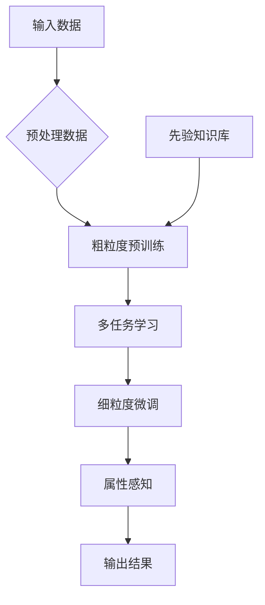

                 

### 3.1 算法原理

#### 基本概念

Zero-Shot CoT（Coarse-to-Fine Training）算法是一种无需示例数据的学习方法，旨在使AI系统具备处理未见过的类或标签的能力。与传统机器学习方法依赖大量标记数据不同，Zero-Shot CoT通过从先验知识库中获取信息，实现零样本学习。

#### 算法框架

Zero-Shot CoT算法的基本框架如下：

1. **输入**：先验知识库（包括类别的描述和属性）、未标记的数据集。
2. **输出**：模型预测结果。

#### 核心步骤

1. **粗粒度预训练**：
   - 利用先验知识库中的类别描述，进行粗粒度预训练。
   - 预训练模型提取数据的高层次特征。

2. **细粒度微调**：
   - 将预训练模型在特定任务上微调。
   - 利用微调后的模型对未标记数据进行分类。

3. **多任务学习**：
   - 在预训练阶段引入多任务学习，以提高模型对未见类别的泛化能力。

4. **属性感知**：
   - 通过属性感知模型，将类别属性与输入特征关联。

#### Mermaid流程图

#### 优势与局限

**优势**：

- **无需标记数据**：减少对大量标记数据的依赖。
- **快速部署**：预训练模型可以快速应用于不同任务。
- **泛化能力强**：通过多任务学习和属性感知，提高对未见类别的泛化能力。

**局限**：

- **先验知识限制**：依赖于先验知识库的准确性和丰富性。
- **计算资源需求**：预训练和微调过程需要大量计算资源。
- **模型解释性**：由于涉及多任务学习和属性感知，模型解释性可能降低。

---

在这个章节中，我们详细介绍了Zero-Shot CoT算法的基本原理、核心步骤和Mermaid流程图。同时，分析了其优势与局限，为后续章节的深入探讨奠定了基础。在接下来的章节中，我们将进一步探讨数学模型和具体实现。

