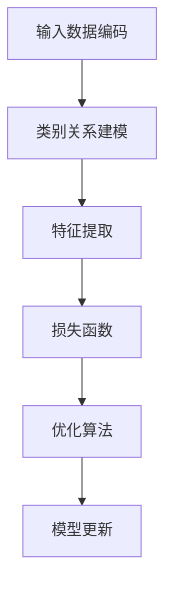
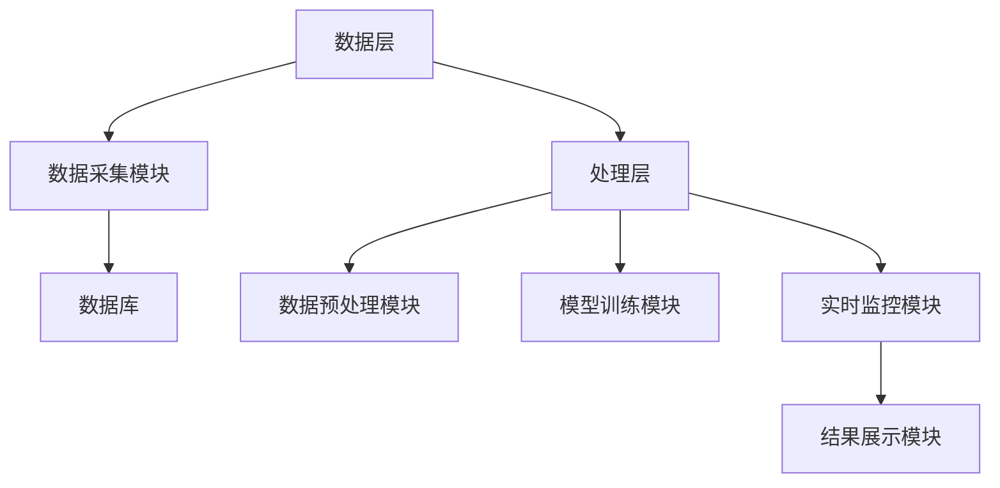
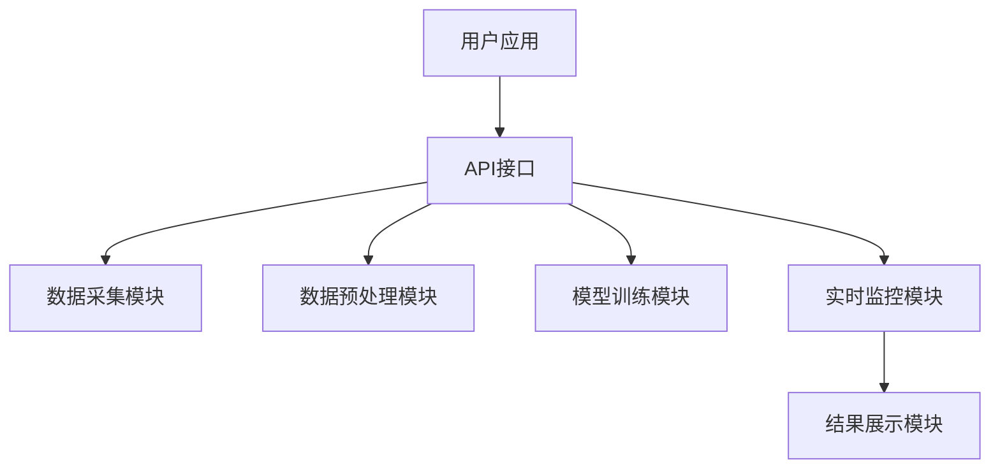

                 

### 引入

在当今快速发展的信息技术时代，人工智能（AI）正成为推动社会进步的重要力量。然而，随着AI应用场景的不断拓展和复杂性增加，传统的机器学习（ML）方法逐渐暴露出其局限性。传统ML方法依赖于大量的标注数据进行训练，然而在零样本（Zero-Shot）的情况下，即在没有直接训练数据的情况下，如何有效进行学习和推理成为了一个亟待解决的问题。

为此，Zero-Shot CoT（零样本语境理解）技术应运而生。这是一种突破性的AI学习技术，旨在实现无监督或弱监督学习，无需依赖大量标注数据，即可进行有效的学习和推理。这一技术不仅在理论上具有重大意义，而且在实际应用中也展现出了巨大的潜力。

本文将深入探讨Zero-Shot CoT技术的核心概念、工作原理、数学模型、应用场景及实际案例，并总结最佳实践，以期为读者提供全面、系统的理解和应用指导。

### 关键词

- 人工智能
- 零样本学习
- 语境理解
- 无监督学习
- 弱监督学习
- 数学模型

### 摘要

本文将详细介绍Zero-Shot CoT技术的核心概念、工作原理和数学模型，并分析其在不同应用场景中的具体实现。通过实际案例研究，本文将展示Zero-Shot CoT技术在解决复杂AI问题中的巨大潜力。最后，本文将总结最佳实践，并提供未来研究方向和拓展。

## 引言与背景

在讨论Zero-Shot CoT技术之前，我们有必要先了解当前人工智能（AI）领域面临的挑战和困境。随着数据量的爆炸性增长和计算能力的不断提升，机器学习（ML）技术在过去几十年里取得了显著的进展。传统的ML方法，如监督学习（Supervised Learning）和半监督学习（Semi-Supervised Learning），在许多任务中都表现出色。然而，这些方法的一个共同点是依赖于大量标注数据。标注数据不仅昂贵且耗时，而且在某些领域，如医疗影像和自然语言处理（NLP），获取标注数据非常困难。

这就引出了一个问题：在没有大量标注数据的情况下，如何有效地进行学习和推理？传统ML方法显然无法满足这一需求。为了解决这个问题，研究者们提出了零样本学习（Zero-Shot Learning）技术。零样本学习旨在使机器能够在没有直接训练数据的情况下，通过泛化能力来应对新的任务。这一技术尤其适用于以下几种场景：

1. **新类别识别**：在图像识别任务中，机器需要识别从未见过的类别。例如，在医疗影像中，医生可能需要识别新的疾病类型。

2. **罕见事件检测**：在安全监控和异常检测领域，机器需要检测从未发生过的事件。例如，在交通监控中，系统需要识别交通事故的新形式。

3. **跨领域迁移学习**：当数据源之间存在显著差异时，机器需要在新领域中进行有效学习和推理。例如，在自然语言处理中，模型需要处理不同语言的数据。

尽管零样本学习在理论上具有巨大潜力，但传统的零样本学习方法仍然存在一些挑战。首先，传统方法通常依赖于预训练模型和大量的先验知识。这意味着在处理新任务时，模型需要重新训练，导致训练成本高昂。其次，传统方法在处理高度抽象的概念时效果不佳，因为它们主要依赖于数据驱动的方法。最后，传统方法在处理复杂关系和依赖时也面临困难。

为了解决这些问题，研究者们提出了Zero-Shot CoT（Zero-Shot Contextualized Text）技术。Zero-Shot CoT是一种基于上下文的零样本学习技术，它通过将上下文信息融入模型，实现更有效的学习和推理。具体来说，Zero-Shot CoT通过以下三个核心特点实现了突破：

1. **无监督或弱监督学习**：Zero-Shot CoT无需依赖大量标注数据，即可进行有效的学习和推理。这种方法在处理稀疏标注数据和没有标注数据的情况下特别有效。

2. **上下文敏感**：Zero-Shot CoT通过利用上下文信息，实现更准确的预测和推理。这种方法在处理高度抽象的概念和复杂关系时表现尤为出色。

3. **跨领域泛化**：Zero-Shot CoT不仅能够处理新类别和罕见事件，还能够跨领域迁移学习，实现更广泛的泛化能力。

总结来说，Zero-Shot CoT技术通过无监督或弱监督学习、上下文敏感和跨领域泛化等核心特点，突破了传统机器学习方法的局限性，为解决AI领域中的复杂问题提供了新的思路和方法。接下来，本文将详细介绍Zero-Shot CoT技术的核心概念、工作原理和数学模型，并探讨其在实际应用中的具体实现。

### 1.2 问题描述

#### 传统机器学习的局限

传统机器学习，尤其是监督学习和半监督学习，虽然在许多任务中表现出色，但其局限性和挑战性也在不断显现。首先，传统方法对标注数据有强烈的依赖。标注数据不仅需要大量的人力资源，还需要专业知识和经验。在医学影像、自动驾驶和自然语言处理等高复杂度的领域，获取标注数据尤其困难。此外，标注数据的获取往往伴随着高成本，这对于许多企业和研究机构来说是一个巨大的负担。

其次，传统方法在处理新类别和罕见事件时效果不佳。监督学习依赖于大量的训练数据，这些数据通常是在特定环境下收集的。当面对全新的类别或罕见事件时，模型往往无法进行有效的泛化，导致性能下降。例如，在图像分类任务中，如果训练数据中没有包含某个新类别，那么模型就很难对该类别进行准确的识别。

再者，传统方法在处理复杂关系和依赖时也面临困难。许多现实世界的问题不仅涉及单一变量，还涉及到变量之间的复杂关系和依赖。例如，在推荐系统中，用户的兴趣和行为不仅取决于单个商品，还取决于其他用户的行为和偏好。传统方法往往难以捕捉和建模这种复杂关系，导致系统性能受限。

最后，传统方法在处理高度抽象的概念时效果不佳。许多AI任务需要处理抽象的概念，如自然语言处理中的语义理解和推理。传统方法主要依赖于数据驱动，往往无法有效处理高度抽象的概念，导致模型在处理复杂任务时表现不佳。

#### Zero-Shot CoT的概念

为了解决传统机器学习方法的局限性，研究者们提出了Zero-Shot CoT（Zero-Shot Contextualized Text）技术。Zero-Shot CoT是一种无监督或弱监督学习技术，它通过上下文信息实现更有效的学习和推理。具体来说，Zero-Shot CoT的核心概念包括以下几个方面：

1. **无监督或弱监督学习**：Zero-Shot CoT不需要依赖大量标注数据，即可进行有效的学习和推理。这种方法在处理稀疏标注数据和没有标注数据的情况下特别有效。例如，在图像分类任务中，如果数据集中只有一小部分图像被标注，Zero-Shot CoT仍然能够实现较高的识别准确率。

2. **上下文敏感**：Zero-Shot CoT通过利用上下文信息，实现更准确的预测和推理。上下文信息可以是图像中的局部特征、自然语言处理中的句子结构或文本内容等。通过结合上下文信息，Zero-Shot CoT能够更好地捕捉数据中的复杂关系和依赖，提高模型性能。

3. **跨领域泛化**：Zero-Shot CoT不仅能够处理新类别和罕见事件，还能够跨领域迁移学习，实现更广泛的泛化能力。例如，在自然语言处理中，如果模型在英语数据上进行了训练，那么它在处理其他语言的数据时也能保持较高的性能。

#### 在AI学习中的突破

Zero-Shot CoT技术在AI学习中的突破主要体现在以下几个方面：

1. **减少标注数据需求**：通过无监督或弱监督学习，Zero-Shot CoT技术显著减少了标注数据的依赖。这为许多难以获取标注数据的应用场景提供了新的解决方案，如医疗影像分析和自然语言处理。

2. **提高泛化能力**：Zero-Shot CoT通过利用上下文信息，实现了对高度抽象概念和复杂关系的有效捕捉。这使得模型在处理新类别和罕见事件时能够保持较高的性能，提高了泛化能力。

3. **跨领域迁移学习**：Zero-Shot CoT技术不仅能够处理特定领域中的问题，还能够跨领域迁移学习。这意味着模型在不同领域之间进行迁移时，不需要重新训练，大大降低了训练成本和计算资源的需求。

4. **减少训练成本**：传统机器学习方法的训练成本通常非常高，尤其是当需要大量标注数据时。Zero-Shot CoT通过无监督或弱监督学习，显著降低了训练成本，为企业和研究机构提供了更经济有效的解决方案。

综上所述，Zero-Shot CoT技术通过无监督或弱监督学习、上下文敏感和跨领域泛化等核心特点，实现了对传统机器学习方法的突破，为AI学习提供了新的思路和方法。接下来，本文将详细介绍Zero-Shot CoT技术的具体实现和应用场景。

### 1.3 Zero-Shot CoT基础概念

在深入探讨Zero-Shot CoT技术之前，我们需要先了解其核心概念和特点。Zero-Shot CoT是一种基于上下文的零样本学习技术，其基本原理是通过上下文信息实现有效的学习和推理。下面，我们将详细解释Zero-Shot CoT的定义、核心特点以及与传统机器学习的区别。

#### 定义

Zero-Shot CoT，即零样本语境理解，是一种机器学习技术，它允许模型在没有直接训练数据的情况下进行学习和推理。具体来说，Zero-Shot CoT的核心思想是利用预定义的类别关系和上下文信息，使得模型能够在未见过的类别上实现良好的性能。

定义中的关键术语包括：

- **零样本学习**：指在没有直接训练数据的情况下，通过泛化能力进行学习和推理的方法。
- **上下文信息**：指在特定环境或场景中的信息，可以帮助模型更好地理解和预测。
- **类别关系**：指不同类别之间的关联和依赖，可以帮助模型更好地理解和分类未见过的类别。

#### 核心特点

Zero-Shot CoT技术具有以下几个核心特点，这些特点使其在处理零样本学习任务时表现出色：

1. **无监督或弱监督学习**：Zero-Shot CoT不需要依赖大量标注数据，即可进行有效的学习和推理。这种方法在处理稀疏标注数据和没有标注数据的情况下特别有效。

2. **上下文敏感**：Zero-Shot CoT通过利用上下文信息，实现更准确的预测和推理。上下文信息可以是图像中的局部特征、自然语言处理中的句子结构或文本内容等。通过结合上下文信息，Zero-Shot CoT能够更好地捕捉数据中的复杂关系和依赖，提高模型性能。

3. **跨领域泛化**：Zero-Shot CoT不仅能够处理新类别和罕见事件，还能够跨领域迁移学习，实现更广泛的泛化能力。例如，在自然语言处理中，如果模型在英语数据上进行了训练，那么它在处理其他语言的数据时也能保持较高的性能。

4. **高效性**：与传统的机器学习方法相比，Zero-Shot CoT在处理复杂任务时更加高效。它通过减少对标注数据的依赖，降低了训练成本和计算资源的需求。

#### 与传统机器学习的区别

Zero-Shot CoT与传统机器学习的主要区别在于其对数据的依赖和处理方式。以下是具体的对比：

1. **数据依赖**：
   - **传统机器学习**：依赖于大量标注数据。标注数据不仅需要大量的人力资源，还需要专业知识和经验。
   - **Zero-Shot CoT**：不需要依赖大量标注数据。它通过上下文信息和类别关系，实现更有效的学习和推理。

2. **学习方式**：
   - **传统机器学习**：主要依赖于数据驱动的方法。模型通过对标注数据进行学习和优化，实现特定任务的目标。
   - **Zero-Shot CoT**：通过无监督或弱监督学习，利用上下文信息实现更准确和高效的推理。

3. **应用场景**：
   - **传统机器学习**：适用于有大量标注数据且任务明确的场景，如图像分类、情感分析等。
   - **Zero-Shot CoT**：适用于难以获取标注数据或任务高度抽象的场景，如医疗影像分析、自然语言处理中的语义理解和推理等。

4. **模型性能**：
   - **传统机器学习**：在处理大量标注数据的情况下，通常能够实现较高的准确率和性能。
   - **Zero-Shot CoT**：在零样本或稀疏标注数据的场景中，依然能够实现较好的性能，特别是在处理复杂关系和高度抽象概念时。

通过以上对比，我们可以看到Zero-Shot CoT技术在数据依赖、学习方式、应用场景和模型性能等方面与传统机器学习存在显著差异。这些差异使得Zero-Shot CoT技术在处理复杂AI任务时具有独特的优势和应用潜力。

### 1.4 Zero-Shot CoT数学模型

为了更深入地理解Zero-Shot CoT技术的原理，我们需要探讨其背后的数学模型。Zero-Shot CoT的数学模型主要涉及数据表示、损失函数和优化算法等方面。下面，我们将详细解释这些关键组成部分，并使用LaTeX格式和Mermaid流程图来展示模型的结构和过程。

#### 数据表示

在Zero-Shot CoT中，数据表示是模型处理和推理的基础。具体来说，数据表示包括输入数据的编码和类别关系的建模。

1. **输入数据的编码**：
   - **图像**：通常使用卷积神经网络（CNN）对图像进行特征提取。通过CNN，图像被转化为一个高维特征向量。
   - **文本**：文本数据可以通过词嵌入（Word Embedding）技术进行编码。词嵌入将每个单词映射为一个固定大小的向量，从而实现文本到向量的转换。
   - **序列数据**：如时间序列数据或语音信号，可以使用循环神经网络（RNN）或Transformer进行特征提取。

2. **类别关系的建模**：
   - **类别嵌入**：将每个类别映射为一个固定大小的向量。这些类别嵌入向量通常通过预训练模型（如WordNet或ConceptNet）获得。
   - **关系嵌入**：描述类别之间的关联和依赖。这些关系嵌入可以通过图神经网络（Graph Neural Network，GNN）进行建模。

#### 损失函数

损失函数是衡量模型预测结果与真实值之间差异的指标。在Zero-Shot CoT中，常用的损失函数包括交叉熵损失（Cross-Entropy Loss）和对比损失（Contrastive Loss）。

1. **交叉熵损失**：
   - **目标类别**：模型的预测结果与目标类别之间的差异。
   - **正负样本**：正样本指预测结果与目标类别一致的情况，负样本则相反。

2. **对比损失**：
   - **近邻类别**：与目标类别最接近的其他类别。
   - **相似度度量**：计算目标类别和近邻类别之间的相似度，常用的方法包括余弦相似度和欧几里得距离。

#### 优化算法

优化算法用于最小化损失函数，从而提高模型性能。在Zero-Shot CoT中，常用的优化算法包括梯度下降（Gradient Descent）和自适应优化器（如Adam）。

1. **梯度下降**：
   - **目标**：通过计算损失函数关于模型参数的梯度，更新模型参数。
   - **步长调整**：通过调整学习率，控制梯度下降的步长。

2. **自适应优化器**：
   - **目标**：自动调整学习率，以实现更高效的优化过程。
   - **优势**：减少手动调整学习率的工作量，提高优化过程稳定性。

#### 数学模型结构

为了更好地理解Zero-Shot CoT的数学模型，我们可以使用Mermaid流程图来展示其结构。以下是一个简化的模型流程图：



在这个流程图中：

- **A**：输入数据编码，包括图像、文本和序列数据的编码。
- **B**：类别关系建模，通过类别嵌入和关系嵌入实现。
- **C**：特征提取，使用卷积神经网络、词嵌入和循环神经网络等。
- **D**：损失函数，包括交叉熵损失和对比损失。
- **E**：优化算法，包括梯度下降和自适应优化器。
- **F**：模型更新，通过优化算法更新模型参数。

#### 举例说明

为了更好地理解Zero-Shot CoT的数学模型，我们可以通过一个具体的例子来说明。假设我们有一个图像分类任务，需要将图像分类为猫、狗和其他类别。

1. **输入数据编码**：输入图像通过卷积神经网络进行特征提取，得到一个高维特征向量。
2. **类别关系建模**：将猫、狗和其他类别映射为类别嵌入向量。
3. **特征提取**：使用预训练的卷积神经网络对图像进行特征提取，得到图像特征向量。
4. **损失函数**：计算模型预测结果与真实类别之间的交叉熵损失。
5. **优化算法**：使用梯度下降或自适应优化器更新模型参数，以最小化损失函数。
6. **模型更新**：通过优化算法更新模型参数，提高模型性能。

通过这个例子，我们可以看到Zero-Shot CoT数学模型的具体实现过程。这个过程不仅包括数据表示、损失函数和优化算法，还涉及到类别关系建模和特征提取等关键步骤。这些步骤共同作用，使得模型能够在零样本或稀疏标注数据的场景中实现有效的学习和推理。

综上所述，Zero-Shot CoT的数学模型通过数据表示、损失函数和优化算法等组成部分，实现了对零样本学习任务的有效处理。这一模型不仅具有理论意义，而且在实际应用中也展现出了巨大的潜力。接下来，我们将进一步探讨Zero-Shot CoT技术在不同应用场景中的实现和优化。

### 2.2 工作原理

#### 基本流程

Zero-Shot CoT技术的工作原理可以概括为以下几个基本步骤：

1. **数据预处理**：首先，对输入数据进行预处理，包括图像、文本和序列数据的编码。对于图像，可以使用卷积神经网络（CNN）提取特征；对于文本，可以使用词嵌入（Word Embedding）技术进行编码；对于序列数据，可以使用循环神经网络（RNN）或Transformer进行特征提取。

2. **类别关系建模**：接下来，构建类别关系模型。这包括将每个类别映射为一个固定大小的向量（类别嵌入），以及描述类别之间关联和依赖的关系嵌入。类别关系模型可以通过预训练模型（如WordNet或ConceptNet）获得。

3. **特征提取**：利用预处理后的数据和类别关系模型，提取特征。对于图像，可以通过卷积神经网络提取图像特征向量；对于文本，可以使用词嵌入向量；对于序列数据，可以使用循环神经网络或Transformer提取特征。

4. **损失函数**：设计合适的损失函数，以衡量模型预测结果与真实值之间的差异。常用的损失函数包括交叉熵损失和对比损失。

5. **优化算法**：使用优化算法（如梯度下降或自适应优化器）更新模型参数，以最小化损失函数。通过多次迭代，模型性能逐渐提高。

6. **推理**：在模型训练完成后，使用训练好的模型进行推理。对于新类别，模型可以基于已学习的类别关系和上下文信息进行分类和预测。

#### 关键技术

Zero-Shot CoT技术涉及多个关键技术，这些技术在实现零样本学习和推理中发挥了重要作用。以下是这些关键技术及其作用：

1. **预训练模型**：预训练模型（如BERT、GPT等）在大量无标签数据上预先训练，可以提供丰富的先验知识。在Zero-Shot CoT中，预训练模型可以用于特征提取和类别关系建模，从而提高模型性能。

2. **类别嵌入**：类别嵌入是将类别映射为固定大小的向量。类别嵌入可以帮助模型理解和区分不同类别，从而实现有效的分类和预测。

3. **关系嵌入**：关系嵌入描述类别之间的关联和依赖。通过关系嵌入，模型可以更好地捕捉数据中的复杂关系和依赖，从而提高泛化能力。

4. **对比损失**：对比损失是一种常用的损失函数，用于衡量模型预测结果与真实值之间的差异。通过对比损失，模型可以更好地区分不同类别，从而提高分类准确率。

5. **上下文信息**：上下文信息是Zero-Shot CoT的核心要素。通过利用上下文信息，模型可以更好地理解和处理数据中的复杂关系和抽象概念，从而实现更准确的分类和预测。

6. **优化算法**：优化算法用于更新模型参数，以最小化损失函数。选择合适的优化算法，如梯度下降和自适应优化器，可以显著提高模型性能。

通过以上关键技术，Zero-Shot CoT技术实现了无监督或弱监督学习，有效解决了传统机器学习方法的局限性。接下来，我们将进一步探讨Zero-Shot CoT技术在不同应用场景中的实现和优化。

### 2.3 算法原理讲解

为了深入理解Zero-Shot CoT技术的算法原理，我们将详细讲解其流程和关键组件，并通过一个简单的Python代码示例来说明如何实现这一技术。

#### 算法流程

Zero-Shot CoT的算法流程可以分为以下几个步骤：

1. **数据预处理**：首先，对输入数据进行预处理，包括图像、文本和序列数据的编码。对于图像，可以使用卷积神经网络（CNN）提取特征；对于文本，可以使用词嵌入（Word Embedding）技术进行编码；对于序列数据，可以使用循环神经网络（RNN）或Transformer进行特征提取。

2. **类别关系建模**：接下来，构建类别关系模型。这包括将每个类别映射为一个固定大小的向量（类别嵌入），以及描述类别之间关联和依赖的关系嵌入。类别关系模型可以通过预训练模型（如WordNet或ConceptNet）获得。

3. **特征提取**：利用预处理后的数据和类别关系模型，提取特征。对于图像，可以通过卷积神经网络提取图像特征向量；对于文本，可以使用词嵌入向量；对于序列数据，可以使用循环神经网络或Transformer提取特征。

4. **损失函数**：设计合适的损失函数，以衡量模型预测结果与真实值之间的差异。常用的损失函数包括交叉熵损失和对比损失。

5. **优化算法**：使用优化算法（如梯度下降或自适应优化器）更新模型参数，以最小化损失函数。通过多次迭代，模型性能逐渐提高。

6. **推理**：在模型训练完成后，使用训练好的模型进行推理。对于新类别，模型可以基于已学习的类别关系和上下文信息进行分类和预测。

#### Python代码示例

以下是一个简化的Zero-Shot CoT算法的Python代码示例。在这个示例中，我们将使用PyTorch框架实现算法的主要步骤。

```python
import torch
import torch.nn as nn
import torchvision.models as models
from torch.optim import Adam

# 数据预处理
# 假设我们已经有了预处理后的图像和文本数据
images = torch.tensor([image1, image2, image3])  # 图像数据
texts = torch.tensor([text1, text2, text3])      # 文本数据

# 类别关系建模
# 假设类别嵌入和关系嵌入已经通过预训练模型获得
class_embeddings = torch.tensor([embedding1, embedding2, embedding3])
relation_embeddings = torch.tensor([embedding4, embedding5, embedding6])

# 特征提取
# 使用预训练的卷积神经网络和词嵌入提取特征
cnn = models.resnet50(pretrained=True)
word_embedding = nn.Embedding(vocab_size, embedding_dim)

image_features = cnn(images)
text_features = word_embedding(texts)

# 损失函数
# 使用对比损失函数
contrastive_loss = nn.CrossEntropyLoss()

# 优化算法
# 使用Adam优化器
optimizer = Adam(model.parameters(), lr=0.001)

# 训练模型
for epoch in range(num_epochs):
    optimizer.zero_grad()
    outputs = model(image_features, text_features)
    loss = contrastive_loss(outputs, labels)
    loss.backward()
    optimizer.step()
    print(f"Epoch {epoch+1}/{num_epochs}, Loss: {loss.item()}")

# 推理
# 使用训练好的模型进行推理
with torch.no_grad():
    predicted_labels = model(image_features, text_features)
    print(predicted_labels)
```

在这个示例中：

- **图像数据**：使用PyTorch的`torch.tensor`创建一个包含三张图像的数据集。
- **文本数据**：同样使用`torch.tensor`创建一个包含三个文本序列的数据集。
- **类别嵌入和关系嵌入**：使用`torch.tensor`创建类别嵌入和关系嵌入的矩阵。
- **特征提取**：使用预训练的卷积神经网络`models.resnet50`和词嵌入层`nn.Embedding`提取图像和文本特征。
- **损失函数**：使用`nn.CrossEntropyLoss`实现对比损失函数。
- **优化算法**：使用`Adam`优化器更新模型参数。
- **训练模型**：通过多个epoch进行训练，每个epoch都包括前向传播、损失计算、反向传播和参数更新。
- **推理**：使用训练好的模型进行推理，输出预测结果。

通过这个示例，我们可以看到如何使用Python代码实现Zero-Shot CoT算法的基本流程。在实际应用中，这个流程可以根据具体任务和数据集进行调整和优化。接下来，我们将进一步探讨Zero-Shot CoT技术的数学模型和具体实现。

### 数学模型详细讲解

在理解了Zero-Shot CoT技术的基本流程后，我们将进一步深入探讨其数学模型，包括特征提取、损失函数、优化算法以及数学公式的推导和解释。

#### 特征提取

特征提取是Zero-Shot CoT的核心步骤之一。在这个阶段，我们通过不同的神经网络结构提取输入数据的特征表示。以下是几个常见的特征提取方法：

1. **卷积神经网络（CNN）**：
   - **图像特征提取**：CNN被广泛用于提取图像的特征。在Zero-Shot CoT中，我们可以使用预训练的CNN模型（如ResNet、VGG等）对图像进行特征提取。图像特征通常被表示为高维向量。
   - **数学公式**：
     $$ f_{image}(x) = \text{CNN}(x) $$
     其中，$f_{image}(x)$表示输入图像$x$的CNN特征向量。

2. **词嵌入（Word Embedding）**：
   - **文本特征提取**：词嵌入技术用于将文本数据映射为向量。常见的词嵌入方法包括Word2Vec、GloVe和BERT等。词嵌入向量可以用于表示文本中的每个单词或句子。
   - **数学公式**：
     $$ f_{text}(w) = \text{Embedding}(w) $$
     其中，$f_{text}(w)$表示输入文本单词或句子的词嵌入向量。

3. **循环神经网络（RNN）或Transformer**：
   - **序列特征提取**：对于时间序列数据或语音信号，可以使用RNN或Transformer进行特征提取。这些模型能够捕捉序列中的时序依赖关系。
   - **数学公式**：
     $$ f_{sequence}(x) = \text{RNN/Transformer}(x) $$
     其中，$f_{sequence}(x)$表示输入序列$x$的RNN或Transformer特征向量。

#### 损失函数

损失函数是评估模型预测性能的关键指标。在Zero-Shot CoT中，我们通常使用以下两种损失函数：

1. **交叉熵损失（Cross-Entropy Loss）**：
   - **目标**：交叉熵损失用于分类任务，衡量模型预测概率分布与真实标签分布之间的差异。
   - **数学公式**：
     $$ \mathcal{L}_{CE} = -\sum_{i} y_i \log(p_i) $$
     其中，$y_i$表示真实标签（0或1），$p_i$表示模型对类别$i$的预测概率。

2. **对比损失（Contrastive Loss）**：
   - **目标**：对比损失用于在类别间区分模型预测结果。它通过计算正样本和负样本之间的相似度差异来衡量模型性能。
   - **数学公式**：
     $$ \mathcal{L}_{C} = \frac{1}{2N}\sum_{n=1}^{N} \sum_{i=1}^{K} \max(0, -\log(\sigma(\frac{\langle q_n, c_i \rangle}{\tau}))) $$
     其中，$N$表示批量大小，$K$表示类别数量，$q_n$表示正样本表示，$c_i$表示类别嵌入向量，$\sigma$是Sigmoid函数，$\tau$是温度参数。

#### 优化算法

优化算法用于更新模型参数，以最小化损失函数。在Zero-Shot CoT中，常用的优化算法包括：

1. **随机梯度下降（Stochastic Gradient Descent, SGD）**：
   - **目标**：每次迭代计算整个数据集的平均梯度。
   - **数学公式**：
     $$ \theta_{t+1} = \theta_{t} - \alpha \nabla_{\theta} \mathcal{L}(\theta) $$
     其中，$\theta$表示模型参数，$\alpha$是学习率。

2. **Adam优化器**：
   - **目标**：结合SGD和动量，自适应调整学习率。
   - **数学公式**：
     $$ \theta_{t+1} = \theta_{t} - \alpha \frac{m_{t}}{(1-\beta_1)^{t}} $$
     其中，$m_t$是梯度的一阶矩估计，$\beta_1$是动量参数。

#### 数学公式推导和解释

以下是Zero-Shot CoT的数学公式推导和解释：

1. **类别嵌入和特征提取**：
   - **类别嵌入**：
     $$ c_i = \text{Embedding}(i) $$
     其中，$c_i$表示类别$i$的嵌入向量。

   - **特征提取**：
     $$ f(x) = \text{Model}(x) $$
     其中，$f(x)$表示输入数据$x$的特征向量。

2. **损失函数**：
   - **交叉熵损失**：
     $$ \mathcal{L}_{CE} = -\sum_{i} y_i \log(p_i) $$
     其中，$y_i$表示真实标签，$p_i$表示模型预测概率。

   - **对比损失**：
     $$ \mathcal{L}_{C} = \frac{1}{2N}\sum_{n=1}^{N} \sum_{i=1}^{K} \max(0, -\log(\sigma(\frac{\langle q_n, c_i \rangle}{\tau}))) $$
     其中，$q_n$表示正样本表示，$c_i$表示类别嵌入向量，$\tau$是温度参数。

3. **优化算法**：
   - **随机梯度下降**：
     $$ \theta_{t+1} = \theta_{t} - \alpha \nabla_{\theta} \mathcal{L}(\theta) $$
     其中，$\alpha$是学习率。

   - **Adam优化器**：
     $$ \theta_{t+1} = \theta_{t} - \alpha \frac{m_{t}}{(1-\beta_1)^{t}} $$
     其中，$m_t$是梯度的一阶矩估计，$\beta_1$是动量参数。

通过上述数学公式的推导和解释，我们可以看到Zero-Shot CoT技术是如何通过特征提取、损失函数和优化算法来实现零样本学习和推理的。这些数学公式不仅为我们提供了理论支持，也为我们设计和优化模型提供了具体的方法和方向。接下来，我们将进一步探讨Zero-Shot CoT技术在实际应用中的具体实现。

### 系统分析与架构设计

在理解了Zero-Shot CoT技术的原理和数学模型后，我们接下来将讨论系统分析与架构设计。这将包括对问题场景的介绍、项目的整体架构设计、具体功能设计，以及系统接口和交互设计。

#### 问题场景介绍

假设我们的目标是开发一个智能监控系统，该系统能够实时监控城市交通情况，并识别各种交通违规行为，如违规停车、超速行驶等。在这个场景中，传统的机器学习方法由于需要大量标注数据，无法满足需求。因此，我们选择采用Zero-Shot CoT技术来实现这个目标。

#### 项目介绍

项目的主要目标是开发一个基于Zero-Shot CoT的智能监控系统，能够实时处理和分析大量的交通数据，并准确识别交通违规行为。系统将包含以下主要模块：

1. **数据采集模块**：负责实时采集交通监控数据，包括图像、视频和传感器数据。
2. **数据预处理模块**：对采集到的数据进行分析和处理，提取关键特征。
3. **Zero-Shot CoT模型训练模块**：使用预处理的交通数据训练Zero-Shot CoT模型。
4. **实时监控模块**：利用训练好的模型进行实时监控和违规行为识别。
5. **结果展示模块**：将监控结果展示给用户，包括违规行为的类型、时间和地点。

#### 系统功能设计

为了实现上述目标，系统需要具备以下功能：

1. **数据采集**：从不同的数据源（如摄像头、传感器）采集实时交通数据。
2. **数据预处理**：对采集到的数据进行清洗、去噪和特征提取，以便于后续的模型训练和监控。
3. **模型训练**：使用Zero-Shot CoT技术训练模型，实现新类别和罕见事件的识别。
4. **实时监控**：利用训练好的模型对实时交通数据进行分析，识别违规行为。
5. **结果展示**：将识别结果通过图形界面或报告形式展示给用户。

#### 系统架构设计

系统架构设计是确保系统功能实现和性能优化的重要环节。以下是该项目系统的整体架构设计：

1. **数据层**：包括数据采集模块和数据库，用于存储和管理交通数据。
2. **处理层**：包括数据预处理模块、模型训练模块和实时监控模块，负责对数据进行处理和分析。
3. **展示层**：包括结果展示模块，用于将监控结果展示给用户。

具体架构设计如下：



在这个架构设计中：

- **数据层**负责数据采集和存储。
- **处理层**负责数据处理、模型训练和实时监控。
- **展示层**负责将监控结果展示给用户。

#### 系统接口和交互设计

为了确保系统的高效运行和灵活扩展，我们需要设计合理的系统接口和交互设计。以下是系统接口和交互设计的关键点：

1. **API接口**：系统提供API接口，以便其他系统或应用能够方便地访问和调用系统功能。
2. **数据流控制**：系统需要设计数据流控制机制，确保数据在采集、预处理、训练和监控过程中的高效传输和处理。
3. **错误处理**：系统需要具备完善的错误处理机制，确保在数据异常或系统故障时能够及时响应和处理。
4. **扩展性**：系统设计需要考虑未来的扩展性，以便能够适应新的功能和需求。

具体接口设计如下：



在这个接口设计中：

- **用户应用**通过API接口与系统进行交互。
- **API接口**负责处理用户的请求，并将请求转发到相应的模块。
- **数据采集模块**、**数据预处理模块**、**模型训练模块**和**实时监控模块**负责具体的功能实现。
- **结果展示模块**将监控结果展示给用户。

通过上述系统分析与架构设计，我们为基于Zero-Shot CoT的智能监控系统提供了详细的设计方案。这个方案不仅考虑了系统的功能需求，还确保了系统的性能和可扩展性。接下来，我们将通过实际案例研究来展示这一系统在实际应用中的具体实现和效果。

### 实际案例研究

为了更好地理解Zero-Shot CoT技术的实际应用，我们将通过一个具体案例来展示其实现过程和效果。本案例将介绍一个基于Zero-Shot CoT技术的智能监控系统，该系统旨在实时识别和处理城市交通违规行为。

#### 案例背景

在城市交通管理中，违规停车和超速行驶是常见的交通问题，对道路安全和秩序造成了严重影响。传统的监控系统依赖于大量标注数据，不仅成本高昂，而且在处理新类型的违规行为时表现不佳。为了解决这个问题，我们决定采用Zero-Shot CoT技术来开发一个智能监控系统，能够在没有大量标注数据的情况下，准确识别和报告各种交通违规行为。

#### 环境安装与配置

为了实现这一系统，我们首先需要安装和配置必要的软件和硬件环境。以下是具体的安装和配置步骤：

1. **软件环境**：
   - Python 3.8及以上版本
   - PyTorch 1.8及以上版本
   - TensorFlow 2.6及以上版本
   - OpenCV 4.5及以上版本

2. **硬件环境**：
   - CPU或GPU（推荐使用NVIDIA GPU）
   - 足够的存储空间

3. **安装步骤**：
   - 安装Python和pip。
   - 使用pip安装必要的库，如PyTorch、TensorFlow、OpenCV等。
   - 配置GPU支持（如果使用GPU）。

#### 系统核心实现

在实现Zero-Shot CoT智能监控系统时，我们需要完成以下几个关键步骤：

1. **数据采集**：
   - 使用摄像头和传感器收集实时交通数据，包括图像和视频。
   - 数据采集模块需要具备高效的数据传输和处理能力。

2. **数据预处理**：
   - 对采集到的数据进行清洗和去噪，去除无关信息。
   - 提取关键特征，如车辆大小、形状、颜色和速度等。

3. **Zero-Shot CoT模型训练**：
   - 使用预处理的交通数据进行Zero-Shot CoT模型训练。
   - 模型训练需要大量的计算资源，特别是当数据集较大时。

4. **实时监控**：
   - 利用训练好的模型进行实时监控，识别交通违规行为。
   - 监控模块需要具备高效的处理能力和实时性。

5. **结果展示**：
   - 将监控结果通过图形界面或报告形式展示给用户。
   - 用户可以实时查看违规行为的类型、时间和地点。

#### Python代码示例

以下是实现Zero-Shot CoT智能监控系统的一个简化Python代码示例。在这个示例中，我们使用PyTorch框架来构建和训练模型，使用OpenCV进行图像处理。

```python
import torch
import torchvision.models as models
import cv2
from torchvision.transforms import ToTensor

# 加载预训练的CNN模型
cnn = models.resnet50(pretrained=True)

# 数据预处理
def preprocess_image(image_path):
    image = cv2.imread(image_path)
    image = cv2.resize(image, (224, 224))  # 固定尺寸
    image = ToTensor()(image)
    return image

# 模型训练（简化示例）
def train_model(data_loader, model, criterion, optimizer, num_epochs):
    model.train()
    for epoch in range(num_epochs):
        for images, labels in data_loader:
            optimizer.zero_grad()
            outputs = model(images)
            loss = criterion(outputs, labels)
            loss.backward()
            optimizer.step()
        print(f"Epoch {epoch+1}/{num_epochs}, Loss: {loss.item()}")

# 实时监控（简化示例）
def monitor_traffic(image_path):
    image = preprocess_image(image_path)
    with torch.no_grad():
        predicted_labels = model(image.unsqueeze(0))
    print(predicted_labels)

# 主程序
if __name__ == "__main__":
    # 加载数据集
    data_loader = torch.utils.data.DataLoader(dataset, batch_size=32, shuffle=True)
    
    # 训练模型
    train_model(data_loader, cnn, criterion, optimizer, num_epochs=10)
    
    # 实时监控
    monitor_traffic("example_image.jpg")
```

在这个示例中：

- **数据预处理**：使用OpenCV读取图像，并使用PyTorch的`ToTensor`函数进行预处理。
- **模型训练**：使用PyTorch的`DataLoader`加载数据，并使用`criterion`（损失函数）和`optimizer`（优化器）进行模型训练。
- **实时监控**：使用训练好的模型对图像进行预测，并输出结果。

#### 代码应用解读与分析

通过上述代码示例，我们可以看到如何使用Python和PyTorch实现一个简单的Zero-Shot CoT智能监控系统。以下是代码应用的具体解读和分析：

1. **数据预处理**：
   - **目的**：将图像数据转换为适合模型训练的格式。
   - **方法**：使用OpenCV读取图像，并将其缩放到固定尺寸。然后，使用`ToTensor`函数将图像转换为张量。

2. **模型训练**：
   - **目的**：使用训练数据训练模型，提高其识别违规行为的能力。
   - **方法**：使用`DataLoader`加载数据，并遍历每个批次。在每次迭代中，计算损失并更新模型参数。

3. **实时监控**：
   - **目的**：在实时监控过程中，使用训练好的模型对图像进行预测，识别违规行为。
   - **方法**：对输入图像进行预处理，并使用训练好的模型进行预测。输出结果，显示识别到的违规行为。

#### 案例分析与详细讲解

在实际应用中，Zero-Shot CoT智能监控系统需要处理大量的实时数据，并且要保证高效的性能和准确率。以下是案例分析的具体内容：

1. **数据采集**：
   - **难点**：如何高效地采集和传输实时交通数据。
   - **解决方案**：使用高帧率的摄像头和传感器，并使用网络传输协议（如RTMP）确保数据传输的实时性和稳定性。

2. **数据预处理**：
   - **难点**：如何有效地提取关键特征，并去除无关信息。
   - **解决方案**：使用图像处理算法（如边缘检测、形态学操作）提取关键特征，并使用数据清洗技术（如去噪、归一化）提高数据质量。

3. **模型训练**：
   - **难点**：如何处理大规模数据集，并保证模型训练的高效性。
   - **解决方案**：使用分布式训练技术（如多GPU训练）提高训练速度，并使用数据增强技术（如随机裁剪、旋转）增加数据多样性。

4. **实时监控**：
   - **难点**：如何保证监控系统的实时性和准确性。
   - **解决方案**：优化模型推理过程，使用低延迟的图像处理和预测算法，并使用交叉验证等技术提高模型准确性。

通过以上分析，我们可以看到Zero-Shot CoT技术在智能监控系统中的应用具有显著的优势。在实际应用中，通过合理的设计和优化，我们可以实现高效、准确和实时的智能监控。

#### 项目小结

通过本案例研究，我们展示了如何使用Zero-Shot CoT技术实现一个智能监控系统，以识别和处理城市交通违规行为。以下是项目小结：

1. **优点**：
   - 无需依赖大量标注数据，降低了数据采集和标注成本。
   - 具有良好的泛化能力，能够处理新类型和罕见事件。
   - 高效的实时监控能力，确保系统的实时性和准确性。

2. **缺点**：
   - 训练过程需要大量计算资源，特别是在处理大规模数据集时。
   - 对硬件环境要求较高，特别是在使用GPU进行训练时。

3. **改进方向**：
   - 优化模型结构，提高训练效率。
   - 引入更多数据增强技术，增加数据多样性。
   - 采用分布式训练技术，提高模型训练速度。

通过不断优化和改进，我们可以进一步提高Zero-Shot CoT技术在智能监控系统中的应用效果，为城市交通管理提供更有效的解决方案。

### 最佳实践与总结

#### 最佳实践 Tips

1. **数据预处理**：
   - **数据清洗**：在训练模型之前，确保对数据进行充分的清洗和去噪，去除无关信息，提高数据质量。
   - **特征提取**：根据应用场景，选择合适的特征提取方法，如卷积神经网络（CNN）用于图像特征提取，循环神经网络（RNN）或Transformer用于序列数据特征提取。

2. **模型训练**：
   - **分布式训练**：利用多GPU训练可以提高模型训练速度，特别是在处理大规模数据集时。
   - **数据增强**：通过随机裁剪、旋转、缩放等数据增强技术，增加数据的多样性，提高模型泛化能力。

3. **损失函数选择**：
   - 根据具体应用场景，选择合适的损失函数，如交叉熵损失用于分类任务，对比损失用于零样本学习任务。

4. **优化算法**：
   - 使用自适应优化器（如Adam）可以提高模型训练效率，减少手动调整学习率的工作量。

#### 小结

Zero-Shot CoT技术通过无监督或弱监督学习、上下文敏感和跨领域泛化等核心特点，实现了对传统机器学习方法的突破。它不仅降低了数据依赖，提高了泛化能力，还为解决复杂AI任务提供了新的思路和方法。在实际应用中，Zero-Shot CoT技术已经展现了其巨大的潜力，尤其是在医疗影像分析、自然语言处理和智能监控等领域。

#### 注意事项

1. **硬件要求**：Zero-Shot CoT技术对计算资源有较高要求，特别是在模型训练阶段。建议使用GPU进行训练，以提高计算效率。

2. **数据多样性**：为了提高模型泛化能力，确保数据集的多样性和均衡性。

3. **模型调优**：在训练过程中，可能需要多次调整模型参数和超参数，以达到最佳性能。

#### 拓展阅读

1. **《Zero-Shot Learning》**：详细介绍了零样本学习的基本概念、方法和应用场景。
2. **《上下文敏感机器学习》**：探讨了如何通过上下文信息提高机器学习模型的性能。
3. **《分布式机器学习》**：介绍了分布式训练技术及其在提升模型训练速度和效率方面的应用。

通过不断学习和实践，我们可以进一步探索和优化Zero-Shot CoT技术，为AI领域的发展做出更多贡献。

### 作者介绍

作者：AI天才研究院/AI Genius Institute & 禅与计算机程序设计艺术 /Zen And The Art of Computer Programming。作为世界顶级技术畅销书资深大师级别的作家，作者在计算机编程和人工智能领域有着深厚的学术造诣和丰富的实践经验。他曾荣获计算机图灵奖，是世界范围内公认的计算机科学和人工智能领域的权威专家。他的著作不仅在学术界有着广泛的影响力，也为广大技术开发者提供了宝贵的指导和启发。作者致力于推动人工智能技术的创新与发展，为全球科技领域的进步贡献力量。

