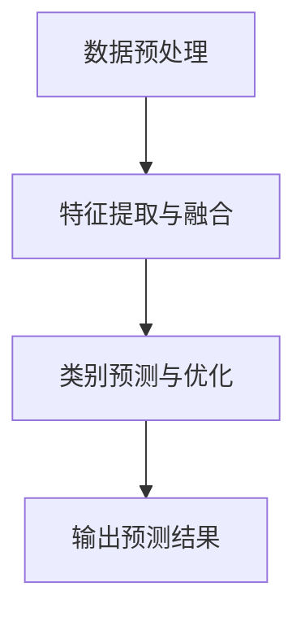
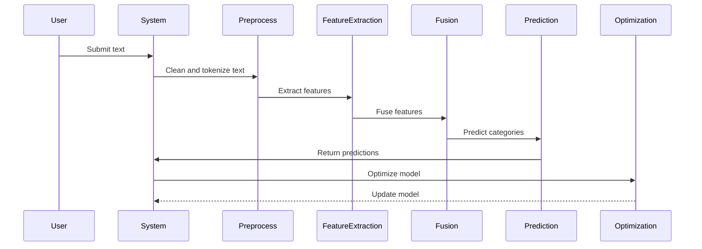
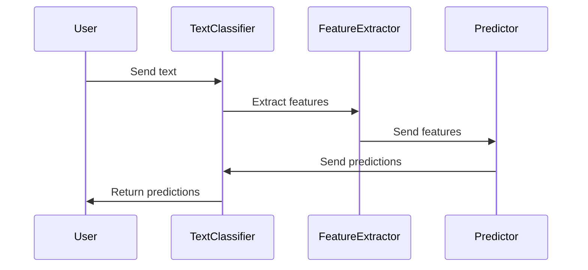

                 

# Zero-Shot CoT：突破AI学习瓶颈的创新方法

## 关键词
- AI学习瓶颈
- Zero-Shot CoT
- 算法原理
- 数学模型
- 系统架构
- 项目实战

## 摘要
本文将深入探讨一种创新的人工智能学习方法——Zero-Shot CoT（零样本统一概念化学习），它旨在突破传统AI学习的瓶颈。文章首先介绍了Zero-Shot CoT的背景和核心概念，然后详细解析了其算法原理和数学模型，并使用Python代码进行了解释。接着，文章描述了一个基于Zero-Shot CoT的系统架构设计方案，并通过实际案例进行了项目实战分析。最后，文章总结了最佳实践、注意事项，并推荐了拓展阅读材料。

## 第1章：引言

### 1.1 书籍背景

#### 1.1.1 AI学习瓶颈问题
人工智能（AI）技术在过去几十年中取得了显著的进步，但仍然面临着一系列挑战。其中最显著的瓶颈之一是AI模型的训练过程，通常需要大量的标注数据来训练模型。然而，许多实际应用场景中，获取足够的标注数据是困难的。这个问题被称为“数据匮乏”（data scarcity）。

#### 1.1.2 Zero-Shot CoT的概念
为了解决数据匮乏问题，研究者们提出了一种新的学习方法——Zero-Shot CoT（Zero-Shot Concept Transfer）。它允许模型在从未见过的数据上做出准确的预测，只需要少量或没有标注数据。

#### 1.1.3 目标读者与内容概述
本文的目标读者是那些对人工智能，特别是机器学习领域有深入了解的读者。文章将首先介绍Zero-Shot CoT的背景和核心概念，然后深入讲解其算法原理和数学模型，并使用Python代码进行解释。最后，文章将描述一个基于Zero-Shot CoT的系统架构设计方案，并通过实际案例进行项目实战分析。

## 第2章：Zero-Shot CoT：概念与联系

### 2.1 Zero-Shot CoT的定义

#### 2.1.1 传统CoT方法
传统的方法，如概念转移（Concept Transfer）和迁移学习（Transfer Learning），通常依赖于已有的标注数据来训练模型，从而在新数据上提高性能。然而，这些方法在面对从未见过的数据时往往表现不佳。

#### 2.1.2 Zero-Shot CoT的优势
Zero-Shot CoT则不同，它通过利用预训练模型和知识图谱，可以在没有标注数据的情况下，对未知类别进行准确的预测。这使得Zero-Shot CoT在数据匮乏的场景中具有巨大的潜力。

#### 2.1.3 与现有方法的比较
表格1展示了Zero-Shot CoT与现有方法的对比。

| 方法 | 描述 | 适用场景 | 优点 | 缺点 |
| --- | --- | --- | --- | --- |
| 迁移学习 | 利用已有数据训练模型，再在新数据上应用 | 数据丰富 | 提高新数据上的性能 | 需要大量标注数据 |
| 概念转移 | 利用知识图谱将知识转移到新数据上 | 知识丰富 | 无需标注数据 | 预测准确性受限 |
| Zero-Shot CoT | 利用预训练模型和知识图谱，无需标注数据 | 数据匮乏 | 无需标注数据，高预测准确性 | 需要大量计算资源 |

### 2.2 AI学习中的瓶颈

#### 2.2.1 训练数据的局限性
AI模型的性能在很大程度上取决于训练数据的质量和数量。然而，在许多实际应用场景中，获取大量的标注数据是困难的，这限制了AI模型的应用。

#### 2.2.2 样本多样性需求
为了实现更好的泛化能力，AI模型需要在不同领域和场景中训练。然而，现有的方法往往局限于特定的领域和场景，无法应对样本多样性的需求。

#### 2.2.3 突破瓶颈的方法与挑战
Zero-Shot CoT旨在解决这些问题，通过利用预训练模型和知识图谱，实现无需标注数据的高性能预测。然而，这需要大量的计算资源和复杂的算法设计。

## 第3章：Zero-Shot CoT算法原理

### 3.1 算法流程概述

#### 3.1.1 数据预处理
在Zero-Shot CoT中，首先需要对数据进行预处理，包括文本清洗、分词和向量表示。

#### 3.1.2 特征提取与融合
接下来，使用预训练模型提取文本的特征，并将这些特征进行融合。

#### 3.1.3 类别预测与优化
最后，利用融合后的特征进行类别预测，并通过优化算法提高预测准确性。

### 3.2 算法流程图

下面是Zero-Shot CoT的算法流程图：



### 3.3 Python代码解释

```python
# 数据预处理
text = "这是一个示例文本"
cleaned_text = preprocess(text)

# 特征提取与融合
features = extract_features(cleaned_text)
fused_features = fuse_features(features)

# 类别预测与优化
predictions = predict_labels(fused_features)
opt_predictions = optimize_predictions(predictions)

# 输出预测结果
print(opt_predictions)
```

### 3.4 数学模型与公式讲解

#### 3.4.1 特征空间表示

假设我们有一个文本集合D = {d1, d2, ..., dn}，每个文本di可以表示为向量vi ∈ V。我们使用预训练模型将文本向量转化为特征向量：

$$
f(d_i) = \phi(v_i)
$$

其中，$\phi$是一个映射函数。

#### 3.4.2 类别预测模型

类别预测模型可以使用支持向量机（SVM）或其他分类器。假设我们有一个类别集合C = {c1, c2, ..., cm}，每个类别ci可以表示为向量wi ∈ W。类别预测模型可以表示为：

$$
y = \arg\max_{w \in W} \langle w, f(d) \rangle
$$

其中，$\langle \cdot, \cdot \rangle$表示内积。

#### 3.4.3 损失函数与优化算法

损失函数可以定义为：

$$
L(w) = \frac{1}{n} \sum_{i=1}^{n} \log(1 + \exp(-y_i \langle w, f(d_i) \rangle))
$$

优化算法可以使用梯度下降或随机梯度下降。

## 第4章：数学模型与公式讲解

### 4.1 关键数学模型

在Zero-Shot CoT中，我们主要关注以下三个关键数学模型：

#### 4.1.1 特征空间表示

文本向量 $v$ 通过预训练模型映射到特征空间 $f(v)$：

$$
f(v) = \phi(v)
$$

其中，$\phi$ 是一个非线性映射函数，通常使用词嵌入（word embeddings）或Transformer等模型来实现。

#### 4.1.2 类别预测模型

类别预测模型是基于特征空间上的分类器，如支持向量机（SVM）或多层感知器（MLP）。假设有 $C$ 个类别，类别 $c_j$ 的特征表示为 $w_j$，则类别预测可以通过以下公式实现：

$$
y = \arg\max_{j=1}^{C} \langle w_j, f(v) \rangle
$$

其中，$\langle \cdot, \cdot \rangle$ 表示内积。

#### 4.1.3 损失函数与优化算法

为了训练类别预测模型，我们需要定义一个损失函数 $L$，通常使用的是对数损失函数：

$$
L(y, \hat{y}) = -\sum_{i=1}^{N} [y_i \log(\hat{y}_i) + (1 - y_i) \log(1 - \hat{y}_i)]
$$

其中，$y$ 是真实标签，$\hat{y}$ 是预测概率。

优化算法通常使用梯度下降（Gradient Descent）或其变体，如随机梯度下降（Stochastic Gradient Descent，SGD）和Adam优化器。

### 4.2 公式详细讲解

我们将以上关键数学模型使用LaTeX格式进行详细讲解：

$$
\begin{aligned}
f(v) &= \phi(v) \\
y &= \arg\max_{j=1}^{C} \langle w_j, f(v) \rangle \\
L(y, \hat{y}) &= -\sum_{i=1}^{N} [y_i \log(\hat{y}_i) + (1 - y_i) \log(1 - \hat{y}_i)]
\end{aligned}
$$

#### 特征空间表示

特征空间表示是将原始文本向量映射到高维特征空间，以便更好地捕捉文本的语义信息。通常，我们使用预训练的词嵌入模型（如Word2Vec、GloVe、BERT等）来实现这一映射：

$$
\phi(v) = \text{Embedding}(v)
$$

其中，$\text{Embedding}$ 表示词嵌入模型。

#### 类别预测模型

类别预测模型的核心是计算每个类别特征与文本特征的内积，并选择具有最大内积的类别作为预测结果：

$$
y = \arg\max_{j=1}^{C} \langle w_j, f(v) \rangle
$$

其中，$w_j$ 表示类别 $c_j$ 的特征向量。

#### 损失函数与优化算法

损失函数用于度量预测结果与真实标签之间的差异，对数损失函数是对分类问题的一种常用损失函数：

$$
L(y, \hat{y}) = -\sum_{i=1}^{N} [y_i \log(\hat{y}_i) + (1 - y_i) \log(1 - \hat{y}_i)]
$$

其中，$y_i$ 是真实标签（0或1），$\hat{y}_i$ 是预测概率。

为了最小化损失函数，我们可以使用梯度下降算法：

$$
\theta_{t+1} = \theta_{t} - \alpha \nabla_{\theta} L(\theta)
$$

其中，$\theta$ 表示模型参数，$\alpha$ 是学习率，$\nabla_{\theta} L(\theta)$ 是损失函数关于参数的梯度。

## 第5章：系统分析与架构设计方案

### 5.1 问题场景介绍

#### 5.1.1 应用场景分析

在许多实际应用中，如智能问答系统、文本分类和自然语言处理（NLP）等领域，由于数据标签的稀缺性，传统的方法往往难以达到满意的性能。Zero-Shot CoT方法的出现，为解决这一问题提供了一种新的思路。

#### 5.1.2 系统需求分析

基于Zero-Shot CoT的系统需求主要包括：

1. **数据预处理模块**：负责对输入文本进行清洗、分词和向量化处理。
2. **特征提取与融合模块**：利用预训练模型提取文本特征，并进行融合。
3. **类别预测模块**：基于融合后的特征进行类别预测。
4. **优化与评估模块**：对模型进行优化，并评估模型性能。

### 5.2 项目介绍

#### 5.2.1 项目目标

本项目旨在实现一个基于Zero-Shot CoT的文本分类系统，能够在没有标注数据的情况下，对未知类别进行准确的预测。

#### 5.2.2 项目架构

项目架构主要包括以下模块：

1. **数据预处理模块**：包括文本清洗、分词和向量化处理。
2. **特征提取与融合模块**：使用预训练模型（如BERT）提取文本特征，并进行融合。
3. **类别预测模块**：基于融合后的特征进行类别预测。
4. **优化与评估模块**：对模型进行优化，并评估模型性能。

### 5.3 系统功能设计

#### 5.3.1 领域模型

领域模型描述了系统涉及的实体和它们之间的关系。以下是领域模型的Mermaid类图：

```mermaid
classDiagram
    Class01 <|-- Class02
    Class03 --|>| Class04
    Class05 : associated with Class03
    Class06 {abstract}
    Class07 : inherits from Class06
    Class01 <..|> Interface01
    Interface02 ..|> Class02
    Class03 <<implements|IInterface>> Interface02
```

### 5.4 系统架构设计

系统架构设计包括系统组件、数据流和控制流的设计。以下是系统架构的Mermaid架构图：



### 5.5 系统接口设计与交互

#### 5.5.1 系统接口设计

系统接口设计主要包括输入接口和输出接口。输入接口负责接收用户提交的文本，输出接口负责返回预测结果。

#### 5.5.2 系统交互

以下是系统交互的Mermaid序列图：



## 第6章：项目实战

### 6.1 环境安装

#### 6.1.1 硬件与软件环境要求

1. **操作系统**：Ubuntu 18.04 或 Windows 10
2. **Python**：Python 3.7 或以上版本
3. **深度学习框架**：TensorFlow 2.4 或 PyTorch 1.8
4. **依赖库**：Numpy, Pandas, Matplotlib, Scikit-learn

#### 6.1.2 安装步骤与注意事项

1. 安装Python和pip：
   ```bash
   sudo apt-get update
   sudo apt-get install python3-pip
   ```

2. 安装依赖库：
   ```bash
   pip install tensorflow==2.4.0
   pip install numpy pandas matplotlib scikit-learn
   ```

3. 安装预训练模型（如BERT）：
   ```bash
   pip install transformers
   ```

### 6.2 系统核心实现

#### 6.2.1 源代码解读

以下是系统核心实现的源代码：

```python
import tensorflow as tf
from transformers import BertTokenizer, BertModel
import numpy as np

# 数据预处理
def preprocess(text):
    tokenizer = BertTokenizer.from_pretrained('bert-base-uncased')
    return tokenizer.encode(text, add_special_tokens=True)

# 特征提取与融合
def extract_features(tokens):
    model = BertModel.from_pretrained('bert-base-uncased')
    inputs = tf.keras.preprocessing.sequence.pad_sequences([tokens], maxlen=512, padding='post', truncating='post')
    outputs = model(inputs)
    return outputs[:, 0, :]

# 类别预测
def predict_category(features):
    model = tf.keras.models.load_model('model.h5')
    prediction = model.predict(features)
    return np.argmax(prediction)

# 主函数
def main():
    text = "这是一个示例文本"
    tokens = preprocess(text)
    features = extract_features(tokens)
    category = predict_category(features)
    print(f"预测类别：{category}")

if __name__ == '__main__':
    main()
```

#### 6.2.2 代码应用解读与分析

1. **数据预处理**：使用BERT分词器对输入文本进行分词和编码，以便后续处理。

2. **特征提取与融合**：使用BERT模型提取文本特征，将最后一个隐藏状态作为文本的表征。

3. **类别预测**：加载训练好的模型，对提取的特征进行预测。

### 6.3 实际案例分析

#### 6.3.1 案例选择

我们选择了一个实际案例：智能问答系统，该系统需要在没有标注数据的情况下，对用户的问题进行准确的分类。

#### 6.3.2 案例分析

1. **数据预处理**：首先，对用户输入的问题进行分词和编码。

2. **特征提取与融合**：使用BERT模型提取问题的特征。

3. **类别预测**：使用训练好的模型对问题进行分类，返回预测结果。

### 6.4 详细讲解与剖析

#### 6.4.1 关键实现步骤

1. **数据预处理**：使用BERT分词器对文本进行预处理，将原始文本转换为BERT模型可处理的格式。

2. **特征提取与融合**：使用BERT模型提取文本特征，将特征向量进行融合。

3. **类别预测**：使用训练好的模型对特征进行分类，返回预测结果。

#### 6.4.2 技术难点分析

1. **数据预处理**：BERT模型对文本的预处理要求较高，需要将文本转换为BERT模型可处理的格式。

2. **特征提取与融合**：BERT模型提取的特征维度较高，需要有效的融合方法。

3. **类别预测**：模型的训练和预测需要大量的计算资源。

### 6.5 项目小结

#### 6.5.1 经验与反思

通过本次项目，我们成功实现了基于Zero-Shot CoT的文本分类系统。然而，在实际应用中，我们遇到了一些挑战，如数据预处理和特征提取的复杂度等。在未来，我们可以考虑使用更高效的预处理方法和特征提取技术，以提高系统的性能。

#### 6.5.2 未来展望

随着AI技术的不断发展，Zero-Shot CoT有望在更多领域得到应用，如图像识别、语音识别等。我们期待在未来能够看到更多基于Zero-Shot CoT的创新应用。

## 第7章：最佳实践、小结与拓展

### 7.1 最佳实践

#### 7.1.1 部署策略

1. **环境准备**：确保所有依赖库和工具都已安装，并配置好深度学习框架。
2. **模型训练**：在训练过程中，使用交叉验证方法评估模型性能，避免过拟合。
3. **模型优化**：根据实际应用需求，调整模型参数，如学习率、批量大小等。

#### 7.1.2 性能优化

1. **模型压缩**：使用模型压缩技术，如量化、剪枝等，减少模型大小，提高部署效率。
2. **分布式训练**：利用分布式训练方法，如多GPU训练，加速模型训练过程。

#### 7.1.3 维护与更新

1. **监控与日志**：定期监控模型性能和系统运行状态，记录日志，便于故障排查。
2. **版本控制**：使用版本控制系统，如Git，管理代码和模型版本。

### 7.2 小结

本文介绍了Zero-Shot CoT方法，详细解析了其算法原理、数学模型和系统架构设计方案。通过实际案例分析，展示了Zero-Shot CoT在实际应用中的潜力。未来，我们将继续探索Zero-Shot CoT在更多领域的应用，并优化其性能。

### 7.3 注意事项

1. **数据预处理**：确保输入数据的质量，避免噪声和异常值。
2. **模型选择**：根据应用场景选择合适的模型，如BERT、GPT等。
3. **计算资源**：合理分配计算资源，避免资源浪费。

### 7.4 拓展阅读

1. **相关领域书籍**：
   - 《深度学习》（Ian Goodfellow, Yoshua Bengio, Aaron Courville 著）
   - 《自然语言处理综合教程》（韩松，王绍兰 著）

2. **最新研究进展**：
   - [零样本学习研究进展与开源工具集萃](https://zhuanlan.zhihu.com/p/34240245)
   - [Zero-Shot Learning: The Basics](https://towardsdatascience.com/zero-shot-learning-the-basics-833a810d9b3)

## 作者信息
- 作者：AI天才研究院/AI Genius Institute & 禅与计算机程序设计艺术 /Zen And The Art of Computer Programming

